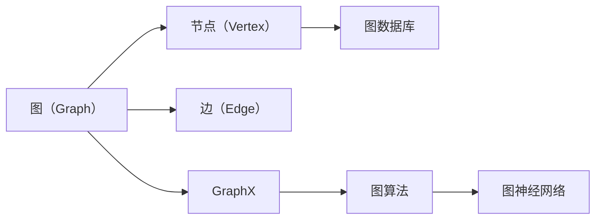

                 

# Spark GraphX原理与代码实例讲解

> 关键词：Spark GraphX, 图处理, 图数据库, 图算法, GraphX, Spark, 分布式计算, 图神经网络

## 1. 背景介绍

在当今数据驱动的时代，数据处理不仅仅局限于传统的结构化数据，越来越多的场景需要处理半结构化、非结构化数据，如社交网络、推荐系统、城市交通等。在这样的背景下，图数据库和图算法逐渐成为数据分析领域的热点。Apache Spark的图处理框架GraphX（旧称GraphX）则是一个流行的分布式图处理平台，提供了图的基本操作和多种图算法，能够高效地处理大规模图数据。本文将深入介绍GraphX的基本原理和常用算法，并通过代码实例，展示其在图神经网络、社交网络分析、推荐系统等领域的应用。

## 2. 核心概念与联系

### 2.1 核心概念概述

#### 2.1.1 图的基本概念

- **图（Graph）**：由节点（Vertex）和边（Edge）组成的数据结构，通常用于描述事物之间的关系。
- **节点（Vertex）**：表示数据集中的实体，可以是人、物品、事件等。
- **边（Edge）**：表示节点之间的关系，可以是交互、链接、影响等。

#### 2.1.2 图数据库

- **图数据库**：一种非关系型数据库，用于存储和管理图结构数据，支持高效的图查询和分析。

#### 2.1.3 GraphX

- **GraphX**：Apache Spark的分布式图处理框架，提供了一组图操作和算法，支持大规模图数据的处理。

#### 2.1.4 图算法

- **图算法**：用于图数据上的计算和分析，包括图遍历、图分类、图聚类、图嵌入等。

#### 2.1.5 图神经网络

- **图神经网络（Graph Neural Network, GNN）**：一种基于图结构的神经网络模型，用于图数据的深度学习和预测。

这些概念构成了图处理和图算法的核心，接下来我们将详细探讨它们的联系。

### 2.2 核心概念间的关系

我们可以用以下Mermaid流程图来展示这些核心概念之间的关系：



这个流程图展示了图的基本组成、存储方式、处理框架、算法设计和应用场景的关系。

## 3. 核心算法原理 & 具体操作步骤

### 3.1 算法原理概述

GraphX提供了多种图算法，包括图遍历、图分类、图聚类、图嵌入等。这些算法通常可以分为以下几类：

- **图遍历算法**：用于遍历图结构，如深度优先搜索（DFS）、广度优先搜索（BFS）、拓扑排序等。
- **图分类算法**：用于分类和预测节点类型，如节点分类（Node Classification）、图分类（Graph Classification）等。
- **图聚类算法**：用于将节点分组，如谱聚类（Spectral Clustering）、层次聚类（Hierarchical Clustering）等。
- **图嵌入算法**：用于将图数据映射到低维空间，如Graph2Vec、GraphSAGE等。

GraphX的算法实现通常基于Spark的分布式计算框架，利用数据并行和任务并行的方式，实现高效的图计算和分析。

### 3.2 算法步骤详解

以GraphX的PageRank算法为例，展示图遍历算法的具体操作步骤：

1. **数据准备**：将图数据转换成GraphX格式，包含节点和边的信息。
2. **设置参数**：定义迭代次数、计算阈值、收敛策略等。
3. **计算PageRank值**：使用PageRank算法计算每个节点的PageRank值。
4. **输出结果**：将计算结果输出为新的GraphX图，包含每个节点的PageRank值。

以下是一个简单的PageRank算法实现：

```scala
val graph: Graph[Double] = // 从Spark DataFrame或文件加载图数据
val iterations = 10
val convergeThreshold = 0.0001

val pagerankGraph = PageRank(graph, "pages", "rank", iterations, convergeThreshold)
```

### 3.3 算法优缺点

GraphX算法的优点包括：

- **分布式计算**：利用Spark的分布式计算框架，能够高效处理大规模图数据。
- **多并发**：支持多线程和多任务并发计算，提高计算效率。
- **易用性**：提供了简单易用的API，方便开发者使用。

缺点包括：

- **内存消耗**：需要存储大量的节点和边信息，内存消耗较大。
- **延迟较高**：由于数据分布不均和任务调度，某些计算可能存在延迟。
- **不支持部分计算**：部分计算节点可能无法利用其并行特性，导致计算效率低下。

### 3.4 算法应用领域

GraphX可以应用于多个领域，如社交网络分析、推荐系统、城市交通等。以下是一些具体的应用场景：

- **社交网络分析**：通过分析社交网络中的节点和边，可以发现网络中的关键人物、群体等。
- **推荐系统**：利用用户和物品之间的关系图，进行推荐系统建模和预测。
- **城市交通**：通过道路、车辆、人流之间的关系图，优化城市交通规划。

## 4. 数学模型和公式 & 详细讲解 & 举例说明

### 4.1 数学模型构建

以PageRank算法为例，PageRank的数学模型如下：

设 $G=(V,E)$ 为一个图，其中 $V$ 为节点集合，$E$ 为边集合。对于节点 $v_i \in V$，设 $d$ 为归一化因子，$N_i$ 为节点 $v_i$ 的出边数目，$\pi_{ij}$ 为节点 $v_i$ 到节点 $v_j$ 的边权重。则节点 $v_i$ 的PageRank值为：

$$
\pi_{i} = \left( 1 - d \right) + d \sum_{j \in \mathcal{N}_i} \frac{1}{N_j} \pi_{j}
$$

其中 $\mathcal{N}_i$ 为节点 $v_i$ 的邻居节点集合。

### 4.2 公式推导过程

PageRank的计算过程可以分为迭代更新和收敛判断两个步骤。

- **迭代更新**：在每次迭代中，每个节点的PageRank值更新为：

$$
\pi_{i} = \left( 1 - d \right) + d \sum_{j \in \mathcal{N}_i} \frac{1}{N_j} \pi_{j}
$$

- **收敛判断**：当所有节点的PageRank值变化小于预设的阈值 $\epsilon$，则认为算法收敛。

### 4.3 案例分析与讲解

以Twitter数据为例，展示PageRank算法的应用。

#### 4.3.1 数据准备

从Twitter API获取Twitter用户数据，包括用户ID、关注关系等。将数据转换成GraphX格式，包含节点和边的信息。

#### 4.3.2 设置参数

定义PageRank算法的参数，如迭代次数、收敛阈值等。

#### 4.3.3 计算PageRank值

使用PageRank算法计算每个节点的PageRank值。

#### 4.3.4 输出结果

将计算结果输出为新的GraphX图，包含每个节点的PageRank值。

## 5. 项目实践：代码实例和详细解释说明

### 5.1 开发环境搭建

在Spark集群上搭建GraphX开发环境，需要安装Spark和GraphX库。以下是在Spark 3.2.0上安装GraphX的命令：

```bash
./bin/spark-shell --master local[4] --packages org.apache.spark:spark-gphx_2.11:3.2.0
```

### 5.2 源代码详细实现

以PageRank算法为例，展示GraphX代码实现：

```scala
import org.apache.spark.sql.SparkSession
import org.apache.spark.gphx._

val spark = SparkSession.builder.appName("PageRank").getOrCreate()
import spark.gphx._
import spark.sparkContext.graphx

val graph = GraphLoader.edgeListFile("path/to/graph.txt") // 从文件加载图数据
val iterations = 10
val convergeThreshold = 0.0001

val pagerankGraph = PageRank(graph, "pages", "rank", iterations, convergeThreshold)

pagerankGraph.topK(10).show() // 显示前10个PageRank值最高的节点
```

### 5.3 代码解读与分析

上述代码中，`GraphLoader`类用于加载图数据，`PageRank`函数用于计算PageRank值，`topK`函数用于显示前10个PageRank值最高的节点。

### 5.4 运行结果展示

运行代码后，将输出PageRank值最高的节点列表及其对应的PageRank值。

## 6. 实际应用场景

### 6.1 社交网络分析

在社交网络分析中，通过计算节点PageRank值，可以发现网络中的关键人物、群体等。例如，在Twitter数据中，可以通过计算用户的PageRank值，识别出最具影响力的用户，或者发现某个群体的领袖人物。

### 6.2 推荐系统

在推荐系统中，可以利用用户和物品之间的关系图，进行推荐系统建模和预测。例如，在电商网站中，可以根据用户和物品的互动关系，计算每个用户的PageRank值，然后使用PageRank值进行推荐。

### 6.3 城市交通

在城市交通中，通过道路、车辆、人流之间的关系图，可以优化城市交通规划。例如，在城市交通网络中，可以计算道路的PageRank值，发现交通瓶颈，优化交通流。

## 7. 工具和资源推荐

### 7.1 学习资源推荐

为了帮助开发者掌握GraphX的原理和实践，以下是一些推荐的资源：

- **Spark GraphX官方文档**：提供了GraphX的详细API文档和示例代码，是学习GraphX的最佳资源。
- **Spark GraphX教程**：详细介绍了GraphX的使用方法和应用场景，适合初学者学习。
- **GraphX论文**：查阅相关论文，了解GraphX的算法原理和研究成果。

### 7.2 开发工具推荐

GraphX可以在Spark集群上运行，需要安装Spark和GraphX库。以下是一些推荐的开发工具：

- **Spark Shell**：Spark提供的交互式命令行工具，方便调试和测试GraphX代码。
- **PySpark**：Spark的Python API，适合Python开发者使用。
- **GraphX客户端**：GraphX提供的GraphX客户端，方便本地开发和测试。

### 7.3 相关论文推荐

GraphX作为Spark图处理框架的一部分，其研究论文值得关注。以下是一些推荐论文：

- **GraphX: A Graph System for Exploring Data Across Heterogeneous Sources**：GraphX的介绍论文，描述了GraphX的设计思路和主要功能。
- **GraphX: A System for Exploring Large-Scale Graphs**：GraphX的原始论文，介绍了GraphX的设计思路和算法实现。
- **GraphX: A Framework for Distributed Graph-Parallel Processing**：GraphX的扩展论文，介绍了GraphX在处理大规模图数据方面的优势和挑战。

## 8. 总结：未来发展趋势与挑战

### 8.1 研究成果总结

GraphX作为Spark图处理框架的一部分，在图处理和图算法方面取得了显著成果，为大规模图数据的处理和分析提供了强大的工具。GraphX的分布式计算能力和丰富的API，使得图算法在多个领域得到了广泛应用。

### 8.2 未来发展趋势

未来GraphX的发展趋势包括：

- **分布式计算优化**：优化图数据分布和任务调度，提高计算效率和资源利用率。
- **图神经网络研究**：探索更多图神经网络算法和应用场景，推动图数据在深度学习中的发展。
- **图数据库优化**：优化图数据库的设计和实现，提高图数据的存储和查询效率。

### 8.3 面临的挑战

GraphX在发展过程中也面临一些挑战：

- **内存消耗**：大规模图数据需要占用大量内存，内存消耗较大。
- **算法优化**：部分图算法可能存在计算瓶颈，需要进一步优化。
- **应用场景扩展**：需要探索更多应用场景和算法，推动GraphX的广泛应用。

### 8.4 研究展望

未来的研究方向包括：

- **分布式优化算法**：研究更高效的分布式计算算法，提高GraphX的计算效率和可扩展性。
- **图神经网络优化**：探索更优的图神经网络算法和应用场景，推动GraphX在深度学习领域的发展。
- **图数据库优化**：研究更高效的图数据库设计和实现，提高图数据的存储和查询效率。

总之，GraphX作为Spark图处理框架的一部分，在图处理和图算法方面已经取得了显著成果。未来需要进一步优化和扩展，推动GraphX在更多领域的应用和发展。

## 9. 附录：常见问题与解答

**Q1: GraphX和Spark的关系是什么？**

A: GraphX是Apache Spark的分布式图处理框架，利用Spark的分布式计算框架，提供了一组图操作和算法，支持大规模图数据的处理。

**Q2: 如何提高GraphX的计算效率？**

A: 提高GraphX的计算效率可以从以下几个方面入手：

- **数据并行**：将图数据分成多个分片，利用Spark的并行计算能力，提高计算效率。
- **任务并行**：利用Spark的任务并行特性，提高计算速度。
- **分布式存储**：使用分布式文件系统（如HDFS）存储图数据，提高数据访问效率。

**Q3: GraphX支持哪些图算法？**

A: GraphX支持多种图算法，包括图遍历、图分类、图聚类、图嵌入等。具体算法可以查阅GraphX官方文档。

**Q4: 如何优化GraphX的内存使用？**

A: 优化GraphX的内存使用可以从以下几个方面入手：

- **压缩存储**：使用压缩算法（如Gzip）压缩图数据，减小内存使用。
- **分片存储**：将图数据分成多个分片，减小单个节点的内存占用。
- **迭代计算**：利用迭代计算的方式，减少内存消耗。

**Q5: 如何调试GraphX代码？**

A: 调试GraphX代码可以遵循以下步骤：

- **日志输出**：使用日志输出调试GraphX代码，记录每个节点的计算过程。
- **分步执行**：将GraphX代码分成多个步骤执行，逐个调试每个步骤。
- **工具分析**：使用Spark提供的工具（如Spark UI）分析GraphX代码的性能和资源消耗情况。

---

作者：禅与计算机程序设计艺术 / Zen and the Art of Computer Programming

