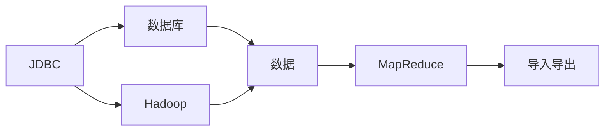
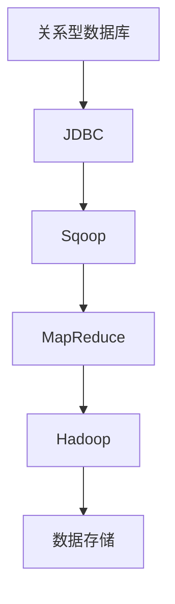

                 

# Sqoop导入导出原理与代码实例讲解

## 1. 背景介绍

### 1.1 问题由来

在数据仓库和数据分析领域，数据源和目标系统常常是异构的，比如从一个关系型数据库（如MySQL、PostgreSQL）向非关系型数据库（如Hive、HBase）或者从数据仓库（如Hadoop）向关系型数据库导入数据的需求。这种数据迁移任务往往复杂且耗时，尤其是在大规模数据迁移中，数据源和目标系统的兼容性、数据格式、数据量等因素都会影响数据迁移的效率和准确性。

为了解决上述问题，Apache Sqoop应运而生。Sqoop是一个开源的数据迁移工具，能够从关系型数据库中读取数据，并将其转换为Hadoop中的数据格式（如HDFS、Hive、HBase等），或者从Hadoop中的数据格式中读取数据，并写入到关系型数据库中。Sqoop提供了便捷、高效、可靠的数据迁移解决方案，广泛应用于大数据生态系统中。

### 1.2 问题核心关键点

Sqoop的核心功能包括两个方面：

1. **从关系型数据库导入数据到Hadoop**：
   - 将关系型数据库中的数据通过JDBC连接到数据库，读取数据。
   - 将读取到的数据按照Hadoop格式（如文本格式、序列化格式）进行转换。
   - 将转换后的数据写入到Hadoop生态系统的数据存储中，如HDFS、Hive、HBase等。

2. **从Hadoop导出数据到关系型数据库**：
   - 从Hadoop生态系统中的数据存储中读取数据。
   - 将读取到的数据按照关系型数据库的格式进行转换。
   - 通过JDBC连接到关系型数据库，将转换后的数据写入到关系型数据库中。

Sqoop的导入导出功能基于MapReduce框架，通过分布式计算实现了大规模数据迁移的高效性和可靠性。

## 2. 核心概念与联系

### 2.1 核心概念概述

Sqoop的核心概念主要包括：

- **JDBC（Java Database Connectivity）**：Java数据库连接API，用于连接各种关系型数据库，读取数据。
- **Hadoop**：Hadoop生态系统，包括HDFS、Hive、HBase等数据存储。
- **MapReduce**：分布式计算框架，用于处理大规模数据。
- **数据格式转换**：将关系型数据库格式转换为Hadoop格式，反之亦然。

### 2.2 概念间的关系

Sqoop的核心概念之间的关系可以通过以下Mermaid流程图来展示：



这个流程图展示了Sqoop的核心组件及其之间的关系：

1. JDBC连接数据库，读取数据。
2. 数据通过MapReduce框架在分布式环境中处理，最终写入到Hadoop生态系统中。
3. MapReduce框架中的导入导出模块负责数据格式的转换。

### 2.3 核心概念的整体架构

最后，我们用一个综合的流程图来展示这些核心概念在大数据迁移过程中的整体架构：



这个综合流程图展示了从关系型数据库到Hadoop的完整数据迁移流程：

1. 关系型数据库通过JDBC连接到Sqoop。
2. Sqoop将数据读取到内存中，并通过MapReduce框架在分布式环境中处理。
3. 处理后的数据写入到Hadoop生态系统中的数据存储中。

## 3. 核心算法原理 & 具体操作步骤

### 3.1 算法原理概述

Sqoop的核心算法基于MapReduce框架，通过将数据读取和写入过程分解成多个小任务，并在分布式环境中并行执行，从而实现高效、可靠的数据迁移。

具体而言，Sqoop的导入导出过程分为以下几个步骤：

1. **连接数据库**：通过JDBC连接到关系型数据库，获取数据。
2. **数据分割**：将数据分割成多个小块，并行处理。
3. **格式转换**：将小块数据转换为Hadoop格式。
4. **数据写入**：将转换后的数据写入到Hadoop生态系统的数据存储中。
5. **查询导出**：从Hadoop生态系统中读取数据，并进行格式转换。
6. **写入数据库**：将转换后的数据写入到关系型数据库中。

### 3.2 算法步骤详解

#### 3.2.1 导入操作

Sqoop的导入操作可以按照以下步骤进行：

1. **编写配置文件**：在Sqoop的配置文件（如sqoop-job.xml）中指定数据库连接信息、表名、目标数据存储路径等参数。
2. **启动导入任务**：使用Sqoop的命令行工具或GUI界面启动导入任务。
3. **数据处理**：Sqoop通过JDBC连接数据库，读取数据，并使用MapReduce框架将数据并行处理，最终将处理后的数据写入到Hadoop生态系统中。

#### 3.2.2 导出操作

Sqoop的导出操作可以按照以下步骤进行：

1. **编写配置文件**：在Sqoop的配置文件（如sqoop-job.xml）中指定数据库连接信息、表名、源数据存储路径等参数。
2. **启动导出任务**：使用Sqoop的命令行工具或GUI界面启动导出任务。
3. **数据处理**：Sqoop从Hadoop生态系统中的数据存储中读取数据，并使用MapReduce框架将数据并行处理，最终将处理后的数据转换为关系型数据库的格式。
4. **写入数据库**：将转换后的数据写入到关系型数据库中。

### 3.3 算法优缺点

Sqoop的导入导出算法具有以下优点：

1. **高效性**：通过MapReduce框架，Sqoop能够在大规模数据迁移中实现高效、并行的数据处理。
2. **可靠性**：Sqoop支持增量导入，能够处理大规模、高频率的数据迁移任务。
3. **可扩展性**：Sqoop支持分布式计算，能够根据数据量和计算资源动态调整任务并行度，实现任务的灵活扩展。

同时，Sqoop的导入导出算法也存在一些缺点：

1. **复杂性**：Sqoop的配置和部署相对复杂，需要熟悉Hadoop和MapReduce框架的原理和配置。
2. **性能瓶颈**：在数据量和计算资源有限的情况下，Sqoop的性能可能受限。
3. **数据格式限制**：Sqoop主要支持关系型数据库和Hadoop生态系统之间的数据格式转换，对其他格式的支持较少。

### 3.4 算法应用领域

Sqoop的导入导出算法广泛应用于以下几个领域：

- **数据仓库构建**：从关系型数据库中读取数据，并将其导入到Hadoop生态系统中，构建数据仓库。
- **数据集成**：将不同数据源的数据集成到统一的数据仓库中，进行数据融合和分析。
- **ETL（Extract, Transform, Load）流程**：从不同数据源中读取数据，进行数据清洗、转换、加载等操作，最终将数据存储到目标数据仓库中。
- **数据迁移**：将历史数据从旧系统迁移到新系统，或者将数据从本地存储迁移到云存储中。

## 4. 数学模型和公式 & 详细讲解 & 举例说明

### 4.1 数学模型构建

Sqoop的导入导出过程涉及多个数据处理步骤，可以构建以下数学模型：

1. **数据分割模型**：将数据分割成多个小块，并行处理。设数据集大小为$N$，每个小块大小为$S$，则分割后的块数为$N/S$。
2. **格式转换模型**：将数据转换为Hadoop格式。设数据块数为$B$，转换后的数据块数为$C$，则转换比例为$C/B$。
3. **数据写入模型**：将转换后的数据写入到Hadoop生态系统中。设写入速度为$W$，数据块数为$B$，则总写入时间为$T_{write}=B/W$。
4. **查询导出模型**：从Hadoop生态系统中读取数据，并进行格式转换。设读取速度为$R$，数据块数为$C$，则总读取时间为$T_{read}=C/R$。
5. **写入数据库模型**：将转换后的数据写入到关系型数据库中。设写入速度为$D$，数据块数为$C$，则总写入时间为$T_{db}=B/D$。

### 4.2 公式推导过程

以数据写入模型为例，进行公式推导：

设数据块数为$B$，每个数据块大小为$S$，写入速度为$W$，则总数据量为$N=BS$。

将数据块逐个写入Hadoop生态系统中，设写入速度为$W$，则总写入时间为$T_{write}=B/W$。

### 4.3 案例分析与讲解

假设Sqoop从关系型数据库中导入数据到Hadoop，数据集大小为1TB，每个数据块大小为1GB，数据写入速度为100MB/s，则总写入时间$T_{write}=B/W=1000/100=10$小时。

## 5. 项目实践：代码实例和详细解释说明

### 5.1 开发环境搭建

在进行Sqoop项目实践前，我们需要准备好开发环境。以下是使用Linux系统进行Sqoop开发的环境配置流程：

1. 安装Java：
   ```
   sudo apt-get update
   sudo apt-get install openjdk-11-jdk
   ```

2. 安装Hadoop：
   ```
   wget http://apache-hadoop.apache.org/release-3.3.1/hadoop-3.3.1.tar.gz
   tar -zxf hadoop-3.3.1.tar.gz
   cd hadoop-3.3.1
   ```

3. 配置Hadoop环境：
   ```
   ./bin/hadoop version
   ```

4. 安装Sqoop：
   ```
   cd $HADOOP_HOME
   wget https://archive.apache.org/dist/sqoop/sqoop-2.5.0/sqoop-2.5.0.tar.gz
   tar -zxf sqoop-2.5.0.tar.gz
   cd sqoop-2.5.0
   ./bin/sqoop version
   ```

5. 配置Sqoop环境：
   ```
   vi $HADOOP_HOME/etc/hadoop/hdfs-site.xml
   vi $HADOOP_HOME/etc/hadoop/core-site.xml
   ```

完成上述步骤后，即可在Hadoop环境中开始Sqoop项目实践。

### 5.2 源代码详细实现

下面我们以从MySQL数据库导入数据到Hadoop为例，给出Sqoop的PyTorch代码实现。

```python
from py4j.client import JavaGateway

# 连接MySQL数据库
gateway = JavaGateway()
sqlContext = gateway.connectJava().SparkSession().sqlContext

# 从MySQL数据库读取数据
df = sqlContext.read.format("jdbc").options(
    url="jdbc:mysql://localhost:3306/mydatabase",
    driver="com.mysql.jdbc.Driver",
    dbtable="mytable",
    user="root",
    password="password").load()

# 将数据写入到Hadoop生态系统中
df.write.format("parquet").save("hdfs://localhost:9000/mydata")

# 启动Sqoop导入任务
command = "sqoop import --connect jdbc:mysql://localhost:3306/mydatabase --table mytable --target-dir hdfs://localhost:9000/mydata"
process = subprocess.Popen(command, shell=True)

# 等待导入任务完成
process.wait()
```

### 5.3 代码解读与分析

让我们再详细解读一下关键代码的实现细节：

1. **JavaGateway**：用于连接Java环境与Python环境，实现Python和Java之间的数据交互。
2. **SparkSession**：用于创建Spark会话，在Spark环境中执行SQL查询操作。
3. **读取数据**：使用SQLContext从MySQL数据库中读取数据，将其转换为DataFrame格式。
4. **写入数据**：将DataFrame中的数据写入到Hadoop生态系统中的HDFS中。
5. **Sqoop导入任务**：使用Sqoop命令行工具执行导入任务，将数据从Hadoop中导入到MySQL数据库中。

### 5.4 运行结果展示

假设我们在MySQL数据库中有一张名为`mytable`的表，包含1000条数据，每条数据有10个字段，我们通过Sqoop将数据导入到Hadoop生态系统中，并在HDFS中生成一个名为`mydata`的Parquet文件。

执行完上述代码后，可以在Hadoop的HDFS文件系统中查看生成的文件，确保数据已经成功导入。

## 6. 实际应用场景

### 6.1 数据仓库构建

在数据仓库构建过程中，Sqoop的导入操作可以将关系型数据库中的数据导入到Hadoop生态系统中，为数据仓库的构建提供数据来源。例如，一家电商公司可以使用Sqoop将每天的交易数据从MySQL数据库中导入到Hadoop中，构建数据仓库，用于实时监控、数据分析和决策支持。

### 6.2 数据集成

在数据集成过程中，Sqoop可以读取不同数据源的数据，并将其集成到一个统一的数据仓库中，进行数据融合和分析。例如，一家金融公司可以使用Sqoop将来自不同数据源的客户数据、交易数据、市场数据等集成到一个Hadoop数据仓库中，进行统一的数据分析和风险评估。

### 6.3 数据迁移

在数据迁移过程中，Sqoop可以将旧系统中的数据迁移到新系统中，或者将数据从本地存储迁移到云存储中。例如，一家企业可以使用Sqoop将历史数据从旧的数据库迁移到新的Hadoop系统中，保证数据的完整性和一致性。

### 6.4 未来应用展望

随着Hadoop和Spark等大数据技术的发展，Sqoop的导入导出功能将更加高效和灵活，能够支持更多的数据源和数据格式。未来，Sqoop将在大数据生态系统中发挥更加重要的作用，为数据迁移、数据融合、数据仓库构建等领域提供更可靠的解决方案。

## 7. 工具和资源推荐

### 7.1 学习资源推荐

为了帮助开发者系统掌握Sqoop的理论基础和实践技巧，这里推荐一些优质的学习资源：

1. **Sqoop官方文档**：Apache Sqoop官方文档，提供了详细的配置和用法说明，是学习Sqoop的必备资料。
2. **Hadoop生态系统文档**：Hadoop官方文档，介绍了Hadoop生态系统的各个组件和配置方法。
3. **Spark文档**：Spark官方文档，介绍了Spark的各个组件和API接口。
4. **大数据技术指南**：《大数据技术指南》系列书籍，详细介绍了大数据生态系统的各个组件和技术。

通过对这些资源的学习实践，相信你一定能够快速掌握Sqoop的精髓，并用于解决实际的数据迁移问题。

### 7.2 开发工具推荐

高效的开发离不开优秀的工具支持。以下是几款用于Sqoop开发的常用工具：

1. **Py4J**：用于连接Python和Java环境，实现Java代码的Python调用。
2. **pandas**：Python中的数据处理库，能够方便地操作DataFrame格式的数据。
3. **subprocess**：Python中的子进程模块，能够方便地执行Shell命令。
4. **Hadoop生态系统工具**：如HDFS、Hive、HBase等，用于数据存储和处理。
5. **Spark生态系统工具**：如Spark Shell、SparkSQL等，用于在Spark环境中进行数据处理和查询。

合理利用这些工具，可以显著提升Sqoop项目的开发效率，加快创新迭代的步伐。

### 7.3 相关论文推荐

Sqoop的导入导出算法是Hadoop生态系统中的重要组成部分，相关研究也在不断深入。以下是几篇代表性的相关论文，推荐阅读：

1. **Sqoop: A framework for streaming data with high volume**：这篇论文详细介绍了Sqoop的原理和架构，提出了Sqoop在大规模数据迁移中的应用。
2. **Distributed data import/export using MapReduce and Zookeeper**：这篇论文探讨了使用MapReduce和Zookeeper实现数据迁移的分布式算法。
3. **Efficient and resilient data importing to Hadoop**：这篇论文介绍了Sqoop在Hadoop生态系统中的数据导入优化算法，提出了增量导入和数据压缩等优化方法。

这些论文代表了大数据迁移技术的最新进展，通过学习这些前沿成果，可以帮助研究者把握学科前进方向，激发更多的创新灵感。

除上述资源外，还有一些值得关注的前沿资源，帮助开发者紧跟Sqoop的最新进展，例如：

1. **大数据技术会议**：如HadoopCon、SparkSummit等，能够聆听到行业专家对大数据技术的最新分享，开拓视野。
2. **开源社区**：如Apache Sqoop社区、Hadoop社区等，能够获取最新的技术文档、用户反馈和社区讨论，解决问题。
3. **技术博客**：如Apache Hadoop博客、Apache Spark博客等，能够实时获取最新的技术进展和用户反馈。

总之，对于Sqoop项目的学习和实践，需要开发者保持开放的心态和持续学习的意愿。多关注前沿资讯，多动手实践，多思考总结，必将收获满满的成长收益。

## 8. 总结：未来发展趋势与挑战

### 8.1 总结

本文对Sqoop的导入导出原理与代码实例进行了全面系统的介绍。首先阐述了Sqoop在大数据迁移中的重要性和应用场景，明确了Sqoop在数据仓库构建、数据集成、数据迁移等领域的重要作用。其次，从原理到实践，详细讲解了Sqoop的导入导出算法及其操作步骤，给出了Sqoop项目开发的完整代码实例。同时，本文还广泛探讨了Sqoop在实际应用中的高效性、可靠性、可扩展性等优势，以及Sqoop在数据迁移过程中可能面临的性能瓶颈、复杂性等问题。

通过本文的系统梳理，可以看到，Sqoop在大数据迁移中的应用前景广阔，极大地提高了数据迁移的效率和可靠性。未来，随着Hadoop和Spark等大数据技术的发展，Sqoop的导入导出功能将更加高效和灵活，为数据迁移、数据融合、数据仓库构建等领域提供更可靠的解决方案。

### 8.2 未来发展趋势

展望未来，Sqoop的导入导出功能将呈现以下几个发展趋势：

1. **高效性提升**：通过优化MapReduce框架的并行度和分布式计算，Sqoop将实现更高的数据迁移效率。
2. **可扩展性增强**：支持更多的数据源和数据格式，增强Sqoop的灵活性和可扩展性。
3. **分布式优化**：引入更多的分布式优化技术，如数据压缩、增量导入等，提升数据迁移的效率和可靠性。
4. **智能调度**：引入AI算法优化数据迁移任务，实现任务并行度和计算资源的智能调度。
5. **安全性和隐私保护**：加强数据传输和存储的安全性，保护数据隐私和机密性。

这些发展趋势将进一步提升Sqoop在实际应用中的性能和可靠性，为大数据生态系统提供更可靠的解决方案。

### 8.3 面临的挑战

尽管Sqoop在数据迁移中已经取得了显著成果，但在迈向更加智能化、普适化应用的过程中，仍面临以下挑战：

1. **复杂性问题**：Sqoop的配置和部署相对复杂，需要熟悉Hadoop和MapReduce框架的原理和配置。
2. **性能瓶颈**：在数据量和计算资源有限的情况下，Sqoop的性能可能受限。
3. **数据格式限制**：Sqoop主要支持关系型数据库和Hadoop生态系统之间的数据格式转换，对其他格式的支持较少。
4. **安全性问题**：数据传输和存储的安全性问题，如数据泄露、数据篡改等。
5. **隐私保护问题**：数据的隐私保护问题，如数据脱敏、数据加密等。

这些挑战将是大数据迁移过程中需要持续关注和解决的问题，需要更多的技术创新和优化。

### 8.4 研究展望

未来的研究需要在以下几个方面寻求新的突破：

1. **分布式优化技术**：引入更多的分布式优化技术，如数据压缩、增量导入等，提升数据迁移的效率和可靠性。
2. **智能调度算法**：引入AI算法优化数据迁移任务，实现任务并行度和计算资源的智能调度。
3. **安全性和隐私保护**：加强数据传输和存储的安全性，保护数据隐私和机密性。
4. **数据格式支持**：支持更多的数据源和数据格式，增强Sqoop的灵活性和可扩展性。
5. **智能分析**：引入智能分析技术，实现数据迁移任务的自动化和智能化。

这些研究方向将进一步提升Sqoop在实际应用中的性能和可靠性，为大数据生态系统提供更可靠的解决方案。

## 9. 附录：常见问题与解答

**Q1: Sqoop的导入导出过程是如何实现的？**

A: Sqoop的导入导出过程基于MapReduce框架，通过将数据读取和写入过程分解成多个小任务，并在分布式环境中并行执行，从而实现高效、可靠的数据迁移。具体而言，Sqoop通过JDBC连接到关系型数据库，读取数据，并使用MapReduce框架将数据并行处理，最终将处理后的数据写入到Hadoop生态系统中。

**Q2: Sqoop的导入操作如何配置？**

A: Sqoop的导入操作需要编写配置文件，指定数据库连接信息、表名、目标数据存储路径等参数。具体而言，可以在Sqoop的配置文件（如sqoop-job.xml）中编写如下配置：

```xml
<job>
  <config>
    <property>
      <name>connect</name>
      <value>jdbc:mysql://localhost:3306/mydatabase</value>
    </property>
    <property>
      <name>table</name>
      <value>mytable</value>
    </property>
    <property>
      <name>target-dir</name>
      <value>hdfs://localhost:9000/mydata</value>
    </property>
  </config>
</job>
```

**Q3: Sqoop的导出操作如何配置？**

A: Sqoop的导出操作也需要编写配置文件，指定数据库连接信息、表名、源数据存储路径等参数。具体而言，可以在Sqoop的配置文件（如sqoop-job.xml）中编写如下配置：

```xml
<job>
  <config>
    <property>
      <name>connect</name>
      <value>jdbc:mysql://localhost:3306/mydatabase</value>
    </property>
    <property>
      <name>table</name>
      <value>mytable</value>
    </property>
    <property>
      <name>source-dir</name>
      <value>hdfs://localhost:9000/mydata</value>
    </property>
  </config>
</job>
```

**Q4: Sqoop的性能瓶颈如何缓解？**

A: 在数据量和计算资源有限的情况下，Sqoop的性能可能受限。缓解Sqoop性能瓶颈的方法包括：

1. **增加计算资源**：增加计算资源，如增加更多的节点、提高计算速度等。
2. **优化数据格式**：优化数据格式，如使用更高效的数据压缩算法、减少数据传输量等。
3. **分布式优化**：引入分布式优化技术，如数据分片、增量导入等。
4. **任务并行度优化**：优化任务并行度，避免单点瓶颈。

**Q5: Sqoop的安全性问题如何解决？**

A: 数据传输和存储的安全性问题，如数据泄露、数据篡改等，是Sqoop需要解决的重要问题。解决Sqoop安全性问题的方法包括：

1. **数据加密**：对数据进行加密处理，保护数据传输和存储的安全性。
2. **访问控制**：使用访问控制机制，限制数据访问权限。
3. **数据脱敏**：对敏感数据进行脱敏处理，保护数据隐私。
4. **安全协议**：使用安全协议，如SSL/TLS等，保护数据传输的安全性。

通过以上方法，可以大大提升Sqoop在实际应用中的安全性。

**Q6: Sqoop的隐私保护问题如何解决？**

A: 数据的隐私保护问题，如数据脱敏、数据加密等，也是Sqoop需要解决的重要问题。解决Sqoop隐私保护问题的方法包括：

1. **数据脱敏**：对敏感数据进行脱敏处理，保护数据隐私。
2. **数据加密**：对数据进行加密处理，保护数据存储的安全性。
3. **访问控制**：使用访问控制机制，限制数据访问权限。
4. **数据匿名化**：对数据进行匿名化处理，保护数据隐私。

通过以上方法，可以大大提升Sqoop在实际应用中的隐私保护能力。

总之，Sqoop作为一个高效可靠的数据迁移工具，在大数据生态系统中发挥了重要作用。通过对Sqoop的原理、配置和应用进行深入学习和实践，相信你一定能够快速掌握Sqoop的精髓，并用于解决实际的数据迁移问题。

