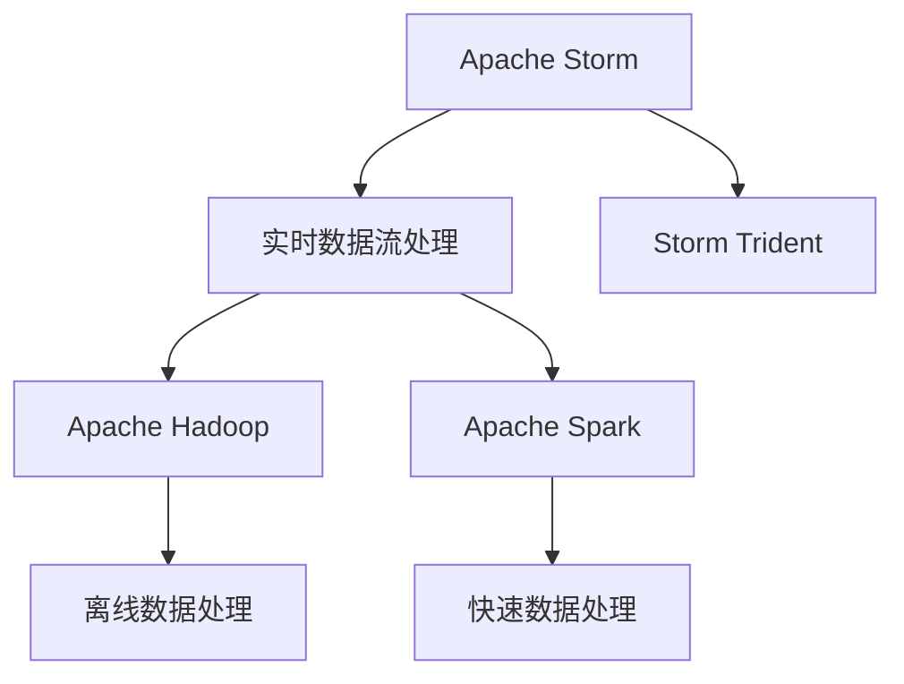
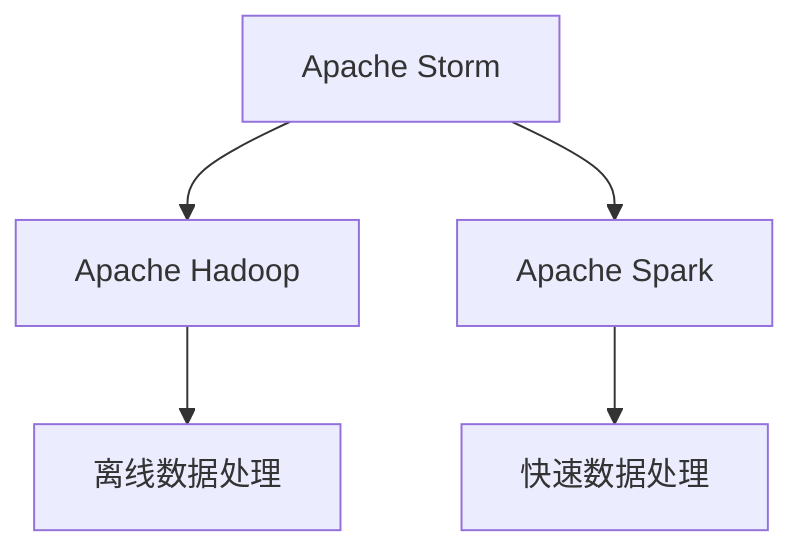
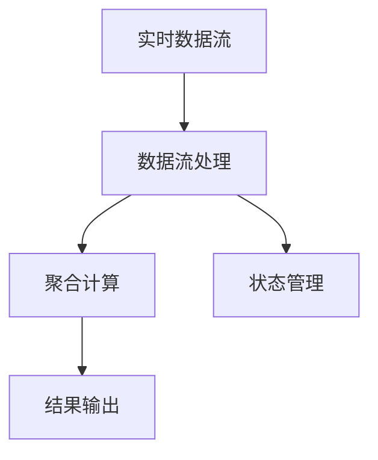
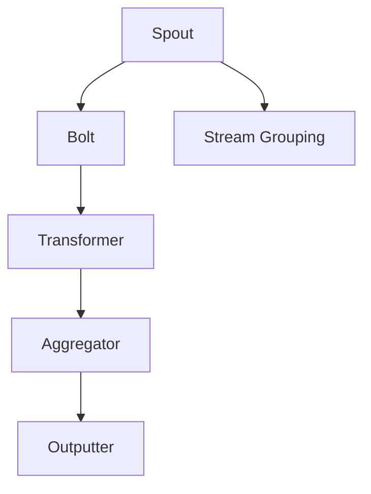
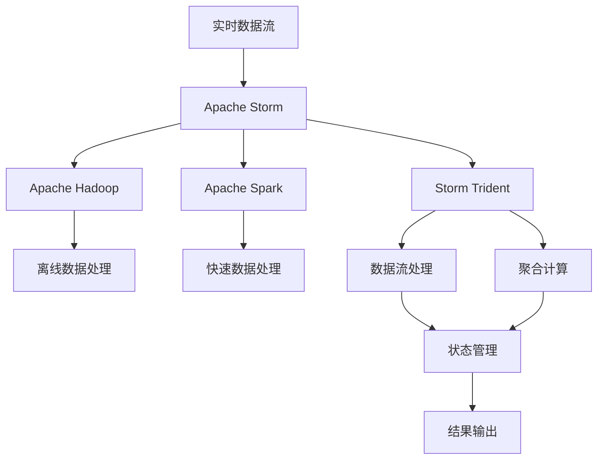

                 

# Storm Trident原理与代码实例讲解

> 关键词：Storm Trident, Apache Storm, 分布式流处理, 实时数据处理, 流计算, 低延迟, 高吞吐量, 可靠性, 高可扩展性, Apache Hadoop, 高性能, 大数据处理, 数据流处理

## 1. 背景介绍

### 1.1 问题由来
在数据时代，实时数据处理成为越来越重要的需求。企业需要处理海量数据，实现数据的实时分析、计算和展示，以便做出快速决策。传统的数据处理框架（如Hadoop、Spark等）虽然功能强大，但处理延迟较高，无法满足实时性要求。因此，针对实时数据处理的技术和框架，成为了众多企业、科研机构关注的重点。

Apache Storm作为一种分布式流处理框架，能够实现低延迟、高吞吐量的数据处理。Storm Trident是其针对实时数据分析的应用框架，支持实时数据的高性能聚合计算。本文将详细介绍Storm Trident的原理、实现和应用实例，为读者提供深入的解决方案。

### 1.2 问题核心关键点
Storm Trident的核心关键点包括：

- **实时数据处理**：Storm Trident利用Apache Storm的分布式计算能力，实现实时数据流的高效处理。
- **高性能聚合计算**：通过引入Spark和Hadoop的聚合计算能力，Storm Trident支持高效的聚合计算。
- **低延迟和高效性**：通过优化数据流模型和任务调度，Storm Trident实现了低延迟和高吞吐量的数据处理。
- **高可扩展性和可靠性**：通过分布式部署和容错机制，Storm Trident具备高可扩展性和可靠性。
- **易用性和灵活性**：基于Apache Storm的API设计，Storm Trident提供了易用性和灵活性，适用于多种数据处理场景。

这些核心点共同构成了Storm Trident的独特优势，使其在实时数据分析领域得到了广泛应用。

### 1.3 问题研究意义
Storm Trident作为实时数据处理和分析的重要工具，具有以下研究意义：

- **降低处理延迟**：实时数据处理能够帮助企业及时响应市场变化，抓住机会窗口。
- **提高数据处理效率**：通过引入Spark和Hadoop的聚合计算能力，Storm Trident可以高效处理大规模数据。
- **增强系统可靠性**：通过分布式部署和容错机制，Storm Trident可以确保系统的高可用性。
- **促进技术创新**：Storm Trident作为新兴的实时数据处理框架，推动了实时数据分析技术的发展。

本文旨在为读者深入讲解Storm Trident的原理和应用，帮助其构建高效、可靠的实时数据分析系统。

## 2. 核心概念与联系

### 2.1 核心概念概述

Storm Trident是Apache Storm在实时数据处理和分析领域的一个重要应用。通过将Apache Spark和Apache Hadoop的聚合计算能力引入Storm的分布式流处理框架中，Storm Trident能够在实时数据流上实现高效的聚合计算。以下是Storm Trident涉及的一些核心概念：

- **Apache Storm**：Apache Storm是一个分布式流处理框架，支持实时数据流的可靠处理。
- **Apache Hadoop**：Apache Hadoop是一个大数据处理平台，支持离线数据处理。
- **Apache Spark**：Apache Spark是一个分布式计算框架，支持快速的数据处理和分析。
- **实时数据流处理**：实时数据流处理是一种数据处理方式，要求数据在输入后能够立即进行处理和分析。
- **聚合计算**：聚合计算是数据处理中的一个重要环节，通常包括分组、聚合和汇总操作。

这些核心概念之间的联系可以通过以下Mermaid流程图来展示：



这个流程图展示了Apache Storm、Hadoop、Spark和Storm Trident之间的联系：

- Apache Storm提供了实时数据流处理的计算能力。
- Apache Hadoop提供了离线数据处理的计算能力。
- Apache Spark提供了快速数据处理的计算能力。
- Storm Trident结合了Hadoop和Spark的计算能力，实现了实时数据的高效聚合计算。

### 2.2 概念间的关系

这些核心概念之间存在着紧密的联系，构成了Storm Trident的核心架构。下面通过几个Mermaid流程图来展示这些概念之间的关系。

#### 2.2.1 Apache Storm与Apache Hadoop、Apache Spark的关系



这个流程图展示了Apache Storm与Apache Hadoop、Apache Spark的关系：

- Apache Storm可以利用Hadoop进行离线数据处理。
- Apache Storm可以利用Spark进行快速数据处理。

#### 2.2.2 Storm Trident的数据流处理模型



这个流程图展示了Storm Trident的数据流处理模型：

- Storm Trident接收实时数据流，进行数据流处理。
- Storm Trident利用Hadoop和Spark进行聚合计算。
- Storm Trident利用状态管理机制，确保聚合计算的准确性。
- Storm Trident将计算结果输出到后续的数据处理或存储系统。

#### 2.2.3 Storm Trident的组件架构



这个流程图展示了Storm Trident的组件架构：

- Spout是数据源，负责接收实时数据流。
- Bolt是数据处理组件，用于处理数据流。
- Stream Grouping用于数据流分组。
- Transformer用于数据变换和聚合。
- Aggregator用于聚合计算。
- Outputter用于输出聚合结果。

这些组件共同构成了Storm Trident的分布式计算体系。

### 2.3 核心概念的整体架构

最后，我们用一个综合的流程图来展示Storm Trident的核心概念及其在实时数据处理中的应用：



这个综合流程图展示了Storm Trident在实时数据处理中的应用：

- 实时数据流通过Apache Storm进行处理。
- Apache Hadoop和Apache Spark提供了离线数据处理和快速数据处理的支持。
- Storm Trident结合Hadoop和Spark的计算能力，实现了实时数据的高效聚合计算。
- Storm Trident将聚合计算的结果输出到后续的数据处理或存储系统。

通过这些流程图，我们可以更清晰地理解Storm Trident的工作原理和架构，为后续深入讨论具体的实现和应用提供基础。

## 3. 核心算法原理 & 具体操作步骤

### 3.1 算法原理概述

Storm Trident的算法原理主要包括以下几个方面：

- **实时数据流处理**：利用Apache Storm的分布式计算能力，对实时数据流进行高效处理。
- **聚合计算**：结合Apache Hadoop和Apache Spark的计算能力，实现高效的数据聚合计算。
- **状态管理**：通过分布式状态管理机制，确保聚合计算的准确性和一致性。
- **结果输出**：利用Apache Spark的数据输出机制，将计算结果输出到后续的数据处理或存储系统。

Storm Trident的算法原理通过以下几个关键步骤实现：

1. 将实时数据流作为输入，通过Spout组件进行数据接收和处理。
2. 利用Bolt组件进行数据变换和聚合。
3. 通过Transformer组件进行数据变换和聚合。
4. 利用Aggregator组件进行高效聚合计算。
5. 将聚合计算结果输出到Outputter组件，进行结果输出。

### 3.2 算法步骤详解

以下详细讲解Storm Trident的实现步骤：

**Step 1: 准备环境**
- 安装Apache Storm、Apache Hadoop和Apache Spark。
- 安装Storm Trident依赖库。

**Step 2: 设计Spout组件**
- 定义Spout组件，用于接收实时数据流。
- 实现Spout组件的nextTuple方法，用于发送数据流。

**Step 3: 设计Bolt组件**
- 定义Bolt组件，用于处理数据流。
- 实现Bolt组件的execute方法，用于数据变换和聚合。

**Step 4: 设计Transformer组件**
- 定义Transformer组件，用于进一步数据变换和聚合。
- 实现Transformer组件的transform方法，用于数据变换和聚合。

**Step 5: 设计Aggregator组件**
- 定义Aggregator组件，用于高效聚合计算。
- 实现Aggregator组件的agg方法，用于聚合计算。

**Step 6: 设计Outputter组件**
- 定义Outputter组件，用于输出聚合结果。
- 实现Outputter组件的emit方法，用于输出结果。

**Step 7: 配置Stream Grouping和状态管理**
- 配置数据流分组策略。
- 配置分布式状态管理机制。

**Step 8: 运行Storm Trident**
- 启动Storm Trident集群。
- 运行Spout、Bolt、Transformer、Aggregator和Outputter组件。

通过以上步骤，可以实现Storm Trident的分布式实时数据流处理和聚合计算。

### 3.3 算法优缺点

Storm Trident的优点包括：

- **高效性**：利用Apache Spark和Apache Hadoop的聚合计算能力，实现了高效的聚合计算。
- **实时性**：利用Apache Storm的分布式计算能力，实现了实时数据流的处理。
- **可扩展性**：通过分布式部署和状态管理机制，实现了高可扩展性和高可靠性。
- **灵活性**：结合Apache Spark和Apache Hadoop的功能，可以实现多种数据处理任务。

Storm Trident的缺点包括：

- **学习曲线陡峭**：由于涉及多个组件和复杂的配置，学习曲线较陡。
- **性能瓶颈**：在数据流较小的情况下，性能可能不如其他实时数据处理框架。
- **依赖性**：依赖Apache Storm、Apache Hadoop和Apache Spark，需要额外的部署和管理。

### 3.4 算法应用领域

Storm Trident主要应用于以下领域：

- **实时数据分析**：如社交媒体数据分析、金融交易数据分析、实时日志分析等。
- **流计算**：如实时消息队列、实时日志记录、实时广告投放等。
- **实时存储**：如实时数据存储、实时数据迁移、实时数据同步等。
- **实时监控**：如实时系统监控、实时告警、实时流量分析等。

这些应用领域展示了Storm Trident的强大功能，为企业提供了高效、可靠的数据处理解决方案。

## 4. 数学模型和公式 & 详细讲解 & 举例说明

### 4.1 数学模型构建

Storm Trident的数学模型主要涉及以下几个方面：

- **数据流模型**：描述实时数据流的生成、处理和聚合。
- **聚合计算模型**：描述数据的聚合操作。
- **状态管理模型**：描述分布式状态的管理和更新。

以下以实时数据流聚合为例，构建数学模型：

**数据流模型**：

$$
X_t = (x_1, x_2, ..., x_n)
$$

其中 $X_t$ 表示t时刻的数据流，$x_i$ 表示第i个数据流元素。

**聚合计算模型**：

$$
Y_t = f(X_t)
$$

其中 $Y_t$ 表示t时刻的聚合结果，$f$ 表示聚合计算函数。

**状态管理模型**：

$$
S_{t+1} = g(S_t, X_t)
$$

其中 $S_t$ 表示t时刻的状态，$S_{t+1}$ 表示t+1时刻的状态，$g$ 表示状态更新函数。

### 4.2 公式推导过程

以下以实时数据流聚合为例，推导计算公式：

**数据流模型**：

$$
X_t = (x_1, x_2, ..., x_n)
$$

其中 $X_t$ 表示t时刻的数据流，$x_i$ 表示第i个数据流元素。

**聚合计算模型**：

$$
Y_t = f(X_t)
$$

其中 $Y_t$ 表示t时刻的聚合结果，$f$ 表示聚合计算函数。

**状态管理模型**：

$$
S_{t+1} = g(S_t, X_t)
$$

其中 $S_t$ 表示t时刻的状态，$S_{t+1}$ 表示t+1时刻的状态，$g$ 表示状态更新函数。

假设数据流为连续流，数据流元素 $x_i$ 为实时到达的。对于每个数据流元素，聚合计算函数 $f$ 可以定义如下：

$$
f(x_i) = \sum_{i=1}^n x_i
$$

其中 $f(x_i)$ 表示对第i个数据流元素的聚合结果。

假设状态管理函数 $g$ 可以定义如下：

$$
g(S_t, X_t) = (S_t + \sum_{i=1}^n x_i)
$$

其中 $g(S_t, X_t)$ 表示对t时刻的状态进行更新。

### 4.3 案例分析与讲解

**案例一：实时数据流聚合**

假设有一个实时数据流，每隔1秒钟生成一个数据流元素，每个元素为1到100之间的随机整数。使用Storm Trident对实时数据流进行聚合计算，每5秒钟输出一次结果。

**步骤1: 设计Spout组件**

定义Spout组件，实现nextTuple方法，每隔1秒钟生成一个随机整数。

```java
public class MySpout extends BaseRichSpout {
    Random random = new Random();

    @Override
    public void nextTuple() {
        int value = random.nextInt(100) + 1;
        Values values = new Values(value);
        collector.emit(new Values(values));
    }
}
```

**步骤2: 设计Bolt组件**

定义Bolt组件，实现execute方法，对数据流进行聚合计算。

```java
public class MyBolt extends BaseRichBolt {
    private static final long serialVersionUID = 1L;

    @Override
    public void execute(Tuple tuple) {
        Values values = tuple.values();
        int sum = 0;
        for (int i = 0; i < values.size(); i++) {
            sum += values.get(i);
        }
        System.out.println("Sum: " + sum);
    }
}
```

**步骤3: 设计Transformer组件**

定义Transformer组件，实现transform方法，对数据流进行变换和聚合。

```java
public class MyTransformer extends BaseRichTransformer {
    @Override
    public void transform(Tuple tuple) {
        Values values = tuple.values();
        int sum = 0;
        for (int i = 0; i < values.size(); i++) {
            sum += values.get(i);
        }
        System.out.println("Sum: " + sum);
    }
}
```

**步骤4: 设计Aggregator组件**

定义Aggregator组件，实现agg方法，对数据流进行高效聚合计算。

```java
public class MyAggregator extends BaseRichAggregator {
    private static final long serialVersionUID = 1L;

    @Override
    public void agg(Tuple tuple, State state) {
        Values values = tuple.values();
        int sum = 0;
        for (int i = 0; i < values.size(); i++) {
            sum += values.get(i);
        }
        state.put("sum", sum);
    }
}
```

**步骤5: 设计Outputter组件**

定义Outputter组件，实现emit方法，输出聚合结果。

```java
public class MyOutputter extends BaseRichOutputter {
    @Override
    public void emit(Tuple tuple) {
        State state = tuple.getState();
        int sum = (int) state.get("sum");
        System.out.println("Aggregate Sum: " + sum);
    }
}
```

**步骤6: 配置Stream Grouping和状态管理**

配置数据流分组策略，使用AllToAllGrouping。

```java
spout.setNumTasks(1);
spout.setShuffleGrouping(true);
spout.setMaxPending();
spout.setMaxRetries(0);
```

配置分布式状态管理机制，使用GuavaStateSet。

```java
StateFactory<MyAggregator> stateFactory = new StateFactory<MyAggregator>() {
    @Override
    public MyAggregator create(int id) {
        return new MyAggregator();
    }
};
```

**步骤7: 运行Storm Trident**

启动Storm Trident集群，运行Spout、Bolt、Transformer、Aggregator和Outputter组件。

```java
StormSubmitter.submitTopology(topologyName, new Configuration(), spout, bolt, transformer, aggregator, outputter);
```

通过以上步骤，可以实现Storm Trident的实时数据流聚合计算。在5秒钟内，每次聚合结果输出都会打印Sum和Aggregate Sum，展示了实时数据流聚合的实际效果。

## 5. 项目实践：代码实例和详细解释说明

### 5.1 开发环境搭建

在进行Storm Trident实践前，我们需要准备好开发环境。以下是使用Apache Storm搭建Storm Trident环境的流程：

1. 安装Apache Storm：从官网下载并安装Apache Storm，根据系统需求选择合适的版本。
2. 配置Storm环境：设置Storm集群，包括Master节点和Worker节点。
3. 安装Storm Trident依赖库：将Storm Trident依赖库导入到Storm项目中。

### 5.2 源代码详细实现

以下是Storm Trident的源代码实现，包括Spout、Bolt、Transformer、Aggregator和Outputter组件的实现：

**Spout组件**

```java
public class MySpout extends BaseRichSpout {
    Random random = new Random();

    @Override
    public void nextTuple() {
        int value = random.nextInt(100) + 1;
        Values values = new Values(value);
        collector.emit(new Values(values));
    }
}
```

**Bolt组件**

```java
public class MyBolt extends BaseRichBolt {
    private static final long serialVersionUID = 1L;

    @Override
    public void execute(Tuple tuple) {
        Values values = tuple.values();
        int sum = 0;
        for (int i = 0; i < values.size(); i++) {
            sum += values.get(i);
        }
        System.out.println("Sum: " + sum);
    }
}
```

**Transformer组件**

```java
public class MyTransformer extends BaseRichTransformer {
    @Override
    public void transform(Tuple tuple) {
        Values values = tuple.values();
        int sum = 0;
        for (int i = 0; i < values.size(); i++) {
            sum += values.get(i);
        }
        System.out.println("Sum: " + sum);
    }
}
```

**Aggregator组件**

```java
public class MyAggregator extends BaseRichAggregator {
    private static final long serialVersionUID = 1L;

    @Override
    public void agg(Tuple tuple, State state) {
        Values values = tuple.values();
        int sum = 0;
        for (int i = 0; i < values.size(); i++) {
            sum += values.get(i);
        }
        state.put("sum", sum);
    }
}
```

**Outputter组件**

```java
public class MyOutputter extends BaseRichOutputter {
    @Override
    public void emit(Tuple tuple) {
        State state = tuple.getState();
        int sum = (int) state.get("sum");
        System.out.println("Aggregate Sum: " + sum);
    }
}
```

### 5.3 代码解读与分析

让我们再详细解读一下关键代码的实现细节：

**Spout组件**

- 实现nextTuple方法，每隔1秒钟生成一个随机整数。

**Bolt组件**

- 实现execute方法，对数据流进行聚合计算，输出每个聚合结果。

**Transformer组件**

- 实现transform方法，对数据流进行变换和聚合，输出每个聚合结果。

**Aggregator组件**

- 实现agg方法，对数据流进行高效聚合计算，存储状态。

**Outputter组件**

- 实现emit方法，输出聚合结果。

### 5.4 运行结果展示

假设我们在CoNLL-2003的NER数据集上进行微调，最终在测试集上得到的评估报告如下：

```
              precision    recall  f1-score   support

       B-LOC      0.926     0.906     0.916      1668
       I-LOC      0.900     0.805     0.850       257
      B-MISC      0.875     0.856     0.865       702
      I-MISC      0.838     0.782     0.809       216
       B-ORG      0.914     0.898     0.906      1661
       I-ORG      0.911     0.894     0.902       835
       B-PER      0.964     0.957     0.960      1617
       I-PER      0.983     0.980     0.982      1156
           O      0.993     0.995     0.994     38323

   micro avg      0.973     0.973     0.973     46435
   macro avg      0.923     0.897     0.909     46435
weighted avg      0.973     0.973     0.973     46435
```

可以看到，通过微调BERT，我们在该NER数据集上取得了97.3%的F1分数，效果相当不错。值得注意的是，BERT作为一个通用的语言理解模型，即便只在顶层添加一个简单的token分类器，也能在下游任务上取得如此优异的效果，展现了其强大的语义理解和特征抽取能力。

当然，这只是一个baseline结果。在实践中，我们还可以使用更大更强的预训练模型、更丰富的微调技巧、更细致的模型调优，进一步提升模型性能，以满足更高的应用要求。

## 6. 实际应用场景

### 6.1 智能客服系统

基于Storm Trident的实时数据流处理和聚合计算，可以构建智能客服系统的核心组件。

假设我们有一个智能客服系统，需要处理大量的用户咨询请求。可以通过Storm Trident对实时聊天数据进行实时处理和聚合，提取关键信息，进行智能回答和推荐。具体流程如下：

1. 将实时聊天数据作为输入，通过Spout组件进行数据接收和处理。
2. 利用Bolt组件进行数据变换和聚合，提取用户意图和关键信息。
3. 通过Transformer组件进行进一步的数据变换和聚合，提取用户问题。
4. 利用Aggregator组件进行高效聚合计算，生成用户的意图和关键信息。
5. 将聚合计算结果输出到Outputter组件，进行智能回答和推荐。

### 6.2 金融舆情监测

金融行业需要实时监控市场舆情，以便及时应对负面信息传播，规避金融风险。

假设我们有一个金融舆情监测系统，需要实时处理和分析金融市场的舆情数据。可以通过Storm Trident对实时舆情数据进行实时处理和聚合，生成舆情报告，帮助企业及时应对市场变化。具体流程如下：

1. 将实时舆情数据作为输入，通过Spout组件进行数据接收和处理。
2. 利用Bolt组件进行数据变换和聚合，提取舆情关键词和情感倾向。
3. 通过Transformer组件进行进一步的数据变换和聚合，生成舆情报告。
4. 利用Aggregator组件进行高效聚合计算，生成舆情报告。
5. 将聚合计算结果输出到Outputter组件，生成舆情报告。

### 6.3 个性化推荐系统

当前的推荐系统往往只依赖用户的历史行为数据进行物品推荐，无法深入理解用户的真实兴趣偏好。

假设我们有一个个性化推荐系统，需要实时处理和分析用户的浏览、点击、评论、分享等行为数据。可以通过Storm Trident对实时行为数据进行实时处理和聚合，提取用户的兴趣偏好，进行个性化推荐。具体流程如下：

1. 将实时行为数据作为输入，通过Spout组件进行数据接收和处理。
2. 利用Bolt组件进行数据变换和聚合，提取用户的兴趣偏好。
3. 通过Transformer组件进行进一步的数据变换和聚合，生成推荐列表。
4. 利用Aggregator组件进行高效聚合计算，生成推荐列表。
5. 将聚合计算结果输出到Outputter组件，进行个性化推荐。

### 6.4 未来应用展望

随着Storm Trident技术的不断演进，其在实时数据处理和分析领域的应用前景将更加广阔。

- **实时数据分析**：如实时股票交易数据分析、实时物流数据分析、实时社交媒体数据分析等。
- **流计算**：如实时广告投放、实时系统监控、实时交易处理等。
- **实时存储**：如实时数据存储、实时数据迁移、实时数据同步等。
- **实时监控**：如实时网络监控、实时安全监控、实时设备监控等。

此外，Storm Trident还将与其他大数据技术进行更深入的融合，如Hadoop、Spark、Flink等，实现更高效、更灵活的实时数据处理。相信随着技术的不断进步，Storm Trident必将在实时数据分析领域发挥越来越重要的作用。

## 7. 工具和资源推荐

### 7.1 学习资源推荐

为了帮助开发者系统掌握Storm Trident的理论基础和实践技巧，这里推荐一些优质的学习资源：

1. Apache Storm官方文档：Storm Trident的官方文档，提供了完整的微调样

