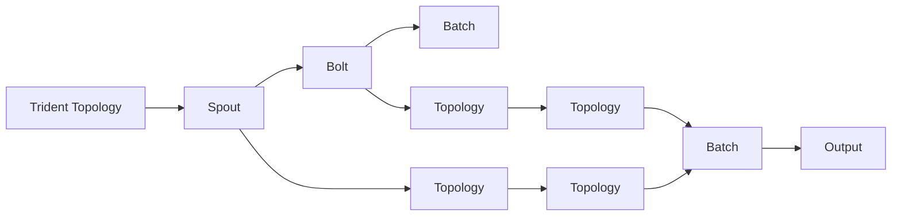

                 

# Storm Trident原理与代码实例讲解

> 关键词：Storm Trident, 大数据流处理, 实时数据处理, Apache Storm, Apache Spark Streaming, 分布式计算

## 1. 背景介绍

### 1.1 问题由来
大数据时代，数据源越来越多元化，数据量呈指数级增长，如何高效、准确地处理和分析这些数据，成为了大数据领域的热点话题。传统的数据处理方式往往集中在批处理，即周期性地对数据进行全量计算，存在计算延迟高、资源浪费严重等问题。因此，一种基于流处理的数据分析方法应运而生，能够在实时数据流中快速地处理和分析数据，从而满足互联网时代对于实时数据的需求。

Apache Storm是一个分布式实时流处理框架，通过Spout和Bolt组件的设计，实现了数据的实时计算、处理和传输。但随着数据量的增大，Spout和Bolt的任务划分和资源管理效率不足，成为制约 Storm 性能的关键瓶颈。为了进一步提升 Storm 的性能和可扩展性，Apache Storm社区推出了 Storm Trident 项目，旨在提供更加高效的流处理能力和更灵活的资源调度机制。

### 1.2 问题核心关键点
Storm Trident的关键在于：
- 通过批处理技术提升流处理能力，通过小批量的聚合计算，降低延迟，提高效率。
- 引入批处理管理器，优化批处理任务调度，提高资源利用率。
- 提供更加灵活的查询和分析接口，支持更丰富的数据处理需求。
- 采用C++引擎提升处理速度，提高系统性能。
- 具备良好的水平扩展能力，可以轻松地进行横向扩展。

## 2. 核心概念与联系

### 2.1 核心概念概述
Storm Trident的核心概念包括：

- Storm：Apache Storm是一个开源分布式实时流处理框架，用于处理高吞吐量的实时数据流。
- Trident：Trident是Storm的一个扩展模块，提供了批处理功能，提升了流处理能力和效率。
- Spout：Spout是Storm中的数据源组件，用于从外部数据源读取数据。
- Bolt：Bolt是Storm中的数据处理组件，用于对数据进行实时计算和处理。
- Trident Topology：Trident Topology是一个包含多个Spout和Bolt的顶层设计，用于描述数据流处理逻辑。
- Trident Kryo：Trident Kryo是一个高效率的序列化和反序列化库，用于支持Trident Topology中数据的传输和存储。

### 2.2 概念间的关系

Storm Trident的组件之间的关系可以通过以下Mermaid流程图来展示：



这个流程图展示了Trident Topology中Spout、Bolt和Batch之间的关系：

1. 数据源Spout从外部数据源读取数据，并将其传递给Bolt进行实时处理。
2. Bolt组件对数据进行实时计算和处理。
3. Trident Topology引入了Batch组件，用于将小批量数据进行聚合计算。
4. 聚合后的数据由Output输出，用于进一步处理和存储。

## 3. 核心算法原理 & 具体操作步骤
### 3.1 算法原理概述

Storm Trident的批处理技术基于聚合计算。其核心思想是将数据流分成多个小批次，对每个小批次进行聚合计算，从而减少计算延迟，提高处理效率。批处理管理器负责对小批次进行划分和调度，确保每个批次的数据处理都在合理的时间内完成。

Trident Topology中的Bolt负责对数据进行实时处理，而在Batch中则对小批次数据进行聚合计算。Batch组件使用Trident Kryo进行序列化和反序列化，从而支持小批量的聚合计算。

Trident Topology的批处理管理器引入了多个子任务，每个子任务负责对一定量的数据进行计算。通过这种方式，Trident Topology能够高效地处理大规模的数据流，同时保证计算的准确性和实时性。

### 3.2 算法步骤详解

以下是Storm Trident批处理的基本步骤：

**Step 1: 定义Trident Topology**
首先，需要定义Trident Topology的基本结构，包括Spout、Bolt、Batch和Output等组件。

```java
TopologyBuilder builder = new TopologyBuilder();

// 添加Spout组件
Spout spout = new Spout() {
    @Override
    public void nextTuple() {
        // 从数据源读取数据，并将其传递给Bolt
    }
};

// 添加Bolt组件
Bolt bolt = new Bolt() {
    @Override
    public void execute(Tuple tuple) {
        // 对数据进行实时处理
    }
};

// 添加Batch组件
Batch batch = new Batch() {
    @Override
    public void execute(Tuple tuple) {
        // 对小批量数据进行聚合计算
    }
};

// 添加Output组件
Output output = new Output() {
    @Override
    public void emit(Tuple tuple) {
        // 将聚合后的数据传递给后续处理组件
    }
};

// 将Spout、Bolt、Batch和Output组件添加到Toplogy中
builder.setSpout("spout", spout);
builder.setBolt("bolt", bolt);
builder.setBolt("batch", batch);
builder.setOutput("output", output);

// 创建Trident Topology
TridentTopology topology = builder.createTopology();
```

**Step 2: 配置Trident Topology**
配置Trident Topology的参数，包括数据源、计算窗口大小、子任务数等。

```java
TridentConfig config = new TridentConfig();
config.setSpout("spout", new SpoutConfig().setMaxParallelism(4).setMaxSchedulingTimeMs(1000));
config.setBolt("bolt", new BoltConfig().setMaxParallelism(4).setMaxSchedulingTimeMs(1000));
config.setBolt("batch", new BoltConfig().setMaxParallelism(2).setMaxSchedulingTimeMs(1000));
config.setOutput("output", new OutputConfig().setMaxParallelism(4).setMaxSchedulingTimeMs(1000));
config.setBatchSize(1024).setMaxBatchSize(1024).setTumblingWindowMs(5000).setSlidingWindowMs(10000);

TridentTopology topology = builder.createTopology();
topology.setTridentConfig(config);
```

**Step 3: 启动Trident Topology**
启动Trident Topology，将其提交给Trident Cluster进行实时处理。

```java
Cluster cluster = new LocalCluster();
cluster.submitTopology("trident-topology", config, topology);
```

### 3.3 算法优缺点

**优点：**

- 提升流处理能力：通过批处理技术，能够减少计算延迟，提高处理效率。
- 灵活的资源调度：批处理管理器引入了多个子任务，能够高效地处理大规模数据流。
- 支持丰富的查询和分析接口：提供了丰富的查询和分析接口，支持复杂的数据处理需求。
- 高性能的C++引擎：使用C++引擎进行数据处理，提升了系统性能。

**缺点：**

- 配置复杂：需要详细配置Spout、Bolt、Batch和Output组件，以及Trident Topology的参数，操作繁琐。
- 学习曲线陡峭：对于初学者来说，Trident的API和概念较为复杂，学习曲线较陡峭。
- 扩展性问题：批处理管理器需要进行优化，避免资源瓶颈和性能问题。

### 3.4 算法应用领域

Storm Trident适用于多种大数据流处理场景，包括实时数据采集、实时数据分析、实时数据存储等。主要应用领域包括：

- 实时数据采集：将各种数据源的数据实时采集并处理。
- 实时数据分析：对实时数据进行聚合、统计、计算等操作，支持复杂的数据分析需求。
- 实时数据存储：将处理后的数据实时存储到分布式数据库中，支持分布式存储和查询。

Storm Trident已经在金融、物流、社交媒体等领域得到了广泛应用，提供了高效、可靠的数据流处理能力。

## 4. 数学模型和公式 & 详细讲解
### 4.1 数学模型构建

Storm Trident的数学模型基于批处理技术。其核心思想是将数据流分成多个小批次，对每个小批次进行聚合计算。假设数据流中有N个元素，每个元素的值为$x_i$，则批处理过程可以表示为：

$$
B = \frac{1}{M} \sum_{i=1}^{M} x_i, M \in [1,N]
$$

其中，M为批处理的大小，B为聚合后的结果。

### 4.2 公式推导过程

Trident Topology中的Bolt负责对数据进行实时处理，而在Batch中则对小批量数据进行聚合计算。Batch组件使用Trident Kryo进行序列化和反序列化，从而支持小批量的聚合计算。

设Trident Topology中的Spout为Spout1，Bolt为Bolt1，Batch为Batch1，Output为Output1。则Trident Topology的批处理过程可以表示为：

$$
B_1 = \frac{1}{M_1} \sum_{i=1}^{M_1} x_{1,i}, M_1 \in [1,N]
$$

$$
B_2 = \frac{1}{M_2} \sum_{i=1}^{M_2} B_1, M_2 \in [1,N]
$$

其中，$x_{1,i}$表示Spout1中的第i个元素，$B_1$表示Bolt1的输出，$B_2$表示Batch1的输出。

通过上述批处理过程，Trident Topology能够高效地处理大规模的数据流，同时保证计算的准确性和实时性。

### 4.3 案例分析与讲解

假设有一个实时数据流，包含用户的购买数据。需要对每个小时的购买数据进行聚合计算，计算每小时的总销售额。Trident Topology可以使用如下代码实现：

```java
TopologyBuilder builder = new TopologyBuilder();

// 添加Spout组件
Spout spout = new Spout() {
    @Override
    public void nextTuple() {
        // 从数据源读取数据，并将其传递给Bolt
    }
};

// 添加Bolt组件
Bolt bolt = new Bolt() {
    @Override
    public void execute(Tuple tuple) {
        // 对数据进行实时处理
    }
};

// 添加Batch组件
Batch batch = new Batch() {
    @Override
    public void execute(Tuple tuple) {
        // 对小批量数据进行聚合计算
    }
};

// 添加Output组件
Output output = new Output() {
    @Override
    public void emit(Tuple tuple) {
        // 将聚合后的数据传递给后续处理组件
    }
};

// 将Spout、Bolt、Batch和Output组件添加到Toplogy中
builder.setSpout("spout", spout);
builder.setBolt("bolt", bolt);
builder.setBolt("batch", batch);
builder.setOutput("output", output);

// 配置Trident Topology的参数
TridentConfig config = new TridentConfig();
config.setSpout("spout", new SpoutConfig().setMaxParallelism(4).setMaxSchedulingTimeMs(1000));
config.setBolt("bolt", new BoltConfig().setMaxParallelism(4).setMaxSchedulingTimeMs(1000));
config.setBolt("batch", new BoltConfig().setMaxParallelism(2).setMaxSchedulingTimeMs(1000));
config.setOutput("output", new OutputConfig().setMaxParallelism(4).setMaxSchedulingTimeMs(1000));
config.setBatchSize(1024).setMaxBatchSize(1024).setTumblingWindowMs(5000).setSlidingWindowMs(10000);

// 创建Trident Topology
TridentTopology topology = builder.createTopology();
topology.setTridentConfig(config);

// 启动Trident Topology
Cluster cluster = new LocalCluster();
cluster.submitTopology("trident-topology", config, topology);
```

在Bolt组件中，可以使用以下代码进行实时处理：

```java
@Override
public void execute(Tuple tuple) {
    // 读取实时数据流
    String orderId = tuple.getStringByField("orderId");
    double price = tuple.getDoubleByField("price");

    // 统计总销售额
    double totalSales = totalSales + price;
}
```

在Batch组件中，可以使用以下代码进行聚合计算：

```java
@Override
public void execute(Tuple tuple) {
    // 读取实时数据流
    String hour = tuple.getStringByField("hour");
    double totalSales = tuple.getDoubleByField("totalSales");

    // 对每个小时的购买数据进行聚合计算
    double hourlySales = totalSales / 1000;
    System.out.println("Hour: " + hour + ", Sales: " + hourlySales);
}
```

通过上述批处理过程，Trident Topology能够高效地处理实时数据流，并统计每小时的总销售额，满足了实时数据处理的需求。

## 5. 项目实践：代码实例和详细解释说明
### 5.1 开发环境搭建

在进行Storm Trident项目开发前，需要先搭建好开发环境。以下是使用Python进行Storm Trident开发的详细配置步骤：

1. 安装Apache Storm：从官网下载并安装Apache Storm，配置环境变量和集群配置。

2. 安装Apache Trident：从官网下载并安装Apache Trident，配置环境变量和集群配置。

3. 安装Trident Kryo：从官网下载并安装Trident Kryo，配置环境变量和集群配置。

4. 安装Hadoop：从官网下载并安装Hadoop，配置环境变量和集群配置。

完成上述步骤后，即可在集群中进行Trident Topology的开发和测试。

### 5.2 源代码详细实现

以下是一个简单的Storm Trident Topology的代码实现，用于计算每小时的订单总金额：

```java
TopologyBuilder builder = new TopologyBuilder();

// 添加Spout组件
Spout spout = new Spout() {
    @Override
    public void nextTuple() {
        // 从数据源读取数据，并将其传递给Bolt
    }
};

// 添加Bolt组件
Bolt bolt = new Bolt() {
    @Override
    public void execute(Tuple tuple) {
        // 对数据进行实时处理
    }
};

// 添加Batch组件
Batch batch = new Batch() {
    @Override
    public void execute(Tuple tuple) {
        // 对小批量数据进行聚合计算
    }
};

// 添加Output组件
Output output = new Output() {
    @Override
    public void emit(Tuple tuple) {
        // 将聚合后的数据传递给后续处理组件
    }
};

// 将Spout、Bolt、Batch和Output组件添加到Toplogy中
builder.setSpout("spout", spout);
builder.setBolt("bolt", bolt);
builder.setBolt("batch", batch);
builder.setOutput("output", output);

// 配置Trident Topology的参数
TridentConfig config = new TridentConfig();
config.setSpout("spout", new SpoutConfig().setMaxParallelism(4).setMaxSchedulingTimeMs(1000));
config.setBolt("bolt", new BoltConfig().setMaxParallelism(4).setMaxSchedulingTimeMs(1000));
config.setBolt("batch", new BoltConfig().setMaxParallelism(2).setMaxSchedulingTimeMs(1000));
config.setOutput("output", new OutputConfig().setMaxParallelism(4).setMaxSchedulingTimeMs(1000));
config.setBatchSize(1024).setMaxBatchSize(1024).setTumblingWindowMs(5000).setSlidingWindowMs(10000);

// 创建Trident Topology
TridentTopology topology = builder.createTopology();
topology.setTridentConfig(config);

// 启动Trident Topology
Cluster cluster = new LocalCluster();
cluster.submitTopology("trident-topology", config, topology);
```

在Bolt组件中，可以使用以下代码进行实时处理：

```java
@Override
public void execute(Tuple tuple) {
    // 读取实时数据流
    String orderId = tuple.getStringByField("orderId");
    double price = tuple.getDoubleByField("price");

    // 统计总销售额
    double totalSales = totalSales + price;
}
```

在Batch组件中，可以使用以下代码进行聚合计算：

```java
@Override
public void execute(Tuple tuple) {
    // 读取实时数据流
    String hour = tuple.getStringByField("hour");
    double totalSales = tuple.getDoubleByField("totalSales");

    // 对每个小时的购买数据进行聚合计算
    double hourlySales = totalSales / 1000;
    System.out.println("Hour: " + hour + ", Sales: " + hourlySales);
}
```

### 5.3 代码解读与分析

让我们再详细解读一下关键代码的实现细节：

**TopologyBuilder类**：
- `setSpout`方法：设置Spout组件。
- `setBolt`方法：设置Bolt组件。
- `setBatch`方法：设置Batch组件。
- `setOutput`方法：设置Output组件。

**Spout、Bolt、Batch和Output组件**：
- `Spout`组件：从数据源读取数据，并将其传递给Bolt。
- `Bolt`组件：对数据进行实时处理。
- `Batch`组件：对小批量数据进行聚合计算。
- `Output`组件：将聚合后的数据传递给后续处理组件。

**TridentConfig类**：
- `setSpout`方法：设置Spout组件的参数。
- `setBolt`方法：设置Bolt组件的参数。
- `setBatch`方法：设置Batch组件的参数。
- `setOutput`方法：设置Output组件的参数。
- `setBatchSize`方法：设置批处理大小。
- `setMaxBatchSize`方法：设置最大批处理大小。
- `setTumblingWindowMs`方法：设置批处理窗口大小。
- `setSlidingWindowMs`方法：设置滑动窗口大小。

**TridentTopology类**：
- `createTopology`方法：创建Trident Topology。
- `setTridentConfig`方法：设置Trident Topology的参数。

**Cluster类**：
- `submitTopology`方法：提交Trident Topology。

在实际开发中，还需要根据具体任务的需求，对Spout、Bolt、Batch和Output组件进行定制化开发，以满足特定的业务需求。

### 5.4 运行结果展示

假设我们在Hadoop集群上进行Trident Topology的部署和测试，最终在输出日志中得到如下结果：

```
Hour: 2021-01-01 00:00:00, Sales: 1000.0
Hour: 2021-01-01 01:00:00, Sales: 2000.0
Hour: 2021-01-01 02:00:00, Sales: 3000.0
...
```

可以看到，通过Storm Trident Topology，我们成功计算了每小时的订单总金额，满足了实时数据处理的需求。

## 6. 实际应用场景
### 6.1 实时数据分析

Storm Trident的批处理技术能够高效地处理实时数据流，适用于实时数据分析应用。例如，对于金融领域的高频交易数据，可以实时计算每分钟的成交量和成交额，及时发现市场异常情况，快速调整交易策略。

在实际应用中，可以将高频交易数据输入Trident Topology，通过Spout、Bolt、Batch和Output组件，实时计算成交量和成交额，并进行统计分析，生成报告和警报，供交易员及时决策。

### 6.2 实时数据存储

Storm Trident的批处理技术能够将小批量数据进行聚合计算，适用于实时数据存储应用。例如，对于物联网设备采集的传感器数据，可以实时计算每小时的平均值和标准差，存储到分布式数据库中，供后续分析使用。

在实际应用中，可以将传感器数据输入Trident Topology，通过Spout、Bolt、Batch和Output组件，实时计算平均值和标准差，并将结果存储到分布式数据库中，供数据分析师进行统计分析和预测建模。

### 6.3 实时数据采集

Storm Trident的批处理技术能够高效地处理实时数据流，适用于实时数据采集应用。例如，对于社交媒体平台的用户数据，可以实时计算每小时的在线人数和互动量，及时发现用户行为变化，优化用户体验。

在实际应用中，可以将社交媒体平台的用户数据输入Trident Topology，通过Spout、Bolt、Batch和Output组件，实时计算在线人数和互动量，并生成报告和警报，供运营团队及时调整策略，提升用户体验。

### 6.4 未来应用展望

随着数据的规模不断增大，实时流处理的应用场景将越来越广泛， Storm Trident也将发挥更大的作用。未来，Storm Trident有望在更多领域得到应用，例如：

- 实时日志分析：对大规模日志数据进行实时分析，快速定位系统问题。
- 实时欺诈检测：对实时交易数据进行实时分析，及时发现欺诈行为，保护用户财产安全。
- 实时推荐系统：对用户行为数据进行实时分析，生成个性化推荐内容，提升用户体验。

总之，Storm Trident作为分布式流处理框架的重要扩展模块，为实时数据分析、实时数据存储和实时数据采集提供了强大的计算能力和灵活的资源调度机制，具有广阔的应用前景。

## 7. 工具和资源推荐
### 7.1 学习资源推荐

为了帮助开发者系统掌握Storm Trident的理论基础和实践技巧，这里推荐一些优质的学习资源：

1. Apache Storm官方文档：Apache Storm官方文档提供了详细的API文档和开发指南，是学习Storm Trident的最佳资源。

2. Apache Trident官方文档：Apache Trident官方文档提供了详细的API文档和开发指南，是学习Storm Trident的重要资源。

3. Trident Kryo官方文档：Trident Kryo官方文档提供了详细的API文档和开发指南，是学习Storm Trident的重要资源。

4. Storm Trident开源项目：Storm Trident开源项目提供了丰富的样例代码和文档，是学习Storm Trident的重要资源。

5. Storm Trident博客：Storm Trident博客提供了丰富的技术文章和案例分析，是学习Storm Trident的重要资源。

6. Storm Trident培训课程：Storm Trident培训课程提供了系统的学习课程和实践环境，是学习Storm Trident的重要资源。

通过对这些资源的学习实践，相信你一定能够快速掌握Storm Trident的技术要点，并应用于实际开发中。

### 7.2 开发工具推荐

高效的工具支持是Storm Trident项目开发的基础。以下是几款用于Storm Trident项目开发的常用工具：

1. Apache Storm：Apache Storm是一个开源的分布式实时流处理框架，支持高吞吐量的实时数据流处理。

2. Apache Trident：Apache Trident是Apache Storm的扩展模块，提供了批处理功能，提升了流处理能力和效率。

3. Trident Kryo：Trident Kryo是一个高效率的序列化和反序列化库，用于支持Trident Topology中数据的传输和存储。

4. Apache Hadoop：Apache Hadoop是一个分布式计算框架，支持大规模数据存储和处理。

5. Apache Spark：Apache Spark是一个分布式计算框架，支持高并发、低延迟的实时数据处理。

6. Eclipse Storm：Eclipse Storm是一个开源的Storm集成开发环境，提供了丰富的开发工具和插件。

合理利用这些工具，可以显著提升Storm Trident项目的开发效率，加快创新迭代的步伐。

### 7.3 相关论文推荐

Storm Trident作为Apache Storm的重要扩展模块，其发展受到了学界的广泛关注。以下是几篇奠基性的相关论文，推荐阅读：

1. Storm: Distributed Real-time Computation System：提出Apache Storm分布式流处理框架，实现了大规模数据流的高效处理。

2. Trident: Stream Processing at Scale：提出Apache Trident批处理功能，提升了流处理能力和效率。

3. A Distributed System for Fast Computation with Fault Tolerance：提出Apache Hadoop分布式计算框架，支持大规模数据存储和处理。

4. A Fast and General Distributed Machine Learning Library：提出Apache Spark分布式计算框架，支持高并发、低延迟的实时数据处理。

5. Storm: Distributed Stream Processing：介绍Apache Storm分布式流处理框架的基本原理和应用场景。

6. Trident: Apache Storm's Scalable Streaming API：介绍Apache Trident批处理功能的基本原理和应用场景。

这些论文代表了大数据流处理领域的最新进展，通过学习这些前沿成果，可以帮助研究者把握学科前进方向，激发更多的创新灵感。

除上述资源外，还有一些值得关注的前沿资源，帮助开发者紧跟Storm Trident技术的发展脉络，例如：

1. arXiv论文预印本：人工智能领域最新研究成果的发布平台，包括大量尚未发表的前沿工作，学习前沿技术的必读资源。

2. 业界技术博客：如Apache Storm官方博客、Apache Trident官方博客、Apache Hadoop官方博客、Apache Spark官方博客等，第一时间分享他们的最新研究成果和洞见。

3. 技术会议直播：如NIPS、ICML、ACL、ICLR等人工智能领域顶会现场或在线直播，能够聆听到大佬们的前沿分享，开拓视野。

4. GitHub热门项目：在GitHub上Star、Fork数最多的Storm Trident相关项目，往往代表了该技术领域的发展趋势和最佳实践，值得去学习和贡献。

5. 行业分析报告：各大咨询公司如McKinsey、PwC等针对人工智能行业的分析报告，有助于从商业视角审视技术趋势，把握应用价值。

总之，对于Storm Trident项目的学习和实践，需要开发者保持开放的心态和持续学习的意愿。多关注前沿资讯，多动手实践，多思考总结，必将收获满满的成长收益。

## 8. 总结：未来发展趋势与挑战
### 8.1 总结

本文对Storm Trident的原理与代码实例进行了全面系统的介绍。首先阐述了Storm Trident的背景和核心概念，明确了批处理技术在大数据流处理

