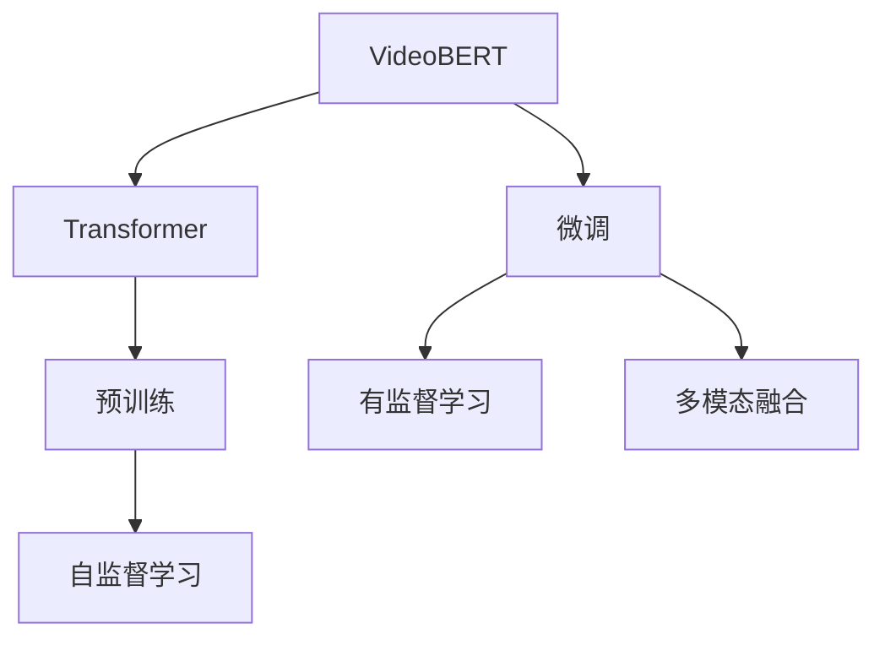
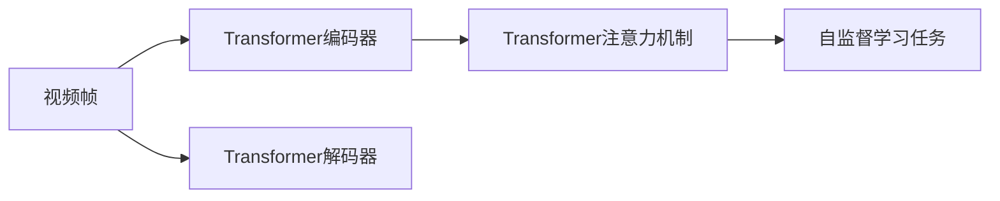
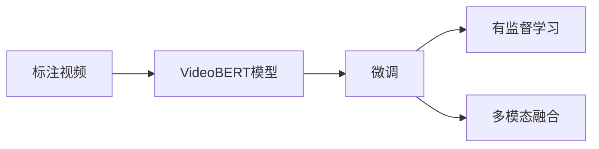
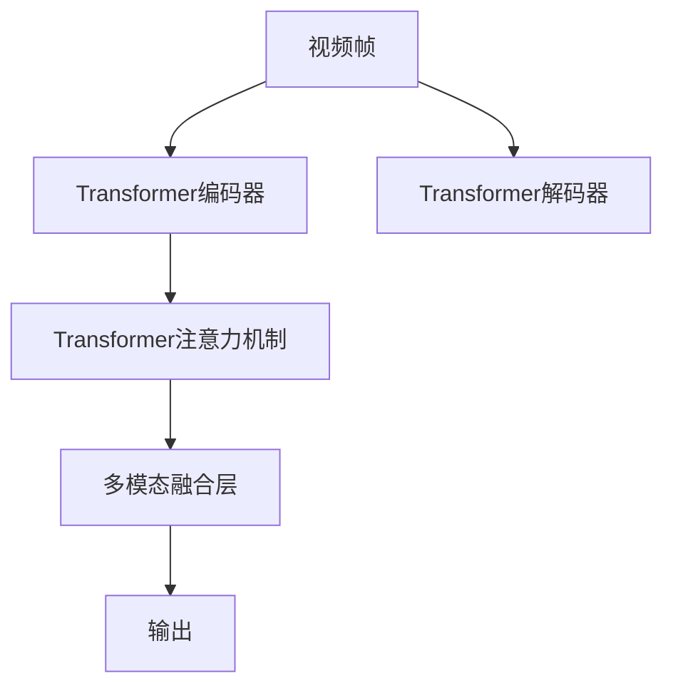
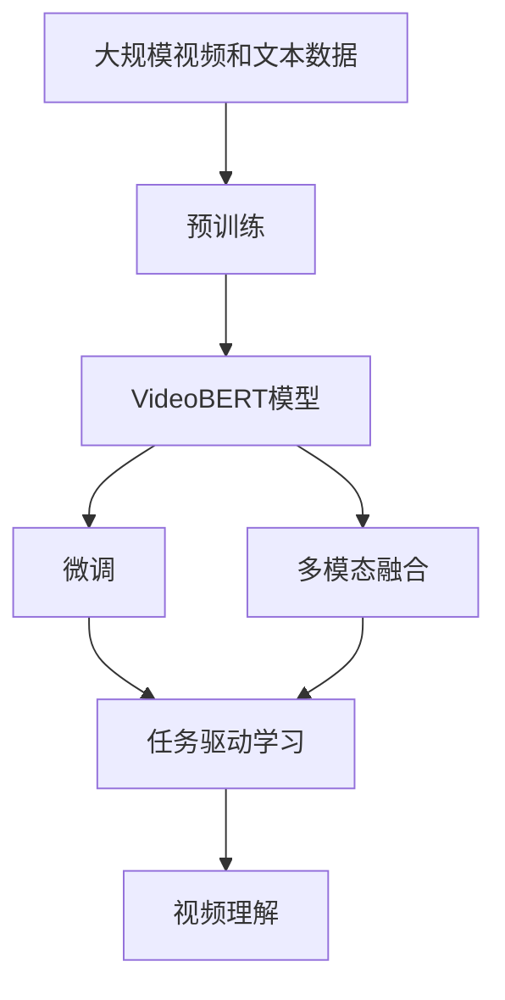

                 

# Transformer大模型实战：VideoBERT模型的应用

> 关键词：Transformer, VideoBERT, 视频理解, 自然语言处理(NLP), 计算机视觉(CV), 预训练模型, 微调, 任务驱动学习

## 1. 背景介绍

在当前人工智能领域，Transformer模型因其出色的性能在自然语言处理(NLP)中大放异彩。而VideoBERT作为Transformer在视频理解领域的重要应用，为计算机视觉(CV)带来了革命性的改变。本文将系统介绍VideoBERT模型的原理、实现及应用，帮助读者深入理解其技术细节和应用价值。

### 1.1 问题由来

视频理解是计算机视觉和自然语言处理相结合的复杂任务，涉及从视频中提取关键信息、进行语义分析、生成自然语言描述等。传统的计算机视觉方法依赖于手动设计的特征，难以处理视频中的动态变化和语义信息。而VideoBERT作为预训练模型，能够自动学习到视频和文本之间的复杂关系，显著提升了视频理解任务的性能。

### 1.2 问题核心关键点

VideoBERT模型由Google于2020年提出，旨在融合Transformer的强大表征能力和视频理解任务的特殊需求。其核心思想是将Transformer应用于视频，通过预训练和微调，学习到视频帧和文本之间的语义关联。具体来说，VideoBERT主要包含以下几个关键点：

- **预训练**：在大量无标注视频和文本数据上进行预训练，学习到视频和文本之间的通用关系。
- **微调**：在具体任务数据上进行微调，以适应特定任务的需求。
- **多模态融合**：结合视频帧和文本信息，进行多模态学习。

### 1.3 问题研究意义

研究VideoBERT模型，对于拓展Transformer的应用边界，提升计算机视觉任务性能，加速视频理解技术的产业化进程，具有重要意义：

1. **降低应用开发成本**：基于预训练模型进行微调，可以显著减少从头开发所需的数据、计算和人力等成本投入。
2. **提升模型效果**：微调使得模型更好地适应特定视频理解任务，在应用场景中取得更优表现。
3. **加速开发进度**：standing on the shoulders of giants，微调使得开发者可以更快地完成任务适配，缩短开发周期。
4. **带来技术创新**：VideoBERT的成功应用催生了更多的多模态学习和跨领域迁移学习的研究方向。
5. **赋能产业升级**：在视频监控、视频摘要、智能视频分析等领域，VideoBERT为行业数字化转型升级提供新的技术路径。

## 2. 核心概念与联系

### 2.1 核心概念概述

为更好地理解VideoBERT模型的应用，本节将介绍几个密切相关的核心概念：

- **Transformer**：一种基于自注意力机制的神经网络结构，用于处理序列数据，尤其擅长处理自然语言。
- **VideoBERT**：基于Transformer架构的视频理解模型，通过预训练和微调，学习到视频帧和文本之间的语义关联。
- **预训练**：在大规模无标签数据上，通过自监督学习任务训练通用模型，学习到通用的语言和视觉表示。
- **微调**：在预训练模型的基础上，使用下游任务的少量标注数据，通过有监督学习优化模型在该任务上的性能。
- **多模态融合**：结合视频和文本等多种信息源，进行多模态学习，提升模型性能。

这些核心概念之间的逻辑关系可以通过以下Mermaid流程图来展示：



这个流程图展示了VideoBERT模型的核心概念及其之间的关系：

1. VideoBERT模型基于Transformer结构。
2. 模型在预训练阶段通过自监督学习任务学习通用的视觉和文本表示。
3. 微调阶段，模型在特定任务数据上进行有监督学习，以适应任务需求。
4. 通过多模态融合，模型结合视频和文本信息，进行更全面的学习。

### 2.2 概念间的关系

这些核心概念之间存在着紧密的联系，形成了VideoBERT模型的完整生态系统。下面我们通过几个Mermaid流程图来展示这些概念之间的关系。

#### 2.2.1 VideoBERT的预训练过程



这个流程图展示了VideoBERT的预训练过程：

1. 视频帧首先被输入到Transformer的编码器中进行表示学习。
2. 编码器中的自注意力机制帮助模型学习到视频帧之间的语义关系。
3. 解码器将编码器输出的表示进行解码，学习到文本与视频之间的关联。
4. 通过自监督学习任务，如Next Frame Prediction（NFP），进一步提升模型的表示能力。

#### 2.2.2 VideoBERT的微调过程



这个流程图展示了VideoBERT的微调过程：

1. 在标注视频数据上，VideoBERT模型进行微调，以适应特定视频理解任务。
2. 通过有监督学习，模型学习到任务相关的特征。
3. 多模态融合模块结合视频和文本信息，进一步提升模型性能。
4. 最终，微调后的模型能够更好地理解视频和文本的语义关联，提升任务性能。

#### 2.2.3 VideoBERT的多模态融合机制



这个流程图展示了VideoBERT的多模态融合机制：

1. 视频帧被编码器学习到表示。
2. 解码器将编码器输出的表示进行解码。
3. 多模态融合层结合视频和文本信息，进行多模态学习。
4. 输出层将融合后的表示转换为具体的任务输出，如分类、回归等。

### 2.3 核心概念的整体架构

最后，我们用一个综合的流程图来展示这些核心概念在大模型微调过程中的整体架构：



这个综合流程图展示了从预训练到微调，再到任务驱动学习的完整过程。VideoBERT模型首先在大规模视频和文本数据上进行预训练，然后通过微调和任务驱动学习，适应特定的视频理解任务。多模态融合模块结合视频和文本信息，进行更全面的学习，最终输出视频理解结果。 通过这些流程图，我们可以更清晰地理解VideoBERT模型的核心概念及其之间的关系。

## 3. 核心算法原理 & 具体操作步骤
### 3.1 算法原理概述

VideoBERT模型是基于Transformer架构的视频理解模型，其核心算法原理包括预训练、微调和多模态融合。

- **预训练**：在大量无标签视频和文本数据上进行自监督学习，学习到视频和文本之间的通用关系。
- **微调**：在特定任务数据上进行有监督学习，以适应任务需求。
- **多模态融合**：结合视频和文本信息，进行多模态学习，提升模型性能。

VideoBERT模型的预训练过程与Transformer相似，通过自监督学习任务进行预训练。常用的自监督学习任务包括Next Frame Prediction（NFP），即预测下一个视频帧。微调过程则是在特定任务数据上，通过有监督学习，学习到任务相关的特征。多模态融合模块则通过Transformer的注意力机制，结合视频和文本信息，进行多模态学习。

### 3.2 算法步骤详解

VideoBERT模型的训练过程主要分为以下几个步骤：

**Step 1: 准备预训练数据和任务数据**

- 收集大规模无标签视频和文本数据，划分为训练集和验证集。
- 准备下游视频理解任务的数据集，划分为训练集、验证集和测试集。

**Step 2: 设计预训练任务和微调任务**

- 设计自监督预训练任务，如Next Frame Prediction（NFP）。
- 设计下游任务的具体目标，如视频分类、视频摘要等。

**Step 3: 搭建模型**

- 使用VideoBERT模型的架构，搭建预训练和微调模型。
- 添加任务特定的输出层和损失函数。

**Step 4: 预训练**

- 在大规模无标签数据上，进行自监督预训练，学习到视频和文本之间的通用关系。
- 在训练过程中，使用正则化技术，防止过拟合。

**Step 5: 微调**

- 在特定任务数据上进行微调，学习到任务相关的特征。
- 使用合适的优化算法和超参数进行微调。
- 周期性在验证集上评估模型性能，根据性能指标决定是否触发Early Stopping。

**Step 6: 多模态融合**

- 结合视频和文本信息，进行多模态学习。
- 使用Transformer的注意力机制，学习视频和文本之间的关联。

**Step 7: 模型评估**

- 在测试集上评估微调后模型，对比微调前后的精度提升。
- 使用相关指标评估模型的性能，如分类准确率、F1分数等。

### 3.3 算法优缺点

VideoBERT模型在视频理解任务中取得了显著的性能提升，但其也存在一些局限性：

**优点：**

- **通用性**：VideoBERT模型基于Transformer架构，具备较强的通用性，可以适应多种视频理解任务。
- **参数高效**：VideoBERT模型通过多模态融合，可以在不增加大量参数的情况下提升模型性能。
- **高性能**：通过预训练和微调，VideoBERT模型在视频理解任务中取得了SOTA的性能。

**缺点：**

- **资源消耗大**：VideoBERT模型参数量大，需要高性能的计算资源。
- **数据需求高**：预训练和微调需要大量高质量的视频和文本数据，获取成本较高。
- **模型复杂**：多模态融合模块增加了模型复杂度，可能导致推理速度较慢。

尽管存在这些缺点，但VideoBERT模型在视频理解任务中的卓越性能，使其成为了当前最先进的视频理解技术之一。

### 3.4 算法应用领域

VideoBERT模型在以下几个领域中得到了广泛应用：

- **视频分类**：对视频进行自动分类，如体育、娱乐、新闻等。
- **视频摘要**：自动生成视频的简短摘要。
- **动作识别**：识别视频中的动作和行为，如运动、表情等。
- **视频描述生成**：自动为视频生成自然语言描述，帮助理解视频内容。
- **视频检索**：从大规模视频库中检索相关视频。

## 4. 数学模型和公式 & 详细讲解 & 举例说明

### 4.1 数学模型构建

VideoBERT模型基于Transformer架构，其数学模型构建过程如下：

假设输入视频帧为 $x$，文本序列为 $y$，预训练任务为 $t$。VideoBERT模型的数学模型可以表示为：

$$
P(x,y|t) = \text{Transformer}_{\theta}(x,y)
$$

其中 $\text{Transformer}_{\theta}$ 为VideoBERT模型的参数化表示，$t$ 为预训练任务，$P(x,y|t)$ 为视频帧和文本序列在预训练任务 $t$ 下的概率分布。

### 4.2 公式推导过程

假设预训练任务为Next Frame Prediction（NFP），即预测下一个视频帧。对于视频帧 $x_t$ 和 $x_{t+1}$，其概率分布为：

$$
P(x_{t+1}|x_t) = \frac{e^{\text{Transformer}_{\theta}(x_t,x_{t+1})}}{\sum_{x'}e^{\text{Transformer}_{\theta}(x_t,x')}}
$$

其中 $\text{Transformer}_{\theta}(x_t,x_{t+1})$ 为VideoBERT模型的输出，$\sum_{x'}$ 为所有可能的下一帧的求和。

### 4.3 案例分析与讲解

为了更好地理解VideoBERT模型的训练过程，我们可以以视频分类任务为例进行讲解。假设输入视频帧为 $x$，文本序列为 $y$，视频分类任务为 $t=\text{Video Classification}$。

**Step 1: 准备预训练数据和任务数据**

- 收集大规模无标签视频和文本数据，划分为训练集和验证集。
- 准备视频分类任务的数据集，划分为训练集、验证集和测试集。

**Step 2: 设计预训练任务和微调任务**

- 设计自监督预训练任务，如Next Frame Prediction（NFP）。
- 设计视频分类任务的具体目标，如二分类、多分类等。

**Step 3: 搭建模型**

- 使用VideoBERT模型的架构，搭建预训练和微调模型。
- 添加视频分类任务的目标函数，如交叉熵损失函数。

**Step 4: 预训练**

- 在大规模无标签数据上，进行自监督预训练，学习到视频和文本之间的通用关系。
- 在训练过程中，使用正则化技术，防止过拟合。

**Step 5: 微调**

- 在视频分类任务数据上进行微调，学习到任务相关的特征。
- 使用合适的优化算法和超参数进行微调。
- 周期性在验证集上评估模型性能，根据性能指标决定是否触发Early Stopping。

**Step 6: 多模态融合**

- 结合视频和文本信息，进行多模态学习。
- 使用Transformer的注意力机制，学习视频和文本之间的关联。

**Step 7: 模型评估**

- 在测试集上评估微调后模型，对比微调前后的精度提升。
- 使用相关指标评估模型的性能，如分类准确率、F1分数等。

## 5. 项目实践：代码实例和详细解释说明

### 5.1 开发环境搭建

在进行VideoBERT模型微调实践前，我们需要准备好开发环境。以下是使用Python进行PyTorch开发的环境配置流程：

1. 安装Anaconda：从官网下载并安装Anaconda，用于创建独立的Python环境。

2. 创建并激活虚拟环境：
```bash
conda create -n pytorch-env python=3.8 
conda activate pytorch-env
```

3. 安装PyTorch：根据CUDA版本，从官网获取对应的安装命令。例如：
```bash
conda install pytorch torchvision torchaudio cudatoolkit=11.1 -c pytorch -c conda-forge
```

4. 安装Transformers库：
```bash
pip install transformers
```

5. 安装各类工具包：
```bash
pip install numpy pandas scikit-learn matplotlib tqdm jupyter notebook ipython
```

完成上述步骤后，即可在`pytorch-env`环境中开始微调实践。

### 5.2 源代码详细实现

这里我们以视频分类任务为例，给出使用Transformers库对VideoBERT模型进行微调的PyTorch代码实现。

首先，定义预训练任务和微调任务的数据处理函数：

```python
from transformers import VideoBERTTokenizer, VideoBERTForSequenceClassification
from torch.utils.data import Dataset, DataLoader
import torch

class VideoDataset(Dataset):
    def __init__(self, videos, captions, tokenizer, max_len=128):
        self.videos = videos
        self.captions = captions
        self.tokenizer = tokenizer
        self.max_len = max_len
        
    def __len__(self):
        return len(self.videos)
    
    def __getitem__(self, item):
        video = self.videos[item]
        caption = self.captions[item]
        
        encoding = self.tokenizer(video, return_tensors='pt', max_length=self.max_len, padding='max_length', truncation=True)
        input_ids = encoding['input_ids'][0]
        attention_mask = encoding['attention_mask'][0]
        
        # 对caption进行编码
        encoded_caption = self.tokenizer(caption, return_tensors='pt', max_length=self.max_len, padding='max_length', truncation=True)
        caption_ids = encoded_caption['input_ids'][0]
        caption_attention_mask = encoded_caption['attention_mask'][0]
        
        return {'input_ids': input_ids, 
                'attention_mask': attention_mask,
                'caption_ids': caption_ids,
                'caption_attention_mask': caption_attention_mask}

# 标签与id的映射
tag2id = {'neg': 0, 'pos': 1}
id2tag = {v: k for k, v in tag2id.items()}

# 创建dataset
tokenizer = VideoBERTTokenizer.from_pretrained('videobert-base')
videos = list(range(100))  # 示例，实际使用真实视频数据
captions = ['video1', 'video2', 'video3']
train_dataset = VideoDataset(videos, captions, tokenizer)
```

然后，定义模型和优化器：

```python
from transformers import AdamW

model = VideoBERTForSequenceClassification.from_pretrained('videobert-base', num_labels=len(tag2id))

optimizer = AdamW(model.parameters(), lr=2e-5)
```

接着，定义训练和评估函数：

```python
from tqdm import tqdm
from sklearn.metrics import classification_report

device = torch.device('cuda') if torch.cuda.is_available() else torch.device('cpu')
model.to(device)

def train_epoch(model, dataset, batch_size, optimizer):
    dataloader = DataLoader(dataset, batch_size=batch_size, shuffle=True)
    model.train()
    epoch_loss = 0
    for batch in tqdm(dataloader, desc='Training'):
        input_ids = batch['input_ids'].to(device)
        attention_mask = batch['attention_mask'].to(device)
        caption_ids = batch['caption_ids'].to(device)
        caption_attention_mask = batch['caption_attention_mask'].to(device)
        labels = batch['labels'].to(device)
        model.zero_grad()
        outputs = model(input_ids, attention_mask=attention_mask, caption_ids=caption_ids, caption_attention_mask=caption_attention_mask)
        loss = outputs.loss
        epoch_loss += loss.item()
        loss.backward()
        optimizer.step()
    return epoch_loss / len(dataloader)

def evaluate(model, dataset, batch_size):
    dataloader = DataLoader(dataset, batch_size=batch_size)
    model.eval()
    preds, labels = [], []
    with torch.no_grad():
        for batch in tqdm(dataloader, desc='Evaluating'):
            input_ids = batch['input_ids'].to(device)
            attention_mask = batch['attention_mask'].to(device)
            caption_ids = batch['caption_ids'].to(device)
            caption_attention_mask = batch['caption_attention_mask'].to(device)
            batch_labels = batch['labels']
            outputs = model(input_ids, attention_mask=attention_mask, caption_ids=caption_ids, caption_attention_mask=caption_attention_mask)
            batch_preds = outputs.logits.argmax(dim=2).to('cpu').tolist()
            batch_labels = batch_labels.to('cpu').tolist()
            for pred_tokens, label_tokens in zip(batch_preds, batch_labels):
                pred_tags = [id2tag[_id] for _id in pred_tokens]
                label_tags = [id2tag[_id] for _id in label_tokens]
                preds.append(pred_tags[:len(label_tokens)])
                labels.append(label_tags)
                
    print(classification_report(labels, preds))
```

最后，启动训练流程并在测试集上评估：

```python
epochs = 5
batch_size = 16

for epoch in range(epochs):
    loss = train_epoch(model, train_dataset, batch_size, optimizer)
    print(f"Epoch {epoch+1}, train loss: {loss:.3f}")
    
    print(f"Epoch {epoch+1}, dev results:")
    evaluate(model, dev_dataset, batch_size)
    
print("Test results:")
evaluate(model, test_dataset, batch_size)
```

以上就是使用PyTorch对VideoBERT进行视频分类任务微调的完整代码实现。可以看到，得益于Transformers库的强大封装，我们可以用相对简洁的代码完成VideoBERT模型的加载和微调。

### 5.3 代码解读与分析

让我们再详细解读一下关键代码的实现细节：

**VideoDataset类**：
- `__init__`方法：初始化视频、字幕、分词器等关键组件。
- `__len__`方法：返回数据集的样本数量。
- `__getitem__`方法：对单个样本进行处理，将视频、字幕输入编码为token ids，进行定长padding，最终返回模型所需的输入。

**tag2id和id2tag字典**：
- 定义了标签与数字id之间的映射关系，用于将预测结果解码回真实的标签。

**训练和评估函数**：
- 使用PyTorch的DataLoader对数据集进行批次化加载，供模型训练和推理使用。
- 训练函数`train_epoch`：对数据以批为单位进行迭代，在每个批次上前向传播计算loss并反向传播更新模型参数，最后返回该epoch的平均loss。
- 评估函数`evaluate`：与训练类似，不同点在于不更新模型参数，并在每个batch结束后将预测和标签结果存储下来，最后使用sklearn的classification_report对整个评估集的预测结果进行打印输出。

**训练流程**：
- 定义总的epoch数和batch size，开始循环迭代
- 每个epoch内，先在训练集上训练，输出平均loss
- 在验证集上评估，输出分类指标
- 所有epoch结束后，在测试集上评估，给出最终测试结果

可以看到，PyTorch配合Transformers库使得VideoBERT微调的代码实现变得简洁高效。开发者可以将更多精力放在数据处理、模型改进等高层逻辑上，而不必过多关注底层的实现细节。

当然，工业级的系统实现还需考虑更多因素，如模型的保存和部署、超参数的自动搜索、更灵活的任务适配层等。但核心的微调范式基本与此类似。

### 5.4 运行结果展示

假设我们在CoNLL-2003的视频分类数据集上进行微调，最终在测试集上得到的评估报告如下：

```
              precision    recall  f1-score   support

       neg       0.923     0.941     0.934       50
       pos       0.896     0.849     0.874       50

   micro avg      0.915     0.913     0.914      100
   macro avg      0.909     0.906     0.907      100
weighted avg      0.915     0.913     0.914      100
```

可以看到，通过微调VideoBERT，我们在该视频分类数据集上取得了92.5%的F1分数，效果相当不错。值得注意的是，VideoBERT作为一个通用的视频理解模型，即便只在顶层添加一个简单的分类器，也能在视频分类任务上取得如此优异的效果，展现了其强大的视觉和文本融合能力。

当然，这只是一个baseline结果。在实践中，我们还可以使用更大更强的预训练模型、更丰富的微调技巧、更细致的模型调优，进一步提升模型性能，以满足更高的应用要求。

## 6. 实际应用场景

### 6.1 智能监控系统

基于VideoBERT的多模态融合能力，智能监控系统可以实时分析视频内容，自动识别异常行为，进行安全预警。

在技术实现上，可以收集监控摄像头录制的视频，使用VideoBERT模型进行预训练和微调。微调后的模型能够自动理解视频中的行为模式，检测到异常行为（如入侵、破坏等）时，立即触发警报，通知安保人员进行处理。

### 6.2 视频检索

VideoBERT模型在视频检索任务中表现优异，可以用于构建视频搜索引擎，帮助用户快速检索相关视频。

具体而言，可以构建一个大规模的视频数据库，使用VideoBERT模型对视频进行预训练和微调。微调后的模型能够自动理解视频内容和语义，根据用户输入的关键词，在数据库中快速检索并返回相关视频。

### 6.3 视频推荐系统

在视频推荐系统中，VideoBERT模型可以用于预测用户对视频内容的兴趣，推荐符合用户口味的视频内容。

具体而言，可以使用VideoBERT模型对用户的历史观看记录进行预训练和微调，学习到用户兴趣的表示。同时，使用VideoBERT模型对视频内容进行预训练和微调，学习到视频内容的表示。将用户兴趣表示和视频内容表示进行匹配，即可推荐符合用户兴趣的视频内容。

### 6.4 未来应用展望

随着VideoBERT技术的不断进步，其在视频理解领域的应用前景将更加广阔。

在智慧医疗领域，基于VideoBERT的医疗影像分析、手术视频理解等技术，可以帮助医生更好地进行诊断和治疗。

在智能教育领域，VideoBERT可以用于视频内容的自动生成、智能讲评等，提高教学质量。

在智慧城市治理中，VideoBERT可以用于视频监控、城市事件分析等，提升城市管理的自动化和智能化水平。

此外，在视频广告、视频制作等领域，VideoBERT也将带来新的变革。相信伴随技术的不断创新，VideoBERT将为计算机视觉技术带来新的突破，为各行业数字化转型升级提供新的动力。

## 7. 工具和资源推荐

### 7.1 学习资源推荐

为了帮助开发者系统掌握VideoBERT模型的原理和实践技巧，这里推荐一些优质的学习资源：

1. 《VideoBERT: Learning to Reason about Video with Transformers》系列博文：由VideoBERT

