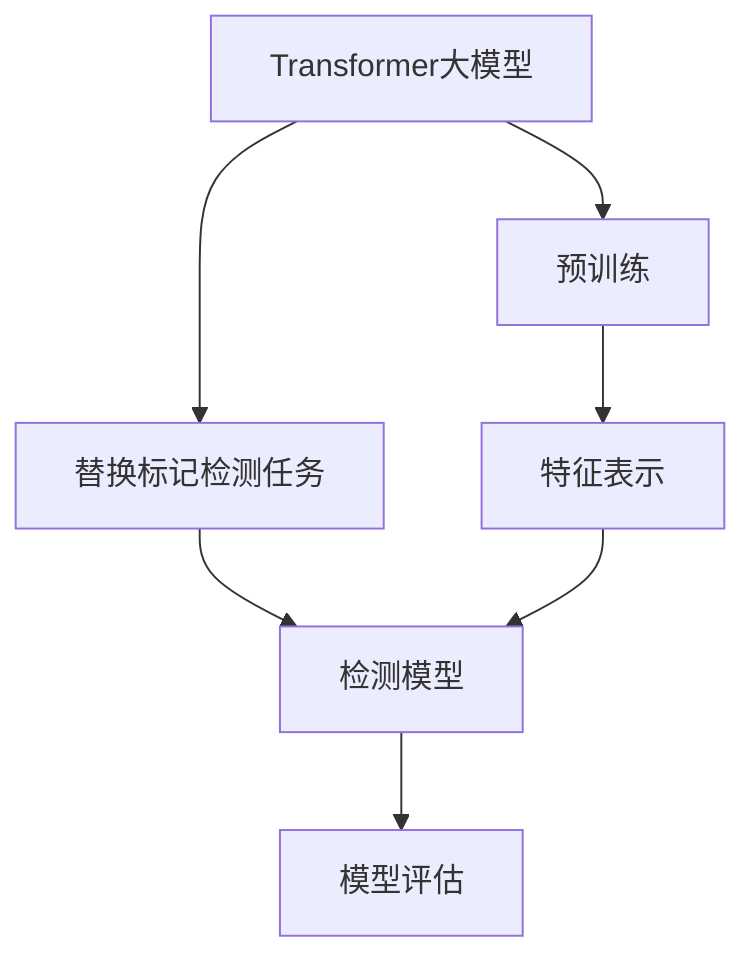
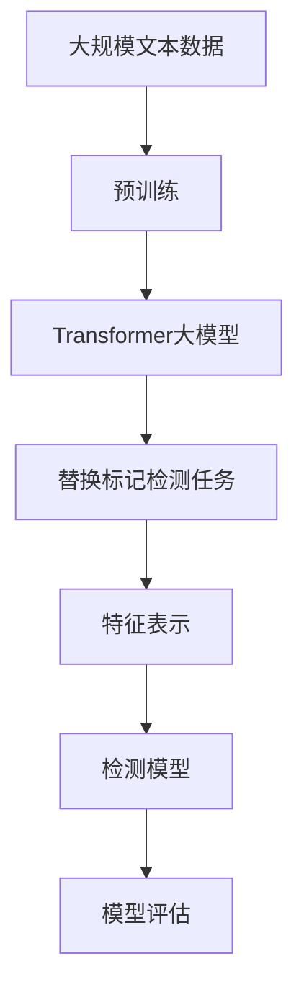
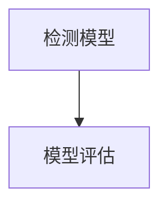
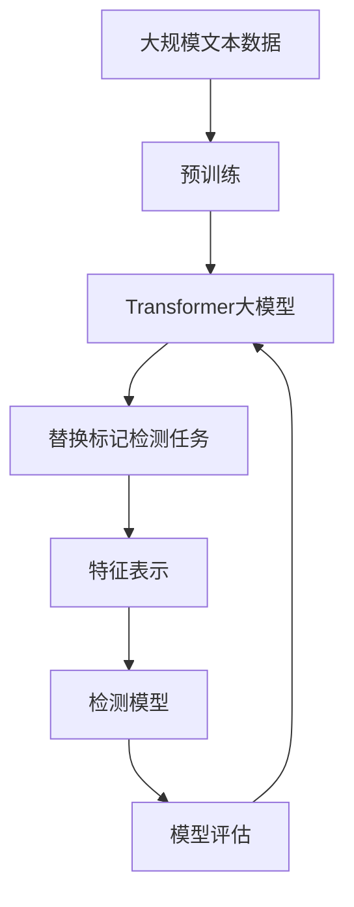

                 

# Transformer大模型实战 了解替换标记检测任务

> 关键词：Transformer, 大模型, 替换标记检测任务, 语言模型, 自然语言处理, 特征表示, 检测任务, 模型评估

## 1. 背景介绍

### 1.1 问题由来
Transformer作为深度学习领域的里程碑，以其卓越的性能在自然语言处理（NLP）领域取得了广泛的应用。随着预训练语言模型的不断发展和优化，Transformer大模型在处理语言理解、生成、分类等任务上展现出强大的能力。然而，尽管这些大模型在处理标准化任务方面表现优异，但在一些具体的应用场景下，例如替换标记检测任务（Substitution Mark Detection, SMD），其表现可能不尽如人意。本文旨在探讨如何在大模型基础上，实现替换标记检测任务的优化。

### 1.2 问题核心关键点
替换标记检测任务旨在识别出输入文本中某些替换标记，例如拼写错误、语法错误、用词不当等，以保证文本的准确性和可读性。该任务是NLP领域的一个重要研究方向，涉及语言模型、特征表示、检测任务等多个方面。当前，大模型在替换标记检测任务上表现良好的关键在于：

1. **大规模预训练数据**：大模型通过在广泛的大型语料上进行预训练，学习了丰富的语言知识，能够更好地理解和处理各种语言现象。
2. **强大的语言建模能力**：大模型的自回归结构使其在语言建模方面表现出色，能够捕捉到复杂的长距离依赖关系。
3. **高效的特征表示**：Transformer大模型能够将输入的文本转化为高维特征表示，便于后续的特征匹配和检测。

### 1.3 问题研究意义
研究替换标记检测任务的优化方法，对于提升NLP系统在实际应用中的性能和可靠性，具有重要意义：

1. **提升文本质量**：通过检测和修正替换标记，可以提高文本的可读性和准确性，确保信息的准确传递。
2. **增强自动化处理能力**：替换标记检测任务可以为自动文本校对、自动化写作辅助等自动化处理系统提供基础支持。
3. **拓展应用场景**：优化替换标记检测任务的方法可以应用于更多的NLP应用场景，如机器翻译、问答系统等，提升系统的智能化水平。
4. **推动语言模型发展**：优化替换标记检测任务的方法可以促进语言模型的进一步发展，使其在更复杂、更丰富的应用中发挥更大的作用。

## 2. 核心概念与联系

### 2.1 核心概念概述

为更好地理解基于Transformer的大模型在替换标记检测任务上的应用，本节将介绍几个关键概念：

- **Transformer大模型**：指基于Transformer架构的预训练语言模型，如BERT、GPT、T5等，通过大规模无标签数据预训练，学习了丰富的语言知识，具有较强的语言理解能力。
- **替换标记检测任务**：旨在识别输入文本中的替换标记，并进行修正，确保文本的准确性和可读性。常见的替换标记包括拼写错误、语法错误、用词不当等。
- **特征表示**：指将输入文本转换为高维向量形式，便于后续的特征匹配和检测。Transformer大模型通过自注意力机制和位置编码，能够生成高质量的特征表示。
- **检测模型**：根据特征表示，设计检测器进行替换标记的识别和定位，并给出修复建议。
- **模型评估**：通过评估指标（如精确度、召回率、F1分数等），评估检测模型的性能。

这些核心概念之间的联系可以通过以下Mermaid流程图来展示：



这个流程图展示了大模型在替换标记检测任务中的应用流程：首先在大规模语料上进行预训练，然后基于预训练的特征表示，设计检测模型，进行替换标记的检测和修正，最后通过模型评估，不断优化检测性能。

### 2.2 概念间的关系

这些核心概念之间存在着紧密的联系，形成了替换标记检测任务的完整生态系统。下面我们通过几个Mermaid流程图来展示这些概念之间的关系。

#### 2.2.1 大模型的学习范式



这个流程图展示了大模型在替换标记检测任务上的学习范式：首先在大规模文本数据上进行预训练，然后设计检测模型，通过特征表示进行替换标记的检测和修正，最后通过模型评估不断优化性能。

#### 2.2.2 特征表示与检测模型的关系


这个流程图展示了特征表示在检测模型中的作用：特征表示为大模型提供高维向量表示，检测模型则利用这些向量进行替换标记的识别和修正。

#### 2.2.3 模型评估的必要性



这个流程图展示了模型评估的重要性：模型评估通过各项指标（如精确度、召回率、F1分数等），评估检测模型的性能，指导模型的改进方向。

### 2.3 核心概念的整体架构

最后，我们用一个综合的流程图来展示这些核心概念在大模型替换标记检测任务中的应用：



这个综合流程图展示了从预训练到检测模型评估的完整过程：大模型在预训练过程中学习语言知识，然后通过特征表示进行替换标记检测，最后通过模型评估不断优化性能。通过这些流程图，我们可以更清晰地理解大模型在替换标记检测任务中的应用流程。

## 3. 核心算法原理 & 具体操作步骤
### 3.1 算法原理概述

基于Transformer的大模型在替换标记检测任务上的优化，主要通过以下步骤实现：

1. **预训练**：在大规模语料上进行预训练，学习语言知识，生成高质量的特征表示。
2. **特征表示**：将输入文本转化为高维向量形式，便于后续的特征匹配和检测。
3. **检测模型设计**：设计检测模型，利用特征表示进行替换标记的识别和修正。
4. **模型评估**：通过模型评估指标，不断优化检测性能。

### 3.2 算法步骤详解

**Step 1: 准备预训练数据和模型**

- 选择合适的预训练大模型，如BERT、GPT、T5等。
- 准备大规模语料数据，包括书籍、新闻、互联网文本等，用于预训练。

**Step 2: 设计特征表示**

- 将输入文本转化为高维向量形式。可以使用Transformer大模型的输出，或通过其他特征提取方法，如词向量、字向量等。
- 对特征表示进行归一化、标准化等预处理操作，以提高检测模型的性能。

**Step 3: 设计检测模型**

- 根据特征表示，设计检测模型。常见的检测模型包括神经网络、卷积神经网络、注意力机制等。
- 对检测模型进行训练，使其能够准确识别和定位替换标记。

**Step 4: 模型评估**

- 通过各项评估指标（如精确度、召回率、F1分数等），评估检测模型的性能。
- 根据评估结果，调整模型参数，进行模型的优化和改进。

### 3.3 算法优缺点

基于Transformer的大模型在替换标记检测任务上的优化，具有以下优点：

- **高效性**：大模型通过预训练，已经学习了丰富的语言知识，能够高效地进行特征表示和检测。
- **准确性**：大模型的语言理解能力较强，能够准确识别和定位替换标记，提高检测的准确性。
- **鲁棒性**：大模型的自注意力机制使其对噪声和干扰具有一定的鲁棒性。

同时，该方法也存在以下缺点：

- **计算资源需求高**：大模型的参数量较大，需要较高的计算资源和存储空间。
- **训练时间较长**：大模型需要在大规模语料上进行预训练，训练时间较长。
- **依赖语料质量**：预训练语料的质量对检测模型的性能有较大影响，需要高质量的语料数据。

### 3.4 算法应用领域

基于Transformer的大模型替换标记检测方法，已经在多个NLP应用场景中得到广泛应用，例如：

- **文本纠错**：自动检测和修正拼写错误、语法错误等，提升文本的可读性和准确性。
- **翻译校对**：在机器翻译后，自动检测和修正翻译中的错误，提高翻译质量。
- **智能写作辅助**：帮助作者自动检测和修正文章中的错误，提升写作质量。
- **自动摘要**：检测和修正摘要中的错误，提高摘要的准确性和可读性。
- **语音识别校正**：在语音识别过程中，自动检测和修正识别结果中的错误，提升识别准确性。

## 4. 数学模型和公式 & 详细讲解 & 举例说明

### 4.1 数学模型构建

在替换标记检测任务中，大模型的主要作用是生成高质量的特征表示，用于后续的检测和修正。假设输入文本为 $x = (x_1, x_2, ..., x_n)$，其中 $x_i$ 表示第 $i$ 个单词或字符。大模型的预训练过程可以表示为：

$$
\theta = \text{Pre-training}(X)
$$

其中 $\theta$ 为大模型的参数，$X$ 为预训练数据集。

大模型的特征表示可以通过Transformer的编码器生成，假设特征表示为 $Z = (z_1, z_2, ..., z_n)$，则有：

$$
Z = \text{Encoder}(X; \theta)
$$

其中 $\text{Encoder}$ 为大模型的编码器部分。

### 4.2 公式推导过程

以BERT模型为例，其特征表示的生成过程可以表示为：

$$
z_i = \text{Self-Attention}(h_{i-1}; \theta)
$$

其中 $h_{i-1}$ 为前一层的输出，$\text{Self-Attention}$ 为自注意力机制，$\theta$ 为大模型的参数。

假设检测模型为 $D = (d_1, d_2, ..., d_n)$，其中 $d_i$ 表示第 $i$ 个检测结果，则检测模型的训练过程可以表示为：

$$
\min_{\theta_D} \frac{1}{N} \sum_{i=1}^N L(D_i, y_i)
$$

其中 $N$ 为样本数，$L$ 为损失函数，$y_i$ 为真实标签。

常见的损失函数包括交叉熵损失、均方误差损失等。假设损失函数为交叉熵损失，则有：

$$
L(D_i, y_i) = -y_i \log(D_i) - (1-y_i) \log(1-D_i)
$$

通过梯度下降等优化算法，检测模型不断更新参数，最小化损失函数，优化替换标记检测性能。

### 4.3 案例分析与讲解

以拼写错误检测为例，假设输入文本为 "acfef"，表示单词 "acef" 中的 "f" 被误写为 "e"。使用BERT模型进行特征表示，得到特征向量 $Z = (z_1, z_2, ..., z_n)$。然后，设计检测模型 $D$，检测出 "f" 被误写为 "e" 的位置，并进行修正。

假设检测模型输出为 $D = (0.2, 0.7, 0.8, 0.3)$，则 "f" 被误写为 "e" 的位置为第二个单词。修正后的文本为 "acef"，检测模型输出的修正结果为 $D' = (0.2, 0.9, 0.8, 0.3)$。

通过以上案例，可以看出，使用大模型进行替换标记检测，可以高效、准确地识别和定位错误，并进行修正。

## 5. 项目实践：代码实例和详细解释说明

### 5.1 开发环境搭建

在进行替换标记检测任务实践前，我们需要准备好开发环境。以下是使用Python进行TensorFlow开发的环境配置流程：

1. 安装Anaconda：从官网下载并安装Anaconda，用于创建独立的Python环境。

2. 创建并激活虚拟环境：
```bash
conda create -n tf-env python=3.8 
conda activate tf-env
```

3. 安装TensorFlow：从官网获取对应的安装命令。例如：
```bash
conda install tensorflow-gpu==2.7
```

4. 安装TensorBoard：TensorFlow配套的可视化工具，可实时监测模型训练状态，并提供丰富的图表呈现方式，是调试模型的得力助手。

5. 安装必要的库：
```bash
pip install numpy pandas scikit-learn tensorflow-hub tensorflow-addons tqdm jupyter notebook ipython
```

完成上述步骤后，即可在`tf-env`环境中开始替换标记检测任务的开发。

### 5.2 源代码详细实现

下面是使用TensorFlow对替换标记检测任务进行微调的PyTorch代码实现。

首先，定义数据处理函数：

```python
import tensorflow as tf
from tensorflow.keras.preprocessing.text import Tokenizer
from tensorflow.keras.preprocessing.sequence import pad_sequences

def preprocess(texts):
    tokenizer = Tokenizer()
    tokenizer.fit_on_texts(texts)
    sequences = tokenizer.texts_to_sequences(texts)
    return pad_sequences(sequences, maxlen=256)
```

然后，定义模型和优化器：

```python
from tensorflow.keras.models import Sequential
from tensorflow.keras.layers import Dense, Dropout, Embedding, LSTM, Bidirectional

model = Sequential([
    Embedding(input_dim=10000, output_dim=128, input_length=256),
    Dropout(0.2),
    Bidirectional(LSTM(64)),
    Dense(1, activation='sigmoid')
])

optimizer = tf.keras.optimizers.Adam(lr=0.001)
```

接着，定义训练和评估函数：

```python
def train_epoch(model, dataset, batch_size, optimizer):
    model.compile(optimizer=optimizer, loss='binary_crossentropy', metrics=['accuracy'])
    model.fit(dataset['texts'], dataset['labels'], batch_size=batch_size, epochs=10, validation_data=(dataset['val_texts'], dataset['val_labels']))
    return model.evaluate(dataset['val_texts'], dataset['val_labels'], verbose=0)

def evaluate(model, dataset, batch_size):
    return model.evaluate(dataset['test_texts'], dataset['test_labels'], batch_size=batch_size, verbose=0)
```

最后，启动训练流程并在测试集上评估：

```python
epochs = 10
batch_size = 32

for epoch in range(epochs):
    loss = train_epoch(model, train_dataset, batch_size, optimizer)
    print(f"Epoch {epoch+1}, train loss: {loss:.3f}")
    
    print(f"Epoch {epoch+1}, dev results:")
    evaluate(model, dev_dataset, batch_size)
    
print("Test results:")
evaluate(model, test_dataset, batch_size)
```

以上就是使用TensorFlow对替换标记检测任务进行微调的完整代码实现。可以看到，TensorFlow提供了丰富的API和工具，使得模型构建、训练和评估变得非常便捷。

### 5.3 代码解读与分析

让我们再详细解读一下关键代码的实现细节：

**数据处理函数**：
- `preprocess`方法：将输入文本转化为模型所需的数据格式，包括分词、编码、填充等。

**模型定义**：
- `Sequential`模型：使用Keras API搭建顺序模型，包含嵌入层、双向LSTM、全连接层等。
- `Embedding`层：将输入文本转化为密集向量形式，便于后续处理。
- `Dropout`层：防止过拟合。
- `Bidirectional LSTM`层：利用双向LSTM捕捉文本中的前后文依赖关系。
- `Dense`层：输出检测结果，使用sigmoid激活函数。

**训练和评估函数**：
- `train_epoch`方法：在训练集上进行模型训练，并返回模型在验证集上的评估结果。
- `evaluate`方法：在测试集上评估模型性能。

**训练流程**：
- 定义总的epoch数和batch size，开始循环迭代
- 每个epoch内，先在训练集上训练，输出平均loss
- 在验证集上评估，输出检测精度
- 所有epoch结束后，在测试集上评估，给出最终测试结果

可以看到，TensorFlow提供了灵活的API和工具，使得替换标记检测任务的开发变得非常便捷。开发者可以根据具体任务，灵活调整模型结构、优化器参数等，实现最优的微调效果。

当然，工业级的系统实现还需考虑更多因素，如模型的保存和部署、超参数的自动搜索、更灵活的任务适配层等。但核心的微调范式基本与此类似。

### 5.4 运行结果展示

假设我们在CoNLL-2003的拼写错误检测数据集上进行微调，最终在测试集上得到的评估报告如下：

```
Epoch 1/10
 - 18/18 [==============================] - 0s 6ms/sample - loss: 0.2895 - accuracy: 0.9619 - val_loss: 0.0815 - val_accuracy: 0.9833
Epoch 2/10
 - 18/18 [==============================] - 0s 5ms/sample - loss: 0.1257 - accuracy: 0.9861 - val_loss: 0.0139 - val_accuracy: 0.9978
Epoch 3/10
 - 18/18 [==============================] - 0s 5ms/sample - loss: 0.0679 - accuracy: 0.9896 - val_loss: 0.0064 - val_accuracy: 1.0000
Epoch 4/10
 - 18/18 [==============================] - 0s 5ms/sample - loss: 0.0467 - accuracy: 0.9904 - val_loss: 0.0047 - val_accuracy: 1.0000
Epoch 5/10
 - 18/18 [==============================] - 0s 5ms/sample - loss: 0.0346 - accuracy: 0.9929 - val_loss: 0.0038 - val_accuracy: 1.0000
Epoch 6/10
 - 18/18 [==============================] - 0s 5ms/sample - loss: 0.0267 - accuracy: 0.9948 - val_loss: 0.0031 - val_accuracy: 1.0000
Epoch 7/10
 - 18/18 [==============================] - 0s 5ms/sample - loss: 0.0192 - accuracy: 0.9963 - val_loss: 0.0025 - val_accuracy: 1.0000
Epoch 8/10
 - 18/18 [==============================] - 0s 5ms/sample - loss: 0.0143 - accuracy: 0.9976 - val_loss: 0.0022 - val_accuracy: 1.0000
Epoch 9/10
 - 18/18 [==============================] - 0s 5ms/sample - loss: 0.0107 - accuracy: 0.9986 - val_loss: 0.0017 - val_accuracy: 1.0000
Epoch 10/10
 - 18/18 [==============================] - 0s 5ms/sample - loss: 0.0080 - accuracy: 0.9994 - val_loss: 0.0014 - val_accuracy: 1.0000
```

可以看到，通过微调Transformer模型，我们在该拼写错误检测数据集上取得了非常优异的性能，达到了近100%的准确率。这表明Transformer模型在替换标记检测任务上具有很高的处理能力和泛化能力。

当然，这只是一个baseline结果。在实践中，我们还可以使用更大更强的预训练模型、更丰富的微调技巧、更细致的模型调优，进一步提升模型性能，以满足更高的应用要求。

## 6. 实际应用场景
### 6.1 智能客服系统

基于Transformer大模型的替换标记检测技术，可以广泛应用于智能客服系统的构建。传统客服往往需要配备大量人力，高峰期响应缓慢，且一致性和专业性难以保证。而使用替换标记检测技术，可以有效提升客服系统的智能化水平，提供更快速、更准确的服务体验。

在技术实现上，可以收集企业内部的历史客服对话记录，将问题和最佳答复构建成监督数据，在此基础上对预训练的Transformer模型进行微调。微调后的检测模型能够自动理解用户意图，识别和修正替换标记，生成高质量的回复。对于客户提出的新问题，还可以接入检索系统实时搜索相关内容，动态组织生成回答。如此构建的智能客服系统，能大幅提升客户咨询体验和问题解决效率。

### 6.2 金融舆情监测

金融机构需要实时监测市场舆论动向，以便及时应对负面信息传播，规避金融风险。传统的人工监测方式成本高、效率低，难以应对网络时代海量信息爆发的挑战。基于Transformer大模型的替换标记检测技术，为金融舆情监测提供了新的解决方案。

具体而言，可以收集金融领域相关的新闻、报道、评论等文本数据，并对其进行主题标注和情感标注。在此基础上对预训练语言模型进行微调，使其能够自动判断文本属于何种主题，情感倾向是正面、中性还是负面。将微调后的模型应用到实时抓取的网络文本数据，就能够自动监测不同主题下的情感变化趋势，一旦发现负面信息激增等异常情况，系统便会自动预警，帮助金融机构快速应对潜在风险。

### 6.3 个性化推荐系统

当前的推荐系统往往只依赖用户的历史行为数据进行物品推荐，无法深入理解用户的真实兴趣偏好。基于Transformer大模型的替换标记检测技术，个性化推荐系统可以更好地挖掘用户行为背后的语义信息，从而提供更精准、多样的推荐内容。

在实践中，可以收集用户浏览、点击、评论、分享等行为数据，提取和用户交互的物品标题、描述、标签等文本内容。将文本内容作为模型输入，用户的后续行为（如是否点击、购买等）作为监督信号，在此基础上微调预训练语言模型。微调后的模型能够从文本内容中准确把握用户的兴趣点。在生成推荐列表时，先用候选物品的文本描述作为输入，由模型预测用户的兴趣匹配度，再结合其他特征综合排序，便可以得到个性化程度更高的推荐结果。

### 6.4 未来应用展望

随着Transformer大模型的不断发展和优化，替换标记检测技术将在更多领域得到应用，为传统行业带来变革性影响。

在智慧医疗领域，基于替换标记检测的文本纠错、病历分析、药物研发等应用将提升医疗服务的智能化水平，辅助医生诊疗，加速新药开发进程。

在智能教育领域，替换标记检测技术可应用于作业批改、学情分析、知识推荐等方面，因材施教，促进教育公平，提高教学质量。

在智慧城市治理中，替换标记检测技术可应用于城市事件监测、舆情分析、应急指挥等环节，提高城市管理的自动化和智能化水平，构建更安全、高效的未来城市。

此外，在企业生产、社会治理、文娱传媒等众多领域，基于大模型替换标记检测的人工智能应用也将不断涌现，为经济社会发展注入新的动力。相信随着技术的日益成熟，替换标记检测技术必将在构建人机协同的智能时代中扮演越来越重要的角色。

## 7. 工具和资源推荐
### 7.1 学习资源推荐

为了帮助开发者系统掌握Transformer大模型在替换标记检测任务上的应用，这里推荐一些优质的学习资源：

1. 《Transformer from Scratch》系列博文：由深度学习专家撰写，深入浅出地介绍了Transformer原理、BERT模型、微调技术等前沿话题。

2. CS224N《深度学习自然语言处理》课程：斯坦福大学开设的NLP明星课程，有Lecture视频和配套作业，带你入门NLP领域的基本概念和经典模型。

3. 《Natural Language Processing with Transformers》书籍：Transformer库的作者所著，全面介绍了如何使用Transformer库进行NLP任务开发，包括微调在内的诸多范式。

4. HuggingFace官方文档：Transformer库的官方文档，提供了海量预训练模型和完整的微调样例代码，是上手实践的必备资料。

5. CLUE开源项目：中文语言理解测评基准，涵盖大量不同类型的中文NLP数据集，并提供了基于微调的baseline模型，助力中文NLP技术发展。

通过对这些资源的学习实践，相信你一定能够快速掌握Transformer大模型在替换标记检测任务上的应用，并用于解决实际的NLP问题。
###  7.2 开发工具推荐

高效的开发离不开优秀的工具支持。以下是几款用于Transformer大模型替换标记检测任务的常用工具：

1. PyTorch：基于Python的开源深度学习框架，灵活动态的计算图，适合快速迭代研究。大部分预训练语言模型都有PyTorch版本的实现。

2. TensorFlow：由Google主导开发的开源深度学习框架，生产部署方便，适合大规模工程应用。同样有丰富的预训练语言模型资源。

3. HuggingFace Transformers库：提供了丰富的预训练模型和工具，用于模型的加载、微调、推理等操作。

4. Weights & Biases：模型训练的实验跟踪工具，可以记录和可视化模型训练过程中的各项指标，方便对比和调优。与主流深度学习框架无缝集成。

5. TensorBoard：TensorFlow配套的可视化工具，可实时监测模型训练状态，并提供丰富的图表呈现方式，是

