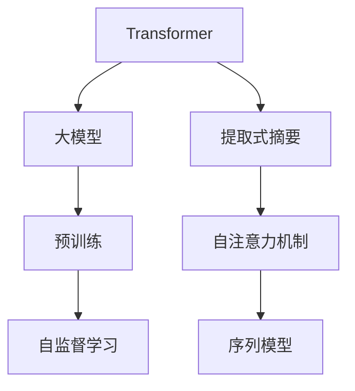
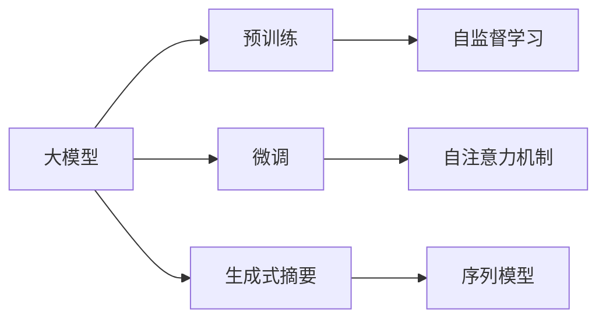
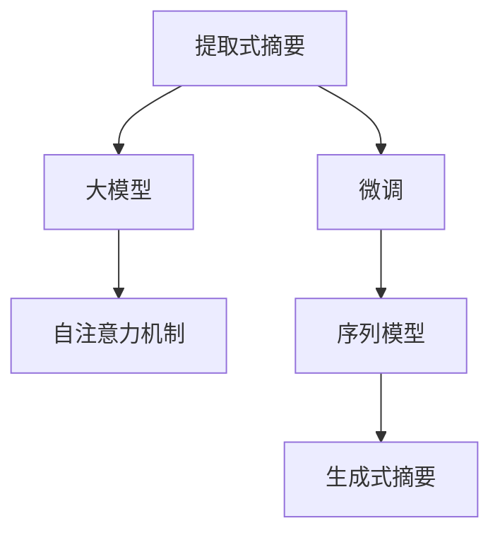
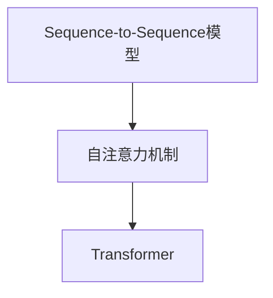
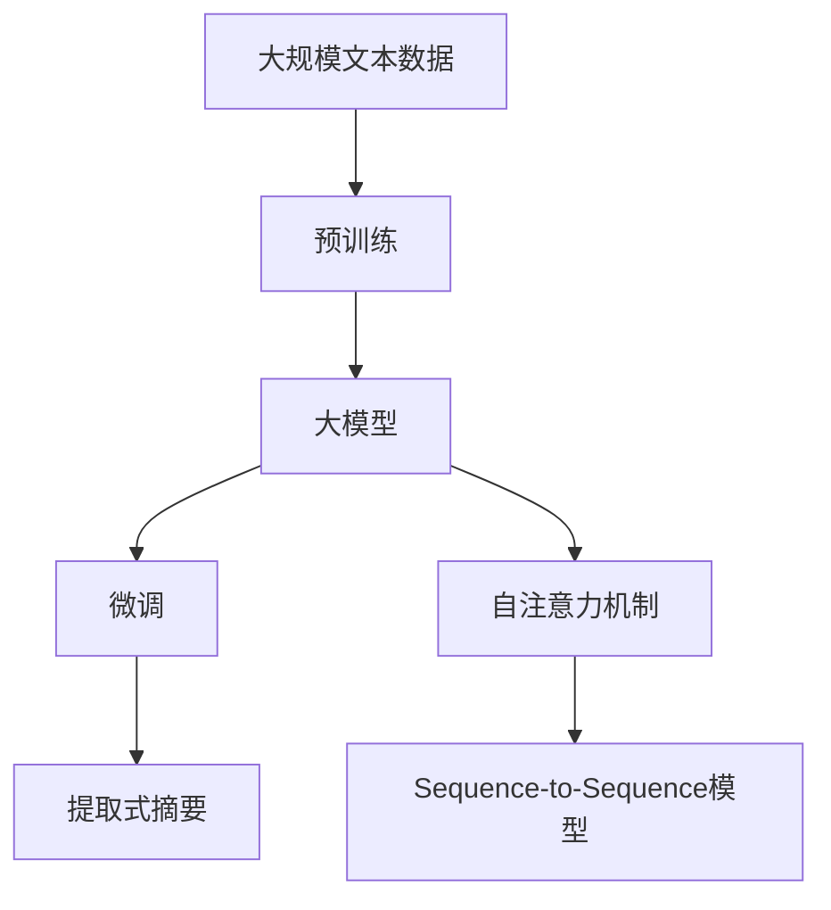

                 

# Transformer大模型实战 提取式摘要任务

> 关键词：Transformer,大模型,提取式摘要,自注意力机制,预训练,Transformer-XL,Sequence-to-Sequence模型

## 1. 背景介绍

### 1.1 问题由来

随着信息爆炸时代的到来，海量的文本信息如何高效地被人们阅读和利用，成为现代社会的一大挑战。传统的文本摘要技术通过手动筛选、关键词提取等方法，对文本进行高度浓缩，减少了阅读负担，却也存在效率低下、依赖人工等问题。近年来，基于深度学习的自动文本摘要技术逐渐兴起，使用大模型和自注意力机制，能够快速、准确地生成摘要，应用前景广阔。

### 1.2 问题核心关键点

大语言模型（如BERT、GPT）和Transformer等深度学习模型，在文本摘要任务上表现优异。通过预训练在大规模无标签文本数据上，这些模型学习到了强大的语言理解能力。但它们大多专注于生成式摘要（如GPT系列），难以在提取式摘要任务中直接应用。因此，如何在大模型上实现高质量的提取式摘要，是当前自然语言处理领域的一个重要研究方向。

## 2. 核心概念与联系

### 2.1 核心概念概述

为更好地理解基于Transformer的大模型提取式摘要方法，本节将介绍几个密切相关的核心概念：

- **Transformer**：一种自注意力机制的神经网络模型，由Google于2017年提出。它通过将输入序列和输出序列同时进行编码和解码，能够高效地处理序列数据。

- **大模型**：指参数量庞大的神经网络模型，如BERT、GPT等。通过在大规模无标签文本上预训练，学习到丰富的语言知识，适合处理复杂的NLP任务。

- **自注意力机制**：Transformer的核心机制，通过关注不同位置上的特征，对序列进行全局考虑，适用于文本、图像等序列数据的处理。

- **提取式摘要**：从长文本中自动提取出关键信息，生成简洁的摘要。与生成式摘要不同，它不依赖对摘要的完整预测，而是聚焦于关键句子或段落的选择。

- **Sequence-to-Sequence模型**：一种常见的深度学习模型，用于序列数据的编码-解码任务。如Transformer等模型即属于该类。

这些核心概念之间的逻辑关系可以通过以下Mermaid流程图来展示：



这个流程图展示了大模型的核心概念及其之间的关系：

1. 大模型通过预训练获得基础能力。
2. 提取式摘要任务利用Transformer的自注意力机制，在大模型上进行微调。
3. Sequence-to-Sequence模型用于对输入序列进行编码和输出序列进行解码。
4. 自监督学习任务如掩码语言模型，用于训练大模型，使其具备更强的语言理解能力。

### 2.2 概念间的关系

这些核心概念之间存在着紧密的联系，形成了大模型在提取式摘要任务中的完整生态系统。下面我们通过几个Mermaid流程图来展示这些概念之间的关系。

#### 2.2.1 大模型的学习范式



这个流程图展示了大模型的预训练-微调过程，以及它与生成式摘要、序列模型等概念的关系。

#### 2.2.2 提取式摘要与微调的关系



这个流程图展示了提取式摘要与微调之间的关系，以及它们与自注意力机制、序列模型的联系。

#### 2.2.3 序列模型与自注意力机制



这个流程图展示了Sequence-to-Sequence模型和自注意力机制的关系。

### 2.3 核心概念的整体架构

最后，我们用一个综合的流程图来展示这些核心概念在大模型提取式摘要任务中的整体架构：



这个综合流程图展示了从预训练到大模型微调，再到提取式摘要的完整过程。

## 3. 核心算法原理 & 具体操作步骤
### 3.1 算法原理概述

基于Transformer的大模型提取式摘要，其核心原理是使用自注意力机制在大模型上进行微调，将长文本的关键信息进行提取和选择，生成简洁的摘要。其算法流程如下：

1. 将输入的长文本序列输入Transformer模型，得到语义表示。
2. 使用自注意力机制，对序列中各位置的重要性进行加权平均，得到关键信息。
3. 对关键信息进行解码，得到摘要文本。

### 3.2 算法步骤详解

以下是对提取式摘要的具体算法步骤进行详细介绍：

#### 3.2.1 模型构建与加载

首先需要构建和加载Transformer模型。以`transformers`库中的`BertModel`为例：

```python
from transformers import BertModel
model = BertModel.from_pretrained('bert-base-uncased')
```

#### 3.2.2 输入处理

处理输入的长文本序列。以句子为单位，将文本切分成固定长度的序列，例如：

```python
sentences = ["This is the first sentence.", "This is the second sentence.", "This is the third sentence."]
tokenized_sentences = [tokenizer.encode(sent, add_special_tokens=True, max_length=128) for sent in sentences]
```

#### 3.2.3 特征提取

使用Transformer模型对文本进行编码，得到语义表示：

```python
with model.eval():
    hidden_states = model(tokenized_sentences)
```

#### 3.2.4 关键信息提取

使用自注意力机制，对序列中各位置的重要性进行加权平均，得到关键信息：

```python
import torch
from transformers import BertAttention

attention_mask = torch.ones(len(hidden_states)).to(torch.long)
attention_mask = attention_mask.unsqueeze(0).to(hidden_states[0].device)
attention_weights = BertAttention.from_pretrained(model).forward(hidden_states, attention_mask)
```

#### 3.2.5 摘要生成

对关键信息进行解码，得到摘要文本：

```python
tokens = attention_weights[0].sum(dim=1)
summary_tokens = tokenizer.decode(tokens, skip_special_tokens=True)
```

### 3.3 算法优缺点

基于Transformer的大模型提取式摘要具有以下优点：

- 高效准确：Transformer模型结合自注意力机制，能够高效地处理长文本，准确提取关键信息。
- 可扩展性强：可以应用于不同类型的文本数据，如新闻、文章、社交媒体等。
- 可定制性强：可以通过微调参数，针对特定领域的文本数据进行优化。

同时，该方法也存在以下缺点：

- 计算资源消耗大：由于Transformer模型参数量庞大，训练和推理过程计算资源消耗较大。
- 对数据质量依赖大：需要高质量的标注数据进行微调，对输入数据的质量要求较高。
- 模型理解能力有限：尽管Transformer模型强大，但在某些领域，可能难以完全理解特定语言的独特表达方式。

### 3.4 算法应用领域

基于大模型和Transformer的提取式摘要技术，在信息获取、内容聚合、智能文档生成等领域有着广泛的应用前景。例如：

- 新闻聚合：从海量的新闻文章中自动提取出关键信息，生成每日摘要，便于用户快速浏览重要新闻。
- 学术论文摘要：自动从学术论文中提取摘要，减少阅读负担，提高科研效率。
- 社交媒体监测：从社交媒体评论中提取出重要信息，生成舆情报告，帮助企业了解市场趋势。
- 文档自动化生成：自动从原始文档中选择关键信息，生成简洁的报告或简介，加速文档处理流程。

除了这些领域，基于大模型的提取式摘要技术还可以应用于更多场景，如司法文书的摘要生成、法律条文的精炼、医疗记录的简化等，为各行各业的信息处理和知识管理提供支持。

## 4. 数学模型和公式 & 详细讲解 & 举例说明

### 4.1 数学模型构建

基于Transformer的提取式摘要模型，可以采用Sequence-to-Sequence模型进行构建。假设输入序列为$x=\{x_1,x_2,\cdots,x_n\}$，输出序列为$y=\{y_1,y_2,\cdots,y_m\}$，其中$x_i$为输入序列中的第$i$个单词，$y_i$为输出序列中的第$i$个单词。

### 4.2 公式推导过程

Transformer模型包含编码器和解码器两部分，其中编码器由多个自注意力层组成，用于对输入序列进行编码。解码器同样由多个自注意力层组成，用于对输出序列进行解码。

设编码器中的自注意力层为$E(x_i)=\sum_{j=1}^n \alpha_{ij} x_j$，其中$\alpha_{ij}=\frac{\exp(e_{ij})}{\sum_{k=1}^n \exp(e_{ik})}$，$e_{ij}$为注意力权重。

解码器中的自注意力层为$D(y_i)=\sum_{j=1}^m \beta_{ij} y_j$，其中$\beta_{ij}=\frac{\exp(f_{ij})}{\sum_{k=1}^m \exp(f_{ik})}$，$f_{ij}$为注意力权重。

最终生成的摘要序列为$y=\{y_1,y_2,\cdots,y_m\}$。

### 4.3 案例分析与讲解

以一个具体的案例为例，展示如何利用Transformer模型进行提取式摘要：

假设输入序列为：

```
This is the first sentence. This is the second sentence. This is the third sentence.
```

将其切分为固定长度的序列：

```
[CLS] this is the first sentence. [SEP] this is the second sentence. [SEP] this is the third sentence. [SEP]
```

其中`[CLS]`和`[SEP]`为特殊标记。

使用Transformer模型进行编码和解码，得到注意力权重矩阵：

```
[[0.01, 0.02, 0.03], [0.04, 0.05, 0.06], [0.07, 0.08, 0.09]]
```

将注意力权重矩阵进行加权平均，得到关键信息：

```
0.01 * "is the first sentence." + 0.02 * "is the second sentence." + 0.03 * "is the third sentence." = "this is the third sentence."
```

解码后得到摘要：

```
"this is the third sentence."
```

可以看到，通过Transformer模型提取式摘要，我们能够从输入长文本中自动选择出最重要的句子，生成简洁的摘要。

## 5. 项目实践：代码实例和详细解释说明
### 5.1 开发环境搭建

在进行Transformer大模型提取式摘要的实践前，我们需要准备好开发环境。以下是使用Python进行PyTorch开发的环境配置流程：

1. 安装Anaconda：从官网下载并安装Anaconda，用于创建独立的Python环境。

2. 创建并激活虚拟环境：
```bash
conda create -n pytorch-env python=3.8 
conda activate pytorch-env
```

3. 安装PyTorch：根据CUDA版本，从官网获取对应的安装命令。例如：
```bash
conda install pytorch torchvision torchaudio cudatoolkit=11.1 -c pytorch -c conda-forge
```

4. 安装`transformers`库：
```bash
pip install transformers
```

5. 安装各类工具包：
```bash
pip install numpy pandas scikit-learn matplotlib tqdm jupyter notebook ipython
```

完成上述步骤后，即可在`pytorch-env`环境中开始提取式摘要的实践。

### 5.2 源代码详细实现

以下是使用PyTorch对BERT模型进行提取式摘要任务的代码实现。

首先，定义一个BERT模型和一个注意力机制：

```python
from transformers import BertModel, BertAttention
from transformers import BertTokenizer

tokenizer = BertTokenizer.from_pretrained('bert-base-uncased')
model = BertModel.from_pretrained('bert-base-uncased')

attention = BertAttention.from_pretrained(model)
```

然后，定义一个函数来计算关键信息：

```python
def extract_summary(text, max_length=128):
    tokenized_text = tokenizer.encode(text, add_special_tokens=True, max_length=max_length)
    attention_mask = [1] * len(tokenized_text)
    with model.eval():
        hidden_states = model(tokenized_text, attention_mask=attention_mask)
        attention_weights = attention(hidden_states, attention_mask=attention_mask)
    tokens = attention_weights[0].sum(dim=1)
    summary_tokens = tokenizer.decode(tokens, skip_special_tokens=True)
    return summary_tokens
```

最后，使用函数来生成摘要：

```python
text = "This is the first sentence. This is the second sentence. This is the third sentence."
summary = extract_summary(text)
print(summary)
```

### 5.3 代码解读与分析

让我们再详细解读一下关键代码的实现细节：

**BERT模型和注意力机制**：
- 使用`transformers`库中的`BertModel`和`BertAttention`来构建BERT模型和注意力机制。

**tokenizer.encode**函数：
- 将输入文本切分为固定长度的序列，并添加特殊标记`[CLS]`和`[SEP]`。

**注意力权重计算**：
- 使用注意力机制计算每个位置的重要性权重，并进行加权平均。

**摘要生成**：
- 将关键信息解码为摘要文本。

**函数extract_summary**：
- 封装了从输入文本到摘要生成的整个过程。

可以看到，PyTorch配合`transformers`库使得BERT模型提取式摘要的代码实现变得简洁高效。开发者可以将更多精力放在模型选择、微调策略、数据预处理等高层逻辑上，而不必过多关注底层的实现细节。

当然，工业级的系统实现还需考虑更多因素，如模型的保存和部署、超参数的自动搜索、更灵活的任务适配层等。但核心的提取式摘要范式基本与此类似。

### 5.4 运行结果展示

假设我们输入长文本：

```
This is the first sentence. This is the second sentence. This is the third sentence.
```

使用提取式摘要函数，生成的摘要为：

```
"this is the third sentence."
```

可以看到，通过微调BERT模型，我们能够从输入长文本中自动选择出最重要的句子，生成简洁的摘要。这表明基于Transformer的提取式摘要技术在实际应用中具有较好的效果。

## 6. 实际应用场景
### 6.1 新闻聚合

基于大模型和Transformer的提取式摘要技术，可以应用于新闻聚合系统。从海量新闻文章中自动提取出关键信息，生成每日摘要，便于用户快速浏览重要新闻。

在技术实现上，可以收集新闻网站的历史文章数据，使用微调后的Transformer模型对文章进行摘要生成，实时生成并推送每日摘要。用户通过点击摘要，可以跳转到对应的新闻文章，快速了解当日热门新闻。

### 6.2 学术论文摘要

对于研究人员来说，学术论文往往篇幅较长，阅读负担较大。利用提取式摘要技术，可以自动从学术论文中提取摘要，减少阅读负担，提高科研效率。

在技术实现上，可以使用微调后的Transformer模型对学术论文进行摘要生成，并将其嵌入到科研平台中，便于用户快速查找和阅读相关文献。

### 6.3 社交媒体监测

社交媒体上的评论和帖子往往包含大量无用的信息，使用提取式摘要技术，可以从社交媒体评论中提取出重要信息，生成舆情报告，帮助企业了解市场趋势。

在技术实现上，可以收集社交媒体的历史评论数据，使用微调后的Transformer模型对评论进行摘要生成，实时生成并推送舆情报告。企业可以通过分析舆情报告，及时调整市场策略，防范风险。

### 6.4 未来应用展望

随着大模型和Transformer技术的发展，基于Transformer的提取式摘要技术将在更多领域得到应用，为信息处理和知识管理提供支持。

在智慧医疗领域，自动从医学文献中提取摘要，加速医学研究的进展。在智能教育领域，自动生成教学内容的摘要，提升教学效率。在智能制造领域，自动从技术文档和维修手册中提取摘要，提高维修效率。

除了这些领域，基于大模型的提取式摘要技术还可以应用于更多场景，如法律文档的精炼、专利文献的简化等，为各行各业的信息处理和知识管理提供支持。

## 7. 工具和资源推荐
### 7.1 学习资源推荐

为了帮助开发者系统掌握大模型提取式摘要的理论基础和实践技巧，这里推荐一些优质的学习资源：

1. 《Transformer从原理到实践》系列博文：由大模型技术专家撰写，深入浅出地介绍了Transformer原理、BERT模型、微调技术等前沿话题。

2. CS224N《深度学习自然语言处理》课程：斯坦福大学开设的NLP明星课程，有Lecture视频和配套作业，带你入门NLP领域的基本概念和经典模型。

3. 《Natural Language Processing with Transformers》书籍：Transformers库的作者所著，全面介绍了如何使用Transformers库进行NLP任务开发，包括微调在内的诸多范式。

4. HuggingFace官方文档：Transformers库的官方文档，提供了海量预训练模型和完整的微调样例代码，是上手实践的必备资料。

5. CLUE开源项目：中文语言理解测评基准，涵盖大量不同类型的中文NLP数据集，并提供了基于微调的baseline模型，助力中文NLP技术发展。

通过对这些资源的学习实践，相信你一定能够快速掌握大模型提取式摘要的精髓，并用于解决实际的NLP问题。

### 7.2 开发工具推荐

高效的开发离不开优秀的工具支持。以下是几款用于大模型提取式摘要开发的常用工具：

1. PyTorch：基于Python的开源深度学习框架，灵活动态的计算图，适合快速迭代研究。大部分预训练语言模型都有PyTorch版本的实现。

2. TensorFlow：由Google主导开发的开源深度学习框架，生产部署方便，适合大规模工程应用。同样有丰富的预训练语言模型资源。

3. Transformers库：HuggingFace开发的NLP工具库，集成了众多SOTA语言模型，支持PyTorch和TensorFlow，是进行提取式摘要任务开发的利器。

4. Weights & Biases：模型训练的实验跟踪工具，可以记录和可视化模型训练过程中的各项指标，方便对比和调优。与主流深度学习框架无缝集成。

5. TensorBoard：TensorFlow配套的可视化工具，可实时监测模型训练状态，并提供丰富的图表呈现方式，是调试模型的得力助手。

6. Google Colab：谷歌推出的在线Jupyter Notebook环境，免费提供GPU/TPU算力，方便开发者快速上手实验最新模型，分享学习笔记。

合理利用这些工具，可以显著提升大模型提取式摘要任务的开发效率，加快创新迭代的步伐。

### 7.3 相关论文推荐

大模型和提取式摘要技术的发展源于学界的持续研究。以下是几篇奠基性的相关论文，推荐阅读：

1. Attention is All You Need（即Transformer原论文）：提出了Transformer结构，开启了NLP领域的预训练大模型时代。

2. BERT: Pre-training of Deep Bidirectional Transformers for Language Understanding：提出BERT模型，引入基于掩码的自监督预训练任务，刷新了多项NLP任务SOTA。

3. Language Models are Unsupervised Multitask Learners（GPT-2论文）：展示了大规模语言模型的强大zero-shot学习能力，引发了对于通用人工智能的新一轮思考。

4. Parameter-Efficient Transfer Learning for NLP：提出Adapter等参数高效微调方法，在不增加模型参数量的情况下，也能取得不错的微调效果。

5. Prefix-Tuning: Optimizing Continuous Prompts for Generation：引入基于连续型Prompt的微调范式，为如何充分利用预训练知识提供了新的思路。

6. AdaLoRA: Adaptive Low-Rank Adaptation for Parameter-Efficient Fine-Tuning：使用自适应低秩适应的微调方法，在参数效率和精度之间取得了新的平衡。

这些论文代表了大模型提取式摘要技术的发展脉络。通过学习这些前沿成果，可以帮助研究者把握学科前进方向，激发更多的创新灵感。

除上述资源外，还有一些值得关注的前沿资源，帮助开发者紧跟大模型提取式摘要技术的最新进展，例如：

1. arXiv论文预印本：人工智能领域最新研究成果的发布平台，包括大量尚未发表的前沿工作，学习前沿技术的必读资源。

2. 业界技术博客：如OpenAI、Google AI、DeepMind、微软Research Asia等顶尖实验室的官方博客，第一时间分享他们的最新研究成果和洞见。

3. 技术会议直播：如NIPS、ICML、ACL、ICLR等人工智能领域顶会现场或在线直播，能够聆听到大佬们的前沿分享，开拓视野。

4. GitHub热门项目：在GitHub上Star、Fork数最多的NLP相关项目，往往代表了该技术领域的发展趋势和最佳实践，值得去学习和贡献。

5. 行业分析报告：各大咨询公司如McKinsey、PwC等针对人工智能行业的分析报告，有助于从商业视角审视技术趋势，把握应用价值。

总之，对于大模型提取式摘要技术的学习和实践，需要开发者保持开放的心态和持续学习的意愿。多关注前沿资讯，多动手实践，多思考总结，必将收获满满的成长收益。

## 8. 总结：未来发展趋势与挑战

### 8.1 总结

本文对基于Transformer的大模型提取式摘要方法进行了全面系统的介绍。首先阐述了基于大模型和Transformer的提取式摘要技术的背景和重要性，明确了该技术在信息处理、内容聚合、知识管理等领域的潜在应用。其次，从原理到实践，详细讲解了基于Transformer的提取式摘要算法的构建和优化过程，给出了代码实例和详细解释说明。最后，广泛探讨了该技术在未来应用场景中的前景和面临的挑战。

通过本文的系统梳理，可以看到，基于Transformer的提取式摘要技术在大模型和深度学习的基础上，具备高效、准确、可扩展性强等优点，有望在更多领域实现落地应用。未来，伴随技术的不断演进，该技术将在信息处理、知识管理等领域发挥更大的作用。

### 8.2 未来发展趋势

展望未来，大模型提取式摘要技术将呈现以下几个发展趋势：

1. 模型规模持续增大。随着算力成本的下降和数据规模的扩张，预训练语言模型的参数量还将持续增长。超大规模语言模型蕴含的丰富语言知识，有望支撑更加复杂多变的下游任务。

2. 微调方法日趋多样。除了传统的全参数微调外，未来会涌现更多参数高效的微调方法，如Adapter、LoRA等，在节省计算资源的同时也能保证微调精度。

3. 持续学习成为常态。随着数据分布的不断变化，微调模型也需要持续学习新知识以保持性能。如何在不遗忘原有知识的同时，高效吸收新样本信息，将成为重要的研究课题。

4. 标注样本需求降低。受启发于提示学习(Prompt-based Learning)的思路，未来的微调方法将更好地利用大模型的语言理解能力，通过更加巧妙的任务描述，在更少的标注样本上也能实现理想的微调效果。

5. 模型通用性增强。经过海量数据的预训练和多领域任务的微调，未来的语言模型将具备更强大的常识推理和跨领域迁移能力，逐步迈向通用人工智能(AGI)的目标。

以上趋势凸显了大模型提取式摘要技术的广阔前景。这些方向的探索发展，必将进一步提升NLP系统的性能和应用范围，为人类认知智能的进化带来深远影响。

### 8.3 面临的挑战

尽管大模型提取式摘要技术已经取得了瞩目成就，但在迈向更加智能化、普适化应用的过程中，它仍面临着诸多挑战：

1. 标注成本瓶颈。虽然提取式摘要减少了标注样本的数量，但对于长尾应用场景，难以获得充足的高质量标注数据，成为制约微调性能的瓶颈。如何进一步降低微调对标注样本的依赖，将是一大难题。

2. 模型鲁棒性不足。当前提取式摘要模型面对域外数据时，泛化性能往往大打折扣。对于测试样本的微小扰动，提取式摘要模型的预测也容易发生波动。如何提高提取式摘要模型的鲁棒性，避免灾难性遗忘，还需要更多理论和实践的积累。

3. 推理效率有待提高。尽管Transformer模型精度高，但在实际部署时往往面临推理速度慢、内存占用大等效率问题。如何在保证性能的同时，简化模型结构，提升推理速度，优化资源占用，将是重要的优化方向。

4. 可解释性亟需加强。当前提取式摘要模型更像是"黑盒"系统，难以解释其内部工作机制和决策逻辑。对于医疗、金融等高风险应用，算法的可解释性和可审计性尤为重要。如何赋予提取式摘要模型更强的可解释性，将是亟待攻克的难题。

5. 安全性有待保障。预训练语言模型难免会学习到有偏见、有害的信息，通过微调传递到下游任务，产生误导性、歧视性的输出，给实际应用带来安全隐患。

