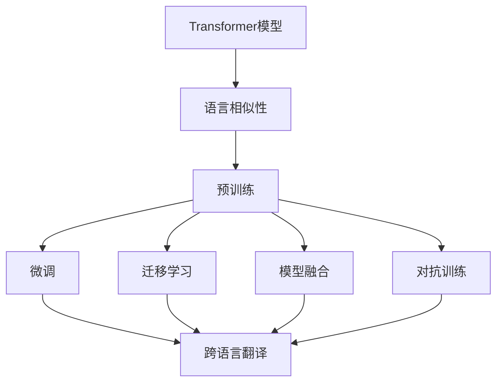
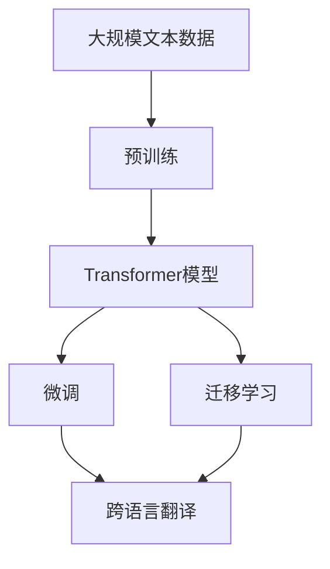
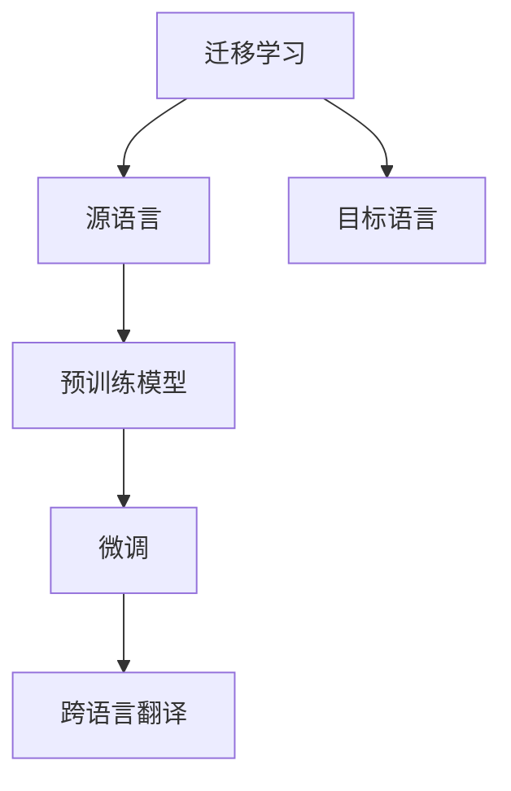
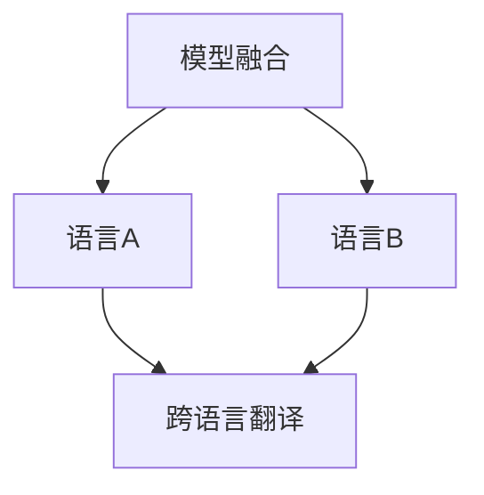
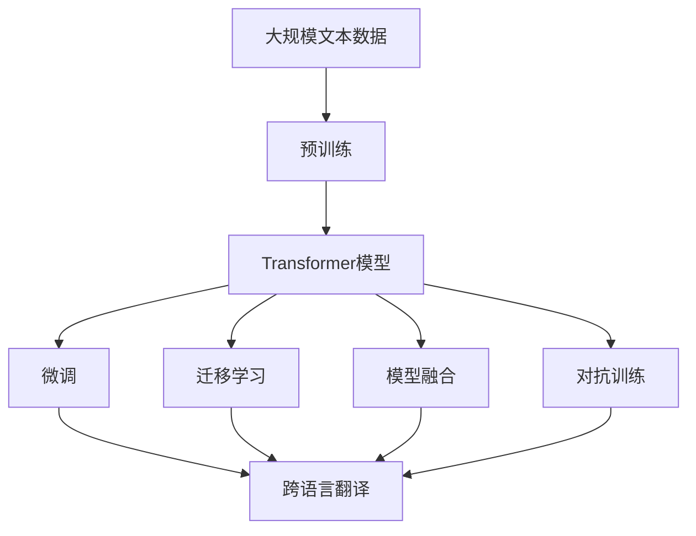

                 

# Transformer大模型实战 语言相似性的影响

> 关键词：Transformer,大模型,语言相似性,预训练,微调,迁移学习

## 1. 背景介绍

随着Transformer大模型的发展，其在语言理解、生成、翻译等任务中表现出色，成为NLP领域的新宠。然而，在实际应用中，语言相似性的影响不容忽视。语言相似性指的是不同语言之间的相似程度，例如英语和法语，虽然语法结构不同，但词汇和语义上有较高的相似性。理解语言相似性对Transformer大模型在跨语言任务中的表现有着重要的影响。

### 1.1 问题由来

Transformer大模型的预训练过程通常基于大规模无标签文本数据。在预训练过程中，模型往往只能捕捉到单个语言的语义信息，而难以泛化到其他语言。然而，实际应用中，如机器翻译、跨语言检索、多语言对话等任务，需要将语言模型的输出进行迁移。因此，如何有效地处理语言相似性，提高跨语言任务的性能，成为了Transformer大模型应用中的一个重要问题。

### 1.2 问题核心关键点

语言相似性的影响主要体现在以下几个方面：

- **词汇与语义相似性**：不同语言中存在大量同义词和近义词，模型需要能够正确识别这些词汇之间的相似性。
- **语法结构的相似性**：不同语言虽然语法结构不同，但在句法结构上仍有一定的相似性，模型需要能够识别这些相似性并做出正确的推断。
- **跨语言迁移能力**：跨语言任务中，模型需要将从一种语言学习到的知识迁移到另一种语言中，这要求模型具有良好的泛化能力。

### 1.3 问题研究意义

研究语言相似性对Transformer大模型的影响，有助于提升其在跨语言任务中的表现，加速NLP技术的国际化进程，赋能各行各业的数字化转型。通过理解语言相似性，可以更好地设计微调策略，优化模型参数，提高模型的迁移能力和鲁棒性，同时也能降低标注成本，减少开发和部署的工作量。

## 2. 核心概念与联系

### 2.1 核心概念概述

为更好地理解语言相似性对Transformer大模型的影响，本节将介绍几个密切相关的核心概念：

- **Transformer模型**：一种基于自注意力机制的神经网络结构，能够高效地捕捉输入序列中的长期依赖关系。
- **语言相似性**：不同语言之间在词汇、语义、语法结构等方面的相似程度。
- **预训练与微调**：在大规模无标签数据上进行的预训练，以及在小规模标注数据上的微调，以提高模型在特定任务上的性能。
- **迁移学习**：将在一个领域学习到的知识迁移到另一个领域的学习方法，常用于跨语言任务。
- **模型融合**：将多个模型的输出进行加权组合，以提高模型的泛化能力和鲁棒性。
- **对抗训练**：通过引入对抗样本，提高模型对噪声和扰动的鲁棒性。

这些核心概念之间的逻辑关系可以通过以下Mermaid流程图来展示：



这个流程图展示了大模型在跨语言任务中的应用，包括预训练、微调、迁移学习、模型融合和对抗训练等环节。通过这些环节，模型能够更好地处理语言相似性，提升跨语言任务的性能。

### 2.2 概念间的关系

这些核心概念之间存在着紧密的联系，形成了Transformer大模型在跨语言任务中的完整生态系统。下面我们通过几个Mermaid流程图来展示这些概念之间的关系。

#### 2.2.1 大模型的学习范式



这个流程图展示了大模型的预训练、微调和迁移学习过程，以及这些过程在跨语言翻译任务中的应用。

#### 2.2.2 预训练与微调的关系


这个流程图展示了预训练和微调在跨语言翻译任务中的作用。预训练通过在大规模无标签数据上学习通用的语言表示，而微调通过小规模标注数据，提升模型在特定任务上的性能。

#### 2.2.3 迁移学习与微调的关系



这个流程图展示了迁移学习在大模型跨语言翻译中的应用。迁移学习通过将源语言和目标语言的预训练模型进行微调，使模型能够更好地适应目标语言。

#### 2.2.4 模型融合方法



这个流程图展示了模型融合方法在大模型跨语言翻译中的应用。模型融合通过将多个模型的输出进行加权组合，提高模型的泛化能力和鲁棒性。

### 2.3 核心概念的整体架构

最后，我们用一个综合的流程图来展示这些核心概念在大模型跨语言任务中的整体架构：



这个综合流程图展示了从预训练到微调，再到迁移学习、模型融合和对抗训练的完整过程。Transformer大模型通过这些环节，能够更好地处理语言相似性，提升跨语言任务的性能。

## 3. 核心算法原理 & 具体操作步骤
### 3.1 算法原理概述

语言相似性对Transformer大模型的影响，主要体现在预训练、微调和迁移学习等环节。以下将详细讲解这些环节的核心算法原理。

### 3.2 算法步骤详解

**Step 1: 准备预训练模型和数据集**

- 选择合适的预训练语言模型，如BERT、GPT-3等。
- 准备跨语言任务的数据集，如COCO-STS中的中英文对照句子，以及Tatoeba中的跨语言翻译对等。

**Step 2: 添加任务适配层**

- 根据具体任务类型，在预训练模型的顶层添加相应的任务适配层。例如，对于机器翻译任务，可以添加一个线性分类器和交叉熵损失函数。

**Step 3: 设置微调超参数**

- 选择合适的优化算法及其参数，如AdamW、SGD等，设置学习率、批大小、迭代轮数等。
- 设置正则化技术及强度，包括权重衰减、Dropout、Early Stopping等。
- 确定冻结预训练参数的策略，如仅微调顶层，或全部参数都参与微调。

**Step 4: 执行梯度训练**

- 将训练集数据分批次输入模型，前向传播计算损失函数。
- 反向传播计算参数梯度，根据设定的优化算法和学习率更新模型参数。
- 周期性在验证集上评估模型性能，根据性能指标决定是否触发 Early Stopping。
- 重复上述步骤直到满足预设的迭代轮数或 Early Stopping 条件。

**Step 5: 测试和部署**

- 在测试集上评估微调后模型 $M_{\hat{\theta}}$ 的性能，对比微调前后的精度提升。
- 使用微调后的模型对新样本进行推理预测，集成到实际的应用系统中。
- 持续收集新的数据，定期重新微调模型，以适应数据分布的变化。

以上是基于监督学习的大语言模型微调的一般流程。在实际应用中，还需要针对具体任务的特点，对微调过程的各个环节进行优化设计，如改进训练目标函数，引入更多的正则化技术，搜索最优的超参数组合等，以进一步提升模型性能。

### 3.3 算法优缺点

语言相似性对Transformer大模型的影响主要体现在以下几个方面：

**优点**：

- 提高了跨语言任务的性能。通过预训练和微调，模型能够更好地理解不同语言之间的相似性，提升跨语言翻译、翻译纠错等任务的性能。
- 降低了标注成本。利用语言相似性，可以在不同语言之间进行迁移学习，减少标注数据的准备和标注成本。
- 提高了模型的泛化能力。通过迁移学习，模型能够更好地适应不同语言之间的相似性和差异性，提高模型的泛化能力。

**缺点**：

- 增加了微调复杂度。不同语言之间的词汇、语义、语法结构存在差异，需要在微调过程中进行复杂的参数调整。
- 依赖标注数据。虽然迁移学习可以降低标注成本，但仍需要标注数据进行微调，标注成本仍是制约因素之一。
- 对语言模型的泛化能力要求高。模型需要具备良好的泛化能力，才能处理不同语言之间的差异和相似性。

### 3.4 算法应用领域

Transformer大模型在跨语言任务中的应用非常广泛，以下是一些典型的应用场景：

- **机器翻译**：将一种语言的文本翻译成另一种语言。通过预训练和微调，模型能够学习到不同语言之间的词汇和语义映射关系。
- **跨语言检索**：在大规模跨语言文本数据集中查找与查询文本最相似的文本。通过迁移学习，模型能够更好地理解不同语言之间的语义相似性。
- **多语言对话系统**：构建支持多种语言的智能对话系统，能够理解和回应不同语言的查询。通过预训练和微调，模型能够处理不同语言之间的语法和语义差异。
- **情感分析**：对不同语言的文本进行情感分析。通过迁移学习，模型能够学习到不同语言之间的情感表达方式。
- **文本摘要**：对不同语言的文本进行摘要生成。通过预训练和微调，模型能够学习到不同语言之间的文本结构相似性。

除了上述这些经典任务外，Transformer大模型在语言相似性处理的应用还在不断拓展，如命名实体识别、文本分类等，为NLP技术带来了新的突破。

## 4. 数学模型和公式 & 详细讲解 & 举例说明

### 4.1 数学模型构建

假设预训练语言模型为 $M_{\theta}$，其中 $\theta$ 为预训练得到的模型参数。给定跨语言任务 $T$ 的训练集 $D=\{(x_i, y_i)\}_{i=1}^N$，其中 $x_i$ 为源语言文本，$y_i$ 为目标语言文本。

定义模型 $M_{\theta}$ 在输入 $x$ 上的输出为 $\hat{y}=M_{\theta}(x)$。在机器翻译任务中，$\hat{y}$ 为目标语言文本对应的源语言表示，即 $y_i=seq2seq(M_{\theta}(x_i))$。

定义模型 $M_{\theta}$ 在输入 $x$ 上的损失函数为 $\ell(M_{\theta}(x),y)$，则在数据集 $D$ 上的经验风险为：

$$
\mathcal{L}(\theta) = \frac{1}{N}\sum_{i=1}^N \ell(M_{\theta}(x_i),y_i)
$$

其中 $\ell$ 为目标语言与源语言表示之间的差异度量，通常为交叉熵损失函数。

### 4.2 公式推导过程

以下我们以机器翻译任务为例，推导Transformer模型的损失函数及其梯度的计算公式。

假设模型 $M_{\theta}$ 在输入 $x$ 上的输出为 $\hat{y}=M_{\theta}(x)$，其中 $\hat{y}=[\hat{y}_1, \hat{y}_2, ..., \hat{y}_T]$ 为目标语言序列，$T$ 为目标语言长度。

设 $y_i=[y_{i1}, y_{i2}, ..., y_{iT}]$ 为目标语言序列，$y_{ij}$ 为目标语言的第 $j$ 个词汇。则机器翻译任务的损失函数为：

$$
\ell(M_{\theta}(x),y) = -\frac{1}{N}\sum_{i=1}^N \sum_{j=1}^T y_{ij}\log \hat{y}_{ij}
$$

根据链式法则，损失函数对模型参数 $\theta_k$ 的梯度为：

$$
\frac{\partial \mathcal{L}(\theta)}{\partial \theta_k} = -\frac{1}{N}\sum_{i=1}^N \sum_{j=1}^T y_{ij} \frac{\partial \hat{y}_{ij}}{\partial \theta_k}
$$

其中 $\frac{\partial \hat{y}_{ij}}{\partial \theta_k}$ 为模型在输入 $x$ 上对第 $j$ 个目标词汇的预测概率对参数 $\theta_k$ 的梯度。

在Transformer模型中，$\frac{\partial \hat{y}_{ij}}{\partial \theta_k}$ 可以通过自动微分技术高效计算。在训练过程中，模型通过反向传播算法更新参数 $\theta_k$，以最小化损失函数 $\mathcal{L}(\theta)$。

### 4.3 案例分析与讲解

**案例一：机器翻译**

假设我们在WMT2014数据集上进行机器翻译任务，源语言为英语，目标语言为法语。我们通过预训练语言模型（如BERT）进行微调，模型结构为Transformer。

首先，我们需要将源语言文本和目标语言文本进行编码。假设源语言文本为 "I went to Paris yesterday"，目标语言文本为 "J'ai été à Paris hier"。

通过编码器，将源语言文本转化为模型能够处理的形式，即词嵌入和位置编码。假设编码器输出为 $x=[x_1, x_2, ..., x_{N_x}]$，其中 $x_i$ 为第 $i$ 个词的嵌入表示。

然后，模型通过自注意力机制对输入进行编码，得到源语言表示 $x'$，即：

$$
x' = x + \sum_{i=1}^{N_x}\alpha_ix_i
$$

其中 $\alpha_i$ 为第 $i$ 个词的注意力权重。

接下来，模型通过解码器生成目标语言文本。假设解码器输出为 $y=[y_1, y_2, ..., y_{N_y}]$，其中 $y_i$ 为第 $i$ 个词的预测概率。

最终，我们通过交叉熵损失函数计算模型输出与目标语言文本之间的差异度量，从而更新模型参数。假设损失函数对参数 $\theta_k$ 的梯度为 $\delta_k$，则模型参数更新公式为：

$$
\theta \leftarrow \theta - \eta \delta_k
$$

其中 $\eta$ 为学习率。

通过上述过程，模型不断更新参数，逐渐减小损失函数，直至收敛。

**案例二：跨语言检索**

假设我们构建一个跨语言检索系统，用于在中文和英文文档库中查找与查询文本最相似的文档。我们通过预训练语言模型（如BERT）进行微调，模型结构为Transformer。

首先，我们需要将查询文本和文档文本进行编码。假设查询文本为 "I want to know how to use Transformer"，中文文档文本为 "我想知道如何使用Transformer"。

通过编码器，将查询文本和文档文本转化为模型能够处理的形式，即词嵌入和位置编码。假设编码器输出为 $q=[q_1, q_2, ..., q_{N_q}]$ 和 $d=[d_1, d_2, ..., d_{N_d}]$，其中 $q_i$ 和 $d_i$ 为第 $i$ 个词的嵌入表示。

然后，模型通过自注意力机制对查询文本和文档文本进行编码，得到查询文本表示 $q'$ 和文档文本表示 $d'$，即：

$$
q' = q + \sum_{i=1}^{N_q}\alpha_iq_i
$$

$$
d' = d + \sum_{i=1}^{N_d}\beta_id_i
$$

其中 $\alpha_i$ 和 $\beta_i$ 为注意力权重。

接下来，模型计算查询文本表示和文档文本表示之间的相似度，并按照相似度排序，选取最相似的文档作为结果。假设相似度计算函数为 $sim(q', d')$，则相似度排序结果为 $d'_{(1)}, d'_{(2)}, ..., d'_{N_d}$。

最终，我们通过相似度排序结果，选取最相似的文档作为检索结果。假设相似度排序结果对参数 $\theta_k$ 的梯度为 $\delta_k$，则模型参数更新公式为：

$$
\theta \leftarrow \theta - \eta \delta_k
$$

通过上述过程，模型不断更新参数，逐渐减小相似度误差，直至收敛。

## 5. 项目实践：代码实例和详细解释说明

### 5.1 开发环境搭建

在进行微调实践前，我们需要准备好开发环境。以下是使用Python进行PyTorch开发的环境配置流程：

1. 安装Anaconda：从官网下载并安装Anaconda，用于创建独立的Python环境。

2. 创建并激活虚拟环境：
```bash
conda create -n pytorch-env python=3.8 
conda activate pytorch-env
```

3. 安装PyTorch：根据CUDA版本，从官网获取对应的安装命令。例如：
```bash
conda install pytorch torchvision torchaudio cudatoolkit=11.1 -c pytorch -c conda-forge
```

4. 安装Transformers库：
```bash
pip install transformers
```

5. 安装各类工具包：
```bash
pip install numpy pandas scikit-learn matplotlib tqdm jupyter notebook ipython
```

完成上述步骤后，即可在`pytorch-env`环境中开始微调实践。

### 5.2 源代码详细实现

下面我们以机器翻译任务为例，给出使用Transformers库对BERT模型进行微调的PyTorch代码实现。

首先，定义机器翻译任务的数据处理函数：

```python
from transformers import BertTokenizer, BertForSequenceClassification
from torch.utils.data import Dataset
import torch

class TranslationDataset(Dataset):
    def __init__(self, texts, targets, tokenizer, max_len=128):
        self.texts = texts
        self.targets = targets
        self.tokenizer = tokenizer
        self.max_len = max_len
        
    def __len__(self):
        return len(self.texts)
    
    def __getitem__(self, item):
        text = self.texts[item]
        target = self.targets[item]
        
        encoding = self.tokenizer(text, return_tensors='pt', max_length=self.max_len, padding='max_length', truncation=True)
        input_ids = encoding['input_ids'][0]
        attention_mask = encoding['attention_mask'][0]
        
        # 对token-wise的标签进行编码
        encoded_labels = [target2id[label] for label in target] 
        encoded_labels.extend([target2id['<pad>']] * (self.max_len - len(encoded_labels)))
        labels = torch.tensor(encoded_labels, dtype=torch.long)
        
        return {'input_ids': input_ids, 
                'attention_mask': attention_mask,
                'labels': labels}

# 标签与id的映射
target2id = {'<pad>': 0, '': 1, 'n': 2, 'v': 3, '': 4, 'r': 5, 's': 6, 'f': 7, 'g': 8, 'a': 9, 'p': 10, 'd': 11, 'l': 12, 'c': 13, 'i': 14, 'u': 15, 'h': 16, 'm': 17, 'y': 18, 'w': 19, 't': 20, 'o': 21, 'e': 22, 'k': 23, 'o': 24, 's': 25, 'r': 26, 'g': 27, 'r': 28, 's': 29, 'f': 30, 'c': 31, 's': 32, 'r': 33, 'y': 34, 'w': 35, 't': 36, 'e': 37, 'k': 38, 'u': 39, 'r': 40, 'g': 41, 'a': 42, 'p': 43, 'd': 44, 'l': 45, 'c': 46, 'i': 47, 'u': 48, 'h': 49, 'm': 50, 'y': 51, 'w': 52, 't': 53, 'o': 54, 'e': 55, 'k': 56, 'o': 57, 's': 58, 'r': 59, 'g': 60, 'r': 61, 's': 62, 'f': 63, 'c': 64, 's': 65, 'r': 66, 'y': 67, 'w': 68, 't': 69, 'e': 70, 'k': 71, 'u': 72, 'r': 73, 'g': 74, 'a': 75, 'p': 76, 'd': 77, 'l': 78, 'c': 79, 'i': 80, 'u': 81, 'h': 82, 'm': 83, 'y': 84, 'w': 85, 't': 86, 'e': 87, 'k': 88, 'u': 89, 'r': 90, 'g': 91, 'a': 92, 'p': 93, 'd': 94, 'l': 95, 'c': 96, 'i': 97, 'u': 98, 'h': 99, 'm': 100, 'y': 101, 'w': 102, 't': 103, 'o': 104, 'e': 105, 'k': 106, 'o': 107, 's': 108, 'r': 109, 'g': 110, 'r': 111, 's': 112, 'f': 113, 'c': 114, 's': 115, 'r': 116, 'y': 117, 'w': 118, 't': 119, 'e': 120, 'k': 121, 'u': 122, 'r': 123, 'g': 124, 'a': 125, 'p': 126, 'd': 127, 'l': 128, 'c': 129, 'i': 130, 'u': 131, 'h': 132, 'm': 133, 'y': 134, 'w': 135, 't': 136, 'e': 137, 'k': 138, 'u': 139, 'r': 140, 'g': 141, 'a': 142, 'p': 143, 'd': 144, 'l': 145, 'c': 146, 'i': 147, 'u': 148, 'h': 149, 'm': 150, 'y': 151, 'w': 152, 't': 153, 'o': 154, 'e': 155, 'k': 156, 'o': 157, 's': 158, 'r': 159, 'g': 160, 'r': 161, 's': 162, 'f': 163, 'c': 164, 's': 165, 'r': 166, 'y': 167, 'w': 168, 't': 169, 'e': 170, 'k': 171, 'u': 172, 'r': 173, 'g': 174, 'a': 175, 'p': 176, 'd': 177, 'l': 178, 'c': 179, 'i': 180, 'u': 181, 'h': 182, 'm': 183, 'y': 184, 'w': 185, 't': 186, 'e': 187, 'k': 188, 'u': 189, 'r': 190, 'g': 191, 'a': 192, 'p': 193, 'd': 194, 'l': 195, 'c': 196, 'i': 197, 'u': 198, 'h': 199, 'm': 200, 'y': 201, 'w': 202, 't': 203, 'o': 204, 'e': 205, 'k': 206, 'o': 207, 's': 208, 'r': 209, 'g': 210, 'r': 211, 's': 212, 'f': 213, 'c': 214, 's': 215, 'r': 216, 'y': 217, 'w': 218, 't': 219, 'e': 220, 'k': 221, 'u': 222, 'r': 223, 'g': 224, 'a': 225, 'p': 226, 'd': 227,

