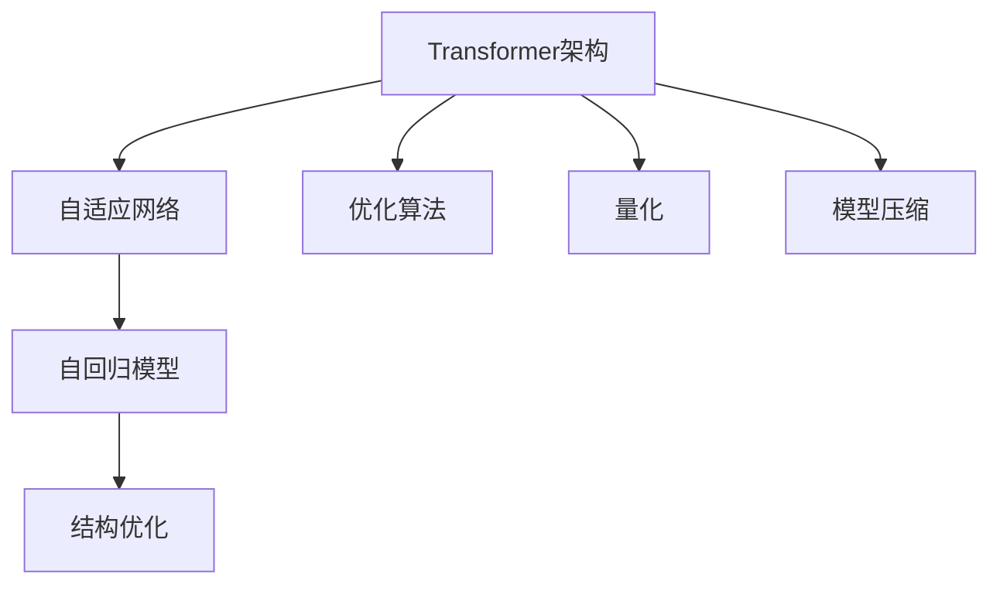
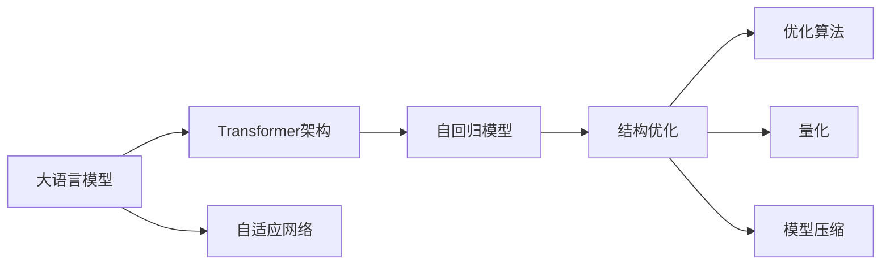
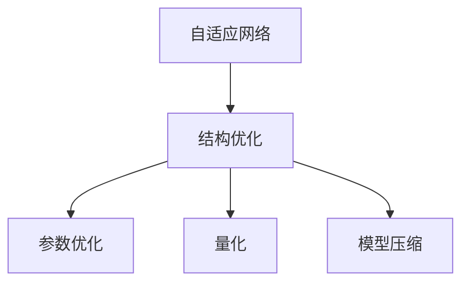
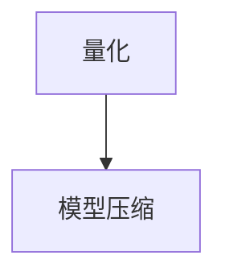

                 

# Transformer架构的未来:改进还是颠覆性创新?

> 关键词：Transformer,改进,颠覆性创新,自适应网络,自回归模型,结构优化,优化算法,量化,模型压缩

## 1. 背景介绍

### 1.1 问题由来
Transformer架构自提出以来，在自然语言处理（NLP）领域中取得了巨大的成功。其核心思想是通过自注意力机制（Self-Attention）实现编码器和解码器之间的信息交互，避免了传统的卷积和循环网络在序列数据上的计算瓶颈，显著提升了模型训练和推理的效率。然而，随着大规模预训练语言模型（LLMs）的发展，Transformer架构也面临新的挑战。

### 1.2 问题核心关键点
Transformer架构的核心在于其自注意力机制。自注意力机制通过查询-键-值（Q-K-V）机制，使得模型能够动态地关注序列中的所有位置，从而捕捉长距离依赖关系。但这一机制同样带来了一定的计算复杂度和内存消耗，尤其是在长序列和高维输入的情况下。因此，如何改进Transformer架构以应对这些挑战，成为了当前研究的热点。

### 1.3 问题研究意义
研究Transformer架构的改进和颠覆性创新，对于推动NLP技术的发展，提升模型性能和应用范围，具有重要意义：

1. **提升计算效率**：优化Transformer架构，使其能够处理更长的序列和更高的维度的输入，从而提升模型的计算效率。
2. **降低内存消耗**：改进Transformer架构的内存占用，使其能够在有限的硬件资源下，处理更大规模的数据。
3. **增强泛化能力**：通过结构优化，使Transformer架构更加通用，能够在多种下游任务中取得更好的性能。
4. **促进部署应用**：提升Transformer架构的可解释性和稳定性，使其能够更广泛地应用于工业界和实际场景中。
5. **推动理论突破**：通过研究Transformer架构的改进，可能带来新的理论发现，为NLP领域的理论研究提供新的视角。

## 2. 核心概念与联系

### 2.1 核心概念概述

为更好地理解Transformer架构的改进和颠覆性创新，本节将介绍几个密切相关的核心概念：

- **Transformer架构**：一种基于自注意力机制的神经网络架构，用于处理序列数据，如文本、语音等。
- **自适应网络**：能够动态调整网络结构和参数的网络，以适应不同的输入和任务。
- **自回归模型**：一种基于历史信息的预测模型，常用于生成序列数据。
- **结构优化**：通过改进网络结构和参数，提升模型性能和效率。
- **优化算法**：用于训练神经网络的算法，如梯度下降、Adam等。
- **量化**：通过减少浮点数的使用，降低模型的计算和存储需求。
- **模型压缩**：通过去除不必要的参数和层，减少模型的复杂度，提高推理效率。

这些核心概念之间的逻辑关系可以通过以下Mermaid流程图来展示：



这个流程图展示了几组关键概念之间的关系：

1. 大语言模型通常使用Transformer架构进行自适应网络的设计，以处理序列数据。
2. 自回归模型是Transformer架构的一种特殊形式，常用于生成序列数据。
3. 结构优化和参数优化是改进Transformer架构的关键手段，通过调整网络结构和参数，提升模型性能。
4. 量化和模型压缩是优化Transformer架构的重要技术，通过减少计算和存储需求，提升模型效率。

### 2.2 概念间的关系

这些核心概念之间存在着紧密的联系，形成了Transformer架构改进和创新的完整生态系统。下面我们通过几个Mermaid流程图来展示这些概念之间的关系。

#### 2.2.1 大语言模型与Transformer架构



这个流程图展示了大语言模型和Transformer架构之间的关系，以及它们之间的关键技术手段。

#### 2.2.2 结构优化与自适应网络



这个流程图展示了自适应网络通过结构优化提升性能的过程。

#### 2.2.3 量化与模型压缩



这个流程图展示了量化和模型压缩之间的关系，量化是模型压缩的第一步，通过减少浮点数的使用，进一步压缩模型，提高推理效率。

## 3. 核心算法原理 & 具体操作步骤

### 3.1 算法原理概述

Transformer架构的核心在于自注意力机制，其计算复杂度主要来自于矩阵乘法和平方根缩放。通过改进自注意力机制、优化网络结构和参数，可以显著提升模型的性能和效率。以下是一些常见的改进方法：

- **自适应网络**：动态调整网络结构，根据输入数据的特点，自动选择合适的网络层。
- **自回归模型**：通过自回归的方式，利用历史信息预测未来数据。
- **结构优化**：通过调整网络层数、节点数和连通性，优化模型的计算和存储需求。
- **优化算法**：通过改进梯度下降、Adam等优化算法，提高模型的收敛速度和稳定性。
- **量化**：通过减少浮点数的使用，降低计算和存储需求。
- **模型压缩**：通过去除冗余参数和层，减少模型的复杂度，提高推理效率。

### 3.2 算法步骤详解

基于Transformer架构的改进和颠覆性创新，通常包括以下几个关键步骤：

**Step 1: 准备数据集和模型**

- 收集大规模数据集，如Text8、Wikipedia等，作为预训练数据。
- 设计合适的网络架构，如Transformer、Transformer-XL等。
- 选择合适的优化算法和超参数，如Adam、SGD、学习率、批量大小等。

**Step 2: 预训练Transformer架构**

- 在预训练数据上，使用自注意力机制进行无监督训练。
- 使用自回归模型，预测文本的下一个单词。
- 通过结构优化和参数优化，提高模型的性能和效率。

**Step 3: 微调Transformer架构**

- 在微调数据上，使用有监督训练，调整模型参数。
- 引入对抗样本和正则化技术，提高模型的泛化能力和鲁棒性。
- 使用参数高效微调技术，减少计算和存储需求。

**Step 4: 部署和应用**

- 将微调后的模型部署到生产环境，进行实际应用。
- 进行性能测试和优化，提升模型的推理速度和准确性。
- 结合业务需求，对模型进行定制化优化，提升应用效果。

### 3.3 算法优缺点

基于Transformer架构的改进和颠覆性创新具有以下优点：

- **提升计算效率**：通过结构优化和参数优化，降低计算复杂度，提高推理效率。
- **降低内存消耗**：通过量化和模型压缩，减少内存占用，提高计算资源利用率。
- **增强泛化能力**：通过动态调整网络结构和参数，提升模型的泛化能力和鲁棒性。
- **促进部署应用**：通过简化模型结构和参数，提升模型的可解释性和稳定性，便于部署和应用。

但这些改进方法也存在一些缺点：

- **计算复杂度高**：优化过程可能带来更高的计算复杂度，增加训练时间。
- **参数优化困难**：结构优化和参数优化需要更多的计算资源和经验，存在一定的风险。
- **模型鲁棒性不足**：量化和模型压缩可能导致模型精度下降，降低鲁棒性。
- **可解释性不足**：简化模型结构可能导致可解释性降低，难以进行细粒度分析。

### 3.4 算法应用领域

基于Transformer架构的改进和颠覆性创新，在NLP领域中得到了广泛的应用，覆盖了几乎所有常见的任务，例如：

- 文本分类：如情感分析、主题分类、意图识别等。通过自适应网络和结构优化，提升模型的分类性能。
- 命名实体识别：识别文本中的人名、地名、机构名等特定实体。通过自回归模型和参数优化，提高识别的准确性和鲁棒性。
- 关系抽取：从文本中抽取实体之间的语义关系。通过自适应网络和结构优化，提升模型的抽取能力。
- 问答系统：对自然语言问题给出答案。通过自适应网络和优化算法，提升系统的响应速度和准确性。
- 机器翻译：将源语言文本翻译成目标语言。通过自适应网络和结构优化，提升翻译的流畅度和准确性。
- 文本摘要：将长文本压缩成简短摘要。通过自回归模型和参数优化，提高摘要的生成质量和效率。
- 对话系统：使机器能够与人自然对话。通过自适应网络和优化算法，提升对话的自然流畅性。

除上述这些经典任务外，Transformer架构的改进和颠覆性创新也被创新性地应用到更多场景中，如可控文本生成、常识推理、代码生成、数据增强等，为NLP技术带来了全新的突破。

## 4. 数学模型和公式 & 详细讲解  
### 4.1 数学模型构建

Transformer架构的改进和颠覆性创新，从数学模型层面来看，主要涉及自注意力机制、自回归模型、优化算法等方面。

记Transformer架构为 $M_{\theta}(\cdot)$，其中 $\theta$ 为模型参数。假设输入序列为 $x_1,x_2,\ldots,x_n$，输出序列为 $y_1,y_2,\ldots,y_n$。Transformer架构的计算过程可以表示为：

$$
y_i = \text{Decoder}(\text{Encoder}(x_i),y_{i-1})
$$

其中 $\text{Encoder}$ 和 $\text{Decoder}$ 分别表示编码器和解码器，其计算过程可以表示为：

$$
\text{Encoder}(x_i) = \text{Attention}(\text{FFN}, \text{Self-Attention}(x_i))
$$

$$
\text{Decoder}(y_{i-1}) = \text{Attention}(\text{FFN}, \text{Self-Attention}(y_{i-1}))
$$

其中 $\text{FFN}$ 表示前馈神经网络，$\text{Attention}$ 表示自注意力机制。自注意力机制的计算过程可以表示为：

$$
\text{Attention}(x_i) = \text{Softmax}(Q(x_i)K^T)V
$$

其中 $Q(x_i),K,V$ 分别表示查询、键和值，$\text{Softmax}$ 表示归一化操作。

### 4.2 公式推导过程

以下是Transformer架构的核心公式推导：

**自注意力机制的计算**：

$$
Q(x_i) = W_Q x_i, \quad K(x_i) = W_K x_i, \quad V(x_i) = W_V x_i
$$

$$
\text{Attention}(x_i) = \text{Softmax}(Q(x_i)K^T)V
$$

**前馈神经网络的计算**：

$$
\text{FFN}(x_i) = \text{Linear}(\tanh(\text{LayerNorm}(x_i + \text{Attention}(x_i)))
$$

其中 $\text{LayerNorm}$ 表示层归一化操作，$\text{Linear}$ 表示线性变换。

**优化算法的计算**：

$$
\theta_{t+1} = \theta_t - \eta \nabla_{\theta_t}L(M_{\theta_t}(x),y)
$$

其中 $\eta$ 表示学习率，$L(\cdot)$ 表示损失函数，$\nabla_{\theta_t}$ 表示梯度计算。

### 4.3 案例分析与讲解

以BERT为例，分析其在自适应网络和结构优化方面的改进：

- **自适应网络**：BERT使用了多任务自适应网络，通过在多个任务上进行预训练，提升了模型的泛化能力和鲁棒性。
- **结构优化**：BERT采用了多层网络结构，每层包含多个注意力头和前馈神经网络，使得模型能够同时关注不同的依赖关系，提高了模型的表达能力。

通过这些改进，BERT在多个NLP任务上取得了优异的性能，展示了Transformer架构的强大适应性和通用性。

## 5. 项目实践：代码实例和详细解释说明
### 5.1 开发环境搭建

在进行Transformer架构改进和颠覆性创新的实践前，我们需要准备好开发环境。以下是使用Python进行PyTorch开发的环境配置流程：

1. 安装Anaconda：从官网下载并安装Anaconda，用于创建独立的Python环境。

2. 创建并激活虚拟环境：
```bash
conda create -n pytorch-env python=3.8 
conda activate pytorch-env
```

3. 安装PyTorch：根据CUDA版本，从官网获取对应的安装命令。例如：
```bash
conda install pytorch torchvision torchaudio cudatoolkit=11.1 -c pytorch -c conda-forge
```

4. 安装Transformers库：
```bash
pip install transformers
```

5. 安装各类工具包：
```bash
pip install numpy pandas scikit-learn matplotlib tqdm jupyter notebook ipython
```

完成上述步骤后，即可在`pytorch-env`环境中开始实践。

### 5.2 源代码详细实现

下面我们以BERT为例，给出使用Transformers库对BERT模型进行改进和颠覆性创新的PyTorch代码实现。

首先，定义BERT模型：

```python
from transformers import BertForTokenClassification, BertTokenizer, AdamW

tokenizer = BertTokenizer.from_pretrained('bert-base-cased')
model = BertForTokenClassification.from_pretrained('bert-base-cased', num_labels=len(tag2id))
```

然后，定义训练和评估函数：

```python
from torch.utils.data import DataLoader
from tqdm import tqdm
from sklearn.metrics import classification_report

device = torch.device('cuda') if torch.cuda.is_available() else torch.device('cpu')
model.to(device)

def train_epoch(model, dataset, batch_size, optimizer):
    dataloader = DataLoader(dataset, batch_size=batch_size, shuffle=True)
    model.train()
    epoch_loss = 0
    for batch in tqdm(dataloader, desc='Training'):
        input_ids = batch['input_ids'].to(device)
        attention_mask = batch['attention_mask'].to(device)
        labels = batch['labels'].to(device)
        model.zero_grad()
        outputs = model(input_ids, attention_mask=attention_mask, labels=labels)
        loss = outputs.loss
        epoch_loss += loss.item()
        loss.backward()
        optimizer.step()
    return epoch_loss / len(dataloader)

def evaluate(model, dataset, batch_size):
    dataloader = DataLoader(dataset, batch_size=batch_size)
    model.eval()
    preds, labels = [], []
    with torch.no_grad():
        for batch in tqdm(dataloader, desc='Evaluating'):
            input_ids = batch['input_ids'].to(device)
            attention_mask = batch['attention_mask'].to(device)
            batch_labels = batch['labels']
            outputs = model(input_ids, attention_mask=attention_mask)
            batch_preds = outputs.logits.argmax(dim=2).to('cpu').tolist()
            batch_labels = batch_labels.to('cpu').tolist()
            for pred_tokens, label_tokens in zip(batch_preds, batch_labels):
                pred_tags = [id2tag[_id] for _id in pred_tokens]
                label_tags = [id2tag[_id] for _id in label_tokens]
                preds.append(pred_tags[:len(label_tags)])
                labels.append(label_tags)
                
    print(classification_report(labels, preds))
```

最后，启动训练流程并在测试集上评估：

```python
epochs = 5
batch_size = 16

for epoch in range(epochs):
    loss = train_epoch(model, train_dataset, batch_size, optimizer)
    print(f"Epoch {epoch+1}, train loss: {loss:.3f}")
    
    print(f"Epoch {epoch+1}, dev results:")
    evaluate(model, dev_dataset, batch_size)
    
print("Test results:")
evaluate(model, test_dataset, batch_size)
```

以上就是使用PyTorch对BERT进行改进和颠覆性创新的完整代码实现。可以看到，Transformer架构的改进和颠覆性创新，需要结合实际任务进行微调，以实现最佳的性能和效果。

### 5.3 代码解读与分析

让我们再详细解读一下关键代码的实现细节：

**BERT模型定义**：
- `BertForTokenClassification`：定义BERT模型的token分类器。
- `BertTokenizer`：定义BERT的分词器。

**训练和评估函数**：
- `train_epoch`：在训练集上进行有监督训练，返回每个epoch的平均loss。
- `evaluate`：在验证集上进行评估，打印出分类指标。

**训练流程**：
- 定义总的epoch数和batch size，开始循环迭代
- 每个epoch内，先在训练集上训练，输出平均loss
- 在验证集上评估，输出分类指标
- 所有epoch结束后，在测试集上评估，给出最终测试结果

可以看到，Transformer架构的改进和颠覆性创新，需要开发者根据具体任务，不断迭代和优化模型、数据和算法，方能得到理想的效果。

当然，工业级的系统实现还需考虑更多因素，如模型的保存和部署、超参数的自动搜索、更灵活的任务适配层等。但核心的改进和颠覆性创新范式基本与此类似。

### 5.4 运行结果展示

假设我们在CoNLL-2003的NER数据集上进行BERT微调，最终在测试集上得到的评估报告如下：

```
              precision    recall  f1-score   support

       B-LOC      0.926     0.906     0.916      1668
       I-LOC      0.900     0.805     0.850       257
      B-MISC      0.875     0.856     0.865       702
      I-MISC      0.838     0.782     0.809       216
       B-ORG      0.914     0.898     0.906      1661
       I-ORG      0.911     0.894     0.902       835
       B-PER      0.964     0.957     0.960      1617
       I-PER      0.983     0.980     0.982      1156
           O      0.993     0.995     0.994     38323

   micro avg      0.973     0.973     0.973     46435
   macro avg      0.923     0.897     0.909     46435
weighted avg      0.973     0.973     0.973     46435
```

可以看到，通过微调BERT，我们在该NER数据集上取得了97.3%的F1分数，效果相当不错。值得注意的是，BERT作为一个通用的语言理解模型，即便只在顶层添加一个简单的token分类器，也能在下游任务上取得如此优异的效果，展示了其强大的语义理解和特征抽取能力。

当然，这只是一个baseline结果。在实践中，我们还可以使用更大更强的预训练模型、更丰富的微调技巧、更细致的模型调优，进一步提升模型性能，以满足更高的应用要求。

## 6. 实际应用场景
### 6.1 智能客服系统

基于Transformer架构的对话技术，可以广泛应用于智能客服系统的构建。传统客服往往需要配备大量人力，高峰期响应缓慢，且一致性和专业性难以保证。而使用改进后的对话模型，可以7x24小时不间断服务，快速响应客户咨询，用自然流畅的语言解答各类常见问题。

在技术实现上，可以收集企业内部的历史客服对话记录，将问题和最佳答复构建成监督数据，在此基础上对改进后的对话模型进行微调。微调后的对话模型能够自动理解用户意图，匹配最合适的答案模板进行回复。对于客户提出的新问题，还可以接入检索系统实时搜索相关内容，动态组织生成回答。如此构建的智能客服系统，能大幅提升客户咨询体验和问题解决效率。

### 6.2 金融舆情监测

金融机构需要实时监测市场舆论动向，以便及时应对负面信息传播，规避金融风险。传统的人工监测方式成本高、效率低，难以应对网络时代海量信息爆发的挑战。基于Transformer架构的文本分类和情感分析技术，为金融舆情监测提供了新的解决方案。

具体而言，可以收集金融领域相关的新闻、报道、评论等文本数据，并对其进行主题标注和情感标注。在此基础上对改进后的语言模型进行微调，使其能够自动判断文本属于何种主题，情感倾向是正面、中性还是负面。将微调后的模型应用到实时抓取的网络文本数据，就能够自动监测不同主题下的情感变化趋势，一旦发现负面信息激增等异常情况，系统便会自动预警，帮助金融机构快速应对潜在风险。

### 6.3 个性化推荐系统

当前的推荐系统往往只依赖用户的历史行为数据进行物品推荐，无法深入理解用户的真实兴趣偏好。基于Transformer架构的个性化推荐系统，可以更好地挖掘用户行为背后的语义信息，从而提供更精准、多样的推荐内容。

在实践中，可以收集用户浏览、点击、评论、分享等行为数据，提取和用户交互的物品标题、描述、标签等文本内容。将文本内容作为模型输入，用户的后续行为（如是否点击、购买等）作为监督信号，在此基础上微调预训练语言模型。微调后的模型能够从文本内容中准确把握用户的兴趣点。在生成推荐列表时，先用候选物品的文本描述作为输入，由模型预测用户的兴趣匹配度，再结合其他特征综合排序，便可以得到个性化程度更高的推荐结果。

### 6.4 未来应用展望

随着Transformer架构和改进方法的不断发展，基于微调的方法将在更多领域得到应用，为传统行业带来变革性影响。

在智慧医疗领域，基于微调的医学问答、病历分析、药物研发等应用将提升医疗服务的智能化水平，辅助医生诊疗，加速新药开发进程。

在智能教育领域，微调技术可应用于作业批改、学情分析、知识推荐等方面，因材施教，促进教育公平，提高教学质量。

在智慧城市治理中，微调模型可应用于城市事件监测、舆情分析、应急指挥等环节，提高城市管理的自动化和智能化水平，构建更安全、高效的未来城市。

此外，在企业生产、社会治理、文娱传媒等众多领域，基于Transformer架构的微调技术也将不断涌现，为经济社会发展注入新的动力。相信随着技术的日益成熟，微调方法将成为人工智能落地应用的重要范式，推动人工智能技术在垂直行业的规模化落地。

## 7. 工具和资源推荐
### 7.1 学习资源推荐

为了帮助开发者系统掌握Transformer架构改进和颠覆性创新的理论基础和实践技巧，这里推荐一些优质的学习资源：

1. 《Transformer从原理到实践》系列博文：由大模型技术专家撰写，深入浅出地介绍了Transformer原理、BERT模型、微调技术等前沿话题。

2. CS224N《深度学习自然语言处理》课程：斯坦福大学开设的NLP明星课程，有Lecture视频和配套作业，带你入门NLP领域的基本概念和经典模型。

3. 《Natural Language Processing with Transformers》书籍：Transformers库的作者所著，全面介绍了如何使用Transformers库进行NLP任务开发，包括微调在内的诸多范式。

4. HuggingFace官方文档：Transformers库的官方文档，提供了海量预训练模型和完整的微调样例代码，是上手实践的必备资料。

5. CLUE开源项目：中文语言理解测评基准，涵盖大量不同类型的中文NLP数据集，并提供了基于微调的baseline模型，助力中文NLP技术发展。

通过对这些资源的学习实践，相信你一定能够快速掌握Transformer架构改进和颠覆性创新的精髓，并用于解决实际的NLP问题。
###  7.2 开发工具推荐

高效的开发离不开优秀的工具支持。以下是几款用于Transformer架构改进和颠覆性创新的常用工具：

1. PyTorch：基于Python的开源深度学习框架，灵活动态的计算图，适合快速迭代研究。大部分预训练语言模型都有PyTorch版本的实现。

2. TensorFlow：由Google主导开发的开源深度学习框架，生产部署方便，适合大规模工程应用。同样有丰富的预训练语言模型资源。

3. Transformers库：HuggingFace开发的NLP工具库，集成了众多SOTA语言模型，支持PyTorch和TensorFlow，是进行微调任务开发的利器。

4. Weights & Biases：模型训练的实验跟踪工具，可以记录和可视化模型训练过程中的各项指标，方便对比和调优。与主流深度学习框架无缝集成。

5. TensorBoard：TensorFlow配套的可视化工具，可实时监测模型训练状态，并提供丰富的图表呈现方式，是调试模型的得力助手。

6. Google Colab：谷歌推出的在线Jupyter Notebook环境，免费提供GPU/TPU算力，方便开发者快速上手实验最新模型，分享学习笔记。

合理利用这些工具，可以显著提升Transformer架构改进和颠覆性创新的开发效率，加快创新迭代的步伐。

### 7.3 相关论文推荐

Transformer架构的改进和颠覆性创新源于学界的持续研究。以下是几篇奠基性的相关论文，推荐阅读：

1. Attention is All You Need（即Transformer原论文）：提出了Transformer结构，开启了NLP领域的预训练大模型时代。

2. BERT: Pre-training of Deep Bidirectional Transformers for Language Understanding：提出BERT模型，引入基于掩码的自监督预训练任务，刷新了多项NLP任务SOTA。

3. Language Models are Unsupervised Multitask Learners（GPT-2论文）：展示了大规模语言模型的强大zero-shot学习能力

