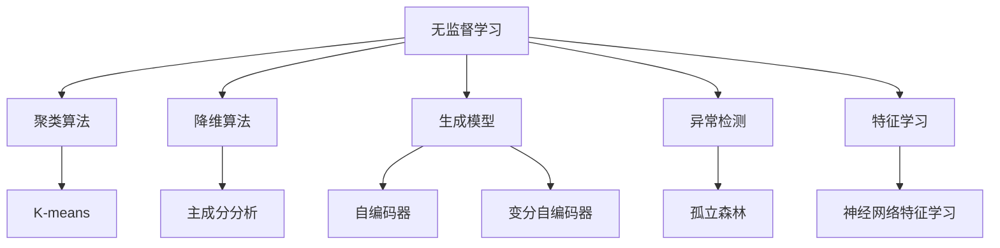
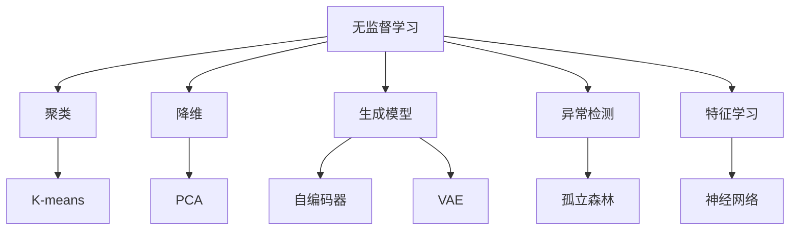
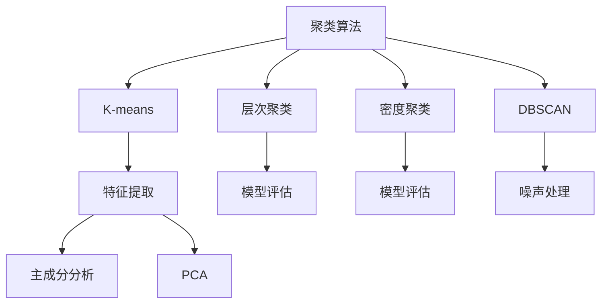
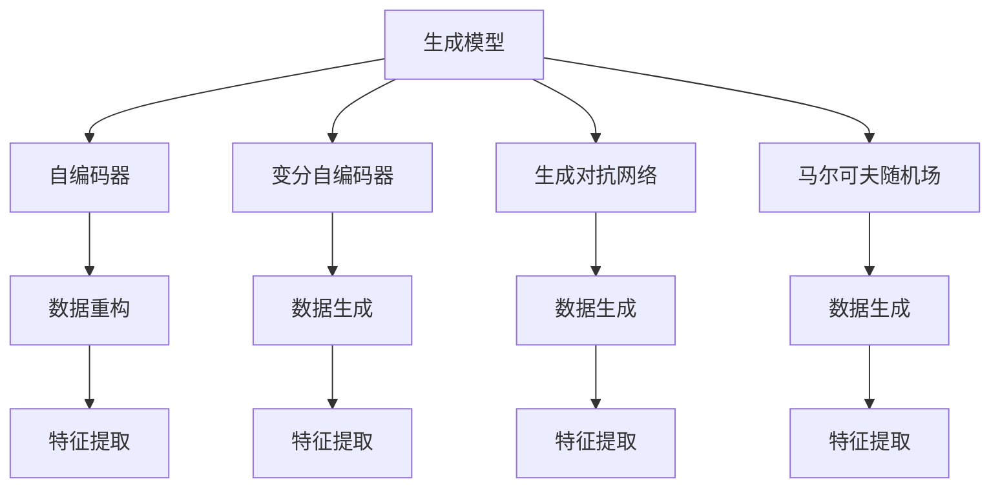
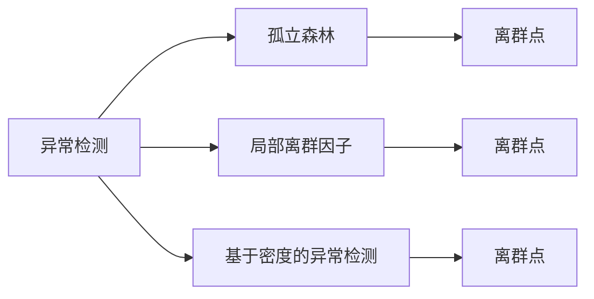
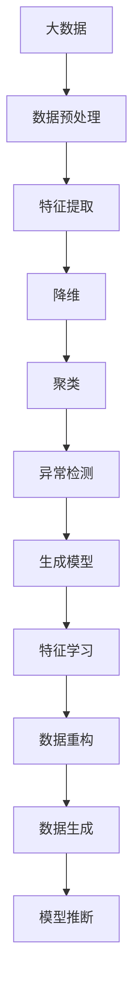

                 

# Unsupervised Learning

## 1. 背景介绍

### 1.1 问题由来

无监督学习(Unsupervised Learning)是机器学习中的重要分支，与有监督学习(Supervised Learning)和强化学习(Reinforcement Learning)共同构成机器学习的“三驾马车”。无监督学习不需要标注的标签，直接从原始数据中学习出数据的结构和规律。它广泛应用于数据降维、聚类、异常检测、推荐系统等领域，是构建知识图谱、网络嵌入等深度学习任务的基础。

近年来，随着深度学习技术的成熟，无监督学习在图像、文本、语音等领域取得了一系列重要突破，成为人工智能研究的热点方向之一。本文将对无监督学习的基本概念、核心算法和实际应用进行系统介绍，并对未来的发展方向进行展望。

### 1.2 问题核心关键点

无监督学习的主要研究内容包括：
1. 聚类算法：通过分析数据的内在结构，将数据划分为不同的类别。
2. 降维算法：将高维数据映射到低维空间，降低计算复杂度，保留数据的主要特征。
3. 生成模型：从数据分布中学习出概率模型，进行数据生成和模型推断。
4. 异常检测：检测数据中的离群点，用于欺诈检测、故障诊断等领域。

这些算法在数据预处理、特征提取、模式发现等方面发挥了重要作用。通过对无监督学习的研究，可以更好地理解数据的结构和规律，为后续的监督学习、深度学习任务提供坚实的基础。

### 1.3 问题研究意义

无监督学习能够在大规模数据集上发现潜在的结构，自动提取特征，降低人工干预，具有以下重要意义：
1. 数据驱动：无监督学习完全依赖于数据，减少了对标注数据的需求，降低了成本。
2. 模型通用：无监督学习算法具有较好的泛化能力，可以应用于不同领域和数据类型。
3. 算法多样：无监督学习算法种类繁多，从传统的K-means到复杂的深度学习模型，适应不同的应用场景。
4. 算法高效：无监督学习算法通常具有较快的计算速度，适用于大规模数据的处理。
5. 模型解释：无监督学习模型具有较好的可解释性，便于理解数据结构和特征。

这些特点使得无监督学习在人工智能领域具有重要的研究价值和应用前景。

## 2. 核心概念与联系

### 2.1 核心概念概述

无监督学习的核心思想是从数据中学习未标记的知识，揭示数据的内在结构和规律。本节将介绍几个密切相关的核心概念：

- 聚类算法(Clustering)：将数据划分为不同的组，同一组内数据相似度高，不同组间数据相似度低。
- 降维算法(Dimensionality Reduction)：将高维数据映射到低维空间，保留主要特征，降低计算复杂度。
- 生成模型(Generative Model)：从数据分布中学习概率模型，用于数据生成、模型推断等任务。
- 异常检测(Anomaly Detection)：检测数据中的异常点，用于欺诈检测、故障诊断等领域。
- 特征学习(Feature Learning)：自动从原始数据中学习出特征表示，提高模型的泛化能力。
- 自编码器(Autoencoder)：一种生成模型，通过编码-解码过程实现数据的压缩与重构。
- 变分自编码器(Variational Autoencoder)：一种生成模型，通过概率模型实现数据的重构和生成。
- 密度估计(Density Estimation)：估计数据分布的概率密度函数，用于聚类、异常检测等任务。
- 自组织映射(Self-Organizing Map)：一种神经网络模型，用于可视化数据结构和特征。

这些概念之间的逻辑关系可以通过以下Mermaid流程图来展示：



这个流程图展示了一系列无监督学习算法的核心概念及其之间的联系：

1. 无监督学习通过聚类、降维、生成模型等算法，从数据中学习出未标记的知识。
2. 聚类算法通过划分数据，发现数据的内在结构。
3. 降维算法通过映射到低维空间，降低计算复杂度。
4. 生成模型通过学习数据分布，进行数据生成和模型推断。
5. 异常检测通过检测数据中的异常点，发现数据中的噪声和异常。
6. 特征学习通过自动提取数据特征，提高模型的泛化能力。
7. 自编码器通过编码-解码过程实现数据的压缩与重构。
8. 变分自编码器通过概率模型实现数据的重构和生成。
9. 密度估计通过估计数据分布，用于聚类、异常检测等任务。
10. 自组织映射通过神经网络模型，可视化数据结构和特征。

这些概念共同构成了无监督学习的基本框架，使其能够在各种场景下发挥强大的数据分析和特征提取能力。通过理解这些核心概念，我们可以更好地把握无监督学习的工作原理和优化方向。

### 2.2 概念间的关系

这些核心概念之间存在着紧密的联系，形成了无监督学习的完整生态系统。下面我们通过几个Mermaid流程图来展示这些概念之间的关系。

#### 2.2.1 无监督学习的学习范式



这个流程图展示了无监督学习的几种主要学习范式：

1. 无监督学习通过聚类、降维、生成模型等算法，从数据中学习未标记的知识。
2. 聚类算法通过划分数据，发现数据的内在结构。
3. 降维算法通过映射到低维空间，降低计算复杂度。
4. 生成模型通过学习数据分布，进行数据生成和模型推断。
5. 异常检测通过检测数据中的异常点，发现数据中的噪声和异常。
6. 特征学习通过自动提取数据特征，提高模型的泛化能力。
7. 自编码器通过编码-解码过程实现数据的压缩与重构。
8. 变分自编码器通过概率模型实现数据的重构和生成。
9. 密度估计通过估计数据分布，用于聚类、异常检测等任务。
10. 自组织映射通过神经网络模型，可视化数据结构和特征。

#### 2.2.2 聚类算法与降维算法的关系



这个流程图展示了聚类算法和降维算法之间的关系：

1. 聚类算法通过划分数据，发现数据的内在结构。
2. K-means是常用的聚类算法之一，通过特征提取进行聚类。
3. 层次聚类和密度聚类通过模型评估进行聚类。
4. DBSCAN通过噪声处理进行聚类。
5. 特征提取和降维算法密切相关，通过主成分分析等方法进行降维。
6. PCA是常用的降维算法，通过主成分提取进行降维。
7. 模型评估和噪声处理用于优化聚类结果。

#### 2.2.3 生成模型与特征学习的关系



这个流程图展示了生成模型和特征学习之间的关系：

1. 生成模型通过学习数据分布，进行数据生成和模型推断。
2. 自编码器通过编码-解码过程实现数据的压缩与重构，用于特征提取。
3. 变分自编码器通过概率模型实现数据的重构和生成，用于特征提取。
4. 生成对抗网络通过对抗过程实现数据的生成，用于特征提取。
5. 马尔可夫随机场通过概率模型实现数据的生成，用于特征提取。
6. 数据重构、数据生成、特征提取等过程相互关联，用于提高模型性能。

#### 2.2.4 异常检测与密度估计的关系



这个流程图展示了异常检测和密度估计之间的关系：

1. 异常检测通过检测数据中的异常点，发现数据中的噪声和异常。
2. 孤立森林是一种常用的异常检测算法，通过离群点检测进行异常检测。
3. 局部离群因子是一种常用的异常检测算法，通过局部密度计算进行异常检测。
4. 基于密度的异常检测通过密度估计进行异常检测。
5. 孤立森林、局部离群因子、基于密度的异常检测等算法都用于检测离群点。

这些概念共同构成了无监督学习的核心算法框架，使其能够在各种场景下发挥强大的数据分析和特征提取能力。通过理解这些核心概念，我们可以更好地把握无监督学习的工作原理和优化方向。

### 2.3 核心概念的整体架构

最后，我们用一个综合的流程图来展示这些核心概念在大数据处理过程中的整体架构：



这个综合流程图展示了从大数据预处理到生成模型推断的完整过程：

1. 大数据处理通过数据预处理、特征提取、降维、聚类、异常检测等过程，提取数据结构和特征。
2. 降维算法通过映射到低维空间，降低计算复杂度。
3. 聚类算法通过划分数据，发现数据的内在结构。
4. 异常检测通过检测数据中的异常点，发现数据中的噪声和异常。
5. 生成模型通过学习数据分布，进行数据生成和模型推断。
6. 特征学习通过自动提取数据特征，提高模型的泛化能力。
7. 数据重构、数据生成、模型推断等过程相互关联，用于提高模型性能。

通过这些流程图，我们可以更清晰地理解无监督学习数据处理的基本流程和各个算法之间的关系，为后续深入讨论具体的无监督学习算法奠定基础。

## 3. 核心算法原理 & 具体操作步骤
### 3.1 算法原理概述

无监督学习的核心算法包括聚类算法、降维算法、生成模型、异常检测等，这些算法的基本原理如下：

1. 聚类算法：通过划分数据，发现数据的内在结构。常用的聚类算法包括K-means、层次聚类、密度聚类、DBSCAN等。
2. 降维算法：通过映射到低维空间，降低计算复杂度。常用的降维算法包括主成分分析(PCA)、线性判别分析(LDA)、局部线性嵌入(LE)等。
3. 生成模型：通过学习数据分布，进行数据生成和模型推断。常用的生成模型包括自编码器、变分自编码器(VAE)、生成对抗网络(GAN)等。
4. 异常检测：通过检测数据中的异常点，发现数据中的噪声和异常。常用的异常检测算法包括孤立森林、局部离群因子、基于密度的异常检测等。

### 3.2 算法步骤详解

无监督学习的核心算法通常包括以下关键步骤：

**Step 1: 数据预处理**

- 去除噪声：通过数据清洗、去重、填补缺失值等手段，提高数据质量。
- 特征提取：通过特征选择、特征提取等方法，提取出数据的特征。
- 标准化处理：对数据进行标准化处理，使其满足算法的要求。

**Step 2: 聚类算法**

- 选择合适的聚类算法：根据数据的特点选择合适的聚类算法，如K-means、层次聚类等。
- 初始化聚类中心：通过随机初始化或K-means++等方法，确定聚类中心。
- 迭代更新：通过迭代算法，更新聚类中心，直到收敛。
- 评估聚类结果：通过各种指标评估聚类结果，如轮廓系数、Calinski-Harabasz指数等。

**Step 3: 降维算法**

- 选择合适的降维算法：根据数据的特点选择合适的降维算法，如PCA、LDA等。
- 特征选择：通过主成分分析等方法，选择最优的主成分。
- 计算投影矩阵：通过计算投影矩阵，将数据映射到低维空间。
- 可视化降维结果：通过可视化工具，展示降维结果，观察数据结构。

**Step 4: 生成模型**

- 选择合适的生成模型：根据数据的特点选择合适的生成模型，如自编码器、VAE等。
- 训练生成模型：通过训练生成模型，学习数据分布。
- 生成新数据：通过生成模型，生成新的数据。
- 评估生成模型：通过各种指标评估生成模型，如重构误差、KL散度等。

**Step 5: 异常检测**

- 选择合适的异常检测算法：根据数据的特点选择合适的异常检测算法，如孤立森林、局部离群因子等。
- 计算异常得分：通过计算异常得分，识别异常点。
- 设定阈值：通过设定阈值，判断是否为异常点。
- 评估异常检测结果：通过各种指标评估异常检测结果，如召回率、精确率等。

### 3.3 算法优缺点

无监督学习算法具有以下优点：

1. 无需标注数据：无监督学习完全依赖于数据，减少了对标注数据的需求，降低了成本。
2. 数据驱动：无监督学习算法具有较好的泛化能力，可以应用于不同领域和数据类型。
3. 算法多样：无监督学习算法种类繁多，从传统的K-means到复杂的深度学习模型，适应不同的应用场景。
4. 算法高效：无监督学习算法通常具有较快的计算速度，适用于大规模数据的处理。
5. 模型解释：无监督学习模型具有较好的可解释性，便于理解数据结构和特征。

无监督学习算法也存在一些局限性：

1. 数据质量依赖：无监督学习算法的效果依赖于数据的质量，数据噪声、缺失值等会严重影响算法效果。
2. 算法复杂度高：无监督学习算法通常需要复杂的计算过程，对硬件资源要求较高。
3. 结果可解释性差：无监督学习算法结果可解释性较差，难以理解模型的决策过程。
4. 应用场景有限：无监督学习算法通常用于数据预处理、特征提取等基础任务，应用场景较为有限。

尽管存在这些局限性，但无监督学习在数据预处理、特征提取、模式发现等方面发挥了重要作用，是构建知识图谱、网络嵌入等深度学习任务的基础。未来，随着技术的进步，无监督学习算法将变得更加高效、可解释，并在更多领域得到应用。

### 3.4 算法应用领域

无监督学习算法在数据预处理、特征提取、模式发现等方面发挥了重要作用，广泛应用于以下几个领域：

1. 自然语言处理：通过无监督学习，提取文本特征，用于情感分析、主题建模、文本聚类等任务。
2. 计算机视觉：通过无监督学习，提取图像特征，用于图像分类、目标检测、图像生成等任务。
3. 语音识别：通过无监督学习，提取语音特征，用于语音识别、语音情感分析等任务。
4. 社交网络分析：通过无监督学习，分析社交网络结构，用于社区发现、用户行为分析等任务。
5. 推荐系统：通过无监督学习，提取用户和物品的特征，用于推荐算法的设计。
6. 生物信息学：通过无监督学习，分析基因序列数据，用于基因表达分析、药物发现等任务。
7. 金融风险管理：通过无监督学习，分析金融数据，用于风险评估、欺诈检测等任务。

这些领域中的无监督学习算法，不仅在基础任务中发挥了重要作用，还推动了相应领域技术的发展，具有广泛的应用前景。

## 4. 数学模型和公式 & 详细讲解  
### 4.1 数学模型构建

本节将使用数学语言对无监督学习的核心算法进行更加严格的刻画。

假设数据集为 $D=\{(x_i,y_i)\}_{i=1}^N$，其中 $x_i \in \mathcal{X}, y_i \in \mathcal{Y}$，$\mathcal{X}$ 和 $\mathcal{Y}$ 分别为输入和输出的取值空间。

定义无监督学习模型的损失函数为 $\mathcal{L}(\theta)$，其中 $\theta$ 为模型参数。通过优化损失函数，无监督学习算法可以找到最优的模型参数。

常用的无监督学习算法的损失函数包括：
1. K-means的损失函数为：
$$
\mathcal{L}(\theta) = \sum_{i=1}^N \min_{y_i \in C} ||x_i - \mu_C||^2
$$
其中 $C$ 为聚类中心，$\mu_C$ 为聚类中心的位置。
2. PCA的损失函数为：
$$
\mathcal{L}(\theta) = ||X - X_LU^\top U||^2
$$
其中 $X$ 为数据矩阵，$X_L$ 为数据矩阵的低维投影，$U$ 为投影矩阵。
3. GAN的损失函数为：
$$
\mathcal{L}(\theta) = \mathbb{E}_{x \sim p_g}[logD(x)] + \mathbb{E}_{x \sim p_d}[log(1-D(x))]
$$
其中 $p_g$ 为生成模型的概率分布，$p_d$ 为真实数据分布，$D$ 为判别器。

### 4.2 公式推导过程

以下是几个常用无监督学习算法的数学推导过程：

**K-means算法**

K-means算法通过最小化样本与聚类中心的距离，实现数据的聚类。假设聚类中心为 $C=\{c_1, c_2, ..., c_k\}$，样本 $x_i$ 到聚类中心的距离为 $d_i = ||x_i - c_j||^2$，则K-means算法的损失函数为：

$$
\mathcal{L}(\theta) = \sum_{i=1}^N \min_{j=1,...,k} d_i
$$

通过优化损失函数，可以更新聚类中心的位置。

**PCA算法**

PCA算法通过最小化数据矩阵与低维投影的差异，实现数据的降维。假设数据矩阵为 $X \in \mathbb{R}^{n \times d}$，低维投影矩阵为 $U \in \mathbb{R}^{n \times m}$，其中 $m < d$，则PCA算法的损失函数为：

$$
\mathcal{L}(\theta) = ||X - X_LU^\top U||^2
$$

其中 $X_L$ 为数据矩阵的低维投影，$U$ 为投影矩阵。

**GAN算法**

GAN算法通过生成模型和判别模型之间的对抗训练，实现数据的生成和重构。假设生成模型为 $G(z)$，判别模型为 $D(x)$，其中 $z \in \mathbb{R}^l$ 为噪声向量，$x \in \mathbb{R}^n$ 为数据，则GAN算法的损失函数为：

$$
\mathcal{L}(\theta) = \mathbb{E}_{x \sim p_g}[logD(x)] + \mathbb{E}_{x \sim p_d}[log(1-D(x))]
$$

其中 $p_g$ 为生成模型的概率分布，$p_d$ 为真实数据分布，$D$ 为判别器。

通过优化损失函数，可以更新生成模型和判别模型的参数。

### 4.3 案例分析与讲解

下面我们以聚类算法中的K-means为例，给出一个具体的案例分析。

假设我们有一个包含4个样本的数据集，每个样本包含两个特征 $x_1$ 和 $x_2$。我们想要将这些数据聚类为两个簇，使每个样本尽可能地靠近其所属的簇中心。

首先，我们需要随机初始化两个聚类中心 $c_1$ 和 $c_2$。

$$
c_1 = (0.5, 0.5), c_2 = (2.5, 1.5)
$$

然后，通过计算每个样本到聚类中心的距离，将每个样本分配到最近的聚类中心。

$$
d_1 = ||(1,1) - (0.5, 0.5)||^2 = 0.5
$$
$$
d_2 = ||(2,2) - (0.5, 0.5)||^2 = 2
$$
$$
d_3 = ||(3,1) - (2.5, 1.5)||^2 = 0.5
$$
$$
d_4 = ||(4,3) - (2.5, 1.5)||^2 = 2
$$

每个样本距离 $c_1$ 和 $c_2$ 的距离如下：

$$
\begin{aligned}
& d_{1,1} = 0.5 \\
& d_{1,2} = 2 \\
& d_{2,1} = 2 \\
& d_{2,2} = 0.5 \\
& d_{3,1} = 0.5 \\
& d_{3,2} = 2 \\
& d_{4,1} = 2 \\
& d_{4,2} = 0.5
\end{aligned}
$$

根据距离最近的原则，将每个样本分配到最近的聚类中心。

$$
\begin{aligned}
& 样本1和样本3分配到 $c_1$ \\
& 样本2和样本4分配到 $c_2$
\end{aligned}
$$

然后，更新聚类中心的位置。

$$
c_1 = \frac{1+3}{2} = (2, 1)
$$
$$
c_2 = \frac{2+4}{2} = (3, 2)
$$

此时，每个样本到其所属簇中心的距离为0，聚类效果较好。

通过多次迭代，可以逐步优化聚类中心的位置，最终得到一个较好的聚类结果。

## 5. 项目实践：代码实例和详细解释说明
### 5.1 开发环境搭建

在进行无监督学习实践前，我们需要准备好开发环境。以下是使用Python进行Scikit-learn开发的环境配置流程：

1. 安装Anaconda：从官网下载并安装Anaconda，用于创建独立的Python环境。

2. 创建并激活虚拟环境：
```bash
conda create -n unsupervised-env python=3.8 
conda activate unsupervised-env
```

3. 安装Scikit-learn：
```bash
conda install scikit-learn
```

4. 安装numpy、pandas、matplotlib、tqdm、jupyter notebook等常用工具包：
```bash
pip install numpy pandas matplotlib tqdm jupyter notebook ipython
```

完成上述步骤后，即可在`unsupervised-env`环境中开始无监督学习实践。

### 5.2 源代码详细实现

下面我们以K-means聚类为例，给出一个使用Scikit-learn库进行无监督学习的PyTorch代码实现。

首先，定义数据集和K-means模型：

```python
from sklearn.datasets import make_blobs
from sklearn.cluster import KMeans
import numpy as np
import matplotlib.pyplot as plt

# 生成随机数据
X, y = make_blobs(n_samples=100, centers=4, cluster_std=0.5, random_state=0)

# 定义K-means模型
kmeans = KMeans(n_clusters=4, random_state=0)

# 训练模型
kmeans.fit(X)
```

然后，可视化聚类结果：

```python
plt.scatter(X[:, 0], X[:, 1], c=kmeans.labels_)
plt.scatter(kmeans.cluster_centers_[:, 0], kmeans.cluster_centers_[:, 1], marker='x', s=200, linewidths=3, color='r')
plt.show()
```

最后，评估聚类结果：

```python
# 计算轮廓

