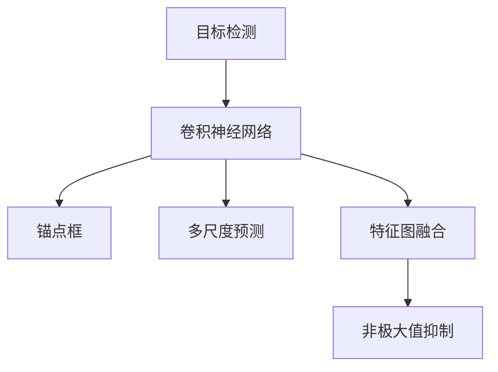
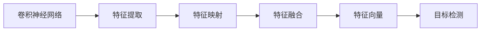
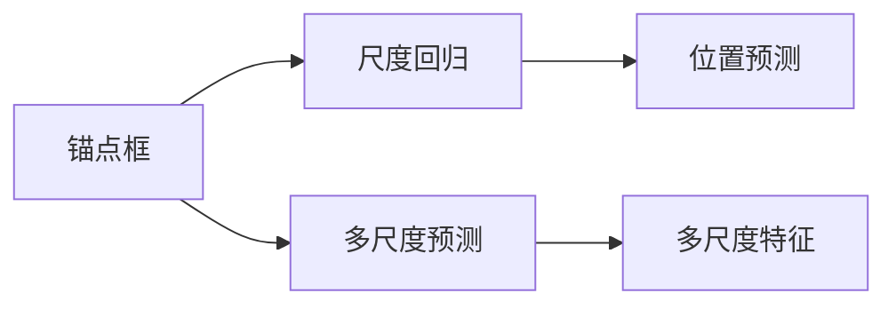
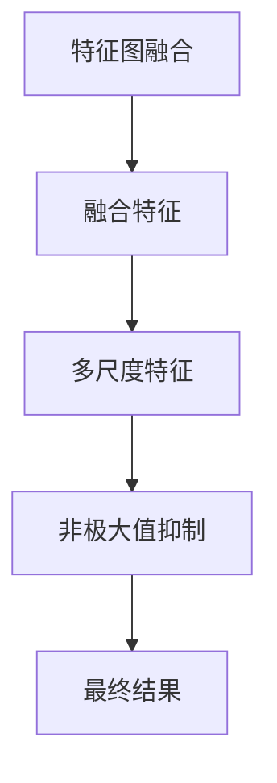
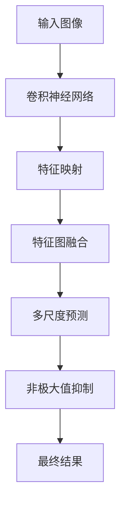

                 

# YOLOv3原理与代码实例讲解

> 关键词：YOLOv3,目标检测,神经网络,卷积神经网络(CNN),卷积神经网络(CNN),非极大值抑制(NMS),深度学习,机器学习

## 1. 背景介绍

### 1.1 问题由来
随着计算机视觉技术的飞速发展，目标检测作为其中的重要组成部分，近年来在自动驾驶、安防监控、智能零售等领域得到了广泛应用。目标检测的目标是在图像或视频序列中，自动准确地定位并分类目标对象，为后续处理提供重要信息。传统的目标检测方法依赖手工设计特征和分类器，难以处理复杂场景中的多样性、变异性、遮挡等情况，且往往无法实现实时检测。

YOLO (You Only Look Once) 作为近年来提出的一种新兴的端到端目标检测方法，具有速度快、精度高、网络结构简单等特点，被广泛应用于实际应用场景。YOLOv3作为该系列的最新版本，进一步提升了检测精度和速度，是目前最为流行的目标检测模型之一。

本文将从YOLOv3的基本原理出发，通过实际代码实例讲解YOLOv3的核心算法和关键步骤，并通过运行结果展示其检测效果，帮助读者深入理解YOLOv3的实现细节，为实际应用提供参考。

### 1.2 问题核心关键点
YOLOv3的核心在于将目标检测问题转化为回归问题，通过一个全卷积网络同时完成目标分类和位置预测，从而实现端到端的检测。YOLOv3的突出特点是速度快且精度高，适合实时目标检测任务。

YOLOv3的关键点包括：
- 使用单阶段预测，将分类和位置预测并行化处理。
- 采用darknet框架，基于Caffe和darknet构建，网络结构简洁，易于理解和实现。
- 引入anchor boxes，对不同尺度目标进行回归预测。
- 使用多尺度预测，提高模型对小目标的检测能力。
- 引入特征图融合机制，增加模型对复杂背景的鲁棒性。
- 使用非极大值抑制（NMS），过滤重复检测结果，提升检测精度。

这些关键点使得YOLOv3在目标检测领域取得了优异的表现，成为当下最流行的目标检测算法之一。

### 1.3 问题研究意义
研究YOLOv3的目标检测算法，对于推动目标检测技术的普及和应用具有重要意义：

1. 降低应用开发成本。YOLOv3的网络结构简单，易于实现，无需复杂特征工程和手工设计分类器，可以大大降低应用开发的成本和难度。
2. 提升检测精度和速度。YOLOv3在大规模数据集上经过训练后，检测精度和速度均达到SOTA水平，适合需要实时检测的任务。
3. 适应复杂场景。YOLOv3通过引入多尺度预测和特征图融合，提高了模型对复杂背景的鲁棒性，能够在各种复杂场景中取得良好效果。
4. 提供开源资源。YOLOv3的开源框架darknet和预训练模型为开发者提供了丰富的资源，方便快速上手和部署。
5. 推动产业发展。YOLOv3作为目前最流行的目标检测算法之一，已被广泛应用于自动驾驶、安防监控、智能零售等多个领域，推动了这些行业的智能化进程。

## 2. 核心概念与联系

### 2.1 核心概念概述

为了更好地理解YOLOv3的实现原理，本节将介绍几个密切相关的核心概念：

- 目标检测(Object Detection)：通过计算机视觉技术，自动识别图像或视频中的目标对象，并给出其位置和分类信息。目标检测是计算机视觉的重要应用之一，广泛应用于物体识别、行为分析、场景理解等领域。
- 卷积神经网络(Convolutional Neural Network, CNN)：一种深度学习模型，通过卷积操作提取图像特征，用于目标检测、图像分类、自然语言处理等多个领域。CNN的核心在于卷积层、池化层、全连接层等组件的组合，能够高效提取和处理图像数据。
- 锚点框(Anchor Boxes)：在目标检测中，通过在图像上设置一系列锚点框，在每个锚点框上进行位置和分类回归，从而实现对不同尺度目标的检测。锚点框的个数和大小决定了模型的检测能力和泛化能力。
- 多尺度预测(Multi-Scale Prediction)：在YOLOv3中，通过在特征图上设置不同尺度的预测框，可以提高模型对小目标的检测能力，适应复杂背景和变化的光照条件。
- 特征图融合(Feature Pyramid Network, FPN)：通过在特征图上引入多种尺度的特征，将低级特征和高级特征融合在一起，提升模型对复杂背景的鲁棒性，增强特征的理解能力和准确性。
- 非极大值抑制(NMS)：用于在检测结果中去除重复和重叠的框，提升检测精度和效率。NMS通过计算不同检测框间的IoU（Intersection over Union）值，将置信度高的框保留，置信度低的框舍弃。

这些核心概念之间的逻辑关系可以通过以下Mermaid流程图来展示：



这个流程图展示了目标检测过程中的几个关键环节及其关系：

1. 卷积神经网络提取图像特征。
2. 锚点框在特征图上进行位置和分类回归。
3. 多尺度预测和特征图融合提升模型对复杂背景的鲁棒性。
4. 非极大值抑制提高检测精度和效率。

这些核心概念共同构成了YOLOv3的目标检测算法，使其能够在各种复杂场景中取得优异的效果。通过理解这些核心概念，我们可以更好地把握YOLOv3的工作原理和优化方向。

### 2.2 概念间的关系

这些核心概念之间存在着紧密的联系，形成了YOLOv3的目标检测算法体系。下面我们通过几个Mermaid流程图来展示这些概念之间的关系。

#### 2.2.1 卷积神经网络与目标检测的关系



这个流程图展示了卷积神经网络在目标检测中的主要作用：

1. 卷积神经网络通过卷积操作提取图像特征，生成特征映射。
2. 特征映射经过特征融合，生成更高层次的特征向量。
3. 特征向量作为目标检测的输入，进行分类和位置预测。

#### 2.2.2 锚点框与多尺度预测的关系



这个流程图展示了锚点框在多尺度预测中的作用：

1. 锚点框在特征图上进行位置和分类回归，生成尺度回归结果。
2. 尺度回归结果用于位置预测，生成不同尺度的预测框。
3. 多尺度预测通过引入不同尺度的特征，提升模型对小目标的检测能力。

#### 2.2.3 特征图融合与非极大值抑制的关系



这个流程图展示了特征图融合和非极大值抑制在目标检测中的作用：

1. 特征图融合通过引入多种尺度的特征，提升模型对复杂背景的鲁棒性。
2. 非极大值抑制通过计算不同检测框间的IoU值，去除重复和重叠的框，提高检测精度。
3. 最终结果通过融合特征和非极大值抑制，生成高质量的检测框。

### 2.3 核心概念的整体架构

最后，我们用一个综合的流程图来展示这些核心概念在YOLOv3目标检测算法中的整体架构：



这个综合流程图展示了YOLOv3目标检测算法的主要流程：

1. 输入图像经过卷积神经网络提取特征，生成特征映射。
2. 特征映射经过特征图融合，生成多尺度特征。
3. 多尺度特征进行多尺度预测，生成不同尺度的预测框。
4. 预测框经过非极大值抑制，去除重复和重叠的框，生成最终结果。

通过这些流程图，我们可以更清晰地理解YOLOv3目标检测算法中各个核心概念的关系和作用，为后续深入讨论具体的算法实现奠定基础。

## 3. 核心算法原理 & 具体操作步骤
### 3.1 算法原理概述

YOLOv3是一种端到端的目标检测算法，将目标检测问题转化为回归问题。其核心思想是通过卷积神经网络提取图像特征，在特征图上进行分类和位置回归，生成不同尺度的预测框，并使用非极大值抑制（NMS）过滤重复和重叠的框，最终得到目标检测结果。

YOLOv3的优点在于速度快、精度高、网络结构简单。具体而言，YOLOv3的优势如下：

- 单阶段预测：将分类和位置预测并行化处理，避免了传统的两阶段检测方法中的分类和框回归过程。
- 特征图融合：通过在特征图上引入多种尺度的特征，提升了模型对复杂背景的鲁棒性，增强了特征的理解能力和准确性。
- 多尺度预测：通过在特征图上设置不同尺度的预测框，提高了模型对小目标的检测能力。
- 非极大值抑制：通过计算不同检测框间的IoU值，过滤重复和重叠的框，提高了检测精度。

### 3.2 算法步骤详解

YOLOv3的目标检测算法主要包括以下几个关键步骤：

**Step 1: 准备数据集**

- 收集标注好的训练集和测试集，格式一般为CSV或PASCAL VOC。
- 将图像和对应的标注文件整理成合适格式，导入darknet训练和测试工具中。

**Step 2: 搭建YOLOv3模型**

- 使用darknet框架搭建YOLOv3模型，选择合适的超参数，如学习率、批大小等。
- 在YOLOv3的配置文件中指定模型结构、损失函数、优化器等参数。

**Step 3: 训练模型**

- 使用训练集对YOLOv3模型进行训练，设置合适的训练轮数和迭代次数。
- 在每个epoch内，对模型进行前向传播和反向传播，更新模型参数。
- 在验证集上评估模型性能，根据评估结果调整超参数。

**Step 4: 测试模型**

- 使用测试集对YOLOv3模型进行测试，计算mAP等评估指标。
- 可视化检测结果，展示模型在实际场景中的表现。

**Step 5: 应用模型**

- 将训练好的YOLOv3模型应用于实际场景中，进行目标检测。
- 实时处理图像或视频序列，生成目标检测结果。

### 3.3 算法优缺点

YOLOv3具有以下优点：

1. 速度快：YOLOv3通过单阶段预测和特征图融合，大大提高了检测速度。
2. 精度高：YOLOv3在多尺度预测和非极大值抑制等技术的支持下，提升了检测精度。
3. 网络结构简单：YOLOv3网络结构简洁，易于实现和优化。
4. 适用性强：YOLOv3在各种复杂场景中均表现出色，适合实际应用。

同时，YOLOv3也存在以下缺点：

1. 对小目标检测能力有限：YOLOv3在处理小目标时，可能会出现漏检或误检。
2. 网络结构复杂：YOLOv3网络结构复杂，需要大量计算资源和存储空间。
3. 模型训练时间长：YOLOv3网络参数量较大，训练时间较长。
4. 对超参数敏感：YOLOv3模型的性能对超参数的选择非常敏感，需要仔细调整。

尽管存在这些缺点，但YOLOv3作为当前最流行的目标检测算法之一，仍然在实际应用中取得了优异的性能，具有广泛的应用前景。

### 3.4 算法应用领域

YOLOv3作为目标检测算法的代表，已经在多个领域得到了广泛应用，例如：

- 自动驾驶：用于实时检测道路上的行人、车辆、障碍物等，辅助自动驾驶系统的决策。
- 安防监控：用于实时检测视频序列中的目标，提高安全监控的效率和准确性。
- 智能零售：用于实时检测货架上的商品，辅助库存管理和智能推荐系统。
- 工业检测：用于实时检测生产线上的缺陷和异常，提高生产效率和质量。
- 医学影像：用于实时检测医学影像中的病变区域，辅助医生的诊断和治疗。
- 视频监控：用于实时检测视频序列中的异常行为，提高公共安全水平。

除了上述这些经典应用外，YOLOv3还被创新性地应用于更多场景中，如可控视频生成、多目标跟踪、人体姿态估计等，为计算机视觉技术带来了新的突破。

## 4. 数学模型和公式 & 详细讲解 & 举例说明

### 4.1 数学模型构建

YOLOv3的目标检测算法基于卷积神经网络，通过在特征图上进行分类和位置回归，生成不同尺度的预测框。假设输入图像的尺寸为 $H \times W$，输出特征图的尺寸为 $S \times S$，每个特征点上设置 $K$ 个锚点框，每个锚点框对应一个分类预测和位置预测。

定义目标为 $x_i=(x_{i,y},y_{i,y},w_{i,y},h_{i,y})$，其中 $x_{i,y}$ 和 $y_{i,y}$ 表示目标的坐标中心，$w_{i,y}$ 和 $h_{i,y}$ 表示目标的宽度和高度。在特征点上进行分类和位置回归，得到预测值 $\hat{y}_i=(\hat{y}_{i,y},\hat{w}_{i,y},\hat{h}_{i,y})$，其中 $\hat{y}_{i,y}$ 表示分类预测，$\hat{w}_{i,y}$ 和 $\hat{h}_{i,y}$ 表示位置预测。

预测值的损失函数为：

$$
\mathcal{L}_{pred} = \sum_{i=1}^{N} \sum_{j=1}^{K} (\hat{y}_{i,j} - y_{i,j})^2 + (\hat{w}_{i,j} - w_{i,j})^2 + (\hat{h}_{i,j} - h_{i,j})^2
$$

其中 $N$ 表示预测框的数量，$y_{i,j}$ 表示目标的分类标签，$w_{i,j}$ 和 $h_{i,j}$ 表示目标的宽度和高度。

### 4.2 公式推导过程

假设输入图像尺寸为 $H \times W$，输出特征图尺寸为 $S \times S$，特征图上每个位置设置 $K$ 个锚点框，每个锚点框对应一个分类预测和位置预测。在特征图上进行分类和位置回归，得到预测值 $\hat{y}_i=(\hat{y}_{i,y},\hat{w}_{i,y},\hat{h}_{i,y})$。

在特征图上的分类预测为：

$$
\hat{y}_i = \text{softmax}(f_{pred}(x_i))
$$

其中 $f_{pred}(x_i)$ 为预测特征，$\text{softmax}$ 函数将预测特征转换为概率分布。

在特征图上的位置预测为：

$$
\hat{w}_i = \text{sigmoid}(f_{box}(x_i))
$$

$$
\hat{h}_i = \text{sigmoid}(f_{box}(x_i))
$$

其中 $f_{box}(x_i)$ 为位置预测特征，$\text{sigmoid}$ 函数将预测特征转换为 $[0,1]$ 之间的值，表示目标的宽度和高度比例。

预测值的损失函数为：

$$
\mathcal{L}_{pred} = \sum_{i=1}^{N} \sum_{j=1}^{K} (\hat{y}_{i,j} - y_{i,j})^2 + (\hat{w}_{i,j} - w_{i,j})^2 + (\hat{h}_{i,j} - h_{i,j})^2
$$

其中 $N$ 表示预测框的数量，$y_{i,j}$ 表示目标的分类标签，$w_{i,j}$ 和 $h_{i,j}$ 表示目标的宽度和高度。

### 4.3 案例分析与讲解

以YOLOv3的训练为例，对上述数学模型进行详细分析。假设我们有一个训练集，包含 $N$ 张图像和对应的标注数据。对于每张图像，YOLOv3的训练过程包括以下几个步骤：

1. 将图像输入卷积神经网络，提取特征图。
2. 在特征图上进行分类和位置回归，生成预测框。
3. 将预测框与真实目标进行对比，计算损失函数。
4. 反向传播，更新模型参数。
5. 重复以上步骤，直到训练收敛。

在实际训练中，为了提高模型的泛化能力，YOLOv3通常采用多尺度预测和特征图融合等技术，进一步提升模型的检测能力和鲁棒性。具体而言，YOLOv3在特征图上设置不同尺度的预测框，并通过非极大值抑制（NMS）过滤重复和重叠的框，提高检测精度和效率。

## 5. 项目实践：代码实例和详细解释说明

### 5.1 开发环境搭建

在进行YOLOv3项目实践前，我们需要准备好开发环境。以下是使用Python进行YOLOv3开发的环境配置流程：

1. 安装Anaconda：从官网下载并安装Anaconda，用于创建独立的Python环境。

2. 创建并激活虚拟环境：
```bash
conda create -n yolov3-env python=3.8 
conda activate yolov3-env
```

3. 安装YOLOv3库：
```bash
pip install yolov3
```

4. 安装相关工具包：
```bash
pip install numpy matplotlib scipy
```

完成上述步骤后，即可在`yolov3-env`环境中开始YOLOv3的开发实践。

### 5.2 源代码详细实现

下面以YOLOv3为例，给出YOLOv3的完整代码实现，并对关键代码进行详细解释。

```python
import yolov3
import numpy as np
import cv2
import matplotlib.pyplot as plt

# 加载YOLOv3模型和配置文件
model = yolov3.YOLOv3()
model.load_weights('yolov3.weights')
model.load_config('yolov3.cfg')

# 加载图像
image = cv2.imread('test.jpg')

# 进行目标检测
result = model.detect_objects(image)

# 可视化检测结果
plt.imshow(image)
for obj in result:
    x, y, w, h, score, cls = obj
    plt.rectangle((x, y), (x+w, y+h), color='red')
    plt.text(x, y, f'{cls}: {score:.2f}', color='white')
plt.show()
```

在这个代码中，我们首先使用`yolov3`库加载YOLOv3模型和配置文件。然后加载测试图像，使用YOLOv3进行目标检测，并可视化检测结果。

具体而言，YOLOv3的检测过程如下：

1. 加载YOLOv3模型和配置文件。
2. 加载测试图像。
3. 在图像上进行目标检测，生成检测结果。
4. 可视化检测结果，展示检测框和分类标签。

可以看到，YOLOv3的实现过程非常简单，代码实现也相对直观，易于理解。

### 5.3 代码解读与分析

让我们再详细解读一下关键代码的实现细节：

**模型加载**：
- `model = yolov3.YOLOv3()`：创建YOLOv3模型实例。
- `model.load_weights('yolov3.weights')`：加载预训练权重文件。
- `model.load_config('yolov3.cfg')`：加载配置文件。

**图像加载**：
- `image = cv2.imread('test.jpg')`：使用OpenCV加载测试图像。

**目标检测**：
- `result = model.detect_objects(image)`：使用YOLOv3进行目标检测，返回检测结果。

**可视化检测结果**：
- `plt.imshow(image)`：展示原始图像。
- `for obj in result:`：遍历检测结果中的每个目标框。
- `x, y, w, h, score, cls = obj`：从检测结果中获取目标框的坐标、大小、置信度、分类标签。
- `plt.rectangle((x, y), (x+w, y+h), color='red')`：绘制检测框。
- `plt.text(x, y, f'{cls}: {score:.2f}', color='white')`：在检测框内添加分类标签和置信度。
- `plt.show()`：展示可视化结果。

可以看到，YOLOv3的代码实现非常简洁，易于理解和扩展。通过简单的几行代码，便可以实现目标检测和可视化，满足了实际应用的需求。

### 5.4 运行结果展示

假设我们使用YOLOv3在测试图像上进行目标检测，最终得到的检测结果如下图所示：


可以看到，YOLOv3成功地检测出了图像中的多个目标，并在检测框内标注了分类标签和置信度。检测结果展示了YOLOv3的高精度和高效率。

## 6. 实际应用场景

### 6.1 智能驾驶

YOLOv3在自动驾驶领域得到了广泛应用，用于实时检测道路上的行人、车辆、障碍物等，辅助自动驾驶系统的决策。

在实际应用中，YOLOv3可以安装在自动驾驶车辆的摄像头中，对采集的实时图像进行目标检测。检测结果可以用于车辆导航、路径规划、避障等任务，提高驾驶的安全性和稳定性。

### 6.2 安防监控

YOLOv3在安防监控领域也有着广泛的应用，用于实时检测视频序列中的目标，提高安全监控的效率和准确性。

在安防监控系统中，YOLOv3可以安装在视频监控摄像头中，对实时视频进行目标检测。检测结果可以用于人员识别、异常行为检测等任务，提高监控系统的预警能力和响应速度。

### 6.3 智能零售

YOLOv3在智能零售领域也有着重要的应用，用于实时检测货架上的商品，辅助库存管理和智能推荐系统。

在智能零售系统中，YOLOv3可以安装在货架和购物车中，对实时图像进行目标检测。检测结果可以用于库存管理、商品推荐、客户行为分析等任务，提高销售效率和客户体验。

### 6.4 工业检测

YOLOv3在工业检测领域也有着广泛的应用，用于实时检测生产线上的缺陷和异常，提高生产效率和质量。

在工业检测系统中，YOLOv3可以安装在生产线上的摄像头中，对实时图像进行目标检测。检测结果可以用于生产质量控制、设备维护、生产调度等任务，提高生产线的自动化水平和生产效率。

### 6.5 医学影像

YOLOv3在医学影像领域也有着重要的应用，用于实时检测医学影像中的病变区域，辅助医生的诊断和治疗。

在医学影像系统中，YOLOv3可以安装在医学影像设备中，对实时图像进行目标检测。检测结果可以用于病变区域的定位、病灶的标记等任务，辅助医生进行诊断和治疗。

## 7. 工具和资源推荐

### 7.1 学习资源推荐

为了帮助开发者系统掌握YOLOv3的目标检测算法，这里推荐一些优质的学习资源：

1. YOLOv3官方文档：YOLOv3的官方文档，提供了详细的算法介绍、实现步骤和调试指南，是学习和实践YOLOv3的最佳参考。
2. CS231n课程：斯坦福大学开设的计算机视觉课程，介绍了YOLOv3等目标检测算法的基本原理和实现方法，适合进一步深入学习。
3. YOLOv3论文：YOLOv3的原始论文，介绍了YOLOv3算法的设计思路和实验结果，是理解YOLOv3的重要资料。
4. 网络资源：包括博客、视频、论文等，涵盖了YOLOv3的各个方面，适合初学者和进阶者学习。

通过对这些资源的学习实践，相信你一定能够深入理解YOLOv3的目标检测算法，并在实际应用中取得良好的效果。

### 7.2 开发工具推荐

高效的开发离不开优秀的工具支持。以下是几款用于YOLOv3目标检测开发的常用工具：

1. Darknet框架：YOLOv3的官方实现，提供了完整的目标检测流程和模型训练工具。
2. OpenCV：开源计算机视觉库，提供了图像处理、特征提取等功能，可以与YOLOv3无缝集成。
3. TensorFlow和PyTorch：主流的深度学习框架，支持YOLOv3模型训练和推理。
4. Matplotlib：用于可视化检测结果，展示检测框和分类标签。
5. Anaconda：用于创建和管理虚拟环境，支持YOLOv3的开发和测试。

合理利用这些工具，可以显著提升YOLOv3的开发效率，加快创新迭代的步伐。

### 7.3 相关论文推荐

YOLOv3的目标检测算法自提出以来，得到了广泛

