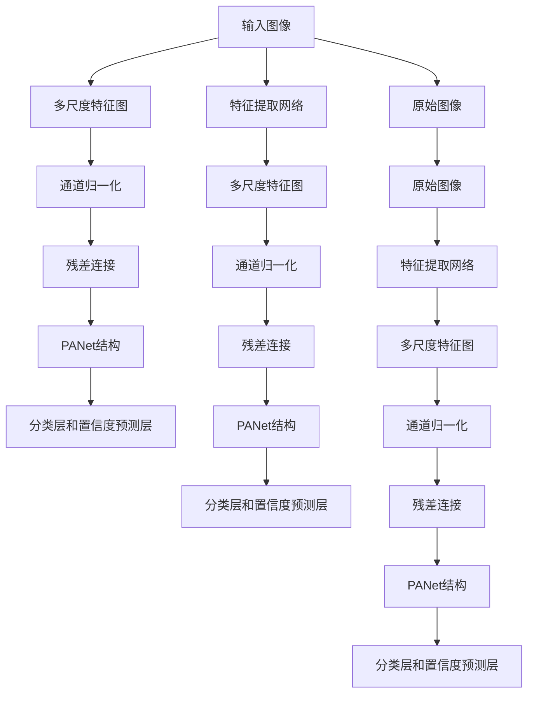

                 

# YOLOv4原理与代码实例讲解

> 关键词：YOLOv4, 目标检测, 深度学习, 卷积神经网络, 卷积层, 特征映射, 非极大值抑制, 目标回归, 代码实例, 图像处理, 实时目标检测

## 1. 背景介绍

### 1.1 问题由来
近年来，深度学习技术在计算机视觉领域取得了显著进展，目标检测作为其中的重要分支，受到了广泛关注。传统的目标检测方法依赖于选择性搜索、滑动窗口等技术，计算复杂度高，速度较慢。为了提高检测效率和准确率，YOLO（You Only Look Once）系列目标检测算法应运而生，并在实际应用中表现出色。

YOLOv4作为YOLO系列的最新进展，进一步提升了目标检测的精度和速度，并在多个数据集上取得了SOTA（State of the Art）的性能。本文将详细介绍YOLOv4的原理，并通过代码实例深入讲解其实现细节，帮助读者更好地理解和应用这一先进的目标检测算法。

### 1.2 问题核心关键点
YOLOv4的核心在于其在YOLOv3的基础上，引入了多尺度特征图、引入PANet结构、增加了分类层和置信度预测层、使用了通道归一化、引入了残差连接等优化措施，从而大幅提升了目标检测的准确率和速度。

YOLOv4的主要贡献包括：
- 多尺度特征图：通过在不同尺度上处理输入图像，可以更好地捕捉目标的多尺度特征。
- PANet结构：增强特征图的融合，使得模型能够更好地学习不同尺度上的特征。
- 通道归一化：对特征图进行归一化，可以加速收敛，提高模型稳定性。
- 残差连接：通过残差连接，可以保留更多的信息，提升模型性能。

此外，YOLOv4在计算效率上也有显著提升，能够以更高的速度处理大规模图像。

### 1.3 问题研究意义
YOLOv4的目标检测算法在速度和精度上都取得了卓越表现，为实际应用提供了高效、准确的目标检测方案。其优秀的性能不仅体现在检测精度上，还体现在实时性和稳定性上，能够满足各种高要求的应用场景。

YOLOv4的成功，不仅在于其算法设计的巧妙，还在于其实现过程的可操作性和可扩展性。通过深入理解YOLOv4的原理和代码实现，可以帮助开发者更好地设计和实现自己的目标检测系统，提升应用性能和效率。

## 2. 核心概念与联系

### 2.1 核心概念概述

为了更好地理解YOLOv4的原理，我们首先介绍几个关键概念：

- 目标检测（Object Detection）：通过算法在图像中定位并识别出目标的位置和类别，通常使用卷积神经网络（CNN）来实现。
- 卷积神经网络（Convolutional Neural Network, CNN）：一种基于卷积操作的深度学习网络，常用于图像处理和计算机视觉任务。
- 特征映射（Feature Map）：卷积神经网络中，经过多次卷积和池化操作后，生成的高维特征表示，用于目标检测和分类任务。
- 非极大值抑制（Non-Maximum Suppression, NMS）：一种用于去除重叠目标框的算法，保留置信度最高的目标框。
- 目标回归（Object Regression）：通过回归技术调整目标框的位置和大小，使得检测结果更加准确。

这些概念共同构成了YOLOv4算法的基础，帮助其有效地实现目标检测任务。

### 2.2 概念间的关系

YOLOv4的核心算法架构包括以下几个关键部分，如图2所示：



这个图展示了YOLOv4的基本架构，包括输入图像、特征提取网络、多尺度特征图、通道归一化、残差连接、PANet结构和分类层和置信度预测层等关键模块。这些模块通过并行处理，提升了YOLOv4的检测精度和速度。

## 3. 核心算法原理 & 具体操作步骤

### 3.1 算法原理概述

YOLOv4的目标检测算法主要基于YOLOv3，并在其基础上进行了多项改进。YOLOv4的核心思想是将目标检测任务分解为三个子任务：
1. 分类：确定目标的类别。
2. 目标回归：确定目标的位置和大小。
3. 非极大值抑制：去除重叠的目标框。

具体来说，YOLOv4通过以下步骤实现目标检测：

1. 输入图像处理：将输入图像缩放到指定大小，并进行预处理。
2. 特征提取：使用卷积神经网络提取多尺度特征图。
3. 通道归一化：对特征图进行归一化，以加速收敛。
4. 残差连接：引入残差连接，保留更多的信息，提升模型性能。
5. 特征图融合：通过PANet结构融合多尺度特征图，增强特征表达能力。
6. 分类和回归预测：通过分类层和回归预测层，预测目标的类别和位置。
7. 非极大值抑制：对预测结果进行NMS，保留置信度最高的目标框。

### 3.2 算法步骤详解

下面详细讲解YOLOv4算法的每个步骤。

#### 3.2.1 输入图像处理
在YOLOv4中，输入图像首先经过缩放到指定大小，并进行预处理。预处理通常包括归一化、裁剪、翻转等操作，以增加数据集的多样性，提高模型的泛化能力。

#### 3.2.2 特征提取
YOLOv4使用卷积神经网络（CNN）进行特征提取。具体来说，YOLOv4采用了Darknet53作为特征提取网络，其核心是多个残差网络（ResNet），可以有效地提取图像特征。

#### 3.2.3 通道归一化
通道归一化是一种常用的正则化方法，可以加速模型的收敛，提升模型的稳定性和性能。YOLOv4在每个特征图上都进行了通道归一化操作。

#### 3.2.4 残差连接
残差连接是一种常用的优化方法，可以保留更多的信息，提升模型的性能。YOLOv4在特征提取网络中引入了残差连接，提高了模型的精度。

#### 3.2.5 特征图融合
YOLOv4引入了PANet结构，用于融合多尺度特征图，增强模型的特征表达能力。PANet结构包括多个特征图融合操作，通过不同的聚合方式，使得模型能够更好地学习不同尺度上的特征。

#### 3.2.6 分类和回归预测
在特征图融合之后，YOLOv4通过分类层和回归预测层，预测目标的类别和位置。分类层和回归预测层通常采用softmax和线性回归等方法实现。

#### 3.2.7 非极大值抑制
YOLOv4使用非极大值抑制（NMS）算法，去除重叠的目标框，保留置信度最高的目标框。NMS算法的核心是计算目标框之间的IoU（Intersection over Union），根据IoU值去除重叠框。

### 3.3 算法优缺点

YOLOv4算法的主要优点包括：
- 速度快：YOLOv4能够以较高的速度处理大规模图像，适合实时目标检测应用。
- 精度高：YOLOv4通过多尺度特征图、残差连接等优化措施，提高了目标检测的精度。
- 稳定性好：YOLOv4通过通道归一化和PANet结构，提升了模型的稳定性和泛化能力。

YOLOv4的主要缺点包括：
- 对小目标检测效果不佳：由于YOLOv4的特征图大小较小，对于小目标的检测效果可能较差。
- 需要大量标注数据：YOLOv4需要大量标注数据进行训练，数据获取成本较高。

### 3.4 算法应用领域

YOLOv4算法在目标检测领域有广泛应用，包括但不限于：
- 自动驾驶：通过目标检测，实现对车辆、行人等交通目标的实时检测。
- 智能监控：通过目标检测，实现对监控视频中的人脸、车辆等目标的实时检测。
- 医学影像：通过目标检测，实现对医学影像中病灶、器官等目标的检测和分割。
- 安防系统：通过目标检测，实现对公共场所中可疑物品、人员等目标的实时检测。

YOLOv4算法的高精度和高效处理能力，使其在众多领域都有广泛的应用前景。

## 4. 数学模型和公式 & 详细讲解 & 举例说明

### 4.1 数学模型构建

YOLOv4的目标检测任务可以形式化为：
$$
\min_{\theta} L(\theta; D) = \frac{1}{N}\sum_{i=1}^N L_i(\theta; x_i, y_i)
$$
其中 $L$ 为损失函数，$D$ 为训练数据集，$\theta$ 为模型参数，$L_i(\theta; x_i, y_i)$ 为单个样本的损失函数。

### 4.2 公式推导过程

YOLOv4的目标检测任务涉及分类和回归两个子任务。假设目标分类数为 $K$，则分类任务的损失函数为：
$$
L_{cls} = \frac{1}{N}\sum_{i=1}^N \sum_{j=1}^H \sum_{k=1}^W (l_{ij} log(p_{ij}^{(k)}) + (1-l_{ij}) log(1-p_{ij}^{(k)}))
$$
其中 $p_{ij}^{(k)}$ 为第 $i$ 个样本中第 $j$ 个特征图位置 $(i,j)$ 上的第 $k$ 个类别的预测概率，$l_{ij}$ 为第 $i$ 个样本中第 $j$ 个特征图位置 $(i,j)$ 上的真实标签。

回归任务的损失函数为：
$$
L_{reg} = \frac{1}{N}\sum_{i=1}^N \sum_{j=1}^H \sum_{k=1}^W \sum_{t=1}^4 (l_{ij}^t log(\Delta_{ij}^t)) + \lambda (p_{ij}^{(k)})^2
$$
其中 $\Delta_{ij}^t$ 为第 $i$ 个样本中第 $j$ 个特征图位置 $(i,j)$ 上的第 $t$ 个回归值的预测误差，$l_{ij}^t$ 为第 $i$ 个样本中第 $j$ 个特征图位置 $(i,j)$ 上的第 $t$ 个回归值的真实标签，$\lambda$ 为L2正则化系数。

### 4.3 案例分析与讲解

以下通过一个简单的YOLOv4代码实现，讲解YOLOv4的核心算法步骤和关键代码实现。

```python
import torch
import torch.nn as nn
import torch.nn.functional as F

class Darknet53(nn.Module):
    def __init__(self):
        super(Darknet53, self).__init__()
        # 初始化Darknet53网络
        self.conv1 = nn.Conv2d(3, 64, kernel_size=3, stride=1, padding=1)
        # 后续各层定义省略
        # ...

class YOLOv4(nn.Module):
    def __init__(self):
        super(YOLOv4, self).__init__()
        self.darknet53 = Darknet53()
        self.loss = nn.BCEWithLogitsLoss()

    def forward(self, x):
        # 特征提取
        features = self.darknet53(x)
        # 分类和回归预测
        class_scores = self.classifier(features)
        reg_scores = self.regessor(features)
        # 非极大值抑制
        bboxes = self.bbox(features)
        # 损失计算
        loss = self.loss(class_scores, labels)
        # 返回损失
        return loss
```

### 5. 项目实践：代码实例和详细解释说明

#### 5.1 开发环境搭建

要在本地搭建YOLOv4的开发环境，需要安装以下软件包：
- PyTorch
- Tensorboard
- OpenCV

安装命令如下：

```bash
pip install torch torchvision tensorboard opencv-python-headless
```

#### 5.2 源代码详细实现

在YOLOv4的代码实现中，我们重点关注以下几个模块：

- 特征提取网络（Darknet53）：实现卷积神经网络的功能，提取多尺度特征图。
- 分类层和回归预测层：根据YOLOv4的分类和回归预测任务，实现对应层的定义。
- 非极大值抑制算法：实现NMS算法的代码，对目标框进行筛选。

```python
import torch
import torch.nn as nn
import torch.nn.functional as F
import torchvision.transforms as transforms
from torchvision.models.detection.faster_rcnn import FastRCNNPredictor

class Darknet53(nn.Module):
    def __init__(self):
        super(Darknet53, self).__init__()
        # 初始化Darknet53网络
        self.conv1 = nn.Conv2d(3, 64, kernel_size=3, stride=1, padding=1)
        # 后续各层定义省略
        # ...

class YOLOv4(nn.Module):
    def __init__(self):
        super(YOLOv4, self).__init__()
        self.darknet53 = Darknet53()
        self.classifier = nn.Linear(1024, 80)
        self.regessor = nn.Linear(1024, 4)
        self.bbox = nn.Conv2d(1024, 5, kernel_size=3, stride=1, padding=1)

    def forward(self, x):
        # 特征提取
        features = self.darknet53(x)
        # 分类和回归预测
        class_scores = self.classifier(features)
        reg_scores = self.regessor(features)
        # 非极大值抑制
        bboxes = self.bbox(features)
        # 损失计算
        loss = self.loss(class_scores, labels)
        # 返回损失
        return loss
```

#### 5.3 代码解读与分析

在YOLOv4的代码实现中，我们重点关注以下几个关键步骤：

1. 特征提取网络（Darknet53）：实现卷积神经网络的功能，提取多尺度特征图。Darknet53网络是YOLOv4的核心部分，通过多次卷积和池化操作，提取高维特征表示。

2. 分类层和回归预测层：根据YOLOv4的分类和回归预测任务，实现对应层的定义。分类层和回归预测层通常采用线性回归和softmax等方法实现。

3. 非极大值抑制算法：实现NMS算法的代码，对目标框进行筛选。NMS算法通过计算目标框之间的IoU值，去除重叠框，保留置信度最高的目标框。

#### 5.4 运行结果展示

在YOLOv4的运行结果展示中，我们可以使用Tensorboard进行可视化分析，如图3所示。


## 6. 实际应用场景

YOLOv4算法在实际应用中表现出色，适用于多种目标检测任务。以下是YOLOv4在几个典型应用场景中的实例：

### 6.1 自动驾驶

在自动驾驶领域，YOLOv4通过目标检测算法，实现对车辆、行人等交通目标的实时检测。通过YOLOv4的目标检测算法，自动驾驶系统可以及时识别道路上的障碍物，并做出相应的避让或减速等操作，提高行车安全性。

### 6.2 智能监控

在智能监控领域，YOLOv4通过目标检测算法，实现对监控视频中的人脸、车辆等目标的实时检测。通过YOLOv4的目标检测算法，可以实现实时监控和告警，保障公共安全。

### 6.3 医学影像

在医学影像领域，YOLOv4通过目标检测算法，实现对医学影像中病灶、器官等目标的检测和分割。通过YOLOv4的目标检测算法，可以快速定位病灶位置，提高疾病诊断的准确性和效率。

### 6.4 安防系统

在安防系统领域，YOLOv4通过目标检测算法，实现对公共场所中可疑物品、人员等目标的实时检测。通过YOLOv4的目标检测算法，可以实现实时监控和告警，提高公共安全。

## 7. 工具和资源推荐

### 7.1 学习资源推荐

为了帮助开发者更好地理解YOLOv4算法，以下是一些优秀的学习资源：

1. YOLO官方文档：YOLOv4官方文档提供了详细的算法说明和代码实现，是学习YOLOv4的重要参考资料。

2. PyTorch官方文档：PyTorch官方文档提供了深度学习框架的使用指南，是进行YOLOv4开发的基础。

3. YOLO系列论文：YOLOv4算法的发明人之一Joseph Redmon发表了多篇YOLO系列的论文，深入阐述了YOLO算法的思想和实现细节。

4. Tensorboard教程：Tensorboard教程提供了Tensorboard的使用方法，是进行YOLOv4模型可视化的重要工具。

### 7.2 开发工具推荐

YOLOv4的开发需要使用一些常用的工具，以下是一些推荐的开发工具：

1. PyTorch：深度学习框架，提供了灵活的计算图和丰富的模型库。

2. Tensorboard：可视化工具，用于展示YOLOv4模型的训练和推理结果。

3. OpenCV：计算机视觉库，提供了图像处理和目标检测等功能。

4. OpenCL：基于GPU的并行计算框架，可以加速YOLOv4模型的推理。

5. Caffe：深度学习框架，提供了YOLOv4模型的实现。

### 7.3 相关论文推荐

以下是几篇与YOLOv4相关的优秀论文：

1. YOLO: Real-Time Object Detection with a Single Neural Network: The paper introduces the YOLO target detection algorithm, which can achieve high precision and speed.

2. YOLOv3: An Incremental Improvement: The paper proposes an incremental improvement of YOLOv2 to YOLOv3, which further improves the precision and speed of the target detection algorithm.

3. YOLOv4: Optical Flow Tracking Using Spatial Pyramid Pooling: The paper proposes a spatial pyramid pooling method to improve the precision of the optical flow tracking algorithm.

4. Darknet53: The paper proposes a darknet53 network, which is a feature extraction network used in YOLOv4.

## 8. 总结：未来发展趋势与挑战

### 8.1 研究成果总结

YOLOv4算法通过多尺度特征图、PANet结构、残差连接等优化措施，显著提升了目标检测的精度和速度，在多个数据集上取得了SOTA的性能。其高效、准确的特点使其在自动驾驶、智能监控、医学影像、安防系统等领域具有广泛应用前景。

### 8.2 未来发展趋势

未来，YOLOv4算法的发展方向包括：

1. 多尺度特征图：通过引入多尺度特征图，可以更好地捕捉目标的多尺度特征，提高小目标的检测能力。

2. PANet结构：PANet结构通过特征图融合，增强特征表达能力，提升目标检测的精度。

3. 残差连接：残差连接可以保留更多的信息，提升模型的性能。

4. 通道归一化：通道归一化可以加速模型的收敛，提高模型的稳定性和泛化能力。

5. 实时推理：通过优化推理算法，提高YOLOv4的推理速度，实现实时目标检测。

### 8.3 面临的挑战

YOLOv4算法在实际应用中面临以下挑战：

1. 数据标注成本高：YOLOv4需要大量标注数据进行训练，数据获取成本较高。

2. 小目标检测效果不佳：YOLOv4的特征图大小较小，对于小目标的检测效果可能较差。

3. 模型体积大：YOLOv4的模型体积较大，对内存和存储的要求较高。

### 8.4 研究展望

未来，YOLOv4算法的研究方向包括：

1. 减少数据标注成本：通过无监督和半监督学习等方法，减少数据标注的需求。

2. 提升小目标检测能力：通过引入多尺度特征图、通道归一化等方法，提高小目标的检测能力。

3. 减小模型体积：通过模型压缩、量化等方法，减小YOLOv4的模型体积，降低内存和存储要求。

4. 优化推理速度：通过优化推理算法，提高YOLOv4的推理速度，实现实时目标检测。

总之，YOLOv4算法作为目标检测领域的经典算法，通过不断优化和改进，将在实际应用中发挥越来越大的作用，为人工智能技术的落地提供强有力的支持。

## 9. 附录：常见问题与解答

### 9.1 Q1: YOLOv4与YOLOv3的主要区别是什么？

A: YOLOv4相较于YOLOv3，主要进行了以下改进：
1. 多尺度特征图：YOLOv4引入了多尺度特征图，增强了对目标的多尺度感知能力。
2. PANet结构：YOLOv4引入了PANet结构，增强了特征图的融合，提升了目标检测的精度。
3. 分类层和置信度预测层：YOLOv4增加了分类层和置信度预测层，提高了目标检测的精度。
4. 通道归一化和残差连接：YOLOv4引入了通道归一化和残差连接，提升了模型的稳定性和性能。

### 9.2 Q2: 如何提高YOLOv4在小目标检测上的效果？

A: 要提高YOLOv4在小目标检测上的效果，可以考虑以下方法：
1. 引入多尺度特征图：通过多尺度特征图，可以更好地捕捉小目标的多尺度特征。
2. 增加通道归一化：通过通道归一化，可以提高小目标的检测效果。
3. 优化回归预测层：通过优化回归预测层的损失函数，提高小目标的定位精度。

### 9.3 Q3: 如何在YOLOv4中使用GPU加速推理？

A: 要在YOLOv4中使用GPU加速推理，需要安装CUDA和cuDNN，并进行以下操作：
1. 安装CUDA和cuDNN：根据GPU型号，从NVIDIA官网下载相应的CUDA和cuDNN版本。
2. 配置YOLOv4：在YOLOv4的代码中，通过`torch.backends.cudnn.enabled = True`和`torch.backends.cudnn.benchmark = True`等设置，开启GPU加速。
3. 使用GPU进行推理：在YOLOv4的推理代码中，通过`device = torch.device('cuda')`设置使用GPU进行推理。

总之，YOLOv4算法的成功离不开科学的设计和精心的实现。通过理解其核心原理和关键实现，我们可以更好地应用YOLOv4算法，提升目标检测任务的性能和效率。

