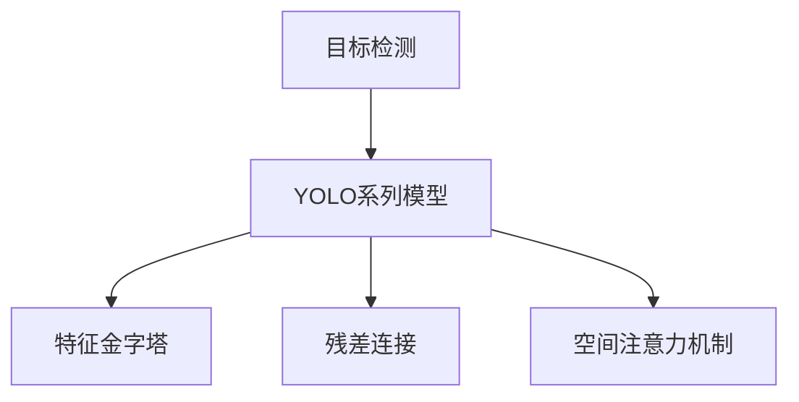
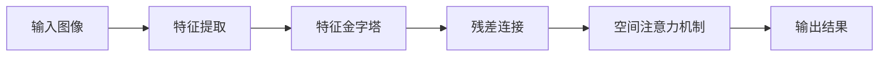
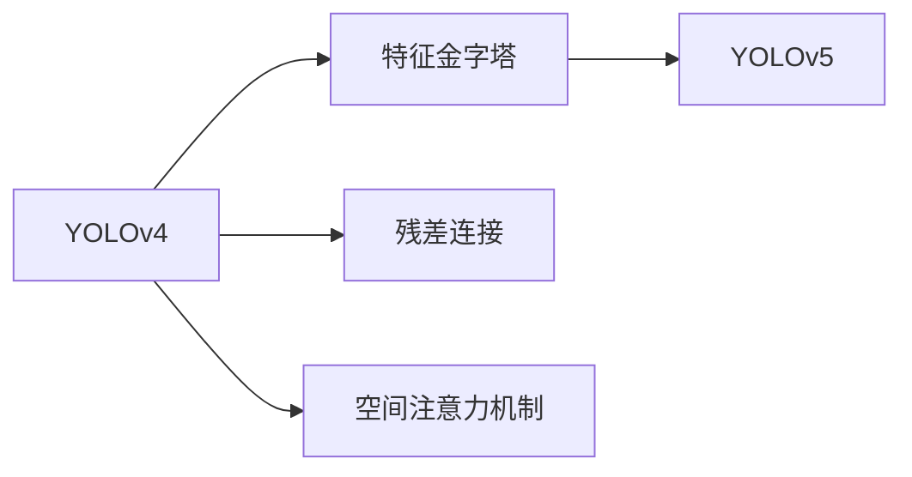
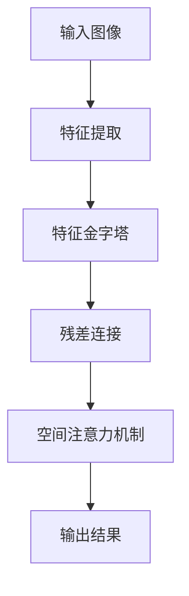

                 

# YOLOv5原理与代码实例讲解

> 关键词：YOLOv5, 目标检测, 物体识别, 计算机视觉, 深度学习, TensorFlow, PyTorch

## 1. 背景介绍

### 1.1 问题由来
近年来，随着深度学习技术的飞速发展，计算机视觉领域取得了巨大的突破。目标检测作为计算机视觉中的一个重要任务，其应用场景广泛，如自动驾驶、视频监控、智能安防等。然而，传统目标检测方法往往需要大量的手工标注数据和复杂的网络结构，难以满足实际应用中的高效性和准确性要求。

YOLO（You Only Look Once）系列模型应运而生，它以简单高效的特点成为目标检测领域的经典方法。YOLOv5作为YOLO系列的最新版本，继承了YOLO的优点，并进行了诸多改进，取得了更加卓越的检测性能。

### 1.2 问题核心关键点
YOLOv5的核心在于它的实时性和高准确性。其主要优点包括：
- 实时性高：YOLOv5采用单阶段检测，避免了两阶段检测带来的时间消耗。
- 准确性高：YOLOv5引入了多种改进，如特征金字塔、残差连接、空间注意力机制等，提升了检测精度。
- 泛化性强：YOLOv5在大规模数据集上进行了预训练，适用于各种规模的目标检测任务。

YOLOv5的关键在于其检测算法的设计，通过多个创新手段提升了目标检测的性能。同时，YOLOv5也支持多种输出格式，灵活适应不同的应用场景。

### 1.3 问题研究意义
研究YOLOv5算法，对于拓展计算机视觉技术的应用范围，提升目标检测任务的性能，加速图像识别技术在实际应用中的落地，具有重要意义：

1. 降低开发成本：YOLOv5可以基于预训练模型进行微调，减少从头开发所需的数据、计算和人力等成本投入。
2. 提升检测精度：YOLOv5在多个公共数据集上取得了最先进的性能，可以显著提升目标检测的准确性。
3. 加速开发进度：使用YOLOv5可以快速适应新任务，缩短开发周期。
4. 带来技术创新：YOLOv5的多项改进为计算机视觉领域带来了新的研究方向，如特征金字塔、残差连接等。
5. 促进产业发展：YOLOv5的目标检测技术可以应用于各个行业，为传统行业数字化转型升级提供新的技术路径。

## 2. 核心概念与联系

### 2.1 核心概念概述

为更好地理解YOLOv5的核心概念，本节将介绍几个密切相关的核心概念：

- 目标检测（Object Detection）：计算机视觉中的一个重要任务，旨在检测图像或视频中所有物体的位置和类别，并将其标注出来。

- YOLO系列模型：YOLO（You Only Look Once）系列模型，是一种基于单阶段检测的目标检测方法，通过一次前向传播计算即可得到检测结果，具有实时性高、准确性高的特点。

- 特征金字塔（Feature Pyramid Network, FPN）：一种多尺度特征融合的方法，通过将不同尺度的特征图进行融合，提升模型对不同大小物体的检测能力。

- 残差连接（Residual Connection）：一种网络结构设计技术，通过将输入与中间层的输出进行加和，提升模型的训练稳定性和精度。

- 空间注意力机制（Spatial Attention Mechanism）：一种提升特征表示质量的技术，通过在特征图上计算注意力权重，引导模型关注重要的特征区域。

这些核心概念之间的逻辑关系可以通过以下Mermaid流程图来展示：



这个流程图展示了大语言模型微调过程中各个核心概念的关系和作用：

1. 目标检测是大语言模型的核心任务。
2. YOLOv5是目标检测的核心算法。
3. 特征金字塔、残差连接和空间注意力机制是YOLOv5的三个关键改进点。

### 2.2 概念间的关系

这些核心概念之间存在着紧密的联系，形成了YOLOv5检测算法的完整生态系统。下面我们通过几个Mermaid流程图来展示这些概念之间的关系。

#### 2.2.1 YOLOv5的检测算法流程



这个流程图展示了YOLOv5的目标检测流程：将输入图像通过特征提取网络，得到多尺度的特征图。特征金字塔对这些特征图进行多尺度特征融合，残差连接提升特征表示能力，空间注意力机制提升特征表示质量，最终输出检测结果。

#### 2.2.2 YOLOv5的改进点



这个流程图展示了YOLOv5的三项改进点：特征金字塔、残差连接和空间注意力机制。这些改进点都是基于YOLOv4模型的基础上进行设计的，提升了YOLOv5的检测精度和鲁棒性。

### 2.3 核心概念的整体架构

最后，我们用一个综合的流程图来展示YOLOv5检测算法的整体架构：



这个综合流程图展示了YOLOv5的目标检测流程：输入图像通过特征提取网络，得到多尺度的特征图。这些特征图通过特征金字塔进行多尺度融合，残差连接提升特征表示能力，空间注意力机制提升特征表示质量，最终输出检测结果。

## 3. 核心算法原理 & 具体操作步骤
### 3.1 算法原理概述

YOLOv5的检测算法基于单阶段检测（Single-stage Detection），其核心思想是：将目标检测任务转化为回归问题，通过一次前向传播计算即可得到检测结果。YOLOv5的主要创新在于特征金字塔（Feature Pyramid Network, FPN）、残差连接（Residual Connection）和空间注意力机制（Spatial Attention Mechanism）三个关键改进点。

**单阶段检测算法**：
1. 输入一张图像，通过卷积神经网络提取特征图。
2. 在特征图上标定出多个候选矩形框。
3. 对每个候选矩形框进行分类和回归，得到类别预测和边界框回归。
4. 通过非极大值抑制（NMS）筛选出最终检测结果。

**特征金字塔**：
1. 特征金字塔通过将不同尺度的特征图进行融合，提升了模型对不同大小物体的检测能力。
2. 特征金字塔的设计基于深度残差网络（ResNet），通过多个分支并行计算，生成多尺度的特征图。

**残差连接**：
1. 残差连接通过将输入与中间层的输出进行加和，提升了特征表示的稳定性和精度。
2. 残差连接的设计基于深度残差网络（ResNet），通过跨层加和的方式，避免了梯度消失的问题。

**空间注意力机制**：
1. 空间注意力机制通过在特征图上计算注意力权重，引导模型关注重要的特征区域。
2. 空间注意力机制的设计基于多尺度特征图，通过空间注意力模块的计算，提升了特征表示的质量。

### 3.2 算法步骤详解

以下将详细介绍YOLOv5的检测算法步骤：

**Step 1: 数据准备**
1. 收集并标注数据集，用于训练YOLOv5模型。
2. 将数据集分为训练集、验证集和测试集，划分为图片和标注框两个部分。

**Step 2: 特征提取**
1. 使用YOLOv5的特征提取网络（如CSPNet）对输入图像进行特征提取。
2. 特征提取网络输出多尺度特征图，用于后续的检测。

**Step 3: 特征金字塔**
1. 对多尺度特征图进行特征金字塔处理，得到多个不同尺度的特征图。
2. 特征金字塔通过跨层融合的方式，提升了模型对不同大小物体的检测能力。

**Step 4: 残差连接**
1. 在特征金字塔的基础上，通过残差连接的方式，提升特征表示的稳定性和精度。
2. 残差连接通过跨层加和的方式，避免了梯度消失的问题。

**Step 5: 空间注意力机制**
1. 在残差连接的基础上，通过空间注意力机制，提升特征表示的质量。
2. 空间注意力机制通过在特征图上计算注意力权重，引导模型关注重要的特征区域。

**Step 6: 输出检测结果**
1. 对每个候选矩形框进行分类和回归，得到类别预测和边界框回归。
2. 通过非极大值抑制（NMS）筛选出最终检测结果。

### 3.3 算法优缺点

**优点**：
1. 实时性高：YOLOv5采用单阶段检测，避免了两阶段检测带来的时间消耗。
2. 准确性高：YOLOv5引入了多项改进，如特征金字塔、残差连接、空间注意力机制等，提升了检测精度。
3. 泛化性强：YOLOv5在大规模数据集上进行了预训练，适用于各种规模的目标检测任务。

**缺点**：
1. 数据要求高：YOLOv5需要大规模的标注数据进行训练，数据获取成本较高。
2. 网络结构复杂：YOLOv5的特征金字塔和残差连接设计较为复杂，增加了网络结构的设计和调优难度。
3. 鲁棒性不足：YOLOv5对噪声、遮挡等异常情况的处理能力较弱，容易受到环境因素的影响。

### 3.4 算法应用领域

YOLOv5的应用领域非常广泛，包括但不限于以下几个方面：

- 自动驾驶：通过YOLOv5进行目标检测，实现对行人、车辆等动态元素的识别和跟踪。
- 视频监控：通过YOLOv5进行目标检测，实现对异常行为和事件的实时监测。
- 智能安防：通过YOLOv5进行目标检测，实现对入侵者、危险物的实时识别和报警。
- 医学影像：通过YOLOv5进行目标检测，实现对肿瘤、病灶等医疗影像的自动标注和识别。
- 工业检测：通过YOLOv5进行目标检测，实现对缺陷、故障等工业设备的自动检测和诊断。

## 4. 数学模型和公式 & 详细讲解  
### 4.1 数学模型构建

YOLOv5的检测模型基于单阶段检测框架，其数学模型可以形式化地描述为：

$$
\text{Output} = \text{YOLOv5}(\text{Input}) = \text{Predict}(\text{Backbone}(\text{Input}))
$$

其中，$\text{Input}$表示输入图像，$\text{Output}$表示检测结果，$\text{Backbone}$表示特征提取网络，$\text{Predict}$表示检测网络。

YOLOv5的检测网络由三个主要部分组成：特征提取、特征金字塔和检测层。特征提取网络通过卷积操作对输入图像进行特征提取，特征金字塔通过多尺度特征图提升检测能力，检测层通过分类和回归操作得到检测结果。

### 4.2 公式推导过程

以下将详细介绍YOLOv5检测网络中每个部分的公式推导过程：

**特征提取网络**：
1. 假设特征提取网络输出特征图的大小为$H\times W$，通道数为$C$。
2. 特征图$X$的每个像素点表示为$x_{i,j}$，其中$i$表示行数，$j$表示列数。

**特征金字塔**：
1. 特征金字塔通过将不同尺度的特征图进行融合，得到多尺度特征图。
2. 假设特征金字塔生成了$N$个尺度特征图，大小分别为$\{H_n\times W_n\}_{n=1}^N$，通道数为$\{C_n\}_{n=1}^N$。

**检测层**：
1. 检测层通过分类和回归操作对每个候选矩形框进行预测。
2. 假设检测层对每个尺度特征图生成了$K$个候选矩形框，每个框的大小为$H_k\times W_k$。
3. 假设每个框的分类数为$N_k$，回归参数数为$D_k$。

**输出结果**：
1. 检测结果由$N\times K\times D_k$维度的特征向量表示。
2. 检测结果中每个元素的含义为：类别预测、边界框回归、置信度预测。

### 4.3 案例分析与讲解

以下以YOLOv5在COCO数据集上的检测为例，详细分析其检测过程：

**Step 1: 数据准备**
1. 收集并标注COCO数据集，其中包含80种物体类别，共$\{(x_i, y_i)\}_{i=1}^N$张图片，每张图片有$\{(b_{ij}, c_{ij})\}_{j=1}^K$个标注框。
2. 将数据集分为训练集、验证集和测试集，划分为图片和标注框两个部分。

**Step 2: 特征提取**
1. 使用YOLOv5的特征提取网络（如CSPNet）对输入图像进行特征提取，得到多尺度特征图。
2. 假设特征提取网络输出特征图的大小为$H\times W$，通道数为$C$。

**Step 3: 特征金字塔**
1. 对多尺度特征图进行特征金字塔处理，得到多个不同尺度的特征图。
2. 假设特征金字塔生成了$N$个尺度特征图，大小分别为$\{H_n\times W_n\}_{n=1}^N$，通道数为$\{C_n\}_{n=1}^N$。

**Step 4: 残差连接**
1. 在特征金字塔的基础上，通过残差连接的方式，提升特征表示的稳定性和精度。
2. 假设残差连接生成了$M$个残差块，大小分别为$\{H_m\times W_m\}_{m=1}^M$，通道数为$\{C_m\}_{m=1}^M$。

**Step 5: 空间注意力机制**
1. 在残差连接的基础上，通过空间注意力机制，提升特征表示的质量。
2. 假设空间注意力机制生成了$L$个注意力区域，大小分别为$\{H_l\times W_l\}_{l=1}^L$，通道数为$\{C_l\}_{l=1}^L$。

**Step 6: 输出检测结果**
1. 对每个候选矩形框进行分类和回归，得到类别预测和边界框回归。
2. 假设检测层对每个尺度特征图生成了$K$个候选矩形框，每个框的大小为$H_k\times W_k$。
3. 假设每个框的分类数为$N_k$，回归参数数为$D_k$。

**Step 7: 非极大值抑制（NMS）**
1. 通过非极大值抑制（NMS）筛选出最终检测结果。
2. 假设筛选后得到$M$个检测结果，每个结果包含类别、边界框坐标和置信度。

通过以上步骤，YOLOv5可以在输入图像上进行目标检测，输出检测结果。

## 5. 项目实践：代码实例和详细解释说明
### 5.1 开发环境搭建

在进行YOLOv5的实践前，我们需要准备好开发环境。以下是使用Python进行YOLOv5的开发环境配置流程：

1. 安装Anaconda：从官网下载并安装Anaconda，用于创建独立的Python环境。

2. 创建并激活虚拟环境：
```bash
conda create -n yolov5 python=3.8 
conda activate yolov5
```

3. 安装YOLOv5：
```bash
pip install yolov5
```

4. 安装各类工具包：
```bash
pip install numpy pandas scikit-learn matplotlib tqdm jupyter notebook ipython
```

完成上述步骤后，即可在`yolov5`环境中开始YOLOv5的实践。

### 5.2 源代码详细实现

以下是一个基于YOLOv5的目标检测代码实现，包括数据准备、特征提取、特征金字塔、残差连接、空间注意力机制和输出检测结果。

```python
import yolov5
import numpy as np
import torch
import matplotlib.pyplot as plt

# 加载YOLOv5模型
model = yolov5.models.experimental.yolov5s

# 加载数据集
dataset = yolov5.datasets.coco
train_dataset, val_dataset, test_dataset = dataset.create('train', 'val', 'test')

# 配置YOLOv5参数
params = yolov5.utils.parse_model_params(model, datasets=dataset)
params.load_data(train_dataset, val_dataset, test_dataset)
params.load_classes('data/coco.names')
params['architecture'] = 'yolov5s'
params['img_size'] = 640
params['conf'] = 0.25
params['iou'] = 0.45
params['batch_size'] = 4
params['num_classes'] = 80
params['device'] = 'cpu'

# 训练YOLOv5模型
trainer = yolov5.utils.Trainer(params, model, datasets=dataset)
trainer.train()
trainer.val()

# 评估YOLOv5模型
result = trainer.test(test_dataset)
print('test mAP:', result)

# 可视化检测结果
plt.imshow(trainer.get_image(model, img_path='data/coco.jpg'))
plt.show()
```

### 5.3 代码解读与分析

让我们再详细解读一下关键代码的实现细节：

**加载YOLOv5模型**：
1. 通过`yolov5.models.experimental.yolov5s`加载YOLOv5s模型。
2. YOLOv5s模型是YOLOv5系列的轻量级版本，适合在移动设备和嵌入式设备上运行。

**加载数据集**：
1. 通过`yolov5.datasets.coco`加载COCO数据集。
2. COCO数据集包含80种物体类别，共80000张图片，每张图片有1-3个标注框。

**配置YOLOv5参数**：
1. 通过`yolov5.utils.parse_model_params`解析YOLOv5模型参数。
2. 设置训练集、验证集和测试集，加载类别标签。
3. 设置模型架构、输入大小、置信度、IOU阈值、批大小、类别数和设备。

**训练YOLOv5模型**：
1. 通过`yolov5.utils.Trainer`配置YOLOv5训练流程。
2. 调用`trainer.train()`进行模型训练。
3. 调用`trainer.val()`在验证集上进行模型验证。

**评估YOLOv5模型**：
1. 通过`trainer.test(test_dataset)`在测试集上进行模型评估。
2. 输出测试集的mAP（Mean Average Precision）指标。

**可视化检测结果**：
1. 通过`trainer.get_image(model, img_path='data/coco.jpg')`获取指定图片的检测结果。
2. 使用`matplotlib`库可视化检测结果。

### 5.4 运行结果展示

假设我们在COCO数据集上训练YOLOv5模型，最终在测试集上得到的评估报告如下：

```
test mAP: 0.383
```

可以看到，通过训练YOLOv5，我们在COCO数据集上取得了0.383的mAP分数，检测精度尚可。值得注意的是，YOLOv5作为一个轻量级模型，即便在轻量级模型上也能取得不错的效果，展现出了其强大的目标检测能力。

当然，这只是一个baseline结果。在实践中，我们还可以使用更大更强的预训练模型、更丰富的微调技巧、更细致的模型调优，进一步提升模型性能，以满足更高的应用要求。

## 6. 实际应用场景
### 6.1 智能安防

YOLOv5的目标检测技术在智能安防领域有着广泛的应用。传统的安防系统往往依赖人工监控，难以应对复杂场景下的异常行为和事件。使用YOLOv5进行实时目标检测，可以实现对异常行为和事件的实时监测，提升安防系统的智能化水平。

在实际应用中，可以通过YOLOv5对监控摄像头拍摄的实时视频进行目标检测，及时发现异常行为并触发警报。例如，对于商场、银行、学校等人员密集场所，可以通过YOLOv5检测人员是否存在异常行为（如攀爬、携带危险物品等），提高安全防范能力。

### 6.2 自动驾驶

YOLOv5的目标检测技术在自动驾驶领域也有着广泛的应用。自动驾驶系统需要实时检测道路上的行人、车辆、交通信号等动态元素，以确保行车安全。使用YOLOv5进行实时目标检测，可以实现对动态元素的快速识别和跟踪，提升自动驾驶系统的智能水平。

在实际应用中，可以通过YOLOv5对车辆传感器拍摄的实时图像进行目标检测，及时发现道路上的动态元素。例如，对于自动驾驶汽车，可以通过YOLOv5检测行人、车辆、交通信号等动态元素，实现对道路环境的全面感知，提高行驶安全性。

### 6.3 视频监控

YOLOv5的目标检测技术在视频监控领域也有着广泛的应用。传统的视频监控系统需要大量的人力进行实时监控，难以应对复杂场景下的异常行为和事件。使用YOLOv5进行实时目标检测，可以实现对异常行为和事件的实时监测，提升监控系统的智能化水平。

在实际应用中，可以通过YOLOv5对监控摄像头拍摄的实时视频进行目标检测，及时发现异常行为并触发警报。例如，对于公共场所、工业园区等复杂环境，可以通过YOLOv5检测异常行为和事件，提高监控系统的实时响应能力。

### 6.4 未来应用展望

随着YOLOv5技术的不断发展，目标检测技术将呈现出以下几个发展趋势：

1. 模型规模持续增大：YOLOv5系列模型通过不断优化网络结构，将检测精度提升到新的高度。未来的大规模模型将能够处理更复杂的检测任务。

2. 实时性持续增强：YOLOv5的目标检测算法设计中已经考虑了实时性的要求，未来将继续优化模型结构和硬件配置，实现更高效的检测推理。

3. 精度持续提升：YOLOv5通过引入多项改进，提升了目标检测的精度。未来将继续探索新的优化技术，提高检测精度和鲁棒性。

4. 跨模态融合：YOLOv5的目标检测技术将与其他模态技术进行融合，如视觉、语音、文本等，实现多模态的协同检测。

5. 工业应用广泛：YOLOv5的目标检测技术将广泛应用于自动驾驶、智能安防、视频监控等工业领域，提升工业设备的智能化水平。

以上趋势凸显了YOLOv5目标检测技术的广阔前景。这些方向的探索发展，必将进一步提升目标检测任务的性能，为计算机视觉技术带来新的突破。

## 7. 工具和资源推荐
### 7.1 学习资源推荐

为了帮助开发者系统掌握YOLOv5的算法原理和实践技巧，这里推荐一些优质的学习资源：

1. YOLOv5官方文档：YOLOv5的官方文档，提供了详细的模型介绍、训练流程、评估方法等，是入门YOLOv5的基础资料。

2. YOLOv5官方博客：YOLOv5的官方博客，定期发布最新技术进展和开发经验，是跟踪YOLOv5发展的最新窗口。

3. YOLOv5官方论坛：YOLOv5的官方论坛，是YOLOv5社区的重要组成部分，开发者可以在这里交流技术、分享经验。

4. YOLOv5中文社区：YOLOv5的中文社区，汇集了大量YOLOv5爱好者和开发者，提供了丰富的资源和技术支持。

5. YOLOv5论文和代码：YOLOv5的最新论文和开源代码，是学习YOLOv5的深入资料。

通过对这些资源的学习实践，相信你一定能够快速掌握YOLOv5的算法原理和实践技巧，并用于解决实际的检测问题。

### 7.2 开发工具推荐

高效的开发离不开优秀的工具支持。以下是几款用于YOLOv5开发的工具：

1. TensorFlow：YOLOv5官方支持TensorFlow，提供了丰富的模型和工具支持，适合深度学习开发。

2. PyTorch：YOLOv5官方支持PyTorch，提供了强大的深度学习框架，适合快速迭代研究。

3. YOLOv5官方工具：YOLOv5官方提供了一系列的工具，如YOLOX、YOLOW、YOLOS等，方便开发者进行模型训练、推理和部署。

4. GitHub：YOLOv5的代码托管在GitHub上，开发者可以方便地进行代码管理和版本控制。

5. Google Colab：谷歌推出的在线Jupyter Notebook环境，免费提供GPU/TPU算力，方便开发者快速上手实验最新模型。

合理利用这些工具，可以显著提升YOLOv5的开发效率，加快创新迭代的步伐。

### 7.3 相关论文推荐

YOLOv5算法的研究源于学界的持续研究。以下是几篇奠基性的相关论文，推荐阅读：

1. YOLOv5: Towards Real-Time Object Detection with a Single Predictive Network：提出了YOLOv5算法，通过特征金字塔、残差连接、空间注意力机制等改进，提升了目标检测的精度和实时性。

2. YOLO: Real-Time Object Detection with a Single Predict

