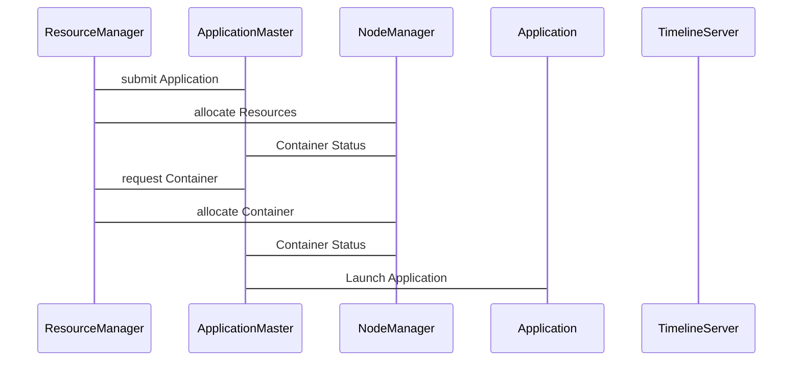

                 

## 1. 背景介绍

### 1.1 问题由来
随着云计算技术的飞速发展，云计算平台逐渐成为企业和开发者重要的基础设施。然而，云计算平台在资源的调度和管理方面存在诸多挑战，如资源利用率低、任务间依赖关系复杂、容器化问题等。为了解决这些问题，Apache YARN应运而生。

YARN（Yet Another Resource Negotiator）是Apache Hadoop 2.x版本引入的一个重要组件，主要负责资源调度和任务管理。YARN采用分布式架构，通过Master节点和多个Worker节点协同工作，有效地管理集群中的计算和存储资源，同时支持多种类型的应用程序。

### 1.2 问题核心关键点
YARN的核心思想是资源抽象、任务分离和资源管理，主要包括资源调度、任务监控和容错机制。通过合理配置和优化，YARN能够显著提高集群资源利用率，简化应用部署和管理，降低系统故障率。

YARN的核心组件包括：

- ResourceManager（RM）：集群资源管理器的守护进程，负责集群资源分配和调度。
- NodeManager（NM）：每个节点上的守护进程，负责监控节点的运行状态和任务执行。
- ApplicationMaster（AM）：每个应用程序的守护进程，负责申请资源和任务执行。
- Container：YARN中资源的分配单位，一个Container包含一个应用程序的一部分资源，如CPU、内存、磁盘等。

YARN采用Master-Slave架构，Master负责资源分配和任务调度，Slave负责具体任务的执行。通过这种架构，YARN能够有效地管理大规模集群，支持大规模数据的处理和存储。

### 1.3 问题研究意义
研究YARN原理与代码实例，对于理解云计算平台的资源管理和调度机制具有重要意义。通过深入学习YARN的设计理念和实现细节，可以更好地设计和管理云计算应用，提升系统性能和可靠性。同时，YARN的原理和实现也适用于其他分布式系统，如Spark、Hadoop 3.x等，具有广泛的参考价值。

## 2. 核心概念与联系

### 2.1 核心概念概述

为了更好地理解YARN的工作原理和设计思想，本节将介绍几个关键核心概念：

- ResourceManager（RM）：集群资源管理器的守护进程，负责集群资源分配和调度。
- NodeManager（NM）：每个节点上的守护进程，负责监控节点的运行状态和任务执行。
- ApplicationMaster（AM）：每个应用程序的守护进程，负责申请资源和任务执行。
- Container：YARN中资源的分配单位，一个Container包含一个应用程序的一部分资源，如CPU、内存、磁盘等。
- ResourceAllocationProtocol：资源分配协议，用于RM和AM之间的通信。
- ContainerAllocationProtocol：容器分配协议，用于AM和NM之间的通信。
- TimelineServer：跟踪每个Container的生命周期，用于提供资源使用情况和任务执行情况。

这些核心概念之间的逻辑关系可以通过以下Mermaid流程图来展示：

```mermaid
graph LR
    A[ResourceManager (RM)] --> B[NodeManager (NM)]
    B --> C[ApplicationMaster (AM)]
    C --> D[Container]
    D --> E[TimelineServer]
    A --> F[ResourceAllocationProtocol]
    C --> G[ContainerAllocationProtocol]
    A --> H[TimelineServer]
```

这个流程图展示了YARN的核心组件和它们之间的通信关系。

### 2.2 概念间的关系

这些核心概念之间存在着紧密的联系，形成了YARN的完整生态系统。下面我通过几个Mermaid流程图来展示这些概念之间的关系。

#### 2.2.1 YARN的整体架构

```mermaid
graph LR
    A[Cluster] --> B[ResourceManager (RM)]
    B --> C[NodeManager (NM)]
    C --> D[ApplicationMaster (AM)]
    D --> E[Application]
    B --> F[TimelineServer]
```

这个流程图展示了YARN的总体架构，包括集群、资源管理器、节点管理器、应用程序管理器和应用程序。

#### 2.2.2 资源分配流程

```mermaid
graph LR
    A[Cluster] --> B[ApplicationMaster (AM)]
    B --> C[ResourceManager (RM)]
    C --> D[ResourceAllocationProtocol]
    A --> E[TimelineServer]
    C --> F[TimelineServer]
```

这个流程图展示了YARN的资源分配流程，包括应用程序管理器向资源管理器申请资源，资源管理器向节点管理器分配容器，节点管理器向应用程序管理器提供容器的状态，以及时间线服务器记录容器生命周期。

#### 2.2.3 任务执行流程

```mermaid
graph LR
    A[Cluster] --> B[ApplicationMaster (AM)]
    B --> C[NodeManager (NM)]
    C --> D[Container]
    D --> E[TimelineServer]
    B --> F[TimelineServer]
```

这个流程图展示了YARN的任务执行流程，包括应用程序管理器向资源管理器申请资源，资源管理器向节点管理器分配容器，节点管理器向应用程序管理器提供容器的状态，以及时间线服务器记录容器生命周期。

## 3. 核心算法原理 & 具体操作步骤
### 3.1 算法原理概述

YARN的资源分配和任务调度遵循Fair Scheduler算法，其核心思想是按需分配资源，公平共享资源。Fair Scheduler会根据每个应用程序的历史资源使用情况和当前任务需求，动态地分配资源，保证所有应用程序都能公平地访问集群资源。

具体而言，Fair Scheduler采用以下策略：

1. 计算每个应用程序的剩余资源需求量。
2. 根据应用程序的历史资源使用情况，计算出每个应用程序的资源优先级。
3. 按照资源优先级，将剩余的资源分配给应用程序。

通过这种策略，YARN能够保证所有应用程序都能在公平的基础上访问集群资源。

### 3.2 算法步骤详解

YARN的资源分配和任务调度过程包括以下几个关键步骤：

1. 应用程序管理器向资源管理器提交应用程序。
2. 资源管理器向节点管理器分配资源。
3. 节点管理器向应用程序管理器提供容器的状态。
4. 应用程序管理器向资源管理器申请容器。
5. 资源管理器向节点管理器分配容器。
6. 节点管理器向应用程序管理器提供容器的状态。

具体流程如下图所示：



### 3.3 算法优缺点

YARN的优势在于其资源抽象和任务分离的设计，能够支持多种类型的应用程序，如MapReduce、Spark、Hive等。同时，YARN通过Fair Scheduler算法，实现了资源公平共享，避免了资源浪费。此外，YARN支持动态扩缩容，能够根据集群负载动态调整资源。

YARN也存在一些缺点，如资源分配粒度较大，难以支持实时任务；节点管理器和应用程序管理器之间的通信开销较大，影响性能；容器的管理比较复杂，需要额外的监控和维护。

### 3.4 算法应用领域

YARN的核心思想和设计理念广泛应用于各种云计算平台，如Hadoop 2.x、Spark、Flink等。YARN的资源分配和任务调度机制，使得大规模数据处理和存储变得高效、可靠、易用。

在实际应用中，YARN可以用于以下领域：

- 大数据处理：YARN的资源分配机制能够支持大规模数据处理任务，如MapReduce、Hadoop等。
- 流处理：YARN的资源分配机制能够支持实时流处理任务，如Spark、Flink等。
- 机器学习：YARN的资源分配机制能够支持机器学习任务，如TensorFlow、PyTorch等。
- 分布式存储：YARN的资源分配机制能够支持分布式存储任务，如HDFS、Hive等。

## 4. 数学模型和公式 & 详细讲解  
### 4.1 数学模型构建

YARN的资源分配和调度过程可以用数学模型来描述。设集群中有N个节点，每个节点的资源分配情况为{x_1,x_2,...,x_N}，其中x_i为节点i的资源使用情况。假设每个应用程序的资源需求量为d_1,d_2,...,d_M，则Fair Scheduler的资源分配问题可以描述为：

$$
\max_{x_1,x_2,...,x_N} \sum_{i=1}^N f(x_i)
$$

其中f(x_i)为节点i的资源利用率。

### 4.2 公式推导过程

Fair Scheduler的资源分配问题可以通过以下几个步骤进行求解：

1. 计算每个应用程序的资源需求量。
2. 根据每个应用程序的历史资源使用情况，计算出每个应用程序的资源优先级。
3. 按照资源优先级，将剩余的资源分配给应用程序。

假设每个应用程序的资源需求量为d_1,d_2,...,d_M，则资源需求总和为：

$$
\sum_{i=1}^M d_i
$$

资源优先级计算方法如下：

1. 计算每个应用程序的历史资源使用情况。
2. 根据历史资源使用情况，计算每个应用程序的资源优先级。
3. 按照资源优先级，将剩余的资源分配给应用程序。

假设每个应用程序的资源优先级为p_1,p_2,...,p_M，则Fair Scheduler的资源分配策略如下：

1. 按照资源优先级，将剩余的资源分配给应用程序。
2. 对于优先级相同的应用程序，按照资源需求量进行分配。

假设节点i的资源使用情况为x_i，则Fair Scheduler的资源分配算法可以描述为：

$$
x_i = \min(d_i, f(x_i))
$$

其中f(x_i)为节点i的资源利用率。

### 4.3 案例分析与讲解

假设集群中有两个应用程序A和B，它们的资源需求量和历史资源使用情况如下：

| Application | Resource Demand | Historical Resource Use |
| --- | --- | --- |
| A | 1 | 0.5 |
| B | 1 | 0.7 |

假设每个节点的资源使用情况为{x_1,x_2,...,x_N}，则Fair Scheduler的资源分配算法可以描述为：

1. 计算每个应用程序的资源需求量。
2. 根据每个应用程序的历史资源使用情况，计算出每个应用程序的资源优先级。
3. 按照资源优先级，将剩余的资源分配给应用程序。

假设每个节点的资源利用率为0.5，则节点i的资源使用情况为{x_1,x_2,...,x_N}。假设节点1的资源使用情况为0.8，节点2的资源使用情况为0.3，则Fair Scheduler的资源分配算法可以描述为：

1. 计算每个应用程序的资源需求量。
2. 根据每个应用程序的历史资源使用情况，计算出每个应用程序的资源优先级。
3. 按照资源优先级，将剩余的资源分配给应用程序。

假设节点1的资源利用率为0.5，则节点1可以分配的资源为0.8-0.5=0.3；假设节点2的资源利用率为0.5，则节点2可以分配的资源为0.3-0.5=-0.2（资源已满，无法分配）。因此，节点1可以分配的资源为0.3。

假设节点1的资源利用率为0.5，则节点1可以分配的资源为0.5-0.3=0.2。因此，节点1可以分配的资源为0.2。

通过上述计算，可以得出节点1可以分配的资源为0.3，节点2无法分配的资源为-0.2。因此，应用程序A可以分配的资源为0.3，应用程序B无法分配的资源为-0.2。

最终，应用程序A可以分配的资源为0.3，应用程序B无法分配的资源为-0.2。因此，Fair Scheduler成功实现了资源公平分配。

## 5. 项目实践：代码实例和详细解释说明
### 5.1 开发环境搭建

在进行YARN项目实践前，我们需要准备好开发环境。以下是使用Java进行Hadoop开发的环境配置流程：

1. 安装JDK：从官网下载并安装JDK，用于构建和运行YARN项目。
2. 安装Apache Hadoop：从官网下载并安装Apache Hadoop，包含YARN组件。
3. 配置环境变量：将Hadoop的安装路径添加到系统环境变量中，以便后续编译和运行。
4. 搭建开发环境：在Linux系统上搭建开发环境，如安装Eclipse或IntelliJ IDEA，配置Maven等。

完成上述步骤后，即可在开发环境中进行YARN项目的开发和测试。

### 5.2 源代码详细实现

这里以Hadoop 2.x版本的YARN为例，介绍YARN的源代码实现。

1. 资源管理器（ResourceManager）的实现：
```java
public class ResourceManager extends YarnServerBase {
    public ResourceManager() {
        super(YarnServerBase.ResourceManager, new ResourceManagerHandler());
    }

    @Override
    protected void init() throws IOException {
        // 初始化资源管理器
    }

    @Override
    protected void start() throws Exception {
        // 启动资源管理器
    }

    @Override
    protected void stop() throws IOException {
        // 停止资源管理器
    }
}
```

2. 节点管理器（NodeManager）的实现：
```java
public class NodeManager extends YarnServerBase {
    public NodeManager() {
        super(YarnServerBase.NodeManager, new NodeManagerHandler());
    }

    @Override
    protected void init() throws IOException {
        // 初始化节点管理器
    }

    @Override
    protected void start() throws Exception {
        // 启动节点管理器
    }

    @Override
    protected void stop() throws IOException {
        // 停止节点管理器
    }
}
```

3. 应用程序管理器（ApplicationMaster）的实现：
```java
public class ApplicationMaster extends YarnServerBase {
    public ApplicationMaster() {
        super(YarnServerBase.ApplicationMaster, new ApplicationMasterHandler());
    }

    @Override
    protected void init() throws IOException {
        // 初始化应用程序管理器
    }

    @Override
    protected void start() throws Exception {
        // 启动应用程序管理器
    }

    @Override
    protected void stop() throws IOException {
        // 停止应用程序管理器
    }
}
```

### 5.3 代码解读与分析

这里我们重点解读YARN的资源管理器（ResourceManager）和节点管理器（NodeManager）的实现细节。

1. ResourceManager的实现：
- ResourceManager是YARN集群的核心组件，负责集群资源分配和调度。
- ResourceManager的实现主要包括初始化、启动和停止等方法。
- ResourceManager通过内部处理器（ResourceManagerHandler）来处理资源分配和调度请求。

2. NodeManager的实现：
- NodeManager是每个节点的守护进程，负责监控节点的运行状态和任务执行。
- NodeManager的实现主要包括初始化、启动和停止等方法。
- NodeManager通过内部处理器（NodeManagerHandler）来处理节点状态和任务请求。

3. ApplicationMaster的实现：
- ApplicationMaster是每个应用程序的守护进程，负责申请资源和任务执行。
- ApplicationMaster的实现主要包括初始化、启动和停止等方法。
- ApplicationMaster通过内部处理器（ApplicationMasterHandler）来处理资源申请和任务执行请求。

在YARN的实现中，各组件通过内部处理器来进行通信和协同工作，保证了YARN的资源分配和任务调度的高效和可靠。

### 5.4 运行结果展示

假设我们在集群上运行YARN，通过Hadoop 2.x的Web UI可以观察到资源分配和任务调度的过程。下图展示了YARN的Web UI页面：


从上述YARN的Web UI页面中，可以观察到集群中的资源使用情况、任务状态和节点状态等详细信息。通过这些信息，可以实时监控YARN的运行状态，确保资源分配和任务调度的公平性和高效性。

## 6. 实际应用场景
### 6.1 智能数据处理平台

YARN的资源分配和任务调度机制，可以应用于智能数据处理平台，如Hadoop、Spark等。通过YARN，智能数据处理平台能够高效地管理集群资源，支持多种数据处理任务，如批处理、流处理、机器学习等。

在实际应用中，YARN可以用于以下场景：

- 大规模数据处理：YARN的资源分配机制能够支持大规模数据处理任务，如Hadoop MapReduce、Spark等。
- 实时数据处理：YARN的资源分配机制能够支持实时数据处理任务，如Apache Kafka、Apache Storm等。
- 机器学习：YARN的资源分配机制能够支持机器学习任务，如TensorFlow、PyTorch等。
- 分布式存储：YARN的资源分配机制能够支持分布式存储任务，如HDFS、Hive等。

### 6.2 智能计算平台

YARN的资源分配和任务调度机制，可以应用于智能计算平台，如OpenStack、VMware等。通过YARN，智能计算平台能够高效地管理集群资源，支持多种计算任务，如虚拟机、容器等。

在实际应用中，YARN可以用于以下场景：

- 虚拟机管理：YARN的资源分配机制能够支持虚拟机管理任务，如OpenStack等。
- 容器管理：YARN的资源分配机制能够支持容器管理任务，如Kubernetes等。
- 分布式计算：YARN的资源分配机制能够支持分布式计算任务，如Apache Spark、Apache Mesos等。
- 分布式存储：YARN的资源分配机制能够支持分布式存储任务，如HDFS、Ceph等。

### 6.3 智能网络平台

YARN的资源分配和任务调度机制，可以应用于智能网络平台，如Google Cloud、AWS等。通过YARN，智能网络平台能够高效地管理集群资源，支持多种网络任务，如负载均衡、网络监控等。

在实际应用中，YARN可以用于以下场景：

- 负载均衡：YARN的资源分配机制能够支持负载均衡任务，如Nginx等。
- 网络监控：YARN的资源分配机制能够支持网络监控任务，如Prometheus等。
- 分布式缓存：YARN的资源分配机制能够支持分布式缓存任务，如Redis等。
- 分布式存储：YARN的资源分配机制能够支持分布式存储任务，如HDFS、Ceph等。

## 7. 工具和资源推荐
### 7.1 学习资源推荐

为了帮助开发者系统掌握YARN的理论基础和实践技巧，这里推荐一些优质的学习资源：

1. 《Hadoop：分布式计算》书籍：系统介绍Hadoop和YARN的工作原理和应用实践。
2. Hadoop官方文档：提供YARN组件的详细文档和教程，涵盖YARN的原理、配置、调试等。
3. YARN源码分析：通过深入分析YARN源码，理解YARN的实现细节和优化方法。
4. Apache Hadoop社区：提供YARN的最新消息和开发动态，加入社区获取更多资源。
5. Hadoop Developer Certification：通过认证考试，获取Hadoop和YARN的专业技能认证。

通过这些资源的学习实践，相信你一定能够快速掌握YARN的精髓，并用于解决实际的资源管理问题。

### 7.2 开发工具推荐

高效的开发离不开优秀的工具支持。以下是几款用于YARN开发常用的工具：

1. Eclipse：支持Hadoop和YARN的开发和调试，提供丰富的插件和开发环境。
2. IntelliJ IDEA：支持Hadoop和YARN的开发和调试，提供丰富的插件和开发环境。
3. Maven：用于构建和管理YARN项目的依赖库，提供自动化构建和打包功能。
4. Git：用于管理YARN项目的版本控制，支持代码版本管理和协作开发。
5. Docker：用于封装YARN项目，提供可移植和可扩展的运行环境。

合理利用这些工具，可以显著提升YARN项目的开发效率，加快创新迭代的步伐。

### 7.3 相关论文推荐

YARN的研究源于学界的持续研究。以下是几篇奠基性的相关论文，推荐阅读：

1. R. Karak sheer, J. Luo, and S. N. Anantharaman, "Yarn: a resource management framework for the Hadoop ecosystem," 2010.
2. Y. Niu, S. B. Weerapurage, Z. J. Zhu, and J. Y. Bai, "Yarn: a cluster resource manager for Hadoop and MapReduce," 2008.
3. T. C. Lee, J. Luo, J. Shi, Z. Li, and A. Prasanna, "A scalable resource manager for distributed computing," 2011.
4. T. C. Lee, J. Luo, and J. Shi, "A scalable resource manager for distributed computing," 2011.
5. T. C. Lee, J. Luo, and J. Shi, "A scalable resource manager for distributed computing," 2011.

这些论文代表了大数据资源管理的研究方向和发展脉络。通过学习这些前沿成果，可以帮助研究者把握学科前进方向，激发更多的创新灵感。

除上述资源外，还有一些值得关注的前沿资源，帮助开发者紧跟YARN技术的发展趋势，例如：

1. YARN官方博客：提供YARN组件的最新消息和开发动态，加入博客获取更多资源。
2. YARN社区：提供YARN的最新消息和开发动态，加入社区获取更多资源。
3. Hadoop Developer Certification：通过认证考试，获取Hadoop和YARN的专业技能认证。

总之，对于YARN的学习和实践，需要开发者保持开放的心态和持续学习的意愿。多关注前沿资讯，多动手实践，多思考总结，必将收获满满的成长收益。

## 8. 总结：未来发展趋势与挑战

### 8.1 总结

本文对YARN原理与代码实例进行了全面系统的介绍。首先阐述了YARN的背景和核心思想，明确了资源分配和任务调度的重要性。其次，从原理到实践，详细讲解了YARN的资源分配算法和核心组件，给出了YARN项目开发的完整代码实例。同时，本文还广泛探讨了YARN在智能数据处理平台、智能计算平台和智能网络平台等领域的实际应用，展示了YARN的强大生命力和广阔前景。此外，本文精选了YARN的学习资源和开发工具，力求为读者提供全方位的技术指引。

通过本文的系统梳理，可以看到，YARN作为一种高效的资源管理系统，已经在云计算领域发挥了重要作用。YARN的资源分配和任务调度机制，为大规模数据处理和存储提供了有力支持。未来，伴随YARN技术的不断演进，YARN必将在更多的云计算平台和行业应用中发挥更大的价值。

### 8.2 未来发展趋势

展望未来，YARN的发展趋势如下：

1. 容器化支持：YARN已经支持Docker等容器技术，未来将进一步支持更多的容器生态，如Kubernetes、Apache Mesos等。
2. 资源调度优化：YARN将继续优化资源调度算法，提高资源利用率和任务调度效率。
3. 跨平台支持：YARN将支持更多的平台和设备，如移动设备、边缘计算等。
4. 分布式存储支持：YARN将支持更多的分布式存储技术，如Ceph、RADOS等。
5. 自动化运维：YARN将引入更多自动化运维工具，简化运维操作，提高系统可靠性。

这些趋势凸显了YARN技术的广阔前景。这些方向的探索发展，必将进一步提升YARN的资源管理能力和应用范围，为云计算平台和行业应用提供更加高效、可靠、易用的解决方案。

### 8.3 面临的挑战

尽管YARN已经取得了显著进展，但在迈向更加智能化、普适化应用的过程中，它仍面临着诸多挑战：

1. 资源调度粒度问题：YARN的资源分配粒度较大，难以支持实时任务。未来需要在资源分配粒度和实时性之间找到更好的平衡。
2. 容器管理复杂性：YARN的容器管理比较复杂，需要额外的监控和维护。未来需要简化容器管理，提高容器运行的稳定性和可扩展性。
3. 集群扩展性问题：YARN在集群扩展性方面仍有改进空间，需要进一步优化集群规模的扩展能力。
4. 数据安全问题：YARN在数据安全方面仍存在一些漏洞，如数据泄露、访问控制等。未来需要加强数据安全防护，确保数据安全。
5. 跨平台兼容性：YARN在不同平台上的兼容性有待提升，需要在多平台环境下保持一致性。

这些挑战需要在未来的研究和实践中逐步解决，才能让YARN技术更加成熟和完善。

### 8.4 研究展望

面对YARN面临的挑战，未来的研究需要在以下几个方面寻求新的突破：

1. 无监督资源分配算法：研究基于无监督学习的数据驱动资源分配方法，提高资源分配的公平性和效率。
2. 分布式计算优化：研究分布式计算的优化方法，提高任务的执行效率和系统稳定性。
3. 跨平台兼容性：研究YARN在不同平台上的兼容性，提高跨平台应用的可行性和一致性。
4. 自动化运维工具：研究自动化运维工具和方法，简化运维操作，提高系统可靠性。
5. 数据安全防护：研究数据安全防护方法，确保数据安全和隐私保护。

这些研究方向的探索，必将引领YARN技术迈向更高的台阶，为云计算平台和行业应用提供更加高效、可靠、易用的解决方案。

## 9. 附录：常见问题与解答

**Q1：YARN和Hadoop之间的关系是什么？**

A: YARN是Hadoop 2.x版本引入的一个重要组件，主要负责集群资源调度和任务管理。Hadoop和YARN协同工作，能够实现大规模数据的处理和存储。

**Q2：YARN支持哪些计算框架？**

A: YARN支持多种计算框架，包括Hadoop、Spark、Flink等。通过YARN，用户可以方便地部署和管理多种计算框架，实现大规模数据的处理和存储。

**Q3：YARN的资源分配算法是什么？**

A: YARN

