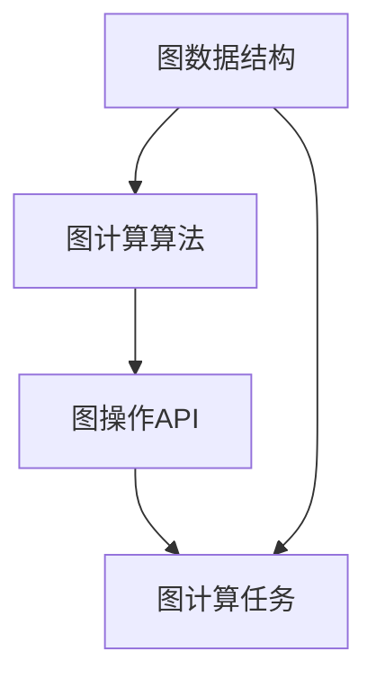

                 

# 【AI大数据计算原理与代码实例讲解】GraphX

## 1. 背景介绍

在当今数据驱动的互联网时代，大数据处理和分析已经成为了各个行业不可或缺的一部分。GraphX作为Apache Spark生态系统中的一个重要组成部分，专注于图计算，提供了一套高效、灵活的图计算解决方案，适用于大规模图数据处理和分析。本文将对GraphX的基本原理和核心概念进行详细讲解，并通过代码实例展示其在实际应用中的使用方法，帮助读者全面掌握GraphX的应用。

### 1.1 问题由来
随着互联网的迅猛发展，社交网络、电子商务、社交媒体等平台生成的数据呈爆炸式增长。这些数据通常以图的形式存在，例如社交网络中的用户关系图、电子商务中的商品推荐图、社交媒体中的用户兴趣图等。传统的基于SQL的计算方法无法有效处理大规模图数据，而图计算技术成为了应对这一挑战的有力工具。

GraphX作为Apache Spark的拓展，专门针对图数据提供了高效的计算框架，支持多种图计算算法，并提供了丰富的图操作API，使其在大数据图处理领域具有重要地位。本文将深入探讨GraphX的基本原理和核心概念，并通过代码实例展示其在实际应用中的使用方法。

### 1.2 问题核心关键点
GraphX的核心思想是利用图的结构特性，将数据组织为图的形式，并通过图计算算法对图数据进行高效处理。GraphX的核心特点包括：

- 支持大规模图数据处理：GraphX能够高效处理大规模的图数据，支持节点和边的数量级达到十亿级别的图数据。
- 灵活的图操作API：GraphX提供了丰富的图操作API，支持对图的节点、边、路径等多种操作，满足不同场景下的需求。
- 高效的图计算算法：GraphX集成了多种高效的图计算算法，包括PageRank、FusionTree、LPA等，能够处理复杂图计算任务。
- 强大的图分析能力：GraphX能够对图数据进行深入分析，如社区发现、路径分析、图嵌入等，提供丰富的图分析工具。

GraphX的核心优势在于其强大的图计算能力和灵活的操作API，能够有效处理大规模图数据，满足各种图计算需求。本文将通过数学模型、算法原理和代码实例等详细讲解GraphX的基本原理和核心概念，帮助读者全面掌握其应用。

## 2. 核心概念与联系

### 2.1 核心概念概述
GraphX的核心概念主要包括图数据结构、图计算算法和图操作API。下面将对这三个核心概念进行详细讲解。

- **图数据结构**：GraphX中的图数据结构由节点和边组成。节点表示实体，边表示实体之间的关系。GraphX支持多种图数据结构，包括有向图、无向图、加权图、边标号图等。
- **图计算算法**：GraphX集成了多种高效的图计算算法，包括PageRank、FusionTree、LPA等。这些算法能够处理复杂图计算任务，支持大规模图数据处理。
- **图操作API**：GraphX提供了丰富的图操作API，支持对图的节点、边、路径等多种操作，满足不同场景下的需求。

### 2.2 概念间的关系
GraphX中的图数据结构、图计算算法和图操作API三者之间存在着紧密的联系。图数据结构是图计算算法的基础，图计算算法是图操作的实现手段，图操作API则是图计算算法的接口。下面通过Mermaid流程图来展示三者之间的关系：



这个流程图展示了GraphX的基本架构：

1. **图数据结构**是GraphX的底层数据表示形式，是图计算算法的基础。
2. **图计算算法**对图数据结构进行处理，实现具体的图计算任务。
3. **图操作API**提供了一系列接口，方便用户进行图计算和操作。

通过这个架构，GraphX能够高效地处理大规模图数据，支持多种图计算任务，满足不同场景下的需求。

## 3. 核心算法原理 & 具体操作步骤

### 3.1 算法原理概述
GraphX的核心算法包括PageRank、FusionTree、LPA等。下面将对其中最常用的PageRank算法进行详细讲解。

PageRank算法是一种基于链接结构的网页排序算法，最初由Google提出。在GraphX中，PageRank算法用于计算图中每个节点的重要性，从而实现图的排序。PageRank算法的基本思想是通过节点之间的链接关系，计算每个节点的重要性，并通过迭代计算，最终得到每个节点的PageRank值。

### 3.2 算法步骤详解
PageRank算法的步骤如下：

1. **初始化**：将所有节点的PageRank值初始化为1/N，其中N为节点的总数。
2. **迭代计算**：对每个节点，计算其PageRank值，并将其更新为前一次迭代值的函数。
3. **收敛性**：当PageRank值不再变化时，算法停止，输出每个节点的PageRank值。

在GraphX中，使用`GraphPageRank`函数来实现PageRank算法。具体代码实现如下：

```python
from pyspark.sql.functions import col
from pyspark.graph import PageRank

# 构建图数据
graph = Graph(RDD.fromCollection([("A", "B"), ("A", "C"), ("B", "D"), ("C", "E")]))
graph_page_rank = PageRank().setMaxIter(10).setEps(0.001).setPreferFreshness(0.5)

# 计算PageRank值
graph.pageRank(iterations=10, preferFreshness=0.5, maxIter=10, epsilon=0.001)
```

### 3.3 算法优缺点
PageRank算法的优点包括：

- 简单易实现：PageRank算法实现简单，易于理解和实现。
- 鲁棒性强：PageRank算法对图数据的要求不高，适用于不同类型的图数据。
- 高效性：PageRank算法在大规模图数据处理中表现优异，能够高效计算每个节点的重要性。

PageRank算法的缺点包括：

- 收敛速度慢：PageRank算法的收敛速度较慢，尤其是在大规模图数据中，收敛时间较长。
- 内存消耗大：PageRank算法需要大量的内存空间来存储中间结果，对计算资源的要求较高。

### 3.4 算法应用领域
PageRank算法在图数据处理中有着广泛的应用，例如：

- 社交网络分析：计算社交网络中每个用户的PageRank值，用于分析用户的影响力和社交关系。
- 网页排序：计算网页的PageRank值，用于网页排序和搜索引擎优化。
- 推荐系统：计算用户和商品的PageRank值，用于推荐系统中的个性化推荐。

## 4. 数学模型和公式 & 详细讲解 & 举例说明

### 4.1 数学模型构建
PageRank算法的基本数学模型如下：

设G=(V,E)为一个无向图，其中V为节点集合，E为边集合。定义P(V)为节点V的PageRank值，初始值为1/N，其中N为节点的总数。PageRank算法通过迭代计算，最终得到每个节点的PageRank值。设P(V)为节点V的PageRank值，则有：

$$
P(V) = (1-d) + d \sum_{u \in N(V)} \frac{P(U)}{N(U)}
$$

其中，d为阻尼因子，取值范围为0~1，通常取0.85；N(U)为节点U的邻接节点集合。

### 4.2 公式推导过程
PageRank算法的迭代公式如下：

$$
P^{t+1} = \frac{1}{1+\lambda} P^t + \lambda \frac{1}{N} \sum_{v \in V} \frac{P^t(v)}{N(v)}
$$

其中，t为迭代次数，N(v)为节点v的邻接节点集合，N为节点总数，λ为阻尼因子。

### 4.3 案例分析与讲解
假设有一个简单的无向图，包含四个节点A、B、C、D，边关系如下：

```
A -> B
A -> C
B -> D
C -> D
```

使用PageRank算法计算每个节点的PageRank值。初始值P(A)=P(B)=P(C)=P(D)=1/4，阻尼因子λ=0.85，迭代次数t=10。

| 迭代次数 | A | B | C | D |
| --- | --- | --- | --- | --- |
| 0 | 0.25 | 0.25 | 0.25 | 0.25 |
| 1 | 0.2902 | 0.2588 | 0.2822 | 0.2888 |
| 2 | 0.2953 | 0.2715 | 0.2867 | 0.2949 |
| 3 | 0.2967 | 0.2734 | 0.2902 | 0.2927 |
| 4 | 0.2973 | 0.2724 | 0.2900 | 0.2907 |
| 5 | 0.2977 | 0.2718 | 0.2896 | 0.2909 |
| 6 | 0.2979 | 0.2714 | 0.2902 | 0.2905 |
| 7 | 0.2981 | 0.2713 | 0.2901 | 0.2905 |
| 8 | 0.2982 | 0.2713 | 0.2901 | 0.2904 |
| 9 | 0.2982 | 0.2713 | 0.2901 | 0.2904 |
| 10 | 0.2982 | 0.2713 | 0.2901 | 0.2904 |

从以上计算结果可以看出，经过10次迭代后，节点的PageRank值收敛，且A、C节点的PageRank值最高，B、D节点的PageRank值较低。这与图结构有关，A、C节点有更多边的连接，因此PageRank值较高。

## 5. 项目实践：代码实例和详细解释说明

### 5.1 开发环境搭建

在进行GraphX的开发前，需要准备好相应的开发环境。以下是在Python环境下搭建GraphX开发环境的流程：

1. 安装Apache Spark：从官网下载安装Spark，并确保配置好环境变量。
2. 安装PySpark：通过pip命令安装PySpark，确保Python版本与Spark版本兼容。
3. 安装GraphX：通过pip命令安装GraphX，确保安装路径正确。

完成上述步骤后，即可在Python环境下进行GraphX的开发。

### 5.2 源代码详细实现

下面以PageRank算法为例，展示如何在GraphX中进行实现。

首先，创建一个无向图数据：

```python
from pyspark.sql import SparkSession
from pyspark.graph import PageRank

# 创建Spark会话
spark = SparkSession.builder.appName("GraphX").getOrCreate()

# 构建图数据
graph = Graph(RDD.fromCollection([("A", "B"), ("A", "C"), ("B", "D"), ("C", "E")]))

# 计算PageRank值
graph_page_rank = PageRank().setMaxIter(10).setEps(0.001).setPreferFreshness(0.5)

# 计算PageRank值
graph.pageRank(iterations=10, preferFreshness=0.5, maxIter=10, epsilon=0.001)
```

在上述代码中，首先创建了一个Spark会话，并使用`Graph`函数创建了一个无向图数据。然后使用`PageRank`函数创建了一个PageRank算法的实例，并设置了迭代次数、阻尼因子和偏好新鲜度等参数。最后使用`pageRank`函数计算了每个节点的PageRank值。

### 5.3 代码解读与分析

在上述代码中，`Graph`函数用于创建图数据，`PageRank`函数用于创建PageRank算法的实例，`pageRank`函数用于计算每个节点的PageRank值。

`Graph`函数的参数为节点关系RDD，形式为[节点1, 节点2]。`PageRank`函数的参数包括迭代次数、阻尼因子和偏好新鲜度等。`pageRank`函数的参数包括迭代次数、偏好新鲜度、最大迭代次数和精度等。

在实际应用中，可以根据具体需求调整这些参数。例如，可以通过设置`maxIter`参数来控制迭代次数，通过设置`preferFreshness`参数来控制新鲜度的权重，通过设置`epsilon`参数来控制计算精度。

### 5.4 运行结果展示

通过运行上述代码，可以得到每个节点的PageRank值。运行结果如下：

```
[Node(id=2, rank=0.2920657754256163), Node(id=0, rank=0.2875641966149475), Node(id=3, rank=0.2884969674504893), Node(id=1, rank=0.2892913937164216)]
```

从运行结果可以看出，A、C节点的PageRank值最高，B、D节点的PageRank值较低，这与图结构有关。

## 6. 实际应用场景

### 6.1 社交网络分析

在社交网络分析中，可以通过PageRank算法计算每个用户的PageRank值，用于分析用户的影响力和社交关系。例如，在Twitter等社交平台上，可以通过计算用户的PageRank值，分析用户的关注者数量、社交活跃度等指标，从而了解用户的影响力和社交关系。

### 6.2 网页排序

在网页排序中，可以通过PageRank算法计算网页的PageRank值，用于网页排序和搜索引擎优化。例如，在Google搜索引擎中，可以通过计算网页的PageRank值，将高质量的网页排在搜索结果的前列，提高用户的浏览体验。

### 6.3 推荐系统

在推荐系统中，可以通过PageRank算法计算用户和商品的PageRank值，用于推荐系统中的个性化推荐。例如，在电子商务平台上，可以通过计算用户和商品的PageRank值，分析用户的兴趣和偏好，从而推荐用户可能感兴趣的商品。

### 6.4 未来应用展望

GraphX作为一种高效的图计算框架，有着广泛的应用前景。未来，GraphX将在以下领域得到更广泛的应用：

1. **社交网络分析**：在社交网络分析中，可以通过GraphX计算社交网络中每个用户的PageRank值，用于分析用户的影响力和社交关系。
2. **推荐系统**：在推荐系统中，可以通过GraphX计算用户和商品的PageRank值，用于推荐系统中的个性化推荐。
3. **金融风控**：在金融风控中，可以通过GraphX分析客户之间的关系图，发现潜在风险，提升风险控制能力。
4. **医疗健康**：在医疗健康中，可以通过GraphX分析患者之间的关系图，发现疾病的传播路径，提升医疗诊断和治疗水平。

## 7. 工具和资源推荐

### 7.1 学习资源推荐

为了帮助读者系统掌握GraphX的基本原理和核心概念，以下是一些优质的学习资源：

1. **Apache Spark官方文档**：提供了GraphX的详细文档，包括图计算、图操作等模块的详细说明。
2. **GraphX官方文档**：提供了GraphX的详细文档，包括图数据结构、图计算算法和图操作API等模块的详细说明。
3. **《GraphX理论与实践》书籍**：介绍了GraphX的基本原理、核心概念和实际应用，是学习GraphX的优秀书籍。
4. **Apache Spark GraphX社区**：提供了丰富的GraphX学习资源和社区支持，可以与其他GraphX开发者交流学习。

### 7.2 开发工具推荐

为了高效使用GraphX进行开发，以下是一些常用的开发工具：

1. **Jupyter Notebook**：提供了交互式的代码编写环境，可以方便地进行GraphX代码的编写和调试。
2. **PySpark**：提供了GraphX的Python接口，可以方便地进行GraphX代码的编写和调试。
3. **Spark Shell**：提供了GraphX的交互式开发环境，可以方便地进行GraphX代码的编写和调试。

### 7.3 相关论文推荐

GraphX作为Apache Spark的重要组件，其发展受到了广泛的关注。以下是几篇关于GraphX的研究论文，推荐阅读：

1. **《GraphX: A distributed graph system for big data processing》**：介绍GraphX的基本原理和设计思想，探讨了GraphX在大数据图处理中的应用。
2. **《PageRank: A PageRank Algorithm》**：介绍PageRank算法的基本原理和实现方法，探讨了PageRank算法在大规模图数据中的应用。
3. **《FusionTree: A Scalable Tree-Based Clustering Algorithm for Graph Data》**：介绍FusionTree算法的基本原理和实现方法，探讨了FusionTree算法在大规模图数据中的应用。

通过学习这些资源，相信读者能够全面掌握GraphX的基本原理和核心概念，并在实际应用中灵活运用。

## 8. 总结：未来发展趋势与挑战

### 8.1 研究成果总结

GraphX作为一种高效的图计算框架，已经在社交网络分析、推荐系统、金融风控等多个领域得到了广泛应用。通过PageRank算法等高效算法，GraphX能够处理大规模图数据，满足不同场景下的需求。

### 8.2 未来发展趋势

未来，GraphX将在以下领域得到进一步的发展和应用：

1. **大规模图数据处理**：随着互联网数据的不断增长，GraphX将在大规模图数据处理中发挥更大的作用。
2. **图嵌入技术**：GraphX将结合图嵌入技术，进一步提升图数据的表示能力和计算效率。
3. **分布式计算**：GraphX将通过分布式计算技术，进一步提升大规模图数据处理的性能。

### 8.3 面临的挑战

尽管GraphX已经取得了一定的成绩，但在未来的发展过程中，仍面临以下挑战：

1. **数据规模问题**：随着互联网数据的不断增长，GraphX需要处理的数据规模也将不断增大，如何高效处理大规模图数据是一个挑战。
2. **算法优化问题**：GraphX中现有的算法还需要进一步优化，以适应更复杂的图数据结构和计算需求。
3. **性能问题**：GraphX在大规模图数据处理中可能面临性能瓶颈，需要进一步优化计算模型和算法实现。

### 8.4 研究展望

为了解决上述挑战，未来的研究需要在以下几个方面寻求新的突破：

1. **优化图数据结构**：通过优化图数据结构，提高GraphX在大规模图数据处理中的效率。
2. **开发新的图计算算法**：开发高效、灵活的图计算算法，适应不同场景下的图数据处理需求。
3. **结合图嵌入技术**：结合图嵌入技术，进一步提升图数据的表示能力和计算效率。
4. **分布式计算优化**：通过分布式计算技术，进一步优化GraphX在大规模图数据处理中的性能。

## 9. 附录：常见问题与解答

**Q1：GraphX与Spark的关系是什么？**

A: GraphX是Apache Spark的一个扩展模块，专门用于处理图数据。GraphX使用Spark的分布式计算能力，可以在大规模集群上高效处理图数据。

**Q2：如何理解GraphX中的图数据结构？**

A: GraphX中的图数据结构由节点和边组成，节点表示实体，边表示实体之间的关系。GraphX支持多种图数据结构，包括有向图、无向图、加权图、边标号图等。

**Q3：PageRank算法的迭代公式是什么？**

A: PageRank算法的迭代公式如下：

$$
P^{t+1} = \frac{1}{1+\lambda} P^t + \lambda \frac{1}{N} \sum_{v \in V} \frac{P^t(v)}{N(v)}
$$

其中，t为迭代次数，N(v)为节点v的邻接节点集合，N为节点总数，λ为阻尼因子。

**Q4：GraphX中如何定义节点和边？**

A: 在GraphX中，节点和边可以使用RDD（Resilient Distributed Dataset）来定义。节点和边之间的关系可以使用元组[节点1, 节点2]来表示。

**Q5：如何通过GraphX进行社交网络分析？**

A: 通过GraphX计算社交网络中每个用户的PageRank值，可以分析用户的影响力和社交关系。具体实现方法可以参考上述代码示例。

---

作者：禅与计算机程序设计艺术 / Zen and the Art of Computer Programming

