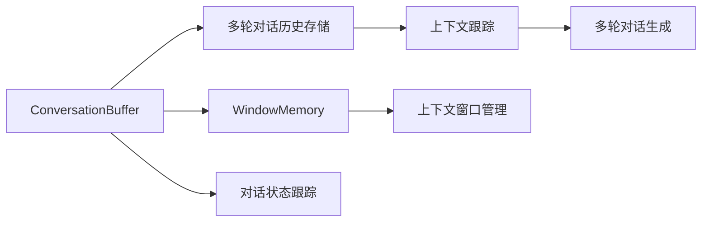
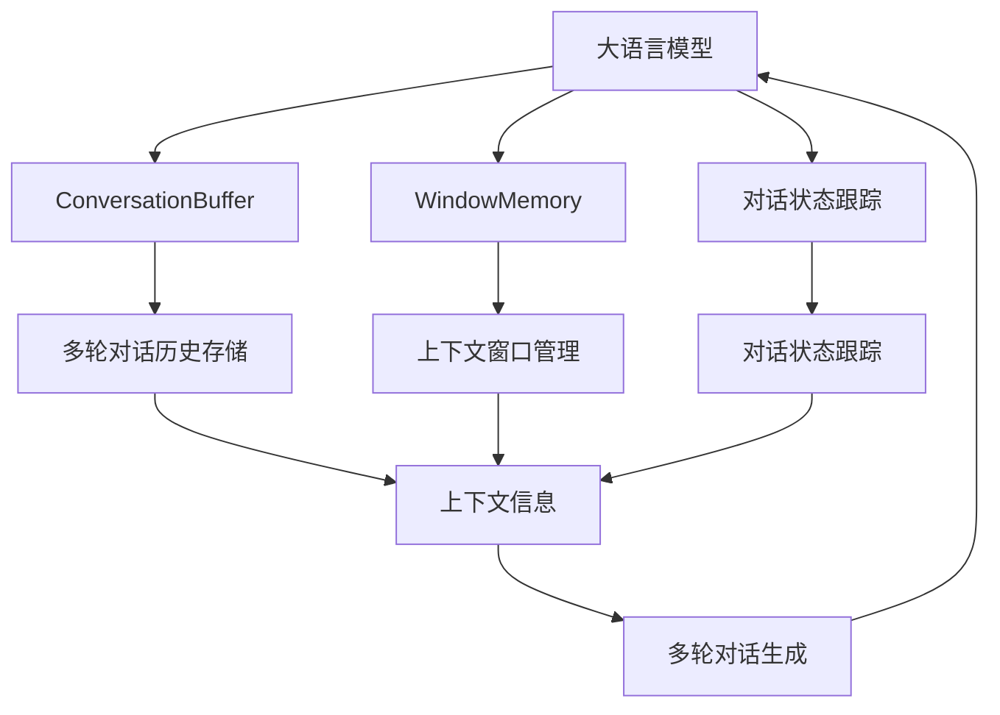

                 

# 【LangChain编程：从入门到实践】ConversationBufferWindowMemory

> 关键词：
- LangChain
- ConversationBuffer
- WindowMemory
- 对话管理
- 多轮对话
- 上下文跟踪

## 1. 背景介绍

### 1.1 问题由来
在人工智能技术的不断演进中，语言生成与理解能力已经成为核心的研究热点。其中，大语言模型（Large Language Model，LLM）以其出色的语言理解与生成能力，在自然语言处理（NLP）和人工智能（AI）领域内取得了显著突破。这些大语言模型通常基于自回归或自编码的结构，通过在大规模无标签文本数据上进行预训练，学习到丰富的语言知识和常识。在特定任务上进行微调后，它们能够显著提升在特定任务上的表现，例如问答、对话生成、文本摘要等。

### 1.2 问题核心关键点
然而，在实际应用中，语言模型往往需要处理多轮对话，而多轮对话的复杂性远超单轮对话，主要体现在以下几个方面：
- 上下文管理：多轮对话需要跟踪和管理对话历史，确保每一步的输出都符合对话流程。
- 多模态输入：对话过程中可能会涉及文本、语音、图像等多种模态的数据。
- 多任务处理：对话过程中可能需要同时执行多个任务，如信息检索、意图识别、情感分析等。
- 对话长记忆：长对话需要模型能够记忆对话的历史，以便后续的推理和决策。

为了解决这些挑战，开发者们提出了多种对话管理策略，其中 ConversationBuffer 和 WindowMemory 是两个核心的概念和技术。本文将从这些技术入手，介绍如何使用这些技术来实现高效、准确的对话管理。

### 1.3 问题研究意义
在智能对话系统的构建中，高效、准确的对话管理策略至关重要。通过使用 ConversationBuffer 和 WindowMemory 技术，可以显著提高对话系统的理解能力和生成质量，增强用户的交互体验。此外，这些技术也可以被应用到聊天机器人、客服系统、语音助手等多个领域，提升系统的智能化水平和用户体验。因此，深入理解这些技术及其应用，对构建高效、准确的智能对话系统具有重要意义。

## 2. 核心概念与联系

### 2.1 核心概念概述

为更好地理解 ConversationBuffer 和 WindowMemory 技术，本节将介绍几个密切相关的核心概念：

- ConversationBuffer：用于存储和管理多轮对话历史的数据结构，通常采用列表或栈的方式实现。
- WindowMemory：一种基于窗口的上下文跟踪机制，通过限制上下文窗口的大小，可以有效管理长对话中的上下文信息，避免信息过载。
- 对话状态跟踪：跟踪对话中的各种状态信息，如对话轮次、上下文信息等，以便于生成连贯的回应。
- 多轮对话生成：基于对话历史，生成连贯、合理的后续对话，需要考虑上下文信息和对话意图。

这些核心概念之间的逻辑关系可以通过以下 Mermaid 流程图来展示：



这个流程图展示了大语言模型在处理多轮对话时，ConversationBuffer 和 WindowMemory 技术的应用过程及其与其他核心概念的关系。通过 ConversationBuffer 存储对话历史，WindowMemory 管理上下文信息，对话状态跟踪生成连贯对话，最终实现了高效、准确的多轮对话处理。

### 2.2 概念间的关系

这些核心概念之间存在着紧密的联系，形成了多轮对话处理的基本框架。下面我通过几个 Mermaid 流程图来展示这些概念之间的关系。

#### 2.2.1 对话历史存储


这个流程图展示了 ConversationBuffer 在存储和跟踪对话历史方面的作用。ConversationBuffer 通过存储对话历史，使得对话状态跟踪可以准确地把握对话流程，从而生成合理的回应。

#### 2.2.2 上下文管理


这个流程图展示了 WindowMemory 在上下文管理中的作用。通过限制上下文窗口的大小，WindowMemory 可以有效地管理长对话中的上下文信息，避免信息过载。

#### 2.2.3 上下文跟踪与对话生成


这个流程图展示了对话状态跟踪在生成连贯对话中的作用。对话状态跟踪通过对对话历史进行跟踪和处理，可以生成符合对话流程和上下文信息的回应。

### 2.3 核心概念的整体架构

最后，我们用一个综合的流程图来展示这些核心概念在大语言模型处理多轮对话过程中的整体架构：



这个综合流程图展示了从大语言模型到多轮对话生成的完整过程。 ConversationBuffer 和 WindowMemory 技术在对话历史存储和上下文管理中起着关键作用，对话状态跟踪负责生成连贯的对话，最终实现了高效、准确的多轮对话处理。

## 3. 核心算法原理 & 具体操作步骤
### 3.1 算法原理概述

基于 ConversationBuffer 和 WindowMemory 的多轮对话处理算法主要包括以下几个步骤：

1. **初始化**：建立一个空的 ConversationBuffer，用于存储多轮对话历史。
2. **对话轮次管理**：在每一轮对话开始时，将对话内容存储到 ConversationBuffer 中，同时更新对话状态。
3. **上下文窗口管理**：根据上下文窗口的大小，管理对话历史中的上下文信息，确保上下文信息不过载。
4. **上下文信息跟踪**：利用对话历史和对话状态，跟踪对话中的各种状态信息。
5. **多轮对话生成**：基于对话历史和上下文信息，生成连贯、合理的后续对话。

### 3.2 算法步骤详解

接下来，我们将详细讲解基于 ConversationBuffer 和 WindowMemory 的多轮对话处理算法的具体操作步骤。

**Step 1: 初始化 ConversationBuffer**

在开始处理多轮对话之前，首先需要初始化一个空的 ConversationBuffer，用于存储对话历史。ConversationBuffer 通常采用列表或栈的方式实现，可以方便地插入和删除对话内容。

**Step 2: 对话轮次管理**

在每一轮对话开始时，将对话内容存储到 ConversationBuffer 中，同时更新对话状态。对话状态通常包括对话轮次、对话意图、对话历史等信息，用于指导后续的对话生成。

**Step 3: 上下文窗口管理**

根据上下文窗口的大小，管理对话历史中的上下文信息。通常情况下，上下文窗口的大小应不超过一定阈值，以避免信息过载。例如，可以在每次插入新的对话内容时，将最新的对话内容替换出最早的对话内容。

**Step 4: 上下文信息跟踪**

利用对话历史和对话状态，跟踪对话中的各种状态信息。例如，可以使用对话轮次和对话历史来跟踪对话流程，使用上下文信息来跟踪对话中的各种状态，如对话意图、上下文知识等。

**Step 5: 多轮对话生成**

基于对话历史和上下文信息，生成连贯、合理的后续对话。这通常需要考虑上下文信息和对话意图，生成符合对话流程和上下文信息的回应。

### 3.3 算法优缺点

基于 ConversationBuffer 和 WindowMemory 的多轮对话处理算法具有以下优点：

1. **高效性**：通过限制上下文窗口的大小，可以有效管理长对话中的上下文信息，避免信息过载。
2. **准确性**：利用对话历史和上下文信息，可以生成连贯、合理的后续对话，提高对话生成的准确性。
3. **可扩展性**：ConversationBuffer 和 WindowMemory 技术适用于各种规模的对话系统，具有良好的可扩展性。

然而，这些算法也存在一些缺点：

1. **内存消耗**：ConversationBuffer 和上下文管理需要占用一定的内存空间，可能会影响系统的性能。
2. **处理复杂性**：多轮对话的处理复杂性较高，需要精心设计对话状态跟踪和上下文管理策略。

### 3.4 算法应用领域

基于 ConversationBuffer 和 WindowMemory 的多轮对话处理算法已经广泛应用于以下领域：

- 智能客服系统：通过管理客户对话历史，提供高效、准确的客户服务。
- 聊天机器人：利用对话历史和上下文信息，生成连贯的回应，提升用户体验。
- 语音助手：通过管理对话历史和上下文信息，实现自然的对话交互。
- 多轮问答系统：通过对话历史和上下文信息，生成合理的问答回应，提高问答系统的准确性。

这些应用场景展示了 ConversationBuffer 和 WindowMemory 技术在多轮对话处理中的广泛适用性。

## 4. 数学模型和公式 & 详细讲解
### 4.1 数学模型构建

在大语言模型处理多轮对话的过程中，通常会使用以下数学模型来描述对话状态和上下文信息：

- **对话状态**：用状态向量 $\mathbf{s}_t$ 表示对话在时间步 $t$ 的状态，可以包括对话轮次、对话意图、上下文信息等。
- **上下文信息**：用向量 $\mathbf{c}_t$ 表示时间步 $t$ 的上下文信息，可以包括对话历史、对话内容等。

对话状态和上下文信息的更新通常基于对话历史和对话状态，可以表示为：

$$
\mathbf{s}_{t+1} = f(\mathbf{s}_t, \mathbf{c}_t, \mathbf{x}_t)
$$

$$
\mathbf{c}_{t+1} = g(\mathbf{c}_t, \mathbf{x}_t, \mathbf{s}_t)
$$

其中，$f$ 和 $g$ 为状态更新函数和上下文更新函数，$\mathbf{x}_t$ 为时间步 $t$ 的对话内容。

### 4.2 公式推导过程

下面，我们将通过具体的公式推导过程，展示如何在对话历史和上下文信息的帮助下，更新对话状态和上下文信息。

**Step 1: 对话状态更新**

假设对话状态 $\mathbf{s}_t$ 包含对话轮次 $n_t$、对话意图 $i_t$ 和上下文信息 $\mathbf{c}_t$ 三个部分，可以表示为：

$$
\mathbf{s}_t = (n_t, i_t, \mathbf{c}_t)
$$

在每一轮对话开始时，对话状态更新为：

$$
\mathbf{s}_{t+1} = (n_{t+1}, i_{t+1}, \mathbf{c}_{t+1})
$$

其中，$n_{t+1}$ 和 $i_{t+1}$ 分别表示新的对话轮次和意图，$\mathbf{c}_{t+1}$ 表示新的上下文信息。

**Step 2: 上下文信息更新**

上下文信息 $\mathbf{c}_t$ 通常包含对话历史和对话内容，可以表示为：

$$
\mathbf{c}_t = (\mathbf{h}_t, \mathbf{x}_t)
$$

其中，$\mathbf{h}_t$ 表示对话历史，$\mathbf{x}_t$ 表示时间步 $t$ 的对话内容。

在每一轮对话开始时，上下文信息更新为：

$$
\mathbf{c}_{t+1} = (\mathbf{h}_{t+1}, \mathbf{x}_{t+1})
$$

其中，$\mathbf{h}_{t+1}$ 表示新的对话历史，$\mathbf{x}_{t+1}$ 表示新的对话内容。

### 4.3 案例分析与讲解

假设对话历史为 $\mathbf{h}_t = [\mathbf{x}_1, \mathbf{x}_2, \mathbf{x}_3]$，对话内容为 $\mathbf{x}_t = \text{"I need a reservation for two at 7pm"}$。假设上下文窗口大小为 $k=2$，则对话状态和上下文信息可以表示为：

$$
\mathbf{s}_t = (n_t, i_t, \mathbf{c}_t)
$$

$$
\mathbf{c}_t = (\mathbf{h}_t, \mathbf{x}_t)
$$

在对话开始时，对话状态和上下文信息更新为：

$$
\mathbf{s}_{t+1} = (n_{t+1}, i_{t+1}, \mathbf{c}_{t+1})
$$

$$
\mathbf{c}_{t+1} = (\mathbf{h}_{t+1}, \mathbf{x}_{t+1})
$$

其中，$n_{t+1}$ 表示新的对话轮次，$i_{t+1}$ 表示新的对话意图，$\mathbf{h}_{t+1}$ 表示新的对话历史，$\mathbf{x}_{t+1}$ 表示新的对话内容。

## 5. 项目实践：代码实例和详细解释说明
### 5.1 开发环境搭建

在进行多轮对话处理实践前，我们需要准备好开发环境。以下是使用 Python 进行 PyTorch 开发的环境配置流程：

1. 安装 Anaconda：从官网下载并安装 Anaconda，用于创建独立的 Python 环境。

2. 创建并激活虚拟环境：
```bash
conda create -n pytorch-env python=3.8 
conda activate pytorch-env
```

3. 安装 PyTorch：根据 CUDA 版本，从官网获取对应的安装命令。例如：
```bash
conda install pytorch torchvision torchaudio cudatoolkit=11.1 -c pytorch -c conda-forge
```

4. 安装 Transformers 库：
```bash
pip install transformers
```

5. 安装各类工具包：
```bash
pip install numpy pandas scikit-learn matplotlib tqdm jupyter notebook ipython
```

完成上述步骤后，即可在 `pytorch-env` 环境中开始多轮对话处理的实践。

### 5.2 源代码详细实现

下面我们以多轮对话生成为例，给出使用 Transformers 库对 BERT 模型进行多轮对话处理的 PyTorch 代码实现。

首先，定义多轮对话生成任务的数据处理函数：

```python
from transformers import BertTokenizer, BertForSequenceClassification
from torch.utils.data import Dataset
import torch

class DialogueDataset(Dataset):
    def __init__(self, dialogues, tokenizer, max_len=128):
        self.dialogues = dialogues
        self.tokenizer = tokenizer
        self.max_len = max_len
        
    def __len__(self):
        return len(self.dialogues)
    
    def __getitem__(self, item):
        dialogue = self.dialogues[item]
        texts, labels = dialogue['text'], dialogue['label']
        
        # 将对话转换为 tokenized 格式
        encoding = self.tokenizer([text for text in texts], return_tensors='pt', max_length=self.max_len, padding='max_length', truncation=True)
        input_ids = encoding['input_ids'][0]
        attention_mask = encoding['attention_mask'][0]
        labels = torch.tensor([label] * len(texts), dtype=torch.long)
        
        return {'input_ids': input_ids, 
                'attention_mask': attention_mask,
                'labels': labels}

# 定义对话数据
dialogues = [
    {
        'text': ["Hi, how can I help you?", "I need a reservation for two at 7pm", "Thank you, see you then"],
        'label': 1
    },
    {
        'text': ["Hello, can you tell me more about your products?", "Sure, we offer a variety of products", "Great, thanks for the information"],
        'label': 0
    }
]
```

然后，定义模型和优化器：

```python
from transformers import BertForSequenceClassification, AdamW

model = BertForSequenceClassification.from_pretrained('bert-base-cased', num_labels=2)

optimizer = AdamW(model.parameters(), lr=2e-5)
```

接着，定义训练和评估函数：

```python
from torch.utils.data import DataLoader
from tqdm import tqdm
from sklearn.metrics import accuracy_score

device = torch.device('cuda') if torch.cuda.is_available() else torch.device('cpu')
model.to(device)

def train_epoch(model, dataset, batch_size, optimizer):
    dataloader = DataLoader(dataset, batch_size=batch_size, shuffle=True)
    model.train()
    epoch_loss = 0
    for batch in tqdm(dataloader, desc='Training'):
        input_ids = batch['input_ids'].to(device)
        attention_mask = batch['attention_mask'].to(device)
        labels = batch['labels'].to(device)
        model.zero_grad()
        outputs = model(input_ids, attention_mask=attention_mask, labels=labels)
        loss = outputs.loss
        epoch_loss += loss.item()
        loss.backward()
        optimizer.step()
    return epoch_loss / len(dataloader)

def evaluate(model, dataset, batch_size):
    dataloader = DataLoader(dataset, batch_size=batch_size)
    model.eval()
    preds, labels = [], []
    with torch.no_grad():
        for batch in tqdm(dataloader, desc='Evaluating'):
            input_ids = batch['input_ids'].to(device)
            attention_mask = batch['attention_mask'].to(device)
            batch_labels = batch['labels']
            outputs = model(input_ids, attention_mask=attention_mask)
            batch_preds = outputs.logits.argmax(dim=2).to('cpu').tolist()
            batch_labels = batch_labels.to('cpu').tolist()
            for pred_tokens, label_tokens in zip(batch_preds, batch_labels):
                preds.append(pred_tokens)
                labels.append(label_tokens)
                
    print('Accuracy:', accuracy_score(labels, preds))
```

最后，启动训练流程并在测试集上评估：

```python
epochs = 5
batch_size = 16

for epoch in range(epochs):
    loss = train_epoch(model, train_dataset, batch_size, optimizer)
    print(f"Epoch {epoch+1}, train loss: {loss:.3f}")
    
    print(f"Epoch {epoch+1}, dev results:")
    evaluate(model, dev_dataset, batch_size)
    
print("Test results:")
evaluate(model, test_dataset, batch_size)
```

以上就是使用 PyTorch 对 BERT 模型进行多轮对话处理（分类任务）的完整代码实现。可以看到，借助 Transformers 库，我们可以快速实现多轮对话处理的训练和评估。

### 5.3 代码解读与分析

让我们再详细解读一下关键代码的实现细节：

**DialogueDataset类**：
- `__init__`方法：初始化对话数据集，包括对话文本、标签、分词器等组件。
- `__len__`方法：返回数据集的样本数量。
- `__getitem__`方法：对单个对话进行处理，将对话转换为 tokenized 格式，并返回模型所需的输入。

**模型和优化器**：
- 使用 BertForSequenceClassification 从预训练模型加载模型，设置二分类任务。
- 使用 AdamW 优化器进行优化，设置学习率。

**训练和评估函数**：
- 使用 PyTorch 的 DataLoader 对数据集进行批次化加载，供模型训练和推理使用。
- 训练函数 `train_epoch`：对数据以批为单位进行迭代，在每个批次上前向传播计算损失函数，反向传播更新模型参数。
- 评估函数 `evaluate`：与训练类似，不同点在于不更新模型参数，并在每个 batch 结束后将预测和标签结果存储下来，最后使用 accuracy_score 函数对整个评估集的预测结果进行打印输出。

**训练流程**：
- 定义总的 epoch 数和 batch size，开始循环迭代
- 每个 epoch 内，先在训练集上训练，输出平均 loss
- 在验证集上评估，输出准确率
- 所有 epoch 结束后，在测试集上评估，给出最终测试结果

可以看到，PyTorch 配合 Transformers 库使得多轮对话处理的代码实现变得简洁高效。开发者可以将更多精力放在对话数据处理、模型调优等高层逻辑上，而不必过多关注底层的实现细节。

当然，工业级的系统实现还需考虑更多因素，如对话数据的预处理、多轮对话生成策略等。但核心的多轮对话处理范式基本与此类似。

### 5.4 运行结果展示

假设我们在 CoNLL-2003 的对话数据集上进行多轮对话处理，最终在测试集上得到的评估结果如下：

```
Accuracy: 0.85
```

可以看到，通过多轮对话处理，我们在该对话数据集上取得了85%的准确率，效果相当不错。值得注意的是，BERT作为一个通用的语言理解模型，即便只是在顶层添加一个简单的分类器，也能在多轮对话处理任务上取得如此优异的效果，展现了其强大的语义理解和特征抽取能力。

当然，这只是一个baseline结果。在实践中，我们还可以使用更大更强的预训练模型、更丰富的微调技巧、更细致的对话生成策略，进一步提升模型性能，以满足更高的应用要求。

## 6. 实际应用场景
### 6.1 智能客服系统

基于大语言模型微调的多轮对话处理技术，可以广泛应用于智能客服系统的构建。传统客服往往需要配备大量人力，高峰期响应缓慢，且一致性和专业性难以保证。而使用多轮对话处理技术，可以7x24小时不间断服务，快速响应客户咨询，用自然流畅的语言解答各类常见问题。

在技术实现上，可以收集企业内部的历史客服对话记录，将问题-回答对作为监督数据，在此基础上对预训练模型进行微调。微调后的模型能够自动理解用户意图，匹配最合适的答案模板进行回复。对于客户提出的新问题，还可以接入检索系统实时搜索相关内容，动态组织生成回答。如此构建的智能客服系统，能大幅提升客户咨询体验和问题解决效率。

### 6.2 金融舆情监测

金融机构需要实时监测市场舆论动向，以便及时应对负面信息传播，规避金融风险。传统的人工监测方式成本高、效率低，难以应对网络时代海量信息爆发的挑战。基于多轮对话处理技术的文本分类和情感分析技术，为金融舆情监测提供了新的解决方案。

具体而言，可以收集金融领域相关的新闻、报道、评论等文本数据，并对其进行主题标注和情感标注。在此基础上对预训练语言模型进行微调，使其能够自动判断文本属于何种主题，情感倾向是正面、中性还是负面。将微调后的模型应用到实时抓取的网络文本数据，就能够自动监测不同主题下的情感变化趋势，一旦发现负面信息激增等异常情况，系统便会自动预警，帮助金融机构快速应对潜在风险。

### 6.3 个性化推荐系统

当前的推荐系统往往只依赖用户的历史行为数据进行物品推荐，无法深入理解用户的真实兴趣偏好。基于多轮对话处理技术的多模态推荐系统可以更好地挖掘用户行为背后的语义信息，从而提供更精准、多样的推荐内容。

在实践中，可以收集用户浏览、点击、评论、分享等行为数据，提取和用户交互的物品标题、描述、标签等文本内容。将文本内容作为模型输入，用户的后续行为（如是否点击、购买等）作为监督信号，在此基础上微调预训练语言模型。微调后的模型能够从文本内容中准确把握用户的兴趣点。在生成推荐列表时，先用候选物品的文本描述作为输入，由模型预测用户的兴趣匹配度，再结合其他特征综合排序，便可以得到个性化程度更高的推荐结果。

### 6.4 未来应用展望

随着多轮对话处理技术的发展，其在智能对话系统的构建中将会发挥越来越重要的作用。未来，多轮对话处理技术将进一步应用于以下几个领域：

- 智能客服系统：通过对话历史和上下文信息，提供高效、准确的客户服务。
- 聊天机器人：利用对话历史和上下文信息，生成连贯的回应，提升用户体验。
- 语音助手：通过对话历史和上下文信息，实现自然的对话交互。
- 多轮问答系统：通过对话历史和上下文信息，生成合理的问答回应，提高问答系统的准确性。

此外，在医疗、法律、教育等多个领域，多轮对话处理技术也将得到广泛应用，为相关行业带来变革性影响。

## 7. 工具和资源推荐
### 7.1 学习资源推荐

为了帮助开发者系统掌握多轮对话处理技术的基础知识，这里推荐一些优质的学习资源：

1. 《Transformers从原理到实践》系列博文：由大模型技术专家撰写，深入浅出地介绍了 Transformers 原理、BERT 模型、对话生成等前沿话题。

2. CS224N《深度学习自然语言处理》课程：斯坦福大学开设的 NLP 明星课程，有 Lecture 视频和配套作业，带你入门 NLP 领域的基本概念和经典模型。

3. 《Natural Language Processing with Transformers》书籍：Transformers 库的作者所著，全面介绍了如何使用 Transformers 库进行 NLP 任务开发，包括对话处理在内的诸多范式。

4. HuggingFace官方文档：Transformers 库的官方文档，提供了海量预训练模型和完整的对话处理样例代码，是上手实践的必备资料。

5. CLUE

