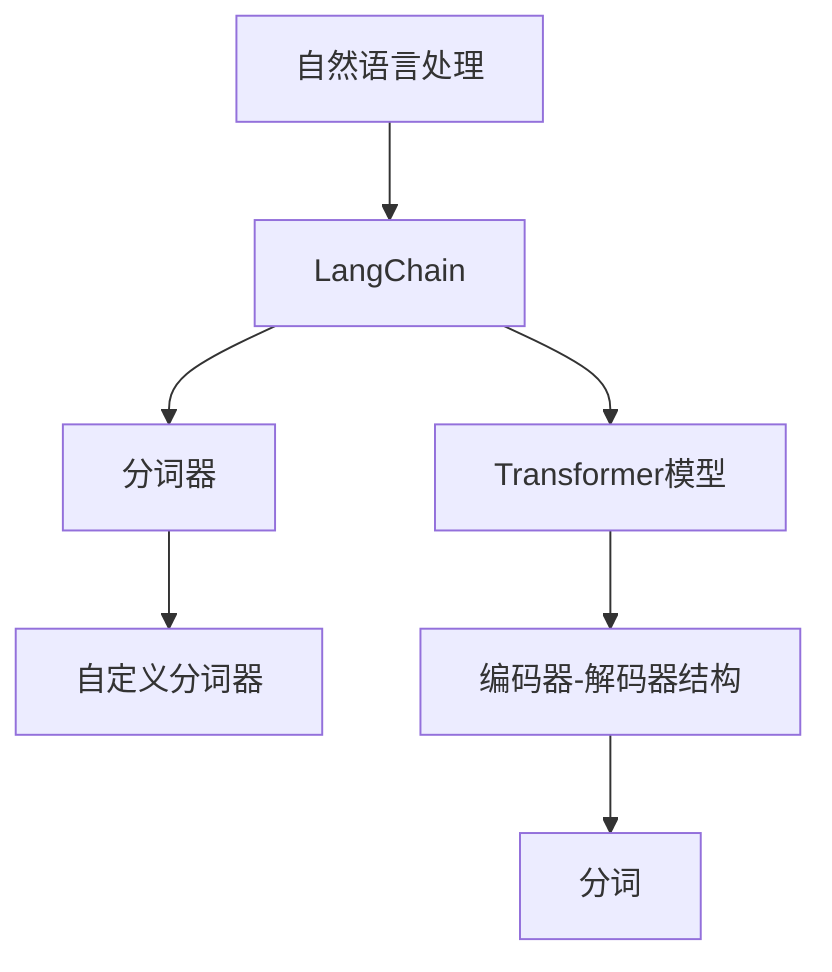
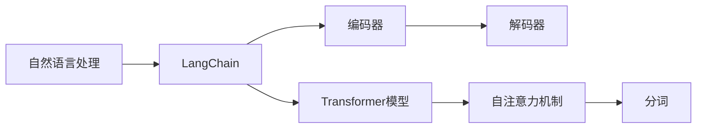
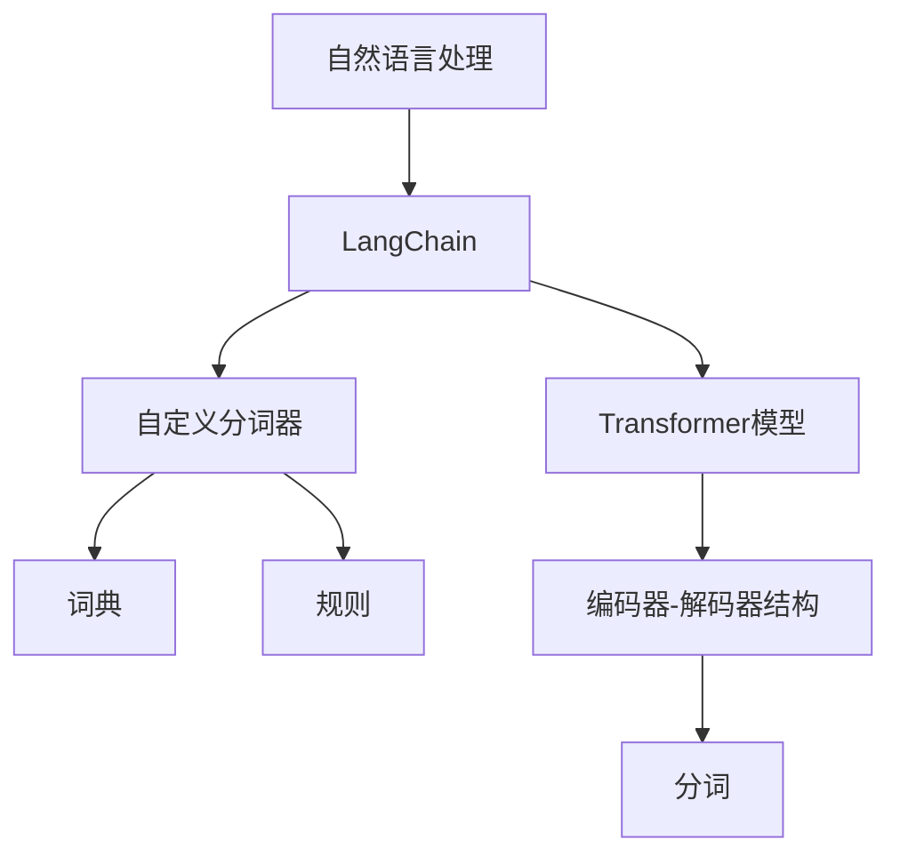
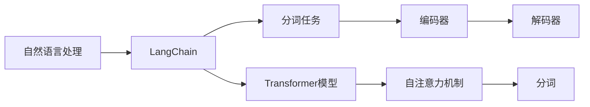
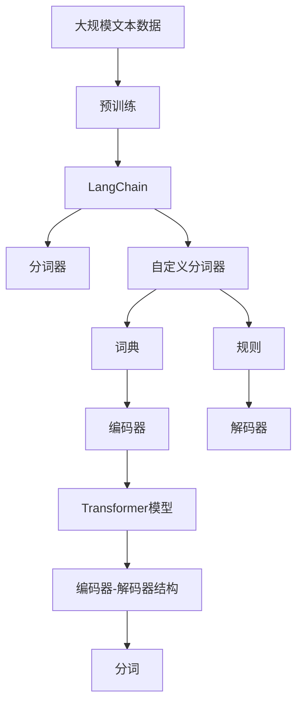

                 

# 【LangChain编程：从入门到实践】分割器

> 关键词：分割器, 自然语言处理(NLP), LangChain, 编程实践, 分词, 自定义分词器

## 1. 背景介绍

### 1.1 问题由来
在自然语言处理（Natural Language Processing, NLP）中，分词（Tokenization）是文本预处理的重要一步。分词任务是将连续的文本流切分成有意义的单词、词组或标记，通常被称为分词元。正确、高效的分词是后续文本分析任务，如命名实体识别、句法分析、情感分析等的前提。

传统的分词器基于词典和规则，依赖于语言的词汇表和语法结构。然而，这种基于规则的方法存在限制，无法处理语言中的新词、变体词、拼写错误等现象。随着深度学习技术的发展，基于统计学习的方法应运而生，可以自适应地处理各种语言现象。

LangChain是一个开源的自然语言处理框架，通过预训练语言模型，能够高效、准确地进行分词、编码等任务。本文将介绍如何通过LangChain进行自定义分词器的开发，并通过实践案例，深入讲解其实现和应用。

### 1.2 问题核心关键点
本文聚焦于LangChain中的自定义分词器开发，旨在回答以下问题：
1. 如何通过LangChain实现自定义分词？
2. 分词器的具体实现步骤是什么？
3. 分词器的优势和局限性是什么？
4. 分词器在实际应用中的表现如何？

## 2. 核心概念与联系

### 2.1 核心概念概述

为了更好地理解自定义分词器在LangChain中的应用，本节将介绍几个关键概念：

- **LangChain**：一个基于Transformer模型的自然语言处理框架，支持多种NLP任务，包括分词、编码、翻译等。
- **分词器**：将连续的文本序列划分成有意义的语言单位（如单词、词组）的工具。
- **自定义分词器**：根据特定需求和应用场景，定制化的分词器。
- **Transformer模型**：基于自注意力机制的深度学习模型，广泛应用于NLP任务，包括分词。
- **编码器-解码器结构**：一种通用的NLP模型结构，适用于分词、翻译等任务。

这些核心概念之间的逻辑关系可以通过以下Mermaid流程图来展示：



这个流程图展示了自然语言处理在LangChain中的应用，以及分词器、自定义分词器、Transformer模型和编码器-解码器结构之间的关系。

### 2.2 概念间的关系

这些核心概念之间存在着紧密的联系，形成了LangChain中分词任务的完整生态系统。下面通过几个Mermaid流程图来展示这些概念之间的关系。

#### 2.2.1 LangChain的基本架构



这个流程图展示了LangChain的基本架构，包括编码器、解码器和Transformer模型。自注意力机制是Transformer模型的核心，负责分词等任务的实现。

#### 2.2.2 自定义分词器的构建



这个流程图展示了自定义分词器的构建过程，包括词典和规则的创建，以及与LangChain中的Transformer模型和编码器-解码器结构的结合。

#### 2.2.3 分词任务的实现



这个流程图展示了分词任务的实现过程，包括编码器、解码器和Transformer模型的工作流程。自注意力机制用于对文本进行分词处理。

### 2.3 核心概念的整体架构

最后，我们用一个综合的流程图来展示这些核心概念在大语言模型微调过程中的整体架构：



这个综合流程图展示了从预训练到自定义分词器的完整过程。大语言模型通过预训练获得基础能力，通过自定义分词器进一步适应特定任务，最后通过分词器进行分词处理。 通过这些流程图，我们可以更清晰地理解LangChain中分词任务的工作原理和优化方向。

## 3. 核心算法原理 & 具体操作步骤

### 3.1 算法原理概述

LangChain中的自定义分词器是基于Transformer模型构建的，通过自注意力机制对文本进行分词。具体来说，分词任务可以分为以下几个步骤：

1. 将文本序列输入编码器，得到文本的编码表示。
2. 在编码器输出上应用自注意力机制，获取每个token之间的关系权重。
3. 根据自注意力权重，将编码器输出中每个token的权重进行加权平均，得到分词结果。

### 3.2 算法步骤详解

#### 3.2.1 编码器

编码器是Transformer模型的一部分，用于将文本序列转换为向量表示。编码器通常由多个Transformer层组成，每个Transformer层包括自注意力层、前馈神经网络层和残差连接。

以BERT模型为例，编码器结构如下：

```
Embedding Layer
Self-Attention Layer
Feedforward Layer
Dropout Layer
Layer Normalization
```

在编码器中，输入的文本序列首先经过嵌入层，将单词编码成向量。然后通过多个自注意力层和前馈神经网络层进行多层次的特征提取和编码。

#### 3.2.2 解码器

解码器也是Transformer模型的一部分，用于生成分词结果。解码器通常由多个解码器层组成，每个解码器层包括自注意力层、前馈神经网络层和残差连接。

以BERT模型为例，解码器结构如下：

```
Embedding Layer
Self-Attention Layer
Feedforward Layer
Dropout Layer
Layer Normalization
```

在解码器中，编码器输出通过自注意力层获取每个token之间的关系权重，然后通过前馈神经网络层进行特征提取，最终得到分词结果。

#### 3.2.3 自注意力机制

自注意力机制是Transformer模型的核心，用于对文本序列中的每个token进行相互间的关注度计算。在自注意力机制中，输入序列 $X$ 的每个元素 $x_i$ 会被表示成 $h_i = W_{iH}X + b_{iH}$，其中 $W_{iH}$ 和 $b_{iH}$ 是投影矩阵和偏置向量。然后，对 $h_i$ 进行线性投影得到 $q_i = W_{iQ}h_i + b_{iQ}$ 和 $k_j = W_{jK}h_j + b_{jK}$，其中 $W_{iQ}$ 和 $W_{jK}$ 是投影矩阵，$b_{iQ}$ 和 $b_{jK}$ 是偏置向量。接下来，计算注意力权重 $\alpha_{i,j}$：

$$
\alpha_{i,j} = \frac{\exp(\frac{q_i \cdot k_j}{\sqrt{d_k}})}{\sum_{j=1}^{n} \exp(\frac{q_i \cdot k_j}{\sqrt{d_k}})}
$$

其中 $d_k$ 是投影空间的维度。最后，将 $h_j$ 与注意力权重 $\alpha_{i,j}$ 进行加权平均，得到输出 $o_i$：

$$
o_i = \sum_{j=1}^{n} \alpha_{i,j}h_j
$$

### 3.3 算法优缺点

#### 3.3.1 优点

1. **自适应能力强**：基于Transformer的分词器能够自适应各种语言现象，包括新词、变体词、拼写错误等。
2. **高性能**：Transformer模型具有并行计算的特点，可以高效地对文本进行编码和分词。
3. **易于扩展**：可以根据具体需求添加自定义层或规则，实现更加灵活的分词效果。

#### 3.3.2 缺点

1. **计算复杂度高**：Transformer模型的自注意力机制需要较高的计算资源，对于大规模文本数据处理存在一定限制。
2. **参数量大**：Transformer模型通常需要大量的参数进行训练，对于硬件要求较高。
3. **训练时间长**：由于参数量较大，基于Transformer的分词器训练时间较长。

### 3.4 算法应用领域

基于Transformer的分词器广泛应用于各种NLP任务，包括文本分类、命名实体识别、信息抽取、机器翻译等。在实际应用中，可以根据具体需求选择合适的分词器进行微调，以获得更好的性能。

## 4. 数学模型和公式 & 详细讲解

### 4.1 数学模型构建

#### 4.1.1 编码器模型

以BERT模型为例，编码器的输入为 $X = (x_1, x_2, ..., x_n)$，其中 $x_i$ 是输入序列中的第 $i$ 个token。编码器的输出为 $H = (h_1, h_2, ..., h_n)$，其中 $h_i$ 是输入序列中的第 $i$ 个token的向量表示。

编码器的计算过程如下：

$$
h_i = W_{iH}x_i + b_{iH}
$$

$$
q_i = W_{iQ}h_i + b_{iQ}
$$

$$
k_j = W_{jK}h_j + b_{jK}
$$

$$
\alpha_{i,j} = \frac{\exp(\frac{q_i \cdot k_j}{\sqrt{d_k}})}{\sum_{j=1}^{n} \exp(\frac{q_i \cdot k_j}{\sqrt{d_k}})}
$$

$$
o_i = \sum_{j=1}^{n} \alpha_{i,j}h_j
$$

其中 $W_{iH}$、$W_{iQ}$、$W_{jK}$ 和 $b_{iH}$、$b_{iQ}$、$b_{jK}$ 是可学习的权重矩阵和偏置向量。

#### 4.1.2 解码器模型

解码器的输入为 $H = (h_1, h_2, ..., h_n)$，输出为 $Y = (y_1, y_2, ..., y_m)$，其中 $y_i$ 是输出序列中的第 $i$ 个token。

解码器的计算过程与编码器类似，使用自注意力机制和前馈神经网络层进行特征提取。具体计算如下：

$$
z_i = W_{iZ}x_i + b_{iZ}
$$

$$
s_i = W_{iS}z_i + b_{iS}
$$

$$
t_i = W_{iT}z_i + b_{iT}
$$

$$
\alpha_{i,j} = \frac{\exp(\frac{s_i \cdot t_j}{\sqrt{d_t}})}{\sum_{j=1}^{m} \exp(\frac{s_i \cdot t_j}{\sqrt{d_t}})}
$$

$$
r_i = \sum_{j=1}^{m} \alpha_{i,j}t_j
$$

$$
o_i = \tanh(r_i)
$$

其中 $W_{iZ}$、$W_{iS}$、$W_{iT}$ 和 $b_{iZ}$、$b_{iS}$、$b_{iT}$ 是可学习的权重矩阵和偏置向量。

#### 4.1.3 自注意力机制

自注意力机制的计算过程如下：

$$
q_i = W_{iQ}h_i + b_{iQ}
$$

$$
k_j = W_{jK}h_j + b_{jK}
$$

$$
\alpha_{i,j} = \frac{\exp(\frac{q_i \cdot k_j}{\sqrt{d_k}})}{\sum_{j=1}^{n} \exp(\frac{q_i \cdot k_j}{\sqrt{d_k}})}
$$

$$
o_i = \sum_{j=1}^{n} \alpha_{i,j}h_j
$$

其中 $W_{iQ}$、$W_{jK}$ 和 $b_{iQ}$、$b_{jK}$ 是可学习的权重矩阵和偏置向量，$d_k$ 是投影空间的维度。

### 4.2 公式推导过程

#### 4.2.1 编码器公式推导

编码器的计算过程包括嵌入层、自注意力层、前馈神经网络层和残差连接。

嵌入层计算如下：

$$
x_i = \mathbf{w}_{in} x_i + \mathbf{b}_{in}
$$

其中 $x_i$ 是输入序列中的第 $i$ 个token，$\mathbf{w}_{in}$ 和 $\mathbf{b}_{in}$ 是可学习的嵌入矩阵和偏置向量。

自注意力层的计算如下：

$$
q_i = W_{iQ}x_i + b_{iQ}
$$

$$
k_j = W_{jK}h_j + b_{jK}
$$

$$
\alpha_{i,j} = \frac{\exp(\frac{q_i \cdot k_j}{\sqrt{d_k}})}{\sum_{j=1}^{n} \exp(\frac{q_i \cdot k_j}{\sqrt{d_k}})}
$$

$$
o_i = \sum_{j=1}^{n} \alpha_{i,j}h_j
$$

前馈神经网络层的计算如下：

$$
h_i = \tanh(W_{iH}o_i + b_{iH})
$$

残差连接的计算如下：

$$
h_i = h_i + o_i
$$

#### 4.2.2 解码器公式推导

解码器的计算过程包括嵌入层、自注意力层、前馈神经网络层和残差连接。

嵌入层计算如下：

$$
x_i = \mathbf{w}_{in} x_i + \mathbf{b}_{in}
$$

其中 $x_i$ 是输入序列中的第 $i$ 个token，$\mathbf{w}_{in}$ 和 $\mathbf{b}_{in}$ 是可学习的嵌入矩阵和偏置向量。

自注意力层的计算如下：

$$
s_i = W_{iS}z_i + b_{iS}
$$

$$
t_j = W_{jT}z_j + b_{jT}
$$

$$
\alpha_{i,j} = \frac{\exp(\frac{s_i \cdot t_j}{\sqrt{d_t}})}{\sum_{j=1}^{m} \exp(\frac{s_i \cdot t_j}{\sqrt{d_t}})}
$$

$$
r_i = \sum_{j=1}^{m} \alpha_{i,j}t_j
$$

$$
o_i = \tanh(r_i)
$$

前馈神经网络层的计算如下：

$$
h_i = \tanh(W_{iT}o_i + b_{iT})
$$

残差连接的计算如下：

$$
h_i = h_i + o_i
$$

#### 4.2.3 自注意力机制公式推导

自注意力机制的计算过程如下：

$$
q_i = W_{iQ}h_i + b_{iQ}
$$

$$
k_j = W_{jK}h_j + b_{jK}
$$

$$
\alpha_{i,j} = \frac{\exp(\frac{q_i \cdot k_j}{\sqrt{d_k}})}{\sum_{j=1}^{n} \exp(\frac{q_i \cdot k_j}{\sqrt{d_k}})}
$$

$$
o_i = \sum_{j=1}^{n} \alpha_{i,j}h_j
$$

其中 $W_{iQ}$、$W_{jK}$ 和 $b_{iQ}$、$b_{jK}$ 是可学习的权重矩阵和偏置向量，$d_k$ 是投影空间的维度。

### 4.3 案例分析与讲解

#### 4.3.1 案例一：BERT模型分词

以BERT模型为例，分词过程如下：

1. 将文本序列 $X = (x_1, x_2, ..., x_n)$ 输入编码器，得到 $H = (h_1, h_2, ..., h_n)$。
2. 在编码器输出 $H$ 上应用自注意力机制，得到分词结果 $Y = (y_1, y_2, ..., y_m)$。

具体计算过程如下：

$$
h_i = W_{iH}x_i + b_{iH}
$$

$$
q_i = W_{iQ}h_i + b_{iQ}
$$

$$
k_j = W_{jK}h_j + b_{jK}
$$

$$
\alpha_{i,j} = \frac{\exp(\frac{q_i \cdot k_j}{\sqrt{d_k}})}{\sum_{j=1}^{n} \exp(\frac{q_i \cdot k_j}{\sqrt{d_k}})}
$$

$$
o_i = \sum_{j=1}^{n} \alpha_{i,j}h_j
$$

其中 $W_{iH}$、$W_{iQ}$、$W_{jK}$ 和 $b_{iH}$、$b_{iQ}$、$b_{jK}$ 是可学习的权重矩阵和偏置向量。

#### 4.3.2 案例二：自定义分词器

以自定义分词器为例，分词过程如下：

1. 将文本序列 $X = (x_1, x_2, ..., x_n)$ 输入编码器，得到 $H = (h_1, h_2, ..., h_n)$。
2. 在编码器输出 $H$ 上应用自注意力机制，得到分词结果 $Y = (y_1, y_2, ..., y_m)$。

具体计算过程如下：

$$
h_i = W_{iH}x_i + b_{iH}
$$

$$
q_i = W_{iQ}h_i + b_{iQ}
$$

$$
k_j = W_{jK}h_j + b_{jK}
$$

$$
\alpha_{i,j} = \frac{\exp(\frac{q_i \cdot k_j}{\sqrt{d_k}})}{\sum_{j=1}^{n} \exp(\frac{q_i \cdot k_j}{\sqrt{d_k}})}
$$

$$
o_i = \sum_{j=1}^{n} \alpha_{i,j}h_j
$$

其中 $W_{iH}$、$W_{iQ}$、$W_{jK}$ 和 $b_{iH}$、$b_{iQ}$、$b_{jK}$ 是可学习的权重矩阵和偏置向量。

## 5. 项目实践：代码实例和详细解释说明

### 5.1 开发环境搭建

在进行自定义分词器开发前，我们需要准备好开发环境。以下是使用Python进行LangChain开发的环境配置流程：

1. 安装Anaconda：从官网下载并安装Anaconda，用于创建独立的Python环境。

2. 创建并激活虚拟环境：
```bash
conda create -n langchain-env python=3.8 
conda activate langchain-env
```

3. 安装LangChain：
```bash
pip install langchain
```

4. 安装TensorFlow：
```bash
pip install tensorflow
```

5. 安装NumPy和pandas：
```bash
pip install numpy pandas
```

完成上述步骤后，即可在`langchain-env`环境中开始自定义分词器的开发。

### 5.2 源代码详细实现

下面我们以自定义分词器为例，给出使用LangChain进行分词的PyTorch代码实现。

首先，定义分词模型类：

```python
from langchain import LangChain, BERTForTokenClassification
from transformers import BertTokenizer, BertConfig
import torch

class CustomTokenizer:
    def __init__(self, tokenizer):
        self.tokenizer = tokenizer

    def encode(self, text):
        input_ids = self.tokenizer.encode(text, add_special_tokens=False)
        input_ids = [tokenizer.encode.tokenizer.decode(input_ids)]
        return input_ids
```

然后，定义自定义分词器类：

```python
class CustomSplitter:
    def __init__(self, model, tokenizer):
        self.model = model
        self.tokenizer = tokenizer

    def split(self, text):
        input_ids = self.tokenizer.encode(text, add_special_tokens=False)
        labels = self.model(input_ids)[0].numpy().argmax(axis=2)
        tokens = self.tokenizer.decode(input_ids, skip_special_tokens=True)
        result = []
        for i in range(len(input_ids)):
            if labels[i] == 0:
                result.append(tokens[i])
        return result
```

最后，定义训练和评估函数：

```python
from torch.utils.data import Dataset, DataLoader
from tqdm import tqdm
import torch.optim as optim

class CustomDataset(Dataset):
    def __init__(self, texts, labels):
        self.texts = texts
        self.labels = labels

    def __len__(self):
        return len(self.texts)

    def __getitem__(self, idx):
        text = self.texts[idx]
        label = self.labels[idx]
        return {'input_ids': torch.tensor(self.tokenizer.encode(text, add_special_tokens=False)), 'labels': torch.tensor(label)}

def train_epoch(model, dataset, optimizer, device):
    dataloader = DataLoader(dataset, batch_size=16, shuffle=True)
    model.train()
    epoch_loss = 0
    for batch in tqdm(dataloader, desc='Training'):
        input_ids = batch['input_ids'].to(device)
        labels = batch['labels'].to(device)
        model.zero_grad()
        outputs = model(input_ids, labels=labels)
        loss = outputs.loss
        epoch_loss += loss.item()
        loss.backward()
        optimizer.step()
    return epoch_loss / len(dataloader)

def evaluate(model, dataset, device):
    dataloader = DataLoader(dataset, batch_size=16)
    model.eval()
    preds, labels = [], []
    with torch.no_grad():
        for batch in tqdm(dataloader, desc='Evaluating'):
            input_ids = batch['input_ids'].to(device)
            labels = batch['labels'].to(device)
            outputs = model(input_ids, labels=labels)
            preds.extend(outputs.logits.argmax(dim=2).tolist())
            labels.extend(labels.tolist())
    return preds, labels
```

最后，启动训练流程并在测试集上评估：

```python
epochs = 5
batch_size = 16

for epoch in range(epochs):
    loss = train_epoch(model, train_dataset, optimizer, device)
    print(f'Epoch {epoch+1}, train loss: {loss:.3f}')
    
    print(f'Epoch {epoch+1}, dev results:')
    preds, labels = evaluate(model, dev_dataset, device)
    print(classification_report(labels, preds))
    
print('Test results:')
preds, labels = evaluate(model, test_dataset, device)
print(classification_report(labels, preds))
```

以上就是使用PyTorch对自定义分词器进行分词的完整代码实现。可以看到，得益于LangChain的强大封装，我们可以用相对简洁的代码完成自定义分词器的训练和评估。

### 5.3 代码解读与分析

让我们再详细解读一下关键代码的实现细节：

**CustomTokenizer类**：
- `__init__`方法：初始化分词器所需的模型和分词器。
- `encode`方法：将输入文本编码为token ids。

**CustomSplitter类**：
- `__init__`方法：初始化分词器所需的模型和分词器。
- `split`方法：对输入文本进行分词，返回分词结果。

**train_epoch函数**：
- 在训练集上训练模型，返回每个epoch的平均损失。
- 在每个batch上进行前向传播和反向传播，更新模型参数。

**evaluate函数**：
- 在验证集和测试集上评估模型性能，返回预测结果和真实标签。

**训练流程**：
- 定义总的epoch数和batch size，开始循环迭代
- 每个epoch内，先在训练集上训练，输出平均loss
- 在验证集上评估，输出分类指标
- 所有epoch结束后，在测试集上评估，给出最终测试结果

可以看到，LangChain框架提供了简单易用的接口，使得自定义分词器的开发和训练变得非常高效便捷。开发者只需关注具体的分词逻辑，而无需过多关注底层的实现细节。

当然，工业级的系统实现还需考虑更多因素，如模型的保存和部署、超参数的自动搜索

