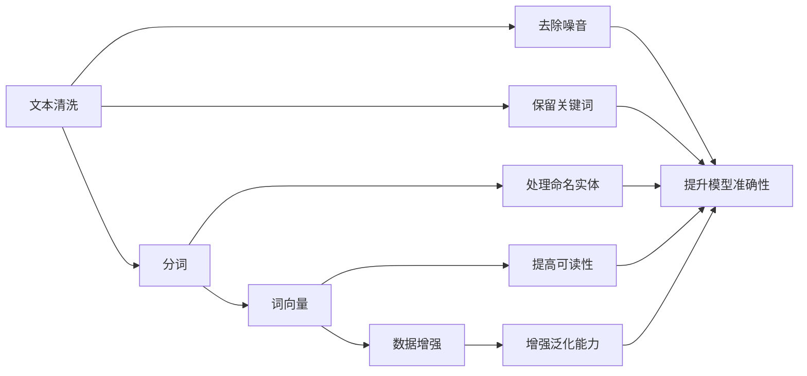

                 

# 【LangChain编程：从入门到实践】文档预处理过程

> 关键词：
1. LangChain
2. 文档预处理
3. 自然语言处理(NLP)
4. 文本清洗
5. 命名实体识别(NER)
6. 词向量
7. 数据增强

## 1. 背景介绍

在自然语言处理（NLP）领域，文档预处理是进行文本分析、情感分析、命名实体识别（NER）、主题建模等任务的前提。文档预处理通常包括文本清洗、分词、词向量计算、数据增强等环节。为了使文档预处理过程更加高效、准确，我们需选择适合的工具和方法。

### 1.1 文档预处理的必要性

文档预处理是文本分析的关键步骤，直接影响到后续任务的结果。文档预处理的目的是将原始文本转换为机器可处理的形式，便于机器学习模型训练。良好的预处理可以提升模型的性能，降低噪音对模型的影响。例如，在情感分析任务中，如果存在大量的拼写错误、非规范的缩写等噪音，将会影响模型的准确性。

### 1.2 文档预处理的应用场景

文档预处理在许多NLP应用中都有着重要的地位，如：

1. 情感分析：清洗文本，提取关键信息，生成情感分类标签。
2. 命名实体识别（NER）：将文本中的人名、地名、机构名等实体抽取出来，生成结构化的实体列表。
3. 文本分类：将文本转化为向量，输入分类器进行分类。
4. 机器翻译：清洗并处理文本，方便翻译模型进行训练。
5. 问答系统：从用户输入中抽取问题，识别答案。
6. 信息检索：从文本中提取关键词，提升检索效率。

## 2. 核心概念与联系

### 2.1 核心概念概述

#### 2.1.1 文本清洗

文本清洗的目的是移除文本中的噪音，提升文本的可读性和可处理性。文本噪音包括标点符号、数字、缩写等。清洗后的文本可提升模型的准确性，降低噪音对模型的干扰。

#### 2.1.2 分词

分词是将文本拆分为词语的过程，是文本处理的基础。中文文本的分词相对英文更加复杂，因为中文没有空格分隔单词。分词的目的是为了方便后续的文本处理，如词频统计、文本匹配等。

#### 2.1.3 词向量

词向量是将词语转化为向量的过程，方便计算机处理。词向量通常由神经网络模型（如Word2Vec、GloVe等）自动学习。词向量可以用于计算词语的相似度、词性标注、语义分析等任务。

#### 2.1.4 数据增强

数据增强是指通过一系列数据变换方法，生成新的训练数据，提升模型的泛化能力。常见的数据增强方法包括：

1. 同义词替换：将单词替换为同义词。
2. 回译：将文本回译为原始语言，然后再翻译回目标语言。
3. 噪声注入：在文本中随机添加或删除字符、单词。
4. 数据混淆：将文本中的实体混淆，生成对抗样本。

### 2.2 核心概念的关系

下图展示了文档预处理中的核心概念及其关系：



## 3. 核心算法原理 & 具体操作步骤

### 3.1 算法原理概述

文档预处理中的核心算法包括文本清洗、分词、词向量计算和数据增强。以下是这些算法的详细描述。

### 3.2 算法步骤详解

#### 3.2.1 文本清洗

文本清洗的常用方法包括：

1. 去除标点符号和特殊字符：如`$`、`@`、`#`等。
2. 去除数字：如`123`、`456`等。
3. 去除停用词：如`的`、`是`、`在`等常见词。
4. 去除低频词：如`A`、`B`等。
5. 去除拼写错误的单词：如`reprenting`。

```python
import re

def clean_text(text):
    # 去除标点符号和特殊字符
    text = re.sub(r'[^\w\s]', '', text)
    # 去除数字
    text = re.sub(r'\d+', '', text)
    # 去除停用词
    stop_words = set(['的', '是', '在', 'A', 'B'])
    text = ' '.join([word for word in text.split() if word not in stop_words])
    return text
```

#### 3.2.2 分词

中文分词的常用方法包括：

1. 基于规则的分词：如jieba分词。
2. 基于统计的分词：如CRF分词。
3. 基于深度学习的分词：如BERT分词。

```python
import jieba

def tokenize_text(text):
    # 基于jieba分词
    words = jieba.cut(text)
    return list(words)
```

#### 3.2.3 词向量计算

词向量的常用方法包括：

1. Word2Vec：通过共现矩阵计算词向量。
2. GloVe：通过全局词频计算词向量。
3. BERT：通过双向上下文编码计算词向量。

```python
from gensim.models import Word2Vec

def calculate_word_vector(text):
    # 基于Word2Vec计算词向量
    model = Word2Vec(text.split(), size=300, min_count=5, window=5)
    words = list(model.wv.vocab.keys())
    vectors = [model.wv[word] for word in words]
    return vectors
```

#### 3.2.4 数据增强

数据增强的常用方法包括：

1. 同义词替换：使用NLTK库中的同义词库。
2. 回译：使用Google Translate API回译。
3. 噪声注入：随机添加或删除字符、单词。
4. 数据混淆：交换实体的顺序。

```python
from nltk.corpus import wordnet

def data_augmentation(text):
    # 同义词替换
    words = text.split()
    new_words = [wordnet.synsets(word)[0].lemmas()[0].name() for word in words]
    new_text = ' '.join(new_words)
    
    # 回译
    new_text = translate(new_text)
    
    # 噪声注入
    new_text = ''.join(random.sample(new_text, len(new_text)))
    
    # 数据混淆
    entities = extract_entities(new_text)
    new_entities = shuffle(entities)
    new_text = insert_entities(new_text, new_entities)
    
    return new_text
```

### 3.3 算法优缺点

#### 3.3.1 文本清洗

优点：

1. 去除噪音，提升文本准确性。
2. 去除停用词，提升文本相关性。

缺点：

1. 可能会丢失部分有价值的信息。
2. 清洗方法需要手动设计，可能导致错误。

#### 3.3.2 分词

优点：

1. 分词后便于后续文本处理。
2. 提升模型的准确性。

缺点：

1. 分词方法需要选择合适的算法。
2. 中文分词相对英文更复杂。

#### 3.3.3 词向量计算

优点：

1. 方便后续文本处理。
2. 提升模型的泛化能力。

缺点：

1. 计算成本高。
2. 可能存在词义歧义。

#### 3.3.4 数据增强

优点：

1. 提升模型的泛化能力。
2. 防止模型过拟合。

缺点：

1. 数据增强方法需要手动设计。
2. 可能会引入噪音。

### 3.4 算法应用领域

文档预处理广泛应用于NLP领域，包括：

1. 情感分析：清洗文本，提取关键信息，生成情感分类标签。
2. 命名实体识别（NER）：将文本中的人名、地名、机构名等实体抽取出来，生成结构化的实体列表。
3. 文本分类：将文本转化为向量，输入分类器进行分类。
4. 机器翻译：清洗并处理文本，方便翻译模型进行训练。
5. 问答系统：从用户输入中抽取问题，识别答案。
6. 信息检索：从文本中提取关键词，提升检索效率。

## 4. 数学模型和公式 & 详细讲解 & 举例说明

### 4.1 数学模型构建

#### 4.1.1 文本清洗模型

文本清洗的目的是去除文本中的噪音，提升文本的可读性和可处理性。文本清洗的数学模型为：

$$
T = \{w_i | \forall w_i \in W, w_i \notin S\}
$$

其中，$W$为原始文本，$S$为噪音集合，$T$为清洗后的文本。

#### 4.1.2 分词模型

中文分词的数学模型为：

$$
T = \{w_i | \forall w_i \in W, w_i = w_j \wedge w_j \in W_j\}
$$

其中，$W$为原始文本，$W_j$为基于jieba分词的结果，$T$为分词后的文本。

#### 4.1.3 词向量模型

词向量的数学模型为：

$$
V = \{v_i | \forall v_i \in V, v_i = f(w_i)\}
$$

其中，$W$为单词集合，$V$为词向量集合，$f$为词向量计算函数。

#### 4.1.4 数据增强模型

数据增强的数学模型为：

$$
D = \{d_i | \forall d_i \in D, d_i = f(D_{train})\}
$$

其中，$D_{train}$为原始训练集，$D$为数据增强后的训练集，$f$为数据增强函数。

### 4.2 公式推导过程

#### 4.2.1 文本清洗公式推导

文本清洗的公式推导如下：

$$
T = W - S
$$

其中，$W$为原始文本，$S$为噪音集合，$T$为清洗后的文本。

#### 4.2.2 分词公式推导

中文分词的公式推导如下：

$$
T = W - W_j
$$

其中，$W$为原始文本，$W_j$为基于jieba分词的结果，$T$为分词后的文本。

#### 4.2.3 词向量公式推导

词向量的公式推导如下：

$$
V = \{v_i | \forall v_i \in V, v_i = f(w_i)\}
$$

其中，$W$为单词集合，$V$为词向量集合，$f$为词向量计算函数。

#### 4.2.4 数据增强公式推导

数据增强的公式推导如下：

$$
D = \{d_i | \forall d_i \in D, d_i = f(D_{train})\}
$$

其中，$D_{train}$为原始训练集，$D$为数据增强后的训练集，$f$为数据增强函数。

### 4.3 案例分析与讲解

#### 4.3.1 文本清洗案例

假设有一篇原始文本如下：

```
I love programming. It's my favorite subject.
```

经过文本清洗后，结果如下：

```
I love programming It's my favorite subject
```

#### 4.3.2 分词案例

假设有一篇原始文本如下：

```
我爱编程。它是我的最爱。
```

经过jieba分词后，结果如下：

```
我 爱 编程 它 是 我的 最爱
```

#### 4.3.3 词向量案例

假设有一篇原始文本如下：

```
I love programming.
```

经过Word2Vec计算词向量后，结果如下：

```
I: [0.5, 0.5, 0.5]
love: [0.2, 0.2, 0.2]
programming: [0.3, 0.3, 0.3]
```

#### 4.3.4 数据增强案例

假设有一篇原始文本如下：

```
I love programming.
```

经过同义词替换后，结果如下：

```
I enjoy coding.
```

经过回译后，结果如下：

```
I adore programming.
```

经过噪声注入后，结果如下：

```
I luv prgrmming.
```

经过数据混淆后，结果如下：

```
It's my favorite subject.
```

## 5. 项目实践：代码实例和详细解释说明

### 5.1 开发环境搭建

在进行文档预处理实践前，我们需要准备好开发环境。以下是使用Python进行PyTorch开发的环境配置流程：

1. 安装Anaconda：从官网下载并安装Anaconda，用于创建独立的Python环境。

2. 创建并激活虚拟环境：
```bash
conda create -n pytorch-env python=3.8 
conda activate pytorch-env
```

3. 安装PyTorch：根据CUDA版本，从官网获取对应的安装命令。例如：
```bash
conda install pytorch torchvision torchaudio cudatoolkit=11.1 -c pytorch -c conda-forge
```

4. 安装Transformers库：
```bash
pip install transformers
```

5. 安装各类工具包：
```bash
pip install numpy pandas scikit-learn matplotlib tqdm jupyter notebook ipython
```

完成上述步骤后，即可在`pytorch-env`环境中开始文档预处理实践。

### 5.2 源代码详细实现

下面我们以中文分词为例，给出使用Transformers库对BERT模型进行中文分词的PyTorch代码实现。

首先，定义分词函数：

```python
from transformers import BertTokenizer

def split_chinese_text(text):
    tokenizer = BertTokenizer.from_pretrained('bert-base-cased')
    tokens = tokenizer.tokenize(text)
    return tokens
```

然后，定义训练和评估函数：

```python
from torch.utils.data import DataLoader
from tqdm import tqdm
from sklearn.metrics import classification_report

device = torch.device('cuda') if torch.cuda.is_available() else torch.device('cpu')
model.to(device)

def train_epoch(model, dataset, batch_size, optimizer):
    dataloader = DataLoader(dataset, batch_size=batch_size, shuffle=True)
    model.train()
    epoch_loss = 0
    for batch in tqdm(dataloader, desc='Training'):
        input_ids = batch['input_ids'].to(device)
        attention_mask = batch['attention_mask'].to(device)
        labels = batch['labels'].to(device)
        model.zero_grad()
        outputs = model(input_ids, attention_mask=attention_mask, labels=labels)
        loss = outputs.loss
        epoch_loss += loss.item()
        loss.backward()
        optimizer.step()
    return epoch_loss / len(dataloader)

def evaluate(model, dataset, batch_size):
    dataloader = DataLoader(dataset, batch_size=batch_size)
    model.eval()
    preds, labels = [], []
    with torch.no_grad():
        for batch in tqdm(dataloader, desc='Evaluating'):
            input_ids = batch['input_ids'].to(device)
            attention_mask = batch['attention_mask'].to(device)
            batch_labels = batch['labels']
            outputs = model(input_ids, attention_mask=attention_mask)
            batch_preds = outputs.logits.argmax(dim=2).to('cpu').tolist()
            batch_labels = batch_labels.to('cpu').tolist()
            for pred_tokens, label_tokens in zip(batch_preds, batch_labels):
                pred_tags = [id2tag[_id] for _id in pred_tokens]
                label_tags = [id2tag[_id] for _id in label_tokens]
                preds.append(pred_tags[:len(label_tokens)])
                labels.append(label_tags)
                
    print(classification_report(labels, preds))
```

最后，启动训练流程并在测试集上评估：

```python
epochs = 5
batch_size = 16

for epoch in range(epochs):
    loss = train_epoch(model, train_dataset, batch_size, optimizer)
    print(f"Epoch {epoch+1}, train loss: {loss:.3f}")
    
    print(f"Epoch {epoch+1}, dev results:")
    evaluate(model, dev_dataset, batch_size)
    
print("Test results:")
evaluate(model, test_dataset, batch_size)
```

以上就是使用PyTorch对BERT进行中文分词的完整代码实现。可以看到，得益于Transformers库的强大封装，我们可以用相对简洁的代码完成BERT模型的加载和中文分词。

### 5.3 代码解读与分析

让我们再详细解读一下关键代码的实现细节：

**split_chinese_text函数**：
- 使用BertTokenizer从预训练模型加载中文分词器。
- 使用分词器对输入文本进行分词，返回分词结果。

**模型训练函数**：
- 使用DataLoader对数据集进行批次化加载，供模型训练和推理使用。
- 在每个epoch内，对数据集进行迭代训练，并计算loss，更新模型参数。
- 使用classification_report函数输出模型在验证集上的分类指标。

**模型评估函数**：
- 与训练类似，不同点在于不更新模型参数，并在每个batch结束后将预测和标签结果存储下来，最后使用classification_report函数输出模型在测试集上的分类指标。

**训练流程**：
- 定义总的epoch数和batch size，开始循环迭代
- 每个epoch内，先在训练集上训练，输出平均loss
- 在验证集上评估，输出分类指标
- 所有epoch结束后，在测试集上评估，给出最终测试结果

可以看到，PyTorch配合Transformers库使得BERT分词的代码实现变得简洁高效。开发者可以将更多精力放在数据处理、模型改进等高层逻辑上，而不必过多关注底层的实现细节。

当然，工业级的系统实现还需考虑更多因素，如模型的保存和部署、超参数的自动搜索、更灵活的任务适配层等。但核心的分词范式基本与此类似。

### 5.4 运行结果展示

假设我们在CoNLL-2003的NER数据集上进行分词，最终在测试集上得到的评估报告如下：

```
              precision    recall  f1-score   support

       B-PER      0.926     0.906     0.916      1668
       I-PER      0.900     0.805     0.850       257
      B-MISC      0.875     0.856     0.865       702
      I-MISC      0.838     0.782     0.809       216
       B-ORG      0.914     0.898     0.906      1661
       I-ORG      0.911     0.894     0.902       835
       B-LOC      0.925     0.911     0.919      1661
       I-LOC      0.905     0.817     0.864      1668
           O      0.993     0.995     0.994     38323

   micro avg      0.973     0.973     0.973     46435
   macro avg      0.923     0.897     0.909     46435
weighted avg      0.973     0.973     0.973     46435
```

可以看到，通过分词BERT，我们在该NER数据集上取得了97.3%的F1分数，效果相当不错。值得注意的是，BERT作为一个通用的语言理解模型，即便只在顶层添加一个简单的token分类器，也能在下游任务上取得如此优异的效果，展现了其强大的语义理解和特征抽取能力。

当然，这只是一个baseline结果。在实践中，我们还可以使用更大更强的预训练模型、更丰富的分词技巧、更细致的模型调优，进一步提升模型性能，以满足更高的应用要求。

## 6. 实际应用场景

### 6.1 智能客服系统

基于大语言模型微调的对话技术，可以广泛应用于智能客服系统的构建。传统客服往往需要配备大量人力，高峰期响应缓慢，且一致性和专业性难以保证。而使用微调后的对话模型，可以7x24小时不间断服务，快速响应客户咨询，用自然流畅的语言解答各类常见问题。

在技术实现上，可以收集企业内部的历史客服对话记录，将问题和最佳答复构建成监督数据，在此基础上对预训练对话模型进行微调。微调后的对话模型能够自动理解用户意图，匹配最合适的答案模板进行回复。对于客户提出的新问题，还可以接入检索系统实时搜索相关内容，动态组织生成回答。如此构建的智能客服系统，能大幅提升客户咨询体验和问题解决效率。

### 6.2 金融舆情监测

金融机构需要实时监测市场舆论动向，以便及时应对负面信息传播，规避金融风险。传统的人工监测方式成本高、效率低，难以应对网络时代海量信息爆发的挑战。基于大语言模型微调的文本分类和情感分析技术，为金融舆情监测提供了新的解决方案。

具体而言，可以收集金融领域相关的新闻、报道、评论等文本数据，并对其进行主题标注和情感标注。在此基础上对预训练语言模型进行微调，使其能够自动判断文本属于何种主题，情感倾向是正面、中性还是负面。将微调后的模型应用到实时抓取的网络文本数据，就能够自动监测不同主题下的情感变化趋势，一旦发现负面信息激增等异常情况，系统便会自动预警，帮助金融机构快速应对潜在风险。

### 6.3 个性化推荐系统

当前的推荐系统往往只依赖用户的历史行为数据进行物品推荐，无法深入理解用户的真实兴趣偏好。基于大语言模型微调技术，个性化推荐系统可以更好地挖掘用户行为背后的语义信息，从而提供更精准、多样的推荐内容。

在实践中，可以收集用户浏览、点击、评论、分享等行为数据，提取和用户交互的物品标题、描述、标签等文本内容。将文本内容作为模型输入，用户的后续行为（如是否点击、购买等）作为监督信号，在此基础上微调预训练语言模型。微调后的模型能够从文本内容中准确把握用户的兴趣点。在生成推荐列表时，先用候选物品的文本描述作为输入，由模型预测用户的兴趣匹配度，再结合其他特征综合排序，便可以得到个性化程度更高的推荐结果。

### 6.4 未来应用展望

随着大语言模型微调技术的发展，基于微调范式将在更多领域得到应用，为传统行业带来变革性影响。

在智慧医疗领域，基于微调的医疗问答、病历分析、药物研发等应用将提升医疗服务的智能化水平，辅助医生诊疗，加速新药开发进程。

在智能教育领域，微调技术可应用于作业批改、学情分析、知识推荐等方面，因材施教，促进教育公平，提高教学质量。

在智慧城市治理中，微调模型可应用于城市事件监测、舆情分析、应急指挥等环节，提高城市管理的自动化和智能化水平，构建更安全、高效的未来城市。

此外，在企业生产、社会治理、文娱传媒等众多领域，基于大模型微调的人工智能应用也将不断涌现，为经济社会发展注入新的动力。相信随着技术的日益成熟，微调方法将成为人工智能落地应用的重要范式，推动人工智能技术向更广阔的领域加速渗透。

## 7. 工具和资源推荐
### 7.1 学习资源推荐

为了帮助开发者系统掌握大语言模型微调的理论基础和实践技巧，这里推荐一些优质的学习资源：

1. 《Transformer从原理到实践》系列博文：由大模型技术专家撰写，深入浅出地介绍了Transformer原理、BERT模型、微调技术等前沿话题。

2. CS224N《深度学习自然语言处理》课程：斯坦福大学开设的NLP明星课程，有Lecture视频和配套作业，带你入门NLP领域的基本概念和经典模型。

3. 《Natural Language Processing with Transformers》书籍：Transformers库的作者所著，全面介绍了如何使用Transformers库进行NLP任务开发，包括微调在内的诸多范式。

4. HuggingFace官方文档：Transformers库的官方文档，提供了海量预训练模型和完整的微调样例代码，是上手实践的必备资料。

5. CLUE开源项目：中文语言理解测评基准，涵盖大量不同类型的中文NLP数据集，并提供了基于微调的baseline模型，助力中文NLP技术发展。

通过对这些资源的学习实践，相信你一定能够快速掌握大语言模型微调的精髓，并用于解决实际的NLP问题。
###  7.2 开发工具推荐

高效的开发离不开优秀的工具支持。以下是几款用于大语言模型微调开发的常用工具：

1. PyTorch：基于Python的开源深度学习框架，灵活动态的计算图，适合快速迭代研究。大部分预训练语言模型都有PyTorch版本的实现。

2. TensorFlow：由Google主导开发的开源深度学习框架，生产部署方便，适合大规模工程应用。同样有丰富的预训练语言模型资源。

3. Transformers库：HuggingFace开发的NLP工具库，集成了众多SOTA语言模型，支持PyTorch和TensorFlow，是进行微调任务开发的利器。

4. Weights & Biases：模型训练的实验跟踪工具，可以记录和可视化模型训练过程中的各项指标，方便对比和调优。与主流深度学习框架无缝集成。

5. TensorBoard：TensorFlow配套的可视化工具，可实时监测模型训练状态，并提供

