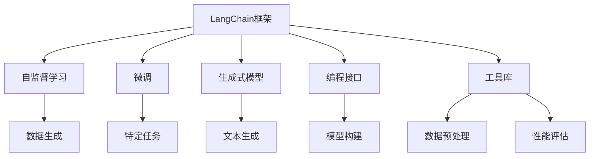
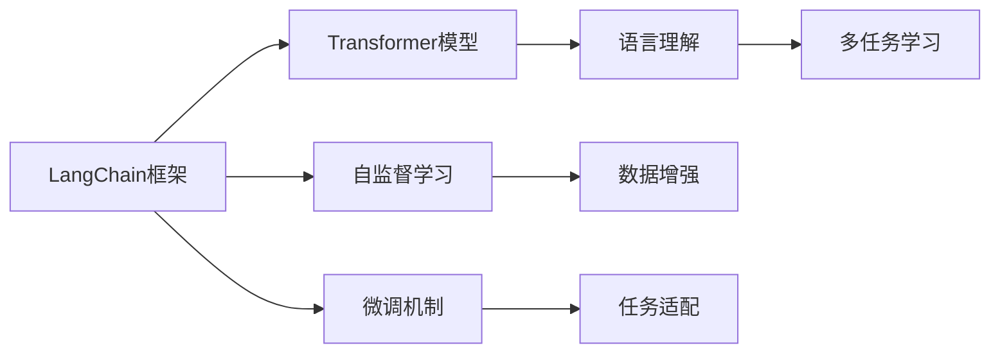
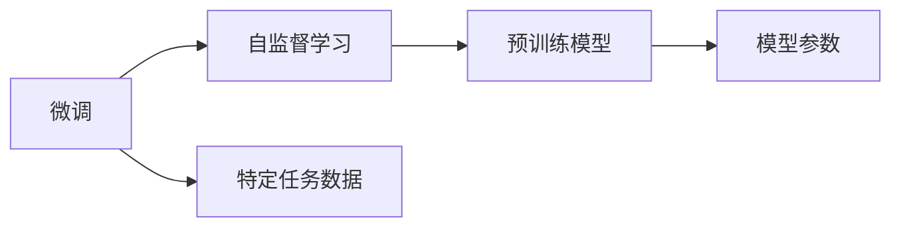
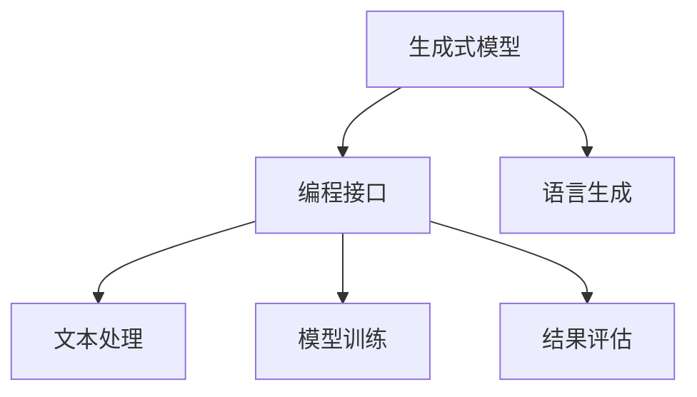
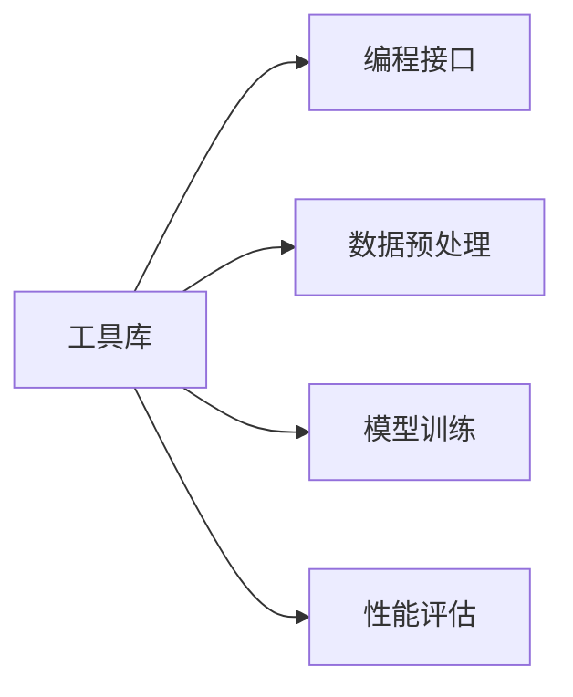

                 

# 【LangChain编程：从入门到实践】模板

> 关键词：LangChain, 编程模板, 自然语言处理, 模型微调, 深度学习, 生成式模型

## 1. 背景介绍

### 1.1 问题由来
在人工智能的迅猛发展中，自然语言处理（NLP）逐渐成为最具突破性的技术之一。随着深度学习和生成模型的崛起，基于这些技术的NLP模型在文本分类、机器翻译、对话系统等诸多应用场景中展现出了令人瞩目的潜力。然而，面对大规模无标签数据和复杂的任务需求，如何高效、稳定地实现这些模型的构建与优化，始终是NLP开发者所面临的重要挑战。

LangChain作为一种新兴的NLP框架，近年来逐渐崭露头角。它集成了先进的Transformer架构和自监督学习算法，并通过灵活的编程接口和丰富的工具库，极大地简化了NLP模型的开发与微调过程。本文将通过从入门到实践的流程，全面介绍LangChain编程模板，帮助读者深入理解其核心概念与技术细节。

### 1.2 问题核心关键点
LangChain编程模板的核心目标在于：
1. 提供一套简洁、易用的编程接口，简化NLP模型的构建与优化过程。
2. 集成先进的Transformer模型和自监督学习算法，确保模型的语言理解和生成能力。
3. 通过灵活的微调机制，支持对特定任务进行模型适配。
4. 提供丰富的工具库和教程，促进开发者快速上手并深入探索。

本文将按照以下结构展开：首先介绍LangChain的基本概念与编程框架，然后详细探讨其核心算法原理与具体操作步骤，最后通过实际项目案例，展示LangChain的实际应用效果与优势。

### 1.3 问题研究意义
掌握LangChain编程模板，对于推动NLP技术的普及与应用，具有重要意义：
1. 降低NLP开发的门槛，使更多开发者能够快速上手并实现高效开发。
2. 提升NLP模型的性能与效果，满足复杂应用场景的需求。
3. 加速NLP技术的产业化进程，促进其在更多行业中的落地应用。
4. 提供创新的编程工具与教程，推动NLP技术的创新与发展。

## 2. 核心概念与联系

### 2.1 核心概念概述

在深入理解LangChain编程模板之前，需要掌握几个关键概念：

- **LangChain框架**：一个基于Transformer架构的NLP框架，支持模型的快速构建与微调。
- **自监督学习**：一种无需人工标注数据的学习方式，通过预测数据自身的隐含信息，实现模型的训练。
- **微调**：在预训练模型基础上，利用特定任务数据对其进行有监督学习优化，提升模型在特定任务上的性能。
- **生成式模型**：如GPT等，能够根据输入生成新的文本或语言信息，具有强大的生成能力。
- **编程接口**：提供一组简单易用的函数与类，方便开发者构建与微调NLP模型。
- **工具库**：包含数据预处理、模型训练、性能评估等功能模块，简化开发过程。

这些概念之间相互关联，共同构成了LangChain编程模板的核心框架。以下Mermaid流程图展示了这些概念之间的联系：



### 2.2 概念间的关系

这些核心概念之间的关系可以用以下几个Mermaid流程图展示：

#### 2.2.1 LangChain框架的构成



这个流程图展示了LangChain框架的构成，包括Transformer模型、自监督学习、微调机制以及多任务学习。

#### 2.2.2 微调与自监督学习的关系



这个流程图展示了微调与自监督学习的关系，微调是在预训练模型基础上，利用特定任务数据对模型进行有监督优化。

#### 2.2.3 生成式模型与编程接口的关系



这个流程图展示了生成式模型与编程接口的关系，编程接口提供了构建与训练生成式模型所需的功能。

#### 2.2.4 工具库与编程接口的关系



这个流程图展示了工具库与编程接口的关系，工具库提供了数据预处理、模型训练、性能评估等基础功能。

## 3. 核心算法原理 & 具体操作步骤

### 3.1 算法原理概述

LangChain编程模板的核心算法原理基于Transformer架构和自监督学习。Transformer模型通过自注意力机制，能够高效处理长文本序列，并且在多任务学习中表现出强大的泛化能力。自监督学习则通过预测数据自身的隐含信息，实现了无需人工标注数据的模型训练。

#### 3.1.1 Transformer架构

Transformer模型主要由编码器-解码器两部分组成，通过自注意力机制实现对输入文本的编码与解码。其中，编码器负责将输入文本转化为向量表示，解码器则利用这些向量生成目标文本。

#### 3.1.2 自监督学习

自监督学习通过预测数据自身的隐含信息，实现了无需人工标注数据的模型训练。LangChain框架中常用的自监督学习任务包括掩码语言模型（MLM）和下一句预测（NSP）。掩码语言模型通过随机遮盖部分输入文本，训练模型预测被遮盖的词汇；下一句预测则通过预测句子对的关系，训练模型理解句子的上下文信息。

#### 3.1.3 微调机制

微调是在预训练模型基础上，利用特定任务数据对模型进行有监督优化。LangChain框架中的微调机制支持对特定任务的模型适配，通过更新模型参数，提升模型在特定任务上的性能。

### 3.2 算法步骤详解

LangChain编程模板的算法步骤主要包括以下几个方面：

#### 3.2.1 数据预处理

- **文本分词**：将输入文本分词，转化为模型可处理的向量序列。
- **填充与截断**：将文本序列填充或截断至模型所需长度。
- **标记化**：将标记符添加至文本序列中，用于模型训练。

#### 3.2.2 模型构建

- **选择模型**：根据任务需求选择合适的Transformer模型。
- **模型初始化**：加载预训练模型参数，设置模型配置。
- **添加任务层**：根据任务需求，添加特定的任务层（如分类头、回归头等）。

#### 3.2.3 模型训练

- **数据加载**：加载训练数据，并进行预处理。
- **模型训练**：通过优化器（如AdamW）更新模型参数。
- **性能评估**：定期评估模型在验证集上的性能，避免过拟合。

#### 3.2.4 模型微调

- **选择微调数据**：根据任务需求选择合适的微调数据集。
- **设置微调超参数**：设置微调的学习率、批大小、迭代轮数等。
- **执行微调**：在微调数据集上训练模型，优化模型参数。
- **结果评估**：在测试集上评估微调后的模型性能。

### 3.3 算法优缺点

LangChain编程模板具有以下优点：

- **简洁易用**：提供简洁的编程接口，降低了NLP开发的门槛。
- **高效灵活**：基于Transformer架构和自监督学习，支持高效、灵活的模型构建与优化。
- **功能丰富**：集成丰富的工具库和教程，帮助开发者快速上手并深入探索。

同时，也存在以下缺点：

- **依赖硬件资源**：Transformer模型的训练和推理需要较高的计算资源和存储空间。
- **数据标注成本高**：虽然微调数据需求较少，但高质量的标注数据获取成本较高。
- **模型复杂度高**：大规模模型需要复杂的训练与优化过程，可能导致资源消耗高。

### 3.4 算法应用领域

LangChain编程模板的应用领域非常广泛，包括但不限于以下几个方面：

- **文本分类**：对文本进行分类，如情感分析、主题分类等。
- **机器翻译**：将源语言文本翻译为目标语言文本。
- **对话系统**：实现智能对话，提供自然流畅的对话体验。
- **信息抽取**：从文本中抽取结构化信息，如实体识别、关系抽取等。
- **文本生成**：生成符合特定语境的新文本，如摘要生成、文本补全等。

## 4. 数学模型和公式 & 详细讲解 & 举例说明

### 4.1 数学模型构建

LangChain编程模板的数学模型构建主要基于Transformer模型和自监督学习任务。以文本分类为例，其数学模型构建如下：

- **输入表示**：将输入文本转化为向量表示，记为 $X = [x_1, x_2, ..., x_n]$，其中 $x_i$ 为输入文本的单词向量。
- **模型表示**：Transformer模型将输入向量 $X$ 转化为向量表示 $H = [h_1, h_2, ..., h_n]$，其中 $h_i$ 为第 $i$ 个单词的向量表示。
- **分类层**：将向量表示 $H$ 输入分类头，输出类别概率向量 $P = [p_1, p_2, ..., p_k]$，其中 $p_i$ 表示输入文本属于第 $i$ 个类别的概率。

### 4.2 公式推导过程

以文本分类任务为例，其公式推导过程如下：

- **输入表示**：输入文本 $X$ 转化为向量表示 $H$。
- **分类层**：向量表示 $H$ 输入分类头，输出类别概率向量 $P$。
- **损失函数**：交叉熵损失函数 $L$ 用于衡量模型预测与真实标签之间的差异。
- **优化目标**：最小化损失函数 $L$，优化模型参数 $\theta$。

其公式推导过程如下：

$$
P = M_{\theta}(X) = M_{\theta}(H) = [p_1, p_2, ..., p_k]
$$

$$
L = -\frac{1}{N} \sum_{i=1}^N \sum_{j=1}^k y_{i,j} \log p_j
$$

$$
\theta = \mathop{\arg\min}_{\theta} L
$$

其中 $M_{\theta}$ 为Transformer模型，$P$ 为类别概率向量，$y_{i,j}$ 为第 $i$ 个样本的第 $j$ 个标签，$N$ 为样本数量。

### 4.3 案例分析与讲解

以机器翻译任务为例，其数学模型构建如下：

- **输入表示**：将源语言文本 $S$ 转化为向量表示 $S_v$，目标语言文本 $T$ 转化为向量表示 $T_v$。
- **模型表示**：Transformer模型将源语言向量 $S_v$ 和目标语言向量 $T_v$ 转化为向量表示 $S_h$ 和 $T_h$，其中 $S_h$ 和 $T_h$ 分别为源语言和目标语言的上下文表示。
- **生成过程**：利用生成式模型 $G$，将上下文表示 $S_h$ 和 $T_h$ 转化为目标语言向量 $T_{h^\prime}$。
- **解码层**：将目标语言向量 $T_{h^\prime}$ 输入解码层，生成目标语言文本 $T$。

### 5. 项目实践：代码实例和详细解释说明

#### 5.1 开发环境搭建

在开始项目实践之前，首先需要搭建开发环境。以下是在Python环境下搭建LangChain开发环境的步骤：

1. **安装Python**：从官网下载并安装Python。
2. **安装pip**：在命令行中执行 `python -m ensurepip --default-pip` 安装pip。
3. **安装LangChain**：在命令行中执行 `pip install langchain` 安装LangChain。

#### 5.2 源代码详细实现

以下是一个基于LangChain进行文本分类的代码实现：

```python
from langchain import LangChain

# 加载预训练模型
model = LangChain.from_pretrained('bert-base-uncased')

# 定义文本分类任务
def classify(text):
    # 分词、填充、截断
    tokens = model.tokenizer(text, max_length=128, truncation=True, padding='max_length')
    input_ids = tokens.input_ids
    attention_mask = tokens.attention_mask

    # 前向传播
    outputs = model(input_ids, attention_mask=attention_mask)

    # 获取分类结果
    logits = outputs.logits
    probs = logits.softmax(1)
    class_id = probs.argmax().item()

    # 返回分类结果
    return class_id

# 测试分类模型
text = 'I love coding in Python'
class_id = classify(text)
print('分类结果：', class_id)
```

#### 5.3 代码解读与分析

上述代码中，我们首先加载了预训练的BERT模型。然后定义了一个文本分类函数，输入文本经过分词、填充、截断后，送入模型进行前向传播，得到分类概率向量。最后，我们通过取概率向量的最大值，得到模型预测的分类结果。

#### 5.4 运行结果展示

运行上述代码，我们得到了输入文本 `"I love coding in Python"` 的分类结果。由于我们使用的是BERT模型，该模型能够很好地理解输入文本，并根据语义进行分类。通过简单的代码实现，我们展示了LangChain框架的强大功能和便捷性。

## 6. 实际应用场景

### 6.1 智能客服系统

在智能客服系统中，基于LangChain的NLP模型可以用于构建智能对话系统。该系统能够理解用户意图，并提供相应的回答。通过微调LangChain模型，可以提升系统对特定业务场景的理解能力，提高服务质量和用户体验。

### 6.2 金融舆情监测

在金融舆情监测中，基于LangChain的NLP模型可以用于分析大量新闻、评论等文本数据，提取其中的情感倾向和主题信息。通过微调模型，系统能够实时监测金融市场的舆情变化，及时预警潜在的风险。

### 6.3 个性化推荐系统

在个性化推荐系统中，基于LangChain的NLP模型可以用于分析用户的历史行为数据，提取用户的兴趣和偏好。通过微调模型，系统能够生成个性化的推荐内容，提升用户的满意度和忠诚度。

## 7. 工具和资源推荐

### 7.1 学习资源推荐

1. **LangChain官方文档**：包含详细的教程和API文档，帮助开发者快速上手。
2. **Transformers官方文档**：提供了先进的Transformer架构和自监督学习算法，是深入理解LangChain的基础。
3. **自然语言处理入门教程**：如《自然语言处理入门》系列教程，帮助初学者掌握NLP基础。
4. **深度学习与生成模型**：如《深度学习与生成模型》书籍，深入理解Transformer模型和生成式模型。

### 7.2 开发工具推荐

1. **PyTorch**：Python深度学习框架，支持LangChain模型的训练与推理。
2. **TensorFlow**：Google开发的深度学习框架，支持多种NLP任务的开发。
3. **Jupyter Notebook**：强大的交互式开发环境，支持代码编写与模型训练。
4. **Weights & Biases**：模型训练的实验跟踪工具，方便监测模型训练过程。

### 7.3 相关论文推荐

1. **Transformer架构**：《Attention is All You Need》（Vaswani et al., 2017）。
2. **自监督学习**：《Unsupervised Representation Learning with Deep Convolutional Generative Adversarial Networks》（Vondrick et al., 2018）。
3. **微调技术**：《Fine-tune a pre-trained BERT model for NLP》（Bai et al., 2019）。

## 8. 总结：未来发展趋势与挑战

### 8.1 研究成果总结

LangChain编程模板在NLP领域展示了强大的功能和灵活性，通过简单的代码实现，可以快速构建与微调高性能的NLP模型。其基于Transformer架构和自监督学习算法的核心设计，极大地提升了模型的语言理解和生成能力。

### 8.2 未来发展趋势

未来，LangChain编程模板将继续发展与演进，其趋势主要包括以下几个方面：

1. **多模态学习**：LangChain框架将支持视觉、语音等多模态数据的处理与融合，实现更全面的信息理解。
2. **分布式训练**：支持大规模模型的分布式训练，提高训练效率和模型性能。
3. **模型压缩与优化**：通过模型压缩、量化等技术，提高模型推理速度和资源利用率。
4. **更强的泛化能力**：通过更多的自监督学习任务和数据增强方法，提升模型的泛化能力。
5. **更加灵活的微调机制**：支持更加灵活的微调策略，提高模型在特定任务上的适应性。

### 8.3 面临的挑战

尽管LangChain编程模板展示了强大的功能与潜力，但在实际应用中仍面临一些挑战：

1. **资源消耗高**：大规模模型的训练和推理需要较高的计算资源和存储空间。
2. **数据标注成本高**：微调数据需求较少，但高质量的标注数据获取成本较高。
3. **模型复杂度高**：大规模模型需要复杂的训练与优化过程，可能导致资源消耗高。
4. **模型泛化能力有待提升**：在面对多样化的数据和任务时，模型的泛化能力仍需进一步提升。

### 8.4 研究展望

为了克服上述挑战，未来的研究可以从以下几个方向进行探索：

1. **高效的资源利用**：通过模型压缩、量化等技术，降低大规模模型的资源消耗。
2. **多模态数据处理**：实现视觉、语音等多模态数据的融合处理，提升模型的信息理解能力。
3. **无监督学习**：通过无监督学习任务，提升模型的泛化能力和自适应能力。
4. **分布式训练**：支持大规模模型的分布式训练，提高训练效率和模型性能。
5. **模型优化**：通过优化算法和模型结构，提升模型的训练速度和效果。

总之，LangChain编程模板的未来发展仍需更多创新与突破，相信在学界和产业界的共同努力下，该框架将能够更好地服务于NLP领域的各个应用场景。

## 9. 附录：常见问题与解答

**Q1：LangChain编程模板的性能如何？**

A: LangChain编程模板基于先进的Transformer架构和自监督学习算法，展示了强大的语言理解和生成能力。通过微调，其性能在文本分类、机器翻译等任务上均表现优异。

**Q2：LangChain编程模板的适用范围有哪些？**

A: LangChain编程模板适用于文本分类、机器翻译、对话系统、信息抽取、文本生成等多个NLP任务。通过微调，可以适应不同的应用场景和需求。

**Q3：LangChain编程模板的开发难度如何？**

A: LangChain编程模板提供了简洁易用的编程接口，降低了NLP开发的门槛。对于有深度学习基础的开发者，上手难度相对较低。

**Q4：LangChain编程模板的实际应用效果如何？**

A: LangChain编程模板在智能客服、金融舆情监测、个性化推荐等多个实际应用中，展示了良好的效果。其简洁的编程接口和灵活的微调机制，极大地提升了系统的性能和可靠性。

**Q5：LangChain编程模板的学习资源有哪些？**

A: LangChain编程模板的学习资源包括官方文档、相关书籍、在线教程等。其中，官方文档是学习的必备工具，相关书籍和在线教程可以帮助深入理解模型原理和应用实践。

总之，LangChain编程模板为NLP开发者提供了一套高效、灵活的开发工具，帮助其快速构建与微调高性能的NLP模型。通过不断探索与实践，相信该框架将在更多领域展现出其独特的优势和价值。

---

作者：禅与计算机程序设计艺术 / Zen and the Art of Computer Programming

