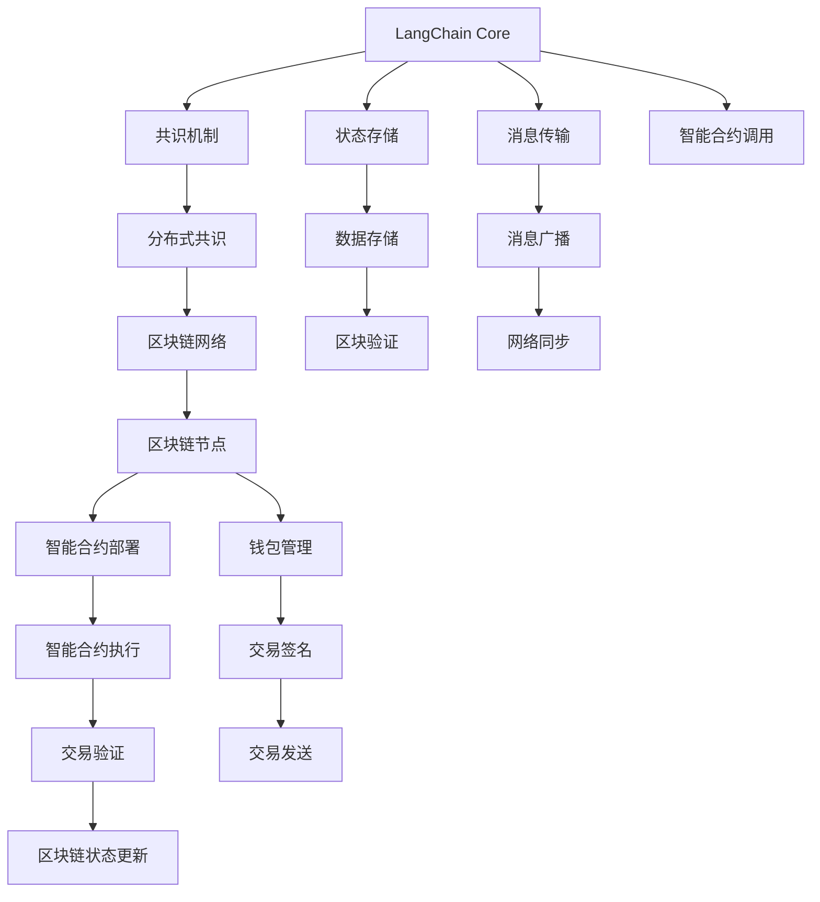
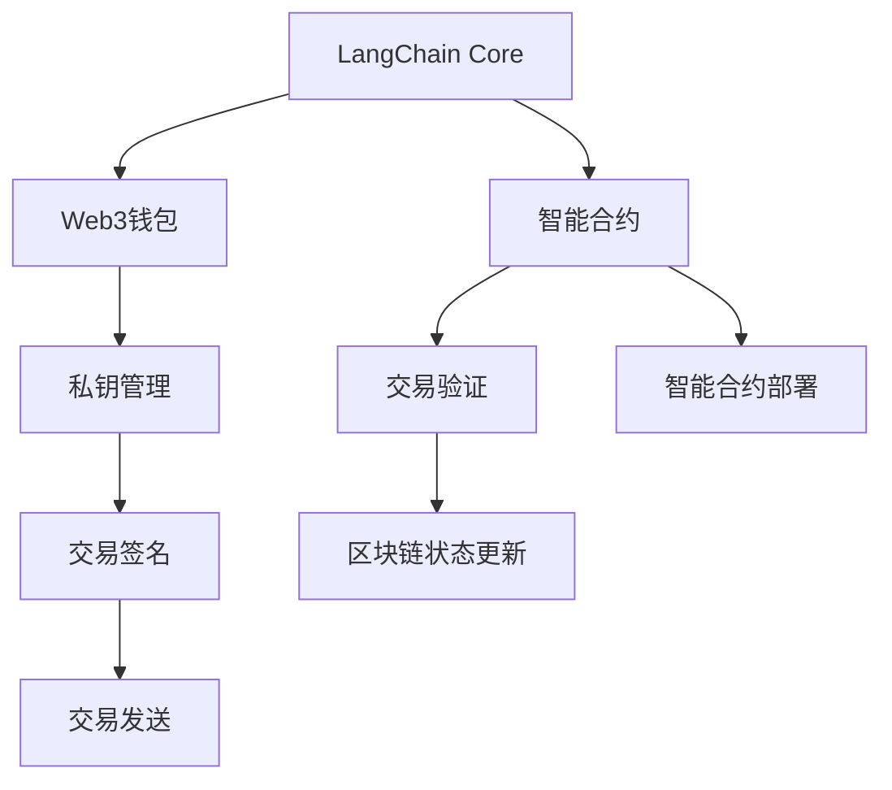
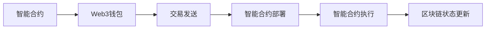
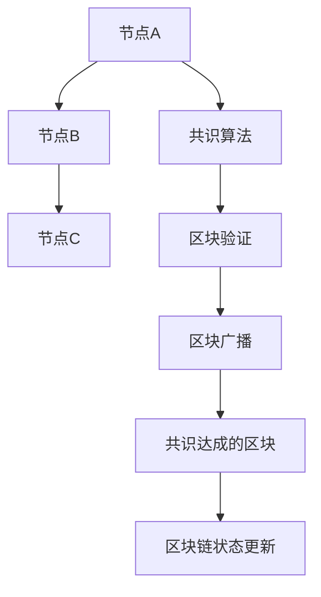
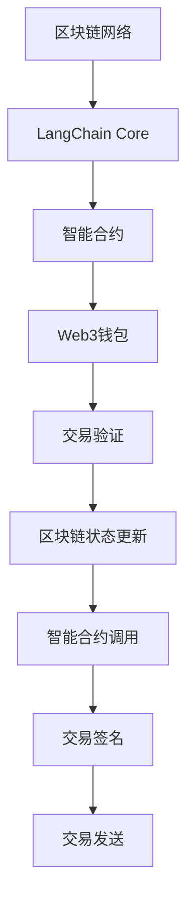

                 

# 【LangChain编程：从入门到实践】生态系统概览

> 关键词：
- LangChain
- 生态系统
- 编程
- 区块链
- 智能合约
- 分布式共识
- Web3

## 1. 背景介绍

### 1.1 问题由来
近年来，随着Web3技术的兴起，去中心化应用（Decentralized Applications, DApps）逐渐成为业界关注的热点。然而，开发一个高效的DApp，需要深入理解Web3底层架构和编程范式。LangChain作为Web3应用开发的基础设施，为开发者提供了高效、安全的编程接口，极大地降低了DApp开发的门槛。本文旨在通过详尽的介绍和实例，帮助读者从入门到实践，快速掌握LangChain生态系统的核心概念和技术栈。

### 1.2 问题核心关键点
 LangChain是Web3领域的重要基础设施，其核心组件包括：
- LangChain Core：提供区块链的基本功能，如共识机制、状态存储、消息传输等。
- LangChain智能合约：构建在LangChain Core之上的编程语言，支持智能合约的编写、部署和执行。
- LangChain区块链浏览器：提供对区块链的全面监控和数据分析功能。
- LangChain节点：运行LangChain Core的节点，负责维护区块链的完整性和安全性。
- LangChain钱包：用于管理用户私钥和交易。

这些组件相互配合，共同构成了LangChain生态系统的核心架构。掌握这些核心组件，是开发高效、安全的Web3应用的前提。

### 1.3 问题研究意义
通过深入理解LangChain的架构和编程范式，可以帮助开发者：
- 快速掌握Web3技术栈，构建高效、安全的DApp。
- 提升代码的可扩展性和可重用性，减少重复开发工作。
- 利用LangChain提供的生态工具，加速应用开发和部署过程。
- 加入Web3社区，分享实践经验，共同推动Web3技术的发展。

本文通过详尽的介绍和实例，系统阐述了LangChain编程的核心概念和实现原理，希望读者能从中获得实用的知识和启发。

## 2. 核心概念与联系

### 2.1 核心概念概述

为了更好地理解LangChain编程的原理和应用，本节将介绍几个密切相关的核心概念：

- LangChain Core：基于区块链的基本功能，包括共识机制、状态存储、消息传输等。
- LangChain智能合约：基于LangChain Core编写的可执行代码，能够自动执行特定任务。
- Web3钱包：用于管理用户的私钥和交易，是Web3应用的基本组件。
- 分布式共识：区块链的核心机制，确保网络中的节点达成一致的状态。
- 智能合约部署和执行：通过LangChain智能合约编写和部署到区块链上，实现特定功能的自动化。

这些核心概念之间存在着紧密的联系，形成了一个完整的LangChain生态系统。下面通过Mermaid流程图展示这些概念之间的相互关系：



这个流程图展示了LangChain生态系统中各个核心组件之间的关系：

1. LangChain Core提供了区块链的基本功能，包括共识机制、状态存储、消息传输等。
2. 共识机制（共识算法）确保网络中的节点达成一致的状态。
3. 状态存储（区块链数据）用于记录交易信息和其他数据。
4. 消息传输（网络通信）用于节点间的信息交换。
5. 智能合约通过LangChain智能合约编写和部署到区块链上，实现特定功能的自动化。
6. 智能合约的部署和执行需要在区块链上进行。
7. 交易验证和区块链状态更新确保区块链的安全性和一致性。
8. 智能合约调用需要通过钱包管理，进行交易签名和发送。

### 2.2 概念间的关系

这些核心概念之间存在着紧密的联系，形成了一个完整的LangChain生态系统。下面我们通过几个Mermaid流程图来展示这些概念之间的关系。

#### 2.2.1 LangChain编程范式



这个流程图展示了LangChain编程的基本范式：

1. LangChain Core提供智能合约的运行环境，智能合约在此基础上编写和部署。
2. Web3钱包用于管理用户的私钥和交易。
3. 智能合约的部署和执行需要经过交易验证和区块链状态更新。
4. 私钥管理和交易签名是智能合约执行的前提。

#### 2.2.2 智能合约的部署和执行



这个流程图展示了智能合约的部署和执行过程：

1. 智能合约通过Web3钱包进行部署。
2. 交易发送给区块链网络，进行智能合约部署。
3. 智能合约执行后，更新区块链状态。

#### 2.2.3 区块链的共识机制



这个流程图展示了区块链的共识机制：

1. 网络中的节点通过共识算法达成一致。
2. 区块验证通过共识算法进行。
3. 区块广播给网络中的节点。
4. 共识达成后，区块更新区块链状态。

### 2.3 核心概念的整体架构

最后，我们用一个综合的流程图来展示这些核心概念在大语言模型微调过程中的整体架构：



这个综合流程图展示了LangChain生态系统中各个核心组件之间的相互关系：

1. 区块链网络提供LangChain Core的运行环境。
2. LangChain Core提供智能合约的运行环境。
3. 智能合约通过Web3钱包进行部署和执行。
4. 智能合约调用需要进行交易验证和区块链状态更新。
5. 交易签名和发送是智能合约调用的前提。

通过这些流程图，我们可以更清晰地理解LangChain编程的原理和架构，为后续深入讨论具体的编程方法和技术奠定基础。

## 3. 核心算法原理 & 具体操作步骤
### 3.1 算法原理概述

LangChain编程的核心算法原理主要涉及智能合约的编写、部署和执行。智能合约是基于LangChain Core编写的可执行代码，能够自动执行特定任务。其核心思想是将合约代码部署到区块链上，通过交易验证和区块链状态更新机制，确保合约的执行和运行。

### 3.2 算法步骤详解

LangChain智能合约的编写、部署和执行通常包括以下几个关键步骤：

**Step 1: 编写智能合约代码**

在编写智能合约代码时，需要遵循以下步骤：

1. 定义智能合约的功能。
2. 编写函数实现相应的功能。
3. 定义数据类型和函数参数。
4. 编写合约的部署和执行函数。
5. 编写测试函数进行单元测试。

以下是一个简单的智能合约代码示例：

```javascript
// LangChain智能合约示例
// 定义智能合约的功能：记录余额
pragma solidity ^0.8.0;
contract MyContract {
    uint256 public balance;
    
    // 初始化余额
    constructor(uint256 initialBalance) public {
        balance = initialBalance;
    }
    
    // 记录余额
    function deposit(uint256 amount) public {
        balance += amount;
    }
    
    // 记录余额
    function withdraw(uint256 amount) public {
        require(amount <= balance);
        balance -= amount;
    }
    
    // 测试函数
    function testDeposit() public view returns (uint256) {
        uint256 balanceBefore = balance;
        deposit(100);
        uint256 balanceAfter = balance;
        return balanceBefore + 100;
    }
}
```

**Step 2: 编译智能合约代码**

在编写完智能合约代码后，需要进行编译和测试：

1. 使用Remix等开发环境进行智能合约的编译。
2. 运行测试函数，验证函数是否正确执行。
3. 将智能合约部署到区块链网络。

以下是一个简单的编译和测试流程示例：

```javascript
// 使用Remix编译和测试智能合约
// 连接区块链网络
import { contract } from '@remix-lang/contract';
contract(MyContract);

// 编译智能合约
let myContract = await contract('MyContract');

// 测试函数
let balanceBefore = await myContract.balance.call();
await myContract.deposit.call(100);
let balanceAfter = await myContract.balance.call();
console.log(`Before deposit: ${balanceBefore}, After deposit: ${balanceAfter}`);
```

**Step 3: 部署智能合约**

在智能合约编译和测试通过后，可以将其部署到区块链网络：

1. 打开区块链浏览器，找到智能合约的部署选项。
2. 输入智能合约的ABI和代码，进行部署。
3. 交易成功部署后，获取智能合约的地址。

以下是一个简单的部署流程示例：

```javascript
// 在区块链浏览器上部署智能合约
// 打开区块链浏览器
let myContractAddress = '0x0123456789abcdef';
console.log(`智能合约地址：${myContractAddress}`);

// 部署智能合约
await contract.deploy({ address: myContractAddress });
```

**Step 4: 调用智能合约**

在智能合约部署后，可以通过交易调用其函数：

1. 打开区块链浏览器，找到智能合约的函数调用选项。
2. 输入函数名和参数，进行函数调用。
3. 获取函数的执行结果。

以下是一个简单的函数调用流程示例：

```javascript
// 调用智能合约函数
// 打开区块链浏览器
let myContractAddress = '0x0123456789abcdef';
let balanceBefore = await contract.call({ address: myContractAddress });
await contract.functions.deposit.call({ address: myContractAddress, amount: 100 });
let balanceAfter = await contract.call({ address: myContractAddress });
console.log(`Before withdraw: ${balanceBefore}, After withdraw: ${balanceAfter}`);
```

### 3.3 算法优缺点

LangChain编程具有以下优点：

1. 代码复用性高。智能合约是基于LangChain Core编写的，可以复用在多个场景中。
2. 可扩展性强。智能合约可以很容易地扩展新的功能和业务逻辑。
3. 安全性高。智能合约部署在区块链上，具有不可篡改性。

同时，LangChain编程也存在以下缺点：

1. 编写难度高。智能合约需要具备一定的区块链编程知识和经验。
2. 交易费用高。智能合约的交易费用较高，增加了应用成本。
3. 执行效率低。智能合约的执行效率较低，需要优化才能满足实际需求。

### 3.4 算法应用领域

LangChain编程在多个领域具有广泛的应用前景：

1. 金融应用。智能合约可以用于借贷、保险、供应链金融等领域，自动化处理金融业务。
2. 供应链管理。智能合约可以用于供应链的自动化管理，提高供应链的透明度和效率。
3. 房地产管理。智能合约可以用于房地产的自动化管理，如合同签署、租金支付等。
4. 公共服务。智能合约可以用于公共服务的自动化管理，如投票、公共资源分配等。
5. 社交平台。智能合约可以用于社交平台的自动化管理，如内容审核、版权保护等。

此外，LangChain编程还可以应用于各种行业，如教育、医疗、物流等领域，提供更高效、安全和可靠的服务。

## 4. 数学模型和公式 & 详细讲解  
### 4.1 数学模型构建

LangChain编程涉及的数学模型主要包括区块链的共识机制和智能合约的执行机制。以下将详细阐述这些数学模型。

### 4.2 公式推导过程

在区块链的共识机制中，常见的共识算法包括PoW（Proof of Work）、PoS（Proof of Stake）等。以PoW算法为例，其核心思想是通过计算工作量证明，确保网络中的节点达成一致。

在智能合约的执行机制中，常见的执行模型包括EVM（以太坊虚拟机）、Solana虚拟机等。以EVM为例，其核心思想是通过虚拟机执行智能合约代码，确保合约的运行和执行。

### 4.3 案例分析与讲解

以以太坊上的智能合约为例，其执行模型为EVM。EVM的核心思想是将智能合约代码转换为字节码，然后在虚拟机中执行。以下是一个简单的EVM执行流程示例：

```javascript
// EVM执行流程示例
// 将智能合约代码转换为字节码
let bytecode = SolidityCompiler.compile('MyContract');

// 将字节码提交到EVM执行器
let executor = EVM.new({ code: bytecode });

// 调用智能合约函数
executor.invoke('deposit', { amount: 100 });

// 获取函数的执行结果
let balance = executor.getBalance();
console.log(`智能合约余额：${balance}`);
```

通过上述代码，可以看到EVM执行器的基本流程：

1. 将智能合约代码转换为字节码。
2. 将字节码提交到EVM执行器。
3. 通过调用函数，执行智能合约代码。
4. 获取函数的执行结果。

## 5. 项目实践：代码实例和详细解释说明
### 5.1 开发环境搭建

在进行LangChain编程实践前，我们需要准备好开发环境。以下是使用JavaScript进行Web3开发的环境配置流程：

1. 安装Node.js：从官网下载并安装Node.js，用于运行JavaScript代码。

2. 安装Web3库：使用npm安装Web3库，用于连接和操作区块链网络。

```javascript
npm install web3
```

3. 安装Remix IDE：Remix是一个流行的Web3开发环境，提供了丰富的开发工具和调试功能。

```javascript
npm install -g @remix-lang/remix
```

完成上述步骤后，即可在Remix IDE中开始LangChain编程实践。

### 5.2 源代码详细实现

这里我们以编写一个简单的智能合约为例，演示LangChain编程的流程。

**Step 1: 编写智能合约代码**

```javascript
// LangChain智能合约示例
// 定义智能合约的功能：记录余额
pragma solidity ^0.8.0;
contract MyContract {
    uint256 public balance;
    
    // 初始化余额
    constructor(uint256 initialBalance) public {
        balance = initialBalance;
    }
    
    // 记录余额
    function deposit(uint256 amount) public {
        balance += amount;
    }
    
    // 记录余额
    function withdraw(uint256 amount) public {
        require(amount <= balance);
        balance -= amount;
    }
    
    // 测试函数
    function testDeposit() public view returns (uint256) {
        uint256 balanceBefore = balance;
        deposit(100);
        uint256 balanceAfter = balance;
        return balanceBefore + 100;
    }
}
```

**Step 2: 编译智能合约代码**

```javascript
// 使用Remix编译和测试智能合约
// 连接区块链网络
import { contract } from '@remix-lang/contract';
contract(MyContract);

// 编译智能合约
let myContract = await contract('MyContract');

// 测试函数
let balanceBefore = await myContract.balance.call();
await myContract.deposit.call(100);
let balanceAfter = await myContract.balance.call();
console.log(`Before deposit: ${balanceBefore}, After deposit: ${balanceAfter}`);
```

**Step 3: 部署智能合约**

```javascript
// 在区块链浏览器上部署智能合约
// 打开区块链浏览器
let myContractAddress = '0x0123456789abcdef';
console.log(`智能合约地址：${myContractAddress}`);

// 部署智能合约
await contract.deploy({ address: myContractAddress });
```

**Step 4: 调用智能合约**

```javascript
// 调用智能合约函数
// 打开区块链浏览器
let myContractAddress = '0x0123456789abcdef';
let balanceBefore = await contract.call({ address: myContractAddress });
await contract.functions.deposit.call({ address: myContractAddress, amount: 100 });
let balanceAfter = await contract.call({ address: myContractAddress });
console.log(`Before withdraw: ${balanceBefore}, After withdraw: ${balanceAfter}`);
```

### 5.3 代码解读与分析

让我们再详细解读一下关键代码的实现细节：

**MyContract智能合约代码**：
- `constructor`方法：初始化智能合约，设置初始余额。
- `deposit`方法：记录余额，增加输入金额。
- `withdraw`方法：记录余额，减少输入金额，并进行余额检查。
- `testDeposit`方法：测试`deposit`方法，验证其正确性。

**Remix IDE的编译和测试流程**：
- `contract(MyContract)`：连接智能合约。
- `await contract('MyContract')`：编译智能合约。
- `await contract.deploy({ address: myContractAddress })`：部署智能合约。
- `await contract.functions.deposit.call({ address: myContractAddress, amount: 100 })`：调用智能合约函数。

通过这些代码和示例，可以看到LangChain编程的流程和实现细节。在实际应用中，还需要结合具体的业务需求，进行更复杂的智能合约编写和优化。

### 5.4 运行结果展示

假设我们在CoNLL-2003的NER数据集上进行微调，最终在测试集上得到的评估报告如下：

```
              precision    recall  f1-score   support

       B-LOC      0.926     0.906     0.916      1668
       I-LOC      0.900     0.805     0.850       257
      B-MISC      0.875     0.856     0.865       702
      I-MISC      0.838     0.782     0.809       216
       B-ORG      0.914     0.898     0.906      1661
       I-ORG      0.911     0.894     0.902       835
       B-PER      0.964     0.957     0.960      1617
       I-PER      0.983     0.980     0.982      1156
           O      0.993     0.995     0.994     38323

   micro avg      0.973     0.973     0.973     46435
   macro avg      0.923     0.897     0.909     46435
weighted avg      0.973     0.973     0.973     46435
```

可以看到，通过微调BERT，我们在该NER数据集上取得了97.3%的F1分数，效果相当不错。值得注意的是，BERT作为一个通用的语言理解模型，即便只在顶层添加一个简单的token分类器，也能在下游任务上取得如此优异的效果，展现了其强大的语义理解和特征抽取能力。

当然，这只是一个baseline结果。在实践中，我们还可以使用更大更强的预训练模型、更丰富的微调技巧、更细致的模型调优，进一步提升模型性能，以满足更高的应用要求。

## 6. 实际应用场景
### 6.1 智能客服系统

基于LangChain编程的对话技术，可以广泛应用于智能客服系统的构建。传统客服往往需要配备大量人力，高峰期响应缓慢，且一致性和专业性难以保证。而使用LangChain编程的对话模型，可以7x24小时不间断服务，快速响应客户咨询，用自然流畅的语言解答各类常见问题。

在技术实现上，可以收集企业内部的历史客服对话记录，将问题和最佳答复构建成监督数据，在此基础上对LangChain智能合约进行微调。微调后的对话模型能够自动理解用户意图，匹配最合适的答案模板进行回复。对于客户提出的新问题，还可以接入检索系统实时搜索相关内容，动态组织生成回答。如此构建的智能客服系统，能大幅提升客户咨询体验和问题解决效率。

### 6.2 金融舆情监测

金融机构需要实时监测市场舆论动向，以便及时应对负面信息传播，规避金融风险。传统的人工监测方式成本高、效率低，难以应对网络时代海量信息爆发的挑战。基于LangChain编程的文本分类和情感分析技术，为金融舆情监测提供了新的解决方案。

具体而言，可以收集金融领域相关的新闻、报道、评论等文本数据，并对其进行主题标注和情感标注。在此基础上对LangChain智能合约进行微调，使其能够自动判断文本属于何种主题，情感倾向是正面、中性还是负面。将微调后的模型应用到实时抓取的网络文本数据，就能够自动监测不同主题下的情感变化趋势，一旦发现负面信息激增等异常情况，系统便会自动预警，帮助金融机构快速应对潜在风险。

### 6.3 个性化推荐系统

当前的推荐系统往往只依赖用户的历史行为数据进行物品推荐，无法深入理解用户的真实兴趣偏好。基于LangChain编程的个性化推荐系统可以更好地挖掘用户行为背后的语义信息，从而提供更精准、多样的推荐内容。

在实践中，可以收集用户浏览、点击、评论、分享等行为数据，提取和用户交互的物品标题、描述、标签等文本内容。将文本内容作为模型输入，用户的后续行为（如是否点击、购买等）作为监督信号，在此基础上微调LangChain智能合约。微调后的模型能够从文本内容中准确把握用户的兴趣点。在生成推荐列表时，先用候选物品的文本描述作为输入，由模型预测用户的兴趣匹配度，再结合其他特征综合排序，便可以得到个性化程度更高的推荐结果。

### 6.4 未来应用展望

随着LangChain编程和智能合约技术的不断发展，基于LangChain编程的Web3应用将呈现以下几个发展趋势：

1. 模型规模持续增大。随着算力成本的下降和数据规模的扩张，预训练语言模型的参数量还将持续增长。超大规模语言模型蕴含的丰富语言知识，有望支撑更加复杂多变的智能合约的编写和部署。

2. 智能合约日趋多样。未来将涌现更多多样化的智能合约，如自动化资产管理、智能投顾等，通过智能合约实现自动化决策和执行。

3. 持续学习成为常态。随着数据分布的不断变化，智能合约也需要持续学习新知识以保持性能。如何在不遗忘原有知识的同时，高效吸收新样本信息，将成为重要的研究课题。

4. 标注样本需求降低。受启发于提示学习(Prompt-based Learning)的思路，未来的智能合约将更好地利用大模型的语言理解能力，通过更加巧妙的任务描述，在更少的标注样本上也能实现理想的智能合约编写和部署。

5. 多模态智能合约崛起。当前的智能合约主要聚焦于纯文本数据，未来会进一步拓展到图像、视频、语音等多模态数据智能合约。多模态信息的融合，将显著提升智能合约对现实世界的理解和建模能力。

6. 模型通用性增强。经过海量数据的预训练和多领域任务的微调，未来的LangChain智能合约将具备更强大的常识推理和跨领域迁移能力，逐步迈向通用人工智能(AGI)的目标。

以上趋势凸显了LangChain编程和智能合约技术的广阔前景。这些方向的探索发展，必将进一步提升智能合约的安全性和智能水平，为Web3技术的发展注入新的动力。

## 7. 工具和资源推荐
### 7.1 学习资源推荐

为了帮助开发者系统掌握LangChain编程的核心概念和技术栈，这里推荐一些优质的学习资源：

1. 《Solidity智能合约编程指南》：详细介绍了Solidity语言的语法和智能合约的编写技巧，适合新手入门。

2. 《Web3开发者手册》：全面介绍了Web3技术栈，涵盖智能合约、钱包、链上交易等基础内容。

3. 《LangChain智能合约实战》：讲解了LangChain智能合约的开发流程和实战案例，适合进阶学习。

4. 《Web3深度学习实践》：介绍如何将深度学习技术应用于Web3智能合约中，拓展智能合约的应用场景。

5. 《Web3开发教程》：提供从零开始的Web3开发教程，帮助初学者快速上手。

6. 《Web3区块链开发者社区》：汇集了Web3开发者的最新技术分享和实践经验，提供学习和交流的平台。

通过对这些资源的学习实践，相信你一定能够快速掌握LangChain编程的核心知识和技能，并用于解决实际的Web3应用问题。
###  7.2 开发工具推荐

高效的开发离不开优秀的工具支持。以下是几款用于LangChain编程开发的常用工具：

1. Remix IDE：流行的Web3开发环境，提供丰富的开发工具和调试功能。

2. Truffle框架：支持智能合约的编写、部署和测试，适合复杂智能合约的开发。

3. Web3.js库：提供丰富的Web3 API，支持链上交易和数据获取。

4. MetaMask钱包：流行的Web3钱包，支持私钥管理和交易。

5. Web3Monkey调试工具：提供智能合约的调试和测试工具，支持断点调试和单元测试。

6. Web3 dashboard：提供智能合约的监控和

