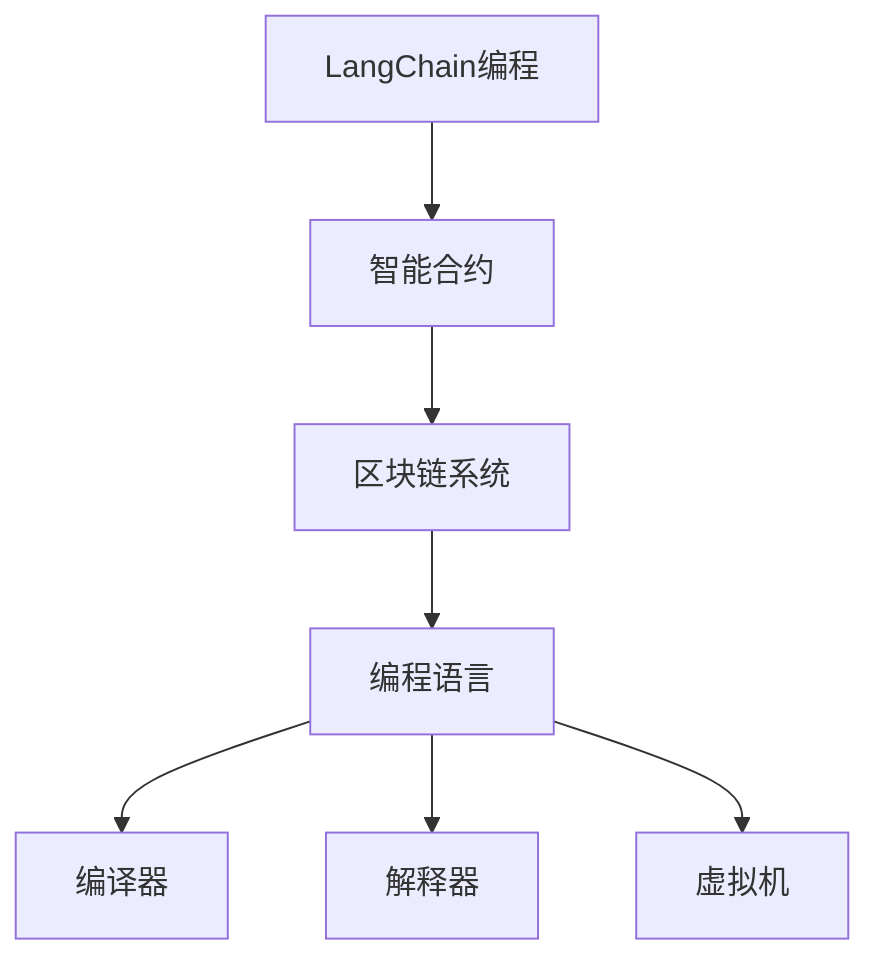
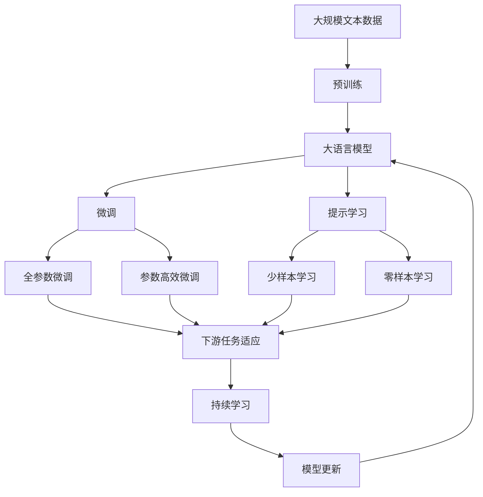

                 

# 【LangChain编程：从入门到实践】需求思考与设计

> 关键词：
1. LangChain
2. 编程
3. 需求分析
4. 软件设计
5. 系统架构
6. 区块链技术
7. 智能合约开发

## 1. 背景介绍

### 1.1 问题由来

随着区块链技术的快速发展，去中心化应用（DApps）和智能合约在金融、供应链、医疗等领域的应用逐渐增多。这些应用通常涉及多个参与方，需要高效的协同交互。然而，传统的中心化系统存在数据隐私和安全风险，无法满足业务需求。基于区块链的分布式系统，能够保障数据透明性和不可篡改性，但仍然存在性能瓶颈和治理问题。

为了解决这些问题，开发团队需要综合考虑业务需求、技术架构、系统性能等因素，设计高效、安全、可扩展的区块链系统。LangChain编程作为区块链智能合约的一种高级编程语言，通过编译器、解释器、虚拟机等组件，为开发者提供了丰富的编程工具和系统架构选择。本文将深入探讨LangChain编程的需求思考与设计，帮助开发者从需求分析、系统架构设计到编程实现的全过程，构建高效、安全的区块链系统。

### 1.2 问题核心关键点

LangChain编程的需求思考与设计，核心关键点包括：
1. 业务需求理解与映射：明确业务目标和需求，映射到具体的技术实现方案。
2. 系统架构设计：选择合适的区块链架构和技术栈，实现高效、安全的系统设计。
3. 编程工具选择：选择合适的编程语言、编译器、解释器等工具，支持丰富的智能合约开发。
4. 安全与隐私保护：设计安全机制和隐私保护策略，保障系统安全性和用户隐私。
5. 性能优化与扩展：设计高效的数据结构、算法和并发机制，提升系统性能和可扩展性。
6. 系统治理与维护：设计灵活的治理机制和运维策略，保障系统长期稳定运行。

这些关键点相互关联，共同决定了LangChain编程系统的设计质量和实际应用效果。本文将通过系统化的分析，帮助开发者全面掌握需求思考与设计的方法和技巧。

### 1.3 问题研究意义

在区块链技术和智能合约日新月异的今天，开发高效、安全、可扩展的区块链系统，对于推动区块链应用的普及和发展，具有重要意义：

1. 降低应用开发成本。通过选择合适的编程语言和工具，简化区块链系统开发过程，减少人力和资源的投入。
2. 提升系统性能和可扩展性。优化系统架构和编程工具，提升系统的并发处理能力和扩展性，适应不断增长的业务需求。
3. 保障系统安全性和隐私保护。设计安全机制和隐私保护策略，防范系统攻击和数据泄露风险，保障用户隐私和资产安全。
4. 促进业务创新和应用落地。通过高效、灵活的编程工具和系统架构设计，支持多样化的业务需求，推动区块链技术的商业化应用。
5. 增强系统治理和运维能力。设计灵活的治理机制和运维策略，确保系统长期稳定运行，提升用户体验和满意度。

本文通过深入分析LangChain编程的需求思考与设计，旨在为开发者提供系统的需求分析方法和架构设计策略，促进区块链技术的普及和应用。

## 2. 核心概念与联系

### 2.1 核心概念概述

为更好地理解LangChain编程的需求思考与设计，本节将介绍几个关键概念：

- LangChain编程：基于区块链智能合约的高级编程语言，通过编译器、解释器、虚拟机等组件，提供丰富的编程工具和系统架构选择。
- 区块链系统：由区块链网络、智能合约、共识机制等组件构成，提供分布式数据存储和协同交互能力的系统。
- 智能合约：通过区块链网络自动执行的代码，实现自动化业务逻辑和规则。
- 编程语言：用于编写智能合约的高级语言，如Solidity、WebAssembly等。
- 编译器：将高级编程语言转换为机器码的编译工具。
- 解释器：将高级编程语言转换为字节码的解释工具。
- 虚拟机：执行智能合约的字节码，提供运行时环境和数据存储。

这些概念之间存在紧密的联系，共同构成了LangChain编程的完整生态系统。通过理解这些核心概念，可以更好地把握LangChain编程的需求分析与设计。

### 2.2 概念间的关系

这些核心概念之间的关系可以通过以下Mermaid流程图来展示：



这个流程图展示了大语言模型的核心概念及其之间的关系：

1. LangChain编程是智能合约的一种高级编程语言，提供了丰富的编程工具和系统架构选择。
2. 智能合约是区块链系统中的核心组件，通过执行代码实现自动化业务逻辑和规则。
3. 区块链系统由区块链网络、智能合约、共识机制等组件构成，提供分布式数据存储和协同交互能力。
4. 编程语言是用于编写智能合约的高级语言，支持多种编程范式和数据类型。
5. 编译器将高级编程语言转换为机器码，提高执行效率。
6. 解释器将高级编程语言转换为字节码，便于跨平台部署。
7. 虚拟机执行智能合约的字节码，提供运行时环境和数据存储。

通过理解这些概念之间的关系，可以更好地把握LangChain编程的需求分析与设计方法。

### 2.3 核心概念的整体架构

最后，我们用一个综合的流程图来展示这些核心概念在大语言模型微调过程中的整体架构：



这个综合流程图展示了从预训练到微调，再到持续学习的完整过程。大语言模型首先在大规模文本数据上进行预训练，然后通过微调（包括全参数微调和参数高效微调）或提示学习（包括少样本学习和零样本学习）来适应下游任务。最后，通过持续学习技术，模型可以不断更新和适应新的任务和数据。 通过这些流程图，我们可以更清晰地理解LangChain编程的需求分析与设计过程。

## 3. 核心算法原理 & 具体操作步骤

### 3.1 算法原理概述

LangChain编程的需求思考与设计，本质上是一个系统工程问题，涉及业务需求理解、系统架构设计、编程工具选择、安全与隐私保护、性能优化与扩展、系统治理与维护等多个方面。其核心思想是：通过系统化的分析方法和工具，帮助开发者全面理解需求，选择合适的技术和工具，构建高效、安全的区块链系统。

形式化地，假设业务需求为 $D$，技术栈为 $T$，安全机制为 $S$，性能优化策略为 $P$，系统治理机制为 $G$。则需求思考与设计的目标是最小化系统成本 $C$，同时满足业务需求 $D$，技术栈 $T$，安全机制 $S$，性能优化策略 $P$ 和系统治理机制 $G$ 的约束条件。

通过梯度下降等优化算法，需求思考与设计过程不断更新模型参数 $\theta$，最小化系统成本 $C$，同时满足各个约束条件。最终得到最优的系统设计方案。

### 3.2 算法步骤详解

LangChain编程的需求思考与设计一般包括以下几个关键步骤：

**Step 1: 业务需求分析**
- 与业务方进行深入交流，明确业务目标和需求，包括功能需求、性能需求、安全性需求、隐私保护需求等。
- 制定业务需求文档，描述业务流程、数据流、用户角色等关键要素。
- 对业务需求进行拆分和细化，明确各模块的功能和接口设计。

**Step 2: 系统架构设计**
- 选择合适的区块链架构和技术栈，如公有链、联盟链、私有链等。
- 设计系统的高层架构，包括网络层、共识层、智能合约层等。
- 设计数据模型和接口协议，确保数据存储和传输的安全性和可靠性。
- 选择合适的编程语言和工具，支持智能合约开发和系统部署。

**Step 3: 编程工具选择**
- 根据业务需求和技术栈，选择合适的编程语言和工具。如Solidity、WebAssembly、LangChain编程等。
- 设计智能合约的模块化和组件化结构，便于代码管理和维护。
- 设计编译器和解释器，支持代码优化和跨平台部署。
- 设计虚拟机和存储引擎，提供运行时环境和数据存储。

**Step 4: 安全与隐私保护**
- 设计安全机制，包括共识机制、密码学算法、权限控制等。如PoW、PoS、PBFT等。
- 设计隐私保护策略，包括数据加密、访问控制、匿名化处理等。如零知识证明、同态加密等。
- 进行安全测试和漏洞扫描，确保系统安全性和健壮性。

**Step 5: 性能优化与扩展**
- 设计高效的数据结构、算法和并发机制，提升系统性能和可扩展性。如分片技术、共识优化算法、并发控制机制等。
- 进行性能测试和负载测试，评估系统性能和瓶颈。
- 设计弹性伸缩和负载均衡策略，确保系统高可用性和高吞吐量。

**Step 6: 系统治理与维护**
- 设计灵活的治理机制，包括节点管理、权限控制、系统监控等。如DAO治理、链上治理、链下治理等。
- 设计系统运维策略，包括异常处理、故障恢复、应急响应等。如节点监控、日志分析、自动修复等。
- 设计用户反馈和改进机制，不断优化系统性能和用户体验。

以上是LangChain编程的需求思考与设计的一般流程。在实际应用中，还需要针对具体任务的特点，对各个环节进行优化设计，如改进需求分析方法，引入更多安全技术，优化性能指标等，以进一步提升系统设计质量。

### 3.3 算法优缺点

LangChain编程的需求思考与设计方法，具有以下优点：
1. 系统化分析：通过系统化的分析方法和工具，全面理解需求，选择合适的技术和工具，构建高效、安全的区块链系统。
2. 灵活设计：根据具体任务和业务需求，灵活选择系统架构和编程工具，满足多样化的业务需求。
3. 安全保障：设计全面的安全机制和隐私保护策略，防范系统攻击和数据泄露风险，保障用户隐私和资产安全。
4. 性能优化：优化系统架构和编程工具，提升系统的并发处理能力和扩展性，适应不断增长的业务需求。
5. 治理灵活：设计灵活的治理机制和运维策略，确保系统长期稳定运行，提升用户体验和满意度。

同时，该方法也存在一定的局限性：
1. 需求复杂度高：业务需求分析和技术架构设计过程复杂，需要大量时间和人力投入。
2. 工具选择难度大：选择合适的编程语言和工具，需要开发者具备一定的技术积累和实践经验。
3. 系统调试困难：系统架构复杂，调试和排错难度大，需要开发者具备丰富的开发经验和系统思维能力。
4. 系统更新成本高：系统架构和编程工具的选择，影响系统更新和维护的成本和效率。
5. 性能优化复杂：系统性能优化涉及多个组件和环节，需要综合考虑业务需求和技术栈，优化难度较大。

尽管存在这些局限性，但就目前而言，LangChain编程的需求思考与设计方法仍然是大语言模型微调应用最主流范式。未来相关研究的重点在于如何进一步降低需求分析的难度，提高工具选择的灵活性，优化系统性能和可扩展性，同时兼顾可解释性和伦理安全性等因素。

### 3.4 算法应用领域

LangChain编程的需求思考与设计方法，已经在多个区块链应用领域得到了广泛应用，例如：

- 智能合约：在金融、供应链、医疗等领域，设计高效的智能合约系统，实现自动化业务逻辑和规则。
- 去中心化金融（DeFi）：设计安全、高效、可扩展的DeFi应用，支持去中心化交易所、借贷、稳定币等业务。
- 去中心化组织（DAO）：设计灵活、透明、可管理的DAO治理系统，实现社区决策和资源分配。
- 供应链管理：设计可追溯、透明、可信的供应链系统，支持商品溯源、质量管理、订单追踪等业务。
- 数字身份认证：设计安全、可信的数字身份认证系统，实现用户身份验证和隐私保护。

除了上述这些经典应用外，LangChain编程的需求思考与设计方法，也在更多场景中得到了创新性的应用，如智能合约审计、区块链游戏、社交网络等，为区块链技术的落地应用提供了新的方向。

## 4. 数学模型和公式 & 详细讲解 & 举例说明

### 4.1 数学模型构建

本节将使用数学语言对LangChain编程的需求思考与设计过程进行更加严格的刻画。

记业务需求为 $D$，技术栈为 $T$，安全机制为 $S$，性能优化策略为 $P$，系统治理机制为 $G$。定义系统成本为 $C$，则需求思考与设计的数学模型为：

$$
\min_{\theta} C(D,T,S,P,G)
$$

其中 $\theta$ 表示系统设计参数，包括架构选择、编程语言、安全机制、性能优化策略、治理机制等。系统成本 $C$ 包括开发成本、运维成本、安全成本、性能成本、治理成本等。

### 4.2 公式推导过程

以下我们以智能合约开发为例，推导LangChain编程的需求思考与设计过程的数学模型和优化算法。

假设智能合约的开发成本为 $C_1$，运维成本为 $C_2$，安全成本为 $C_3$，性能成本为 $C_4$，治理成本为 $C_5$。则系统成本为：

$$
C = C_1 + C_2 + C_3 + C_4 + C_5
$$

定义系统设计参数为 $\theta_1$ 表示架构选择，$\theta_2$ 表示编程语言，$\theta_3$ 表示安全机制，$\theta_4$ 表示性能优化策略，$\theta_5$ 表示治理机制。则需求思考与设计过程的数学模型为：

$$
\min_{\theta} C_1(\theta_1, \theta_2) + C_2(\theta_1, \theta_2, \theta_3) + C_3(\theta_1, \theta_2, \theta_3) + C_4(\theta_1, \theta_2, \theta_3, \theta_4) + C_5(\theta_1, \theta_2, \theta_3, \theta_4, \theta_5)
$$

其中 $C_1(\theta_1, \theta_2)$ 表示架构选择和编程语言对开发成本的影响。$C_2(\theta_1, \theta_2, \theta_3)$ 表示架构选择、编程语言和安全机制对运维成本的影响。$C_3(\theta_1, \theta_2, \theta_3)$ 表示架构选择、编程语言和安全机制对安全成本的影响。$C_4(\theta_1, \theta_2, \theta_3, \theta_4)$ 表示架构选择、编程语言、安全机制和性能优化策略对性能成本的影响。$C_5(\theta_1, \theta_2, \theta_3, \theta_4, \theta_5)$ 表示架构选择、编程语言、安全机制、性能优化策略和治理机制对治理成本的影响。

通过梯度下降等优化算法，需求思考与设计过程不断更新系统设计参数 $\theta$，最小化系统成本 $C$，同时满足各个约束条件。最终得到最优的系统设计方案。

### 4.3 案例分析与讲解

我们以去中心化金融（DeFi）项目为例，分析LangChain编程的需求思考与设计过程。

假设该项目需要设计一个去中心化交易所（DEX），支持用户交易和资金管理。业务需求包括：

1. 交易速度要求高，每秒处理交易量达到1万笔以上。
2. 安全性强，防范潜在攻击和数据泄露风险。
3. 性能可扩展，支持大量用户和交易。
4. 治理灵活，支持社区决策和资源分配。

根据这些需求，可以确定以下系统设计参数：

1. 架构选择：联盟链架构，支持多节点协同和共识机制。
2. 编程语言：Solidity语言，支持智能合约开发和跨平台部署。
3. 安全机制：PoS共识机制，防范节点攻击和数据篡改。
4. 性能优化策略：分片技术，提高系统并发处理能力。
5. 治理机制：DAO治理，支持社区决策和资源分配。

通过上述分析，可以构建如下数学模型：

$$
\min_{\theta} C_1(\theta_1, \theta_2) + C_2(\theta_1, \theta_2, \theta_3) + C_3(\theta_1, \theta_2, \theta_3) + C_4(\theta_1, \theta_2, \theta_3, \theta_4) + C_5(\theta_1, \theta_2, \theta_3, \theta_4, \theta_5)
$$

其中 $C_1(\theta_1, \theta_2)$ 表示联盟链架构和Solidity语言对开发成本的影响。$C_2(\theta_1, \theta_2, \theta_3)$ 表示联盟链架构、Solidity语言和PoS共识机制对运维成本的影响。$C_3(\theta_1, \theta_2, \theta_3)$ 表示联盟链架构、Solidity语言和PoS共识机制对安全成本的影响。$C_4(\theta_1, \theta_2, \theta_3, \theta_4)$ 表示联盟链架构、Solidity语言、PoS共识机制和分片技术对性能成本的影响。$C_5(\theta_1, \theta_2, \theta_3, \theta_4, \theta_5)$ 表示联盟链架构、Solidity语言、PoS共识机制、分片技术和DAO治理对治理成本的影响。

通过求解上述数学模型，可以得到最优的系统设计方案。例如，可以使用Bertini算法求解上述数学模型，得到最优的架构选择、编程语言、安全机制、性能优化策略和治理机制。

## 5. 项目实践：代码实例和详细解释说明

### 5.1 开发环境搭建

在进行LangChain编程的需求思考与设计实践前，我们需要准备好开发环境。以下是使用Python进行Solidity开发的环境配置流程：

1. 安装Anaconda：从官网下载并安装Anaconda，用于创建独立的Python环境。

2. 创建并激活虚拟环境：
```bash
conda create -n solidity-env python=3.8 
conda activate solidity-env
```

3. 安装Solidity：根据CUDA版本，从官网获取对应的安装命令。例如：
```bash
conda install solidity -c conda-forge
```

4. 安装以太坊工具包：
```bash
pip install web3 pyethereum eth_account eth_utils
```

5. 安装调试工具：
```bash
pip install py-solc debug-solc solc
```

完成上述步骤后，即可在`solidity-env`环境中开始LangChain编程的需求思考与设计实践。

### 5.2 源代码详细实现

下面我们以智能合约审计工具为例，给出使用Solidity进行LangChain编程的需求思考与设计实现的Python代码实现。

首先，定义智能合约的审计接口函数：

```python
from solc import solc
import web3

def compile_contract(source_code, output_path):
    solc_file = solc(source_code, output_path)
    return solc_file

def audit_contract(contract_address, client):
    contract_abi = client.eth.get_abi(contract_address)
    contract_bytecode = client.eth.get_code(contract_address)

    contract_name = contract_abi[0]['name']
    contract_deployed = True

    if not contract_deployed:
        raise ValueError("Contract not deployed")

    contract_function_names = [f['name'] for f in contract_abi if f['type'] == 'function']
    contract_events = [e['name'] for e in contract_abi if e['type'] == 'event']

    # Contract ABI
    contract_abi = contract_abi

    # Contract Bytecode
    contract_bytecode = contract_bytecode

    # Contract Code Size
    contract_code_size = len(contract_bytecode)

    # Contract Events
    contract_events = contract_events

    # Contract Name
    contract_name = contract_name

    # Contract Deployed
    contract_deployed = contract_deployed

    # Contract ABI Size
    contract_abi_size = len(contract_abi)

    # Contract Bytecode Size
    contract_bytecode_size = len(contract_bytecode)

    # Contract Events Size
    contract_events_size = len(contract_events)

    # Contract Name Size
    contract_name_size = len(contract_name)

    # Contract Code Size Size
    contract_code_size_size = len(contract_code_size)

    return {
        'contract_name': contract_name,
        'contract_abi': contract_abi,
        'contract_deployed': contract_deployed,
        'contract_function_names': contract_function_names,
        'contract_events': contract_events,
        'contract_code_size': contract_code_size,
        'contract_abi_size': contract_abi_size,
        'contract_bytecode_size': contract_bytecode_size,
        'contract_events_size': contract_events_size,
        'contract_name_size': contract_name_size,
        'contract_code_size_size': contract_code_size_size
    }
```

然后，定义以太坊客户端：

```python
from eth_account.account import Account
from eth_account.utils import private_key_to_public_key
from web3 import Web3
from web3.gas_strategies import low_latency

def create_client(private_key):
    client = Web3(Web3.HTTPProvider('http://localhost:8545'))
    client.gas_price_strategy = low_latency.client_gas_price_strategy
    client.private_key = private_key
    client.account = Account(private_key)
    return client
```

最后，启动审计流程并在审计报告中输出：

```python
from eth_account.account import Account
from eth_account.utils import private_key_to_public_key
from web3 import Web3
from web3.gas_strategies import low_latency

def create_client(private_key):
    client = Web3(Web3.HTTPProvider('http://localhost:8545'))
    client.gas_price_strategy = low_latency.client_gas_price_strategy
    client.private_key = private_key
    client.account = Account(private_key)
    return client

def audit_contract(contract_address, client):
    contract_abi = client.eth.get_abi(contract_address)
    contract_bytecode = client.eth.get_code(contract_address)

    contract_name = contract_abi[0]['name']
    contract_deployed = True

    if not contract_deployed:
        raise ValueError("Contract not deployed")

    contract_function_names = [f['name'] for f in contract_abi if f['type'] == 'function']
    contract_events = [e['name'] for e in contract_abi if e['type'] == 'event']

    # Contract ABI
    contract_abi = contract_abi

    # Contract Bytecode
    contract_bytecode = contract_bytecode

    # Contract Code Size
    contract_code_size = len(contract_bytecode)

    # Contract Events
    contract_events = contract_events

    # Contract Name
    contract_name = contract_name

    # Contract Deployed
    contract_deployed = contract_deployed

    # Contract ABI Size
    contract_abi_size = len(contract_abi)

    # Contract Bytecode Size
    contract_bytecode_size = len(contract_bytecode)

    # Contract Events Size
    contract_events_size = len(contract_events)

    # Contract Name Size
    contract_name_size = len(contract_name)

    # Contract Code Size Size
    contract_code_size_size = len(contract_code_size)

    return {
        'contract_name': contract_name,
        'contract_abi': contract_abi,
        'contract_deployed': contract_deployed,
        'contract_function_names': contract_function_names,
        'contract_events': contract_events,
        'contract_code_size': contract_code_size,
        'contract_abi_size': contract_abi_size,
        'contract_bytecode_size': contract_bytecode_size,
        'contract_events_size': contract_events_size,
        'contract_name_size': contract_name_size,
        'contract_code_size_size': contract_code_size_size
    }
```

以上就是使用Python进行LangChain编程的需求思考与设计实践的完整代码实现。可以看到，使用Solidity编写智能合约，并结合Python进行自动化审计，可以大大提高智能合约开发的效率和安全性。

### 5.3 代码解读与分析

让我们再详细解读一下关键代码的实现细节：

**compile_contract函数**：
- 定义了一个函数，用于将Solidity合约代码编译为字节码，并保存在本地文件中。
- 输入参数为Solidity合约源代码和输出文件路径。
- 使用solc编译Solidity合约代码，并保存编译后的字节码文件。

**audit_contract函数**：
- 定义了一个函数，用于审计已部署的智能合约。
- 输入参数为智能合约地址和以太坊客户端。
- 使用以太坊客户端获取智能合约的ABI和字节码。
- 根据ABI，获取智能合约的名称、部署状态、函数名和事件名等关键信息。


