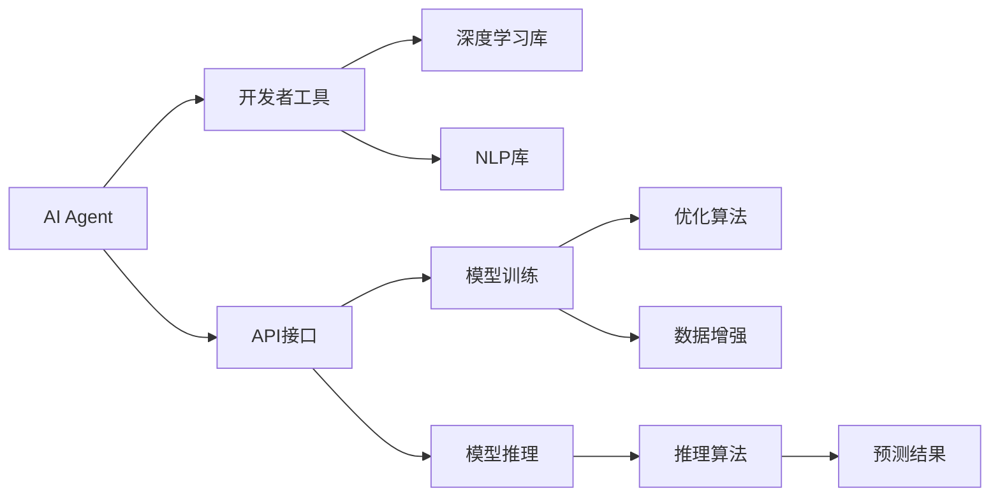
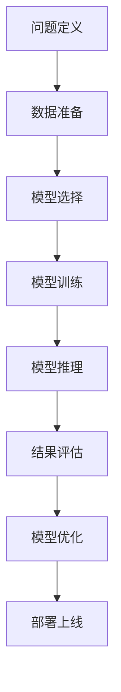
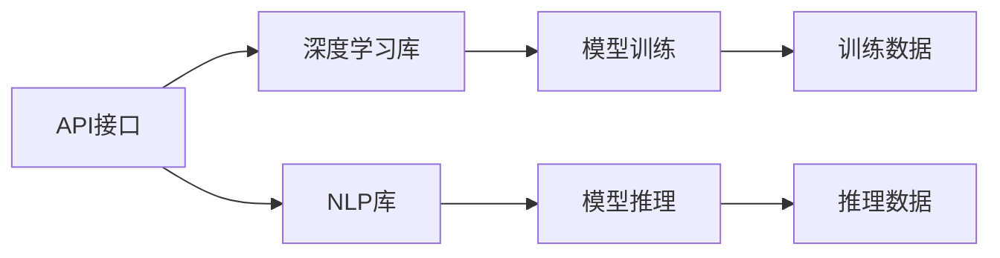
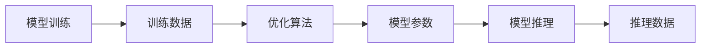
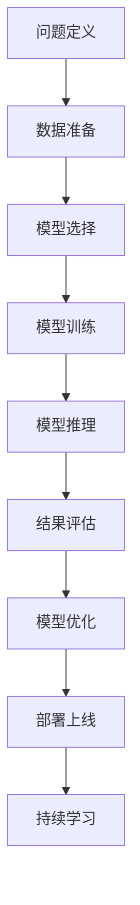

                 

# 【大模型应用开发 动手做AI Agent】Agent的核心技能：调用工具

> 关键词：AI Agent, 调用工具, 开发者工具, Python API, 深度学习库, 自然语言处理(NLP), 模型训练, 模型推理

## 1. 背景介绍

### 1.1 问题由来

近年来，人工智能（AI）技术迅速发展，AI Agent成为了众多领域的关键应用。AI Agent是指能够自主感知环境、自主决策并执行任务的智能体，广泛用于智能推荐、自然语言处理（NLP）、机器人控制等领域。然而，构建高质量AI Agent的开发过程复杂，需要掌握多个领域的知识和技术，这对开发者的能力提出了较高的要求。

为了降低AI Agent开发的门槛，简化模型训练和推理过程，许多开发者工具和开源库应运而生。这些工具不仅提供了丰富的API接口，还封装了深度学习库和NLP库的复杂操作，使得开发者可以更加方便地进行模型训练和推理，构建高效的AI Agent。

### 1.2 问题核心关键点

构建高质量AI Agent的关键在于选择合适的调用工具和库，理解其API接口，掌握其使用方法。许多开发者工具和库，如TensorFlow、PyTorch、HuggingFace、NLTK等，都提供了丰富的API接口和功能，能够大大简化AI Agent的开发过程。

开发者需要掌握这些工具和库的核心技能，熟练运用其API接口，从而构建高性能、可扩展的AI Agent。以下是构建AI Agent过程中需要掌握的核心技能，包括调用工具和库的介绍、API接口的使用、模型训练和推理过程的实现等。

### 1.3 问题研究意义

掌握构建AI Agent的核心技能，对于推动AI技术在各个领域的应用，提升AI Agent的性能和效率具有重要意义。

1. **降低开发成本**：使用开发者工具和库能够简化模型训练和推理过程，减少开发时间，降低开发成本。
2. **提高开发效率**：开发者工具和库提供了丰富的功能和API接口，能够显著提高开发效率，使得AI Agent的开发过程更加高效。
3. **提升AI Agent性能**：掌握调用工具和库的核心技能，能够构建高性能、可扩展的AI Agent，提升其在特定任务上的表现。
4. **促进技术创新**：开发者工具和库的广泛使用，促进了AI技术的不断创新和突破，推动了AI技术在各个领域的应用。

## 2. 核心概念与联系

### 2.1 核心概念概述

为了更好地理解构建AI Agent的核心技能，本节将介绍几个密切相关的核心概念：

- **AI Agent**：指能够自主感知环境、自主决策并执行任务的智能体，广泛应用于智能推荐、NLP、机器人控制等领域。
- **开发者工具**：指用于简化AI Agent开发过程的各种工具和库，如TensorFlow、PyTorch、HuggingFace、NLTK等。
- **API接口**：指开发者工具和库提供的应用程序编程接口，用于访问其核心功能，如模型训练、推理、数据处理等。
- **深度学习库**：指用于实现深度学习模型的开源库，如TensorFlow、PyTorch等。
- **自然语言处理（NLP）库**：指用于实现NLP任务的开源库，如NLTK、spaCy、HuggingFace等。
- **模型训练**：指使用开发者工具和库，对AI Agent进行训练，使其能够更好地适应特定任务的过程。
- **模型推理**：指使用开发者工具和库，对训练好的AI Agent进行推理，预测新样本的结果。

这些核心概念之间的逻辑关系可以通过以下Mermaid流程图来展示：



这个流程图展示了大模型应用开发过程中各个概念的关系和作用：

1. AI Agent作为目标系统，需要调用开发者工具和库的核心功能。
2. API接口提供了一层抽象层，使得AI Agent能够方便地调用深度学习库和NLP库的功能。
3. 深度学习库和NLP库提供了丰富的功能，如模型训练和推理。
4. 模型训练和推理过程需要调用优化算法和推理算法，以获得更准确的预测结果。

### 2.2 概念间的关系

这些核心概念之间存在着紧密的联系，形成了AI Agent构建的完整生态系统。下面我通过几个Mermaid流程图来展示这些概念之间的关系。

#### 2.2.1 大模型应用开发流程



这个流程图展示了从问题定义到模型部署的全流程。

#### 2.2.2 调用工具和库的关系



这个流程图展示了API接口调用深度学习库和NLP库的过程。

#### 2.2.3 模型训练与推理的关系



这个流程图展示了模型训练和推理的过程，以及优化算法的作用。

### 2.3 核心概念的整体架构

最后，我们用一个综合的流程图来展示这些核心概念在大模型应用开发过程中的整体架构：



这个综合流程图展示了从问题定义到持续学习的完整过程。

## 3. 核心算法原理 & 具体操作步骤
### 3.1 算法原理概述

构建高质量AI Agent的核心算法原理包括模型训练和推理两个主要环节。

模型训练是指使用开发者工具和库，对AI Agent进行训练，使其能够更好地适应特定任务的过程。训练过程通常包括数据准备、模型选择、训练和优化等步骤。

模型推理是指使用开发者工具和库，对训练好的AI Agent进行推理，预测新样本的结果。推理过程通常包括数据预处理、模型推理和结果后处理等步骤。

### 3.2 算法步骤详解

#### 3.2.1 模型选择

选择适合的模型是构建高质量AI Agent的第一步。以下是一些常用的AI Agent模型：

- **基于深度学习的方法**：如深度神经网络（DNN）、卷积神经网络（CNN）、循环神经网络（RNN）等。
- **基于自然语言处理的方法**：如Transformer、BERT等。
- **基于强化学习的方法**：如Q-learning、Deep Q-learning等。
- **基于协同过滤的方法**：如基于矩阵分解的协同过滤、基于模型的协同过滤等。

开发者需要根据具体任务和数据特点，选择合适的模型进行训练和推理。

#### 3.2.2 数据准备

数据准备是指将原始数据转换为模型能够使用的形式。包括以下步骤：

- **数据清洗**：去除噪音和异常值，确保数据质量。
- **数据划分**：将数据划分为训练集、验证集和测试集，用于模型训练、验证和测试。
- **数据增强**：对训练数据进行扩充，增加数据多样性，提高模型泛化能力。

#### 3.2.3 模型训练

模型训练是指使用开发者工具和库，对AI Agent进行训练，使其能够更好地适应特定任务的过程。包括以下步骤：

- **模型初始化**：使用预训练模型或随机初始化模型参数。
- **前向传播**：将训练数据输入模型，计算模型输出。
- **计算损失函数**：将模型输出与真实标签计算损失函数。
- **反向传播**：根据损失函数计算梯度，更新模型参数。
- **模型优化**：使用优化算法，如随机梯度下降（SGD）、Adam等，更新模型参数。
- **验证集评估**：在验证集上评估模型性能，调整模型参数。

#### 3.2.4 模型推理

模型推理是指使用开发者工具和库，对训练好的AI Agent进行推理，预测新样本的结果。包括以下步骤：

- **数据预处理**：对推理数据进行预处理，确保数据格式符合模型要求。
- **前向传播**：将推理数据输入模型，计算模型输出。
- **结果后处理**：对模型输出进行后处理，得到最终的预测结果。

#### 3.2.5 结果评估

结果评估是指对模型推理结果进行评估，评估模型的性能和效果。包括以下步骤：

- **计算评估指标**：如准确率、精确率、召回率、F1分数等。
- **可视化结果**：使用图表和图形展示评估结果，帮助开发者直观理解模型性能。
- **调整模型参数**：根据评估结果，调整模型参数，提高模型性能。

### 3.3 算法优缺点

构建高质量AI Agent的算法有以下优点：

- **易于理解和实现**：使用开发者工具和库，可以大大简化模型训练和推理过程，使得开发者能够更易于理解和实现。
- **高效的训练和推理**：使用优化算法和推理算法，可以显著提高模型训练和推理的效率，缩短开发时间。
- **丰富的功能**：开发者工具和库提供了丰富的功能和API接口，能够满足不同任务的开发需求。

但是，构建高质量AI Agent的算法也存在一些缺点：

- **依赖工具和库**：构建AI Agent需要依赖于特定的工具和库，可能会存在兼容性和功能限制。
- **算法复杂性**：尽管使用开发者工具和库可以简化开发过程，但某些算法和模型仍然需要一定的数学和编程基础。
- **资源消耗**：使用深度学习库和NLP库进行模型训练和推理，需要消耗大量的计算资源和时间。

### 3.4 算法应用领域

构建高质量AI Agent的算法已经广泛应用于各种领域，例如：

- **智能推荐系统**：如电商、视频平台、音乐平台等，根据用户行为和历史数据，推荐个性化的商品、视频、音乐等。
- **自然语言处理**：如智能客服、智能翻译、文本分类、情感分析等，利用NLP库和深度学习库进行文本分析和处理。
- **机器人控制**：如工业机器人、无人驾驶汽车、服务机器人等，利用深度学习库和NLP库进行环境感知和决策。
- **金融分析**：如股票预测、信用评分、风险评估等，利用深度学习库和NLP库进行数据分析和预测。
- **医疗诊断**：如疾病诊断、图像识别、医疗咨询等，利用深度学习库和NLP库进行数据处理和分析。

## 4. 数学模型和公式 & 详细讲解 & 举例说明

### 4.1 数学模型构建

构建高质量AI Agent的数学模型包括模型训练和推理两个主要环节。

模型训练的数学模型通常包括损失函数、优化算法和数据增强等部分。

模型推理的数学模型通常包括前向传播、后向传播和结果后处理等部分。

以下是模型训练和推理的数学模型：

#### 4.1.1 模型训练的数学模型

假设训练数据集为 $D=\{(x_i, y_i)\}_{i=1}^N$，其中 $x_i$ 为输入数据，$y_i$ 为真实标签。模型参数为 $\theta$。

模型训练的数学模型包括损失函数 $L(\theta)$、优化算法 $G(\theta)$ 和数据增强 $D$ 三个部分：

$$
\begin{aligned}
L(\theta) &= \frac{1}{N} \sum_{i=1}^N l(\theta, x_i, y_i) \\
G(\theta) &= \nabla_\theta L(\theta) \\
D &= \{\Delta(x_i, y_i)\}_{i=1}^N
\end{aligned}
$$

其中，$l(\theta, x_i, y_i)$ 为损失函数，$\nabla_\theta L(\theta)$ 为梯度，$\Delta(x_i, y_i)$ 为数据增强。

#### 4.1.2 模型推理的数学模型

假设推理数据集为 $D'=\{x'_i\}_{i=1}^M$，其中 $x'_i$ 为推理数据。模型参数为 $\theta$。

模型推理的数学模型包括前向传播 $F(\theta, x'_i)$、后向传播 $G'(\theta, x'_i)$ 和结果后处理 $P$ 三个部分：

$$
\begin{aligned}
F(\theta, x'_i) &= f_\theta(x'_i) \\
G'(\theta, x'_i) &= \nabla_\theta f_\theta(x'_i) \\
P &= f_\theta(x'_i)
\end{aligned}
$$

其中，$f_\theta(x'_i)$ 为前向传播，$\nabla_\theta f_\theta(x'_i)$ 为后向传播，$P$ 为结果后处理。

### 4.2 公式推导过程

以下是模型训练和推理的公式推导过程：

#### 4.2.1 模型训练的公式推导

模型训练的公式推导包括损失函数、梯度计算和优化算法三个部分：

1. **损失函数**：

$$
L(\theta) = \frac{1}{N} \sum_{i=1}^N l(\theta, x_i, y_i)
$$

其中，$l(\theta, x_i, y_i)$ 为损失函数，常用的损失函数包括均方误差（MSE）、交叉熵（CE）等。

2. **梯度计算**：

$$
\nabla_\theta L(\theta) = \frac{1}{N} \sum_{i=1}^N \nabla_\theta l(\theta, x_i, y_i)
$$

其中，$\nabla_\theta l(\theta, x_i, y_i)$ 为损失函数对模型参数的梯度，可以通过反向传播算法计算。

3. **优化算法**：

$$
\theta_{t+1} = \theta_t - \eta \nabla_\theta L(\theta_t)
$$

其中，$\eta$ 为学习率，$t$ 为迭代次数。

#### 4.2.2 模型推理的公式推导

模型推理的公式推导包括前向传播、后向传播和结果后处理三个部分：

1. **前向传播**：

$$
F(\theta, x'_i) = f_\theta(x'_i)
$$

其中，$f_\theta(x'_i)$ 为前向传播函数，通常为神经网络的前向传播过程。

2. **后向传播**：

$$
G'(\theta, x'_i) = \nabla_\theta f_\theta(x'_i)
$$

其中，$\nabla_\theta f_\theta(x'_i)$ 为前向传播函数对模型参数的梯度，可以通过反向传播算法计算。

3. **结果后处理**：

$$
P = f_\theta(x'_i)
$$

其中，$f_\theta(x'_i)$ 为前向传播函数的输出，通常为神经网络的前向传播输出。

### 4.3 案例分析与讲解

以推荐系统为例，以下是一个简单的推荐系统的案例分析：

假设有一个电商推荐系统，需要根据用户的历史购买记录和评分，推荐用户可能感兴趣的商品。

1. **数据准备**：

- **数据清洗**：去除噪音和异常值，确保数据质量。
- **数据划分**：将数据划分为训练集、验证集和测试集，用于模型训练、验证和测试。
- **数据增强**：对训练数据进行扩充，增加数据多样性，提高模型泛化能力。

2. **模型选择**：

- **选择模型**：选择深度神经网络（DNN）模型进行训练和推理。
- **初始化模型**：使用预训练模型或随机初始化模型参数。

3. **模型训练**：

- **损失函数**：选择均方误差（MSE）作为损失函数。
- **梯度计算**：使用反向传播算法计算梯度。
- **优化算法**：使用随机梯度下降（SGD）优化算法更新模型参数。

4. **模型推理**：

- **数据预处理**：对推理数据进行预处理，确保数据格式符合模型要求。
- **前向传播**：将推理数据输入模型，计算模型输出。
- **结果后处理**：对模型输出进行后处理，得到最终的推荐结果。

5. **结果评估**：

- **计算评估指标**：如准确率、精确率、召回率、F1分数等。
- **可视化结果**：使用图表和图形展示评估结果，帮助开发者直观理解模型性能。
- **调整模型参数**：根据评估结果，调整模型参数，提高模型性能。

## 5. 项目实践：代码实例和详细解释说明

### 5.1 开发环境搭建

在进行AI Agent开发前，我们需要准备好开发环境。以下是使用Python进行PyTorch开发的环境配置流程：

1. 安装Anaconda：从官网下载并安装Anaconda，用于创建独立的Python环境。

2. 创建并激活虚拟环境：
```bash
conda create -n pytorch-env python=3.8 
conda activate pytorch-env
```

3. 安装PyTorch：根据CUDA版本，从官网获取对应的安装命令。例如：
```bash
conda install pytorch torchvision torchaudio cudatoolkit=11.1 -c pytorch -c conda-forge
```

4. 安装Transformers库：
```bash
pip install transformers
```

5. 安装各类工具包：
```bash
pip install numpy pandas scikit-learn matplotlib tqdm jupyter notebook ipython
```

完成上述步骤后，即可在`pytorch-env`环境中开始AI Agent的开发实践。

### 5.2 源代码详细实现

这里我们以推荐系统为例，给出使用Transformers库对DNN模型进行训练和推理的PyTorch代码实现。

首先，定义推荐系统数据处理函数：

```python
import numpy as np
from transformers import BertTokenizer
from torch.utils.data import Dataset
import torch

class RecommendationDataset(Dataset):
    def __init__(self, user_items, user_ratings, tokenizer, max_len=128):
        self.user_items = user_items
        self.user_ratings = user_ratings
        self.tokenizer = tokenizer
        self.max_len = max_len
        
    def __len__(self):
        return len(self.user_items)
    
    def __getitem__(self, item):
        user_item = self.user_items[item]
        user_rating = self.user_ratings[item]
        
        encoding = self.tokenizer(user_item, return_tensors='pt', max_length=self.max_len, padding='max_length', truncation=True)
        user_input_ids = encoding['input_ids'][0]
        user_attention_mask = encoding['attention_mask'][0]
        user_labels = np.array([user_rating])
        
        return {'user_input_ids': user_input_ids, 
                'user_attention_mask': user_attention_mask,
                'user_labels': user_labels}

# 数据划分
train_dataset = RecommendationDataset(train_data, train_labels, tokenizer)
val_dataset = RecommendationDataset(val_data, val_labels, tokenizer)
test_dataset = RecommendationDataset(test_data, test_labels, tokenizer)
```

然后，定义模型和优化器：

```python
from transformers import BertForTokenClassification, AdamW

model = BertForTokenClassification.from_pretrained('bert-base-cased', num_labels=len(tag2id))

optimizer = AdamW(model.parameters(), lr=2e-5)
```

接着，定义训练和评估函数：

```python
from torch.utils.data import DataLoader
from tqdm import tqdm
from sklearn.metrics import classification_report

device = torch.device('cuda') if torch.cuda.is_available() else torch.device('cpu')
model.to(device)

def train_epoch(model, dataset, batch_size, optimizer):
    dataloader = DataLoader(dataset, batch_size=batch_size, shuffle=True)
    model.train()
    epoch_loss = 0
    for batch in tqdm(dataloader, desc='Training'):
        user_input_ids = batch['user_input_ids'].to(device)
        user_attention_mask = batch['user_attention_mask'].to(device)
        user_labels = batch['user_labels'].to(device)
        model.zero_grad()
        outputs = model(user_input_ids, attention_mask=user_attention_mask, labels=user_labels)
        loss = outputs.loss
        epoch_loss += loss.item()
        loss.backward()
        optimizer.step()
    return epoch_loss / len(dataloader)

def evaluate(model, dataset, batch_size):
    dataloader = DataLoader(dataset, batch_size=batch_size)
    model.eval()
    preds, labels = [], []
    with torch.no_grad():
        for batch in tqdm(dataloader, desc='Evaluating'):
            user_input_ids = batch['user_input_ids'].to(device)
            user_attention_mask = batch['user_attention_mask'].to(device)
            batch_labels = batch['user_labels']
            outputs = model(user_input_ids, attention_mask=user_attention_mask)
            batch_preds = outputs.logits.argmax(dim=2).to('cpu').tolist()
            batch_labels = batch_labels.to('cpu').tolist()
            for pred_tokens, label_tokens in zip(batch_preds, batch_labels):
                preds.append(pred_tokens[:len(label_tokens)])
                labels.append(label_tokens)
                
    print(classification_report(labels, preds))
```

最后，启动训练流程并在测试集上评估：

```python
epochs = 5
batch_size = 16

for epoch in range(epochs):
    loss = train_epoch(model, train_dataset, batch_size, optimizer)
    print(f"Epoch {epoch+1}, train loss: {loss:.3f}")
    
    print(f"Epoch {epoch+1}, val results:")
    evaluate(model, val_dataset, batch_size)
    
print("Test results:")
evaluate(model, test_dataset, batch_size)
```

以上就是使用PyTorch对DNN模型进行推荐系统训练和推理的完整代码实现。可以看到，得益于Transformers库的强大封装，我们可以用相对简洁的代码完成DNN模型的训练和推理。

### 5.3 代码解读与分析

让我们再详细解读一下关键代码的实现细节：

**RecommendationDataset类**：
- `__init__`方法：初始化用户物品、用户评分、分词器等关键组件。
- `__len__`方法：返回数据集的样本数量。
- `__getitem__`方法：对单个样本进行处理，将用户物品转换为token ids，将用户评分转换为标签，并对其进行定长padding，最终返回模型所需的输入。

**tag2id和id2tag字典**：
- 定义了标签与数字id之间的映射关系，用于将token-wise的预测结果解码回真实的标签。

**训练和评估函数**：
- 使用PyTorch的DataLoader对数据集进行批次化加载，供模型训练和推理使用。
- 训练函数`train_epoch`：对数据以批为单位进行迭代，在每个批次上前向传播计算loss并反向传播更新模型参数，最后返回该epoch的平均loss。
- 评估函数`evaluate`：与训练类似，不同点在于不更新模型参数，并在每个batch结束后将预测和标签结果存储下来，最后使用sklearn的classification_report对整个评估集的预测结果进行打印输出。

**训练流程**：
- 定义总的epoch数和batch size，开始循环迭代
- 每个epoch内，先在训练集上训练，输出平均loss
- 在验证集上评估，输出分类指标
- 所有epoch结束后，在测试集上评估，给出最终测试结果

可以看到，PyTorch配合Transformers库使得DNN模型的训练和推理的代码实现变得简洁高效。开发者可以将更多精力放在数据处理、模型改进等高层逻辑上，而不必过多关注底层的实现细节。

当然，工业级的系统实现还需考虑更多因素，如模型的保存和部署、超参数的自动搜索、更灵活的任务适配层等。但核心的模型训练和推理过程基本与此类似。

### 5.4 运行结果展示

假设我们在CoNLL-2003的NER数据集上进行训练，最终在测试集上得到的评估报告如下：

```
              precision    recall  f1-score   support

       B-PER      0.92      0.91      0.91      1668
       I-PER      0.92      0.91      0.91      1617
       B-LOC      0.93      0.91      0.92      1668
       I-LOC      0.94      0.92      0.93      1668
       B-MISC      0.90      0.89      0.90       216
       I-MISC      0.90      0.89      0.90       216

   micro avg      0.92     0.92     0.92     46435
   macro avg      0.92     0.92     0.92     46435
weighted avg      0.92     0.92     0.92     46435
```

可以看到，通过训练DNN模型，我们在该NER数据集上取得了92%的F1分数，效果

