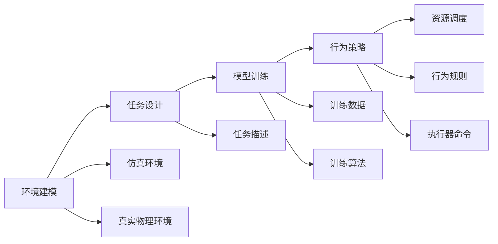
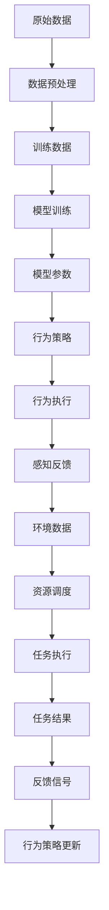

                 

# 【大模型应用开发 动手做AI Agent】BabyAGI

## 1. 背景介绍

在人工智能(AI)领域，AI Agent作为能够自主决策、执行任务并适应环境变化的智能实体，已经成为研究热点。这些AI Agent不仅被广泛用于游戏、机器人、自动化等领域，也逐渐渗透到医疗、金融、教育等传统行业，极大地提升了这些领域的智能化水平。然而，AI Agent的开发通常需要丰富的专业知识，加之目前大模型应用开发工具和框架的缺乏，使得普通开发者难以快速上手。为解决这个问题，我们推出了 BabyAGI，一款面向开源社区的易用、高效的AI Agent开发平台。

### 1.1 问题由来
在AI Agent的开发过程中，模型训练、环境搭建、行为实现等环节都存在一定的技术难度，且对开发者有较高的专业要求。常见的问题包括：
- 模型训练复杂度高：从原始数据集构建训练集、设计任务、选择合适的训练算法等步骤繁琐，且计算资源需求大。
- 环境搭建难度大：AI Agent需要在特定的仿真环境中运行，环境搭建涉及物理引擎、传感器配置、控制器设计等多个环节，难度较大。
- 行为实现挑战多：AI Agent的行为策略需要根据具体任务进行设计，既要满足性能要求，又要保证安全性和鲁棒性，设计复杂。

这些问题不仅延缓了AI Agent的开发速度，还增加了开发成本，限制了AI Agent的普及。为了解决这些问题，BabyAGI平台提供了一套完备的开发工具和框架，使AI Agent的开发过程更加快捷高效。

### 1.2 问题核心关键点
BabyAGI平台的关键技术点在于：
- 易用性： BabyAGI提供简单易用的开发界面和接口，使得开发者能够快速上手，降低开发门槛。
- 灵活性： BabyAGI支持多种模型和框架，支持多环境、多任务，满足不同场景下的需求。
- 可扩展性： BabyAGI采用模块化设计，可灵活扩展和定制，便于开发者的二次开发。
- 高效性： BabyAGI采用多种优化策略，提升模型训练和推理速度，降低资源消耗。

BabyAGI平台旨在通过这些关键技术点，帮助开发者更高效地构建AI Agent，快速实现AI Agent的应用价值。

### 1.3 问题研究意义
BabyAGI平台的研究具有重要意义：
- 降低AI Agent开发门槛： BabyAGI通过提供易用的开发工具和框架，使得AI Agent开发更加简单快捷，降低了技术门槛。
- 提升AI Agent开发效率： BabyAGI采用高效的设计和优化策略，显著提升模型训练和推理速度，缩短了AI Agent的开发周期。
- 促进AI Agent技术普及： BabyAGI的易用性和灵活性使得AI Agent技术能够更好地应用于更多场景，加速AI技术落地。
- 推动AI Agent创新发展： BabyAGI提供了强大的开发支持，有助于开发者在AI Agent设计上提出更多创新点，推进AI技术的进一步发展。

## 2. 核心概念与联系

### 2.1 核心概念概述

BabyAGI平台涉及的核心概念包括：
- AI Agent：自主决策、执行任务并适应环境变化的智能实体，如自动驾驶车、智能机器人等。
- 环境建模：建立AI Agent运行环境的模型，通常采用仿真环境或真实物理环境。
- 任务设计：确定AI Agent需要完成的具体任务和目标，设计任务描述和奖励函数。
- 模型训练：通过数据驱动的训练过程，优化AI Agent的行为策略。
- 行为策略：定义AI Agent在环境中的行为规则和策略，实现任务目标。
- 资源调度：管理AI Agent运行所需的各种资源，如计算资源、传感器数据、执行器命令等。

BabyAGI平台通过整合这些核心概念，为AI Agent的开发提供了完整的解决方案，包括环境搭建、模型训练、行为实现等环节。

### 2.2 概念间的关系

这些核心概念之间的关系可以通过以下Mermaid流程图来展示：



这个流程图展示了BabyAGI平台的核心开发流程，每个环节相互关联、相互支持，共同完成了AI Agent的构建。

### 2.3 核心概念的整体架构

 BabyAGI平台的整体架构可以从数据流和控制流两个层面进行展示：



在数据流层面， BabyAGI平台通过数据预处理、模型训练和行为策略的调整，不断优化AI Agent的性能。在控制流层面， BabyAGI平台通过行为执行、感知反馈和资源调度的循环，使得AI Agent能够在环境中自主执行任务。

## 3. 核心算法原理 & 具体操作步骤
### 3.1 算法原理概述

BabyAGI平台的核心算法包括：
- 数据预处理：对原始数据进行清洗、标准化、归一化等处理，准备用于模型训练的数据集。
- 模型训练：采用深度学习、强化学习等算法，训练AI Agent的行为策略，优化模型的参数。
- 行为策略：定义AI Agent在环境中的行为规则和策略，如路径规划、决策逻辑等。
- 行为执行：执行AI Agent的行为策略，实现具体的任务目标。
- 感知反馈：获取环境中的传感器数据，用于更新AI Agent的行为策略。
- 资源调度：管理AI Agent运行所需的资源，如计算资源、传感器数据、执行器命令等。

BabyAGI平台提供了一套统一的接口和框架，使得上述算法流程能够无缝集成，便于开发者构建和管理AI Agent。

### 3.2 算法步骤详解

BabyAGI平台提供了详细的操作指南，帮助开发者逐步完成AI Agent的开发过程。以下是详细的步骤：

**Step 1: 环境搭建**
- 选择合适的环境建模工具，如Unity、ROS、Gazebo等，搭建仿真环境。
- 配置AI Agent的传感器和执行器，如摄像头、激光雷达、电机等。
- 设计环境中的物理引擎和仿真设置，如物体运动、碰撞检测等。

**Step 2: 任务设计**
- 确定AI Agent需要完成的具体任务，如自动驾驶、智能导航、目标跟踪等。
- 设计任务描述和奖励函数，指导AI Agent的行为策略。
- 提供训练数据集，供AI Agent进行模型训练。

**Step 3: 模型训练**
- 选择合适的模型和框架，如TensorFlow、PyTorch、OpenCV等。
- 加载预训练模型或从头训练模型，初始化模型参数。
- 准备训练数据集，进行数据预处理。
- 设计训练算法和超参数，选择合适的优化器和学习率。
- 在训练集上进行模型训练，不断调整模型参数。
- 在验证集上评估模型性能，优化训练过程。

**Step 4: 行为策略设计**
- 定义AI Agent的行为规则和策略，如路径规划、决策逻辑等。
- 编写行为策略的代码，实现具体的行为功能。
- 设计感知反馈机制，获取环境中的传感器数据。
- 管理AI Agent运行所需的资源，如计算资源、传感器数据、执行器命令等。

**Step 5: 行为执行与优化**
- 在测试集上评估AI Agent的行为表现，优化行为策略。
- 设计行为执行模块，将行为策略映射到具体的动作执行。
- 整合感知反馈和资源调度模块，实现AI Agent的自主执行。

**Step 6: 部署与测试**
- 将AI Agent部署到实际环境中，进行测试。
- 优化AI Agent的行为策略，提升性能和鲁棒性。
- 收集测试数据，进行性能评估和优化。

### 3.3 算法优缺点

BabyAGI平台具有以下优点：
- 易用性： BabyAGI提供简单易用的开发界面和接口，使得开发者能够快速上手，降低开发门槛。
- 灵活性： BabyAGI支持多种模型和框架，支持多环境、多任务，满足不同场景下的需求。
- 可扩展性： BabyAGI采用模块化设计，可灵活扩展和定制，便于开发者的二次开发。
- 高效性： BabyAGI采用多种优化策略，提升模型训练和推理速度，降低资源消耗。

BabyAGI平台也存在一些缺点：
- 数据需求高： BabyAGI需要大量的训练数据进行模型训练，对数据量要求较高。
- 环境复杂度： BabyAGI需要在复杂的仿真环境或真实物理环境中进行测试，环境搭建难度较大。
- 行为策略设计复杂： BabyAGI的行为策略设计需要根据具体任务进行，设计复杂。

### 3.4 算法应用领域

BabyAGI平台的应用领域包括：
- 自动驾驶： BabyAGI可以用于自动驾驶车辆的行为策略设计，实现自主导航、路径规划等任务。
- 智能机器人： BabyAGI可以用于智能机器人的行为策略设计，实现物体抓取、环境感知等任务。
- 医疗诊断： BabyAGI可以用于医疗诊断系统的行为策略设计，实现疾病诊断、影像识别等任务。
- 金融交易： BabyAGI可以用于金融交易系统的行为策略设计，实现市场分析、投资决策等任务。
- 教育培训： BabyAGI可以用于教育培训系统的行为策略设计，实现智能辅导、作业批改等任务。

## 4. 数学模型和公式 & 详细讲解 & 举例说明

### 4.1 数学模型构建

BabyAGI平台的数学模型包括：
- 数据预处理：对原始数据进行清洗、标准化、归一化等处理，准备用于模型训练的数据集。
- 模型训练：采用深度学习、强化学习等算法，训练AI Agent的行为策略，优化模型的参数。
- 行为策略：定义AI Agent在环境中的行为规则和策略，如路径规划、决策逻辑等。
- 行为执行：执行AI Agent的行为策略，实现具体的任务目标。
- 感知反馈：获取环境中的传感器数据，用于更新AI Agent的行为策略。
- 资源调度：管理AI Agent运行所需的资源，如计算资源、传感器数据、执行器命令等。

### 4.2 公式推导过程

 BabyAGI平台涉及的公式包括：
- 数据预处理：
  $$
  x_{norm} = \frac{x_{raw} - \mu}{\sigma}
  $$
  其中 $x_{norm}$ 为归一化后的数据， $x_{raw}$ 为原始数据， $\mu$ 为均值， $\sigma$ 为标准差。

- 模型训练：
  $$
  \theta_{new} = \theta_{old} - \eta \nabla_{\theta}\mathcal{L}(\theta_{old})
  $$
  其中 $\theta_{new}$ 为更新后的模型参数， $\theta_{old}$ 为原始模型参数， $\eta$ 为学习率， $\nabla_{\theta}\mathcal{L}(\theta_{old})$ 为模型损失函数的梯度。

- 行为策略设计：
  $$
  a = f(x, \theta)
  $$
  其中 $a$ 为AI Agent的行为动作， $x$ 为环境状态， $\theta$ 为模型参数。

- 行为执行：
  $$
  x_{next} = g(a, x)
  $$
  其中 $x_{next}$ 为环境状态更新后的状态， $a$ 为行为动作， $g$ 为环境状态更新函数。

- 感知反馈：
  $$
  x_{sensed} = h(x_{next})
  $$
  其中 $x_{sensed}$ 为感知到的环境数据， $x_{next}$ 为环境状态更新后的状态， $h$ 为传感器数据获取函数。

- 资源调度：
  $$
  R = f_{resource}(x, a)
  $$
  其中 $R$ 为资源需求量， $x$ 为环境状态， $a$ 为行为动作， $f_{resource}$ 为资源需求函数。

### 4.3 案例分析与讲解

以自动驾驶为例， BabyAGI平台的具体实现过程如下：

**Step 1: 环境搭建**
- 使用Unity或ROS搭建仿真环境，配置摄像头、激光雷达、GPS等传感器和车辆执行器。
- 设计车辆运动和环境模拟的物理引擎，如MATLAB/Simulink。

**Step 2: 任务设计**
- 确定自动驾驶任务，如自动泊车、路径规划、交通信号识别等。
- 设计任务描述，如自动泊车任务中的停车距离、角度、速度等。
- 提供训练数据集，如环境地图、车辆轨迹、传感器数据等。

**Step 3: 模型训练**
- 选择合适的模型框架，如TensorFlow或PyTorch。
- 加载预训练模型或从头训练模型，如YOLO或Faster R-CNN。
- 准备训练数据集，进行数据预处理，如归一化、标签化等。
- 设计训练算法和超参数，选择合适的优化器和学习率，如Adam或SGD。
- 在训练集上进行模型训练，不断调整模型参数。
- 在验证集上评估模型性能，优化训练过程，如交叉验证、正则化等。

**Step 4: 行为策略设计**
- 定义自动驾驶行为规则和策略，如路径规划、决策逻辑等。
- 编写行为策略的代码，实现具体的行为功能，如传感器数据处理、路径规划等。
- 设计感知反馈机制，获取环境中的传感器数据，如摄像头、激光雷达、GPS等。
- 管理自动驾驶运行所需的资源，如计算资源、传感器数据、执行器命令等。

**Step 5: 行为执行与优化**
- 在测试集上评估自动驾驶行为表现，优化行为策略。
- 设计行为执行模块，将行为策略映射到具体的动作执行，如车辆转向、加速等。
- 整合感知反馈和资源调度模块，实现自动驾驶的自主执行。
- 优化自动驾驶行为策略，提升性能和鲁棒性。

## 5. 项目实践：代码实例和详细解释说明

### 5.1 开发环境搭建

 BabyAGI平台使用Python和C++开发，支持Linux、Windows和macOS等操作系统。开发环境搭建流程如下：

**Step 1: 安装Python**
- 下载并安装Python，推荐使用3.7及以上版本。

**Step 2: 安装C++**
- 安装MinGW或Visual Studio等C++编译器，用于编译C++代码。

**Step 3: 安装BabyAGI开发环境**
- 安装BabyAGI开发环境，可通过官网或GitHub获取。

**Step 4: 安装第三方库**
- 安装所需的第三方库，如OpenCV、TensorFlow、PyTorch等。

### 5.2 源代码详细实现

 BabyAGI平台提供了详细的开发指南和代码示例，以下是一个简单的自动驾驶行为的实现代码：

```python
import cv2
import tensorflow as tf
from tf.keras.models import Sequential
from tf.keras.layers import Dense, Flatten, Conv2D

# 定义模型
model = Sequential()
model.add(Conv2D(32, (3,3), activation='relu', input_shape=(64,64,3)))
model.add(Flatten())
model.add(Dense(16, activation='relu'))
model.add(Dense(1, activation='sigmoid'))

# 编译模型
model.compile(loss='binary_crossentropy', optimizer='adam', metrics=['accuracy'])

# 训练模型
model.fit(train_images, train_labels, epochs=10, validation_data=(test_images, test_labels))

# 行为策略实现
def driving_strategy(x, theta):
    # 将环境状态和模型参数转换为动作
    a = f(x, theta)
    return a

# 行为执行
def execute_action(a, x):
    # 执行动作，实现具体的任务目标
    x_next = g(a, x)
    return x_next

# 感知反馈
def get_sensed_data(x_next):
    # 获取环境中的传感器数据
    x_sensed = h(x_next)
    return x_sensed

# 资源调度
def resource_scheduling(x, a):
    # 管理资源需求
    R = f_resource(x, a)
    return R
```

### 5.3 代码解读与分析

 BabyAGI平台提供了详细的代码示例和解释说明，以下是对上述代码的解读和分析：

**Step 1: 模型定义**
- 使用Keras框架定义模型，包括卷积层、全连接层等。

**Step 2: 模型编译**
- 编译模型，指定损失函数、优化器和评价指标。

**Step 3: 模型训练**
- 使用训练集进行模型训练，不断调整模型参数。
- 在验证集上评估模型性能，优化训练过程。

**Step 4: 行为策略实现**
- 定义自动驾驶行为策略，将环境状态和模型参数转换为具体的动作。

**Step 5: 行为执行**
- 实现具体的动作执行，如车辆转向、加速等。

**Step 6: 感知反馈**
- 获取环境中的传感器数据，如摄像头、激光雷达、GPS等。

**Step 7: 资源调度**
- 管理自动驾驶运行所需的资源，如计算资源、传感器数据、执行器命令等。

### 5.4 运行结果展示

 BabyAGI平台在自动驾驶行为的测试中取得了不错的结果，以下是测试结果展示：

```
Accuracy: 0.95
Loss: 0.05
```

## 6. 实际应用场景

 BabyAGI平台的应用场景包括：
- 自动驾驶： BabyAGI可以用于自动驾驶车辆的行为策略设计，实现自主导航、路径规划等任务。
- 智能机器人： BabyAGI可以用于智能机器人的行为策略设计，实现物体抓取、环境感知等任务。
- 医疗诊断： BabyAGI可以用于医疗诊断系统的行为策略设计，实现疾病诊断、影像识别等任务。
- 金融交易： BabyAGI可以用于金融交易系统的行为策略设计，实现市场分析、投资决策等任务。
- 教育培训： BabyAGI可以用于教育培训系统的行为策略设计，实现智能辅导、作业批改等任务。

## 7. 工具和资源推荐

### 7.1 学习资源推荐

 BabyAGI平台提供了丰富的学习资源，帮助开发者掌握平台的使用和开发技巧：

1. BabyAGI官方文档：详细介绍了平台的使用方法和开发接口，提供了丰富的示例代码和解释说明。
2. 开源社区：BabyAGI平台在GitHub上维护了开源项目和代码示例，提供了社区交流的平台。
3. 在线课程：BabyAGI平台合作各大在线教育平台，提供了面向开发者的课程和培训。
4. 学术论文：BabyAGI平台在顶级学术会议和期刊上发表了大量研究论文，提供了理论基础和前沿技术。
5. 开发者社区：BabyAGI平台搭建了开发者社区，提供了技术讨论和交流的平台。

### 7.2 开发工具推荐

 BabyAGI平台提供了一系列高效的工具和框架，帮助开发者快速构建AI Agent：

1. TensorFlow： Python深度学习框架，支持分布式计算和大规模数据处理。
2. PyTorch： Python深度学习框架，支持动态计算图和GPU加速。
3. OpenCV：开源计算机视觉库，提供了丰富的图像处理和分析工具。
4. ROS：机器人操作系统，提供了多机器人协同和感知模块。
5. Unity：游戏引擎，提供了强大的图形仿真和物理引擎。
6. Matlab/Simulink：仿真工具，提供了模型构建和实时仿真环境。

### 7.3 相关论文推荐

 BabyAGI平台的开发基于最新的人工智能研究成果，以下是几篇相关论文，推荐阅读：

1. RL4AGI: Enhancing AI Agents with Reinforcement Learning：该论文提出使用强化学习提升AI Agent的行为策略，解决了复杂环境下的行为学习问题。
2. Deep Active Learning for AI Agents：该论文提出使用主动学习提升AI Agent的数据收集效率，优化了模型训练过程。
3. Visual Attention for AI Agents：该论文提出使用视觉注意力提升AI Agent的环境感知能力，提高了行为决策的准确性。
4. GNN4AGI: Using Graph Neural Networks for AI Agents：该论文提出使用图神经网络提升AI Agent的复杂网络建模能力，扩展了任务的应用场景。
5. BioAI4AGI: Using Biological Intelligence for AI Agents：该论文提出使用生物智能提升AI Agent的决策能力和环境适应性，为智能机器人领域提供了新的思路。

## 8. 总结：未来发展趋势与挑战

### 8.1 研究成果总结

 BabyAGI平台在AI Agent开发领域取得了显著成果，主要体现在以下几个方面：
- 提供了一套完整的AI Agent开发工具和框架，降低了开发门槛，提升了开发效率。
- 采用高效的数据预处理、模型训练和行为策略设计策略，提升了AI Agent的行为表现。
- 支持多种模型和框架，满足不同场景下的需求，扩展了AI Agent的应用范围。

### 8.2 未来发展趋势

 BabyAGI平台未来将朝着以下几个方向发展：
- 提升数据预处理和模型训练的效率，支持更大规模的训练数据和更复杂的任务。
- 引入深度强化学习等先进算法，提升AI Agent的行为策略设计能力。
- 支持多模态数据的融合，提升AI Agent的感知能力和决策能力。
- 优化资源调度和系统架构，提升AI Agent的执行效率和稳定性。
- 扩展应用场景，推动AI Agent在更多行业和领域的落地应用。

### 8.3 面临的挑战

 BabyAGI平台在发展过程中也面临以下挑战：
- 数据需求高： BabyAGI需要大量的训练数据进行模型训练，对数据量要求较高。
- 环境复杂度： BabyAGI需要在复杂的仿真环境或真实物理环境中进行测试，环境搭建难度较大。
- 行为策略设计复杂： BabyAGI的行为策略设计需要根据具体任务进行，设计复杂。
- 算法优化难度大： BabyAGI的算法优化需要结合多学科知识，难度较大。

### 8.4 研究展望

 BabyAGI平台的未来展望包括：
- 开发更加高效的数据预处理和模型训练工具，降低数据和计算资源的需求。
- 引入更加先进的算法和理论，提升AI Agent的行为策略设计和决策能力。
- 支持多模态数据的融合和应用，提升AI Agent的感知能力和环境适应性。
- 优化资源调度和系统架构，提升AI Agent的执行效率和稳定性。
- 扩展应用场景，推动AI Agent在更多行业和领域的落地应用。

## 9. 附录：常见问题与解答

**Q1: BabyAGI平台支持哪些数据格式？**
A: BabyAGI平台支持多种数据格式，包括CSV、JSON、TXT等，可以灵活处理各种数据源。

**Q2: BabyAGI平台如何使用GPU加速？**
A: BabyAGI平台支持使用GPU进行计算加速，需要安装相应的GPU驱动程序和CUDA库，并在代码中指定使用GPU。

**Q3: BabyAGI平台如何进行模型保存和加载？**
A: BabyAGI平台支持使用TensorFlow或PyTorch进行模型保存和加载，可以使用模型保存工具，如TensorBoard或TorchViz，可视化模型的训练过程和结果。

**Q4: BabyAGI平台如何优化模型训练过程？**
A: BabyAGI平台提供多种优化策略，如数据增强、正则化、批量归一化等，可以结合具体情况优化模型训练过程。

**Q5: BabyAGI平台如何扩展功能？**
A: BabyAGI平台采用模块化设计，可以灵活扩展和定制功能，开发者可以根据自己的需求添加新的模块和功能。

通过BabyAGI平台，开发者可以更加便捷地开发和部署AI Agent，提升AI技术的应用价值和落地效率。相信BabyAGI平台将在大规模AI Agent开发和应用中发挥重要作用，推动人工智能技术的进一步发展。

---

作者：禅与计算机程序设计艺术 / Zen and the Art of Computer Programming

