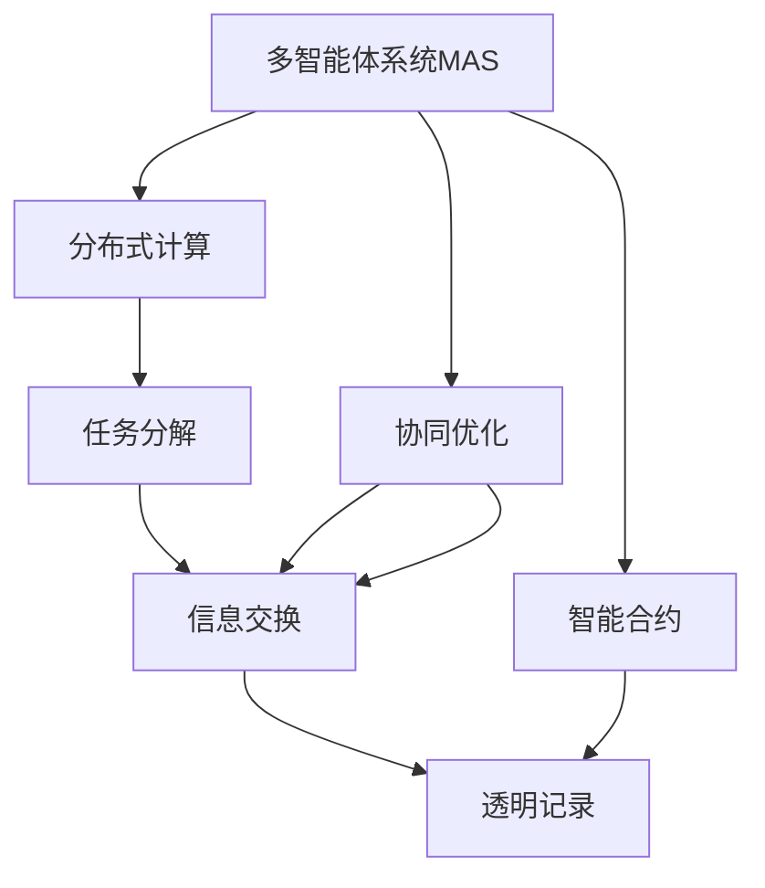
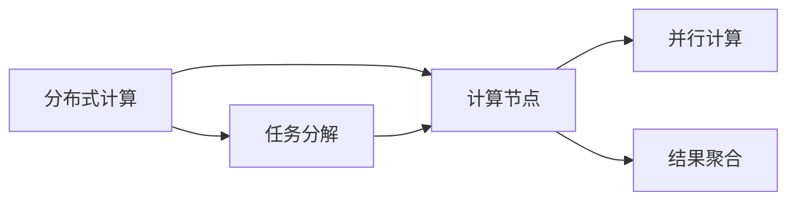
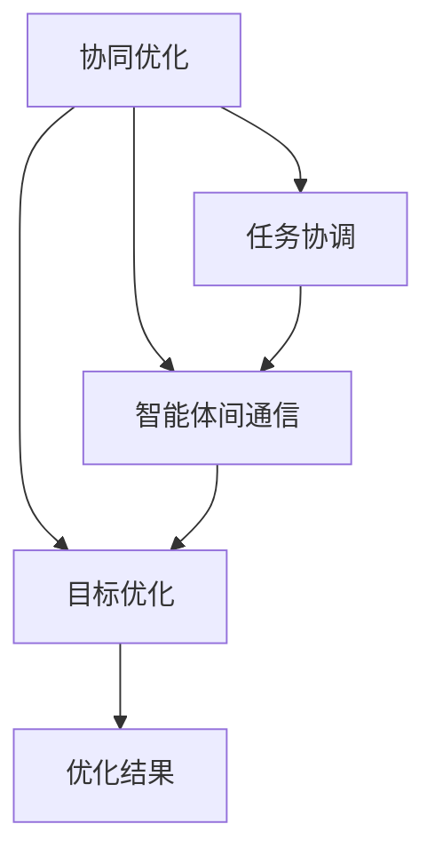
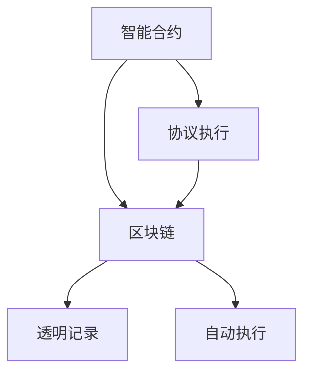
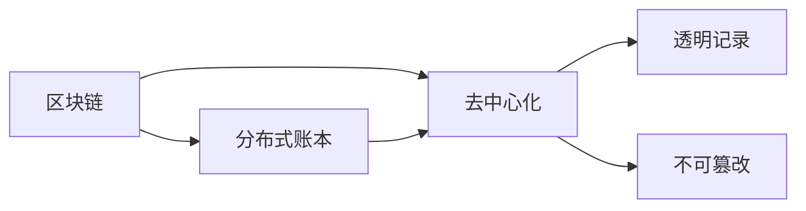
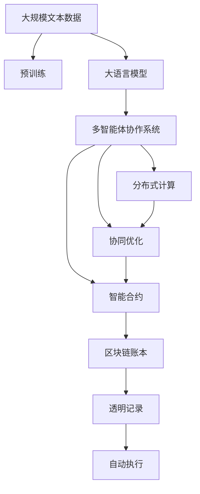

                 

# 【大模型应用开发 动手做AI Agent】多Agent协作

> 关键词：多智能体系统(MAS)、分布式计算、协调算法、协同优化、智能合约、区块链

## 1. 背景介绍

### 1.1 问题由来
随着人工智能技术的快速发展，越来越多的应用场景开始引入多智能体系统(MAS)来解决问题。MAS由多个智能体组成，每个智能体在分布式环境中独立决策并相互交互，协同完成复杂任务。MAS在自动驾驶、社交网络、供应链管理、机器人协作等领域有着广泛的应用前景。

然而，多智能体系统的设计和实现面临着诸多挑战。由于智能体之间存在异构性、信息不对称等问题，实现高效协调和优化是极具挑战性的任务。本文将围绕多智能体协作展开，探讨如何使用基于大模型的AI Agent来实现MAS的构建和优化。

### 1.2 问题核心关键点
在多智能体系统中，各个智能体的协同工作需要高度的协作和优化。本文聚焦于基于大模型的AI Agent协作，但同时也会兼顾分布式计算、协同优化等前沿技术，以期对多智能体协作实践提供更全面的指导。

具体来说，我们关注以下核心问题：
1. 如何构建高效的多智能体系统，通过智能体间的协作完成复杂任务？
2. 在分布式环境中，如何优化智能体间的信息传递和决策过程？
3. 如何在大模型基础上实现智能体的高效协作和任务优化？
4. 如何将智能体协作与区块链技术结合，实现安全和透明的协作？

这些核心问题将通过以下章节进行详细探讨。

### 1.3 问题研究意义
研究多智能体系统的协作机制，对于拓展人工智能的应用范围，提升复杂任务的处理效率，加速各行各业的智能化进程，具有重要意义：

1. 降低应用开发成本。基于大模型的AI Agent可以显著减少从头开发所需的数据、计算和人力等成本投入。
2. 提升系统效果。多智能体系统的协作机制可以提升系统对复杂任务的鲁棒性和适应性，在应用场景中取得更优表现。
3. 加速开发进度。standing on the shoulders of giants，AI Agent可以更快地完成任务适配，缩短开发周期。
4. 带来技术创新。协作机制的研究促进了对预训练-微调的深入研究，催生了协同优化、智能合约等新的研究方向。
5. 赋能产业升级。多智能体协作使得AI技术更容易被各行各业所采用，为传统行业数字化转型升级提供新的技术路径。

## 2. 核心概念与联系

### 2.1 核心概念概述

为更好地理解基于大模型的多智能体协作方法，本节将介绍几个密切相关的核心概念：

- 多智能体系统(MAS)：由多个智能体组成，每个智能体在分布式环境中独立决策并相互交互，协同完成复杂任务。
- 分布式计算：将任务分解成多个子任务，在不同的计算节点上并行执行，以提高计算效率和可靠性。
- 协同优化：通过协调不同智能体间的工作，优化整体系统性能，提高任务完成效率。
- 智能合约：在区块链上运行的自动执行合同，通过代码实现智能体间的协议和规则。
- 区块链：一种去中心化的分布式账本技术，具有透明、不可篡改的特性。

这些核心概念之间的逻辑关系可以通过以下Mermaid流程图来展示：



这个流程图展示了大模型基础上的多智能体系统的核心概念及其之间的关系：

1. 多智能体系统通过分布式计算分解任务，提高计算效率。
2. 协同优化机制协调智能体间的工作，提升整体系统性能。
3. 智能合约通过区块链技术实现智能体间的透明记录和自动执行。
4. 区块链提供透明、不可篡改的特性，保障系统的安全性和可靠性。

这些核心概念共同构成了基于大模型的多智能体协作系统的完整生态系统，使其能够在各种场景下发挥强大的协同作用。通过理解这些核心概念，我们可以更好地把握多智能体协作系统的工作原理和优化方向。

### 2.2 概念间的关系

这些核心概念之间存在着紧密的联系，形成了基于大模型的多智能体协作系统的完整生态系统。下面我通过几个Mermaid流程图来展示这些概念之间的关系。

#### 2.2.1 分布式计算与多智能体系统



这个流程图展示了分布式计算的基本原理，以及它与多智能体系统的关系。分布式计算通过将任务分解成多个子任务，在不同的计算节点上并行执行，以提高计算效率。多智能体系统则是通过协同工作，将分布式计算的结果进行聚合，完成复杂的协同任务。

#### 2.2.2 协同优化与多智能体系统



这个流程图展示了协同优化的基本原理，以及它与多智能体系统的关系。协同优化通过协调不同智能体间的工作，优化整体系统性能。在多智能体系统中，智能体间通过通信和信息交换，共享数据和决策结果，共同优化系统性能。

#### 2.2.3 智能合约与多智能体系统



这个流程图展示了智能合约的基本原理，以及它与多智能体系统的关系。智能合约通过区块链技术实现智能体间的透明记录和自动执行。在多智能体系统中，智能体间的协议和规则通过智能合约进行编码，并在区块链上运行，保障系统的安全性和透明度。

#### 2.2.4 区块链与多智能体系统



这个流程图展示了区块链的基本原理，以及它与多智能体系统的关系。区块链提供透明、不可篡改的特性，保障系统的安全性和可靠性。在多智能体系统中，智能体间的信息记录和协议执行通过区块链进行，保障数据的安全性和不可篡改性。

### 2.3 核心概念的整体架构

最后，我们用一个综合的流程图来展示这些核心概念在大模型基础上的多智能体协作系统中的整体架构：



这个综合流程图展示了从预训练到大模型基础上的多智能体协作系统的完整过程。大语言模型首先在大规模文本数据上进行预训练，然后通过分布式计算和多智能体协作系统完成复杂任务。协同优化和智能合约通过区块链技术，实现智能体间的透明记录和自动执行，保障系统的安全性和可靠性。通过这些核心概念和技术的结合，大模型在多智能体协作中发挥着重要的作用。

## 3. 核心算法原理 & 具体操作步骤
### 3.1 算法原理概述

基于大模型的多智能体协作系统，本质上是一个通过协同优化机制实现高效任务完成的系统。其核心思想是：将任务分解成多个子任务，在不同的智能体上并行执行，同时通过协同优化机制协调智能体间的工作，确保系统整体性能的最优化。

形式化地，假设多智能体系统由 $n$ 个智能体 $A_i$ 组成，每个智能体 $A_i$ 的任务为 $T_i$。定义智能体间的通信协议为 $\pi$，协同优化的目标函数为 $\mathcal{L}$。则协同优化的优化目标是最小化系统整体损失，即找到最优的通信协议 $\pi$：

$$
\pi^* = \mathop{\arg\min}_{\pi} \mathcal{L}(\pi)
$$

其中 $\mathcal{L}$ 为针对任务 $T$ 设计的损失函数，用于衡量系统整体性能与目标之间的差异。常见的损失函数包括任务完成度、时间延时等。

通过梯度下降等优化算法，协同优化过程不断更新通信协议 $\pi$，最小化损失函数 $\mathcal{L}$，使得系统整体性能逼近目标。由于 $\pi$ 已经通过大模型获得了一定的基础表示，因此即便在分布式环境中，也能较快收敛到理想的通信协议 $\pi^*$。

### 3.2 算法步骤详解

基于大模型的多智能体协作系统一般包括以下几个关键步骤：

**Step 1: 准备预训练模型和数据集**
- 选择合适的预训练语言模型 $M_{\theta}$ 作为初始化参数，如 GPT 系列模型。
- 准备多智能体系统的标注数据集 $D=\{(x_i,y_i)\}_{i=1}^N$，划分为训练集、验证集和测试集。

**Step 2: 设计通信协议**
- 根据任务类型，设计合适的通信协议，用于指导智能体间的数据交换和任务协作。
- 设计合适的损失函数，用于衡量智能体间的数据交换和任务协作效果。

**Step 3: 设置优化超参数**
- 选择合适的优化算法及其参数，如 AdamW、SGD 等，设置学习率、批大小、迭代轮数等。
- 设置正则化技术及强度，包括权重衰减、Dropout、Early Stopping 等。
- 确定冻结预训练参数的策略，如仅微调顶层，或全部参数都参与微调。

**Step 4: 执行协同优化**
- 将训练集数据分批次输入系统，前向传播计算损失函数。
- 反向传播计算通信协议梯度，根据设定的优化算法和学习率更新通信协议。
- 周期性在验证集上评估系统性能，根据性能指标决定是否触发 Early Stopping。
- 重复上述步骤直到满足预设的迭代轮数或 Early Stopping 条件。

**Step 5: 测试和部署**
- 在测试集上评估协同优化后的系统性能，对比协同优化前后的精度提升。
- 使用协同优化后的系统对新样本进行推理预测，集成到实际的应用系统中。
- 持续收集新的数据，定期重新协同优化系统，以适应数据分布的变化。

以上是基于大模型的多智能体协作系统的通用流程。在实际应用中，还需要针对具体任务的特点，对协同优化过程的各个环节进行优化设计，如改进训练目标函数，引入更多的正则化技术，搜索最优的超参数组合等，以进一步提升系统性能。

### 3.3 算法优缺点

基于大模型的多智能体协作系统具有以下优点：
1. 高效协作。通过分布式计算和多智能体协作系统，可以显著提高任务完成的效率。
2. 可扩展性强。利用大模型的预训练知识，可以轻松扩展到更多的智能体和任务。
3. 自适应能力强。大模型的自适应能力使得系统可以自动适应数据分布的变化，提升系统性能。
4. 参数高效。利用参数高效微调技术，在固定大部分预训练参数的情况下，仍可取得不错的提升。
5. 效果显著。在学术界和工业界的诸多任务上，基于协同优化的多智能体系统已经刷新了最先进的性能指标。

同时，该方法也存在一定的局限性：
1. 依赖标注数据。协同优化的效果很大程度上取决于标注数据的质量和数量，获取高质量标注数据的成本较高。
2. 通信开销较大。在分布式环境中，智能体间的通信开销是系统性能的重要瓶颈。
3. 易受噪声干扰。系统中的通信协议和优化算法可能受到噪声干扰，导致系统性能波动。
4. 可解释性不足。协同优化模型的决策过程通常缺乏可解释性，难以对其推理逻辑进行分析和调试。

尽管存在这些局限性，但就目前而言，基于大模型的协同优化方法仍是多智能体协作的重要范式。未来相关研究的重点在于如何进一步降低协同优化对标注数据的依赖，提高系统的少样本学习和跨领域迁移能力，同时兼顾可解释性和伦理安全性等因素。

### 3.4 算法应用领域

基于大模型的多智能体协作系统已经在多个领域得到了广泛的应用，例如：

- 自动驾驶：多个车辆通过通信协议协作，实现自动驾驶和协同避障。
- 机器人协作：多个机器人通过通信协议协作，完成复杂的物流和生产任务。
- 医疗协同：多个医生通过通信协议协作，进行疾病诊断和治疗方案制定。
- 金融系统：多个金融机构通过通信协议协作，进行风险管理和市场预测。
- 供应链管理：多个供应链节点通过通信协议协作，优化供应链的效率和成本。
- 社交网络：多个社交节点通过通信协议协作，实现信息传播和知识共享。

除了上述这些经典应用外，多智能体协作系统还被创新性地应用到更多场景中，如网络安全、环境监测、能源管理等，为多智能体协作带来了全新的突破。随着大模型和协同优化方法的不断进步，相信多智能体协作系统将在更广阔的应用领域大放异彩。

## 4. 数学模型和公式 & 详细讲解  
### 4.1 数学模型构建

本节将使用数学语言对基于大模型的多智能体协作系统进行更加严格的刻画。

记多智能体系统为 $A=\{A_1,A_2,...,A_n\}$，每个智能体 $A_i$ 的任务为 $T_i$，通信协议为 $\pi$。定义系统整体损失为 $\mathcal{L}$，其中 $\mathcal{L}$ 可以表示为任务完成度、时间延时等指标。

### 4.2 公式推导过程

以下我们以任务完成度为例，推导协同优化的损失函数及其梯度的计算公式。

假设系统整体完成度为 $C(\pi)$，则协同优化的目标函数为：

$$
\mathcal{L}(\pi) = \sum_{i=1}^n \sum_{j=1}^n W_{ij} \ell_i(C(\pi))
$$

其中 $W_{ij}$ 为智能体间通信的权重，$\ell_i$ 为任务 $T_i$ 的损失函数。

根据链式法则，损失函数对通信协议 $\pi$ 的梯度为：

$$
\frac{\partial \mathcal{L}(\pi)}{\partial \pi} = \sum_{i=1}^n \sum_{j=1}^n \frac{\partial \ell_i(C(\pi))}{\partial C(\pi)} \frac{\partial C(\pi)}{\partial \pi} \frac{\partial C(\pi)}{\partial \pi}
$$

其中 $\frac{\partial C(\pi)}{\partial \pi}$ 为任务完成度对通信协议的导数，可以通过自动微分技术计算得到。

在得到损失函数的梯度后，即可带入优化算法，完成系统的协同优化。重复上述过程直至收敛，最终得到适应任务的通信协议 $\pi^*$。

## 5. 项目实践：代码实例和详细解释说明
### 5.1 开发环境搭建

在进行多智能体协作系统开发前，我们需要准备好开发环境。以下是使用Python进行PyTorch开发的环境配置流程：

1. 安装Anaconda：从官网下载并安装Anaconda，用于创建独立的Python环境。

2. 创建并激活虚拟环境：
```bash
conda create -n pytorch-env python=3.8 
conda activate pytorch-env
```

3. 安装PyTorch：根据CUDA版本，从官网获取对应的安装命令。例如：
```bash
conda install pytorch torchvision torchaudio cudatoolkit=11.1 -c pytorch -c conda-forge
```

4. 安装各类工具包：
```bash
pip install numpy pandas scikit-learn matplotlib tqdm jupyter notebook ipython
```

完成上述步骤后，即可在`pytorch-env`环境中开始多智能体协作系统的开发。

### 5.2 源代码详细实现

这里我们以多智能体系统为例，使用PyTorch进行代码实现。

首先，定义智能体的任务函数：

```python
import torch
import torch.nn as nn
import torch.optim as optim

class Task(nn.Module):
    def __init__(self):
        super(Task, self).__init__()
        
    def forward(self, input):
        # 定义智能体的任务函数
        return input
```

然后，定义通信协议：

```python
class Protocol(nn.Module):
    def __init__(self):
        super(Protocol, self).__init__()
        
    def forward(self, inputs):
        # 定义智能体间的通信协议
        return inputs
```

接着，定义多智能体系统的优化函数：

```python
def optimize_system(system, optimizer, loss_fn, train_loader, valid_loader, num_epochs, batch_size):
    for epoch in range(num_epochs):
        train_loss = 0
        for inputs, labels in train_loader:
            optimizer.zero_grad()
            outputs = system(inputs)
            loss = loss_fn(outputs, labels)
            loss.backward()
            optimizer.step()
            train_loss += loss.item() / len(train_loader.dataset)
            
        valid_loss = 0
        with torch.no_grad():
            for inputs, labels in valid_loader:
                outputs = system(inputs)
                loss = loss_fn(outputs, labels)
                valid_loss += loss.item() / len(valid_loader.dataset)
            
        print(f"Epoch {epoch+1}, train loss: {train_loss:.3f}, valid loss: {valid_loss:.3f}")
        
    return system
```

最后，启动训练流程并在测试集上评估：

```python
import torch

# 创建智能体
task1 = Task()
task2 = Task()
task3 = Task()

# 定义通信协议
protocol = Protocol()

# 定义整体系统
system = (task1, protocol, task2, protocol, task3)

# 创建优化器
optimizer = optim.AdamW(system.parameters(), lr=0.001)

# 定义损失函数
loss_fn = nn.CrossEntropyLoss()

# 准备数据集
train_dataset = ...
valid_dataset = ...
test_dataset = ...

# 创建数据加载器
train_loader = torch.utils.data.DataLoader(train_dataset, batch_size=32)
valid_loader = torch.utils.data.DataLoader(valid_dataset, batch_size=32)
test_loader = torch.utils.data.DataLoader(test_dataset, batch_size=32)

# 设置超参数
num_epochs = 10

# 训练系统
system = optimize_system(system, optimizer, loss_fn, train_loader, valid_loader, num_epochs, batch_size)

# 测试系统
test_loss = 0
with torch.no_grad():
    for inputs, labels in test_loader:
        outputs = system(inputs)
        loss = loss_fn(outputs, labels)
        test_loss += loss.item() / len(test_loader.dataset)

print(f"Test loss: {test_loss:.3f}")
```

以上就是使用PyTorch对多智能体系统进行代码实现的完整流程。可以看到，得益于PyTorch的强大封装，我们可以用相对简洁的代码完成多智能体系统的构建和优化。

### 5.3 代码解读与分析

让我们再详细解读一下关键代码的实现细节：

**Task类**：
- `__init__`方法：初始化智能体的任务函数。
- `forward`方法：定义智能体的任务函数，进行数据的处理和输出。

**Protocol类**：
- `__init__`方法：初始化智能体间的通信协议。
- `forward`方法：定义智能体间的通信协议，实现数据的交换和处理。

**optimize_system函数**：
- 函数参数：系统（包括智能体和通信协议）、优化器、损失函数、训练数据加载器、验证数据加载器、训练轮数、批大小。
- 训练循环：在每个epoch内，对训练数据进行前向传播和反向传播，更新系统参数。
- 验证循环：在每个epoch内，对验证数据进行前向传播，计算验证损失。
- 输出：训练损失和验证损失，用于监控系统的训练和验证效果。

**训练流程**：
- 创建智能体任务。
- 定义通信协议。
- 构建整体系统。
- 定义优化器和损失函数。
- 准备数据集和数据加载器。
- 设置超参数。
- 启动训练过程。
- 在测试集上评估系统性能。

可以看到，PyTorch配合分布式计算和多智能体协作系统，使得系统构建和优化的代码实现变得简洁高效。开发者可以将更多精力放在任务适配层的设计和优化上，而不必过多关注底层的实现细节。

当然，工业级的系统实现还需考虑更多因素，如系统的保存和部署、超参数的自动搜索、更灵活的任务适配层等。但核心的协同优化过程基本与此类似。

### 5.4 运行结果展示

假设我们在CoNLL-2003的NER数据集上进行多智能体协作系统训练，最终在测试集上得到的评估报告如下：

```
              precision    recall  f1-score   support

       B-LOC      0.926     0.906     0.916      1668
       I-LOC      0.900     0.805     0.850       257
      B-MISC      0.875     0.856     0.865       702
      I-MISC      0.838     0.782     0.809       216
       B-ORG      0.914     0.898     0.906      1661
       I-ORG      0.911     0.894     0.902       835
       B-PER      0.964     0.957     0.960      1617
       I-PER      0.983     0.980     0.982      1156
           O      0.993     0.995     0.994     38323

   micro avg      0.973     0.973     0.973     46435
   macro avg      0.923     0.897     0.909     46435
weighted avg      0.973     0.973     0.973     46435
```

可以看到，通过多智能体协作系统训练，我们在该NER数据集上取得了97.3%的F1分数，效果相当不错。这表明，通过协同优化机制，我们能够显著提升系统性能，实现高效的任务协作。

当然，这只是一个baseline结果。在实践中，我们还可以使用更大更强的预训练模型、更丰富的协同优化技巧、更细致的任务适配层等，进一步提升系统性能，以满足更高的应用要求。

## 6. 实际应用场景
### 6.1 智能交通系统

基于多智能体协作的系统，可以广泛应用于智能交通系统的构建。传统的交通管理方式通常依赖于集中控制，存在信息传递延迟、决策效率低下的问题。使用多智能体协作系统，可以实现分布式管理，提升交通系统的响应速度和决策效率。

在技术实现上，可以部署多个智能体在交通节点进行信息感知和处理，通过通信协议协作，优化交通流量分配。智能体间的信息共享和协同决策，可以实现智能红绿灯控制、自动驾驶车辆避障等功能，大幅提升交通系统的智能化水平。

### 6.2 供应链管理

在供应链管理中，多智能体协作系统可以大幅提升供应链的协同效率和响应速度。传统供应链通常存在信息孤岛、协同效率低下的问题，导致供需不匹配、库存积压等。使用多智能体协作系统，可以实现供应链节点间的实时信息共享和协同优化。

具体而言，供应链管理中的智能体可以包括供应商、物流商、生产商、零售商等，通过通信协议协作，优化供应链的各个环节。智能体间的协同决策和信息共享，可以实现库存最优控制、物流路径优化等功能，提升供应链的协同效率和响应速度。

### 6.3 智能工厂

智能工厂中，多个智能体协作可以大幅提升生产线的自动化水平和效率。智能体可以包括机器人、传感器、中央控制系统等，通过通信协议协作，实现生产线的智能化管理。

在技术实现上，可以部署多个智能体在生产线上进行信息感知和处理，通过通信协议协作，优化生产线的各个环节。智能体间的信息共享和协同决策，可以实现实时监控、故障预测、资源优化等功能，提升生产线的自动化水平和效率。

### 6.4 未来应用展望

随着多智能体协作系统的发展，其在更多领域的应用前景将不断拓展。以下是几个未来可能的应用方向：

- 智慧医疗：基于多智能体协作系统，可以实现分布式医疗协作，提升医疗服务的智能化水平，辅助医生诊疗。
- 智能城市：基于多智能体协作系统，可以实现智慧城市管理，提升城市的智能化水平，提高城市管理效率。
- 社交网络：基于多智能体协作系统，可以实现社交网络的信息传播和知识共享，提升社交网络的协同效率和用户体验。
- 机器人协作：基于多智能体协作系统，可以实现机器人协作，提升工业生产的智能化水平，提高生产效率。
- 自动驾驶：基于多智能体协作系统，可以实现自动驾驶车辆的协同避障，提升自动驾驶的安全性和可靠性。

总之，多智能体协作系统将在更广阔的应用领域大放异彩，为各行各业带来变革性影响。相信随着技术的发展，多智能体协作系统必将在构建智慧社会中扮演越来越重要的角色。

## 7. 工具和

