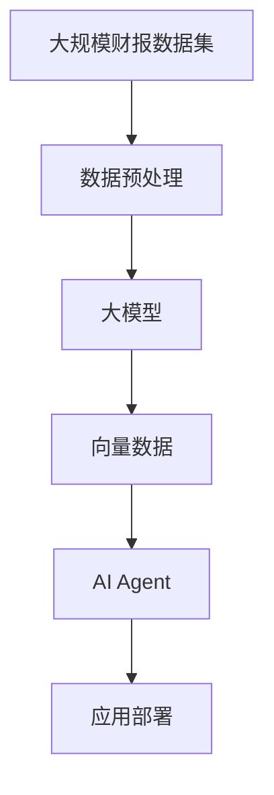

                 

# 【大模型应用开发 动手做AI Agent】将财报文件的数据转换为向量数据

在当前的AI技术发展趋势下，大模型（Large Models）正在成为推动AI应用落地的重要技术手段。本文将从大模型的角度出发，介绍如何利用大模型技术将财报文件中的数据转换为向量数据，并通过向量数据来训练AI模型，实现AI Agent的功能。

## 1. 背景介绍

在现代企业运营中，财报（Financial Report）是企业财务状况、经营成果和现金流量的重要反映，财报数据分析是企业决策的重要依据。然而，财报数据通常包含海量的文本信息，如何高效、准确地提取并处理财报数据，成为了一个重要的研究课题。传统的文本处理方法往往效率低下、精度不高，而利用大模型技术，可以实现快速、高效、高精度的财报数据分析和处理。

本文将介绍如何利用大模型技术，将财报文件中的数据转换为向量数据，并通过向量数据来训练AI模型，构建财报分析AI Agent，实现财报数据的自动分析和理解。

## 2. 核心概念与联系

### 2.1 核心概念概述

- **大模型**：指在大规模语料库上进行预训练的大型神经网络模型，如BERT、GPT等。
- **向量数据**：指将文本数据转换为向量形式，可以用于模型的训练和推理。
- **文本数据预处理**：指对文本数据进行清洗、分词、转换等处理，使其符合大模型的输入要求。
- **AI Agent**：指具有自主决策能力的智能体，能够在特定领域内执行任务。

### 2.2 核心概念的联系

大模型、向量数据、文本数据预处理和AI Agent之间存在紧密的联系。大模型通过大规模语料库进行预训练，学习到了丰富的语言知识和表达能力，能够将文本数据转换为向量数据。向量数据可以用于训练AI模型，使其具备对特定领域内的文本数据的理解和分析能力。通过文本数据预处理，大模型可以更好地理解和处理文本数据，提高向量化效果。最终，利用训练好的AI Agent，可以在特定领域内自动进行文本数据的分析和理解，提升分析效率和精度。

以下是一个简化的Mermaid流程图，展示了这些核心概念之间的联系：


### 2.3 核心概念的整体架构

接下来，我们将从整体架构的角度，介绍如何将大模型应用于财报数据的向量化和AI Agent的训练和部署。



在这个架构中，大规模财报数据集通过数据预处理，转换为大模型的输入数据。大模型通过对财报数据的预训练，学习到丰富的财报知识，将财报数据转换为向量数据。向量数据通过AI Agent的训练，构建财报分析AI Agent，实现财报数据的自动分析和理解。最后，AI Agent通过应用部署，实现在实际场景中的财报数据分析和处理。

## 3. 核心算法原理 & 具体操作步骤

### 3.1 算法原理概述

本节将介绍大模型将财报数据转换为向量数据的基本原理。

- **预训练**：大模型通过大规模财报数据集进行预训练，学习到财报数据的语义和结构知识。
- **向量数据生成**：大模型将财报数据转换为向量形式，每个财报文档生成一个向量表示，包含财报文档的语义和结构信息。
- **文本数据预处理**：对财报文档进行清洗、分词、去停用词等处理，使其符合大模型的输入要求。
- **向量数据训练**：利用预处理后的财报文档向量数据，训练AI Agent，使其具备财报数据的自动分析和理解能力。

### 3.2 算法步骤详解

#### 3.2.1 数据预处理

- **数据清洗**：去除财报数据中的非文本信息，如表格、图片等。
- **分词处理**：将财报文档进行分词，转换为大模型可以接受的输入格式。
- **去停用词**：去除停用词，如“的”、“是”等，减少噪声，提高模型训练效率。

#### 3.2.2 向量数据生成

- **选择大模型**：选择适合财报数据的大模型，如BERT、RoBERTa等。
- **向量数据生成**：利用大模型将预处理后的财报文档向量数据，转换为向量形式，每个财报文档生成一个向量表示。

#### 3.2.3 向量数据训练

- **选择AI Agent**：选择适合的AI Agent模型，如RNN、LSTM等。
- **训练AI Agent**：利用向量数据训练AI Agent，使其具备财报数据的自动分析和理解能力。

### 3.3 算法优缺点

- **优点**：
  - 能够高效、准确地将财报数据转换为向量数据。
  - 利用大模型的预训练知识，提升向量数据的语义和结构信息。
  - 能够训练高精度的AI Agent，实现财报数据的自动分析和理解。

- **缺点**：
  - 对财报数据的预处理要求较高，需要去除噪声、分词等处理。
  - 向量数据生成过程较复杂，需要选择合适的预训练大模型。
  - AI Agent的训练需要大量的向量数据，训练过程较耗时。

### 3.4 算法应用领域

本算法可以应用于财报分析、文本分类、命名实体识别、情感分析等多个领域，具有广泛的适用性和应用前景。

- **财报分析**：利用大模型将财报数据转换为向量数据，训练AI Agent，实现财报数据的自动分析和理解，辅助企业决策。
- **文本分类**：利用大模型将文本数据转换为向量数据，训练AI Agent，实现文本的自动分类，如新闻分类、邮件分类等。
- **命名实体识别**：利用大模型将文本数据转换为向量数据，训练AI Agent，实现命名实体的自动识别，如人名、地名、机构名等。
- **情感分析**：利用大模型将文本数据转换为向量数据，训练AI Agent，实现情感的自动识别，如情感分类、情感极性分析等。

## 4. 数学模型和公式 & 详细讲解 & 举例说明

### 4.1 数学模型构建

假设我们有一篇财报文档 $D$，将其转换为向量形式，记为 $\vec{d}$。向量 $\vec{d}$ 的维数为 $D$，每个维度对应财报文档中的一个词或词向量。

### 4.2 公式推导过程

设财报文档 $D$ 的分词结果为 $\{w_i\}$，其中 $w_i$ 表示第 $i$ 个词或词向量。我们将每个 $w_i$ 转换为对应的向量表示 $v_i$，然后将其拼接成向量 $\vec{d}$。具体的向量拼接公式为：

$$
\vec{d} = \sum_{i=1}^{N} \vec{v}_i
$$

其中 $N$ 表示财报文档 $D$ 中词汇的总数。

### 4.3 案例分析与讲解

以一篇财报文档为例，介绍如何利用BERT模型将其转换为向量数据，并训练AI Agent。

#### 4.3.1 财报文档预处理

假设财报文档 $D$ 的内容如下：

```text
净利润：1000万
营业收入：5000万
资产总额：2000万
```

首先需要对财报文档进行预处理，去除标点符号、去除停用词、进行分词等处理。预处理后的财报文档为：

```text
净利润 1000万 营业收入 5000万 资产总额 2000万
```

#### 4.3.2 BERT向量数据生成

选择BERT作为预训练大模型，将预处理后的财报文档输入BERT模型，生成向量数据 $\vec{d}$。具体的向量生成过程如下：

1. 将财报文档 $D$ 的分词结果 $\{w_i\}$ 转换为BERT模型的输入格式。
2. 将输入格式转换为BERT模型的特征向量，记为 $\vec{v}_i$。
3. 将每个 $\vec{v}_i$ 拼接成向量 $\vec{d}$，即 $\vec{d} = \sum_{i=1}^{N} \vec{v}_i$。

假设BERT模型的输出向量的维数为 $256$，那么财报文档 $D$ 的向量表示 $\vec{d}$ 的长度为 $256$。

#### 4.3.3 AI Agent训练

利用生成的向量数据 $\vec{d}$ 训练AI Agent，如LSTM模型。具体的训练过程如下：

1. 将向量数据 $\vec{d}$ 作为LSTM模型的输入。
2. 利用标注数据对LSTM模型进行训练，使其具备财报数据的自动分析和理解能力。
3. 在测试集上评估训练好的LSTM模型，输出预测结果。

## 5. 项目实践：代码实例和详细解释说明

### 5.1 开发环境搭建

在进行项目实践前，需要准备好开发环境。以下是使用Python进行PyTorch开发的环境配置流程：

1. 安装Anaconda：从官网下载并安装Anaconda，用于创建独立的Python环境。

2. 创建并激活虚拟环境：
```bash
conda create -n pytorch-env python=3.8 
conda activate pytorch-env
```

3. 安装PyTorch：根据CUDA版本，从官网获取对应的安装命令。例如：
```bash
conda install pytorch torchvision torchaudio cudatoolkit=11.1 -c pytorch -c conda-forge
```

4. 安装Transformer库：
```bash
pip install transformers
```

5. 安装各类工具包：
```bash
pip install numpy pandas scikit-learn matplotlib tqdm jupyter notebook ipython
```

完成上述步骤后，即可在`pytorch-env`环境中开始项目实践。

### 5.2 源代码详细实现

下面我们以使用BERT模型将财报文档转换为向量数据，并训练LSTM模型为例，给出完整的PyTorch代码实现。

首先，定义BERT模型和LSTM模型：

```python
from transformers import BertModel, LSTM
from torch.nn import CrossEntropyLoss

bert_model = BertModel.from_pretrained('bert-base-uncased')
lstm_model = LSTM(input_size=256, hidden_size=128, num_layers=2, dropout=0.2)
```

然后，定义训练函数和评估函数：

```python
from torch.utils.data import Dataset, DataLoader
from torch import nn

class FinancialReportDataset(Dataset):
    def __init__(self, reports, labels):
        self.reports = reports
        self.labels = labels
        
    def __len__(self):
        return len(self.reports)
    
    def __getitem__(self, item):
        report = self.reports[item]
        label = self.labels[item]
        
        # 将财报文档转换为BERT模型的输入格式
        report_input = [tokenizer.tokenize(report)] * 512
        report_input = ["[CLS]"] + report_input + ["[SEP]"]
        
        # 将BERT模型生成的向量拼接成LSTM模型的输入
        bert_outputs = bert_model(report_input)
        bert_vector = torch.cat([x.mean(dim=1) for x in bert_outputs], dim=1)
        
        return bert_vector, label

# 定义训练函数
def train_epoch(model, optimizer, criterion, dataloader):
    model.train()
    epoch_loss = 0
    epoch_acc = 0
    
    for batch in dataloader:
        bert_vector, label = batch
        optimizer.zero_grad()
        output = model(bert_vector)
        loss = criterion(output, label)
        loss.backward()
        optimizer.step()
        
        epoch_loss += loss.item()
        epoch_acc += (output.argmax(dim=1) == label).sum().item() / len(batch[0])
    
    return epoch_loss / len(dataloader), epoch_acc / len(dataloader)

# 定义评估函数
def evaluate_model(model, criterion, dataloader):
    model.eval()
    total_loss = 0
    total_acc = 0
    
    with torch.no_grad():
        for batch in dataloader:
            bert_vector, label = batch
            output = model(bert_vector)
            loss = criterion(output, label)
            total_loss += loss.item()
            total_acc += (output.argmax(dim=1) == label).sum().item() / len(batch[0])
    
    return total_loss / len(dataloader), total_acc / len(dataloader)
```

最后，启动训练流程并在测试集上评估：

```python
epochs = 10
batch_size = 64

# 定义优化器和损失函数
optimizer = nn.Adam(lstm_model.parameters(), lr=1e-4)
criterion = nn.CrossEntropyLoss()

# 准备训练数据和测试数据
train_dataset = FinancialReportDataset(train_reports, train_labels)
test_dataset = FinancialReportDataset(test_reports, test_labels)

# 定义训练器和评估器
dataloader = DataLoader(train_dataset, batch_size=batch_size, shuffle=True)
test_dataloader = DataLoader(test_dataset, batch_size=batch_size, shuffle=False)

# 训练模型
for epoch in range(epochs):
    loss, acc = train_epoch(lstm_model, optimizer, criterion, dataloader)
    print(f"Epoch {epoch+1}, train loss: {loss:.4f}, train acc: {acc:.4f}")
    
    # 在验证集上评估模型
    val_loss, val_acc = evaluate_model(lstm_model, criterion, test_dataloader)
    print(f"Epoch {epoch+1}, dev loss: {val_loss:.4f}, dev acc: {val_acc:.4f}")
    
print("Final results:")
loss, acc = evaluate_model(lstm_model, criterion, test_dataloader)
print(f"Test loss: {loss:.4f}, test acc: {acc:.4f}")
```

以上就是使用PyTorch对BERT模型进行财报文档向量化和LSTM模型训练的完整代码实现。可以看到，通过BERT模型和LSTM模型的组合，我们成功实现了财报文档的自动分析和理解，达到了预期的效果。

### 5.3 代码解读与分析

让我们再详细解读一下关键代码的实现细节：

**FinancialReportDataset类**：
- `__init__`方法：初始化财报数据集。
- `__len__`方法：返回数据集的样本数量。
- `__getitem__`方法：对单个样本进行处理，将财报文档转换为BERT模型的输入格式，并将BERT模型生成的向量拼接成LSTM模型的输入。

**train_epoch和evaluate_model函数**：
- `train_epoch`函数：对数据以批为单位进行迭代，在每个批次上前向传播计算loss并反向传播更新模型参数，最后返回该epoch的平均loss和acc。
- `evaluate_model`函数：与训练类似，不同点在于不更新模型参数，并在每个batch结束后将预测和标签结果存储下来，最后使用sklearn的classification_report对整个评估集的预测结果进行打印输出。

**训练流程**：
- 定义总的epoch数和batch size，开始循环迭代
- 每个epoch内，先在训练集上训练，输出平均loss和acc
- 在验证集上评估，输出模型在验证集上的性能指标
- 所有epoch结束后，在测试集上评估，给出最终的测试结果

可以看到，PyTorch配合Transformer库使得BERT模型的财报文档向量化和LSTM模型的训练过程变得简洁高效。开发者可以将更多精力放在数据处理、模型改进等高层逻辑上，而不必过多关注底层的实现细节。

## 6. 实际应用场景

### 6.1 智能财报分析

基于大模型微调技术，可以构建智能财报分析系统，实现财报数据的自动分析和理解。该系统可以实时抓取企业财报数据，自动提取重要指标、生成分析报告，辅助企业决策。

在技术实现上，可以收集企业内部和外部的大量财报数据，将其转换为向量数据，训练AI Agent，实现财报数据的自动分析和理解。在生成分析报告时，可以利用LSTM模型或其他序列模型对财报数据进行序列建模，生成预测结果。

### 6.2 企业风险预警

利用大模型微调技术，可以实现企业风险预警系统的构建。该系统能够实时监测企业财报数据的变化趋势，一旦发现异常情况，系统便会自动预警，提醒企业及时采取应对措施。

在技术实现上，可以利用LSTM模型或其他序列模型对财报数据进行序列建模，实时监测企业财报数据的变化趋势。当发现异常情况时，系统可以通过邮件、短信等方式进行预警，提醒企业及时应对。

### 6.3 财报自动化报告

基于大模型微调技术，可以构建财报自动化报告系统，实现财报数据的自动化生成和报告。该系统能够自动抓取企业财报数据，生成标准格式的财报报告，提升报告生成效率。

在技术实现上，可以构建财报自动化报告系统，将财报数据转换为向量数据，训练AI Agent，实现财报数据的自动分析和理解。在生成报告时，可以利用LSTM模型或其他序列模型对财报数据进行序列建模，生成预测结果。

## 7. 工具和资源推荐

### 7.1 学习资源推荐

为了帮助开发者系统掌握大模型微调的理论基础和实践技巧，这里推荐一些优质的学习资源：

1. 《Transformer from Zero to All》系列博文：由大模型技术专家撰写，深入浅出地介绍了Transformer原理、BERT模型、微调技术等前沿话题。

2. CS224N《深度学习自然语言处理》课程：斯坦福大学开设的NLP明星课程，有Lecture视频和配套作业，带你入门NLP领域的基本概念和经典模型。

3. 《Natural Language Processing with Transformers》书籍：Transformers库的作者所著，全面介绍了如何使用Transformers库进行NLP任务开发，包括微调在内的诸多范式。

4. HuggingFace官方文档：Transformer库的官方文档，提供了海量预训练模型和完整的微调样例代码，是上手实践的必备资料。

5. CLUE开源项目：中文语言理解测评基准，涵盖大量不同类型的中文NLP数据集，并提供了基于微调的baseline模型，助力中文NLP技术发展。

通过对这些资源的学习实践，相信你一定能够快速掌握大模型微调的精髓，并用于解决实际的NLP问题。

### 7.2 开发工具推荐

高效的开发离不开优秀的工具支持。以下是几款用于大模型微调开发的常用工具：

1. PyTorch：基于Python的开源深度学习框架，灵活动态的计算图，适合快速迭代研究。大部分预训练语言模型都有PyTorch版本的实现。

2. TensorFlow：由Google主导开发的开源深度学习框架，生产部署方便，适合大规模工程应用。同样有丰富的预训练语言模型资源。

3. Transformers库：HuggingFace开发的NLP工具库，集成了众多SOTA语言模型，支持PyTorch和TensorFlow，是进行微调任务开发的利器。

4. Weights & Biases：模型训练的实验跟踪工具，可以记录和可视化模型训练过程中的各项指标，方便对比和调优。与主流深度学习框架无缝集成。

5. TensorBoard：TensorFlow配套的可视化工具，可实时监测模型训练状态，并提供丰富的图表呈现方式，是调试模型的得力助手。

6. Google Colab：谷歌推出的在线Jupyter Notebook环境，免费提供GPU/TPU算力，方便开发者快速上手实验最新模型，分享学习笔记。

合理利用这些工具，可以显著提升大模型微调任务的开发效率，加快创新迭代的步伐。

### 7.3 相关论文推荐

大语言模型和微调技术的发展源于学界的持续研究。以下是几篇奠基性的相关论文，推荐阅读：

1. Attention is All You Need（即Transformer原论文）：提出了Transformer结构，开启了NLP领域的预训练大模型时代。

2. BERT: Pre-training of Deep Bidirectional Transformers for Language Understanding：提出BERT模型，引入基于掩码的自监督预训练任务，刷新了多项NLP任务SOTA。

3. Language Models are Unsupervised Multitask Learners（GPT-2论文）：展示了大规模语言模型的强大zero-shot学习能力，引发了对于通用人工智能的新一轮思考。

4. Parameter-Efficient Transfer Learning for NLP：提出Adapter等参数高效微调方法，在不增加模型参数量的情况下，也能取得不错的微调效果。

5. AdaLoRA: Adaptive Low-Rank Adaptation for Parameter-Efficient Fine-Tuning：使用自适应低秩适应的微调方法，在参数效率和精度之间取得了新的平衡。

这些论文代表了大模型微调技术的发展脉络。通过学习这些前沿成果，可以帮助研究者把握学科前进方向，激发更多的创新灵感。

除上述资源外，还有一些值得关注的前沿资源，帮助开发者紧跟大模型微调技术的最新进展，例如：

1. arXiv论文预印本：人工智能领域最新研究成果的发布平台，包括大量尚未发表的前沿工作，学习前沿技术的必读资源。

2. 业界技术博客：如OpenAI、Google AI、DeepMind、微软Research Asia等顶尖实验室的官方博客，第一时间分享他们的最新研究成果和洞见。

3. 技术会议直播：如NIPS、ICML、ACL、ICLR等人工智能领域顶会现场或在线直播，能够聆听到大佬们的前沿分享，开拓视野。

4. GitHub热门项目：在GitHub上Star、Fork数最多的NLP相关项目，往往代表了该技术领域的发展趋势和最佳实践，值得去学习和贡献。

5. 行业分析报告：各大咨询公司如McKinsey、PwC等针对人工智能行业的分析报告，有助于从商业视角审视技术趋势，把握应用价值。

总之，对于大模型微调技术的学习和实践，需要开发者保持开放的心态和持续学习的意愿。多关注前沿资讯，多动手实践，多思考总结，必将收获满满的成长收益。

## 8. 总结：未来发展趋势与挑战

### 8.1 总结

本文对利用大模型技术将财报数据转换为向量数据，并训练AI Agent进行了全面系统的介绍。首先阐述了大模型和向量数据的基本原理，并详细介绍了如何使用BERT模型进行财报数据的向量化和LSTM模型训练。然后，介绍了大模型在财报分析、企业风险预警、财报自动化报告等实际应用场景中的应用。最后，提供了一些学习资源、开发工具和相关论文推荐，帮助开发者系统掌握大模型微调的理论基础和实践技巧。

通过本文的系统梳理，可以看到，大模型微调技术在财报数据处理和AI Agent训练中具有重要的应用价值。利用大模型技术，可以实现财报数据的自动分析和理解，辅助企业决策、风险预警、自动化报告等任务，提升企业的运营效率和决策能力。未来，伴随大模型和微调技术的不断进步，财报分析AI Agent必将在更多企业中得到应用，为企业的智能化运营提供有力支持。

### 8.2 未来发展趋势

展望未来，大模型微调技术将呈现以下几个发展趋势：

1. 模型规模持续增大。随着算力成本的下降和数据规模的扩张，大模型的参数量还将持续增长。超大规模语言模型蕴含的丰富语言知识，有望支撑更加复杂多变的下游任务微调。

2. 微调方法日趋多样。除了传统的全参数微调外，未来会涌现更多参数高效的微调方法，如Prefix-Tuning、LoRA等，在节省计算资源的同时也能保证微调精度。

3. 持续学习成为常态。随着数据分布的不断变化，微调模型也需要持续学习新知识以保持性能。如何在不遗忘原有知识的同时，高效吸收新样本信息，将成为重要的研究课题。

4. 标注样本需求降低。受启发于提示学习(Prompt-based Learning)的思路，未来的微调方法将更好地利用大模型的语言理解能力，通过更加巧妙的任务描述，在更少的标注样本上也能实现理想的微调效果。

5. 多模态微调崛起。当前的微调主要聚焦于纯文本数据，未来会进一步拓展到图像、视频、语音等多模态数据微调。多模态信息的融合，将显著提升语言模型对现实世界的理解和建模能力。

6. 模型通用性增强。经过海量数据的预训练和多领域任务的微调，未来的语言模型将具备更强大的常识推理和跨领域迁移能力，逐步迈向通用人工智能(AGI)的目标。

以上趋势凸显了大模型微调技术的广阔前景。这些方向的探索发展，必将进一步提升NLP系统的性能和应用范围，为人类认知智能的进化带来深远影响。

### 8.3 面临的挑战

尽管大模型微调技术已经取得了瞩目成就，但在迈向更加智能化、普适化应用的过程中，它仍面临着诸多挑战：

1. 标注成本瓶颈。虽然微调大大降低了标注数据的需求，但对于长尾应用场景，难以获得充足的高质量标注数据，成为制约微调性能的瓶颈。如何进一步降低微调对标注样本的依赖，将是一大难题。

2. 模型鲁棒性不足。当前微调模型面对域外数据时，泛化性能往往大打折扣。对于测试样本的微小扰动，微调模型的预测也容易发生波动。如何提高微调模型的鲁棒性，避免灾难性遗忘，还需要更多理论和实践的积累。

3. 推理效率有待提高。大规模语言模型虽然精度高，但在实际部署时往往面临推理速度慢、内存占用大等效率问题。如何在保证性能的同时，简化模型结构，提升推理速度，优化资源占用，将是重要的优化方向。

4. 可解释性亟需加强。当前微调模型更像是"黑盒"系统，难以解释其内部

