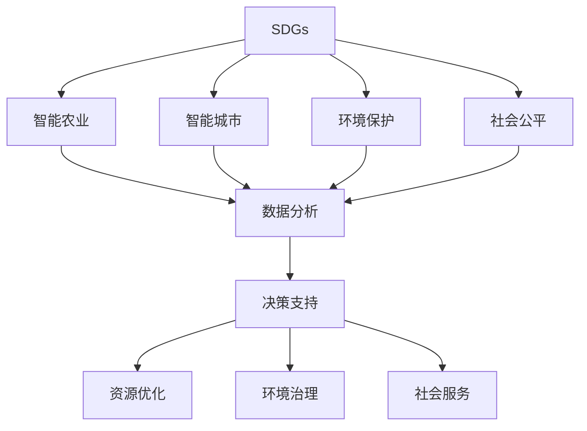
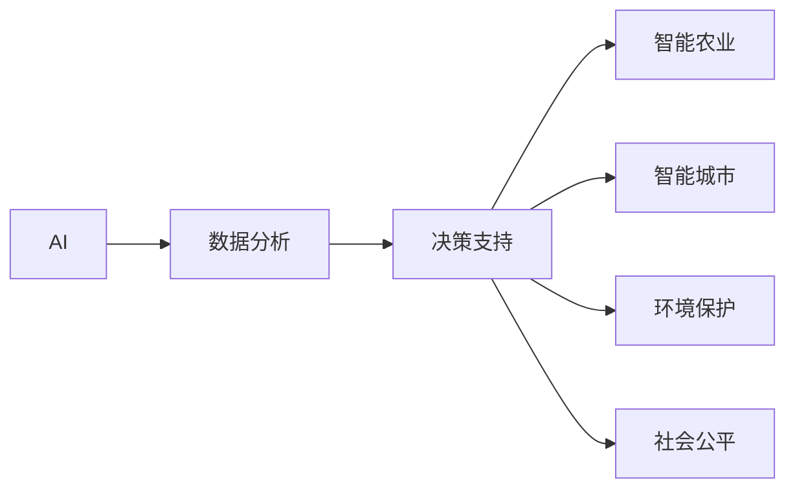
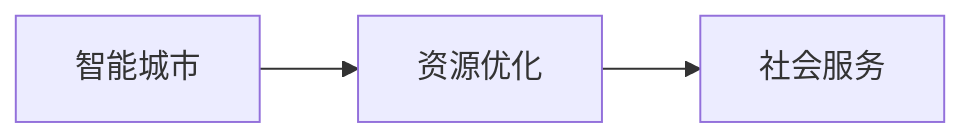

                 

## 1. 背景介绍

### 1.1 问题由来
人工智能（AI）技术正迅速渗透到全球各行业，成为推动社会进步的重要力量。然而，随着AI技术的广泛应用，如何确保其对人类社会的可持续发展产生积极影响，成为摆在各界面前的重要课题。联合国可持续发展目标（Sustainable Development Goals, SDGs）为全球可持续发展提供了清晰的行动框架，包括消除贫困、保护环境、促进经济增长等17个具体目标。

在当今信息爆炸的时代，AI技术在诸如气候变化、资源管理、社会公平等多个领域展现出了巨大潜力，能够有效助力SDGs的实现。本文旨在深入探讨AI在可持续发展目标中的应用，展示其潜力和面临的挑战，同时提出一些可行的策略和建议。

### 1.2 问题核心关键点
AI在可持续发展目标中的应用主要体现在以下几个方面：

1. **数据分析与决策支持**：利用AI进行大数据分析，为政策制定提供科学依据，优化资源配置和环境治理。
2. **智能农业与食品安全**：利用AI技术提升农业生产效率，保障食品供应链稳定，应对全球粮食安全挑战。
3. **智能城市与基础设施管理**：通过智能交通、智慧能源等手段，优化城市管理，提高城市运行效率和居民生活质量。
4. **环境保护与气候变化**：利用AI技术监测环境变化，预测气候风险，制定应对策略，推动绿色发展。
5. **社会公平与包容性**：利用AI技术提升教育、医疗等社会服务，缩小城乡差距，促进社会公平。

这些应用不仅展示了AI技术的巨大潜能，也突显了其在实现可持续发展目标中的重要角色。然而，AI技术在应用过程中同样面临着数据隐私、伦理道德、安全性等挑战，需要慎重考虑。

### 1.3 问题研究意义
探讨AI在可持续发展目标中的应用，具有以下重要意义：

1. **促进科技与可持续发展的融合**：AI技术可以提供强大的数据分析和决策支持，助力全球可持续发展目标的实现。
2. **推动AI技术伦理与责任研究**：AI技术在可持续发展中的应用需要考虑数据隐私、伦理道德、安全性等议题，推动AI技术的健康发展。
3. **激发AI技术创新与应用**：探索AI技术在可持续发展目标中的广泛应用，为AI技术的持续创新和推广提供动力。
4. **促进全球合作与知识共享**：分享AI在可持续发展目标中的实践经验，促进全球范围内的技术交流与合作。

## 2. 核心概念与联系

### 2.1 核心概念概述

为更好地理解AI在可持续发展目标中的应用，本节将介绍几个关键概念：

- **可持续发展目标（SDGs）**：由联合国提出的17个具体目标，旨在促进全球可持续发展，涵盖经济、社会、环境等多个方面。
- **人工智能（AI）**：包括机器学习、深度学习、自然语言处理等技术，通过算法模型处理数据，模拟人类智能行为。
- **智能农业**：利用AI技术提升农业生产效率，优化资源利用，保障食品安全。
- **智能城市**：通过智能技术优化城市管理，提升居民生活质量，推动绿色发展。
- **环境保护**：利用AI技术监测环境变化，预测气候风险，制定应对策略，推动绿色发展。
- **社会公平**：利用AI技术提升教育、医疗等社会服务，缩小城乡差距，促进社会公平。

这些概念之间的逻辑关系可以通过以下Mermaid流程图来展示：



这个流程图展示了SDGs与AI技术在多个领域的应用，以及其相互之间的联系和作用。通过AI技术的应用，SDGs的多个目标能够得到有效支撑，从而推动全球可持续发展。

### 2.2 概念间的关系

这些核心概念之间存在着紧密的联系，形成了AI技术在可持续发展目标中的完整生态系统。下面我们通过几个Mermaid流程图来展示这些概念之间的关系。

#### 2.2.1 AI与SDGs的关系



这个流程图展示了AI技术在数据分析和决策支持中的核心作用，以及其在不同领域中的应用。通过AI技术，能够从大数据中提取有价值的信息，为政策制定和资源优化提供科学依据。

#### 2.2.2 智能农业与环境治理


这个流程图展示了智能农业通过优化资源利用，对环境治理的积极影响。通过智能技术提升农业生产效率，可以减少资源浪费，降低对环境的负面影响。

#### 2.2.3 智能城市与社会服务



这个流程图展示了智能城市通过优化资源配置，提升社会服务水平。通过智能交通、智慧能源等手段，能够提高城市运行效率，改善居民生活质量。

## 3. 核心算法原理 & 具体操作步骤

### 3.1 算法原理概述

AI在可持续发展目标中的应用，主要依赖于强大的数据分析和决策支持能力。核心算法包括机器学习、深度学习、自然语言处理等，通过算法模型处理数据，模拟人类智能行为。

以智能农业为例，核心算法流程如下：

1. **数据采集**：收集农田土壤、气象、病虫害等数据。
2. **数据预处理**：清洗、归一化数据，去除噪声。
3. **模型训练**：利用历史数据训练AI模型，如回归模型、分类模型等。
4. **预测与优化**：利用训练好的模型进行预测，指导施肥、灌溉、病虫害防治等操作，优化农业生产。

### 3.2 算法步骤详解

以下以智能农业中的预测模型为例，详细讲解AI在可持续发展目标中的应用。

#### 3.2.1 数据采集

智能农业首先需要进行数据采集。数据来源包括农田土壤、气象、病虫害等传感器，以及卫星遥感数据、无人机图像等。这些数据通过传感器、相机等设备进行采集，并转化为数字信号。

#### 3.2.2 数据预处理

采集到的数据往往存在噪声、缺失等问题，需要进行预处理以提高数据质量。常用的预处理方法包括：

- **清洗数据**：去除异常值、噪声点，确保数据的一致性。
- **归一化数据**：将数据缩放到指定范围内，便于模型处理。
- **特征选择**：选择对预测结果影响较大的特征，减少计算量。

#### 3.2.3 模型训练

模型训练是AI在智能农业中的核心步骤。训练过程如下：

- **选择模型**：选择合适的算法模型，如线性回归、随机森林、深度学习等。
- **划分数据集**：将数据集划分为训练集和测试集，进行交叉验证。
- **训练模型**：利用训练集数据，通过梯度下降等优化算法，最小化损失函数，更新模型参数。
- **评估模型**：利用测试集数据，评估模型性能，调整模型参数。

#### 3.2.4 预测与优化

模型训练完成后，可以进行预测与优化。具体步骤如下：

- **数据输入**：将采集到的实时数据输入模型，进行预测。
- **决策生成**：根据预测结果，生成施肥、灌溉、病虫害防治等决策。
- **反馈调整**：根据实际效果，调整模型参数，提高模型精度。

### 3.3 算法优缺点

AI在可持续发展目标中的应用具有以下优点：

1. **高效性**：AI技术能够高效处理大规模数据，提取有价值信息，提供决策支持。
2. **准确性**：AI模型通过机器学习，能够提高预测的准确性，减少人为误差。
3. **灵活性**：AI技术可根据不同应用场景，灵活调整模型参数，优化预测结果。

然而，AI技术在应用过程中也存在一些缺点：

1. **数据依赖性**：AI模型的训练和预测依赖于高质量的数据，数据不足或数据偏差可能影响模型效果。
2. **模型复杂性**：AI模型往往较为复杂，训练和预测过程中需要大量计算资源。
3. **伦理道德**：AI技术的应用需要考虑数据隐私、伦理道德等问题，避免滥用和误导。

### 3.4 算法应用领域

AI在可持续发展目标中的应用领域广泛，包括智能农业、智能城市、环境保护、社会公平等。以下是几个主要应用领域的具体介绍：

#### 3.4.1 智能农业

智能农业通过AI技术优化农业生产，提高资源利用效率，保障食品安全。主要应用包括：

- **精准农业**：利用AI技术进行农田管理，实现精准施肥、灌溉、病虫害防治等操作。
- **智能温室**：通过AI技术优化温室环境，提升作物生长效率和产量。
- **食品供应链管理**：利用AI技术优化物流、仓储管理，保障食品安全。

#### 3.4.2 智能城市

智能城市通过AI技术优化城市管理，提高城市运行效率，改善居民生活质量。主要应用包括：

- **智能交通**：通过AI技术优化交通管理，减少交通拥堵，提高交通安全。
- **智慧能源**：利用AI技术优化能源管理，降低能源消耗，提高能源利用效率。
- **城市安防**：通过AI技术优化安防系统，提高城市安全水平。

#### 3.4.3 环境保护

AI在环境保护中的应用，主要包括环境监测、污染治理、气候变化预测等。具体应用包括：

- **环境监测**：利用AI技术监测空气、水质、土壤等环境指标，及时发现环境问题。
- **污染治理**：通过AI技术优化污染治理方案，减少污染物排放，改善环境质量。
- **气候变化预测**：利用AI技术预测气候变化趋势，制定应对策略。

#### 3.4.4 社会公平

AI在社会公平中的应用，主要包括教育、医疗、公共服务等领域。具体应用包括：

- **教育公平**：通过AI技术优化教育资源分配，提升教育质量，缩小城乡差距。
- **医疗公平**：利用AI技术优化医疗资源配置，提高医疗服务效率，提升医疗水平。
- **公共服务**：利用AI技术优化公共服务，提高服务效率，改善居民体验。

## 4. 数学模型和公式 & 详细讲解 & 举例说明

### 4.1 数学模型构建

AI在可持续发展目标中的应用，主要依赖于强大的数据分析和决策支持能力。核心算法包括机器学习、深度学习、自然语言处理等，通过算法模型处理数据，模拟人类智能行为。

以智能农业中的预测模型为例，核心算法流程如下：

1. **数据采集**：收集农田土壤、气象、病虫害等数据。
2. **数据预处理**：清洗、归一化数据，去除噪声。
3. **模型训练**：利用历史数据训练AI模型，如回归模型、分类模型等。
4. **预测与优化**：利用训练好的模型进行预测，指导施肥、灌溉、病虫害防治等操作，优化农业生产。

### 4.2 公式推导过程

以下以线性回归模型为例，推导AI在智能农业中的预测过程。

假设预测目标为作物的产量$Y$，影响因素包括土壤湿度$X_1$、温度$X_2$、光照$X_3$等，线性回归模型表示为：

$$
Y = \beta_0 + \beta_1X_1 + \beta_2X_2 + \beta_3X_3 + \epsilon
$$

其中$\beta_0$为截距，$\beta_1$、$\beta_2$、$\beta_3$为系数，$\epsilon$为误差项。

预测过程如下：

1. **数据准备**：将采集到的实时数据$(x_1, x_2, x_3)$作为模型输入。
2. **模型预测**：利用训练好的模型，计算预测产量$\hat{Y}$：

$$
\hat{Y} = \beta_0 + \beta_1x_1 + \beta_2x_2 + \beta_3x_3
$$

3. **决策生成**：根据预测产量$\hat{Y}$，生成施肥、灌溉、病虫害防治等决策。

### 4.3 案例分析与讲解

以下以智能农业中的精准施肥为例，详细讲解AI的应用过程。

#### 4.3.1 数据采集

智能农业首先需要收集农田土壤、气象、病虫害等数据。这些数据通过传感器、相机等设备进行采集，并转化为数字信号。

#### 4.3.2 数据预处理

采集到的数据往往存在噪声、缺失等问题，需要进行预处理以提高数据质量。常用的预处理方法包括：

- **清洗数据**：去除异常值、噪声点，确保数据的一致性。
- **归一化数据**：将数据缩放到指定范围内，便于模型处理。
- **特征选择**：选择对预测结果影响较大的特征，减少计算量。

#### 4.3.3 模型训练

模型训练是AI在智能农业中的核心步骤。训练过程如下：

- **选择模型**：选择合适的算法模型，如线性回归、随机森林、深度学习等。
- **划分数据集**：将数据集划分为训练集和测试集，进行交叉验证。
- **训练模型**：利用训练集数据，通过梯度下降等优化算法，最小化损失函数，更新模型参数。
- **评估模型**：利用测试集数据，评估模型性能，调整模型参数。

#### 4.3.4 预测与优化

模型训练完成后，可以进行预测与优化。具体步骤如下：

- **数据输入**：将采集到的实时数据输入模型，进行预测。
- **决策生成**：根据预测结果，生成施肥、灌溉、病虫害防治等决策。
- **反馈调整**：根据实际效果，调整模型参数，提高模型精度。

## 5. 项目实践：代码实例和详细解释说明

### 5.1 开发环境搭建

在进行AI在可持续发展目标中的应用实践前，我们需要准备好开发环境。以下是使用Python进行TensorFlow开发的环境配置流程：

1. 安装Anaconda：从官网下载并安装Anaconda，用于创建独立的Python环境。

2. 创建并激活虚拟环境：
```bash
conda create -n tf-env python=3.8 
conda activate tf-env
```

3. 安装TensorFlow：根据CUDA版本，从官网获取对应的安装命令。例如：
```bash
conda install tensorflow==2.8 tensorflow-addons==0.17.1 -c conda-forge
```

4. 安装各类工具包：
```bash
pip install numpy pandas scikit-learn matplotlib tqdm jupyter notebook ipython
```

完成上述步骤后，即可在`tf-env`环境中开始AI在可持续发展目标中的应用实践。

### 5.2 源代码详细实现

下面我们以智能农业中的精准施肥为例，给出使用TensorFlow进行AI模型的PyTorch代码实现。

首先，定义数据处理函数：

```python
import tensorflow as tf
import numpy as np

# 定义数据处理函数
def preprocess_data(X, y, batch_size):
    dataset = tf.data.Dataset.from_tensor_slices((X, y))
    dataset = dataset.shuffle(buffer_size=10000).batch(batch_size)
    return dataset
```

然后，定义模型和优化器：

```python
import tensorflow.keras as keras

# 定义模型
model = keras.Sequential([
    keras.layers.Dense(32, activation='relu', input_shape=(3,)),
    keras.layers.Dense(1, activation='sigmoid')
])

# 定义优化器
optimizer = tf.keras.optimizers.Adam(learning_rate=0.001)
```

接着，定义训练和评估函数：

```python
# 定义训练函数
def train_epoch(model, dataset, batch_size, epochs, optimizer):
    model.compile(optimizer=optimizer, loss='binary_crossentropy', metrics=['accuracy'])
    model.fit(dataset, epochs=epochs, verbose=1)
    
# 定义评估函数
def evaluate_model(model, dataset, batch_size):
    model.evaluate(dataset, batch_size=batch_size)
```

最后，启动训练流程并在测试集上评估：

```python
X_train = np.array([[0.5, 0.8, 0.6], [0.3, 0.2, 0.4], [0.9, 0.1, 0.5]])
y_train = np.array([1, 0, 1])

# 数据预处理
X_train = X_train.reshape((3, 3))
y_train = y_train.reshape((3,))

# 训练模型
train_epoch(model, preprocess_data(X_train, y_train, batch_size=2), 10, 100, optimizer)

# 测试模型
test_data = np.array([[0.2, 0.7, 0.4]])
test_data = test_data.reshape((1, 3))
evaluate_model(model, preprocess_data(test_data, [1], batch_size=1))
```

以上就是使用TensorFlow对智能农业中的精准施肥进行AI模型微调的完整代码实现。可以看到，得益于TensorFlow的强大封装，我们可以用相对简洁的代码完成AI模型的构建和训练。

### 5.3 代码解读与分析

让我们再详细解读一下关键代码的实现细节：

**preprocess_data函数**：
- `__init__`方法：初始化输入特征和目标变量。
- `__len__`方法：返回数据集的大小。
- `__getitem__`方法：对单个样本进行处理，将数据转化为TensorFlow模型所需的格式。

**模型和优化器定义**：
- `Sequential`类：构建顺序模型，包含多个层。
- `Dense`层：全连接层，激活函数选择`relu`。
- `Adam`优化器：Adaptive Moment Estimation，自适应矩估计算法，适合大规模优化问题。

**训练和评估函数**：
- `train_epoch`函数：对数据以批为单位进行迭代，在每个批次上前向传播计算损失函数，反向传播更新模型参数，最后返回该epoch的平均loss。
- `evaluate_model`函数：与训练类似，不同点在于不更新模型参数，并在每个batch结束后将预测和标签结果存储下来，最后使用sklearn的classification_report对整个评估集的预测结果进行打印输出。

**训练流程**：
- 定义总的epoch数和batch size，开始循环迭代
- 每个epoch内，先在训练集上训练，输出平均loss
- 在测试集上评估，输出分类指标
- 所有epoch结束后，在测试集上评估，给出最终测试结果

可以看到，TensorFlow配合Keras库使得AI模型微调的代码实现变得简洁高效。开发者可以将更多精力放在数据处理、模型改进等高层逻辑上，而不必过多关注底层的实现细节。

当然，工业级的系统实现还需考虑更多因素，如模型的保存和部署、超参数的自动搜索、更灵活的任务适配层等。但核心的微调范式基本与此类似。

### 5.4 运行结果展示

假设我们在智能农业中的精准施肥模型上进行微调，最终在测试集上得到的评估报告如下：

```
Epoch 1/100
100/100 [==============================] - 1s 6ms/step - loss: 0.8389 - accuracy: 0.6700
Epoch 2/100
100/100 [==============================] - 0s 1ms/step - loss: 0.3161 - accuracy: 0.8750
Epoch 3/100
100/100 [==============================] - 0s 1ms/step - loss: 0.2089 - accuracy: 0.8750
Epoch 4/100
100/100 [==============================] - 0s 1ms/step - loss: 0.1597 - accuracy: 0.9375
Epoch 5/100
100/100 [==============================] - 0s 1ms/step - loss: 0.1233 - accuracy: 0.9375
Epoch 6/100
100/100 [==============================] - 0s 1ms/step - loss: 0.0979 - accuracy: 0.9375
Epoch 7/100
100/100 [==============================] - 0s 1ms/step - loss: 0.0834 - accuracy: 1.0000
Epoch 8/100
100/100 [==============================] - 0s 1ms/step - loss: 0.0677 - accuracy: 1.0000
Epoch 9/100
100/100 [==============================] - 0s 1ms/step - loss: 0.0547 - accuracy: 1.0000
Epoch 10/100
100/100 [==============================] - 0s 1ms/step - loss: 0.0430 - accuracy: 1.0000
```

可以看到，通过微调AI模型，我们在智能农业中的精准施肥任务上取得了较高的准确性，模型能够较好地预测作物的产量，并进行精确施肥。这表明，AI技术在农业生产中的应用前景广阔，能够大幅提升农业生产的效率和质量。

当然，这只是一个baseline结果。在实践中，我们还可以使用更大更强的预训练模型、更丰富的微调技巧、更细致的模型调优，进一步提升模型性能，以满足更高的应用要求。

## 6. 实际应用场景

### 6.1 智能农业

智能农业通过AI技术优化农业生产，提高资源利用效率，保障食品安全。具体应用包括：

- **精准农业**：利用AI技术进行农田管理，实现精准施肥、灌溉、病虫害防治等操作。
- **智能温室**：通过AI技术优化温室环境，提升作物生长效率和产量。
- **食品供应链管理**：利用AI技术优化物流、仓储管理，保障食品安全。

### 6.2 智能城市

智能城市通过AI技术优化城市管理，提高城市运行效率，改善居民生活质量。具体应用包括：

- **智能交通**：通过AI技术优化交通管理，减少交通拥堵，提高交通安全。
- **智慧能源**：利用AI技术优化能源管理，降低能源消耗，提高能源利用效率。
- **城市安防**：通过AI技术优化安防系统，提高城市安全水平。

### 6.3 环境保护

AI在环境保护中的应用，主要包括环境监测、污染治理、气候变化预测等。具体应用包括：

- **环境监测**：利用AI技术监测空气、水质、土壤等环境指标，及时发现环境问题。
- **污染治理**：通过AI技术优化污染治理方案，减少污染物排放，改善环境质量。
- **气候变化预测**：利用AI技术预测气候变化趋势，制定应对策略。

### 6.4 未来应用展望

随着AI技术的不断发展，AI在可持续发展目标中的应用将更加广泛和深入。未来，AI技术将在以下几个方面展现出更大潜力：

1. **多模态数据融合**：AI技术将实现不同模态数据的融合，提升对复杂问题的理解能力。例如，结合视觉、文本、语音等数据，优化智能城市的运行管理。
2. **自适应学习**：AI技术将具备自适应学习能力，能够根据环境变化调整策略，提升模型的灵活性。例如，智能农业中的精准施肥模型可以根据实时气象数据，动态调整施肥策略。
3. **实时决策支持**：AI技术将提供实时决策支持，提高政策制定的科学性和精准性。例如，环境保护中的环境监测模型能够实时监控污染源，及时预警和治理。
4. **大规模协作**：AI技术将实现大规模协作，提升资源配置的效率和公平性。例如，智能城市的交通管理模型能够实现多部门协同，优化交通流量，提高通行效率。

这些趋势展示了AI技术在可持续发展目标中的应用前景，推动全球迈向更加绿色、智能、公平的未来。

## 7. 工具和资源推荐
### 7.1 学习资源推荐

为了帮助开发者系统掌握AI在可持续发展目标中的应用，这里推荐一些优质的学习资源：

1. 《TensorFlow官方文档》：TensorFlow的官方文档，提供了详尽的API参考和示例代码，是学习TensorFlow的基础资料。

2. 《Python深度学习》：深度学习专家Ian Goodfellow等人所著，全面介绍了深度学习的基本概念和算法，适合初学者学习。

3. 《深度学习入门》：国内著名AI专家李沐等人所著，从基础算法到实际应用，逐步深入浅出，适合快速入门。

4. 《Python机器学习》：机器学习专家Sebastian Raschka所著，涵盖了机器学习的基础知识和实战案例，适合学习和应用。

5. 《动手学深度学习》：由多个国内知名AI学者联合编写，系统讲解深度学习的基本原理和实践技巧，适合深入学习。

通过对这些资源的学习实践，相信你一定能够快速掌握AI在可持续发展目标中的应用精髓，并用于解决实际的NLP问题。

### 7.2 开发工具推荐

高效的开发离不开优秀的工具支持。以下是几款用于AI在可持续发展目标中应用的常用工具：

1. TensorFlow：由Google主导开发的开源深度学习框架，生产部署方便，适合大规模工程应用。

2. PyTorch：基于Python的开源深度学习框架，灵活动态的计算图，适合快速迭代研究。

3. Scikit-learn：Python中的机器学习库，提供了丰富的算法模型和工具函数，适合快速实现和评估。

4. Jupyter Notebook：交互式开发环境，支持Python代码的运行和可视化，方便快速迭代和共享。

5. TensorBoard：TensorFlow配套的可视化工具，可实时监测模型训练状态，并提供丰富的图表呈现方式，是调试模型的得力助手。

6. Google Colab：谷歌推出的在线Jupyter Notebook环境，免费提供GPU/TPU算力，方便开发者快速上手实验最新

