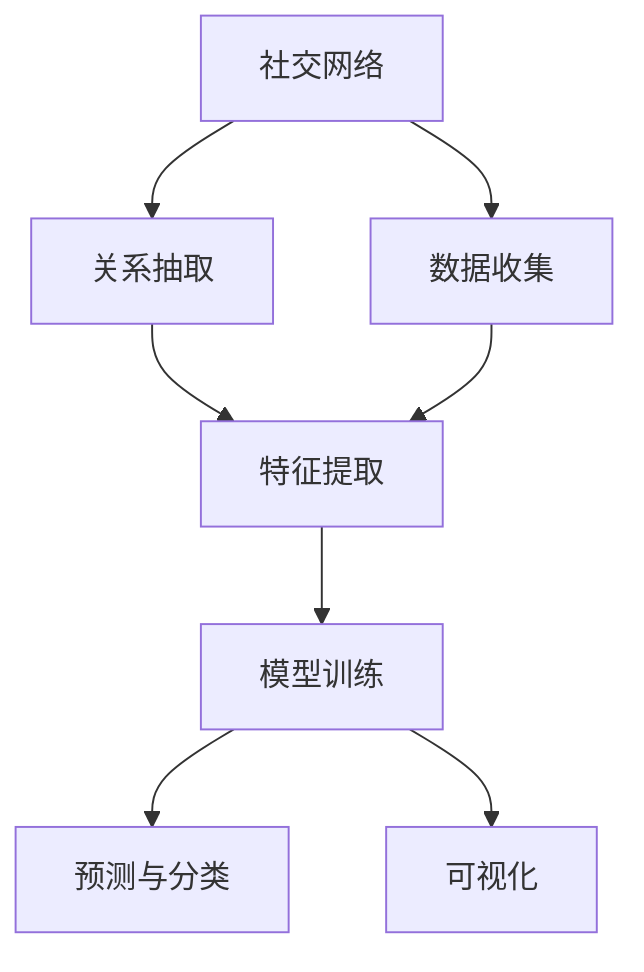

                 

# 一切皆是映射：AI在社交网络分析中的作用

## 1. 背景介绍

### 1.1 问题由来

社交网络作为现代社会的重要组成部分，其影响力与日俱增。从微博、微信、Facebook等社交平台，到LinkedIn、Twitter等专业网络，再到新闻论坛和社交媒体，社交网络已经成为人们获取信息、交流思想、互动娱乐的主要渠道。然而，海量繁杂的社交数据背后隐藏着复杂的社会关系和行为模式，这些数据如何被有效利用，成为了一个亟待解决的难题。

### 1.2 问题核心关键点

社交网络分析(Social Network Analysis, SNA)是研究个体与个体之间关系及其动态变化的一种技术手段。AI技术在这一领域中的应用，通过数据分析、模式识别、机器学习等方法，能够深入挖掘社交网络中的隐藏知识，提供有力的决策支持。其核心关键点包括：

1. 数据收集与清洗：社交网络的数据通常散乱、异构，需要通过自动化工具进行采集、整合和清洗，以形成可供分析的数据集。

2. 关系抽取与建模：社交网络中的关系复杂多变，需要通过算法识别和建模，将其转化为可以计算的形式。

3. 特征提取与表示：社交网络中的个体和关系具有多维属性，需要通过特征提取方法将其转化为机器可理解的数值特征。

4. 模型训练与预测：利用机器学习算法训练模型，对社交网络进行预测和分类，提供行动指导。

5. 可视化与互动：将分析结果以可视化的方式展示，方便用户理解，同时提供交互式功能，增强用户体验。

### 1.3 问题研究意义

社交网络分析在众多领域具有广泛的应用前景，例如：

1. 市场营销：通过分析消费者在社交媒体上的互动行为，洞察消费需求和市场趋势，制定精准营销策略。

2. 金融分析：利用社交网络中的情绪变化预测股票市场波动，进行风险预警和资产管理。

3. 健康监测：分析病患社交媒体上的健康讨论，监测疾病流行趋势，提供及时干预措施。

4. 犯罪预防：通过分析犯罪分子的社交行为，预测犯罪风险，优化警务资源配置。

5. 政治舆情：监测公众对政策和社会事件的讨论，评估政策影响力和公众情绪变化，辅助政策制定。

因此，深入研究AI在社交网络分析中的应用，对于提升各行业的决策能力和服务质量，具有重要的理论和实践意义。

## 2. 核心概念与联系

### 2.1 核心概念概述

社交网络分析中的AI应用，涵盖了数据收集、关系建模、特征提取、模型训练、可视化等多个方面。以下是几个核心概念的概述：

1. 社交网络(Social Network)：个体或群体之间通过某种关系形成的社会结构。社交网络由节点(Node)和边(Edge)构成，节点表示个体，边表示个体之间的关系。

2. 网络分析(Network Analysis)：研究社会网络结构和关系的研究方法，包括结构分析、动态分析、演化分析等。

3. 机器学习(Machine Learning)：通过数据驱动的方法，自动构建模型，实现预测和分类任务。

4. 深度学习(Deep Learning)：利用多层神经网络，自动学习数据的表示和特征。

5. 特征工程(Feature Engineering)：根据分析任务的需求，提取和选择数据特征的过程。

6. 可视化(Visualization)：将数据和模型结果以图形或交互式界面的形式展示出来，帮助理解和分析。

这些核心概念之间的联系可以借助以下Mermaid流程图进行描述：



### 2.2 概念间的关系

上述核心概念间的关系如图示，每个概念通过箭头与相邻概念相连，表示数据流向、信息传递等逻辑关系。

- 数据收集模块从不同的社交平台获取数据，将其整合后，输入到关系抽取模块，用于构建社交网络图。
- 关系抽取模块分析社交网络图，提取节点和边的属性，并将其作为特征输入到特征提取模块。
- 特征提取模块将节点和边的特征进行编码和转换，得到可用于机器学习模型的特征向量。
- 模型训练模块基于特征向量训练机器学习模型，包括分类、聚类、回归等模型。
- 预测与分类模块利用训练好的模型，对新的数据进行预测和分类。
- 可视化模块将分析结果以图形或交互式界面的形式展示出来，便于理解和分析。

## 3. 核心算法原理 & 具体操作步骤

### 3.1 算法原理概述

社交网络分析中的AI算法原理，主要依赖于图神经网络(Graph Neural Network, GNN)和深度学习技术。通过图神经网络，可以有效处理图结构数据，提取图节点和边的特征，实现复杂的图模型训练和预测任务。

社交网络中，节点和边都具有多种属性，例如用户的性别、年龄、兴趣等，通过特征提取方法，将这些属性转化为数值特征，用于机器学习模型训练。模型训练过程包括数据准备、模型构建、训练优化等步骤，最终输出预测结果。

### 3.2 算法步骤详解

以下是社交网络分析中AI算法的一般步骤：

1. 数据收集与清洗：通过API或网络爬虫等工具，从社交媒体平台获取数据，并进行数据清洗，去除噪声和异常数据，确保数据质量和完整性。

2. 社交网络构建：将清洗后的数据转化为社交网络图，节点表示用户，边表示用户之间的关系。

3. 关系抽取与建模：通过图神经网络，将节点和边的属性转化为特征向量，用于后续的机器学习模型训练。

4. 特征提取与表示：对节点和边的属性进行编码，得到可用于机器学习的数值特征。

5. 模型训练与预测：使用机器学习算法（如SVM、RNN、LSTM、GNN等）训练模型，对社交网络进行预测和分类。

6. 可视化与互动：将分析结果以图形或交互式界面的形式展示，供用户理解和互动。

### 3.3 算法优缺点

社交网络分析中的AI算法具有以下优点：

1. 数据驱动：AI算法通过数据驱动的方式，自动学习数据中的知识，无需手工设计特征。

2. 高效预测：利用深度学习技术，AI算法能够处理大规模数据集，进行高效的预测和分类。

3. 复杂网络分析：图神经网络能够处理复杂的网络结构，进行网络演化和动态分析。

4. 可解释性强：AI算法可以通过可视化手段，将分析结果直观展示出来，增强可解释性。

5. 实时性高：AI算法可以在实时数据流上训练和预测，提供实时决策支持。

然而，这些算法也存在一些缺点：

1. 数据依赖性强：AI算法依赖于高质量、大规模的数据集，数据稀疏或不完整可能导致模型效果不佳。

2. 模型复杂度高：深度学习模型结构复杂，训练和预测需要大量的计算资源。

3. 特征选择困难：社交网络中的数据特征多样，特征选择和提取需要大量的时间和经验。

4. 结果解释困难：深度学习模型通常为"黑盒"模型，难以解释其内部工作机制。

5. 隐私保护问题：社交网络数据涉及用户隐私，如何保护用户隐私和数据安全是一个重要问题。

### 3.4 算法应用领域

社交网络分析中的AI算法在多个领域都有广泛应用，例如：

1. 社交媒体分析：利用社交网络中的情绪和行为模式，进行情感分析和舆情监测。

2. 金融风险管理：通过分析用户的社交行为，评估信用风险和市场波动，进行风险预警。

3. 社会网络分析：研究个体之间的交互关系，识别社交群体的结构和特征。

4. 健康信息监测：分析病患在社交媒体上的健康讨论，预测疾病流行趋势。

5. 犯罪预防：利用犯罪分子的社交网络数据，预测犯罪行为，优化警务资源配置。

6. 政治舆情分析：监测公众对政策和社会事件的讨论，评估政策影响力和公众情绪变化。

## 4. 数学模型和公式 & 详细讲解 & 举例说明

### 4.1 数学模型构建

社交网络分析中的AI算法主要依赖于图神经网络。假设社交网络由节点集 $V$ 和边集 $E$ 构成，其中节点表示个体，边表示个体之间的关系。节点和边的属性分别为 $X$ 和 $A$，对应的特征向量为 $H$ 和 $Z$。图神经网络的目标是通过学习节点和边的特征，进行分类或回归任务。

### 4.2 公式推导过程

以下是基于图卷积网络(Graph Convolutional Network, GCN)的社交网络分析公式推导：

假设社交网络 $G=(V,E)$，其中 $V=\{v_1,v_2,...,v_n\}$ 表示节点集，$E=\{e_1,e_2,...,e_m\}$ 表示边集。节点和边的属性分别为 $X \in \mathbb{R}^{n \times d}$ 和 $A \in \mathbb{R}^{n \times n}$，对应的特征向量为 $H \in \mathbb{R}^{n \times h}$ 和 $Z \in \mathbb{R}^{n \times h}$，其中 $h$ 表示特征向量维度。

图卷积网络的目标是通过学习节点和边的特征，进行分类或回归任务。GCN的公式推导如下：

$$
H^{(l+1)} = \sigma\left(\tilde{D}^{-1/2} \tilde{A} \tilde{D}^{-1/2} \tilde{A} H^{(l)} W^{(l)}\right)
$$

其中 $\sigma$ 表示激活函数，$\tilde{A}$ 表示归一化后的邻接矩阵，$\tilde{D}$ 表示归一化后的度矩阵，$W^{(l)}$ 表示卷积层权重矩阵，$l$ 表示层数。

### 4.3 案例分析与讲解

假设我们使用GCN对社交网络进行分类任务。具体步骤如下：

1. 数据预处理：将社交网络数据转化为社交网络图，并去除噪声和异常数据。

2. 特征提取：对节点和边的属性进行编码，得到可用于机器学习的数值特征。

3. 模型训练：使用GCN模型训练分类器，预测节点分类。

4. 预测与评估：利用训练好的分类器，对新的社交网络数据进行预测和评估。

## 5. 项目实践：代码实例和详细解释说明

### 5.1 开发环境搭建

要进行社交网络分析的AI项目开发，需要准备好开发环境。以下是使用Python进行PyTorch开发的环境配置流程：

1. 安装Anaconda：从官网下载并安装Anaconda，用于创建独立的Python环境。

2. 创建并激活虚拟环境：
```bash
conda create -n pytorch-env python=3.8 
conda activate pytorch-env
```

3. 安装PyTorch：根据CUDA版本，从官网获取对应的安装命令。例如：
```bash
conda install pytorch torchvision torchaudio cudatoolkit=11.1 -c pytorch -c conda-forge
```

4. 安装NetworkX库：用于构建和管理社交网络图。
```bash
pip install networkx
```

5. 安装PyTorch Geometric库：用于图神经网络的实现。
```bash
pip install torch-geometric
```

完成上述步骤后，即可在`pytorch-env`环境中开始AI项目开发。

### 5.2 源代码详细实现

以下是一个基于PyTorch和PyTorch Geometric的社交网络分类任务的代码实现：

```python
import torch
import torch.nn as nn
import torch.optim as optim
import networkx as nx
import torch_geometric.nn as gnn
import torch_geometric.transforms as gtransforms
from torch_geometric.datasets import Planetoid
from torch_geometric.nn import SAGEConv

# 加载数据集
dataset = Planetoid('Cora', 'x', 'y')

# 构建图神经网络
class SAGE(nn.Module):
    def __init__(self, num_features, hidden_size, num_classes):
        super(SAGE, self).__init__()
        self.conv1 = SAGEConv(num_features, hidden_size, dropout=0.5)
        self.conv2 = SAGEConv(hidden_size, num_classes, dropout=0.5)
    
    def forward(self, x, edge_index, batch):
        x = self.conv1(x, edge_index, batch)
        x = gnn.global_mean_pool(x, batch)
        x = self.conv2(x, edge_index, batch)
        return x

# 定义损失函数和优化器
model = SAGE(dataset.num_features, 16, dataset.num_classes)
optimizer = optim.Adam(model.parameters(), lr=0.01)
loss_fn = nn.CrossEntropyLoss()

# 训练模型
device = torch.device('cuda' if torch.cuda.is_available() else 'cpu')
model.to(device)
dataset = dataset.to(device)

for epoch in range(10):
    optimizer.zero_grad()
    output = model(dataset.x, dataset.edge_index, dataset.batch)
    loss = loss_fn(output, dataset.y)
    loss.backward()
    optimizer.step()
    print(f'Epoch {epoch+1}, loss: {loss.item()}')

# 评估模型
model.eval()
with torch.no_grad():
    output = model(dataset.x, dataset.edge_index, dataset.batch)
    pred = output.argmax(dim=1)
    print(f'Test accuracy: {(pred == dataset.y).sum().item() / len(dataset.y)}')
```

### 5.3 代码解读与分析

让我们再详细解读一下关键代码的实现细节：

**SAGEConv类**：
- `__init__`方法：定义卷积层和全局池化层的参数和结构。
- `forward`方法：对输入数据进行卷积和池化操作，输出预测结果。

**损失函数和优化器**：
- 使用交叉熵损失函数和Adam优化器。

**训练模型**：
- 将模型和数据转移到GPU上，进行前向传播和反向传播，更新模型参数。

**评估模型**：
- 在测试集上评估模型性能，输出预测准确率。

## 6. 实际应用场景

### 6.1 社交媒体情感分析

社交媒体情感分析是社交网络分析中的重要应用之一。通过分析用户在社交媒体上的情感变化，可以进行舆情监测和情感趋势预测。

具体实现步骤如下：
1. 数据收集：收集社交媒体平台上的用户评论、点赞、分享等数据。
2. 数据清洗：去除噪声和异常数据，提取有用信息。
3. 特征提取：对评论文本进行分词、情感分析等处理，提取情感特征。
4. 模型训练：使用图神经网络进行情感分类，预测用户情感。
5. 结果分析：可视化情感变化趋势，辅助舆情监测。

### 6.2 社交网络演化分析

社交网络演化分析是研究社交网络结构和关系动态变化的过程。通过分析社交网络中的新节点和边的变化，可以识别出社交群体和趋势。

具体实现步骤如下：
1. 数据收集：收集社交网络数据，记录节点和边的变化。
2. 特征提取：对新节点和边的属性进行编码，得到特征向量。
3. 模型训练：使用图神经网络进行演化分析，预测社交网络变化。
4. 结果分析：可视化社交网络演化路径，辅助决策制定。

### 6.3 犯罪预防

犯罪预防是社交网络分析的重要应用之一。通过分析犯罪分子的社交行为，可以预测犯罪风险，优化警务资源配置。

具体实现步骤如下：
1. 数据收集：收集犯罪分子的社交数据，包括关系和属性。
2. 数据清洗：去除噪声和异常数据，提取有用信息。
3. 特征提取：对犯罪分子的社交行为进行编码，得到特征向量。
4. 模型训练：使用图神经网络进行犯罪风险预测，识别高风险个体。
5. 结果分析：可视化犯罪风险分布，辅助警务决策。

## 7. 工具和资源推荐

### 7.1 学习资源推荐

为了帮助开发者系统掌握社交网络分析的AI技术，这里推荐一些优质的学习资源：

1. 《深度学习理论与实践》系列博文：由深度学习专家撰写，介绍了深度学习的基本概念和实现方法。

2. 斯坦福大学《社交网络分析》课程：介绍了社交网络分析的基本理论和方法，包括数据收集、关系抽取、特征提取等。

3. 《社交网络分析实战指南》书籍：介绍了社交网络分析的实现方法，包括数据处理、图神经网络、模型训练等。

4. 《社交媒体数据分析》书籍：介绍了社交媒体数据分析的基本方法和技术，包括情感分析、舆情监测等。

5. 深度学习框架PyTorch官方文档：详细介绍了PyTorch的使用方法和API接口，适合深入学习。

6. 社交网络分析工具NetworkX和PyTorch Geometric官方文档：详细介绍了这两款工具的使用方法和API接口，适合社交网络数据分析的实现。

### 7.2 开发工具推荐

高效的开发离不开优秀的工具支持。以下是几款用于社交网络分析AI项目开发的常用工具：

1. PyTorch：基于Python的开源深度学习框架，灵活动态的计算图，适合快速迭代研究。

2. TensorFlow：由Google主导开发的开源深度学习框架，生产部署方便，适合大规模工程应用。

3. NetworkX：用于构建和管理社交网络图，支持多种图算法和模型。

4. PyTorch Geometric：用于图神经网络的实现，支持多种图神经网络模型和算法。

5. Weights & Biases：模型训练的实验跟踪工具，可以记录和可视化模型训练过程中的各项指标。

6. TensorBoard：TensorFlow配套的可视化工具，可实时监测模型训练状态，并提供丰富的图表呈现方式。

7. Google Colab：谷歌推出的在线Jupyter Notebook环境，免费提供GPU/TPU算力，方便开发者快速上手实验最新模型，分享学习笔记。

### 7.3 相关论文推荐

社交网络分析的AI应用研究领域发展迅速，以下是几篇奠基性的相关论文，推荐阅读：

1. GraphSAGE: Semi-Supervised Classification with Graph Convolutional Networks：提出了一种基于图卷积网络的网络分类算法，应用于社交网络分析。

2. Node2Vec: Scalable Feature Learning for Networks：提出了一种基于深度学习的图嵌入算法，应用于社交网络分析和推荐系统。

3. Fastfood: Efficient Learning of Node Representations on Large Graphs：提出了一种高效的网络嵌入算法，应用于社交网络分析和推荐系统。

4. Graph Convolutional Network：介绍了一种基于图卷积网络的图模型，应用于社交网络分析和推荐系统。

5. Deepwalk: A Deep Learning Framework for Distributed Representation of Nodes in Networks：介绍了一种基于深度学习的图嵌入算法，应用于社交网络分析和推荐系统。

这些论文代表了大数据背景下图神经网络技术的发展方向，提供了丰富的理论和方法支持。

## 8. 总结：未来发展趋势与挑战

### 8.1 总结

本文对AI在社交网络分析中的应用进行了全面系统的介绍。首先阐述了社交网络分析的研究背景和意义，明确了AI技术在社交网络分析中的重要作用。其次，从原理到实践，详细讲解了社交网络分析的AI算法，提供了完整代码实现，并通过案例分析讲解了其实现方法和步骤。最后，本文还探讨了AI在社交网络分析中的应用场景，并推荐了相关学习资源和工具。

通过本文的系统梳理，可以看到，AI技术在社交网络分析中的应用，不仅能够提高分析的准确性和效率，还能在各个领域提供强大的决策支持，具有广阔的应用前景。未来，伴随社交网络数据的持续增长和AI技术的不断进步，社交网络分析必将迎来更大的突破和发展。

### 8.2 未来发展趋势

展望未来，社交网络分析中的AI应用将呈现以下几个发展趋势：

1. 数据自动化采集：社交网络数据的自动化采集技术将不断进步，提高数据的全面性和准确性。

2. 图神经网络不断优化：图神经网络的结构和算法将不断优化，处理大规模复杂图数据的能力将进一步提升。

3. 深度学习技术发展：深度学习技术将不断进步，提供更高效、更准确的模型训练和预测方法。

4. 跨领域应用拓展：AI技术将不断拓展到更多的领域，如医疗、金融、政治等，提供更广泛的应用支持。

5. 实时化分析：社交网络分析将实现实时化，提供实时决策支持。

6. 联邦学习：社交网络数据的分布性和隐私性要求，联邦学习技术将成为社交网络分析的重要方向。

7. 可解释性增强：AI模型将更加注重可解释性，提供更透明、可理解的分析结果。

以上趋势将推动社交网络分析技术的不断进步，为各个领域提供更强大的决策支持。

### 8.3 面临的挑战

尽管AI在社交网络分析中的应用已经取得了一定的成果，但仍面临诸多挑战：

1. 数据质量问题：社交网络数据的质量和完整性，直接影响分析结果的准确性。数据缺失和噪声等问题，需要通过自动化工具和数据清洗方法解决。

2. 模型鲁棒性问题：社交网络数据复杂多变，模型对数据分布的鲁棒性不足，需要进一步优化。

3. 算法可解释性问题：深度学习模型通常为"黑盒"模型，难以解释其内部工作机制，需要通过可解释性技术改善。

4. 隐私保护问题：社交网络数据涉及用户隐私，如何保护用户隐私和数据安全是一个重要问题。

5. 计算资源问题：深度学习模型结构复杂，训练和预测需要大量的计算资源，需要进一步优化。

6. 跨领域应用问题：社交网络分析在跨领域应用时，模型需要适应不同的领域特点，如何进行领域适配是一个挑战。

7. 实时性问题：社交网络分析需要实现实时化，对计算资源和算法效率提出了更高的要求。

8. 联邦学习问题：社交网络数据的分布性和隐私性要求，联邦学习技术需要进一步优化。

解决以上挑战，将是社交网络分析技术不断进步的关键。

### 8.4 研究展望

未来的研究需要在以下几个方面寻求新的突破：

1. 数据自动化采集和清洗：开发自动化工具，提高社交网络数据的全面性和准确性。

2. 图神经网络优化：优化图神经网络的结构和算法，提升处理大规模复杂图数据的能力。

3. 深度学习技术发展：探索更高效、更准确的深度学习模型，提供更可靠的分析结果。

4. 跨领域应用：研究社交网络分析在跨领域应用中的通用性和适应性。

5. 实时化分析：研究实时化社交网络分析技术，提供实时决策支持。

6. 联邦学习：开发高效的联邦学习技术，实现社交网络数据的分布式训练和分析。

7. 可解释性增强：研究可解释性技术，提高AI模型的透明性和可理解性。

8. 隐私保护：开发隐私保护技术，保障用户隐私和数据安全。

通过不断优化和创新，AI技术在社交网络分析中的应用将不断拓展，为各个领域提供更强大的决策支持。相信未来的社交网络分析技术，必将在社会治理、商业决策、健康监测等领域发挥更大的作用。

## 9. 附录：常见问题与解答

**Q1: 如何有效处理社交网络中的噪声和异常数据？**

A: 社交网络中的噪声和异常数据，需要通过数据清洗方法进行处理。具体步骤如下：
1. 去除重复数据：对重复节点和边进行去重，避免数据冗余。
2. 处理缺失数据：使用均值、中位数等方法填补缺失值，或删除缺失值较多的节点。
3. 去除异常值：使用离群值检测算法，识别并去除异常数据。
4. 处理数据结构：对图结构进行优化，去除冗余边和节点，提高数据质量。

**Q2: 如何选择合适的社交网络特征？**

A: 社交网络特征的选择和提取，需要根据分析任务的需求，进行全面考虑。具体步骤如下：
1. 节点属性特征：提取节点的基本属性，如性别、年龄、职业等，用于节点分类和情感分析。
2. 边属性特征：提取边的属性，如连接强度、关系类型等，用于关系预测和演化分析。
3. 全局属性特征：提取全局属性，如社区结构、中心性等，用于网络演化和结构分析。
4. 用户行为特征：提取用户行为特征，如点赞、分享、评论等，用于用户行为分析和情感分析。
5. 外部特征：引入外部数据源，如地理信息、时间信息等，增强特征表示能力。

**Q3: 如何选择图神经网络模型？**

A: 选择图神经网络模型，需要根据社交网络数据的特点和分析任务的需求，进行全面考虑。具体步骤如下：
1. 图卷积网络(GCN)：适用于处理复杂图结构，适合关系预测和分类任务。
2. 图注意力网络(GAT)：适用于处理多维特征的图结构，适合节点分类和关系预测任务。
3. 图生成对抗网络(GGAN)：适用于生成图结构数据，适合图生成和拓扑优化任务。
4. 图自编码器(GAE)：适用于图嵌入和特征表示，适合图分类和聚类任务。
5. 图变分自编码器(GVVA)：适用于生成图结构数据，适合图生成和拓扑优化任务。

**Q4: 如何提高社交网络分析的实时性？**

A: 提高社交网络分析的实时性，需要优化计算资源和算法效率。具体步骤如下：
1. 分布式计算：利用分布式计算框架，如Hadoop、Spark等，提高计算效率。
2. 模型并行化：使用模型并行化技术，如数据并行、模型并行、混合并行等，提高模型训练和推理速度。
3. 优化算法：选择高效算法，如随机梯度下降、Adam等，提高

