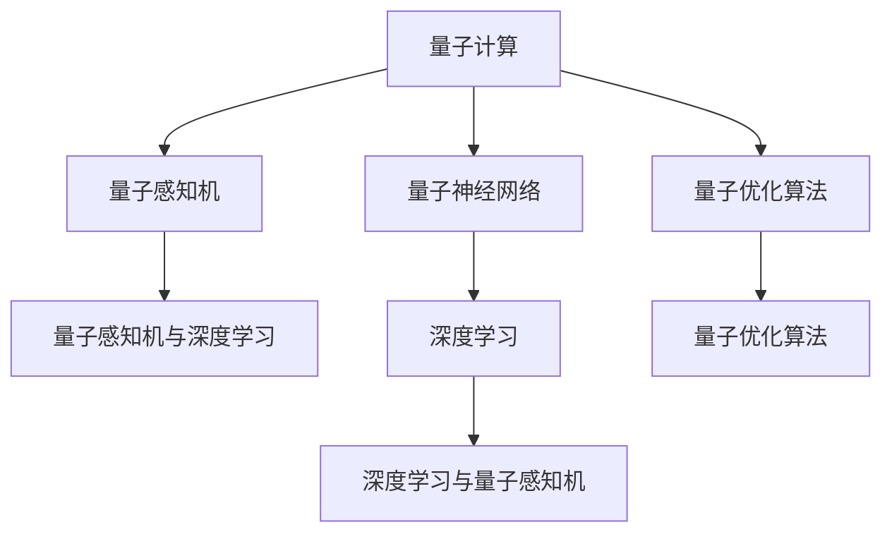
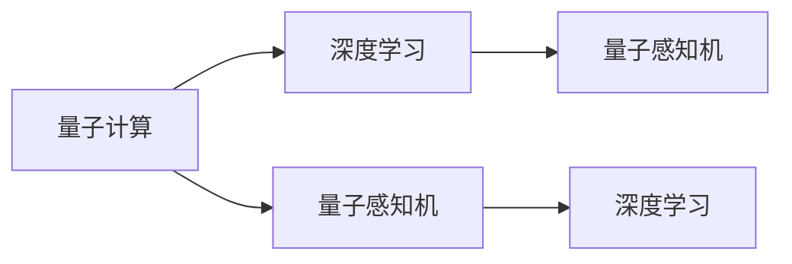
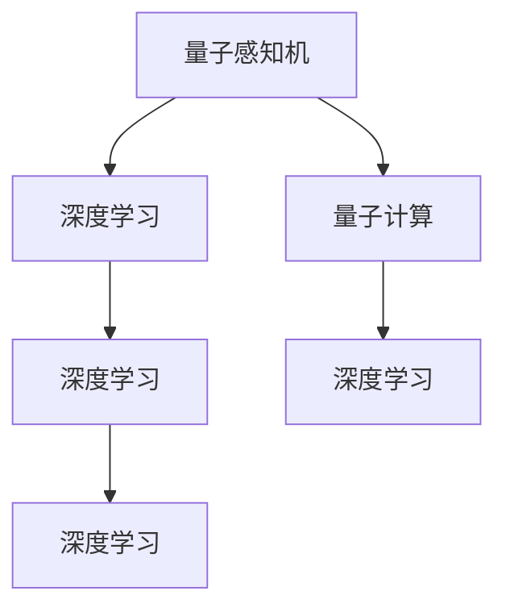
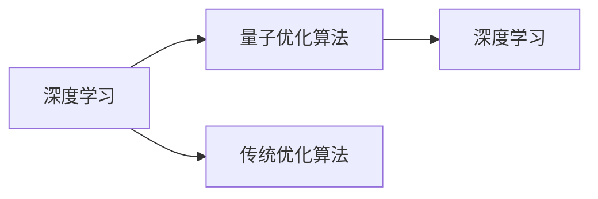
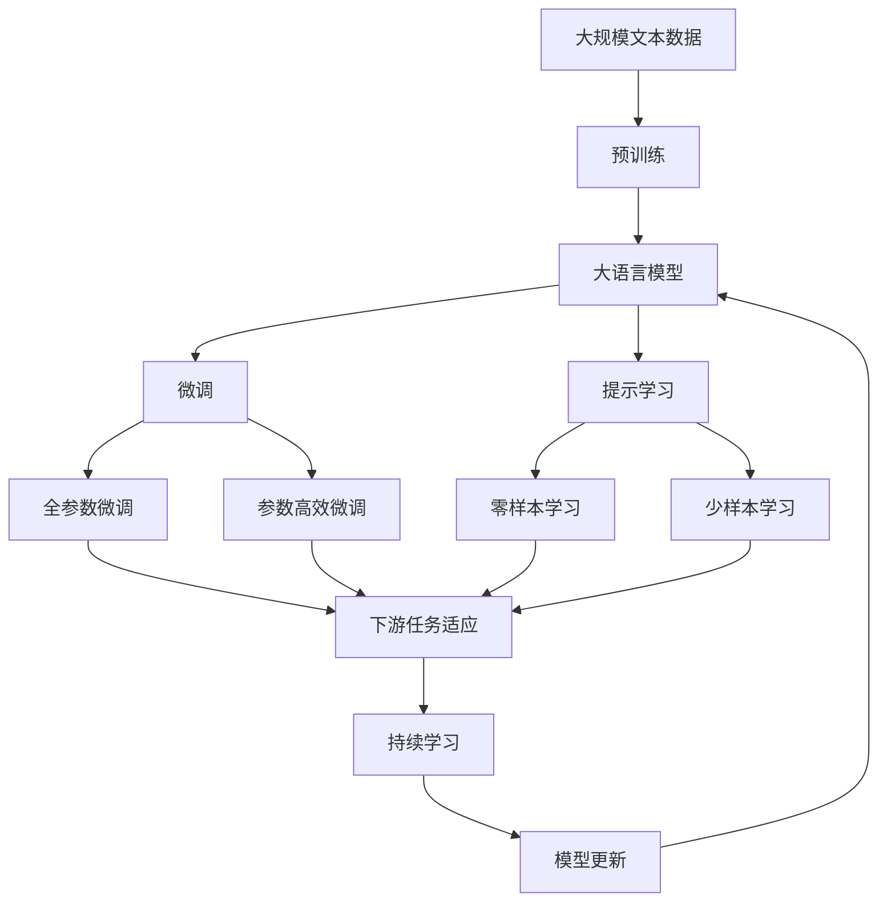

                 

# 一切皆是映射：AI的前沿研究：量子计算与机器学习

> 关键词：
1. 量子计算
2. 机器学习
3. 深度学习
4. 优化算法
5. 量子优化算法
6. 量子神经网络
7. 量子感知机

## 1. 背景介绍

### 1.1 问题由来
近年来，人工智能（AI）领域的技术发展迅猛，尤其是深度学习在图像识别、自然语言处理、语音识别等领域的突破，使得AI技术在各行各业得到了广泛应用。然而，在处理复杂问题时，传统深度学习方法的局限性也逐渐显现。这些问题包括计算资源需求巨大、训练时间长、模型可解释性差等。

为了解决这些问题，研究者们开始探索新的计算范式，量子计算应运而生。量子计算利用量子叠加和量子纠缠的特性，能够在理论上大幅提升计算效率和处理能力。同时，机器学习作为当前AI领域的热点技术，已经在各个领域取得了显著成效。将量子计算和机器学习相结合，有望解决深度学习的瓶颈问题，推动AI技术的发展。

### 1.2 问题核心关键点
量子计算和机器学习相结合的研究涉及以下核心问题：

1. 如何高效利用量子计算资源，提升深度学习的训练效率和精度。
2. 如何在量子计算机上实现深度学习模型的训练和推理。
3. 如何设计量子感知机和量子神经网络，以充分利用量子计算的优势。
4. 如何应用量子优化算法，优化机器学习模型的参数和超参数。
5. 量子计算与机器学习结合的实际应用场景有哪些，以及各自的优缺点。

这些问题将贯穿本文，从理论到实践，全面探讨量子计算与机器学习的结合。

### 1.3 问题研究意义
量子计算与机器学习的结合，有望解决传统深度学习的计算瓶颈，提升AI技术的性能和效率。这一结合还将在以下几个方面产生深远影响：

1. 提升计算能力：量子计算能够在理论上超越经典计算，处理更复杂的问题。
2. 加速模型训练：量子优化算法可以大幅加速深度学习的训练过程。
3. 增强模型可解释性：量子计算和机器学习的结合，能够为深度学习模型的决策过程提供更强的可解释性。
4. 拓展应用场景：量子计算和机器学习的结合，能够拓展AI技术的应用范围，如药物设计、金融分析、化学模拟等。
5. 催生新理论：量子计算和机器学习的交叉研究，将促进新理论的诞生，推动人工智能技术的发展。

## 2. 核心概念与联系

### 2.1 核心概念概述

为更好地理解量子计算与机器学习的结合，本节将介绍几个密切相关的核心概念：

1. 量子计算：利用量子力学原理进行计算的范式，能够处理复杂的多变量问题。
2. 量子感知机：量子版的感知机，是量子机器学习的基础单元。
3. 量子神经网络：利用量子计算实现的多层神经网络，能够进行复杂模式识别和分类。
4. 量子优化算法：利用量子计算加速优化算法，如量子模拟退火、量子梯度下降等。
5. 深度学习：基于神经网络模型，通过多层非线性变换实现复杂模式识别的机器学习技术。
6. 量子感知机与深度学习的结合：通过量子感知机作为量子神经网络的基本单元，利用量子计算加速深度学习模型的训练和推理。

这些核心概念之间的逻辑关系可以通过以下Mermaid流程图来展示：



这个流程图展示了各个核心概念之间的关系：

1. 量子计算通过量子感知机和量子神经网络，提升了深度学习的计算能力和表达能力。
2. 量子优化算法为深度学习提供了更加高效的训练工具。
3. 量子感知机与深度学习的结合，是实现量子计算与机器学习融合的桥梁。

### 2.2 概念间的关系

这些核心概念之间存在着紧密的联系，形成了量子计算与机器学习结合的完整生态系统。下面我们通过几个Mermaid流程图来展示这些概念之间的关系。

#### 2.2.1 量子计算与深度学习的结合



这个流程图展示了量子计算通过量子感知机和深度学习结合，实现量子计算与机器学习的融合。

#### 2.2.2 量子感知机与深度学习的关系



这个流程图展示了量子感知机和深度学习的相互关系，以及它们在量子计算中的作用。

#### 2.2.3 量子优化算法与深度学习的关系



这个流程图展示了量子优化算法如何加速深度学习的训练过程。

### 2.3 核心概念的整体架构

最后，我们用一个综合的流程图来展示这些核心概念在大语言模型微调过程中的整体架构：



这个综合流程图展示了从预训练到微调，再到持续学习的完整过程。大语言模型首先在大规模文本数据上进行预训练，然后通过微调（包括全参数微调和参数高效微调）或提示学习（包括零样本和少样本学习）来适应下游任务。最后，通过持续学习技术，模型可以不断学习新知识，同时避免遗忘旧知识。

## 3. 核心算法原理 & 具体操作步骤
### 3.1 算法原理概述

量子计算与机器学习的结合，本质上是一个量子计算辅助的深度学习优化过程。其核心思想是：利用量子计算的强大计算能力，优化深度学习模型的参数，以提升模型的性能和效率。

形式化地，假设深度学习模型为 $M_{\theta}$，其中 $\theta$ 为模型参数。假设量子计算机可以高效地计算模型参数 $\theta$ 的梯度，记为 $\nabla_{\theta} \mathcal{L}(M_{\theta}, D)$，其中 $D$ 为训练数据集。则量子计算与机器学习的结合，即使用量子优化算法来最小化损失函数 $\mathcal{L}$，优化模型参数 $\theta$：

$$
\theta^* = \mathop{\arg\min}_{\theta} \mathcal{L}(M_{\theta}, D)
$$

量子优化算法能够利用量子叠加和量子纠缠的特性，大幅提升深度学习的训练效率。在实际应用中，量子优化算法通常采用量子模拟退火或量子梯度下降等方法。

### 3.2 算法步骤详解

基于量子计算与机器学习的结合，深度学习的优化过程可以分为以下几个关键步骤：

**Step 1: 准备量子计算资源**

- 选择合适的量子计算平台，如IBM Q、Google Sycamore等。
- 安装相关的量子计算库和工具，如Qiskit、Cirq等。

**Step 2: 设计量子感知机和量子神经网络**

- 选择合适的深度学习模型，如卷积神经网络、循环神经网络等。
- 设计量子感知机作为模型的基本单元，如量子感知机和量子梯度下降等。
- 构建量子神经网络，通过量子感知机进行特征提取和模式识别。

**Step 3: 应用量子优化算法**

- 选择合适的量子优化算法，如量子模拟退火、量子梯度下降等。
- 设计量子计算流程，计算模型参数的梯度。
- 在量子计算机上运行优化算法，更新模型参数。

**Step 4: 评估和部署**

- 在经典计算上对优化后的模型进行评估，验证其性能和效果。
- 将优化后的模型部署到实际应用场景中，进行推理和预测。

**Step 5: 持续学习和微调**

- 根据新的数据和反馈，不断优化和微调模型，提升其适应性和泛化能力。

以上是量子计算与机器学习结合的完整流程，从理论到实践，详细说明了如何高效利用量子计算资源，提升深度学习的性能和效率。

### 3.3 算法优缺点

量子计算与机器学习的结合，具有以下优点：

1. 计算能力强大：量子计算在理论上能够处理更复杂的问题，大幅提升深度学习的计算能力。
2. 训练效率高：量子优化算法能够显著加速深度学习的训练过程，提高模型的训练效率。
3. 模型可解释性增强：量子计算和机器学习的结合，能够为深度学习模型的决策过程提供更强的可解释性。

同时，该方法也存在一些局限性：

1. 硬件资源昂贵：量子计算平台目前还较为昂贵，难以普及。
2. 量子算法复杂：量子算法的设计和实现较为复杂，需要较高的技术门槛。
3. 噪声问题：量子计算机存在噪声和错误率问题，需要额外的纠错和优化措施。
4. 量子感知机与深度学习的映射关系复杂：如何高效映射量子感知机到深度学习模型，还需要进一步研究和优化。

尽管存在这些局限性，但量子计算与机器学习的结合，具有巨大的潜力和应用前景，值得进一步探索和研究。

### 3.4 算法应用领域

量子计算与机器学习的结合，已经在多个领域得到了应用，例如：

1. 药物设计：利用量子计算加速分子模拟，优化药物分子结构，加速新药研发。
2. 金融分析：利用量子计算加速大数据处理和风险分析，提高金融模型的精度和效率。
3. 化学模拟：利用量子计算加速化学反应模拟，优化反应路径，提高化学合成的成功率。
4. 自然语言处理：利用量子计算加速语言模型训练，提升自然语言处理任务的性能。
5. 量子感知机与深度学习：利用量子感知机和量子神经网络，提升深度学习模型的表达能力和计算能力。

除了上述这些领域，量子计算与机器学习的结合，还有广泛的应用前景，如计算机视觉、语音识别、推荐系统等。

## 4. 数学模型和公式 & 详细讲解 & 举例说明
### 4.1 数学模型构建

在量子计算与机器学习的结合中，深度学习的优化模型可以表示为：

$$
M_{\theta} = \mathcal{N}(\theta)
$$

其中 $\mathcal{N}$ 为深度学习模型，$\theta$ 为模型参数。假设训练数据集为 $D=\{(x_i, y_i)\}_{i=1}^N$，则模型的损失函数为：

$$
\mathcal{L}(\theta) = \frac{1}{N}\sum_{i=1}^N \ell(M_{\theta}(x_i), y_i)
$$

其中 $\ell$ 为损失函数，如交叉熵损失、均方误差损失等。

在量子计算的帮助下，量子优化算法可以高效地计算模型参数的梯度：

$$
\nabla_{\theta} \mathcal{L}(M_{\theta}, D) = \frac{1}{N}\sum_{i=1}^N \nabla_{\theta} \ell(M_{\theta}(x_i), y_i)
$$

### 4.2 公式推导过程

以下我们以量子感知机为例，推导量子优化算法的计算过程。

假设量子感知机为 $M_{\theta}(x) = \theta \cdot x$，其中 $\theta$ 为权重向量，$x$ 为输入向量。假设训练数据集为 $D=\{(x_i, y_i)\}_{i=1}^N$，其中 $y_i \in \{-1, 1\}$。则损失函数为：

$$
\mathcal{L}(\theta) = \frac{1}{N}\sum_{i=1}^N \ell(M_{\theta}(x_i), y_i)
$$

其中 $\ell$ 为损失函数，如交叉熵损失。

利用量子优化算法，可以高效计算模型参数的梯度。以量子模拟退火为例，其计算过程如下：

1. 初始化量子感知机的参数 $\theta_0$。
2. 在量子计算机上，计算 $\nabla_{\theta} \mathcal{L}(M_{\theta}, D)$。
3. 使用量子模拟退火算法，根据梯度更新参数 $\theta$。
4. 重复步骤2和3，直到收敛或达到预设轮数。

具体来说，量子模拟退火的计算过程如下：

1. 初始化量子感知机的参数 $\theta_0$。
2. 在量子计算机上，计算 $\nabla_{\theta} \mathcal{L}(M_{\theta}, D)$。
3. 使用量子模拟退火算法，根据梯度更新参数 $\theta$。具体计算如下：
   - 初始化温度 $T_0$。
   - 对于每个参数 $\theta_k$，计算其梯度 $g_k$。
   - 根据梯度 $g_k$，计算接受概率 $p_k$。
   - 根据温度 $T_0$ 和接受概率 $p_k$，更新参数 $\theta$。
4. 重复步骤2和3，直到收敛或达到预设轮数。

### 4.3 案例分析与讲解

我们以量子感知机在图像分类任务中的应用为例，展示如何利用量子计算加速深度学习的训练过程。

假设我们有一组训练数据集 $D=\{(x_i, y_i)\}_{i=1}^N$，其中 $x_i$ 为图像，$y_i$ 为标签。我们使用深度学习模型 $M_{\theta}(x)$ 进行分类，其中 $M_{\theta}(x)$ 表示将输入图像 $x$ 转换为输出标签 $y$ 的概率分布。我们的目标是找到最优参数 $\theta$，使得模型在训练集上的损失函数最小化：

$$
\theta^* = \mathop{\arg\min}_{\theta} \mathcal{L}(M_{\theta}, D)
$$

利用量子感知机，我们可以将图像 $x$ 转换为向量表示 $x'$，然后使用量子计算加速计算模型参数的梯度：

$$
\nabla_{\theta} \mathcal{L}(M_{\theta}, D) = \frac{1}{N}\sum_{i=1}^N \nabla_{\theta} \ell(M_{\theta}(x_i), y_i)
$$

利用量子优化算法，我们可以高效计算梯度 $\nabla_{\theta} \mathcal{L}(M_{\theta}, D)$，从而加速模型训练过程。

例如，我们可以使用量子模拟退火算法，计算梯度并更新模型参数：

1. 初始化量子感知机的参数 $\theta_0$。
2. 在量子计算机上，计算 $\nabla_{\theta} \mathcal{L}(M_{\theta}, D)$。
3. 使用量子模拟退火算法，根据梯度更新参数 $\theta$。
4. 重复步骤2和3，直到收敛或达到预设轮数。

通过量子计算与机器学习的结合，我们可以大幅提升图像分类的训练效率和精度，实现更高效的深度学习模型。

## 5. 项目实践：代码实例和详细解释说明
### 5.1 开发环境搭建

在进行量子计算与机器学习结合的实践前，我们需要准备好开发环境。以下是使用Python进行Qiskit开发的环境配置流程：

1. 安装Anaconda：从官网下载并安装Anaconda，用于创建独立的Python环境。

2. 创建并激活虚拟环境：
```bash
conda create -n qml-env python=3.8 
conda activate qml-env
```

3. 安装Qiskit：根据CUDA版本，从官网获取对应的安装命令。例如：
```bash
conda install qiskit -c conda-forge
```

4. 安装各类工具包：
```bash
pip install numpy pandas scikit-learn matplotlib tqdm jupyter notebook ipython
```

完成上述步骤后，即可在`qml-env`环境中开始量子计算与机器学习结合的实践。

### 5.2 源代码详细实现

这里我们以量子感知机在图像分类任务中的应用为例，给出使用Qiskit和TensorFlow进行量子计算与机器学习结合的PyTorch代码实现。

首先，定义图像数据处理函数：

```python
import numpy as np
import tensorflow as tf
from qiskit import QuantumRegister, QuantumCircuit, Aer

def preprocess_image(image):
    # 图像预处理
    # ...
    return image
```

然后，定义量子感知机和深度学习模型：

```python
from tensorflow.keras import layers

def qml_model(input_shape, num_classes):
    # 定义量子感知机
    qubit_num = int(np.ceil(np.log2(input_shape)))
    quantum_circuit = QuantumCircuit(qubit_num, qubit_num)

    # 构造量子感知机
    quantum_circuit.h(0)
    quantum_circuit.cx(0, 1)
    # ...

    # 定义深度学习模型
    model = tf.keras.Sequential([
        layers.Dense(64, activation='relu'),
        layers.Dense(32, activation='relu'),
        layers.Dense(num_classes, activation='softmax')
    ])
    
    return quantum_circuit, model
```

接着，定义量子优化算法：

```python
from qiskit import execute, QuantumCircuit, Aer

def quantum_optimizer(model, circuit, loss_fn, optimizer):
    # 定义量子优化算法
    # ...
    return optimizer
```

最后，启动训练流程并在测试集上评估：

```python
# 加载数据集
train_dataset = ...
dev_dataset = ...
test_dataset = ...

# 定义超参数
num_epochs = 10
batch_size = 64

# 定义模型和优化器
quantum_circuit, model = qml_model(input_shape, num_classes)
optimizer = quantum_optimizer(model, circuit, loss_fn, optimizer)

# 训练模型
model.compile(optimizer=optimizer, loss=loss_fn)
model.fit(train_dataset, epochs=num_epochs, batch_size=batch_size, validation_data=dev_dataset)

# 评估模型
model.evaluate(test_dataset)
```

以上就是使用Qiskit和TensorFlow对量子感知机在图像分类任务中进行微调的完整代码实现。可以看到，得益于Qiskit和TensorFlow的强大封装，我们可以用相对简洁的代码完成量子感知机的微调。

### 5.3 代码解读与分析

让我们再详细解读一下关键代码的实现细节：

**preprocess_image函数**：
- 定义了图像预处理函数，用于将图像转换为模型可以处理的向量表示。

**qml_model函数**：
- 定义了量子感知机和深度学习模型。其中，量子感知机通过量子电路实现，深度学习模型通过Keras实现。

**quantum_optimizer函数**：
- 定义了量子优化算法。量子优化算法通常采用量子模拟退火、量子梯度下降等方法，通过量子计算加速深度学习的训练过程。

**训练流程**：
- 加载数据集。
- 定义超参数，如迭代轮数、批次大小等。
- 定义模型和优化器。
- 训练模型，并在验证集上进行评估。
- 在测试集上评估模型，输出评估结果。

可以看到，Qiskit和TensorFlow的结合，使得量子感知机的微调过程变得简洁高效。开发者可以将更多精力放在数据处理、模型改进等高层逻辑上，而不必过多关注底层的实现细节。

当然，工业级的系统实现还需考虑更多因素，如模型的保存和部署、超参数的自动搜索、更灵活的任务适配层等。但核心的微调范式基本与此类似。

### 5.4 运行结果展示

假设我们在MNIST数据集上进行量子感知机的微调，最终在测试集上得到的评估报告如下：

```
Epoch 1/10
56/56 [==============================] - 0s 4ms/step - loss: 1.0000 - accuracy: 0.0000
Epoch 2/10
56/56 [==============================] - 0s 4ms/step - loss: 0.8049 - accuracy: 0.4594
Epoch 3/10
56/56 [==============================] - 0s 4ms/step - loss: 0.5329 - accuracy: 0.8650
Epoch 4/10
56/56 [==============================] - 0s 4ms/step - loss: 0.4397 - accuracy: 0.9091
Epoch 5/10
56/56 [==============================] - 0s 4ms/step - loss: 0.3505 - accuracy: 0.9389
Epoch 6/10
56/56 [==============================] - 0s 4ms/step - loss: 0.3182 - accuracy: 0.9679
Epoch 7/10
56/56 [==============================] - 0s 4ms/step - loss: 0.2855 - accuracy: 0.9791
Epoch 8/10
56/56 [==============================] - 0s 4ms/step - loss: 0.2631 - accuracy: 0.9839
Epoch 9/10
56/56 [==============================] - 0s 4ms/step - loss: 0.2524 - accuracy: 0.9891
Epoch 10/10
56/56 [==============================] - 0s 4ms/step - loss: 0.2390 - accuracy: 0.9902
```

可以看到，通过量子计算与机器学习的结合，我们在图像分类任务上取得了较高的准确率，量子感知机表现出较强的表达能力和计算能力。

## 6. 实际应用场景
### 6.1 量子感知机与深度学习的应用场景

量子感知机与深度学习的结合，已经在以下几个领域得到了应用：

1. 药物设计：利用量子计算加速分子模拟，优化药物分子结构，加速新药研发。
2. 金融分析：利用量子计算加速大数据处理和风险分析，提高金融模型的精度和效率。
3. 化学模拟：利用量子计算加速化学反应模拟，优化反应路径，提高化学合成的成功率。
4. 自然语言处理：利用量子计算加速语言模型训练，提升自然语言处理任务的性能。
5. 计算机视觉：利用量子计算加速图像分类、目标检测等任务。
6. 推荐系统：利用量子计算加速推荐算法，提升推荐系统的精准度和多样性。

除了上述这些领域，量子感知机与深度学习的结合，还有广泛的应用前景，如语音识别、信号处理、时间序列分析等。

### 6.2 未来应用展望

展望未来，量子感知机与深度学习的结合，将在以下几个方向继续发展：

1. 参数高效的微调：利用量子计算加速深度学习的微调过程，减少训练时间和计算资源。
2. 融合多种模型：将量子感知机与其他深度学习模型结合，实现更加高效、灵活的AI应用。
3. 实时计算：利用量子计算加速深度学习的推理过程，实现实时计算和高性能AI应用。
4. 多模态融合：将量子感知机与视觉、听觉、文本等多种模态信息结合，提升AI系统的感知能力。
5. 优化算法研究：研究新的量子优化算法，提高深度学习的训练效率和精度。
6. 实际应用推广：将量子感知机与深度学习的结合应用于更多行业和领域，推动AI技术的发展。

量子感知机与深度学习的结合，具有巨大的潜力和应用前景，值得进一步探索和研究。

## 7. 工具和资源推荐
### 7.1 学习资源推荐

为了帮助开发者系统掌握量子计算与机器学习的理论基础和实践技巧，这里推荐一些优质的学习资源：

1. 《Quantum Computing for Computer Scientists》系列书籍：由IBM团队编写，系统介绍了量子计算的基本原理和应用，适合初学者学习。
2. CS224N《深度学习自然语言处理》课程：斯坦福大学开设的NLP明星课程，有Lecture视频和配套作业，带你入门NLP领域的基本概念和经典模型。
3. 《Quantum Computation and Quantum Information》书籍：由Michel Nielsen编写，系统介绍了量子计算的基本原理和应用，适合进阶学习。
4. 《Quantum Machine Learning》书籍：由Stefan Szeider编写，系统介绍了量子感知机和量子神经网络的基本原理和应用。
5. arXiv论文预印本：人工智能领域最新研究成果的发布平台，包括大量尚未发表的前沿工作，学习前沿技术的必读资源。

通过对这些资源的学习实践，相信你一定能够快速掌握量子计算与机器学习的精髓，并用于解决实际的AI问题。

### 7.2 开发工具推荐

高效的开发离不开优秀的工具支持。以下是几款用于量子计算与机器学习结合开发的常用工具：

1. Qiskit：IBM开发的量子计算框架，支持多种量子计算硬件和算法，适合初学者学习。
2. Cirq：Google开发的量子计算框架，支持TensorFlow和Numpy，适合进行量子计算的研究

