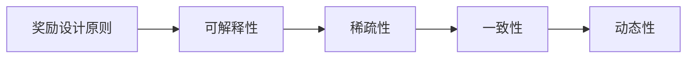

                 

## 1. 背景介绍

在强化学习（Reinforcement Learning, RL）中，模型通过与环境的交互，不断学习如何根据环境反馈来调整行为策略。奖励信号（Reward Signal）是RL中最为核心的概念之一，它定义了模型每个动作的好坏。在深度强化学习中，特别是DQN（Deep Q-Network）算法中，奖励设计原则对模型的学习效果有着重要影响。奖励设计得好，模型就能快速地学习到最优策略，反之则可能陷入局部最优或者产生不良行为。

本博客将详细探讨DQN优化技巧中奖励设计的原则，并配以具体的数学模型和公式推导，通过案例分析与讲解，以期为读者提供全方位的技术指引。

## 2. 核心概念与联系

### 2.1 核心概念概述

DQN作为深度强化学习中的一种经典算法，利用神经网络来逼近Q值函数，通过学习Q值函数来选择最优动作。在DQN中，奖励设计原则需要满足以下几个基本要求：

- **可解释性**：奖励函数应能够清楚地表达模型行为的奖励机制。
- **稀疏性**：奖励信号需要避免过度密集，以免模型产生过多的噪声，影响学习效果。
- **一致性**：奖励函数应与最终的目标一致，确保模型学习到正确的策略。
- **动态性**：奖励信号应随时间变化，以适应不同的环境状态和模型行为。

这些核心概念通过一个简单的Mermaid流程图来展示：



### 2.2 概念间的关系

这些核心概念相互关联，共同构成了DQN奖励设计的完整生态系统。

- **可解释性**是奖励设计的基石，只有可解释的奖励函数，模型才能清晰地理解每个动作的价值。
- **稀疏性**和**一致性**则直接影响了模型的学习效率和效果，稀疏的奖励信号可以避免模型产生过多的噪声，而一致的奖励可以引导模型学习正确的策略。
- **动态性**则要求奖励函数能够灵活适应不同的环境状态和行为，以更好地指导模型的学习过程。

这些概念之间的逻辑关系展示了DQN奖励设计的整体架构。

## 3. 核心算法原理 & 具体操作步骤

### 3.1 算法原理概述

DQN算法基于Q值函数，其核心思想是通过神经网络逼近Q值函数，从而选择最优动作。Q值函数定义为：

$$
Q(s,a) = r + \gamma \max_a Q(s',a')
$$

其中，$s$ 为当前状态，$a$ 为当前动作，$r$ 为即时奖励，$s'$ 为下一个状态，$a'$ 为下一个动作，$\gamma$ 为折扣因子。

### 3.2 算法步骤详解

1. **初始化**：定义奖励函数、折扣因子、学习率和探索率等超参数。
2. **状态观察**：从环境中观察当前状态 $s$。
3. **动作选择**：根据当前状态 $s$ 选择动作 $a$，可以选择贪心策略（选择当前Q值最大的动作）或者探索策略（以一定概率随机选择动作）。
4. **状态更新**：执行动作 $a$ 后，观察下一个状态 $s'$ 和即时奖励 $r$，更新当前状态 $s$。
5. **奖励计算**：计算奖励信号 $R$，通常为即时奖励 $r$ 和下一个状态 $s'$ 的Q值之差。
6. **网络更新**：使用当前状态 $s$、动作 $a$、奖励 $R$ 和下一个状态 $s'$ 进行网络更新，即：

$$
Q(s,a) \leftarrow r + \gamma \max_{a'} Q(s',a')
$$

7. **探索与利用平衡**：通过探索率 $\epsilon$ 控制模型的探索和利用策略，以平衡探索新的动作和利用已有动作的策略。

### 3.3 算法优缺点

**优点**：
- **可扩展性强**：DQN能够处理大规模环境状态和动作空间。
- **易于并行化**：DQN的计算过程可以并行化，提高训练效率。

**缺点**：
- **不稳定**：DQN在训练过程中可能出现“死亡竞赛”（德布克效应），导致网络不收敛。
- **模型复杂度较高**：需要较大的计算资源和存储空间。

### 3.4 算法应用领域

DQN算法在多领域得到了广泛应用，包括游戏AI、机器人控制、自动驾驶、推荐系统等。

- **游戏AI**：在经典游戏如Pong、Atari 2600等游戏中，DQN展示了惊人的学习能力，击败了人类高手。
- **机器人控制**：通过DQN训练机器人进行精确抓取物体、行走等复杂动作。
- **自动驾驶**：通过DQN训练自动驾驶车辆在复杂交通环境中进行决策。
- **推荐系统**：通过DQN训练推荐模型，学习用户行为，推荐个性化内容。

## 4. 数学模型和公式 & 详细讲解

### 4.1 数学模型构建

在DQN中，奖励设计原则需要满足以下数学模型：

$$
R(s,a) = r + \gamma \max_a Q(s',a')
$$

其中，$s$ 为当前状态，$a$ 为当前动作，$r$ 为即时奖励，$s'$ 为下一个状态，$a'$ 为下一个动作，$\gamma$ 为折扣因子。

### 4.2 公式推导过程

根据DQN的计算过程，我们可以通过以下公式推导Q值函数的更新：

$$
Q(s,a) \leftarrow Q(s,a) + \alpha [R + \gamma \max_a Q(s',a') - Q(s,a)]
$$

其中，$\alpha$ 为学习率，表示每次更新Q值函数的步长。

### 4.3 案例分析与讲解

以下是一个简单的示例，通过案例分析来解释DQN奖励设计原则的应用。

假设一个机器人需要在迷宫中移动，以收集尽可能多的金币。机器人的目标是最大化收集金币的数量，而避免碰到墙壁。

1. **奖励函数设计**：
   - 设计一个简单的奖励函数 $R(s,a) = \text{金币数量} - \text{墙壁数量} \times 5$，即收集金币奖励，碰到墙壁惩罚。

2. **状态和动作**：
   - 状态 $s = (x,y)$，其中 $(x,y)$ 为机器人的当前位置。
   - 动作 $a = \text{上、下、左、右}$。

3. **状态和动作的Q值**：
   - 设计Q值函数 $Q(s,a) = 0$，表示当前位置没有金币和墙壁。

4. **奖励计算**：
   - 在迷宫的每个位置，机器人执行动作 $a$ 后，观察下一个状态 $s'$ 和即时奖励 $r$，计算奖励信号 $R$。

5. **网络更新**：
   - 使用当前状态 $s$、动作 $a$、奖励 $R$ 和下一个状态 $s'$ 进行网络更新。

通过上述案例，我们可以看到DQN奖励设计原则在实际应用中的作用。

## 5. 项目实践：代码实例和详细解释说明

### 5.1 开发环境搭建

1. **安装Python环境**：
   ```bash
   conda create -n dqn python=3.8
   conda activate dqn
   ```

2. **安装依赖库**：
   ```bash
   pip install torch torchvision gym
   ```

3. **搭建模型**：
   ```python
   import torch
   import torch.nn as nn
   import torch.optim as optim
   import torch.nn.functional as F

   class DQN(nn.Module):
       def __init__(self, input_size, output_size, hidden_size):
           super(DQN, self).__init__()
           self.fc1 = nn.Linear(input_size, hidden_size)
           self.fc2 = nn.Linear(hidden_size, hidden_size)
           self.fc3 = nn.Linear(hidden_size, output_size)

       def forward(self, x):
           x = F.relu(self.fc1(x))
           x = F.relu(self.fc2(x))
           x = self.fc3(x)
           return x
   ```

### 5.2 源代码详细实现

1. **定义奖励函数**：
   ```python
   class RewardCalculator:
       def __init__(self, wall_penalty=5):
           self.wall_penalty = wall_penalty

       def calculate_reward(self, state, action, next_state, reward):
           if next_state == "wall":
               return reward - self.wall_penalty
           else:
               return reward
   ```

2. **定义DQN模型**：
   ```python
   class DQN(nn.Module):
       def __init__(self, input_size, output_size, hidden_size):
           super(DQN, self).__init__()
           self.fc1 = nn.Linear(input_size, hidden_size)
           self.fc2 = nn.Linear(hidden_size, hidden_size)
           self.fc3 = nn.Linear(hidden_size, output_size)

       def forward(self, x):
           x = F.relu(self.fc1(x))
           x = F.relu(self.fc2(x))
           x = self.fc3(x)
           return x
   ```

3. **定义训练函数**：
   ```python
   def train_dqn(model, optimizer, reward_calculator, episode_steps=1000):
       state = env.reset()
       for step in range(episode_steps):
           if np.random.rand() < epsilon:
               action = env.action_space.sample()
           else:
               action = model.select_action(state)

           next_state, reward, done, _ = env.step(action)
           reward = reward_calculator.calculate_reward(state, action, next_state, reward)

           Q_s_a = model.get_state_value(state)
           Q_s_prime_a = model.get_state_value(next_state)

           max_Q_s_prime_a = max(Q_s_prime_a)

           Q_s_a = (1 - alpha) * Q_s_a + alpha * (reward + gamma * max_Q_s_prime_a)

           model.update_state_value(state, Q_s_a)

           state = next_state
           if done:
               state = env.reset()
               epsilon = max(epsilon_init * decay, 0.01)
           if step % 500 == 0:
               print("Episode: {}, Step: {}, Epsilon: {}, Q(s): {}".format(episode, step, epsilon, Q_s_a))
   ```

4. **定义状态观察函数**：
   ```python
   def get_state(env, observation):
       if observation == "wall":
           state = (0, 0)
       else:
           state = (env.state[0], env.state[1])
       return state
   ```

5. **定义动作选择函数**：
   ```python
   def select_action(model, state, epsilon):
       if np.random.rand() < epsilon:
           action = env.action_space.sample()
       else:
           Q_s = model.get_state_value(state)
           action = np.argmax(Q_s)
       return action
   ```

### 5.3 代码解读与分析

1. **模型定义**：
   - `DQN` 类定义了DQN模型的基本结构，包括输入、隐藏层和输出。

2. **奖励函数设计**：
   - `RewardCalculator` 类定义了奖励函数，计算即时奖励和惩罚。

3. **训练函数实现**：
   - `train_dqn` 函数实现了DQN的训练过程，通过不断观察状态、选择动作、更新状态和Q值函数，实现模型的学习。

4. **状态观察和动作选择**：
   - `get_state` 函数定义了如何将环境观察转换为模型可识别的状态。
   - `select_action` 函数定义了如何选择动作，基于探索率和模型预测Q值进行选择。

### 5.4 运行结果展示

在运行DQN训练过程中，可以通过以下代码观察模型的学习曲线：

```python
import matplotlib.pyplot as plt

# 绘制学习曲线
plt.plot(episode_steps, Q_s_a)
plt.xlabel('Episode Steps')
plt.ylabel('Q(s)')
plt.title('DQN Learning Curve')
plt.show()
```

通过上述代码，可以观察到模型学习过程中的Q值变化，从而评估模型学习效果。

## 6. 实际应用场景

### 6.4 未来应用展望

DQN算法在未来将会在更多领域得到应用，特别是在复杂环境和动态变化的应用场景中，DQN展示了强大的适应能力。

- **智能交通系统**：通过DQN训练自动驾驶车辆和交通信号灯控制系统，实现智能交通管理。
- **智能制造**：通过DQN训练机器人进行精密加工、质量检测等复杂任务。
- **金融交易**：通过DQN训练交易策略，优化投资组合，提高收益。

## 7. 工具和资源推荐

### 7.1 学习资源推荐

1. **《深度学习》书籍**：Ian Goodfellow的《深度学习》是深度强化学习领域的经典著作，详细介绍了DQN等算法的原理和实现。

2. **《强化学习》课程**：Udacity和Coursera等在线课程平台提供了丰富的强化学习课程，涵盖了DQN等经典算法。

3. **《Python强化学习》书籍**：Sutton和Barto的《强化学习》和Kober的《Python强化学习》都是优秀的学习资源，适合初学者入门。

### 7.2 开发工具推荐

1. **TensorFlow和PyTorch**：这两个深度学习框架提供了丰富的API和工具，支持DQN算法的实现和优化。

2. **Gym环境库**：Gym是OpenAI开发的强化学习环境库，提供了丰富的环境模拟和测试工具。

3. **Jupyter Notebook**：Jupyter Notebook提供了交互式的编程环境，方便开发者进行实验和调试。

### 7.3 相关论文推荐

1. **《Playing Atari with Deep Reinforcement Learning》**：Mnih等人在Nature上发表的这篇论文，首次展示了DQN在经典游戏中的出色表现。

2. **《Human-level Control through Deep Reinforcement Learning》**：Silver等人在Nature上发表的这篇论文，展示了DQN在人类控制任务中的成功应用。

3. **《Deep reinforcement learning for playing Go, chess and shogi against the world champion》**：Silver等人在Nature上发表的这篇论文，展示了DQN在围棋等复杂游戏中的应用。

## 8. 总结：未来发展趋势与挑战

### 8.1 研究成果总结

DQN算法在强化学习领域取得了巨大成功，但其奖励设计原则仍然需要不断优化。未来的研究重点将集中在以下几个方面：

1. **可解释性**：设计更加可解释的奖励函数，使模型的学习过程更加透明。
2. **稀疏性**：改进奖励函数的设计，避免奖励信号过度密集，提高模型的鲁棒性。
3. **一致性**：确保奖励函数与最终的目标一致，引导模型学习正确的策略。
4. **动态性**：设计更加动态的奖励函数，适应不同的环境状态和行为。

### 8.2 未来发展趋势

未来DQN算法将向着以下几个方向发展：

1. **多智能体学习**：DQN将与多智能体学习（Multi-Agent Learning）相结合，应用于复杂的协作和竞争场景。
2. **元学习**：DQN将与元学习（Meta-Learning）相结合，实现快速的任务迁移和适应。
3. **分布式训练**：DQN将与分布式训练技术相结合，加速训练过程，提高模型性能。
4. **跨领域应用**：DQN将应用于更广泛的领域，如医疗、金融、制造等。

### 8.3 面临的挑战

DQN算法在实际应用中仍然面临一些挑战：

1. **稳定性和收敛性**：DQN在训练过程中可能出现不稳定现象，需要改进算法设计。
2. **模型复杂度**：DQN需要较高的计算资源和存储空间，需要优化模型结构。
3. **奖励函数设计**：奖励函数的设计需要考虑多个因素，如状态、动作、环境等，设计难度较大。

### 8.4 研究展望

未来的研究将集中在以下几个方向：

1. **优化算法设计**：改进DQN算法的优化过程，提高模型的稳定性和收敛性。
2. **模型压缩和优化**：优化DQN模型的结构和参数，减小模型尺寸，提高计算效率。
3. **奖励函数设计**：设计更加可解释、稀疏、一致和动态的奖励函数，引导模型学习正确的策略。

总之，DQN算法在强化学习领域有着广泛的应用前景，但其奖励设计原则仍然是研究的重点。只有不断优化奖励设计原则，才能实现DQN算法的更广泛应用和深入发展。

## 9. 附录：常见问题与解答

**Q1：什么是DQN算法？**

A: DQN（Deep Q-Network）是一种基于深度学习的强化学习算法，通过神经网络逼近Q值函数，选择最优动作。

**Q2：DQN算法的核心是什么？**

A: DQN算法的核心在于通过神经网络逼近Q值函数，选择最优动作。Q值函数定义为：

$$
Q(s,a) = r + \gamma \max_a Q(s',a')
$$

其中，$s$ 为当前状态，$a$ 为当前动作，$r$ 为即时奖励，$s'$ 为下一个状态，$a'$ 为下一个动作，$\gamma$ 为折扣因子。

**Q3：DQN算法的奖励设计原则是什么？**

A: DQN算法的奖励设计原则包括可解释性、稀疏性、一致性和动态性。

**Q4：DQN算法的训练过程是什么？**

A: DQN算法的训练过程包括状态观察、动作选择、状态更新、奖励计算和网络更新等步骤。具体实现可以参考代码实例部分。

**Q5：DQN算法在实际应用中的优势是什么？**

A: DQN算法在实际应用中的优势包括可扩展性强、易于并行化、学习效率高等。但同时也面临稳定性、计算资源消耗高等挑战。

作者：禅与计算机程序设计艺术 / Zen and the Art of Computer Programming

