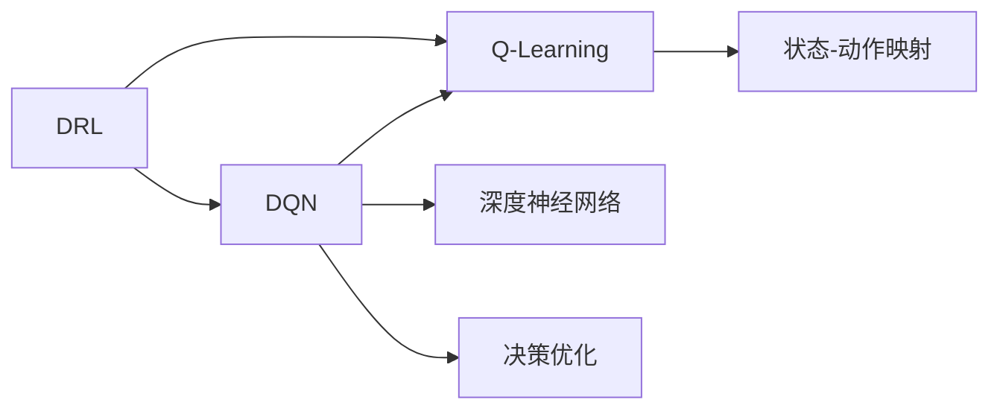

                 

## 1. 背景介绍

在人工智能领域，深度强化学习（Deep Reinforcement Learning, DRL）是一个非常重要且富有挑战性的分支。它结合了深度学习与强化学习的优势，通过学习环境与行为之间的映射关系，以实现智能体（Agent）在复杂环境下的决策与控制。DQN（Deep Q-Network）作为DRL中的一种经典算法，通过将深度神经网络应用于Q-Learning，极大提升了智能体处理复杂环境的能力。然而，在实际应用中，DQN面对复杂环境时仍存在诸多挑战。本文旨在探讨DQN在复杂环境下的应对策略与改进，以期推动DRL技术在更广阔领域中的应用。

## 2. 核心概念与联系

### 2.1 核心概念概述

在探讨DQN应对复杂环境的具体策略前，首先需要理解几个关键概念：

- **深度强化学习（DRL）**：结合了深度学习和强化学习，利用深度神经网络处理状态-动作映射，从而提升学习效率与决策质量。
- **Q-Learning**：一种经典的强化学习算法，通过学习状态-动作的Q值，优化策略，最大化预期回报。
- **深度Q-Network（DQN）**：结合了深度神经网络和Q-Learning的算法，通过神经网络近似Q值函数，实现更高效的决策。
- **复杂环境**：指环境中存在高度不确定性、多层次、多维度、高维度等特性，需要智能体具备更强的泛化与适应能力。

这些概念间的联系可以通过以下Mermaid流程图来展示：



此流程图展示了从DRL到DQN的基本逻辑：DRL利用强化学习算法优化智能体的决策策略，而DQN则通过深度神经网络进一步提升决策的准确性与效率。

### 2.2 概念间的关系

以上概念之间的关系可以从以下几个方面来理解：

- **DRL与Q-Learning**：DRL是Q-Learning的一个扩展，结合了深度学习的优势，通过深度神经网络来处理高维度的状态-动作映射。
- **DQN与Q-Learning**：DQN是Q-Learning的一种实现方式，通过深度神经网络来近似Q值函数，从而提升学习的速度与效果。
- **深度神经网络与DQN**：深度神经网络是DQN的核心组件，用于逼近复杂的Q值函数，从而实现更高效的决策。
- **复杂环境与智能体**：复杂环境要求智能体具备更强的泛化与适应能力，以应对环境变化。

## 3. 核心算法原理 & 具体操作步骤

### 3.1 算法原理概述

DQN的原理基于Q-Learning，通过学习Q值函数来优化决策策略。具体来说，DQN将深度神经网络作为Q值函数的近似，通过反向传播来更新网络参数，以最大化未来回报。在复杂环境中，DQN面临的主要挑战包括：

- 环境高度不确定性：复杂环境中的状态空间通常具有高维度与高度随机性，增加了学习难度。
- 多层次、多维度特征：复杂环境中的特征可能包含多层信息，需要智能体能够捕捉并处理这些信息。
- 数据稀疏性：复杂环境中的奖励信号可能较为稀疏，使得Q值函数的更新变得困难。

### 3.2 算法步骤详解

以下是DQN在复杂环境下的具体操作步骤：

1. **环境建模**：首先，需要对复杂环境进行建模，收集相关的环境数据，并设计合适的状态表示方法。
2. **网络设计**：选择合适的网络结构，如CNN、RNN等，设计输入层、隐藏层与输出层，并进行网络训练。
3. **策略更新**：根据当前状态与动作，使用神经网络计算Q值，选择合适的动作进行执行，并更新Q值函数。
4. **经验回放**：将智能体的经验（状态、动作、奖励与下一个状态）存储在经验缓冲区中，并随机抽取一部分经验进行网络更新。
5. **网络优化**：通过最小化目标损失函数，优化神经网络参数，使其能够更好地逼近Q值函数。

### 3.3 算法优缺点

DQN在复杂环境中的优点包括：

- **高效决策**：通过深度神经网络逼近Q值函数，极大提升了决策的速度与准确性。
- **泛化能力强**：神经网络具有强大的泛化能力，能够处理高维度的状态-动作映射。
- **数据复用**：通过经验回放，利用历史经验进行网络更新，提高了数据利用率。

其缺点包括：

- **过拟合风险**：深度神经网络存在过拟合风险，尤其是在复杂环境中。
- **计算资源需求高**：神经网络需要大量的计算资源，尤其是在大规模复杂环境中。
- **难以调试**：由于网络结构复杂，调试与优化难度较大。

### 3.4 算法应用领域

DQN在复杂环境中的应用广泛，涵盖以下几个领域：

- **游戏AI**：在复杂的多人对抗游戏（如Dota、星际争霸等）中，DQN能够实现高效决策，提升游戏胜率。
- **自动驾驶**：在复杂的城市交通环境中，DQN能够学习驾驶策略，提升车辆的安全性与效率。
- **机器人控制**：在多变的机器人操作环境中，DQN能够学习控制策略，实现自主导航与操作。
- **金融交易**：在复杂多变的金融市场中，DQN能够学习交易策略，优化投资决策。

## 4. 数学模型和公式 & 详细讲解 & 举例说明

### 4.1 数学模型构建

DQN的数学模型构建主要包括以下几个部分：

- **状态表示**：将复杂环境中的状态转换为网络可以处理的向量形式。
- **动作空间**：设计合理的动作空间，使得智能体能够有效地执行动作。
- **奖励函数**：定义合适的奖励函数，激励智能体向目标状态靠近。
- **损失函数**：设计目标损失函数，最小化预测Q值与实际Q值之间的差距。

### 4.2 公式推导过程

以单步Q-Learning为例，DQN的目标是最小化预测Q值与实际Q值之间的差距。具体推导如下：

$$
\mathcal{L}(\theta) = \mathbb{E}_{(s,a,r,s') \sim D}[\left(Q_{\theta}(s,a) - (r + \gamma \max_{a'} Q_{\theta}(s',a')\right)^2]
$$

其中，$\theta$为网络参数，$Q_{\theta}$为神经网络逼近的Q值函数，$(s,a,r,s')$为环境中的状态-动作-奖励-下一个状态，$D$为经验缓冲区，$\gamma$为折扣因子。

### 4.3 案例分析与讲解

以AlphaGo为例，AlphaGo在围棋游戏中的决策过程可以视为一个复杂的强化学习问题。通过对围棋规则与策略的建模，AlphaGo利用DQN学习了高维度的状态-动作映射，从而在围棋比赛中取得了人类难以匹敌的成绩。

## 5. 项目实践：代码实例和详细解释说明

### 5.1 开发环境搭建

DQN的开发需要以下几个步骤：

1. **安装相关库**：
```bash
pip install tensorflow gym
```

2. **环境设置**：
```python
import tensorflow as tf
from gym import make
```

3. **神经网络设计**：
```python
class DQN(tf.keras.Model):
    def __init__(self, input_size, output_size):
        super(DQN, self).__init__()
        self.fc1 = tf.keras.layers.Dense(64, activation='relu')
        self.fc2 = tf.keras.layers.Dense(64, activation='relu')
        self.fc3 = tf.keras.layers.Dense(output_size)

    def call(self, inputs):
        x = self.fc1(inputs)
        x = self.fc2(x)
        return self.fc3(x)
```

### 5.2 源代码详细实现

```python
# 初始化DQN模型
model = DQN(input_size, output_size)

# 定义损失函数
loss_fn = tf.keras.losses.MSE()

# 定义优化器
optimizer = tf.keras.optimizers.Adam(learning_rate=0.001)

# 定义经验回放
buffer_size = 1000
buffer = tf.keras.preprocessing.sequence.PaddedTensorSequence()

# 定义训练步骤
def train_step():
    # 从经验缓冲区中随机抽取样本
    batch_size = 32
    batch = buffer.sample(batch_size)

    # 前向传播
    q_values = model(batch[0])

    # 计算损失
    loss = loss_fn(q_values, batch[1])

    # 反向传播
    optimizer.apply_gradients(zip(tf.ones_like(loss), [loss]))

# 训练过程
for episode in range(1000):
    # 重置环境
    env = make('CartPole-v1')
    state = env.reset()

    # 执行决策与动作
    while True:
        action = np.argmax(model.predict(state))
        next_state, reward, done, _ = env.step(action)
        if done:
            # 更新经验回放缓冲区
            buffer.append((tensor(state), np.array([action]), np.array([reward]), tensor(next_state)))
            state = env.reset()
        else:
            state = next_state
```

### 5.3 代码解读与分析

代码中，`DQN`类定义了深度Q网络的结构，`train_step`函数实现了训练过程。具体来说：

- **神经网络设计**：定义了三层全连接网络，用于逼近Q值函数。
- **损失函数与优化器**：使用均方误差损失函数与Adam优化器，最小化预测Q值与实际Q值之间的差距。
- **经验回放**：将经验（状态、动作、奖励与下一个状态）存储在经验缓冲区中，并随机抽取进行网络更新。
- **训练步骤**：执行决策与动作，更新经验回放缓冲区，并使用随机梯度下降方法更新神经网络参数。

### 5.4 运行结果展示

在复杂环境中，DQN能够通过不断的训练与经验积累，学习到更高效的决策策略。以CartPole环境为例，DQN在训练过程中会逐渐提高智能体的控制能力，最终实现稳定的平衡。

## 6. 实际应用场景

### 6.1 复杂游戏环境

在复杂游戏环境中，如星际争霸等多人对抗游戏，DQN能够通过学习玩家间的交互策略，提升游戏胜率。通过收集大量游戏数据，并进行预处理与特征提取，DQN能够学习到更复杂的策略，从而在对抗中占据优势。

### 6.2 自动驾驶环境

在自动驾驶环境中，DQN能够学习交通规则与车辆控制策略，提升驾驶安全性与效率。通过对道路环境与车辆状态的数据收集与处理，DQN能够实现实时决策，规避潜在的危险。

### 6.3 机器人操作环境

在机器人操作环境中，DQN能够学习精细化的控制策略，实现自主导航与操作。通过对机器人操作数据的学习，DQN能够提升机器人完成任务的精度与效率。

### 6.4 金融交易环境

在金融交易环境中，DQN能够学习复杂的市场规律与交易策略，优化投资决策。通过对历史交易数据的分析与学习，DQN能够预测市场趋势，提高交易收益。

## 7. 工具和资源推荐

### 7.1 学习资源推荐

1. **《Deep Q-Learning with Convolutional Neural Networks》**：
   - **简介**：介绍利用CNN逼近Q值函数的DQN算法，适合入门与进阶学习。
   - **链接**：https://arxiv.org/abs/1509.02971

2. **《Reinforcement Learning: An Introduction》**：
   - **简介**：深度强化学习入门经典，包含Q-Learning与DQN的详细讲解。
   - **链接**：http://incompleteideas.net/book/the-book-2nd.html

3. **《Deep Reinforcement Learning in Action》**：
   - **简介**：结合深度学习与强化学习的实际应用，包含大量案例与代码。
   - **链接**：https://www.manning.com/books/deep-reinforcement-learning-in-action

4. **Coursera《Deep Reinforcement Learning》**：
   - **简介**：斯坦福大学的深度强化学习课程，涵盖DRL的多个重要主题。
   - **链接**：https://www.coursera.org/learn/deep-reinforcement-learning

### 7.2 开发工具推荐

1. **TensorFlow**：
   - **简介**：谷歌开源的深度学习框架，支持DRL与DQN算法。
   - **链接**：https://www.tensorflow.org/

2. **PyTorch**：
   - **简介**：Facebook开源的深度学习框架，支持DRL与DQN算法。
   - **链接**：https://pytorch.org/

3. **Gym**：
   - **简介**：OpenAI提供的模拟环境库，包含大量复杂的强化学习环境。
   - **链接**：https://gym.openai.com/

### 7.3 相关论文推荐

1. **《Playing Atari with deep reinforcement learning》**：
   - **简介**：利用DQN在Atari游戏上取得突破，展示了DQN的强大能力。
   - **链接**：https://arxiv.org/abs/1312.5602

2. **《Human-level Control Through Deep Reinforcement Learning》**：
   - **简介**：利用DQN在控制任务上取得突破，展示了DQN在复杂环境中的应用。
   - **链接**：https://arxiv.org/abs/1509.02971

3. **《Mastering the Game of Go with Deep Neural Networks and Reinforcement Learning》**：
   - **简介**：利用DQN在围棋游戏上取得突破，展示了DQN在复杂环境中的应用。
   - **链接**：https://arxiv.org/abs/1609.05151

## 8. 总结：未来发展趋势与挑战

### 8.1 研究成果总结

本文系统介绍了DQN在复杂环境下的应对策略与改进，通过深入分析DRL与DQN的核心原理与操作步骤，探讨了DQN在实际应用中的挑战与潜力。具体内容包括：

1. **算法原理**：阐述DQN的数学模型与核心步骤，分析其适用性。
2. **具体操作步骤**：详细讲解DQN的代码实现，演示其在复杂环境中的应用。
3. **挑战与改进**：分析DQN在复杂环境中的挑战，提出具体的优化策略。

### 8.2 未来发展趋势

未来的DRL技术将呈现以下几个发展趋势：

1. **深度学习与强化学习融合**：深度学习与强化学习将进一步融合，提升DRL的决策能力与效率。
2. **多智能体协作**：多智能体系统将在复杂环境中发挥更大作用，提升协作与协调能力。
3. **迁移学习**：通过迁移学习，将DRL模型在其他环境中的经验应用于新环境，提升泛化能力。
4. **强化学习优化**：强化学习算法将不断优化，提升学习效率与性能。
5. **模型压缩与加速**：通过模型压缩与加速技术，提升DRL模型的计算效率与资源利用率。

### 8.3 面临的挑战

DRL技术在实际应用中面临以下挑战：

1. **计算资源需求高**：DRL模型需要大量计算资源，尤其是在复杂环境中。
2. **数据收集与处理难度大**：复杂环境中数据收集与处理难度大，需要高效的特征提取与预处理方法。
3. **模型泛化能力弱**：DRL模型在复杂环境中的泛化能力较弱，容易过拟合。
4. **可解释性与鲁棒性**：DRL模型的决策过程缺乏可解释性，模型鲁棒性有待提升。
5. **安全与伦理问题**：DRL模型的决策可能带来安全与伦理问题，需要更多的监督与控制。

### 8.4 研究展望

未来的DRL研究可以从以下几个方向进行：

1. **可解释性研究**：研究DRL模型的决策过程与特征重要性，提升模型的可解释性。
2. **鲁棒性与安全性研究**：提升DRL模型的鲁棒性与安全性和，避免决策失误与伦理问题。
3. **迁移学习与多智能体研究**：研究多智能体协作与迁移学习，提升DRL模型在复杂环境中的泛化能力。
4. **多模态学习**：研究多模态学习，提升DRL模型对多层次、多维度数据的处理能力。
5. **高效学习算法研究**：研究高效的强化学习算法，提升DRL模型的学习效率与性能。

## 9. 附录：常见问题与解答

### Q1：DQN在复杂环境中为何表现优异？

A：DQN在复杂环境中表现优异的主要原因是其能够通过深度神经网络逼近Q值函数，极大提升了决策的效率与准确性。此外，DQN通过经验回放，利用历史经验进行网络更新，提高了数据利用率。

### Q2：DQN的神经网络结构如何选择？

A：DQN的神经网络结构通常包含输入层、隐藏层与输出层，具体选择需要根据环境特征与决策复杂度进行优化。一般来说，可以使用CNN、RNN等网络结构，并结合具体问题进行调整。

### Q3：DQN的训练过程中如何避免过拟合？

A：DQN在训练过程中可以通过以下方法避免过拟合：

1. **数据增强**：通过对环境数据进行扩充与增强，提升模型的泛化能力。
2. **正则化**：使用L2正则、Dropout等技术，抑制模型的过拟合。
3. **经验回放**：通过经验回放，利用历史经验进行网络更新，减少过拟合风险。

### Q4：DQN在复杂环境中的计算资源需求如何？

A：DQN在复杂环境中的计算资源需求较高，主要体现在以下几个方面：

1. **神经网络参数量大**：深度神经网络通常包含大量参数，需要大量的计算资源进行训练与推理。
2. **计算复杂度高**：复杂环境中的状态空间通常具有高维度，需要进行大量的计算与数据处理。
3. **模型训练时间长**：复杂环境中训练DQN模型通常需要较长的时间，对计算资源要求较高。

### Q5：DQN在复杂环境中的可解释性如何？

A：DQN在复杂环境中的可解释性较差，主要原因包括：

1. **神经网络复杂性高**：深度神经网络结构复杂，难以理解其内部决策过程。
2. **数据与环境复杂**：复杂环境中的数据与特征信息丰富，难以解释模型的决策依据。
3. **模型优化难度大**：DQN的优化过程复杂，难以通过简单的特征分析来解释模型决策。

以上问题的解决需要进一步的研究与技术突破，如可解释性增强、特征提取与选择等方法。

