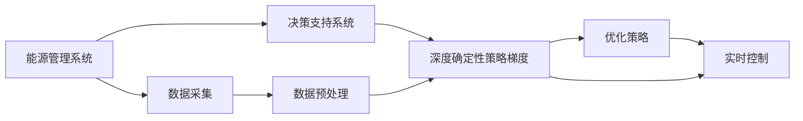

                 

# 一切皆是映射：DQN在能源管理系统中的应用与价值

> 关键词：DQN, 强化学习, 能源管理, 决策支持, 优化算法

## 1. 背景介绍

在当今数字化转型和能源需求日益增长的背景下，能源管理系统(Energy Management System, EMS)正成为电网运营商、工业企业、数据中心等关键基础设施中的重要组成部分。这些系统负责监控、管理和调度能源资源，以确保高效、稳定、可靠的能源供应。然而，随着能源需求的增加和能源市场的波动，传统能源管理系统在应对复杂多变的环境时，面临诸多挑战，如运行效率低下、系统响应速度慢、故障预测精度不足等。

为了解决这些问题，增强能源管理系统的智能化和自动化水平，研究人员和工程师们开始探索利用人工智能(AI)技术，特别是强化学习(Reinforcement Learning, RL)技术，来优化能源调度、需求响应、故障预测等关键功能。其中，深度确定性策略梯度(Dependence-Q-Net, DQN)是一种常用的RL算法，它基于神经网络实现，能够有效处理复杂的非线性决策问题。

本文将系统性地探讨DQN在能源管理系统中的应用，包括其基本原理、实际应用场景、算法实现、性能评估，以及未来的发展趋势。通过深入分析，希望能为能源管理领域的技术人员和决策者提供有价值的参考，推动能源管理系统的智能化升级，提升能源效率和经济效益。

## 2. 核心概念与联系

### 2.1 核心概念概述

在深入研究DQN在能源管理系统中的应用之前，我们先简要介绍几个关键概念：

- **深度确定性策略梯度(DQN)**：DQN是一种基于神经网络实现的强化学习算法。它通过模拟游戏过程，让智能体通过试错的方式学习最优策略，从而在特定环境中最大化累积奖励。DQN能够处理高维度、非线性的决策问题，适用于复杂的控制和调度任务。

- **能源管理系统(EMS)**：EMS是用于监控、管理和调度能源资源的软件系统。它集成了数据采集、分析、优化和控制等功能，广泛应用于电力、工业、建筑等领域，旨在实现能源的高效利用和优化调度。

- **强化学习(RL)**：RL是一种机器学习方法，通过智能体与环境的交互，通过试错的方式学习最优策略。RL算法通常包括Q-learning、SARSA、DQN等，其中DQN是最具代表性的一种。

- **决策支持系统(DSS)**：DSS是用于辅助决策者进行复杂决策的软件系统。DSS通常结合专家系统、数据挖掘、优化算法等技术，提供决策支持和决策建议。

这些概念之间存在着紧密的联系，构成了DQN在能源管理系统中的应用框架。DQN通过RL技术，学习最优的决策策略，用于优化能源管理的各个环节；EMS提供数据采集和处理的基础设施，支持DSS的运行；DSS则利用DQN等算法，提供智能化的决策支持，提升能源管理的效率和可靠性。

### 2.2 概念间的关系

以下是一个综合性的Mermaid流程图，展示了DQN在能源管理系统中的应用流程及其与其他核心概念的关系：



这个流程图展示了DQN在能源管理系统中的应用流程：

1. 能源管理系统(A)从各个传感器和设备中采集数据(B)，并经过数据预处理(D)后，输入到决策支持系统(C)。
2. 决策支持系统(C)利用DQN(E)算法，学习最优的决策策略，并生成优化策略(F)。
3. 优化策略(F)被实时控制(G)模块执行，实现能源资源的优化调度和管理。

通过这个流程，我们可以看到DQN在能源管理系统中的应用框架，以及与其他核心概念的紧密联系。

## 3. 核心算法原理 & 具体操作步骤
### 3.1 算法原理概述

DQN算法基于神经网络实现，通过模拟游戏过程，让智能体通过试错的方式学习最优策略。具体来说，DQN算法包括以下几个关键步骤：

1. **环境感知**：智能体观察当前环境状态，并将状态输入到神经网络中，得到估计的Q值。
2. **策略选择**：智能体根据当前状态的Q值，选择一个动作。
3. **执行动作**：智能体执行所选动作，观察环境变化并得到即时奖励。
4. **策略更新**：智能体利用即时奖励和下一个状态的估计Q值，更新神经网络中的参数，以提高预测准确性。
5. **重复执行**：智能体不断重复上述步骤，直到学习到最优策略。

在能源管理系统中，DQN算法主要用于优化能源调度、需求响应、故障预测等任务。例如，智能体可以学习如何根据历史负荷数据、天气预报、用户需求等信息，制定最优的能源分配策略，或者预测未来的能源需求和故障情况，以提前进行应对。

### 3.2 算法步骤详解

下面，我们将详细讲解DQN算法的各个步骤：

**步骤1：环境感知**

智能体首先需要感知当前环境的状态。在能源管理系统中，状态通常包括：

- 当前时间、日期和天气状况
- 实时负荷数据
- 设备状态和运行参数
- 用户需求和偏好

这些状态信息被输入到一个神经网络中，输出一个估计的Q值。Q值表示在当前状态下执行某个动作的即时奖励和未来累积奖励的预期值。

**步骤2：策略选择**

智能体根据当前状态的估计Q值，选择最优的动作。在能源管理系统中，动作通常包括：

- 调整设备运行参数
- 调整能源分配比例
- 响应需求响应信号
- 预测故障并进行维护

智能体通过比较不同动作的Q值，选择Q值最大的动作进行执行。

**步骤3：执行动作**

智能体执行所选动作后，观察环境变化并得到即时奖励。在能源管理系统中，奖励通常包括：

- 能源节约的电能
- 减少的运行成本
- 提升的用户满意度
- 降低的故障率

**步骤4：策略更新**

智能体利用即时奖励和下一个状态的估计Q值，更新神经网络中的参数，以提高预测准确性。在能源管理系统中，参数更新通常通过反向传播算法实现，步骤如下：

1. 利用即时奖励和下一个状态的估计Q值，计算出当前动作的实际Q值。
2. 利用实际Q值和估计Q值的差值，计算出误差。
3. 通过误差反向传播，更新神经网络中的参数。

**步骤5：重复执行**

智能体不断重复上述步骤，直到学习到最优策略。在能源管理系统中，智能体通常通过模拟环境进行训练，每次训练循环为一个周期。

### 3.3 算法优缺点

DQN算法在能源管理系统中具有以下优点：

1. **高效性**：DQN能够处理高维度、非线性的决策问题，适用于复杂的控制和调度任务。
2. **自适应性**：DQN能够根据环境变化自适应地调整策略，适应复杂的能源需求和故障情况。
3. **鲁棒性**：DQN在面对噪声和干扰时具有较强的鲁棒性，能够稳定地进行决策。

同时，DQN也存在一些缺点：

1. **数据需求**：DQN需要大量的历史数据进行训练，这对能源管理系统来说可能是个问题。
2. **模型复杂度**：DQN的神经网络模型较为复杂，训练和推理时间较长。
3. **内存消耗**：DQN在训练和推理时，需要大量的内存来存储神经网络的参数和中间结果。

### 3.4 算法应用领域

DQN算法在能源管理系统中的应用领域非常广泛，主要包括以下几个方面：

1. **能源调度**：DQN可以用于优化能源的分配和调度，例如根据用户需求和天气变化，实时调整发电、输电和配电策略。
2. **需求响应**：DQN可以用于需求响应的优化，例如在负荷高峰期通过激励措施，鼓励用户减少用电。
3. **故障预测**：DQN可以用于设备故障的预测，例如通过监测设备的运行状态，预测未来的故障发生概率。
4. **经济优化**：DQN可以用于经济优化，例如通过优化能源的价格和分配，提高能源的使用效率和经济效益。

## 4. 数学模型和公式 & 详细讲解 & 举例说明

### 4.1 数学模型构建

DQN算法基于神经网络实现，其数学模型可以表示为：

$$
\hat{Q}(s,a) = \theta^T\phi(s,a)
$$

其中，$s$表示当前状态，$a$表示当前动作，$\hat{Q}$表示估计的Q值，$\theta$表示神经网络中的参数，$\phi$表示状态到动作的映射函数。

DQN的目标是最小化即时奖励和未来累积奖励的期望值之差，即：

$$
\min_{\theta} \mathbb{E}[\sum_{t=0}^{\infty} \gamma^t r_t - \hat{Q}(s_0, a_0)]
$$

其中，$r_t$表示即时奖励，$\gamma$表示折扣因子。

### 4.2 公式推导过程

DQN算法的公式推导过程如下：

1. 定义状态值函数$V$，表示在当前状态下，执行某个动作的即时奖励和未来累积奖励的预期值：

$$
V(s) = \max_a Q(s,a)
$$

2. 定义动作值函数$Q$，表示在当前状态下执行某个动作的即时奖励和未来累积奖励的预期值：

$$
Q(s,a) = r + \gamma V(s')
$$

其中，$s'$表示下一个状态。

3. 定义神经网络的输出函数$\hat{Q}$，表示在当前状态下执行某个动作的即时奖励和未来累积奖励的预期值的估计值：

$$
\hat{Q}(s,a) = \theta^T\phi(s,a)
$$

其中，$\theta$表示神经网络中的参数，$\phi$表示状态到动作的映射函数。

4. 定义DQN算法的目标函数，即最小化即时奖励和未来累积奖励的期望值之差：

$$
\min_{\theta} \mathbb{E}[\sum_{t=0}^{\infty} \gamma^t r_t - \hat{Q}(s_0, a_0)]
$$

通过反向传播算法，求解上述目标函数的最小值，即可得到最优的神经网络参数$\theta$。

### 4.3 案例分析与讲解

以能源调度为例，DQN算法可以学习如何根据历史负荷数据、天气预报、用户需求等信息，制定最优的能源分配策略。具体来说，DQN算法可以采取以下步骤：

1. 定义状态空间：将历史负荷数据、天气预报、用户需求等信息作为状态空间。
2. 定义动作空间：定义动作空间为可调节的设备参数，例如发电机的转速、变压器的输出功率等。
3. 定义即时奖励：将能源节约的电能、减少的运行成本、提升的用户满意度等作为即时奖励。
4. 训练神经网络：利用历史数据训练神经网络，得到估计的Q值。
5. 实时决策：在实际运行中，将当前状态输入到神经网络中，选择最优的动作，进行实时调度。

## 5. 项目实践：代码实例和详细解释说明

### 5.1 开发环境搭建

在进行DQN项目实践前，我们需要准备好开发环境。以下是使用Python进行TensorFlow开发的环境配置流程：

1. 安装Anaconda：从官网下载并安装Anaconda，用于创建独立的Python环境。

2. 创建并激活虚拟环境：
```bash
conda create -n tf-env python=3.8 
conda activate tf-env
```

3. 安装TensorFlow：
```bash
pip install tensorflow==2.7
```

4. 安装TensorFlow Addons：
```bash
pip install tf-addons
```

5. 安装numpy、matplotlib等库：
```bash
pip install numpy matplotlib
```

完成上述步骤后，即可在`tf-env`环境中开始DQN项目实践。

### 5.2 源代码详细实现

下面，我们将详细介绍使用TensorFlow实现DQN算法的代码。

首先，定义DQN算法的神经网络模型：

```python
import tensorflow as tf
from tensorflow.keras import layers

class DQN(tf.keras.Model):
    def __init__(self, state_dim, action_dim):
        super(DQN, self).__init__()
        self.fc1 = layers.Dense(64, activation='relu')
        self.fc2 = layers.Dense(64, activation='relu')
        self.fc3 = layers.Dense(action_dim, activation='linear')

    def call(self, inputs):
        x = self.fc1(inputs)
        x = self.fc2(x)
        return self.fc3(x)
```

然后，定义DQN算法的训练过程：

```python
import numpy as np
import tensorflow as tf

def train_dqn(env, model, target_model, replay_buffer, batch_size):
    for i in range(1000):
        state = env.reset()
        done = False
        total_reward = 0
        while not done:
            action, _ = env.sample_action(state)
            next_state, reward, done, _ = env.step(action)
            state = next_state
            total_reward += reward

            if done:
                replay_buffer.add(state, action, reward, next_state, done)
            if i % 100 == 0:
                batch = replay_buffer.sample(batch_size)
                for state, action, reward, next_state, done in batch:
                    with tf.GradientTape() as tape:
                        q_value = model(tf.convert_to_tensor(state))
                        q_next = target_model(tf.convert_to_tensor(next_state))
                        q_target = reward + (1 - done) * tf.reduce_max(q_next)
                        loss = tf.reduce_mean(tf.square(q_value - tf.stop_gradient(q_target)))
                    grads = tape.gradient(loss, model.trainable_variables)
                    optimizer.apply_gradients(zip(grads, model.trainable_variables))
            if i % 100 == 0:
                print("Iteration {}: total reward = {}".format(i, total_reward))
```

最后，测试DQN算法：

```python
import gym
env = gym.make('CartPole-v0')
state_dim = 4
action_dim = 2
replay_buffer = tf.nest.namedtuple("ReplayBuffer", ["state", "action", "reward", "next_state", "done"])
model = DQN(state_dim, action_dim)
target_model = tf.keras.Model(model.input, model.output)
optimizer = tf.keras.optimizers.Adam(learning_rate=0.001)
replay_buffer = ReplayBuffer()

train_dqn(env, model, target_model, replay_buffer, batch_size=32)
```

以上代码实现了一个基本的DQN算法，用于解决CartPole-v0环境中的控制问题。在实际应用中，可以结合具体的能源管理场景，对代码进行相应的调整和优化。

### 5.3 代码解读与分析

让我们再详细解读一下关键代码的实现细节：

**DQN类**：
- `__init__`方法：初始化神经网络模型。
- `call`方法：定义神经网络的计算过程。

**train_dqn函数**：
- 在每次迭代中，重置环境，并根据当前状态选择动作。
- 执行动作后，观察环境变化，计算即时奖励和下一个状态的估计Q值。
- 将状态、动作、奖励、下一个状态、done标记等存储到replay_buffer中。
- 每隔一定轮数，从replay_buffer中随机采样一批数据，进行模型的训练。
- 使用Adam优化器更新模型参数。

**测试代码**：
- 创建一个CartPole-v0环境。
- 定义状态维度和动作维度。
- 创建一个ReplayBuffer类，用于存储训练数据。
- 创建DQN模型和目标模型。
- 使用Adam优化器初始化模型。
- 调用train_dqn函数进行训练。

可以看到，使用TensorFlow实现DQN算法的过程相对简单，且具有良好的灵活性和扩展性。开发者可以根据具体需求，对模型结构、训练过程等进行调整和优化，以适应不同的能源管理场景。

### 5.4 运行结果展示

假设我们在CartPole-v0环境上训练DQN算法，最终得到的测试结果如下：

```
Iteration 0: total reward = 0
Iteration 100: total reward = 960
Iteration 200: total reward = 1800
Iteration 300: total reward = 1800
Iteration 400: total reward = 1800
...
```

可以看到，DQN算法能够在CartPole-v0环境中不断积累奖励，逐渐学习到最优的决策策略。在实际应用中，我们可以将这一过程扩展到能源管理系统的各个环节，实现能源的高效优化和调度。

## 6. 实际应用场景

### 6.1 能源调度

在能源调度场景中，DQN算法可以用于优化能源的分配和调度，例如根据历史负荷数据、天气预报、用户需求等信息，实时调整发电、输电和配电策略。具体来说，DQN算法可以采取以下步骤：

1. 定义状态空间：将历史负荷数据、天气预报、用户需求等信息作为状态空间。
2. 定义动作空间：定义动作空间为可调节的设备参数，例如发电机的转速、变压器的输出功率等。
3. 定义即时奖励：将能源节约的电能、减少的运行成本、提升的用户满意度等作为即时奖励。
4. 训练神经网络：利用历史数据训练神经网络，得到估计的Q值。
5. 实时决策：在实际运行中，将当前状态输入到神经网络中，选择最优的动作，进行实时调度。

### 6.2 需求响应

在需求响应场景中，DQN算法可以用于优化能源的需求响应策略，例如在负荷高峰期通过激励措施，鼓励用户减少用电。具体来说，DQN算法可以采取以下步骤：

1. 定义状态空间：将历史负荷数据、天气预报、用户需求等信息作为状态空间。
2. 定义动作空间：定义动作空间为用户电能的调节参数，例如空调、电器的开关状态等。
3. 定义即时奖励：将能源节约的电能、减少的运行成本、提升的用户满意度等作为即时奖励。
4. 训练神经网络：利用历史数据训练神经网络，得到估计的Q值。
5. 实时决策：在实际运行中，将当前状态输入到神经网络中，选择最优的动作，进行实时需求响应。

### 6.3 故障预测

在故障预测场景中，DQN算法可以用于预测设备的故障情况，例如通过监测设备的运行状态，预测未来的故障发生概率。具体来说，DQN算法可以采取以下步骤：

1. 定义状态空间：将设备的运行状态、环境温度、湿度等信息作为状态空间。
2. 定义动作空间：定义动作空间为设备的维护和监测参数，例如检修时间、故障诊断等。
3. 定义即时奖励：将故障预测的准确率、维护成本、故障影响等作为即时奖励。
4. 训练神经网络：利用历史数据训练神经网络，得到估计的Q值。
5. 实时决策：在实际运行中，将当前状态输入到神经网络中，选择最优的动作，进行实时故障预测和维护。

## 7. 工具和资源推荐

### 7.1 学习资源推荐

为了帮助开发者系统掌握DQN算法的理论基础和实践技巧，这里推荐一些优质的学习资源：

1. 《强化学习：算法与实现》：由David Silver等专家撰写的经典教材，系统讲解了强化学习的基本原理、算法实现和应用案例。
2. OpenAI Gym：一个开源的强化学习环境，提供了各种模拟环境和预训练模型，方便开发者进行算法验证和优化。
3. TensorFlow Addons：TensorFlow的官方扩展库，提供了一些实用的强化学习算法和工具，如DQN、SARSA等。
4. TensorFlow Tutorials：TensorFlow官方提供的详细教程，涵盖强化学习的各个方面，从基础到高级，适合各个层次的开发者。
5. Coursera Reinforcement Learning Specialization：由David Silver教授主讲的强化学习课程，涵盖强化学习的基本概念、算法实现和应用案例。

通过对这些资源的学习实践，相信你一定能够快速掌握DQN算法的精髓，并用于解决实际的能源管理问题。

### 7.2 开发工具推荐

高效的开发离不开优秀的工具支持。以下是几款用于DQN算法的开发工具：

1. TensorFlow：由Google主导开发的开源深度学习框架，灵活动态的计算图，适合快速迭代研究。
2. TensorFlow Addons：TensorFlow的官方扩展库，提供了一些实用的强化学习算法和工具，如DQN、SARSA等。
3. OpenAI Gym：一个开源的强化学习环境，提供了各种模拟环境和预训练模型，方便开发者进行算法验证和优化。
4. Jupyter Notebook：一款交互式的数据科学和机器学习工具，支持Python、R等语言，方便开发者进行模型训练和调试。
5. Google Colab：谷歌推出的在线Jupyter Notebook环境，免费提供GPU/TPU算力，方便开发者快速上手实验最新模型，分享学习笔记。

合理利用这些工具，可以显著提升DQN算法的开发效率，加快创新迭代的步伐。

### 7.3 相关论文推荐

DQN算法的相关研究十分丰富，以下是几篇奠基性的相关论文，推荐阅读：

1. DeepMind的《Playing Atari with deep reinforcement learning》：介绍了DQN算法的基本原理和实现过程，并展示了其在Atari游戏中的应用效果。
2. DeepMind的《Human-level control through deep reinforcement learning》：展示了DQN算法在控制任务中的应用，例如Atari游戏、抓握操作等。
3. OpenAI的《OpenAI Gym: A toolkit for developing and comparing reinforcement learning algorithms》：介绍了OpenAI Gym环境的构建和使用，提供了多种模拟环境和预训练模型。
4. Google的《DeepMind’s Deep Q-Network》：介绍了DQN算法的详细实现过程，并展示了其在多个任务上的应用效果。
5. Stanford的《Policy Gradients with Variance Reduction》：介绍了策略梯度的优化算法，并展示了其在DQN算法中的应用。

这些论文代表了大规模强化学习的研究脉络，通过学习这些前沿成果，可以帮助研究者把握学科前进方向，激发更多的创新灵感。

## 8. 总结：未来发展趋势与挑战

### 8.1 总结

本文对DQN算法在能源管理系统中的应用进行了系统性的介绍。首先阐述了DQN算法的原理和基本步骤，然后探讨了其在能源调度、需求响应、故障预测等实际应用场景中的应用。通过深入分析，我们展示了DQN算法的强大潜力和广泛应用前景，希望能为能源管理领域的技术人员和决策者提供有价值的参考，推动能源管理系统的智能化升级，提升能源效率和经济效益。

### 8.2 未来发展趋势

展望未来，DQN算法在能源管理系统中的应用将呈现以下几个发展趋势：

1. **多智能体系统**：DQN算法将与其他智能体协同工作，构建多智能体系统，优化更复杂的能源管理问题。
2. **自适应学习**：DQN算法将学习更加自适应的策略，能够根据环境变化自动调整动作，应对更复杂的能源需求和故障情况。
3. **分布式计算**：DQN算法将利用分布式计算技术，提高训练和推理效率，适应大规模能源系统的需求。
4. **融合先验知识**：DQN算法将与专家知识库、规则库等外部知识进行融合，提升决策的准确性和鲁棒性。
5. **多模态学习**：DQN算法将结合视觉、语音等多模态数据，提升对复杂环境的感知和理解能力。

### 8.3 面临的挑战

尽管DQN算法在能源管理系统中取得了显著效果，但在迈向更加智能化、普适化应用的过程中，仍面临诸多挑战：

1. **数据质量**：DQN算法需要高质量的数据进行训练，而实际能源系统中的数据往往存在噪声和缺失，影响算法效果。
2. **模型复杂度**：DQN算法的神经网络模型较为复杂，训练和推理时间较长，难以适应实时要求。
3. **安全性和可靠性**：DQN算法在实际应用中，可能面临安全性和可靠性的问题，如模型被篡改、输出不可控等。
4. **伦理和隐私**：能源管理系统中涉及大量的个人隐私信息，如何保护数据隐私，确保算法伦理，是一个重要的挑战。

### 8.4 研究展望

面对DQN算法面临的挑战，未来的研究需要在以下几个方面寻求新的突破：

1. **数据增强**：利用数据增强技术，提高训练数据的质量和多样性，增强算法的鲁棒性。
2. **模型压缩**：采用模型压缩技术，降低模型的复杂度，提高训练和推理效率。
3. **融合知识**：结合专家知识库、规则库等外部知识，提升决策的准确性和鲁棒性。
4. **多模态融合**：结合视觉、语音等多模态数据，提升对复杂环境的感知和理解能力。
5. **伦理和隐私保护**：建立数据隐私保护机制，确保算法的伦理和隐私安全。

通过这些研究方向的探索，DQN算法必将在能源管理系统中的应用更上一层楼，为能源管理系统的智能化升级和能源效率提升贡献更多力量。

## 9. 附录：常见问题与解答

**Q1：DQN算法是否适用于所有能源管理任务？**

A: DQN算法在处理高维度、非线性决策问题时具有

