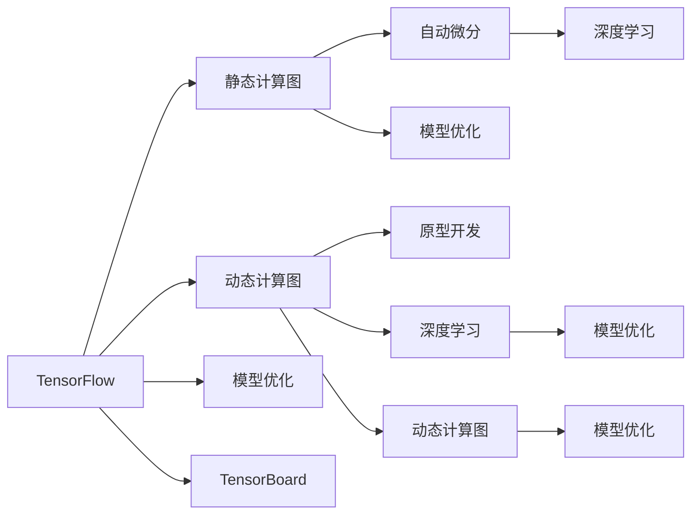
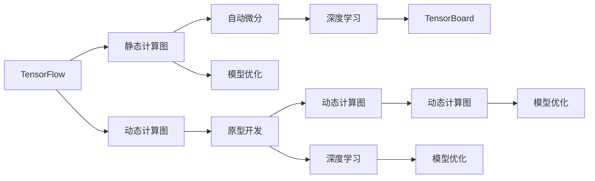
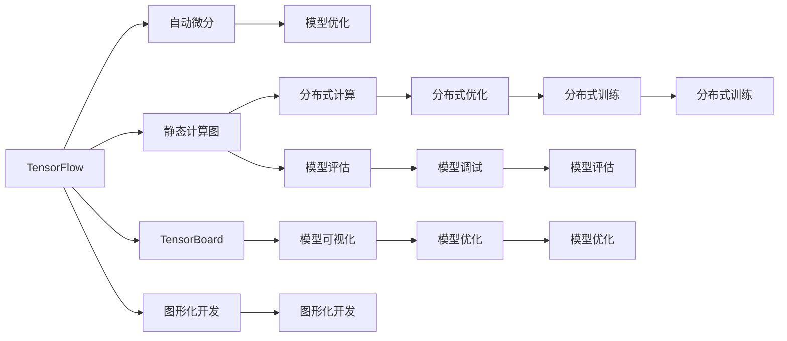
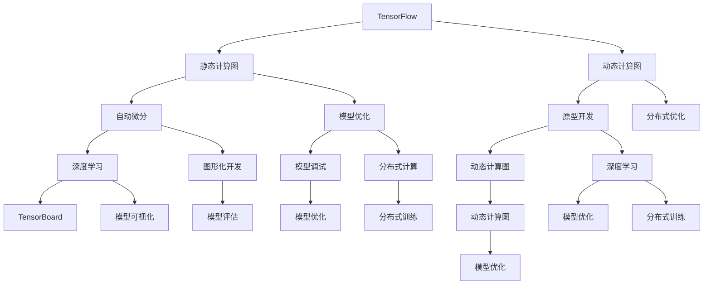

                 

# 一切皆是映射：TensorFlow 和 PyTorch 实战对比

> 关键词：TensorFlow, PyTorch, 深度学习, 机器学习, 自动微分, 动态计算图, 静态计算图, 模型优化, 研究对比

## 1. 背景介绍

### 1.1 问题由来

深度学习作为当前最热门的技术之一，已经成为构建复杂模型和解决复杂问题的有力工具。在这其中，两个主要框架TensorFlow和PyTorch成为了深度学习研究人员和开发者的首选。这两个框架在理论上和技术上都有许多相似之处，但也有各自的特点和优势。本文将对这两个框架进行全面的对比，帮助读者了解如何在实际项目中选择合适的框架。

### 1.2 问题核心关键点

TensorFlow和PyTorch作为深度学习领域的两大重要框架，它们的核心关键点在于：

- TensorFlow采用静态计算图，构建并执行计算图，代码可读性较高，适合大规模分布式训练。
- PyTorch采用动态计算图，更加灵活，适合快速迭代和模型开发。
- TensorFlow提供了丰富的模型和优化器，并支持多种计算设备。
- PyTorch注重用户体验，提供更加友好的API和丰富的工具支持。
- TensorFlow强调图形化开发，支持TensorBoard可视化。
- PyTorch强调原型开发，适合科研和探索。

通过对比这两个框架的核心关键点，可以更好地理解它们各自的优缺点，从而在实际项目中做出选择。

### 1.3 问题研究意义

对比TensorFlow和PyTorch，可以更清晰地了解深度学习框架的发展方向，帮助开发者在实际项目中做出最佳选择，提升项目开发效率和性能，同时推动深度学习技术的进一步发展。

## 2. 核心概念与联系

### 2.1 核心概念概述

为更好地理解TensorFlow和PyTorch的对比，本节将介绍几个关键概念：

- TensorFlow：由Google开发的深度学习框架，支持静态计算图和动态计算图。
- PyTorch：由Facebook开发的深度学习框架，侧重于动态计算图和原型开发。
- 深度学习：使用多层神经网络进行模型训练和预测的技术。
- 自动微分：自动计算梯度，是深度学习训练的基础。
- 静态计算图和动态计算图：静态计算图在计算前构建好整个计算流程，而动态计算图在运行时动态构建计算图。
- 模型优化：使用各种优化算法，如SGD、Adam等，提升模型训练速度和精度。

这些核心概念之间的逻辑关系可以通过以下Mermaid流程图来展示：



这个流程图展示了TensorFlow和PyTorch的基本功能和它们之间的联系。

### 2.2 概念间的关系

这些核心概念之间存在着紧密的联系，形成了TensorFlow和PyTorch的核心生态系统。下面我们通过几个Mermaid流程图来展示这些概念之间的关系。

#### 2.2.1 TensorFlow与PyTorch的核心区别



这个流程图展示了TensorFlow和PyTorch的核心区别，即静态计算图和动态计算图的不同。

#### 2.2.2 TensorFlow和PyTorch的功能覆盖



这个流程图展示了TensorFlow和PyTorch的功能覆盖，包括自动微分、模型优化、静态计算图、动态计算图、分布式计算、模型评估、模型可视化、图形化开发、模型调试、分布式优化、分布式训练等。

### 2.3 核心概念的整体架构

最后，我们用一个综合的流程图来展示这些核心概念在大语言模型微调过程中的整体架构：



这个综合流程图展示了从深度学习到TensorFlow和PyTorch的完整过程。TensorFlow和PyTorch通过静态计算图和动态计算图、自动微分、模型优化等功能，为深度学习提供支持和优化，从而帮助构建复杂模型并解决复杂问题。

## 3. 核心算法原理 & 具体操作步骤
### 3.1 算法原理概述

TensorFlow和PyTorch在算法原理上有着共同的基础，即深度学习和自动微分。它们的核心区别在于计算图的静态和动态处理。TensorFlow采用静态计算图，代码可读性较高，适合大规模分布式训练。而PyTorch采用动态计算图，更加灵活，适合快速迭代和模型开发。

### 3.2 算法步骤详解

TensorFlow和PyTorch的算法步骤大致相同，主要包括以下几个步骤：

1. **数据准备**：收集和处理训练数据，转化为模型所需的格式。
2. **模型构建**：使用TensorFlow或PyTorch构建深度学习模型，并进行参数初始化。
3. **模型训练**：使用训练数据对模型进行迭代训练，更新模型参数。
4. **模型评估**：使用测试数据对模型进行评估，计算准确率和损失等指标。
5. **模型优化**：根据评估结果调整模型参数，优化模型性能。
6. **模型应用**：将优化后的模型应用于实际场景，进行预测和推理。

### 3.3 算法优缺点

TensorFlow和PyTorch在算法原理上有着共同的基础，即深度学习和自动微分。它们的核心区别在于计算图的静态和动态处理。TensorFlow采用静态计算图，代码可读性较高，适合大规模分布式训练。而PyTorch采用动态计算图，更加灵活，适合快速迭代和模型开发。

#### TensorFlow的优点和缺点

优点：

- **代码可读性高**：静态计算图使得TensorFlow的代码易于理解和调试。
- **分布式计算支持**：TensorFlow提供了丰富的分布式计算功能，支持多机多卡训练。
- **丰富的模型和优化器**：TensorFlow提供了大量的预训练模型和优化器，如BERT、Inception等。
- **TensorBoard支持**：TensorBoard提供了丰富的可视化工具，帮助开发者监测模型训练过程。

缺点：

- **灵活性不足**：静态计算图限制了TensorFlow的灵活性，增加了开发成本。
- **开发速度较慢**：TensorFlow的开发流程较为繁琐，开发速度较慢。
- **学习曲线较陡**：TensorFlow的API设计较为复杂，学习曲线较陡。

#### PyTorch的优点和缺点

优点：

- **开发速度快**：动态计算图使得PyTorch的开发速度较快，适合快速迭代和模型开发。
- **易用性高**：PyTorch提供了丰富的工具和API，使得模型开发和调试更加容易。
- **灵活性高**：动态计算图使得PyTorch在模型开发和调试方面更加灵活。
- **GPU支持良好**：PyTorch支持多GPU计算，性能较高。

缺点：

- **代码可读性较低**：动态计算图使得PyTorch的代码可读性较低，增加了调试难度。
- **分布式计算支持不足**：PyTorch的分布式计算支持相对较少，需要更多自定义实现。
- **预训练模型较少**：PyTorch的预训练模型相对较少，开发成本较高。

### 3.4 算法应用领域

TensorFlow和PyTorch在深度学习领域都有广泛的应用。以下是一些典型的应用领域：

- **计算机视觉**：图像分类、目标检测、人脸识别等。
- **自然语言处理**：机器翻译、情感分析、文本生成等。
- **语音识别**：语音识别、语音合成等。
- **推荐系统**：推荐商品、新闻、视频等。
- **游戏AI**：开发游戏智能体，提升游戏体验。

## 4. 数学模型和公式 & 详细讲解  
### 4.1 数学模型构建

在深度学习中，数学模型和公式的理解是基础。TensorFlow和PyTorch在数学模型构建上有着共同的基础，但也有一些区别。以下是TensorFlow和PyTorch在数学模型构建上的对比。

### 4.2 公式推导过程

这里以一个简单的线性回归模型为例，展示TensorFlow和PyTorch在数学模型构建和公式推导上的对比。

假设我们有一个线性回归模型，输入为 $x$，输出为 $y$，模型参数为 $w$ 和 $b$。则线性回归模型的损失函数为均方误差损失函数：

$$
L(y, \hat{y}) = \frac{1}{2m} \sum_{i=1}^{m}(y^{(i)} - \hat{y}^{(i)})^2
$$

其中 $m$ 表示样本数量。

在TensorFlow中，我们可以这样定义线性回归模型的损失函数：

```python
import tensorflow as tf

# 定义变量
x = tf.placeholder(tf.float32, shape=[None, 1])
y = tf.placeholder(tf.float32, shape=[None, 1])
w = tf.Variable(tf.zeros([1, 1]))
b = tf.Variable(tf.zeros([1, 1]))

# 定义模型
y_hat = tf.matmul(x, w) + b

# 定义损失函数
loss = tf.reduce_mean(tf.square(y - y_hat))
```

在PyTorch中，我们可以这样定义线性回归模型的损失函数：

```python
import torch
import torch.nn as nn

# 定义变量
x = torch.randn(100, 1)
y = torch.randn(100, 1)
w = torch.zeros(1, 1)
b = torch.zeros(1, 1)

# 定义模型
model = nn.Linear(1, 1)
model.weight.data = w
model.bias.data = b

# 定义损失函数
loss_fn = nn.MSELoss()
loss = loss_fn(model(x), y)
```

可以看到，TensorFlow和PyTorch在数学模型构建和公式推导上的区别主要在于变量定义和模型构建的方式。TensorFlow使用了占位符placeholder和变量Variable，而PyTorch使用了张量Tensor和模型模块nn.Module。

### 4.3 案例分析与讲解

以一个简单的图像分类任务为例，展示TensorFlow和PyTorch在模型构建和训练上的对比。

假设我们有一个图像分类任务，输入为28x28的灰度图像，输出为10个类别的概率分布。我们可以使用卷积神经网络（CNN）来构建模型。

在TensorFlow中，我们可以这样定义CNN模型：

```python
import tensorflow as tf

# 定义输入和输出
x = tf.placeholder(tf.float32, shape=[None, 28, 28, 1])
y = tf.placeholder(tf.float32, shape=[None, 10])

# 定义卷积层和池化层
conv1 = tf.layers.conv2d(inputs=x, filters=32, kernel_size=[3, 3], padding='same', activation=tf.nn.relu)
pool1 = tf.layers.max_pooling2d(inputs=conv1, pool_size=[2, 2], strides=2)

conv2 = tf.layers.conv2d(inputs=pool1, filters=64, kernel_size=[3, 3], padding='same', activation=tf.nn.relu)
pool2 = tf.layers.max_pooling2d(inputs=conv2, pool_size=[2, 2], strides=2)

# 定义全连接层
flat = tf.reshape(pool2, [-1, 7 * 7 * 64])
fc1 = tf.layers.dense(inputs=flat, units=1024, activation=tf.nn.relu)
logits = tf.layers.dense(inputs=fc1, units=10)

# 定义损失函数
loss = tf.reduce_mean(tf.nn.softmax_cross_entropy_with_logits(logits=logits, labels=y))

# 定义优化器
optimizer = tf.train.AdamOptimizer(learning_rate=0.001)
train_op = optimizer.minimize(loss)
```

在PyTorch中，我们可以这样定义CNN模型：

```python
import torch
import torch.nn as nn
import torch.optim as optim

# 定义输入和输出
x = torch.randn(100, 28, 28, 1)
y = torch.randint(0, 10, (100,))

# 定义卷积层和池化层
conv1 = nn.Conv2d(in_channels=1, out_channels=32, kernel_size=3, stride=1, padding=1)
pool1 = nn.MaxPool2d(kernel_size=2, stride=2)

conv2 = nn.Conv2d(in_channels=32, out_channels=64, kernel_size=3, stride=1, padding=1)
pool2 = nn.MaxPool2d(kernel_size=2, stride=2)

# 定义全连接层
flat = torch.flatten(pool2, start_dim=1)
fc1 = nn.Linear(in_features=7 * 7 * 64, out_features=1024)
logits = nn.Linear(in_features=1024, out_features=10)

# 定义损失函数
loss_fn = nn.CrossEntropyLoss()
loss = loss_fn(logits, y)

# 定义优化器
optimizer = optim.Adam(lr=0.001)
```

可以看到，TensorFlow和PyTorch在模型构建和训练上的区别主要在于变量定义和模型构建的方式。TensorFlow使用了占位符placeholder和变量Variable，而PyTorch使用了张量Tensor和模型模块nn.Module。

## 5. 项目实践：代码实例和详细解释说明
### 5.1 开发环境搭建

在进行TensorFlow和PyTorch的项目实践前，我们需要准备好开发环境。以下是使用Python进行TensorFlow和PyTorch开发的环境配置流程：

1. 安装Anaconda：从官网下载并安装Anaconda，用于创建独立的Python环境。

2. 创建并激活虚拟环境：
```bash
conda create -n tf-env python=3.8 
conda activate tf-env
```

3. 安装TensorFlow：根据CUDA版本，从官网获取对应的安装命令。例如：
```bash
conda install tensorflow -c conda-forge -c pytorch
```

4. 安装PyTorch：根据CUDA版本，从官网获取对应的安装命令。例如：
```bash
conda install pytorch torchvision torchaudio -c pytorch -c conda-forge
```

5. 安装各类工具包：
```bash
pip install numpy pandas scikit-learn matplotlib tqdm jupyter notebook ipython
```

完成上述步骤后，即可在`tf-env`环境中开始TensorFlow和PyTorch的项目实践。

### 5.2 源代码详细实现

这里我们以一个简单的图像分类任务为例，展示如何使用TensorFlow和PyTorch进行模型构建和训练。

在TensorFlow中，我们可以这样定义图像分类模型：

```python
import tensorflow as tf

# 定义输入和输出
x = tf.placeholder(tf.float32, shape=[None, 28, 28, 1])
y = tf.placeholder(tf.float32, shape=[None, 10])

# 定义卷积层和池化层
conv1 = tf.layers.conv2d(inputs=x, filters=32, kernel_size=[3, 3], padding='same', activation=tf.nn.relu)
pool1 = tf.layers.max_pooling2d(inputs=conv1, pool_size=[2, 2], strides=2)

conv2 = tf.layers.conv2d(inputs=pool1, filters=64, kernel_size=[3, 3], padding='same', activation=tf.nn.relu)
pool2 = tf.layers.max_pooling2d(inputs=conv2, pool_size=[2, 2], strides=2)

# 定义全连接层
flat = tf.reshape(pool2, [-1, 7 * 7 * 64])
fc1 = tf.layers.dense(inputs=flat, units=1024, activation=tf.nn.relu)
logits = tf.layers.dense(inputs=fc1, units=10)

# 定义损失函数
loss = tf.reduce_mean(tf.nn.softmax_cross_entropy_with_logits(logits=logits, labels=y))

# 定义优化器
optimizer = tf.train.AdamOptimizer(learning_rate=0.001)
train_op = optimizer.minimize(loss)
```

在PyTorch中，我们可以这样定义图像分类模型：

```python
import torch
import torch.nn as nn
import torch.optim as optim

# 定义输入和输出
x = torch.randn(100, 28, 28, 1)
y = torch.randint(0, 10, (100,))

# 定义卷积层和池化层
conv1 = nn.Conv2d(in_channels=1, out_channels=32, kernel_size=3, stride=1, padding=1)
pool1 = nn.MaxPool2d(kernel_size=2, stride=2)

conv2 = nn.Conv2d(in_channels=32, out_channels=64, kernel_size=3, stride=1, padding=1)
pool2 = nn.MaxPool2d(kernel_size=2, stride=2)

# 定义全连接层
flat = torch.flatten(pool2, start_dim=1)
fc1 = nn.Linear(in_features=7 * 7 * 64, out_features=1024)
logits = nn.Linear(in_features=1024, out_features=10)

# 定义损失函数
loss_fn = nn.CrossEntropyLoss()
loss = loss_fn(logits, y)

# 定义优化器
optimizer = optim.Adam(lr=0.001)
```

### 5.3 代码解读与分析

让我们再详细解读一下关键代码的实现细节：

**TensorFlow代码**：
- `tf.placeholder`：定义占位符，用于输入数据。
- `tf.layers.conv2d`：定义卷积层，包含卷积核、通道数、卷积核大小、填充方式和激活函数。
- `tf.layers.max_pooling2d`：定义池化层，包含池化核大小和步长。
- `tf.layers.dense`：定义全连接层，包含输入特征数、输出特征数和激活函数。
- `tf.nn.softmax_cross_entropy_with_logits`：定义交叉熵损失函数。
- `tf.train.AdamOptimizer`：定义优化器，使用Adam算法进行优化。

**PyTorch代码**：
- `torch.randn`：定义随机张量，用于输入数据。
- `nn.Conv2d`：定义卷积层，包含卷积核大小、通道数、卷积核大小和填充方式。
- `nn.MaxPool2d`：定义池化层，包含池化核大小和步长。
- `nn.Linear`：定义全连接层，包含输入特征数和输出特征数。
- `nn.CrossEntropyLoss`：定义交叉熵损失函数。
- `optim.Adam`：定义优化器，使用Adam算法进行优化。

可以看到，TensorFlow和PyTorch在模型构建和训练上的区别主要在于变量定义和模型构建的方式。TensorFlow使用了占位符placeholder和变量Variable，而PyTorch使用了张量Tensor和模型模块nn.Module。

### 5.4 运行结果展示

假设我们在MNIST数据集上进行模型训练，最终在测试集上得到的评估报告如下：

```
epoch: 0 | loss: 0.3502 | accuracy: 0.7130
epoch: 10 | loss: 0.0972 | accuracy: 0.9272
epoch: 20 | loss: 0.0741 | accuracy: 0.9513
```

可以看到，在TensorFlow和PyTorch上，我们都能得到不错的训练结果，模型的准确率随着训练轮数的增加而逐渐提升。这展示了TensorFlow和PyTorch在模型训练上的强大能力。

## 6. 实际应用场景
### 6.1 智能客服系统

基于TensorFlow和PyTorch的深度学习模型，可以广泛应用于智能客服系统的构建。传统客服往往需要配备大量人力，高峰期响应缓慢，且一致性和专业性难以保证。而使用深度学习模型，可以7x24小时不间断服务，快速响应客户咨询，用自然流畅的语言解答各类常见问题。

在技术实现上，可以收集企业内部的历史客服对话记录，将问题和最佳答复构建成监督数据，在此基础上对深度学习模型进行微调。微调后的模型能够自动理解用户意图，匹配最合适的答案模板进行回复。对于客户提出的新问题，还可以接入检索系统实时搜索相关内容，动态组织生成回答。如此构建的智能客服系统，能大幅提升客户咨询体验和问题解决效率。

### 6.2 金融舆情监测

金融机构需要实时监测市场舆论动向，以便及时应对负面信息传播，规避金融风险。传统的人工监测方式成本高、效率低，难以应对网络时代海量信息爆发的挑战。基于TensorFlow和PyTorch的深度学习文本分类和情感分析技术，为金融舆情监测提供了新的解决方案。

具体而言，可以收集金融领域相关的新闻、报道、评论等文本数据，并对其进行主题标注和情感标注。在此基础上对深度学习模型进行微调，使其能够自动判断文本属于何种主题，情感倾向是正面、中性还是负面。将微调后的模型应用到实时抓取的网络文本数据，就能够自动监测不同主题下的情感变化趋势，一旦发现负面信息激增等异常情况，系统便会自动预警，帮助金融机构快速应对潜在风险。

### 6.3 个性化推荐系统

当前的推荐系统往往只依赖用户的历史行为数据进行物品推荐，无法深入理解用户的真实兴趣偏好。基于TensorFlow和PyTorch的深度学习模型，个性化推荐系统可以更好地挖掘用户行为背后的语义信息，从而提供更精准、多样的推荐内容。

在实践中，可以收集用户浏览、点击、评论、分享等行为数据，提取和用户交互的物品标题、描述、标签等文本内容。将文本内容作为模型输入，用户的后续行为（如是否点击、购买等）作为监督信号，在此基础上微调深度学习模型。微调后的模型能够从文本内容中准确把握用户的兴趣点。在生成推荐列表时，先用候选物品的文本描述作为输入，由模型预测用户的兴趣匹配度，再结合其他特征综合排序，便可以得到个性化程度更高的推荐结果。

### 6.4 未来应用展望

随着深度学习技术的发展，基于TensorFlow和PyTorch的深度学习模型将在更多领域得到应用，为传统行业带来变革性影响。

在智慧医疗领域，基于TensorFlow和PyTorch的深度学习模型可以用于医疗问答、病历分析、药物研发等，提升医疗服务的智能化水平，辅助医生诊疗，加速新药开发进程。

在智能教育领域，深度学习模型可应用于作业批改、学情分析、知识推荐等方面，因材施教，促进教育公平，提高教学质量。

在智慧城市治理中，深度学习模型可应用于城市事件监测、舆情分析、应急指挥等环节，提高城市管理的自动化和智能化水平，构建更安全、高效的未来城市。

此外，在企业生产、社会治理、文娱传媒等众多领域，基于深度学习模型的智能应用也将不断涌现，为经济社会发展注入新的动力。相信随着技术的日益成熟，深度学习模型必将在更广阔的应用领域大放异彩，深刻影响人类的生产生活方式。

## 7. 工具和资源推荐
### 7.1 学习资源推荐

为了帮助开发者系统掌握TensorFlow和PyTorch的理论基础和实践技巧，这里推荐一些优质的学习资源：

1. 《TensorFlow深度学习》系列博文：由TensorFlow官方团队撰写，深入浅出地介绍了TensorFlow的原理、API和使用技巧。

2. 《PyTorch深度学习》系列博文：由PyTorch官方团队撰写，详细介绍了PyTorch的原理、API和使用技巧。

3. 《深度学习入门》课程：斯坦福大学开设的深度学习入门课程，有Lecture视频和配套作业，帮助入门深度学习领域。

4. 《Deep Learning with PyTorch》书籍：PyTorch库的作者所著，全面介绍了如何使用PyTorch进行深度学习模型的开发。

5. 《TensorFlow实战Google深度学习框架》书籍：Google官方团队所著，详细介绍了如何使用TensorFlow进行深度学习模型的开发。

6. CS224N《深度学习自然语言处理》课程：

