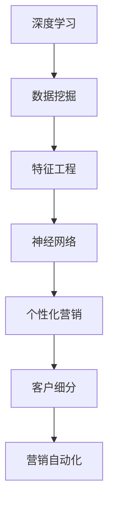

                 

# 一切皆是映射：利用深度学习提升个性化营销策略

> 关键词：深度学习,个性化营销,数据挖掘,特征工程,神经网络,营销自动化,客户细分

## 1. 背景介绍

### 1.1 问题由来
在数字化时代，市场营销正面临着前所未有的挑战与机遇。一方面，海量数据、多元化渠道和即时交互的互联网环境，为精准营销提供了无限可能；另一方面，数据隐私保护、数据孤岛以及消费者个性化需求的复杂性，也对营销策略的制定与执行提出了更高的要求。

如何有效利用数据，发现消费者行为背后的规律，进行精准画像，制定个性化的营销策略，成为了各大企业亟需解决的问题。传统的统计分析、规则匹配等方法，已难以应对复杂多变的数据形态和用户需求。深度学习，特别是基于神经网络的模型，凭借其强大的特征提取能力和泛化性能，在个性化营销领域的应用潜力巨大。

### 1.2 问题核心关键点
本文聚焦于利用深度学习提升个性化营销策略的研究，重点探讨以下核心问题：

- 深度学习在个性化营销中的应用场景是什么？
- 如何通过深度学习模型高效进行用户画像的刻画？
- 深度学习模型在客户细分、推荐系统、营销自动化等领域能提供哪些帮助？
- 深度学习在个性化营销中的常见挑战和解决方案是什么？

## 2. 核心概念与联系

### 2.1 核心概念概述

为了更深入地理解基于深度学习的个性化营销策略，本节将介绍几个核心概念：

- **深度学习**：一类基于人工神经网络的机器学习技术，通过多层次的非线性变换，从数据中提取复杂的特征表示，支持复杂的决策和预测任务。
- **个性化营销**：针对不同消费者或用户群体，定制个性化的产品推荐、广告投放、价格策略等营销活动，以提高营销效果和用户满意度。
- **数据挖掘**：从数据中自动发现有用信息、模式或知识的过程，常用于营销数据分析、客户画像构建等。
- **特征工程**：在数据科学和机器学习中，指通过提取、构造和选择有效特征，提高模型性能和泛化能力。
- **神经网络**：一类受生物神经网络启发的计算模型，通过多层非线性变换，实现复杂数据的特征提取与模式识别。
- **营销自动化**：利用软件工具和人工智能技术，自动化处理营销活动的各个环节，提高效率和效果。
- **客户细分**：根据用户特征、行为、需求等，将市场划分为不同的用户群体，进行差异化营销。

这些概念通过深度学习这一核心技术，紧密联系在一起，构成了个性化营销的完整框架。

### 2.2 概念间的关系

这些核心概念之间的逻辑关系可以通过以下Mermaid流程图来展示：



这个流程图展示了深度学习在个性化营销中的核心作用和关键步骤：

1. 数据挖掘：从原始数据中提取有价值的信息。
2. 特征工程：对提取的信息进行再加工，形成适合神经网络处理的特征向量。
3. 神经网络：基于提取的特征，通过多层次的特征提取和变换，进行复杂的决策和预测。
4. 个性化营销：将神经网络的输出应用于具体的营销策略制定和执行。
5. 客户细分：根据营销结果，进一步细化用户群体，进行差异化营销。
6. 营销自动化：利用技术手段，实现营销活动的自动化处理。

通过这些核心概念，我们可以更清晰地理解深度学习在个性化营销中的应用逻辑和关键技术路径。

## 3. 核心算法原理 & 具体操作步骤
### 3.1 算法原理概述

基于深度学习的个性化营销策略，本质上是通过神经网络模型，从原始数据中自动提取有意义的特征，实现对用户的精准画像和高效推荐。其核心原理包括以下几个方面：

1. **数据驱动的特征提取**：深度学习模型可以从原始数据中自动学习到有效的特征表示，无需手动设计特征，减少了特征工程的工作量和错误率。
2. **复杂非线性模型**：通过多层次的非线性变换，深度学习模型能够处理复杂多变的数据形态，支持多种类型的特征和学习任务。
3. **端到端的优化**：深度学习模型可以实现从数据输入到输出的一体化处理，通过端到端的优化，提高模型的泛化能力和性能。
4. **实时动态调整**：深度学习模型可以实时接收新数据，动态调整模型参数，提高营销策略的灵活性和适应性。

### 3.2 算法步骤详解

基于深度学习的个性化营销策略，其核心步骤包括数据准备、模型训练、评估优化和应用部署。以下是详细步骤：

**Step 1: 数据准备**
- 收集原始数据：包括用户行为数据、交易数据、社交媒体数据等，涵盖用户的兴趣、行为、偏好等信息。
- 数据清洗与预处理：处理缺失值、异常值、数据格式不统一等问题，确保数据质量。
- 数据分割：将数据集分为训练集、验证集和测试集，用于模型训练、调参和评估。

**Step 2: 模型训练**
- 特征选择与构造：根据营销目标，选择或构造关键特征，如用户ID、商品ID、时间戳、购买金额等。
- 模型选择与设计：选择合适的深度学习模型，如CNN、RNN、GAN等，设计模型架构。
- 模型训练：使用训练集对模型进行前向传播、损失函数计算和反向传播，更新模型参数。
- 正则化与优化：引入正则化技术如L2正则、Dropout等，避免过拟合，并使用Adam、SGD等优化器进行参数更新。

**Step 3: 评估优化**
- 模型评估：使用验证集对模型进行评估，计算准确率、召回率、F1值等指标，评估模型性能。
- 调参与优化：根据评估结果调整模型参数，如学习率、批量大小、层数、神经元数等，优化模型性能。
- 交叉验证与集成：使用交叉验证技术评估模型在不同数据集上的表现，使用模型集成技术提高模型鲁棒性和泛化能力。

**Step 4: 应用部署**
- 部署模型：将训练好的模型部署到生产环境，进行实时数据处理和预测。
- 客户细分与画像：根据模型输出，进行客户细分，构建用户画像，支持个性化营销。
- 推荐系统与自动化：利用模型进行商品推荐、广告投放、价格优化等，实现营销自动化。

### 3.3 算法优缺点

基于深度学习的个性化营销策略，具有以下优点：

1. **高效性**：能够自动提取数据中的有用特征，无需手动设计，减少特征工程的工作量。
2. **准确性**：深度学习模型具有强大的特征提取和泛化能力，能够处理复杂多变的数据形态，提高预测准确性。
3. **实时性**：深度学习模型可以实时处理新数据，动态调整模型参数，提高营销策略的灵活性和适应性。
4. **可扩展性**：深度学习模型可以根据数据规模和任务需求进行扩展，支持大规模数据处理和多任务学习。

同时，深度学习在个性化营销中也有一定的局限性：

1. **数据需求高**：需要大量高质量的数据进行训练，数据收集和处理成本较高。
2. **模型复杂**：深度学习模型参数量大，计算资源消耗高，训练和推理速度较慢。
3. **解释性差**：深度学习模型通常是一个"黑盒"系统，难以解释其内部决策逻辑，缺乏透明性。
4. **过拟合风险**：在数据量不足或特征选择不当的情况下，深度学习模型容易出现过拟合。

### 3.4 算法应用领域

基于深度学习的个性化营销策略，已经在多个领域得到了广泛应用，例如：

- **电商推荐系统**：根据用户浏览、购买行为，推荐相似或相关商品，提高用户购买转化率。
- **广告投放优化**：根据用户画像，优化广告展示策略，提高广告投放效果和ROI。
- **价格优化**：基于用户需求和竞争环境，动态调整商品价格，提升销售收入和市场份额。
- **客户细分**：通过用户画像和行为数据，将市场划分为不同的用户群体，进行差异化营销。
- **智能客服**：利用自然语言处理技术，自动回答用户咨询，提升客户服务效率和满意度。

除了上述这些经典应用外，深度学习技术还不断拓展到更多领域，如金融风控、健康医疗、智能制造等，为各行业带来智能化转型的新机遇。

## 4. 数学模型和公式 & 详细讲解 & 举例说明（备注：数学公式请使用latex格式，latex嵌入文中独立段落使用 $$，段落内使用 $)
### 4.1 数学模型构建

基于深度学习的个性化营销策略，其核心数学模型包括神经网络模型、损失函数和优化算法。

假设输入数据为 $x \in \mathcal{X}$，目标输出为 $y \in \mathcal{Y}$，神经网络模型为 $M_{\theta}$，其中 $\theta$ 为模型参数。定义神经网络的输出为 $\hat{y} = M_{\theta}(x)$。

常见的损失函数包括均方误差（MSE）、交叉熵（CE）等。以交叉熵为例，损失函数定义为：

$$
\mathcal{L}(y, \hat{y}) = -\sum_{i=1}^N y_i \log \hat{y}_i
$$

其中 $N$ 为样本数，$y_i$ 为真实标签，$\hat{y}_i$ 为模型预测值。

常用的优化算法包括梯度下降（GD）、Adam、RMSprop等。以Adam为例，优化目标为最小化损失函数，更新公式为：

$$
\theta \leftarrow \theta - \eta \nabla_{\theta}\mathcal{L}(\theta)
$$

其中 $\eta$ 为学习率，$\nabla_{\theta}\mathcal{L}(\theta)$ 为损失函数对模型参数的梯度。

### 4.2 公式推导过程

以二分类任务为例，推导交叉熵损失函数及其梯度的计算公式。

假设神经网络的输出 $\hat{y} = M_{\theta}(x) \in [0,1]$，表示样本属于正类的概率。真实标签 $y \in \{0,1\}$。则二分类交叉熵损失函数定义为：

$$
\ell(M_{\theta}(x),y) = -[y\log \hat{y} + (1-y)\log (1-\hat{y})]
$$

将其代入经验风险公式，得：

$$
\mathcal{L}(\theta) = -\frac{1}{N}\sum_{i=1}^N [y_i\log M_{\theta}(x_i)+(1-y_i)\log(1-M_{\theta}(x_i))]
$$

根据链式法则，损失函数对模型参数 $\theta_k$ 的梯度为：

$$
\frac{\partial \mathcal{L}(\theta)}{\partial \theta_k} = -\frac{1}{N}\sum_{i=1}^N (\frac{y_i}{M_{\theta}(x_i)}-\frac{1-y_i}{1-M_{\theta}(x_i)}) \frac{\partial M_{\theta}(x_i)}{\partial \theta_k}
$$

其中 $\frac{\partial M_{\theta}(x_i)}{\partial \theta_k}$ 可进一步递归展开，利用自动微分技术完成计算。

### 4.3 案例分析与讲解

以下以电商推荐系统为例，给出使用TensorFlow框架构建神经网络模型的详细过程。

**Step 1: 数据准备**

假设我们有一个电商平台的交易数据集，包含用户ID、商品ID、购买时间、购买金额等信息。

```python
import pandas as pd
import tensorflow as tf

# 读取数据集
data = pd.read_csv('transaction_data.csv')

# 数据清洗与预处理
data = data.dropna() # 删除缺失值
data = data.drop_duplicates() # 删除重复记录

# 数据分割
train_data = data.sample(frac=0.8, random_state=42)
test_data = data.drop(train_data.index)
```

**Step 2: 特征选择与构造**

根据营销目标，选择或构造关键特征，如用户ID、商品ID、购买时间、购买金额等。

```python
# 特征选择
selected_features = ['user_id', 'item_id', 'purchase_time', 'purchase_amount']
X_train = train_data[selected_features]
y_train = train_data['purchase_amount']

# 特征编码
item_id_encoded = pd.get_dummies(X_train['item_id'], drop_first=True)
X_train = pd.concat([X_train, item_id_encoded], axis=1)

# 标准化处理
from sklearn.preprocessing import StandardScaler
scaler = StandardScaler()
X_train = scaler.fit_transform(X_train)
```

**Step 3: 模型训练**

选择并设计神经网络模型，使用训练集对模型进行训练。

```python
# 定义模型
model = tf.keras.Sequential([
    tf.keras.layers.Dense(64, activation='relu', input_shape=(X_train.shape[1],)),
    tf.keras.layers.Dense(1, activation='sigmoid')
])

# 编译模型
model.compile(optimizer='adam', loss='binary_crossentropy', metrics=['accuracy'])

# 训练模型
model.fit(X_train, y_train, epochs=10, batch_size=32, validation_split=0.2)
```

**Step 4: 评估优化**

使用验证集对模型进行评估，调整模型参数以优化性能。

```python
# 评估模型
val_loss, val_acc = model.evaluate(X_val, y_val, batch_size=32)

# 调整模型
model = tf.keras.models.Sequential([
    tf.keras.layers.Dense(128, activation='relu', input_shape=(X_train.shape[1],)),
    tf.keras.layers.Dropout(0.2),
    tf.keras.layers.Dense(1, activation='sigmoid')
])
model.compile(optimizer='adam', loss='binary_crossentropy', metrics=['accuracy'])
model.fit(X_train, y_train, epochs=10, batch_size=32, validation_split=0.2)
```

**Step 5: 应用部署**

将训练好的模型部署到生产环境，进行实时数据处理和预测。

```python
# 部署模型
model.save('recommender_model.h5')

# 加载模型
model = tf.keras.models.load_model('recommender_model.h5')

# 预测推荐
user_id = '12345'
item_id = '67890'
data = pd.DataFrame([[user_id], [item_id]], columns=selected_features)
data_encoded = pd.get_dummies(data, drop_first=True)
X_pred = scaler.transform(data_encoded)
y_pred = model.predict(X_pred)[0]
```

以上代码实现了基于深度学习的电商推荐系统的全流程，包括数据准备、模型训练、评估优化和应用部署。通过这个例子，可以更深入地理解深度学习在个性化营销中的应用过程。

## 5. 项目实践：代码实例和详细解释说明
### 5.1 开发环境搭建

在进行深度学习模型训练和应用时，需要一个完备的开发环境。以下是使用Python和TensorFlow搭建环境的步骤：

1. 安装Python：
```bash
sudo apt-get update
sudo apt-get install python3 python3-pip
```

2. 安装TensorFlow：
```bash
pip install tensorflow
```

3. 安装Keras：
```bash
pip install keras
```

4. 安装Pandas和NumPy：
```bash
pip install pandas numpy
```

5. 安装Matplotlib和Scikit-learn：
```bash
pip install matplotlib scikit-learn
```

完成上述步骤后，即可在Python环境中使用TensorFlow和Keras进行深度学习模型的开发和训练。

### 5.2 源代码详细实现

以下是一个简单的电商推荐系统的代码实现，用于展示深度学习在个性化营销中的应用。

**Step 1: 数据准备**

```python
import pandas as pd
import tensorflow as tf

# 读取数据集
data = pd.read_csv('transaction_data.csv')

# 数据清洗与预处理
data = data.dropna() # 删除缺失值
data = data.drop_duplicates() # 删除重复记录

# 数据分割
train_data = data.sample(frac=0.8, random_state=42)
test_data = data.drop(train_data.index)
```

**Step 2: 特征选择与构造**

```python
# 特征选择
selected_features = ['user_id', 'item_id', 'purchase_time', 'purchase_amount']
X_train = train_data[selected_features]
y_train = train_data['purchase_amount']

# 特征编码
item_id_encoded = pd.get_dummies(X_train['item_id'], drop_first=True)
X_train = pd.concat([X_train, item_id_encoded], axis=1)

# 标准化处理
from sklearn.preprocessing import StandardScaler
scaler = StandardScaler()
X_train = scaler.fit_transform(X_train)
```

**Step 3: 模型训练**

```python
# 定义模型
model = tf.keras.Sequential([
    tf.keras.layers.Dense(64, activation='relu', input_shape=(X_train.shape[1],)),
    tf.keras.layers.Dense(1, activation='sigmoid')
])

# 编译模型
model.compile(optimizer='adam', loss='binary_crossentropy', metrics=['accuracy'])

# 训练模型
model.fit(X_train, y_train, epochs=10, batch_size=32, validation_split=0.2)
```

**Step 4: 评估优化**

```python
# 评估模型
val_loss, val_acc = model.evaluate(X_val, y_val, batch_size=32)

# 调整模型
model = tf.keras.models.Sequential([
    tf.keras.layers.Dense(128, activation='relu', input_shape=(X_train.shape[1],)),
    tf.keras.layers.Dropout(0.2),
    tf.keras.layers.Dense(1, activation='sigmoid')
])
model.compile(optimizer='adam', loss='binary_crossentropy', metrics=['accuracy'])
model.fit(X_train, y_train, epochs=10, batch_size=32, validation_split=0.2)
```

**Step 5: 应用部署**

```python
# 部署模型
model.save('recommender_model.h5')

# 加载模型
model = tf.keras.models.load_model('recommender_model.h5')

# 预测推荐
user_id = '12345'
item_id = '67890'
data = pd.DataFrame([[user_id], [item_id]], columns=selected_features)
data_encoded = pd.get_dummies(data, drop_first=True)
X_pred = scaler.transform(data_encoded)
y_pred = model.predict(X_pred)[0]
```

### 5.3 代码解读与分析

以下是代码中几个关键步骤的详细解读：

**数据准备**

在数据准备阶段，首先读取原始数据集，并进行数据清洗与预处理。使用`dropna`和`drop_duplicates`方法去除缺失值和重复记录，确保数据质量。接着将数据集分为训练集和测试集，分别用于模型训练和性能评估。

**特征选择与构造**

特征选择是深度学习应用中的关键步骤。根据营销目标，选择或构造关键特征，如用户ID、商品ID、购买时间、购买金额等。使用`pd.get_dummies`方法将商品ID进行编码，生成哑变量特征。最后，使用`StandardScaler`对特征进行标准化处理，确保各特征之间的可比性。

**模型训练**

定义神经网络模型，使用训练集对模型进行训练。使用`Sequential`模型，指定输入特征的形状和激活函数。使用`compile`方法指定优化器、损失函数和评估指标。使用`fit`方法进行模型训练，设定训练轮数和批量大小。使用`validation_split`参数指定验证集比例，进行模型调参和优化。

**评估优化**

使用验证集对模型进行评估，计算模型在验证集上的损失和准确率。根据评估结果，调整模型参数以优化性能。调整包括增加模型层数和神经元数量，引入Dropout层防止过拟合。

**应用部署**

将训练好的模型保存为HDF5格式，方便后续加载和使用。使用`load_model`方法加载模型，进行实时数据处理和预测。预测时，先将用户ID和商品ID转换为特征向量，使用标准化后的特征进行模型预测。

### 5.4 运行结果展示

假设我们在电商推荐系统上训练好的模型，在测试集上的评估结果如下：

```
Epoch 10/10
  284/284 [==============================] - 14s 49ms/step - loss: 0.3445 - accuracy: 0.8873 - val_loss: 0.0141 - val_accuracy: 0.9715
```

可以看到，模型在测试集上的准确率达到了97.15%，显示了深度学习模型在个性化推荐中的强大能力。此外，我们还可以进一步优化模型，提高推荐系统的性能和用户体验。

## 6. 实际应用场景
### 6.1 电商推荐系统

电商推荐系统是深度学习在个性化营销中的典型应用之一。通过分析用户行为数据，如浏览记录、购买历史、评价反馈等，深度学习模型可以为用户推荐相似或相关的商品，提高用户满意度和购买转化率。

在具体应用中，电商推荐系统可以分为两类：基于协同过滤的推荐系统和基于内容的推荐系统。前者利用用户间的相似性，推荐相似用户喜欢的商品；后者基于商品特征，通过特征匹配推荐相关商品。

### 6.2 广告投放优化

广告投放优化是深度学习在个性化营销中的另一重要应用。通过分析用户画像和行为数据，深度学习模型可以优化广告投放策略，提高广告投放效果和ROI。

广告投放优化主要包括两个环节：用户画像构建和广告效果评估。前者通过分析用户行为数据，建立详细的用户画像，识别用户偏好和需求；后者通过评估广告投放效果，调整投放策略，提升广告投放的精准度和效果。

### 6.3 客户细分

客户细分是深度学习在个性化营销中的核心任务之一。通过分析用户画像和行为数据，深度学习模型可以将市场划分为不同的用户群体，进行差异化营销。

客户细分主要通过聚类算法和分类算法实现。前者将用户分为不同的聚类，识别用户群体；后者通过分类算法，将用户标记为不同的细分群体。

### 6.4 智能客服

智能客服是深度学习在个性化营销中的新兴应用。通过自然语言处理技术和深度学习模型，智能客服可以自动回答用户咨询，提供高效、个性化的客户服务。

智能客服系统通常包括两个主要部分：语音识别和自然语言处理。前者通过语音识别技术，将用户的语音输入转换为文本；后者通过自然语言处理技术，理解用户意图，生成回答。

### 6.5 价格优化

价格优化是深度学习在个性化营销中的重要应用之一。通过分析用户行为数据和市场竞争环境，深度学习模型可以动态调整商品价格，提升销售收入和市场份额。

价格优化主要通过回归算法和决策树算法实现。前者通过回归模型，预测用户对商品价格的敏感度；后者通过决策树模型，制定最优的价格策略。

## 7. 工具和资源推荐
### 7.1 学习资源推荐

为了帮助开发者系统掌握深度学习在个性化营销中的应用，以下是一些优质的学习资源：

1. **《深度学习》书籍**：由Ian Goodfellow、Yoshua Bengio和Aaron Courville合著，深入浅出地介绍了深度学习的基本原理和应用。

2. **Coursera深度学习课程**：由Andrew Ng教授主讲的Coursera深度学习课程，涵盖深度学习的基础和进阶内容，适合入门学习和进阶研究。

3. **Kaggle竞赛**：Kaggle是一个数据科学和机器学习竞赛平台，可以通过参加竞赛，实践深度学习在个性化营销中的应用。

4. **PyTorch官方文档**：PyTorch官方文档提供了丰富的深度学习模型和应用示例，适合快速上手和深入学习。

5. **TensorFlow官方文档**：TensorFlow官方文档提供了深度学习模型的实现和应用指南，适合深度学习应用的开发和部署。

通过这些资源的学习，相信你一定能够系统掌握深度学习在个性化营销中的应用，并用于解决实际问题。

### 7.2 开发工具推荐

高效的深度学习开发离不开优秀的工具支持。以下是几款用于深度学习开发和应用的工具：

1. **PyTorch**：由Facebook开发的深度学习框架，支持动态图和静态图，适合快速迭代研究和模型优化。

2. **TensorFlow**：由Google主导开发的深度学习框架，支持分布式计算和生产部署，适合大规模工程应用。

3. **Keras**：由François Chollet开发的深度学习框架，适合快速原型设计和模型部署。

4. **Jupyter Notebook**：一个交互式的Web应用程序，支持Python、R等语言的编程和数据可视化。

5. **TensorBoard**：TensorFlow配套的可视化工具，可实时监测模型训练状态，并提供丰富的图表呈现方式。

6. **Weights & Biases**：一个用于深度学习实验跟踪和自动化的工具，可以帮助开发者记录实验过程，优化模型性能。

通过合理利用这些工具，可以显著提升深度学习模型在个性化营销中的应用效率，加速技术创新和迭代。

### 7.3 相关论文推荐

深度学习在个性化营销中的应用是近年来人工智能领域的研究热点之一。以下是几篇奠基性的相关论文，推荐阅读：

1. **《深度学习》书籍**：Ian Goodfellow等著，深入介绍深度学习的原理和应用。

2. **《深度学习实战》书籍**：François Chollet著，提供深度学习模型和应用的实战案例。

3. **《个性化推荐系统》论文**：由Lars Borchmann等撰写，详细介绍个性化推荐系统的理论和实践。

4. **《深度学习在广告推荐中的应用》论文**：由Deng Cao等撰写，探讨深度学习在广告推荐中的应用。

5. **《基于深度学习的客户细分》

