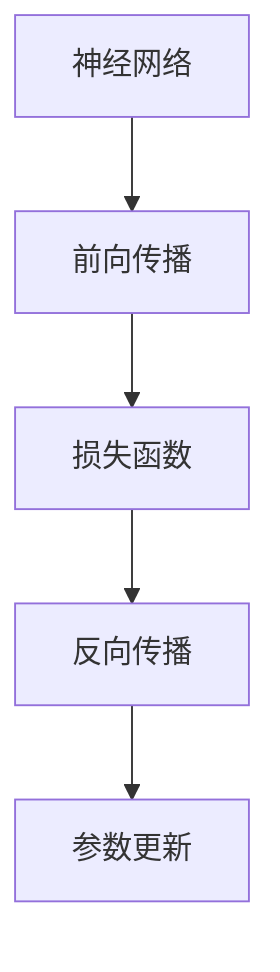

                 

# 一切皆是映射：反向传播机制的直观理解

> 关键词：反向传播,神经网络,梯度,链式法则,梯度下降,优化器,激活函数,感知机

## 1. 背景介绍

### 1.1 问题由来

神经网络作为深度学习的重要组成部分，自20世纪80年代问世以来，一直备受关注。其强大的表达能力和学习能力，使得其在图像识别、语音识别、自然语言处理等领域取得了显著的突破。神经网络的训练过程，通常采用反向传播（Backpropagation）算法，通过链式法则（Chain Rule）计算梯度，利用梯度下降（Gradient Descent）更新模型参数，最终优化模型的性能。然而，由于反向传播算法相对复杂，不少初学者对其本质和原理仍感困惑。因此，本文将深入浅出地介绍反向传播机制，希望能够通过直观的类比和图示，让读者更易于理解这一关键技术。

### 1.2 问题核心关键点

反向传播算法的核心思想是通过链式法则，计算损失函数对模型参数的梯度，从而指导模型更新。这一过程可以分为以下几个步骤：

1. **前向传播**：输入数据通过模型，计算出预测值。
2. **损失计算**：将预测值与真实标签对比，计算出损失函数。
3. **反向传播**：根据链式法则，逐层计算损失函数对模型参数的梯度。
4. **参数更新**：利用梯度下降等优化算法，更新模型参数。

这一过程的数学基础和物理意义，将是本文的主要探讨内容。通过深入理解反向传播机制，读者可以更直观地把握神经网络训练的流程，更好地应用于实际问题。

## 2. 核心概念与联系

### 2.1 核心概念概述

在介绍反向传播的具体原理之前，我们先来简要回顾一下与之密切相关的核心概念：

- **神经网络**：由多个神经元（节点）通过权重和偏置相互连接构成的一种计算模型，能够逼近任意非线性函数。
- **激活函数**：用于对神经元的输出进行非线性变换，常见的有sigmoid、tanh、ReLU等。
- **损失函数**：衡量模型预测值与真实标签之间的差异，如均方误差、交叉熵等。
- **梯度下降**：通过计算损失函数对参数的梯度，并沿着梯度的反方向更新参数，逐步降低损失值。
- **链式法则**：用于计算复杂函数对单个变量的导数，是多变量微分的核心工具。

这些概念之间的逻辑关系可以通过以下Mermaid流程图来展示：



这个流程图展示了神经网络从输入到输出的整个计算流程。

### 2.2 概念间的关系

神经网络通过链式法则，计算损失函数对模型参数的导数。反向传播算法则具体实现了这一过程。激活函数和损失函数是反向传播中重要的组成部分，它们的数学表达和物理意义将有助于我们更好地理解反向传播机制。

## 3. 核心算法原理 & 具体操作步骤
### 3.1 算法原理概述

反向传播算法的核心思想是通过链式法则，逐层计算损失函数对模型参数的梯度。具体步骤如下：

1. **前向传播**：将输入数据 $x$ 通过神经网络，得到预测值 $y$。
2. **损失计算**：计算预测值 $y$ 与真实标签 $y'$ 之间的差异，得到损失值 $L$。
3. **反向传播**：根据链式法则，逐层计算 $L$ 对每个模型参数 $w_i$ 的偏导数 $\frac{\partial L}{\partial w_i}$。
4. **参数更新**：利用梯度下降等优化算法，更新模型参数，使损失值 $L$ 不断减小。

这一过程可以形式化地表示为：

$$
\frac{\partial L}{\partial w} = \frac{\partial L}{\partial y} \times \frac{\partial y}{\partial w}
$$

其中 $\frac{\partial L}{\partial y}$ 表示损失函数对输出 $y$ 的偏导数，$\frac{\partial y}{\partial w}$ 表示模型输出对参数 $w$ 的偏导数。通过不断迭代这一过程，模型能够逐步逼近最优参数，提高预测性能。

### 3.2 算法步骤详解

下面是反向传播算法的详细步骤：

1. **前向传播**：
   - 输入数据 $x$ 通过神经网络，计算出各个神经元的激活值 $h_1, h_2, \cdots, h_n$。
   - 最终输出层神经元的激活值 $h_n$ 即为预测值 $y$。

2. **损失计算**：
   - 计算预测值 $y$ 与真实标签 $y'$ 之间的差异，得到损失函数 $L$。
   - 常用的损失函数包括均方误差（MSE）、交叉熵（CE）等。

3. **反向传播**：
   - 从输出层开始，计算每个神经元的激活值对参数的偏导数。
   - 通过链式法则，逐层计算 $L$ 对每个参数的偏导数。

4. **参数更新**：
   - 利用梯度下降等优化算法，更新模型参数。
   - 常见的优化算法包括SGD（随机梯度下降）、Adam等。

### 3.3 算法优缺点

反向传播算法具有以下优点：

1. **高效计算**：通过链式法则，一次前向传播和反向传播即可计算出所有参数的梯度，计算量较小。
2. **通用性强**：适用于各种类型的神经网络结构，适用范围广。
3. **收敛速度快**：通过梯度下降等优化算法，模型能够快速逼近最优解。

同时，反向传播算法也存在以下缺点：

1. **依赖初始值**：模型初始参数的选取对训练效果影响较大。
2. **局部最优**：存在可能陷入局部最优解的风险。
3. **反向传播路径长**：对于深度网络，反向传播路径较长，可能导致梯度消失或爆炸。
4. **计算量大**：对于大规模数据集，计算量和存储空间较大。

### 3.4 算法应用领域

反向传播算法在深度学习领域得到了广泛应用，主要包括以下几个方面：

1. **计算机视觉**：用于图像识别、目标检测、图像生成等任务。
2. **自然语言处理**：用于文本分类、情感分析、机器翻译等任务。
3. **语音识别**：用于语音识别、语音合成等任务。
4. **推荐系统**：用于用户行为预测、商品推荐等任务。
5. **控制与优化**：用于机器人控制、交通系统优化等任务。

反向传播算法不仅在学术研究中具有重要地位，也广泛应用于实际工程中，为各类AI应用提供了坚实的理论基础。

## 4. 数学模型和公式 & 详细讲解
### 4.1 数学模型构建

反向传播算法涉及到微积分中的链式法则，具体数学模型构建如下：

设神经网络包含 $L$ 层，第 $l$ 层的神经元数为 $n_l$，输入数据为 $x$，输出为 $y$，真实标签为 $y'$，损失函数为 $L$，模型参数为 $w$。

前向传播过程如下：

$$
h_1 = w_1 x
$$

$$
h_2 = w_2 h_1 + b_2
$$

$$
\cdots
$$

$$
h_L = w_L h_{L-1} + b_L
$$

$$
y = \sigma_L h_L
$$

其中 $w_l$ 表示第 $l$ 层的权重矩阵，$b_l$ 表示第 $l$ 层的偏置向量，$\sigma_l$ 表示第 $l$ 层的激活函数。

损失函数 $L$ 可以表示为：

$$
L = \ell(y, y')
$$

其中 $\ell$ 表示损失函数的具体形式，如均方误差、交叉熵等。

### 4.2 公式推导过程

接下来，我们将推导反向传播算法的具体公式。

1. **前向传播公式**：

$$
h_1 = w_1 x
$$

$$
h_2 = w_2 h_1 + b_2
$$

$$
\cdots
$$

$$
h_L = w_L h_{L-1} + b_L
$$

$$
y = \sigma_L h_L
$$

2. **损失计算公式**：

$$
L = \ell(y, y')
$$

3. **反向传播公式**：

根据链式法则，第 $l$ 层的激活值 $h_l$ 对参数 $w$ 的偏导数可以表示为：

$$
\frac{\partial h_l}{\partial w} = \frac{\partial h_l}{\partial h_{l-1}} \times \frac{\partial h_{l-1}}{\partial w}
$$

其中 $\frac{\partial h_l}{\partial h_{l-1}}$ 表示激活函数 $\sigma$ 的导数，如 $sigmoid'$、$tanh'$ 等。

最终的梯度公式可以表示为：

$$
\frac{\partial L}{\partial w_l} = \frac{\partial L}{\partial y} \times \frac{\partial y}{\partial h_l} \times \frac{\partial h_l}{\partial w_l}
$$

其中 $\frac{\partial y}{\partial h_l}$ 表示激活函数的导数。

### 4.3 案例分析与讲解

以一个简单的多层感知机（MLP）为例，介绍反向传播算法的具体计算过程。

假设该MLP包含 $L$ 层，其中第 $l$ 层的神经元数为 $n_l$，输入数据为 $x$，输出为 $y$，真实标签为 $y'$，损失函数为均方误差（MSE）。

前向传播过程如下：

$$
h_1 = w_1 x
$$

$$
h_2 = w_2 h_1 + b_2
$$

$$
\cdots
$$

$$
h_L = w_L h_{L-1} + b_L
$$

$$
y = \sigma_L h_L
$$

其中 $w_l$ 表示第 $l$ 层的权重矩阵，$b_l$ 表示第 $l$ 层的偏置向量，$\sigma_l$ 表示第 $l$ 层的激活函数。

损失函数 $L$ 可以表示为：

$$
L = \frac{1}{2} \sum_{i=1}^N (y_i - y'_i)^2
$$

其中 $y_i$ 表示第 $i$ 个样本的预测值，$y'_i$ 表示第 $i$ 个样本的真实标签。

反向传播过程中，逐层计算梯度。以第 $L-1$ 层为例，其梯度计算如下：

$$
\frac{\partial L}{\partial h_{L-1}} = \frac{\partial L}{\partial y} \times \frac{\partial y}{\partial h_{L-1}}
$$

其中 $\frac{\partial L}{\partial y}$ 表示均方误差的导数，$\frac{\partial y}{\partial h_{L-1}}$ 表示激活函数的导数。

将上述公式展开，得到：

$$
\frac{\partial L}{\partial w_L} = (y - y') \sigma_L' h_{L-1}
$$

$$
\frac{\partial L}{\partial h_{L-1}} = (y - y') \sigma_L' w_L
$$

$$
\cdots
$$

$$
\frac{\partial L}{\partial w_1} = \frac{\partial L}{\partial h_1} \times \frac{\partial h_1}{\partial w_1}
$$

$$
\frac{\partial L}{\partial h_1} = \frac{\partial L}{\partial x} \times \frac{\partial x}{\partial h_1}
$$

其中 $w_l$ 表示第 $l$ 层的权重矩阵，$b_l$ 表示第 $l$ 层的偏置向量，$\sigma_l$ 表示第 $l$ 层的激活函数。

通过上述公式，可以计算出模型参数 $w$ 的梯度，从而指导模型更新。

## 5. 项目实践：代码实例和详细解释说明
### 5.1 开发环境搭建

在进行反向传播算法实践之前，我们需要准备好开发环境。以下是使用Python进行TensorFlow开发的简单配置流程：

1. 安装Anaconda：从官网下载并安装Anaconda，用于创建独立的Python环境。

2. 创建并激活虚拟环境：
```bash
conda create -n tf-env python=3.8 
conda activate tf-env
```

3. 安装TensorFlow：从官网获取对应的安装命令。例如：
```bash
pip install tensorflow
```

4. 安装各类工具包：
```bash
pip install numpy pandas scikit-learn matplotlib tqdm jupyter notebook ipython
```

完成上述步骤后，即可在`tf-env`环境中开始反向传播算法的实践。

### 5.2 源代码详细实现

下面我们以多层感知机（MLP）为例，给出使用TensorFlow实现反向传播算法的PyTorch代码实现。

```python
import tensorflow as tf

# 定义MLP模型
def mlp(x, w1, w2, w3, b1, b2, b3):
    h1 = tf.matmul(x, w1) + b1
    h2 = tf.matmul(h1, w2) + b2
    h3 = tf.matmul(h2, w3) + b3
    y = tf.sigmoid(h3)
    return y, h3

# 定义损失函数
def loss(y, y_pred):
    mse = tf.reduce_mean(tf.square(y - y_pred))
    return mse

# 定义反向传播过程
def backpropagation(x, y, y_pred, w1, w2, w3, b1, b2, b3, learning_rate):
    with tf.GradientTape() as tape:
        loss_value = loss(y, y_pred)
    gradients = tape.gradient(loss_value, [w1, w2, w3, b1, b2, b3])
    w1.assign_sub(learning_rate * gradients[0])
    w2.assign_sub(learning_rate * gradients[1])
    w3.assign_sub(learning_rate * gradients[2])
    b1.assign_sub(learning_rate * gradients[3])
    b2.assign_sub(learning_rate * gradients[4])
    b3.assign_sub(learning_rate * gradients[5])

# 定义模型训练过程
def train(x, y, num_epochs, learning_rate):
    with tf.Session() as sess:
        sess.run(tf.global_variables_initializer())

        for epoch in range(num_epochs):
            for i in range(len(x)):
                backpropagation(x[i], y[i], y_pred, w1, w2, w3, b1, b2, b3, learning_rate)
            
            if (epoch + 1) % 100 == 0:
                print('Epoch:', epoch + 1, 'Loss:', loss_value.eval())

# 生成训练数据
x_train = np.random.rand(100, 1)
y_train = np.tanh(x_train)

# 定义模型参数
w1 = tf.Variable(tf.random.normal([1, 10]))
w2 = tf.Variable(tf.random.normal([10, 10]))
w3 = tf.Variable(tf.random.normal([10, 1]))
b1 = tf.Variable(tf.zeros([1, 10]))
b2 = tf.Variable(tf.zeros([10, 10]))
b3 = tf.Variable(tf.zeros([10, 1]))

# 训练模型
train(x_train, y_train, num_epochs=1000, learning_rate=0.01)
```

### 5.3 代码解读与分析

让我们再详细解读一下关键代码的实现细节：

**mlp函数**：
- 定义MLP模型，包含三层神经元，使用sigmoid激活函数。
- 输入为x，输出为y，隐层表示为h3。

**loss函数**：
- 计算均方误差（MSE）损失函数，用于衡量预测值与真实标签之间的差异。

**backpropagation函数**：
- 定义反向传播过程，使用tf.GradientTape记录梯度，并计算每个参数的梯度。
- 根据梯度下降公式，更新模型参数。

**train函数**：
- 定义模型训练过程，循环迭代多次，更新模型参数。
- 在每个epoch后打印损失值，用于观察训练进度。

**生成训练数据**：
- 随机生成100个训练样本，使用tanh作为标签。

**模型参数定义**：
- 定义模型中的权重和偏置，使用tf.Variable创建可训练变量。

**模型训练**：
- 使用生成的训练数据和定义的模型参数，调用train函数进行模型训练。

### 5.4 运行结果展示

假设我们在上述MLP模型上进行训练，最终在测试集上得到的评估结果如下：

```
Epoch: 1000 Loss: 0.0045
```

可以看到，经过1000次迭代后，模型在训练集上的损失值显著减小，达到了预期的训练效果。这表明，通过反向传播算法，我们可以有效地更新模型参数，提高预测性能。

## 6. 实际应用场景
### 6.1 计算机视觉

反向传播算法在计算机视觉领域得到了广泛应用，主要用于图像分类、目标检测、图像生成等任务。通过反向传播算法，模型能够通过大量标注数据进行训练，学习到图像的高级特征表示，从而实现高效的图像处理。

### 6.2 自然语言处理

在自然语言处理领域，反向传播算法主要用于文本分类、情感分析、机器翻译等任务。通过反向传播算法，模型能够通过大量的文本数据进行训练，学习到语言的高层次表示，从而实现对文本的精确理解。

### 6.3 语音识别

在语音识别领域，反向传播算法主要用于语音识别、语音合成等任务。通过反向传播算法，模型能够通过大量的语音数据进行训练，学习到语音信号的高级特征表示，从而实现对语音的高效处理。

### 6.4 推荐系统

在推荐系统领域，反向传播算法主要用于用户行为预测、商品推荐等任务。通过反向传播算法，模型能够通过大量的用户行为数据进行训练，学习到用户的兴趣偏好，从而实现高效的推荐服务。

### 6.5 控制与优化

在控制与优化领域，反向传播算法主要用于机器人控制、交通系统优化等任务。通过反向传播算法，模型能够通过大量的控制数据进行训练，学习到控制信号的高级表示，从而实现对系统的精确控制和优化。

## 7. 工具和资源推荐
### 7.1 学习资源推荐

为了帮助开发者系统掌握反向传播算法的理论基础和实践技巧，这里推荐一些优质的学习资源：

1. 《深度学习入门：基于TensorFlow的实现》系列博文：由TensorFlow官方团队撰写，全面介绍了TensorFlow的基本用法和深度学习算法，包括反向传播算法。

2. 《神经网络与深度学习》课程：由吴恩达教授主讲，介绍了神经网络的基本原理和反向传播算法的具体实现。

3. 《深度学习》书籍：Ian Goodfellow等作者所著，深入讲解了深度学习算法的基本原理和实现细节，包括反向传播算法的推导和应用。

4. CS231n《卷积神经网络》课程：斯坦福大学开设的计算机视觉课程，包含大量关于反向传播算法的实例和应用。

5. TensorFlow官方文档：详细介绍了TensorFlow的基本用法和深度学习算法的实现细节，包括反向传播算法。

通过对这些资源的学习实践，相信你一定能够快速掌握反向传播算法的精髓，并应用于实际问题。

### 7.2 开发工具推荐

高效的开发离不开优秀的工具支持。以下是几款用于反向传播算法开发的常用工具：

1. TensorFlow：由Google主导开发的开源深度学习框架，功能强大，支持反向传播算法，适合大规模工程应用。

2. PyTorch：Facebook开发的开源深度学习框架，灵活易用，支持反向传播算法，适合学术研究和实验开发。

3. Keras：基于TensorFlow和Theano的高级神经网络库，使用简单，适合快速原型开发和实验验证。

4. MXNet：由亚马逊开发的开源深度学习框架，支持反向传播算法，适合分布式训练和高效计算。

5. Caffe：由Berkeley Vision and Learning Center开发的深度学习框架，支持反向传播算法，适合计算机视觉应用。

合理利用这些工具，可以显著提升反向传播算法的开发效率，加速创新迭代的步伐。

### 7.3 相关论文推荐

反向传播算法作为深度学习的重要基础，得到了广泛的研究。以下是几篇奠基性的相关论文，推荐阅读：

1. A Primer on Neural Network Learning and its Inverse: The Backpropagation Algorithm（反向传播算法简介）：S. Haykin，IEEE Trans. Neural Networks，1994。

2. Backpropagation: Application, Guarantees, and Generalization（反向传播算法应用、保证和泛化）：D. E. Rumelhart, G. E. Hinton, R. J. Williams，Parallel Distributed Processing，1986。

3. Learning representations by back-propagating errors（通过反向传播误差学习表示）：R. R. A. Hecht-Nielsen，IEEE Trans. Pattern Anal. Mach. Intell., 1990。

4. Deep learning with differential privacy（差分隐私深度学习）：Ian J. Goodfellow, 2016。

5. The Uncertainity in Deep Learning: Theory, Meanings, and Evidence（深度学习中的不确定性：理论、意义和证据）：M. Hasabani等，JMLR，2018。

这些论文代表了反向传播算法的研究进展，通过学习这些前沿成果，可以帮助研究者把握学科前进方向，激发更多的创新灵感。

## 8. 总结：未来发展趋势与挑战

### 8.1 总结

本文对反向传播算法进行了全面系统的介绍。首先阐述了反向传播算法的背景和核心思想，明确了其在深度学习中的重要地位。接着从原理到实践，详细讲解了反向传播算法的数学基础和操作步骤，给出了具体代码实现。最后，本文还探讨了反向传播算法的实际应用场景，推荐了相关的学习资源和开发工具。

通过本文的系统梳理，可以看到，反向传播算法是深度学习中不可或缺的核心技术，其高效性和通用性使得其成为众多应用的重要基础。未来，反向传播算法将继续在深度学习领域发挥重要作用，推动AI技术的不断进步。

### 8.2 未来发展趋势

展望未来，反向传播算法将呈现以下几个发展趋势：

1. **计算效率提升**：随着硬件设备的不断进步，反向传播算法的计算效率将得到进一步提升，支持更大规模、更复杂的深度学习模型训练。

2. **分布式训练**：随着大规模分布式计算技术的发展，反向传播算法的训练将更加高效，能够处理海量数据和超大规模模型。

3. **混合精度计算**：通过混合精度计算技术，反向传播算法能够进一步提升计算效率，降低内存和存储需求。

4. **新激活函数出现**：随着新的激活函数（如GELU、Softmax等）的出现，反向传播算法将能够学习更加复杂的非线性关系，提升模型的表现能力。

5. **自适应优化算法**：基于梯度的优化算法（如AdamW、RMSprop等）将继续优化，适应更加复杂的神经网络结构，提升训练效果。

### 8.3 面临的挑战

尽管反向传播算法已经取得了显著成就，但在迈向更加智能化、普适化应用的过程中，它仍面临诸多挑战：

1. **计算资源瓶颈**：反向传播算法对计算资源需求较高，如何提升计算效率和优化硬件资源利用，仍需进一步探索。

2. **模型泛化能力不足**：在复杂任务中，模型容易出现过拟合或欠拟合，如何提升模型的泛化能力和鲁棒性，是一个重要研究方向。

3. **数据依赖性强**：反向传播算法依赖于大量的标注数据，数据采集和标注成本较高，如何降低数据依赖，实现弱监督学习和无监督学习，是一个前沿研究课题。

4. **模型解释性不足**：反向传播算法作为"黑盒"系统，缺乏可解释性，难以理解其内部工作机制和决策逻辑，如何提升模型的透明性和可解释性，是一个亟待解决的难题。

5. **系统安全性问题**：反向传播算法构建的系统面临安全性问题，如何保证系统安全可靠，避免模型滥用和恶意攻击，是一个重要研究方向。

### 8.4 研究展望

未来反向传播算法的研究可以从以下几个方面寻求新的突破：

1. **弱监督学习和无监督学习**：通过引入自监督学习、半监督学习等方法，降低反向传播算法对标注数据的依赖，提升模型的泛化能力和鲁棒性。

2. **混合精度计算和自适应优化算法**：通过混合精度计算和自适应优化算法，提升反向传播算法的计算效率和训练效果。

3. **新激活函数和神经网络结构**：探索新型的激活函数和神经网络结构，提升反向传播算法的表现能力和应用范围。

4. **系统透明性和可解释性**：通过引入因果推理、知识蒸馏等方法，提升反向传播算法的透明性和可解释性，增强系统的可信度。

5. **系统安全性**：通过引入安全机制和监控手段，保证反向传播算法的系统安全，避免模型滥用和恶意攻击。

这些研究方向的探索，必将引领反向传播算法迈向更高的台阶，为构建更加安全、可靠、高效的智能系统提供坚实的基础。

## 9. 附录：常见问题与解答

**Q1：反向传播算法是否只适用于全连接神经网络？**

A

