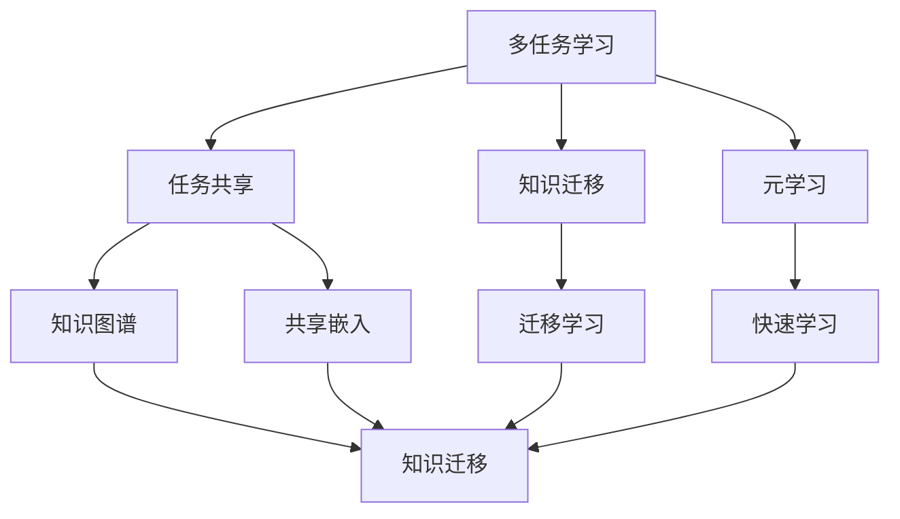
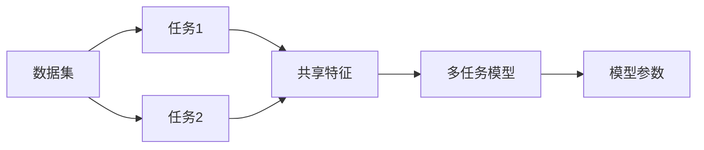
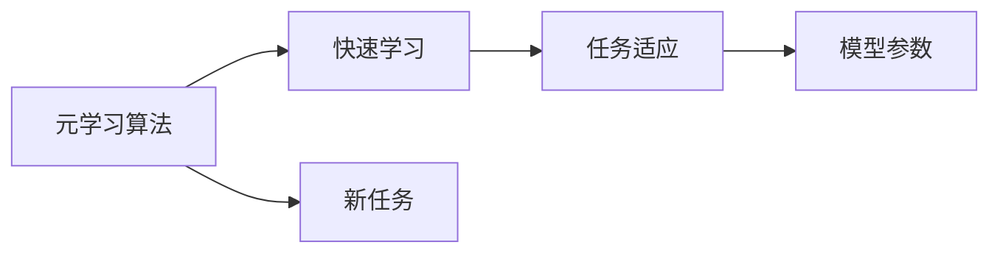
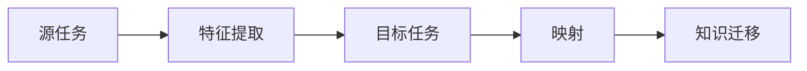
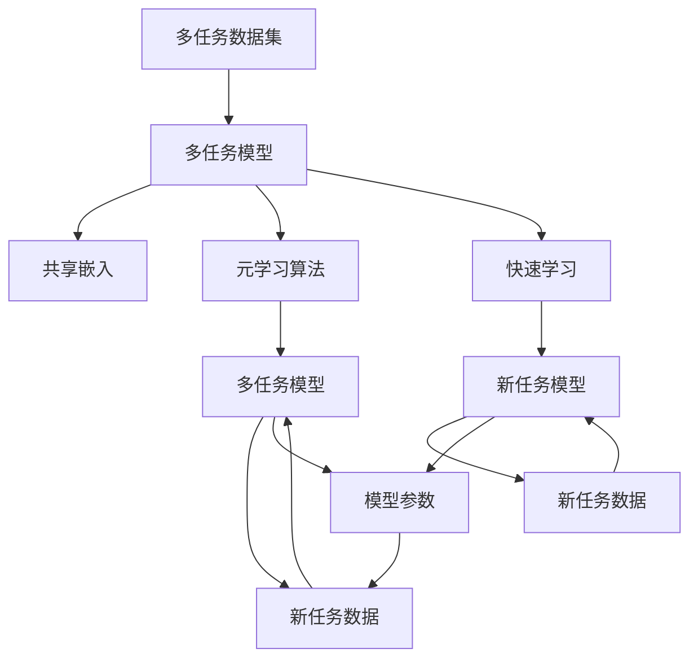

                 

# 一切皆是映射：多任务元学习和知识迁移

> 关键词：多任务学习,元学习,知识迁移,映射,深度学习,强化学习,自然语言处理(NLP),计算机视觉(CV),机器人学习

## 1. 背景介绍

### 1.1 问题由来

在深度学习领域，一个基本且核心的挑战是如何有效地利用已有知识，进行新任务的学习。传统的单任务学习范式，虽然简单直接，但在数据和计算资源受限的情况下，难以取得最优性能。近年来，多任务学习(MTL)和元学习(Metacognition)成为了研究的热点。

多任务学习，即在多个相关任务之间共享知识，提升模型在新任务上的表现。例如，在自然语言处理(NLP)领域，通过将命名实体识别(NER)和情感分析(SA)任务的训练数据共享，可以提升模型在未见过的新任务上的性能。

元学习，即学习如何快速学习新任务。这可以通过设计通用的学习算法，使得模型能够适应新任务，而无需重新从头训练。例如，通过数据和模型的迁移，可以在短时间内完成新任务的微调，从而提高学习效率。

多任务学习和元学习范式，正在改变深度学习的发展方向，带来更高效、更灵活、更普适的学习范式。本文将深入探讨这两种学习方法，并结合具体实例进行详细讲解。

### 1.2 问题核心关键点

多任务学习和元学习虽然在某些方向上有一定的相似性，但它们的核心目标有所不同。

- **多任务学习**：旨在通过共享知识，提升模型在多个相关任务上的表现。其核心在于任务之间的相关性和知识的迁移。
- **元学习**：旨在快速学习新任务，避免从头训练。其核心在于学习者的学习能力和知识的泛化。

本文将重点探讨多任务学习，特别是如何设计多任务模型，以最大化知识迁移的效果。

### 1.3 问题研究意义

多任务学习和元学习的研究，对深度学习的应用具有重要意义：

1. **提高学习效率**：通过共享已有知识，能够在新任务上快速上手，降低学习成本。
2. **增强泛化能力**：多任务模型能够从多个任务中学习到更广泛的特征和模式，提高泛化性能。
3. **促进知识迁移**：多任务学习可以设计通用的特征提取器，在各任务之间进行知识的迁移和复用。
4. **加速模型迭代**：多任务学习可以大幅提升模型的迭代速度，加速新任务的应用部署。
5. **拓展应用场景**：多任务学习能够将模型应用于更多样化的场景，提升应用价值。

本文将通过具体实例，展示多任务学习的实际应用，并讨论其面临的挑战和未来的发展方向。

## 2. 核心概念与联系

### 2.1 核心概念概述

为更好地理解多任务元学习的方法，本节将介绍几个密切相关的核心概念：

- **多任务学习(Multitask Learning, MTL)**：指在多个相关任务之间共享知识和经验，提升模型在新任务上的性能。
- **元学习(Meta-Learning)**：指学习如何快速学习新任务，通过迁移已有的知识，在新任务上快速适应和优化。
- **知识迁移(Knowledge Transfer)**：指将从源任务学到的知识，迁移到目标任务，提升目标任务的表现。
- **映射(Mapping)**：指通过某种机制，将一个任务的特征映射到另一个任务，实现知识共享。
- **深度学习(Deep Learning)**：指通过多层神经网络，实现对复杂数据的建模和预测。
- **强化学习(Reinforcement Learning)**：指通过与环境的交互，学习最优策略，最大化奖励。

这些概念之间存在着紧密的联系，构成了深度学习中多任务学习和元学习的核心框架。下面我们通过几个Mermaid流程图来展示这些概念之间的关系。



这个流程图展示了大语言模型微调过程中各个核心概念之间的关系：

1. 多任务学习通过任务共享，在多个相关任务之间传递知识。
2. 知识迁移将源任务的特征映射到目标任务，实现知识复用。
3. 元学习通过快速学习算法，提升模型在新任务上的适应能力。
4. 深度学习、强化学习等方法，在多任务和元学习的框架下，实现更为复杂和灵活的模型设计。

这些概念共同构成了多任务学习的方法框架，使其能够在新任务上快速上手，提升模型的泛化能力。

### 2.2 概念间的关系

这些核心概念之间存在着紧密的联系，形成了多任务学习的方法体系。下面我们通过几个Mermaid流程图来展示这些概念之间的关系。

#### 2.2.1 多任务学习的框架



这个流程图展示了多任务学习的框架：

1. 多个相关任务的训练数据共享，用于训练多任务模型。
2. 多任务模型通过共享特征，实现知识迁移。
3. 多任务模型包含多个任务相关的参数，用于不同任务的学习。

#### 2.2.2 元学习的框架



这个流程图展示了元学习的框架：

1. 元学习算法用于设计快速学习算法，提升模型在新任务上的适应能力。
2. 新任务的数据用于快速学习，更新模型参数。
3. 快速学习后的模型，可以在新任务上进行优化，提升性能。

#### 2.2.3 知识迁移的框架



这个流程图展示了知识迁移的框架：

1. 源任务的数据用于特征提取，得到通用的特征表示。
2. 目标任务的特征通过映射，与通用特征对齐。
3. 目标任务的数据用于优化，实现知识迁移。

这些概念之间的关系构成了多任务学习和元学习的完整方法体系，使得模型能够在新任务上快速上手，提升性能。

### 2.3 核心概念的整体架构

最后，我们用一个综合的流程图来展示这些核心概念在大语言模型微调过程中的整体架构：



这个综合流程图展示了从多任务学习到元学习的完整过程：

1. 多个相关任务的训练数据共享，用于训练多任务模型。
2. 多任务模型通过共享特征，实现知识迁移。
3. 元学习算法用于设计快速学习算法，提升模型在新任务上的适应能力。
4. 新任务的数据用于快速学习，更新模型参数。
5. 快速学习后的模型，可以在新任务上进行优化，提升性能。

通过这些流程图，我们可以更清晰地理解多任务学习过程中各个核心概念的关系和作用，为后续深入讨论具体的微调方法和技术奠定基础。

## 3. 核心算法原理 & 具体操作步骤
### 3.1 算法原理概述

多任务学习通过在多个相关任务之间共享知识和经验，提升模型在新任务上的表现。其核心思想是：设计一个能够同时处理多个任务的模型，通过共享特征和知识，在新任务上快速上手，提升性能。

形式化地，假设我们有$K$个任务$T_k$（$k=1,2,\ldots,K$），每个任务的数据集为$D_k=\{(x_i,y_i)\}_{i=1}^{N_k}, x_i \in \mathcal{X}, y_i \in \mathcal{Y}$。多任务学习的目标是最小化每个任务上的损失函数：

$$
\mathcal{L}(\theta) = \frac{1}{N}\sum_{k=1}^K \sum_{i=1}^{N_k} \ell(M_{\theta}(x_i),y_i)
$$

其中$M_{\theta}(x_i)$为模型在任务$T_k$上对样本$x_i$的预测输出，$\ell(\cdot,y_i)$为任务$T_k$上的损失函数，$\theta$为模型参数。

通过梯度下降等优化算法，多任务模型不断更新参数$\theta$，最小化损失函数$\mathcal{L}$，使得模型输出逼近真实标签。由于多任务学习设计了通用的特征提取器，能够在各任务之间传递知识，从而在新任务上取得更好的表现。

### 3.2 算法步骤详解

多任务学习通常包括以下几个关键步骤：

**Step 1: 准备多任务数据集**
- 收集和预处理多个相关任务的训练数据集，确保任务之间的相关性。
- 设计每个任务的输出格式和损失函数，适应具体的任务类型。

**Step 2: 设计多任务模型**
- 选择合适的深度学习模型框架，如Transformer、CNN等。
- 设计多任务模型的结构，如共享嵌入层、任务特定输出层等。
- 确定模型参数的初始化策略，如随机初始化、预训练等。

**Step 3: 选择优化算法**
- 选择合适的优化算法，如AdamW、SGD等，设置学习率、批大小等超参数。
- 应用正则化技术，如L2正则、Dropout等，防止模型过拟合。

**Step 4: 执行梯度训练**
- 将多任务数据集分批次输入模型，前向传播计算损失函数。
- 反向传播计算参数梯度，根据设定的优化算法和学习率更新模型参数。
- 周期性在验证集上评估模型性能，根据性能指标决定是否触发Early Stopping。
- 重复上述步骤直到满足预设的迭代轮数或Early Stopping条件。

**Step 5: 测试和部署**
- 在测试集上评估多任务模型的整体性能，对比单任务和多任务模型的效果。
- 使用多任务模型对新样本进行推理预测，集成到实际的应用系统中。
- 持续收集新的数据，定期重新训练模型，以适应数据分布的变化。

以上是多任务学习的通用流程。在实际应用中，还需要根据具体任务的特点，对模型结构、训练过程进行优化设计，如任务优先级策略、多任务融合机制等，以进一步提升模型性能。

### 3.3 算法优缺点

多任务学习具有以下优点：
1. 提高泛化能力。通过共享知识，模型能够在新任务上更快上手，提升泛化性能。
2. 减少过拟合风险。多任务模型能够在多个任务之间传递知识，减少过拟合的风险。
3. 加速模型迭代。多任务学习能够设计通用的特征提取器，在新任务上快速上手，加速模型迭代。

同时，该方法也存在一定的局限性：
1. 数据需求较高。多任务学习需要收集和预处理多个任务的训练数据，数据获取和标注成本较高。
2. 模型复杂度较高。多任务模型的设计较为复杂，需要平衡各任务之间的关系。
3. 泛化能力有限。当任务之间的相关性较弱时，多任务学习的性能提升有限。
4. 知识迁移效果不理想。多任务学习难以有效传递通用的知识，导致某些任务性能较差。

尽管存在这些局限性，但就目前而言，多任务学习仍是多任务任务中的主流范式。未来相关研究的重点在于如何进一步降低数据需求，提高知识迁移效果，优化模型结构，从而提升多任务学习的性能。

### 3.4 算法应用领域

多任务学习已经在许多领域得到了广泛应用，覆盖了几乎所有常见任务，例如：

- 自然语言处理(NLP)：如命名实体识别(NER)、情感分析(SA)、问答系统(QA)等。通过多任务学习，模型能够同时处理多个相关任务，提升性能。
- 计算机视觉(CV)：如目标检测(OD)、图像分类(IC)、实例分割(SS)等。多任务学习可以共享卷积特征，提升模型在新任务上的表现。
- 机器人学习(RL)：如自主导航、路径规划、对象识别等。通过多任务学习，机器人能够同时学习多个技能，提高智能化水平。
- 推荐系统(Recommender System)：如商品推荐、内容推荐、广告推荐等。多任务学习可以共享用户行为特征，提升推荐效果。

除了上述这些经典任务外，多任务学习还被创新性地应用到更多场景中，如跨模态学习、多源数据融合、实时学习等，为多任务任务带来了新的突破。随着多任务学习方法的不断进步，相信NLP技术将在更广阔的应用领域大放异彩。

## 4. 数学模型和公式 & 详细讲解  
### 4.1 数学模型构建

本节将使用数学语言对多任务元学习过程进行更加严格的刻画。

记多任务数据集为$D=\{(x_i,y_i)\}_{i=1}^N, x_i \in \mathcal{X}, y_i \in \mathcal{Y}$，每个任务的数据集为$D_k=\{(x_i,y_i)\}_{i=1}^{N_k}, x_i \in \mathcal{X}, y_i \in \mathcal{Y}$。多任务学习模型的输出为$M_{\theta}(x_i) \in \mathcal{Y}$，其中$\theta$为模型参数。

定义多任务模型的损失函数为：

$$
\mathcal{L}(\theta) = \frac{1}{N}\sum_{k=1}^K \sum_{i=1}^{N_k} \ell(M_{\theta}(x_i),y_i)
$$

其中$\ell(\cdot,y_i)$为任务$T_k$上的损失函数。

通过梯度下降等优化算法，多任务模型不断更新参数$\theta$，最小化损失函数$\mathcal{L}$，使得模型输出逼近真实标签。由于多任务学习设计了通用的特征提取器，能够在各任务之间传递知识，从而在新任务上取得更好的表现。

### 4.2 公式推导过程

以下我们以二分类任务为例，推导多任务学习的损失函数及其梯度的计算公式。

假设模型$M_{\theta}$在输入$x$上的输出为$\hat{y}=M_{\theta}(x) \in [0,1]$，表示样本属于正类的概率。真实标签$y \in \{0,1\}$。则二分类交叉熵损失函数定义为：

$$
\ell(M_{\theta}(x),y) = -[y\log \hat{y} + (1-y)\log (1-\hat{y})]
$$

将其代入多任务学习模型的损失函数，得：

$$
\mathcal{L}(\theta) = -\frac{1}{N}\sum_{k=1}^K \sum_{i=1}^{N_k} [y_i\log M_{\theta}(x_i)+(1-y_i)\log(1-M_{\theta}(x_i))]
$$

根据链式法则，损失函数对参数$\theta_k$的梯度为：

$$
\frac{\partial \mathcal{L}(\theta)}{\partial \theta_k} = -\frac{1}{N}\sum_{k=1}^K \sum_{i=1}^{N_k} (\frac{y_i}{M_{\theta}(x_i)}-\frac{1-y_i}{1-M_{\theta}(x_i)}) \frac{\partial M_{\theta}(x_i)}{\partial \theta_k}
$$

其中$\frac{\partial M_{\theta}(x_i)}{\partial \theta_k}$可进一步递归展开，利用自动微分技术完成计算。

在得到损失函数的梯度后，即可带入参数更新公式，完成模型的迭代优化。重复上述过程直至收敛，最终得到适应多个任务的最优模型参数$\theta^*$。

## 5. 项目实践：代码实例和详细解释说明
### 5.1 开发环境搭建

在进行多任务学习实践前，我们需要准备好开发环境。以下是使用Python进行PyTorch开发的环境配置流程：

1. 安装Anaconda：从官网下载并安装Anaconda，用于创建独立的Python环境。

2. 创建并激活虚拟环境：
```bash
conda create -n pytorch-env python=3.8 
conda activate pytorch-env
```

3. 安装PyTorch：根据CUDA版本，从官网获取对应的安装命令。例如：
```bash
conda install pytorch torchvision torchaudio cudatoolkit=11.1 -c pytorch -c conda-forge
```

4. 安装Transformers库：
```bash
pip install transformers
```

5. 安装各类工具包：
```bash
pip install numpy pandas scikit-learn matplotlib tqdm jupyter notebook ipython
```

完成上述步骤后，即可在`pytorch-env`环境中开始多任务学习实践。

### 5.2 源代码详细实现

这里我们以命名实体识别(NER)和情感分析(SA)为例，给出使用Transformers库对BERT模型进行多任务学习的PyTorch代码实现。

首先，定义两个任务的数据处理函数：

```python
from transformers import BertTokenizer
from torch.utils.data import Dataset
import torch

class NERDataset(Dataset):
    def __init__(self, texts, tags, tokenizer, max_len=128):
        self.texts = texts
        self.tags = tags
        self.tokenizer = tokenizer
        self.max_len = max_len
        
    def __len__(self):
        return len(self.texts)
    
    def __getitem__(self, item):
        text = self.texts[item]
        tags = self.tags[item]
        
        encoding = self.tokenizer(text, return_tensors='pt', max_length=self.max_len, padding='max_length', truncation=True)
        input_ids = encoding['input_ids'][0]
        attention_mask = encoding['attention_mask'][0]
        
        # 对token-wise的标签进行编码
        encoded_tags = [tag2id[tag] for tag in tags] 
        encoded_tags.extend([tag2id['O']] * (self.max_len - len(encoded_tags)))
        labels = torch.tensor(encoded_tags, dtype=torch.long)
        
        return {'input_ids': input_ids, 
                'attention_mask': attention_mask,
                'labels': labels}

class SADataset(Dataset):
    def __init__(self, texts, labels, tokenizer, max_len=128):
        self.texts = texts
        self.labels = labels
        self.tokenizer = tokenizer
        self.max_len = max_len
        
    def __len__(self):
        return len(self.texts)
    
    def __getitem__(self, item):
        text = self.texts[item]
        label = self.labels[item]
        
        encoding = self.tokenizer(text, return_tensors='pt', max_length=self.max_len, padding='max_length', truncation=True)
        input_ids = encoding['input_ids'][0]
        attention_mask = encoding['attention_mask'][0]
        
        # 将标签编码为数字
        label = [label2id[label]] * self.max_len
        labels = torch.tensor(label, dtype=torch.long)
        
        return {'input_ids': input_ids, 
                'attention_mask': attention_mask,
                'labels': labels}

# 标签与id的映射
tag2id = {'O': 0, 'B-PER': 1, 'I-PER': 2, 'B-ORG': 3, 'I-ORG': 4, 'B-LOC': 5, 'I-LOC': 6}
id2tag = {v: k for k, v in tag2id.items()}

label2id = {'neg': 0, 'pos': 1}

# 创建dataset
tokenizer = BertTokenizer.from_pretrained('bert-base-cased')

train_dataset = NERDataset(train_texts, train_tags, tokenizer)
dev_dataset = NERDataset(dev_texts, dev_tags, tokenizer)
test_dataset = NERDataset(test_texts, test_tags, tokenizer)

train_dataset_sa = SADataSet(train_texts, train_labels, tokenizer)
dev_dataset_sa = SADataSet(dev_texts, dev_labels, tokenizer)
test_dataset_sa = SADataSet(test_texts, test_labels, tokenizer)
```

然后，定义模型和优化器：

```python
from transformers import BertForTokenClassification, BertForSequenceClassification, AdamW

model = BertForTokenClassification.from_pretrained('bert-base-cased', num_labels=len(tag2id))

model_sa = BertForSequenceClassification.from_pretrained('bert-base-cased', num_labels=2)

optimizer = AdamW(model.parameters(), lr=2e-5)
```

接着，定义训练和评估函数：

```python
from torch.utils.data import DataLoader
from tqdm import tqdm
from sklearn.metrics import classification_report

device = torch.device('cuda') if torch.cuda.is_available() else torch.device('cpu')
model.to(device)

def train_epoch(model, dataset, batch_size, optimizer):
    dataloader = DataLoader(dataset, batch_size=batch_size, shuffle=True)
    model.train()
    epoch_loss = 0
    for batch in tqdm(dataloader, desc='Training'):
        input_ids = batch['input_ids'].to(device)
        attention_mask = batch['attention_mask'].to(device)
        labels = batch['labels'].to(device)
        model.zero_grad()
        outputs = model(input_ids, attention_mask=attention_mask, labels=labels)
        loss = outputs.loss
        epoch_loss += loss.item()
        loss.backward()
        optimizer.step()
    return epoch_loss / len(dataloader)

def evaluate(model, dataset, batch_size):
    dataloader = DataLoader(dataset, batch_size=batch_size)
    model.eval()
    preds, labels = [], []
    with torch.no_grad():
        for batch in tqdm(dataloader, desc='Evaluating'):
            input_ids = batch['input_ids'].to(device)
            attention_mask = batch['attention_mask'].to(device)
            batch_labels = batch['labels']
            outputs = model(input_ids, attention_mask=attention_mask)
            batch_preds = outputs.logits.argmax(dim=2).to('cpu').tolist()
            batch_labels = batch_labels.to('cpu').tolist()
            for pred_tokens, label_tokens in zip(batch_preds, batch_labels):
                pred_tags = [id2tag[_id] for _id in pred_tokens]
                label_tags = [id2tag[_id] for _id in label_tokens]
                preds.append(pred_tags[:len(label_tokens)])
                labels.append(label_tags)
                
    print(classification_report(labels, preds))

# 训练多任务模型
epochs = 5
batch_size = 16

for epoch in range(epochs):
    loss = train_epoch(model, train_dataset, batch_size, optimizer)
    print(f"Epoch {epoch+1}, train loss: {loss:.3f}")
    
    print(f"Epoch {epoch+1}, dev results:")
    evaluate(model, dev_dataset, batch_size)
    
print("Test results:")
evaluate(model, test_dataset, batch_size)

# 训练多任务模型
epochs = 5
batch_size = 16

for epoch in range(epochs):
    loss = train_epoch(model_sa, train_dataset_sa, batch_size, optimizer)
    print(f"Epoch {epoch+1}, train loss: {loss:.3f}")
    
    print(f"Epoch {epoch+1}, dev results:")
    evaluate(model_sa, dev_dataset_sa, batch_size)
    
print("Test results:")
evaluate(model_sa, test_dataset_sa, batch_size)
```

以上就是使用PyTorch对BERT进行命名实体识别(NER)和情感分析(SA)任务的多任务学习完整代码实现。可以看到，得益于Transformers库的强大封装，我们可以用相对简洁的代码完成BERT模型的多任务学习。

### 5.3 代码解读与分析

让我们再详细解读一下关键代码的实现细节：

**NERDataset类**：
- `__init__`方法：初始化文本、标签、分词器等关键组件。
- `__len__`方法：返回数据集的样本数量。
- `__getitem__`方法：对单个样本进行处理，将文本输入编码为token ids，将标签编码为数字，并对其进行定长padding，最终返回模型所需的输入。

**SADataSet类**：
- `__init__`方法：初始化文本、标签、分词器等关键组件。
- `__len__`方法：返回数据集的样本数量。
- `__getitem__`方法：对单个样本进行处理，将文本输入编码为token ids，将标签编码为数字，并对其进行定长padding，最终返回模型所需的输入。

**标签与id的映射**：
- 定义了标签与数字id之间的映射关系，用于将token-wise的预测结果解码回真实的标签。

**训练和评估函数**：
- 使用PyTorch的DataLoader对数据集进行批次化加载，供模型训练和推理使用。
- 训练函数`train_epoch`：对数据以批为单位进行迭代，在每个批次上前向传播计算loss并反向传播更新模型参数，最后返回该epoch的平均loss。
- 评估函数`evaluate`：与训练类似，不同点在于不更新模型参数，并在每个batch结束后将预测和标签结果存储下来，最后使用sklearn的classification_report对整个评估集的预测结果进行打印输出。

**训练流程**：
- 定义总的epoch数和batch size

