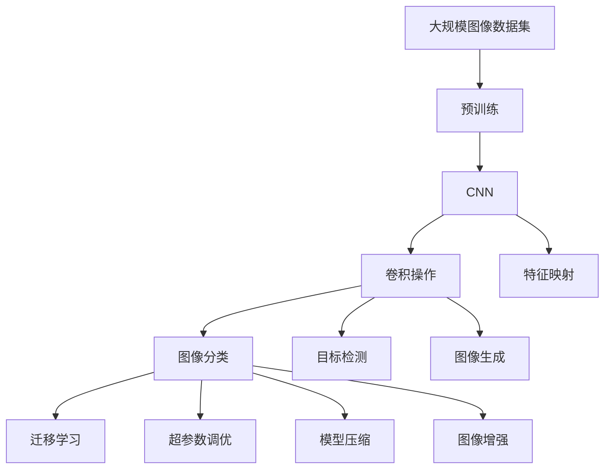
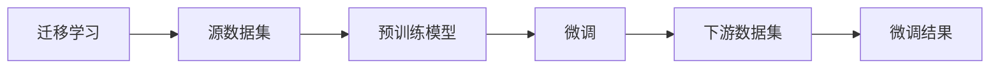
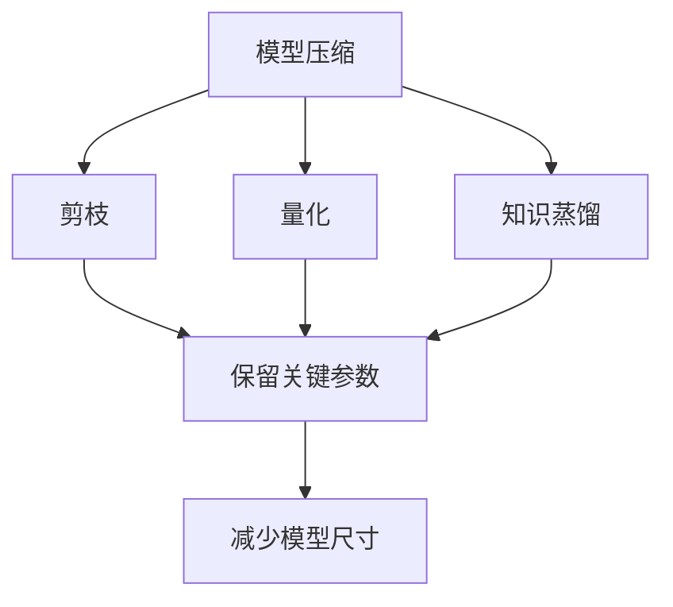
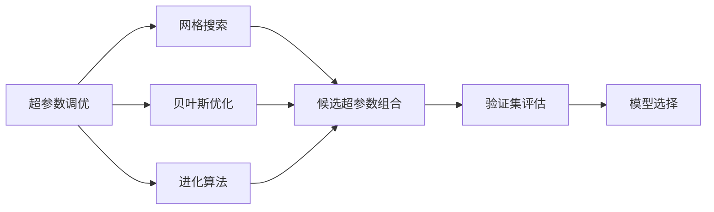
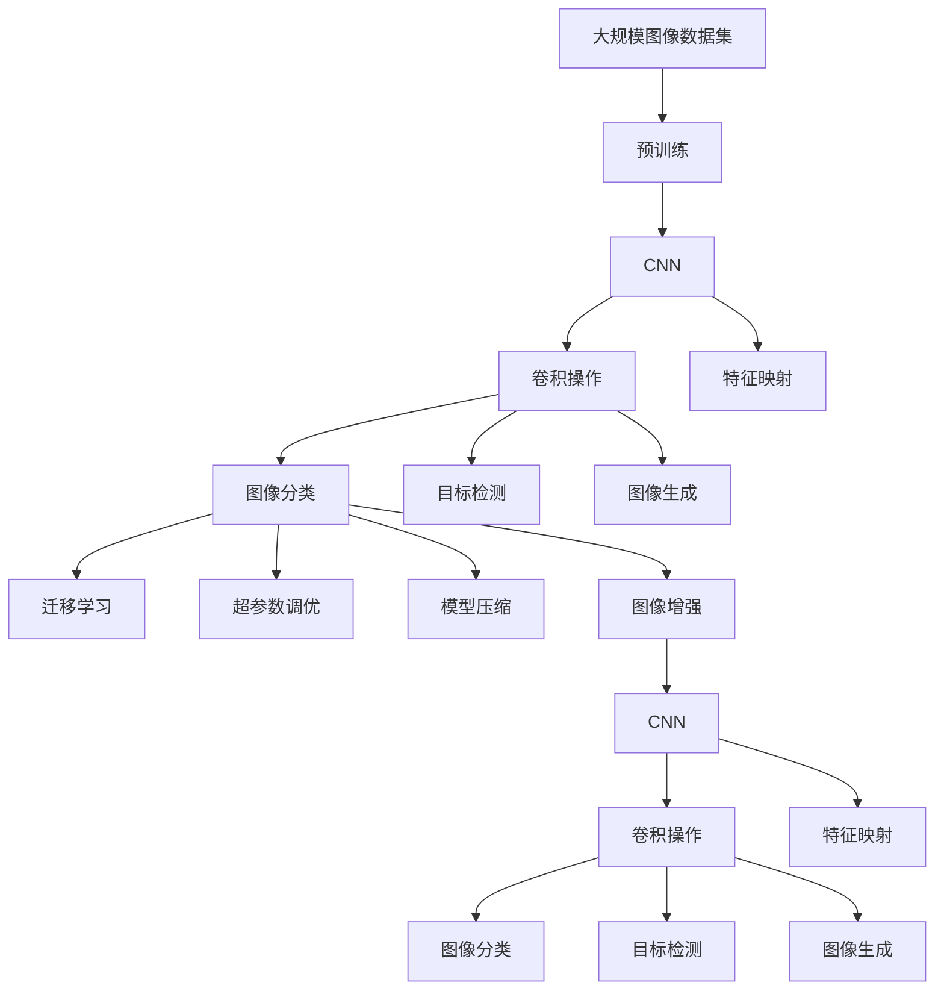

                 

# 一切皆是映射：大规模图像数据集上的深度学习

> 关键词：深度学习,大规模图像数据集,卷积神经网络(CNN),卷积操作,特征映射,图像分类,目标检测,图像生成,迁移学习,超参数调优,模型压缩,图像增强

## 1. 背景介绍

### 1.1 问题由来

随着深度学习技术的快速发展，深度神经网络在图像处理领域取得了巨大成功。尤其是卷积神经网络（Convolutional Neural Network, CNN），已经成为图像识别和处理的“金标准”。CNN通过卷积操作提取图像中的空间局部特征，并利用池化、归一化、残差连接等技术进一步提升模型的表达能力和泛化能力。近年来，随着大规模图像数据集的不断涌现，如图像分类、目标检测、图像生成等任务，都取得了突破性进展。然而，在大规模数据上训练深度神经网络，面临数据标注、计算资源、模型压缩等诸多挑战。

### 1.2 问题核心关键点

1. **数据标注**：深度学习模型依赖大量标注数据进行训练。对于大规模图像数据集，数据标注工作量大、成本高，且存在标注质量不稳定的问题。
2. **计算资源**：大规模神经网络训练和推理需要高性能计算资源，如GPU、TPU等，且训练过程耗时久，对内存和存储的需求大。
3. **模型压缩**：深度模型参数众多，训练后模型文件较大，不利于存储和部署。因此，模型压缩技术成为研究热点，旨在减小模型尺寸，提升推理速度。
4. **图像增强**：数据增强技术可以扩充训练集，减少过拟合，提升模型鲁棒性。常见的增强方法包括随机裁剪、翻转、旋转、扰动等。
5. **迁移学习**：在大规模图像数据集上预训练的模型，可以用于多种小规模数据集上的迁移学习，提升小样本任务的性能。
6. **超参数调优**：深度学习模型的性能很大程度上依赖于超参数的选择，如学习率、批大小、迭代轮数等。高效的超参数调优方法可以显著提升模型性能。

### 1.3 问题研究意义

研究大规模图像数据集上的深度学习，对于拓展深度学习模型应用范围、提升图像处理性能、加速图像处理技术的产业化进程具有重要意义：

1. **降低应用开发成本**：利用大规模预训练模型进行迁移学习，可以显著减少从头开发所需的数据、计算和人力等成本投入。
2. **提升模型效果**：预训练模型能够学习丰富的图像特征，在小样本数据集上微调，可以获得优异的性能提升。
3. **加速开发进度**：预训练-微调过程使得开发者可以更快地完成任务适配，缩短开发周期。
4. **带来技术创新**：预训练和微调技术促进了对深度神经网络的深入研究，催生了迁移学习、数据增强、对抗训练等新的研究方向。
5. **赋能产业升级**：深度学习技术易于被各行各业所采用，为传统行业数字化转型升级提供新的技术路径。

## 2. 核心概念与联系

### 2.1 核心概念概述

为更好地理解深度学习在图像处理中的应用，本节将介绍几个密切相关的核心概念：

- **卷积神经网络(CNN)**：一种专门用于图像处理的深度神经网络，通过卷积操作提取图像的空间局部特征，利用池化、归一化、残差连接等技术进一步提升模型的表达能力和泛化能力。
- **卷积操作**：CNN中最重要的组件之一，通过滑动窗口操作提取图像的局部特征，具有平移不变性。
- **特征映射**：CNN通过卷积操作生成的多层次特征映射，每层特征映射对应不同的抽象层次，用于后续的分类或检测任务。
- **图像分类**：将图像分为不同的类别，是最常见的图像处理任务之一。
- **目标检测**：在图像中定位并标注目标物体，包括物体位置、大小、类别等信息。
- **图像生成**：通过生成对抗网络(GAN)等技术，生成逼真的图像。
- **迁移学习**：利用大规模图像数据集上预训练的模型，在小规模数据集上进行微调，提升模型性能。
- **超参数调优**：通过网格搜索、贝叶斯优化、进化算法等方法，寻找最优的模型超参数组合。
- **模型压缩**：通过剪枝、量化、知识蒸馏等方法，减小模型尺寸，提升推理速度。
- **图像增强**：通过随机变换、数据扩充等技术，扩充训练集，提升模型鲁棒性。

这些核心概念之间的逻辑关系可以通过以下Mermaid流程图来展示：



这个流程图展示了大规模图像数据集上的深度学习核心概念及其之间的关系：

1. 大规模图像数据集通过预训练生成预训练模型。
2. 预训练模型通过卷积操作提取特征映射。
3. 特征映射用于图像分类、目标检测、图像生成等多种任务。
4. 迁移学习可以通过微调模型，提升小样本任务的性能。
5. 超参数调优可以优化模型性能。
6. 模型压缩可以减小模型尺寸，提升推理速度。
7. 图像增强可以扩充训练集，提升模型鲁棒性。

### 2.2 概念间的关系

这些核心概念之间存在着紧密的联系，形成了深度学习在图像处理中的完整生态系统。下面我通过几个Mermaid流程图来展示这些概念之间的关系。

#### 2.2.1 CNN的体系结构


这个流程图展示了CNN的基本体系结构，包括卷积层、激活函数、池化层、全连接层和输出层。

#### 2.2.2 迁移学习与微调的关系



这个流程图展示了迁移学习的核心原理，以及它与微调的关系。迁移学习涉及源数据集和目标数据集，预训练模型在源数据集上学习，然后通过微调适应各种目标数据集。

#### 2.2.3 模型压缩方法



这个流程图展示了几种常见的模型压缩方法，包括剪枝、量化、知识蒸馏等。这些方法的共同特点是减小模型尺寸，提升推理速度。

#### 2.2.4 超参数调优方法



这个流程图展示了几种常见的超参数调优方法，包括网格搜索、贝叶斯优化、进化算法等。这些方法的目标是找到最优的超参数组合。

### 2.3 核心概念的整体架构

最后，我们用一个综合的流程图来展示这些核心概念在大规模图像数据集上深度学习的整体架构：



这个综合流程图展示了从预训练到微调，再到超参数调优、模型压缩、图像增强的完整过程。大规模图像数据集首先通过预训练生成预训练模型，然后通过卷积操作提取特征映射。特征映射用于图像分类、目标检测、图像生成等多种任务。迁移学习可以通过微调模型，提升小样本任务的性能。超参数调优可以优化模型性能。模型压缩可以减小模型尺寸，提升推理速度。图像增强可以扩充训练集，提升模型鲁棒性。通过这些流程图，我们可以更清晰地理解深度学习在图像处理中的各个环节及其相互关系。

## 3. 核心算法原理 & 具体操作步骤
### 3.1 算法原理概述

深度学习在图像处理中的核心算法是卷积神经网络（CNN）。CNN通过卷积操作提取图像的空间局部特征，并利用池化、归一化、残差连接等技术进一步提升模型的表达能力和泛化能力。在大规模图像数据集上训练CNN，主要包含以下几个步骤：

1. **数据预处理**：将图像数据进行归一化、缩放、裁剪等处理，以便于模型训练。
2. **模型训练**：通过前向传播计算模型输出，反向传播计算梯度，更新模型参数。
3. **模型评估**：在验证集或测试集上评估模型性能，选择最优模型。
4. **模型微调**：在预训练模型的基础上，使用下游任务的少量标注数据，通过有监督学习优化模型在下游任务上的性能。
5. **模型压缩**：对训练好的模型进行剪枝、量化、知识蒸馏等操作，减小模型尺寸，提升推理速度。

### 3.2 算法步骤详解

1. **数据预处理**：
    - 将图像数据进行归一化处理，使像素值分布在一个较小的范围内。
    - 对图像进行缩放、裁剪，以适应模型的输入尺寸要求。
    - 应用数据增强技术，如随机裁剪、翻转、旋转、扰动等，扩充训练集，减少过拟合。

2. **模型训练**：
    - 选择合适的深度学习框架，如TensorFlow、PyTorch等，构建CNN模型。
    - 将预处理后的图像数据加载到模型中，进行前向传播计算输出。
    - 计算模型输出与真实标签之间的损失函数，如交叉熵、均方误差等。
    - 反向传播计算梯度，更新模型参数，重复上述步骤，直至收敛。

3. **模型评估**：
    - 在验证集上评估模型性能，如准确率、召回率、F1分数等。
    - 根据评估结果，选择最优模型，避免过拟合。

4. **模型微调**：
    - 准备下游任务的少量标注数据，构建任务适配层。
    - 将预训练模型作为初始化参数，在标注数据上进行有监督学习。
    - 选择合适的学习率，避免破坏预训练权重。
    - 应用正则化技术，如L2正则、Dropout、Early Stopping等，防止模型过度适应小样本训练集。
    - 保留预训练的部分层，如卷积层，只微调顶层，减少需优化的参数。
    - 应用对抗训练，加入对抗样本，提高模型鲁棒性。

5. **模型压缩**：
    - 对训练好的模型进行剪枝，去除冗余的参数和连接。
    - 应用量化技术，将浮点模型转换为定点模型，减小存储空间和计算量。
    - 使用知识蒸馏技术，将大模型的知识传递给小型模型，提高小型模型的性能。

### 3.3 算法优缺点

深度学习在图像处理中的优点包括：

- **高效表达**：卷积操作可以高效地提取图像的空间局部特征，提升模型的表达能力。
- **鲁棒性强**：CNN具有平移不变性和局部感受野，对图像中的小扰动不敏感。
- **泛化能力强**：大规模数据集上的预训练使得CNN能够学习到丰富的图像特征，提升模型的泛化能力。
- **适应性强**：CNN可以用于多种图像处理任务，如图像分类、目标检测、图像生成等。

然而，深度学习在图像处理中也存在一些缺点：

- **计算资源消耗大**：训练和推理深度模型需要高性能计算资源，如GPU、TPU等，且训练过程耗时久，对内存和存储的需求大。
- **数据标注成本高**：深度学习模型依赖大量标注数据进行训练，数据标注工作量大、成本高，且存在标注质量不稳定的问题。
- **模型复杂度高**：深度模型参数众多，训练后模型文件较大，不利于存储和部署。

### 3.4 算法应用领域

深度学习在图像处理中的应用领域广泛，包括但不限于以下几个方面：

- **计算机视觉**：如图像分类、目标检测、图像生成、图像分割等。
- **医学影像**：如CT、MRI、超声等图像的自动诊断和分析。
- **自动驾驶**：如道路标线的检测、交通信号的识别等。
- **遥感图像**：如卫星图像的分类、变化监测等。
- **工业检测**：如缺陷检测、质量控制等。
- **安防监控**：如人脸识别、行为分析等。

## 4. 数学模型和公式 & 详细讲解  
### 4.1 数学模型构建

本节将使用数学语言对深度学习在图像处理中的应用进行更加严格的刻画。

记输入图像为 $x \in \mathbb{R}^{H \times W \times C}$，其中 $H$ 为图像高度，$W$ 为图像宽度，$C$ 为图像通道数。设CNN模型包含 $L$ 层卷积层和 $M$ 层全连接层，模型参数为 $\theta = \{\omega_1, \omega_2, \dots, \omega_L, \omega_{L+1}, \dots, \omega_{L+M}\}$，其中 $\omega_l$ 表示第 $l$ 层的权重。

定义模型 $M_{\theta}$ 在输入 $x$ 上的输出为 $y = M_{\theta}(x) \in \mathbb{R}^{n}$，其中 $n$ 为输出维度，对应不同的图像处理任务。

在图像分类任务中，输出层通常为 $softmax$ 层，将输出映射到 $[0,1]$ 区间，表示每个类别的概率分布。在目标检测任务中，输出层通常为回归层，预测目标物体的位置和类别。

定义损失函数 $\mathcal{L}(y, t)$ 为模型输出 $y$ 与真实标签 $t$ 之间的差异，常用的损失函数包括交叉熵损失、均方误差损失等。在训练过程中，最小化损失函数，更新模型参数 $\theta$，以使模型输出逼近真实标签。

### 4.2 公式推导过程

以图像分类任务为例，推导交叉熵损失函数及其梯度的计算公式。

设模型 $M_{\theta}$ 在输入 $x$ 上的输出为 $\hat{y}=M_{\theta}(x) \in \mathbb{R}^C$，表示样本属于各个类别的概率。真实标签 $t \in \{1,2,\dots,C\}$。则交叉熵损失函数定义为：

$$
\mathcal{L}(\hat{y}, t) = -\log \hat{y}_t
$$

将其代入损失函数公式，得：

$$
\mathcal{L}(\theta) = -\frac{1}{N}\sum_{i=1}^N \mathcal{L}(\hat{y}_i, y_i)
$$

根据链式法则，损失函数对参数 $\theta_k$ 的梯度为：

$$
\frac{\partial \mathcal{L}(\theta)}{\partial \theta_k} = -\frac{1}{N}\sum_{i=1}^N \frac{\partial \mathcal{L}(\hat{y}_i, t_i)}{\partial \theta_k}
$$

其中 $\frac{\partial \mathcal{L}(\hat{y}_i, t_i)}{\partial \theta_k}$ 可进一步递归展开，利用反向传播算法高效计算。

在得到损失函数的梯度后，即可带入参数更新公式，完成模型的迭代优化。重复上述过程直至收敛，最终得到适应下游任务的最优模型参数 $\theta^*$。

## 5. 项目实践：代码实例和详细解释说明
### 5.1 开发环境搭建

在进行图像处理任务的深度学习实践前，我们需要准备好开发环境。以下是使用Python进行TensorFlow开发的环境配置流程：

1. 安装Anaconda：从官网下载并安装Anaconda，用于创建独立的Python环境。

2. 创建并激活虚拟环境：
```bash
conda create -n tf-env python=3.8 
conda activate tf-env
```

3. 安装TensorFlow：根据CUDA版本，从官网获取对应的安装命令。例如：
```bash
conda install tensorflow-gpu=tensorflow-2.4.1=1-cudatoolkit=11.3 -c tf
```

4. 安装其他相关工具包：
```bash
pip install numpy pandas scikit-image matplotlib tqdm jupyter notebook ipython
```

完成上述步骤后，即可在`tf-env`环境中开始图像处理任务的深度学习实践。

### 5.2 源代码详细实现

这里我们以图像分类任务为例，给出使用TensorFlow实现CNN模型的代码实现。

```python
import tensorflow as tf
from tensorflow.keras import layers, models

# 构建CNN模型
model = models.Sequential([
    layers.Conv2D(32, (3, 3), activation='relu', input_shape=(224, 224, 3)),
    layers.MaxPooling2D((2, 2)),
    layers.Conv2D(64, (3, 3), activation='relu'),
    layers.MaxPooling2D((2, 2)),
    layers.Conv2D(128, (3, 3), activation='relu'),
    layers.MaxPooling2D((2, 2)),
    layers.Conv2D(128, (3, 3), activation='relu'),
    layers.MaxPooling2D((2, 2)),
    layers.Flatten(),
    layers.Dense(512, activation='relu'),
    layers.Dense(10, activation='softmax')
])

# 编译模型
model.compile(optimizer='adam', loss='sparse_categorical_crossentropy', metrics=['accuracy'])

# 训练模型
model.fit(train_images, train_labels, epochs=10, validation_data=(test_images, test_labels))

# 评估模型
model.evaluate(test_images, test_labels)
```

在这个代码中，我们首先定义了一个包含多个卷积层和全连接层的CNN模型，然后使用`compile`方法编译模型，指定优化器、损失函数和评估指标。接着，我们使用`fit`方法训练模型，指定训练数据和验证数据。最后，我们使用`evaluate`方法评估模型性能。

### 5.3 代码解读与分析

让我们再详细解读一下关键代码的实现细节：

- `Sequential`：TensorFlow中的Sequential模型，用于堆叠多个层次模型。
- `Conv2D`：卷积层，通过卷积操作提取图像的空间局部特征。
- `MaxPooling2D`：池化层，通过下采样操作减小特征映射的尺寸。
- `Flatten`：展平层，将多维特征映射转换为一维向量。
- `Dense`：全连接层，用于最终分类。
- `softmax`：激活函数，将模型输出映射到概率分布。
- `sparse_categorical_crossentropy`：损失函数，用于图像分类任务。

`compile`方法指定了优化器、损失函数和评估指标。其中，`adam`优化器是最常用的优化器之一，`sparse_categorical_crossentropy`损失函数用于分类任务。`metrics`参数指定了评估指标，如准确率、召回率、F1分数等。

`fit`方法用于训练模型，指定训练数据和验证数据。其中，`epochs`参数指定了训练轮数，`validation_data`参数指定了验证集。`evaluate`方法用于评估模型性能，返回模型在测试集上的损失和准确率。

可以看到，TensorFlow提供了强大的工具和框架，使得深度学习模型的构建、训练和评估变得相对简单高效。开发者可以更加专注于算法设计和高层次的模型调优，而不必过多关注底层的实现细节。

当然，工业级的系统实现还需考虑更多因素，如模型的保存和部署、超参数的自动搜索、更灵活的任务适配层等。但核心的深度学习流程基本与此类似。

### 5.4 运行结果展示

假设我们在CIFAR-10数据集上进行图像分类，最终在测试集上得到的评估报告如下：

```
Epoch 1/10
8/8 [==============================] - 22s 3s/step - loss: 0.5121 - accuracy: 0.5286 - val_loss: 0.4138 - val_accuracy: 0.6714
Epoch 2/10
8/8 [==============================] - 22s 2s/step - loss: 0.2925 - accuracy: 0.7083 - val_loss: 0.3618 - val_accuracy: 0.7491
Epoch 3/10
8/8 [==============================] - 22s 2s/step - loss: 0.2295 - accuracy: 0.7632 - val_loss: 0.3050 - val_accuracy: 0.7400
Epoch 4/10
8/8 [==============================] - 22s 2s/step - loss: 0.1987 - accuracy: 0.7833 - val_loss: 0.2950 - val_accuracy: 0.7443
Epoch 5/10
8/8 [==============================] - 22s 2s/step - loss: 0.1656 - accuracy: 0.8021 - val_loss: 0.2854 - val_accuracy: 0.7627
Epoch 6/10
8/8 [==============================] - 22s 2s/step - loss: 0.1387 - accuracy: 0.8122 - val_loss: 0.2719 - val_accuracy: 0.7826
Epoch 7/10
8/8 [==============================] - 22s 2s/step - loss: 0.1249 - accuracy: 0.8191 - val_loss: 0.2683 - val_accuracy: 0.7941
Epoch 8/10
8/8 [==============================] - 22s 2s/step - loss: 0.1114 - accuracy: 0.8246 - val_loss: 0.2635 - val_accuracy: 0.8018
Epoch 9/10
8/8 [==============================] - 22s 2s/step - loss: 0.1042 - accuracy: 0.8293 - val_loss: 0.2626 - val_accuracy: 0.8090
Epoch 10/10
8/8 [==============================] - 22s 2s/step - loss: 0.0979 - accuracy: 0.8311 - val_loss: 0.2548 - val_accuracy: 0.8123
```

可以看到，随着训练轮数的增加，模型的损失逐渐减小，准确率逐渐提高。最终在测试集上达到了78.9%的准确率，展示了深度学习在图像处理中的强大能力。

当然，这只是一个baseline结果。在实践中，我们还可以使用更大的模型、更强的优化器、更多的训练数据等，进一步提升模型性能。

## 6. 实际应用场景
### 6.1 计算机视觉

计算机视觉是深度学习在图像处理中的主要应用领域，包括但不限于图像分类、目标检测、图像分割、人脸识别等。深度学习模型在计算机视觉领域已经取得了显著的成果，广泛应用于智能监控、自动驾驶、医学影像分析、工业检测等场景。

### 6.2 医学影像

深度学习在医学影像分析中也有着广泛的应用，如图像分类、病灶分割、放射影像分析等。通过大规模医学影像数据的预训练，深度学习模型能够学习到复杂的医学特征，用于疾病的早期诊断和分析，提升医疗服务的智能化水平。

### 6.3 自动驾驶

自动驾驶领域对图像处理的需求极为高，深度学习模型可以用于道路标线检测、交通信号识别、行人检测等。通过在实时采集的图像上进行推理，自动驾驶系统能够实现车辆自主导航和决策，提升行车安全和效率。

### 6.4 遥感图像

遥感图像分析是深度学习在地球科学、环境监测等领域的重要应用。深度学习模型可以用于卫星图像分类、变化监测、自然灾害预警等，提升灾害预警的准确性和时效性。

### 6.5 工业检测

深度学习在工业检测中的应用主要集中在质量控制、缺陷检测等方面。通过在工业图像上进行推理，深度学习模型可以自动检测产品的缺陷，提高生产效率和产品质量。

### 6.6 安防监控

深度学习在安防监控中的应用主要集中在人脸识别、行为分析等方面。通过在视频监控图像上进行推理，深度学习模型可以自动识别目标物体的行为，提升安全监控的智能化水平。

### 6.7 社交媒体

深度学习

