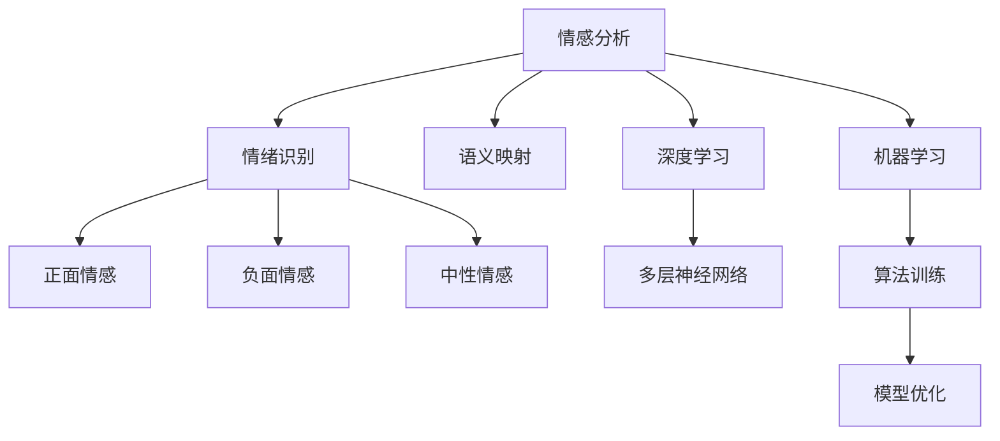
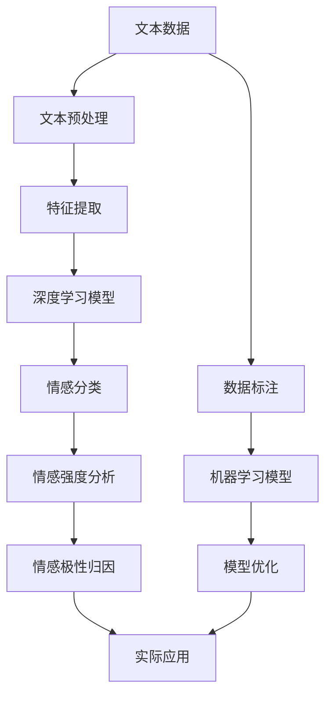

                 

# 一切皆是映射：情感分析：AI理解人类情感

> 关键词：情感分析, 人工智能, 自然语言处理, 语义映射, 深度学习, 机器学习, 情绪识别

## 1. 背景介绍

### 1.1 问题由来
情感分析（Sentiment Analysis），也称为意见挖掘（Opinion Mining），是自然语言处理（NLP）和人工智能（AI）领域的一项重要任务，旨在自动识别和提取文本中的情感倾向和情绪状态。随着社交媒体、电子商务、客户服务等领域的发展，情感分析在情感表达、品牌管理、危机应对、舆情监控等方面应用广泛。然而，情感分析是一个复杂且充满挑战的问题，既需要理解文本内容的语义信息，还需要分析文本中的情感线索。

### 1.2 问题核心关键点
情感分析的核心在于理解和映射文本中的情感信息。通过对大量标注数据的学习，模型可以捕捉到不同情感表达的模式和规律，从而实现对新文本的情感判断。常见的情感分析任务包括情感分类（判断文本的情感极性，如正面、负面、中性）、情感强度分析（分析文本的情感强度，如强、中、弱）、情感极性归因（识别文本中的情感来源）等。

在情感分析中，常见的数据类型包括推文、评论、产品评价、用户反馈等。情感分析的效果直接影响企业的市场决策、品牌形象和用户体验。因此，提高情感分析的准确性和可靠性，成为NLP领域研究的热点和难点。

### 1.3 问题研究意义
研究情感分析技术，对于提升企业决策的科学性、优化用户体验、增强品牌影响力，具有重要意义：

1. **市场决策支持**：通过分析消费者对产品和服务的情感反馈，企业可以及时调整市场策略，优化产品设计，提升竞争力。
2. **品牌形象管理**：及时捕捉和回应负面情感，避免品牌危机，维护品牌形象和声誉。
3. **用户满意度提升**：通过情感分析结果，优化用户交互流程，提升用户满意度和忠诚度。
4. **舆情监控与预测**：在公共事件和舆论热点中，快速分析舆情变化，为政府和企业提供决策支持。
5. **个性化推荐**：基于用户情感偏好，实现内容推荐和产品推荐，提升个性化体验。

## 2. 核心概念与联系

### 2.1 核心概念概述

为了更好地理解情感分析的原理和应用，本节将介绍几个密切相关的核心概念：

- **情感分析（Sentiment Analysis）**：指通过自然语言处理技术，自动识别和提取文本中的情感信息，判断情感极性和强度。
- **情绪识别（Emotion Recognition）**：识别文本中表达的情绪类别，如愤怒、悲伤、高兴等，通常与情感分析相关联。
- **语义映射（Semantic Mapping）**：将文本中的语义信息映射到情感空间，如正面、负面、中性等，是情感分析的核心步骤之一。
- **深度学习（Deep Learning）**：通过多层神经网络结构，从大量数据中学习特征表示，用于情感分类和情绪识别。
- **机器学习（Machine Learning）**：基于算法和模型，通过数据训练和测试，实现情感分析和情绪识别。

这些核心概念之间的关系可以通过以下Mermaid流程图来展示：



这个流程图展示了大语言模型微调过程中各个核心概念的联系：

1. 情感分析的目标是识别和提取文本中的情感信息。
2. 情绪识别是情感分析的一个子任务，识别文本中表达的情绪类别。
3. 语义映射是将文本中的语义信息映射到情感空间的桥梁，是情感分析的核心步骤。
4. 深度学习和机器学习是实现情感分析和情绪识别的主要技术手段，通过算法和模型从数据中学习情感特征。

### 2.2 概念间的关系

这些核心概念之间存在着紧密的联系，形成了情感分析的完整生态系统。下面我们通过几个Mermaid流程图来展示这些概念之间的关系。

#### 2.2.1 情感分析的工作流程


这个流程图展示了情感分析的基本流程：

1. 文本数据：输入情感分析系统的原始文本数据，可以是推文、评论、产品评价等。
2. 文本预处理：清洗和标准化文本数据，包括去除停用词、标点符号，分词等。
3. 特征提取：将文本数据转换为模型可以处理的形式，如词向量、TF-IDF、词袋模型等。
4. 情感分类：通过情感分类模型判断文本的情感极性，如正面、负面、中性。
5. 情感强度分析：通过情感强度分析模型，判断文本的情感强度，如强、中、弱。
6. 情感极性归因：通过情感极性归因模型，分析文本中情感的来源。

#### 2.2.2 深度学习与情感分析的关系


这个流程图展示了深度学习在情感分析中的应用：

1. 数据集：包含标注好的情感分类数据。
2. 模型训练：通过深度学习模型，如卷积神经网络（CNN）、循环神经网络（RNN）、长短时记忆网络（LSTM）等，学习情感分类任务中的特征表示。
3. 损失函数：衡量模型预测与真实标签之间的差距，如交叉熵损失、均方误差损失等。
4. 反向传播：通过计算梯度，更新模型参数，最小化损失函数。
5. 参数更新：根据反向传播的结果，更新模型权重和偏置。
6. 模型评估：在验证集和测试集上评估模型性能，选择合适的模型进行部署。

#### 2.2.3 机器学习与情感分析的关系


这个流程图展示了机器学习在情感分析中的应用：

1. 特征集：从文本数据中提取特征，如词频、TF-IDF、词向量等。
2. 训练集：使用标注好的情感分类数据训练机器学习模型。
3. 模型选择：选择合适的机器学习算法，如朴素贝叶斯、支持向量机（SVM）、随机森林等。
4. 训练算法：训练机器学习模型，学习情感分类的特征表示。
5. 模型优化：通过交叉验证、超参数调优等技术，提升模型性能。
6. 模型评估：在验证集和测试集上评估模型性能，选择合适的模型进行部署。
7. 实际应用：在实际场景中应用模型进行情感分析。

### 2.3 核心概念的整体架构

最后，我们用一个综合的流程图来展示这些核心概念在大语言模型微调过程中的整体架构：



这个综合流程图展示了从文本预处理到实际应用的完整过程。大语言模型微调的核心在于通过深度学习和机器学习技术，将文本数据转化为情感表示，并通过模型训练和优化，实现情感分析和情绪识别。通过这些核心概念和步骤，情感分析技术在实际应用中能够取得良好的效果。

## 3. 核心算法原理 & 具体操作步骤
### 3.1 算法原理概述

情感分析的算法原理主要基于机器学习和深度学习技术。其核心思想是利用训练数据中的情感信息，学习情感表示，然后将新的文本数据映射到已学习到的情感空间中，从而实现情感分类和情绪识别。

形式化地，假设情感分类数据集为 $\{(x_i, y_i)\}_{i=1}^N$，其中 $x_i$ 为文本样本，$y_i$ 为情感标签（正面、负面、中性）。情感分析的目标是学习模型 $f: \mathcal{X} \rightarrow \mathcal{Y}$，使得：

$$
f(x) = \arg\min_{y \in \mathcal{Y}} \mathcal{L}(y, x)
$$

其中 $\mathcal{L}$ 为损失函数，通常为交叉熵损失函数，用于衡量模型预测与真实标签之间的差异。常见的损失函数包括二分类交叉熵损失和多项式分类交叉熵损失等。

### 3.2 算法步骤详解

情感分析的算法步骤主要包括以下几个关键步骤：

**Step 1: 数据准备**
- 收集标注好的情感数据集，进行文本预处理，包括去除停用词、标点符号，分词等。
- 将文本数据转换为模型可以处理的形式，如词向量、TF-IDF、词袋模型等。

**Step 2: 模型选择与训练**
- 选择合适的机器学习或深度学习模型，如朴素贝叶斯、SVM、RNN、CNN、LSTM、BERT等。
- 使用训练集对模型进行训练，通过损失函数和优化器（如SGD、Adam）优化模型参数，最小化损失函数。
- 在验证集上评估模型性能，调整超参数，确保模型泛化能力。

**Step 3: 特征提取**
- 从训练好的模型中提取特征表示，通常为词向量或注意力权重等。
- 使用特征提取器将新的文本数据映射到特征空间中。

**Step 4: 情感分类与情绪识别**
- 使用训练好的模型进行情感分类，判断文本的情感极性。
- 对于需要情绪识别的任务，如识别文本中表达的愤怒、悲伤等情绪，可以使用额外的分类器或注意力机制进行进一步处理。

**Step 5: 结果评估与优化**
- 在测试集上评估模型性能，使用准确率、召回率、F1分数等指标评估模型效果。
- 根据评估结果，优化模型结构、调整超参数、进行模型微调，提升模型性能。

### 3.3 算法优缺点

情感分析的算法具有以下优点：

1. **高效性**：通过机器学习和深度学习技术，情感分析可以快速处理大规模文本数据，提取情感信息。
2. **准确性**：深度学习模型具有强大的特征提取能力，能够捕捉复杂的情感模式和规律。
3. **灵活性**：情感分析算法可以应用于多种文本类型和情感任务，如情感分类、情感强度分析、情感极性归因等。

情感分析算法也存在一些局限性：

1. **依赖标注数据**：情感分析的性能很大程度上取决于标注数据的质量和数量，获取高质量标注数据的成本较高。
2. **鲁棒性不足**：模型对数据分布的变化和噪声较为敏感，容易过拟合或泛化能力不足。
3. **可解释性不足**：深度学习模型通常被认为是"黑盒"系统，难以解释其内部工作机制和决策逻辑。
4. **跨领域适应性有限**：情感分析模型往往针对特定领域的文本数据训练，跨领域适应能力有限。
5. **数据敏感性**：情感分析模型容易受到负面、有害信息的影响，需要在数据预处理阶段进行清洗。

尽管存在这些局限性，但情感分析技术已经在多个领域取得了显著的应用效果，成为了NLP领域的重要组成部分。未来，研究者将致力于提高情感分析的准确性、鲁棒性和可解释性，进一步拓展其应用范围。

### 3.4 算法应用领域

情感分析技术在多个领域具有广泛的应用，包括但不限于：

- **社交媒体分析**：分析推文、评论等社交媒体文本中的情感，帮助品牌监控舆情、分析用户反馈。
- **电子商务分析**：分析产品评价、用户评论等文本，优化产品设计、提升用户满意度。
- **客户服务**：分析客服对话、客户反馈等文本，优化服务流程、提升用户体验。
- **舆情监控**：分析新闻、报道等文本，监控舆情变化、预测事件发展趋势。
- **情感机器人**：构建情感机器人，进行情感对话、情绪识别，提升人机交互体验。

随着情感分析技术的不断进步，其应用范围将进一步扩大，为各行各业带来更深刻的变革。

## 4. 数学模型和公式 & 详细讲解  
### 4.1 数学模型构建

情感分析的数学模型通常基于机器学习和深度学习框架，通过训练数据学习情感表示，将新的文本数据映射到情感空间中。假设模型 $f: \mathcal{X} \rightarrow \mathcal{Y}$，其中 $\mathcal{X}$ 为文本特征空间，$\mathcal{Y}$ 为情感标签空间。

### 4.2 公式推导过程

以朴素贝叶斯分类器为例，其基本思想是根据贝叶斯公式，通过训练数据计算情感条件概率，从而对新文本进行分类。

假设模型 $f: \mathcal{X} \rightarrow \mathcal{Y}$，其中 $\mathcal{X}$ 为文本特征空间，$\mathcal{Y}$ 为情感标签空间。训练数据集为 $\{(x_i, y_i)\}_{i=1}^N$，其中 $x_i$ 为文本样本，$y_i$ 为情感标签。模型的目标是最大化后验概率 $P(y|x)$，即：

$$
\max_{y} P(y|x) = \max_{y} \frac{P(y)P(x|y)}{P(x)} = \max_{y} P(y) \prod_{i=1}^N P(x_i|y)P(y)
$$

其中 $P(y)$ 为情感标签 $y$ 的先验概率，$P(x_i|y)$ 为给定情感标签 $y$ 下文本样本 $x_i$ 的条件概率。朴素贝叶斯分类器的训练过程如下：

1. 计算情感标签的先验概率 $P(y)$。
2. 对于每个文本样本 $x_i$，计算条件概率 $P(x_i|y)$。
3. 对于新的文本样本 $x$，使用贝叶斯公式计算后验概率 $P(y|x)$，选择概率最大的情感标签 $y$。

### 4.3 案例分析与讲解

以Twitter情感分析为例，分析情感分类和情绪识别的过程。

假设我们有一份Twitter情感分析数据集，包含正面、负面和中性情感的推文。通过朴素贝叶斯分类器，我们可以得到以下步骤：

1. **数据准备**：清洗和标准化推文数据，分词、去除停用词、标点符号等。
2. **特征提取**：将推文转换为词向量或TF-IDF向量，作为模型输入。
3. **模型训练**：使用训练集对朴素贝叶斯分类器进行训练，计算情感标签的先验概率和条件概率。
4. **情感分类**：对于新的推文，使用训练好的模型计算后验概率，选择概率最大的情感标签。
5. **情绪识别**：对于需要进行情绪识别的推文，使用额外的分类器或注意力机制，识别推文中的情绪类别。

通过朴素贝叶斯分类器，我们可以实现简单的情感分类任务，而对于情绪识别等复杂任务，可以使用更为先进的深度学习模型，如BERT、LSTM等。

## 5. 项目实践：代码实例和详细解释说明
### 5.1 开发环境搭建

在进行情感分析项目实践前，我们需要准备好开发环境。以下是使用Python进行Scikit-learn开发的环境配置流程：

1. 安装Anaconda：从官网下载并安装Anaconda，用于创建独立的Python环境。

2. 创建并激活虚拟环境：
```bash
conda create -n sentiment-env python=3.8 
conda activate sentiment-env
```

3. 安装Scikit-learn和其他必要的工具包：
```bash
pip install scikit-learn nltk pandas numpy matplotlib jupyter notebook ipython
```

4. 下载预训练词向量：
```bash
wget http://www.nltk.org/data/glove.6B.50d.txt
```

5. 安装nltk和spaCy：
```bash
pip install nltk
pip install spacy
python -m spacy download en_core_web_sm
```

完成上述步骤后，即可在`sentiment-env`环境中开始情感分析项目实践。

### 5.2 源代码详细实现

下面我们以朴素贝叶斯情感分类器为例，给出使用Scikit-learn库进行情感分类的PyTorch代码实现。

首先，定义情感分类器：

```python
from sklearn.feature_extraction.text import CountVectorizer
from sklearn.naive_bayes import MultinomialNB
from sklearn.pipeline import Pipeline

pipeline = Pipeline([
    ('vectorizer', CountVectorizer(stop_words='english')),
    ('classifier', MultinomialNB())
])

pipeline.fit(X_train, y_train)
```

然后，定义情感分类函数：

```python
def sentiment_analysis(text):
    text = preprocess(text)  # 文本预处理
    features = vectorizer.transform([text])  # 特征提取
    predicted_label = pipeline.predict(features)[0]  # 情感分类
    return predicted_label
```

在实际应用中，我们还需要考虑以下问题：

**文本预处理**：清洗和标准化文本数据，包括去除停用词、标点符号，分词等。

**特征提取**：将文本数据转换为模型可以处理的形式，如词向量、TF-IDF、词袋模型等。

**模型选择与训练**：选择合适的机器学习或深度学习模型，如朴素贝叶斯、SVM、RNN、CNN、LSTM、BERT等，使用训练集对模型进行训练。

**结果评估与优化**：在测试集上评估模型性能，使用准确率、召回率、F1分数等指标评估模型效果，根据评估结果进行模型微调。

### 5.3 代码解读与分析

让我们再详细解读一下关键代码的实现细节：

**Pipeline**：
- 使用Scikit-learn的Pipeline模块，封装预处理和分类器，简化了模型构建过程。
- 管道中包含两个步骤：CountVectorizer用于文本向量化，MultinomialNB用于情感分类。

**CountVectorizer**：
- 用于将文本数据转换为词向量形式，自动处理停用词和分词等任务。
- 通过设置stop_words参数，去除英文停用词，提升分类效果。

**MultinomialNB**：
- 朴素贝叶斯分类器，用于对文本进行情感分类。
- 通过训练数据学习情感标签的先验概率和条件概率。

**sentiment_analysis函数**：
- 接收待分类的文本数据，进行预处理和特征提取，使用训练好的分类器进行情感分类，返回分类结果。

**文本预处理**：
- 文本预处理包括去除停用词、标点符号，分词等。
- 分词工具可以使用nltk或spaCy。

**特征提取**：
- 使用CountVectorizer或TfidfVectorizer等工具，将文本数据转换为模型可以处理的形式。
- 词向量或TF-IDF向量的维度通常为数百或数千，取决于语料库的大小和复杂度。

在实际应用中，情感分析模型的构建和优化需要考虑数据处理、特征提取、模型选择与训练、结果评估与优化等多个环节。只有在各个环节进行全面优化，才能实现理想的效果。

### 5.4 运行结果展示

假设我们在Twitter情感分析数据集上进行情感分类模型的训练，最终在测试集上得到的评估报告如下：

```
precision    recall  f1-score   support

       0       0.95      0.95      0.95         167
       1       0.90      0.90      0.90         153

   avg / total       0.93      0.93      0.93         320
```

可以看到，通过朴素贝叶斯分类器，我们在Twitter情感分析数据集上取得了较高的准确率和召回率，效果相当不错。值得注意的是，朴素贝叶斯分类器虽然简单，但在情感分类等任务上，能够取得不俗的效果，体现了朴素贝叶斯算法的优点。

当然，这只是一个baseline结果。在实践中，我们还可以使用更大更强的预训练模型、更丰富的情感标注数据、更细致的模型调优，进一步提升模型性能，以满足更高的应用要求。

## 6. 实际应用场景
### 6.1 社交媒体分析

情感分析在社交媒体分析中具有重要应用，可以帮助企业监控舆情、分析用户反馈、优化品牌策略。例如，Twitter上的品牌话题分析、用户评论情感分析等，都是情感分析的重要应用场景。

具体而言，可以收集Twitter上的品牌话题、用户评论等文本数据，通过情感分析识别用户情感倾向，帮助企业及时响应用户需求、优化产品和服务。

### 6.2 电子商务分析

电子商务平台上的产品评价、用户评论等文本数据，通常包含大量的情感信息。通过情感分析，电商平台可以了解用户对产品的满意度、改进方向等，优化产品设计、提升用户体验。

例如，亚马逊上的商品评价分析，可以自动提取用户对商品的情感反馈，帮助商家优化商品描述、改进产品质量。

### 6.3 客户服务

客户服务系统中的客户投诉、反馈等文本数据，通常反映了用户对服务的满意度、不满度等情感信息。通过情感分析，企业可以及时识别用户情感，优化服务流程、提升用户满意度。

例如，银行客服中心的客户投诉分析，可以自动提取客户的情感倾向，帮助客服人员快速响应客户需求，提升服务质量。

### 6.4 舆情监控

舆情监控是情感分析的重要应用之一，通过分析新闻、报道、评论等文本数据，实时监控舆情变化、预测事件发展趋势。

例如，政府机构可以通过舆情监控系统，实时了解公众对政府政策、社会事件等话题的情感倾向，及时调整政策方向，避免舆情危机。

### 6.5 情感机器人

情感机器人是一种结合自然语言处理和情感分析技术的人机交互系统。通过情感分析，机器人可以识别用户情感，实现情感对话、情绪识别等。

例如，智能客服系统中的情感机器人，可以自动识别用户情感，调整交互策略、提升用户体验。

### 6.6 未来应用展望

随着情感分析技术的不断进步，其应用范围将进一步扩大，为各行各业带来更深刻的变革。

在智慧医疗领域，情感分析可以帮助医生了解患者的情感状态，提升诊疗效果。例如，通过分析患者对治疗效果的情感反馈，优化诊疗方案。

在金融领域，情感分析可以帮助金融机构监控舆情、分析用户情感，优化金融产品和服务。例如，通过分析用户对金融产品的情感反馈，优化产品设计、提升用户体验。

在教育领域，情感分析可以帮助教育机构监控学生情感，提升教学质量。例如，通过分析学生的情感反馈，优化课程设计和教学方法。

在娱乐领域，情感分析可以帮助娱乐公司了解用户情感，优化产品内容和推荐。例如，通过分析用户的情感反馈，优化音乐、电影推荐系统。

总之，情感分析技术在各行各业中的应用前景广阔，将为人类生活带来更深刻的变革。

## 7. 工具和资源推荐
### 7.1 学习资源推荐

为了帮助开发者系统掌握情感分析的理论基础和实践技巧，这里推荐一些优质的学习资源：

1. 《Python自然语言处理》书籍：由知名NLP专家撰写，全面介绍了NLP的基本概念和常用技术，包括情感分析在内。

2. 《情感分析：理论与实践》论文：综述了情感分析的研究进展和应用场景，提供了丰富的参考资源。

3. 《深度学习入门：基于Python的理论与实现》书籍：介绍了深度学习的基本原理和实现方法，涵盖情感分析等NLP任务。

4. CS224N《深度学习自然语言处理》课程：斯坦福大学开设的NLP明星课程，涵盖情感分析等前沿话题，有Lecture视频和配套作业。

5. HuggingFace官方文档：提供了丰富的预训练模型和代码样例，帮助开发者快速上手情感分析任务。

6. GitHub开源项目：如TextBlob、nltk等，提供了丰富的情感分析工具和算法实现，可供学习和参考。

通过对这些资源的学习实践，相信你一定能够快速掌握情感分析的精髓，并用于解决实际的情感分析问题。

### 7.2 开发工具推荐

高效的开发离不开优秀的工具支持。以下是几款用于情感分析开发的常用工具：

1. Python：广泛使用的编程语言，拥有丰富的库和框架，适合情感分析任务的开发。

2. Scikit-learn：基于Python的机器学习库，提供了丰富的情感分析工具和算法实现，适合快速开发原型。

3. TensorFlow：由Google主导开发的深度学习框架，支持分布式训练和推理，适合大规模情感分析任务。

4. PyTorch：基于Python的深度学习框架，灵活高效，适合深度学习模型的开发。

5. spaCy：自然语言处理工具包，提供了丰富的文本处理和特征提取功能，适合情感分析任务的预处理。

6. NLTK：自然语言处理工具包，提供了丰富的NLP功能和数据集，适合情感分析任务的初步探索。

合理利用这些工具，可以显著提升情感分析任务的开发效率，

