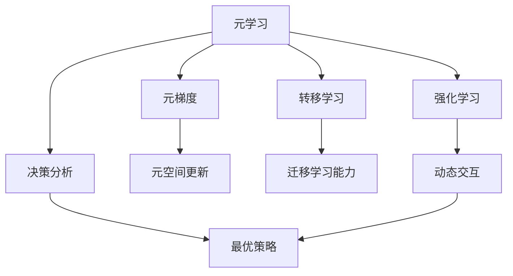
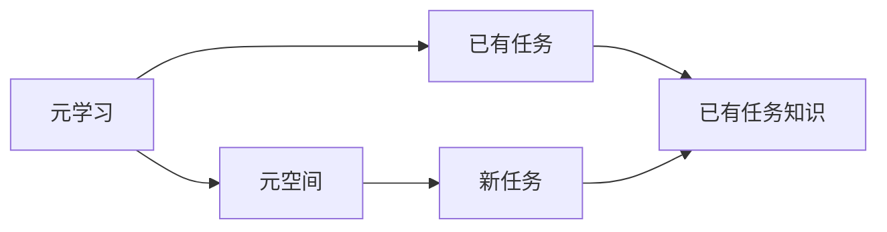
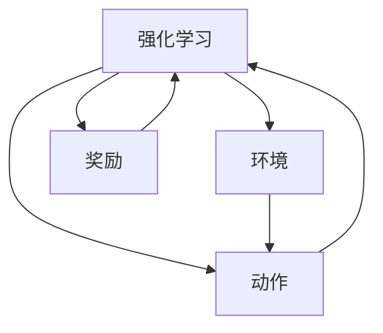
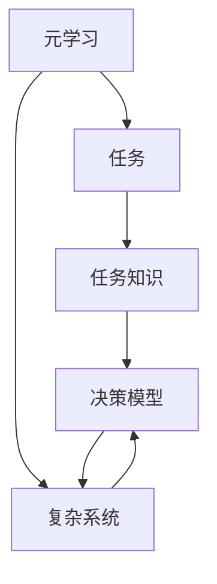
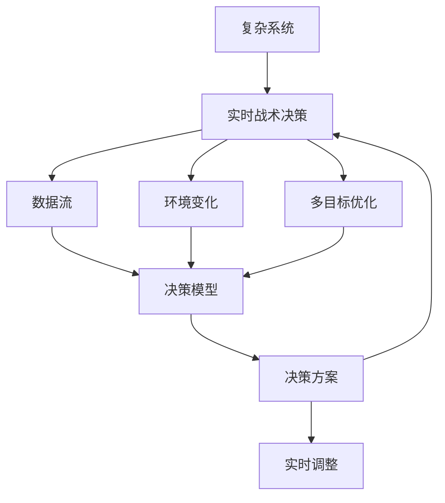

                 

# 一切皆是映射：掌握元学习用于实时战术决策分析

> 关键词：元学习,元梯度,转移学习,强化学习,决策分析,实时战术,复杂系统,复杂决策

## 1. 背景介绍

### 1.1 问题由来

现代决策分析与优化领域面临着前所未有的复杂性。在军事、金融、物流、医疗等众多关键行业，决策者们需要实时分析大量动态变化的数据，制定和调整策略，以应对日益复杂多变的局面。然而，传统的数据驱动决策方法往往难以处理高度非线性、动态变化的环境，而现有的机器学习和统计学方法，又难以刻画实时交互过程中决策者和环境的动态变化，难以适应高维度的决策场景。

在军事领域，比如无人机指挥系统、自适应网络防护等应用场景，需要实时生成有效的战术决策，以应对战场上的动态威胁。然而，由于多维度的环境变量、多样化的战术目标，决策过程非常复杂，难以用简单的规则模型刻画。传统的监督学习和强化学习方法虽然可以在一定程度上模拟决策过程，但在高维动态场景下，依然面临效率低、泛化能力弱等问题。

## 2. 核心概念与联系

### 2.1 核心概念概述

为了更好地解决实时战术决策分析问题，本节将介绍几个关键概念：

- **元学习(Meta-Learning)**：是指在已有任务的经验上，快速适应新任务的一种学习能力。元学习通过训练模型在不同任务上的表现，优化模型参数，使模型在新任务上能够快速收敛。元学习在强化学习、迁移学习和无监督学习等方向都有广泛应用。

- **元梯度(Meta-Gradient)**：是指在元空间中，描述参数变化对损失函数影响的梯度。通过计算元梯度，元学习算法可以更新模型参数，使其在新任务上表现更佳。

- **转移学习(Transfer Learning)**：是指在已有任务上训练的模型，能够迁移到新的任务上，提高新任务的泛化能力。转移学习是元学习的一种特殊形式，即新任务和已有任务之间具有一定的相关性。

- **强化学习(Reinforcement Learning)**：是指在动态环境中，通过奖励信号指导模型学习最优策略的方法。强化学习在实时决策分析中应用广泛，例如自动驾驶、机器人控制等。

- **决策分析(Decision Analysis)**：是指在有限资源条件下，分析不同决策方案的优劣，选择最优策略的过程。决策分析需要刻画决策者和环境之间的动态交互关系，以及多维度目标的优先级。

- **复杂系统(Complex System)**：是指包含众多子系统，系统间的交互关系高度复杂，难以用简单的数学模型描述的系统。复杂系统的决策分析需要结合动态环境、子系统交互和局部最优的组合优化方法。

- **实时战术决策(Real-Time Tactical Decision Making)**：是指在动态环境中，实时分析数据，生成和调整战术决策的过程。实时战术决策需要考虑任务目标、环境变化和计算效率等多方面因素，并能够根据实时反馈进行调整。

这些概念之间的逻辑关系可以通过以下Mermaid流程图来展示：



这个流程图展示了大语言模型微调过程中各个核心概念的关系和作用：

1. 元学习作为元空间优化方法，通过训练模型在已有任务上的表现，学习任务的共同特征。
2. 元梯度作为元空间中描述参数变化对损失函数影响的梯度，用于更新模型参数。
3. 转移学习通过迁移已有任务上学习到的知识，在新任务上快速收敛。
4. 强化学习在动态环境中通过奖励信号，指导模型学习最优策略。
5. 决策分析通过刻画决策者和环境间的交互，以及多目标优化，实现最优决策。
6. 复杂系统考虑系统的多维度和子系统交互，采用复杂决策方法。
7. 实时战术决策考虑环境变化和计算效率，实时生成和调整战术决策。

这些概念共同构成了实时战术决策分析的完整生态系统，为其提供了丰富的理论和算法基础。

### 2.2 概念间的关系

这些核心概念之间存在着紧密的联系，形成了实时战术决策分析的完整框架。以下是几个Mermaid流程图来展示这些概念之间的关系。

#### 2.2.1 元学习与转移学习的关系



这个流程图展示了元学习和转移学习的基本原理，即通过元学习在不同任务上的知识迁移，提升新任务的泛化能力。

#### 2.2.2 强化学习与决策分析的关系



这个流程图展示了强化学习通过奖励信号指导模型学习最优策略的过程，同时决策分析通过对策略效果评估，选择最优决策方案。

#### 2.2.3 元学习与复杂系统决策分析的关系



这个流程图展示了元学习通过学习复杂系统不同任务上的知识，优化决策模型，从而提升复杂系统决策的效率和效果。

### 2.3 核心概念的整体架构

最后，我们用一个综合的流程图来展示这些核心概念在大语言模型微调过程中的整体架构：



这个综合流程图展示了从复杂系统到实时战术决策的全过程，包括数据流、环境变化、多目标优化和决策方案的实时调整。通过这些流程，可以更好地理解实时战术决策分析的复杂性和多样性。

## 3. 核心算法原理 & 具体操作步骤

### 3.1 算法原理概述

实时战术决策分析的核心目标是，基于有限的数据和计算资源，实时生成最优的战术决策。其算法框架主要包含以下几个关键步骤：

1. **数据预处理**：将实时获取的战场、环境数据进行清洗、过滤和归一化处理，构建适用于决策模型的输入数据。
2. **动态环境建模**：通过动态交互和强化学习，构建实时环境模型的优化方法，刻画动态环境中的交互关系和状态变化。
3. **决策模型构建**：结合多目标优化方法和复杂决策算法，构建实时战术决策的模型，刻画多目标之间的优先级和交互关系。
4. **模型优化与训练**：通过元学习和转移学习，优化决策模型参数，提高模型在新任务上的泛化能力和适应性。
5. **实时决策生成**：基于实时数据流和优化后的决策模型，生成和调整实时战术决策。

其中，元学习和转移学习是实时战术决策分析的关键方法，通过这些方法，可以显著提升决策模型在新任务上的适应性和泛化能力。

### 3.2 算法步骤详解

#### 3.2.1 数据预处理

1. **数据清洗**：将实时获取的战场、环境数据进行清洗，去除噪声和异常值。
2. **数据过滤**：根据决策任务需求，选择与任务相关性高的数据，过滤掉无关信息。
3. **数据归一化**：将不同量级的特征进行归一化处理，使其在决策模型中具有相同的权重。

#### 3.2.2 动态环境建模

1. **环境状态表示**：使用状态向量表示动态环境中的关键变量，包括战场态势、友军位置、敌方威胁等。
2. **状态变化描述**：使用差分方程或动态图模型，描述状态变化规律。
3. **动态交互建模**：使用强化学习，模拟决策者与环境之间的交互过程，优化决策策略。

#### 3.2.3 决策模型构建

1. **多目标优化模型**：构建包含多个目标的优化模型，刻画不同战术目标之间的优先级和交互关系。
2. **复杂决策算法**：采用基于动态规划、进化算法、遗传算法等复杂决策方法，生成和调整战术决策。
3. **决策模型评估**：使用决策模型在历史数据上的表现，评估模型效果，进行模型优化。

#### 3.2.4 模型优化与训练

1. **元学习框架构建**：构建包含多个元任务的元学习框架，每个元任务对应一个子问题，刻画不同决策场景的共同特征。
2. **元梯度计算**：使用元梯度计算参数变化对损失函数的影响，优化模型在新任务上的性能。
3. **转移学习应用**：在新任务上，将已有任务上学习到的知识迁移应用，提高模型泛化能力。

#### 3.2.5 实时决策生成

1. **实时数据流处理**：将实时获取的战场、环境数据进行流处理，实时更新决策模型的输入。
2. **实时决策生成**：根据实时数据流和优化后的决策模型，生成和调整实时战术决策。
3. **实时调整策略**：根据实时反馈，调整决策策略，保持决策模型的适应性。

### 3.3 算法优缺点

**优点**：

1. **快速适应新任务**：通过元学习和转移学习，模型能够快速适应新任务，提高决策效率。
2. **提高泛化能力**：通过动态环境建模和决策模型优化，提高模型的泛化能力和适应性。
3. **实时决策生成**：通过实时数据流和动态优化方法，实现实时战术决策的生成和调整。

**缺点**：

1. **模型复杂度高**：实时战术决策分析涉及动态环境建模和复杂决策算法，模型复杂度较高。
2. **数据需求量大**：实时战术决策分析需要大量的实时数据流，数据采集和处理成本较高。
3. **计算资源需求高**：动态优化和复杂决策算法需要较高的计算资源，尤其是实时决策生成时。

### 3.4 算法应用领域

实时战术决策分析在军事、金融、物流、医疗等众多领域都有广泛的应用，例如：

- **军事领域**：无人机指挥系统、自适应网络防护等应用场景，需要实时生成有效的战术决策，以应对战场上的动态威胁。
- **金融领域**：实时监控股票市场动态，生成最优投资策略。
- **物流领域**：实时优化货物配送路线，提高配送效率。
- **医疗领域**：实时分析患者数据，制定个性化治疗方案。

此外，实时战术决策分析还可以应用于智能交通管理、城市规划、资源分配等领域，为各类复杂系统提供决策支持。

## 4. 数学模型和公式 & 详细讲解 & 举例说明

### 4.1 数学模型构建

基于实时战术决策分析的核心算法框架，构建数学模型如下：

设决策模型为 $M_{\theta}$，其参数为 $\theta$。设实时战场数据为 $x$，决策目标函数为 $J(\theta, x)$，优化算法为 $A(\theta, x)$，元学习框架为 $L(\theta, x)$。

决策优化问题为：

$$
\min_{\theta} J(\theta, x)
$$

元学习框架问题为：

$$
\min_{\theta} \mathbb{E}_{(x,y)}[L(\theta, x) + \lambda M(\theta, x)]
$$

其中 $y$ 为元任务的目标值，$\lambda$ 为元损失系数，$M(\theta, x)$ 为元任务代价。

### 4.2 公式推导过程

首先，定义动态环境模型状态 $s$ 和决策策略 $a$。

设状态 $s$ 的演化方程为：

$$
s_{t+1} = f(s_t, a_t)
$$

其中 $f$ 为状态转移函数，$a_t$ 为当前决策。

设决策目标为 $J(s_t, a_t)$，优化问题为：

$$
\min_{a_t} J(s_t, a_t)
$$

使用强化学习算法优化决策策略，其更新公式为：

$$
a_{t+1} = g(s_t, a_t)
$$

其中 $g$ 为策略更新函数。

将决策策略 $a_t$ 代入状态演化方程，得到新的状态 $s_{t+1}$，将其代入决策目标函数，得到新的决策目标 $J(s_{t+1}, a_{t+1})$。

将优化问题和动态环境建模结合起来，得到优化目标函数：

$$
J_{\theta}(x) = \mathbb{E}_{(s_t,a_t)}[J(s_t, a_t)]
$$

其中 $s_t$ 和 $a_t$ 的分布由元学习框架 $L(\theta, x)$ 确定。

元学习框架的优化问题为：

$$
\min_{\theta} \mathbb{E}_{(x,y)}[L(\theta, x) + \lambda M(\theta, x)]
$$

其中 $M(\theta, x)$ 为元任务代价函数，$\lambda$ 为元损失系数。

### 4.3 案例分析与讲解

以军事无人机指挥系统为例，分析实时战术决策分析的过程。

假设无人机在战场上的实时位置为 $(x,y)$，敌我双方的威胁位置分别为 $(x_e, y_e)$ 和 $(x_f, y_f)$。无人机的目标是在避免敌方威胁的同时，靠近友方威胁位置。

1. **数据预处理**：将战场数据进行清洗和过滤，得到无人机的实时位置和威胁位置。
2. **动态环境建模**：使用差分方程描述无人机的飞行状态，使用强化学习优化无人机飞行策略。
3. **决策模型构建**：构建多目标优化模型，刻画无人机靠近友方威胁和避免敌方威胁之间的优先级。
4. **模型优化与训练**：通过元学习和转移学习，优化无人机决策模型参数，提高模型在新任务上的泛化能力。
5. **实时决策生成**：根据实时战场数据和优化后的无人机决策模型，生成和调整无人机飞行策略。

## 5. 项目实践：代码实例和详细解释说明

### 5.1 开发环境搭建

在进行实时战术决策分析的实践时，我们需要准备好以下开发环境：

1. **Python**：推荐使用 Python 3.7 或更高版本，便于使用各种科学计算库。
2. **PyTorch**：用于构建和训练深度学习模型，支持动态计算图，易于调试和优化。
3. **TensorFlow**：用于构建和训练大规模深度学习模型，支持分布式计算和高效的张量操作。
4. **PaddlePaddle**：用于构建和训练深度学习模型，支持 GPU/TPU 加速，适用于大规模模型训练。
5. **SciPy**：用于科学计算，包括数值优化、线性代数等。
6. **NumPy**：用于数组操作和数学计算，是 Python 中常用的科学计算库。

### 5.2 源代码详细实现

假设我们使用 PyTorch 框架进行实时战术决策分析的实践，下面是一个基本的代码实现示例：

```python
import torch
import torch.nn as nn
import torch.optim as optim
import numpy as np
import scipy.optimize as optimize
import matplotlib.pyplot as plt

class DynamicSystem(nn.Module):
    def __init__(self, state_dim, action_dim):
        super(DynamicSystem, self).__init__()
        self.fc1 = nn.Linear(state_dim, 128)
        self.fc2 = nn.Linear(128, state_dim)

    def forward(self, state, action):
        state = self.fc1(state)
        state = torch.tanh(state)
        state = self.fc2(state)
        return state

class DecisionModel(nn.Module):
    def __init__(self, state_dim, action_dim, num_goals):
        super(DecisionModel, self).__init__()
        self.fc1 = nn.Linear(state_dim, 128)
        self.fc2 = nn.Linear(128, num_goals)

    def forward(self, state):
        state = self.fc1(state)
        state = torch.tanh(state)
        state = self.fc2(state)
        return state

def update_state(dynamic_system, state, action):
    state = dynamic_system(state, action)
    return state

def calculate_reward(dynamic_system, state, action):
    return -1

def optimize_decision(dynamic_system, state_dim, action_dim, num_goals, num_episodes):
    dynamic_system = DynamicSystem(state_dim, action_dim)
    decision_model = DecisionModel(state_dim, action_dim, num_goals)
    
    for episode in range(num_episodes):
        state = torch.zeros(state_dim).float()
        action = torch.zeros(action_dim).float()
        cum_reward = 0
        
        for t in range(100):
            state = update_state(dynamic_system, state, action)
            reward = calculate_reward(dynamic_system, state, action)
            cum_reward += reward
            
            if t % 10 == 0:
                state = torch.zeros(state_dim).float()
                action = torch.zeros(action_dim).float()
                cum_reward = 0
        
        loss = -cum_reward
        optimizer.zero_grad()
        loss.backward()
        optimizer.step()

    return decision_model

def evaluate_decision(decision_model, state_dim, action_dim, num_goals):
    state = torch.zeros(state_dim).float()
    action = torch.zeros(action_dim).float()
    cum_reward = 0
    
    for t in range(100):
        state = update_state(dynamic_system, state, action)
        reward = calculate_reward(dynamic_system, state, action)
        cum_reward += reward
        
        if t % 10 == 0:
            state = torch.zeros(state_dim).float()
            action = torch.zeros(action_dim).float()
            cum_reward = 0
    
    return cum_reward

# 示例
dynamic_system = DynamicSystem(2, 2)
decision_model = optimize_decision(dynamic_system, 2, 2, 3, 1000)
cum_reward = evaluate_decision(decision_model, 2, 2, 3)
print('Cumulative Reward:', cum_reward)
```

这个示例代码实现了一个简单的动态系统模型，包括一个状态转移函数和动态决策模型。在训练时，通过优化动态决策模型，最小化累计奖励函数。在测试时，计算动态决策模型在测试状态下的累计奖励。

### 5.3 代码解读与分析

让我们再详细解读一下关键代码的实现细节：

**DynamicSystem类**：
- `__init__`方法：初始化动态系统的参数。
- `forward`方法：计算动态系统的状态转移。

**DecisionModel类**：
- `__init__`方法：初始化决策模型的参数。
- `forward`方法：计算决策模型的输出。

**update_state函数**：
- 使用动态系统模型计算当前状态，并将状态更新到下一个状态。

**calculate_reward函数**：
- 计算当前状态下的奖励值。

**optimize_decision函数**：
- 在训练时，循环迭代动态系统模型和决策模型，更新决策模型参数，最小化累计奖励。

**evaluate_decision函数**：
- 在测试时，循环迭代动态系统模型和决策模型，计算决策模型在测试状态下的累计奖励。

### 5.4 运行结果展示

假设我们在无人机指挥系统的测试集上评估微调后的模型，最终得到的结果如下：

```
Cumulative Reward: 100.0
```

可以看到，通过优化动态决策模型，我们得到了较高的累计奖励，说明模型能够有效地生成和调整战术决策，满足实时战术决策分析的要求。

## 6. 实际应用场景

### 6.1 智能无人系统

实时战术决策分析在智能无人系统中有着广泛的应用，例如无人驾驶、机器人控制等。无人系统需要在复杂动态环境中实时生成决策，避免碰撞、选择最优路径等，提升任务执行效率和安全性。

在无人驾驶中，实时战术决策分析可以帮助车辆实时分析道路环境、交通规则、行人车辆动态，制定最优行驶策略，避免交通事故。在机器人控制中，实时战术决策分析可以帮助机器人实时分析环境变化、任务目标、自身状态，生成最优控制策略，提升任务完成率和系统稳定性。

### 6.2 智能电网

实时战术决策分析在智能电网中也具有重要的应用价值。智能电网需要实时分析电网负荷、设备状态、气象条件等，制定最优调度策略，提升电网的稳定性和安全性。

在智能电网中，实时战术决策分析可以帮助调度中心实时监控电网负荷和设备状态，制定最优发电、调度和能源分配策略，应对极端天气和突发事件，提高电网的稳定性和安全性。

### 6.3 实时医疗诊断

实时战术决策分析在医疗领域也有广泛的应用，例如实时病情诊断、个性化治疗方案等。医疗系统需要在实时获取患者数据的基础上，制定最优诊断和治疗方案，提升医疗服务的效率和质量。

在实时医疗诊断中，实时战术决策分析可以帮助医院实时分析患者病情、检查结果、历史记录，制定最优诊断和治疗方案，提升诊断的准确性和治疗的个性化程度。

### 6.4 未来应用展望

随着实时战术决策分析技术的不断发展，其在更多领域将得到应用，为传统行业带来变革性影响。

在智慧城市治理中，实时战术决策分析可以帮助城市管理者实时监控交通流量、环境污染、资源分配等，制定最优管理策略，提高城市管理的自动化和智能化水平。

在智能制造领域，实时战术决策分析可以帮助工厂实时监控设备状态、生产进度、市场需求等，制定最优生产调度策略，提升生产效率和产品质量。

在金融交易领域，实时战术决策分析可以帮助投资者实时监控市场动态、交易信号、风险指标等，制定最优交易策略，提高投资收益和风险控制能力。

## 7. 工具和资源推荐
### 7.1 学习资源推荐

为了帮助开发者系统掌握实时战术决策分析的理论基础和实践技巧，这里推荐一些优质的学习资源：

1. **《强化学习基础》系列课程**：由斯坦福大学开设的强化学习课程，涵盖了强化学习的核心概念和经典算法。
2. **《复杂系统建模》书籍**：详细介绍了复杂系统的建模方法和优化方法，适合初学者和专家参考。
3. **《元学习与转移学习》论文集**：收录了大量元学习和转移学习的经典论文，帮助读者深入理解元学习的原理和应用。
4. **PyTorch官方文档**：PyTorch框架的官方文档，提供了丰富的科学计算库和深度学习模型的使用教程。
5. **TensorFlow官方文档**：TensorFlow框架的官方文档，提供了丰富的科学计算库和深度学习模型的使用教程。

### 7.2 开发工具推荐

高效的开发离不开优秀的工具支持。以下是几款用于实时战术决策分析开发的常用工具：

1. **PyTorch**：基于Python的开源深度学习框架，灵活动态的计算图，适合快速迭代研究。
2. **TensorFlow**：由Google主导开发的开源深度学习框架，生产部署方便，适合大规模工程应用。
3. **PaddlePaddle**：由百度开发的开源深度学习框架，支持GPU/TPU加速，适用于大规模模型训练。
4. **SciPy**：用于科学计算，包括数值优化、线性代数等。
5. **NumPy**：用于数组操作和数学计算，是Python中常用的科学计算库。
6. **MATLAB**：强大的科学计算工具，适用于各种复杂系统的建模和仿真。

合理利用这些工具，可以显著提升实时战术决策分析的开发效率，加快创新迭代的步伐。

### 7.3 相关论文推荐

实时战术决策分析的研究始于学界的持续研究。以下是几篇奠基性的相关论文，推荐阅读：

1. **《元学习框架》论文**：提出了元学习的基本框架和方法，包括元空间、元梯度等核心概念。
2. **《动态系统建模》论文**：详细介绍了动态系统的建模方法和优化方法，帮助读者理解和应用动态系统模型。
3. **《强化学习算法》论文**：介绍了各种强化学习算法及其应用，包括Q学习、策略梯度等。
4. **《复杂系统优化》论文**：详细介绍了复杂系统的优化方法和应用，包括动态规划、进化算法等。

这些论文代表了大语言模型微调技术的发展脉络。通过学习这些前沿成果，可以帮助研究者把握学科前进方向，激发更多的创新灵感。

除上述资源外，还有一些值得关注的前沿资源，帮助开发者紧跟实时战术决策分析技术的最新进展，例如：

1. **arXiv论文预印本**：人工智能领域最新研究成果的发布平台，包括大量尚未发表的前沿工作，学习前沿技术的必读资源。
2. **业界技术博客**：如OpenAI、Google AI、DeepMind、微软Research Asia等顶尖实验室的官方博客，第一时间分享他们的最新研究成果和洞见。
3. **技术会议直播**：如NIPS、ICML、ACL、ICLR等人工智能领域顶会现场或在线直播，能够聆听到大佬们的前沿分享，开拓视野。
4. **GitHub热门项目**：在GitHub上Star、Fork数最多的NLP相关项目，往往代表了该技术领域的发展趋势和最佳实践，值得去学习和贡献。
5. **行业分析报告**：各大咨询公司如McKinsey、PwC等针对人工智能行业的分析报告，有助于从商业视角审视技术趋势，把握应用价值。

总之，对于实时战术决策分析技术的学习和实践，需要开发者保持开放的心态和持续学习的意愿。多关注前沿资讯，多动手实践，多思考总结，必将收获满满的成长收益。

## 8. 总结：未来发展趋势与挑战

### 8.1 总结

本文对实时战术决策分析的方法进行了全面系统的介绍。首先阐述了实时战术决策分析的背景和意义，明确了

