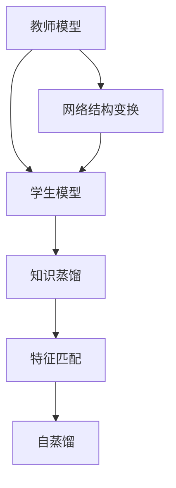
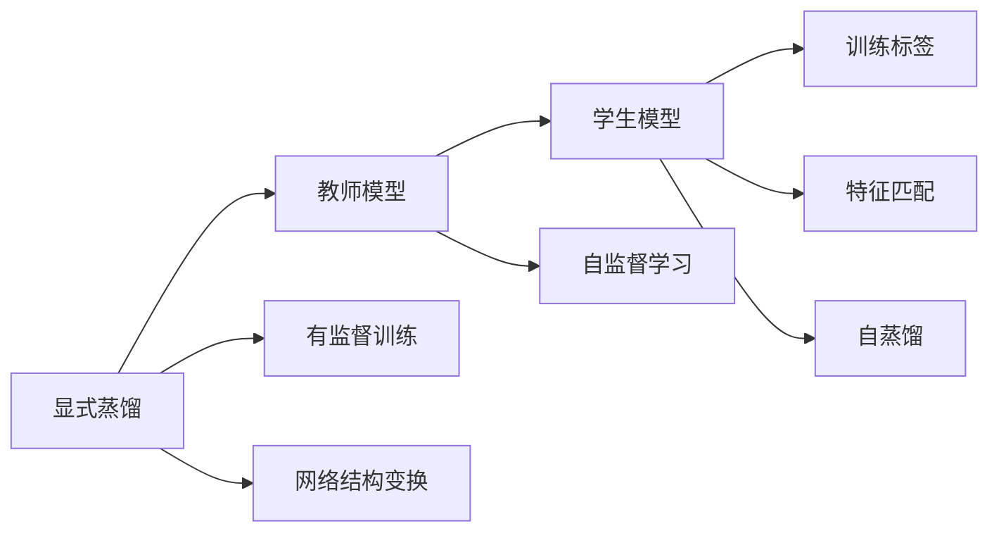
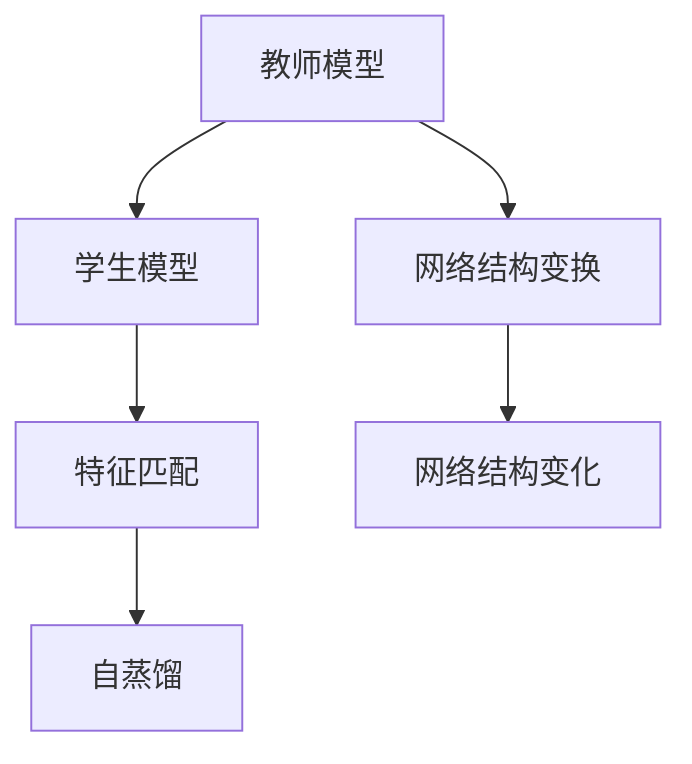
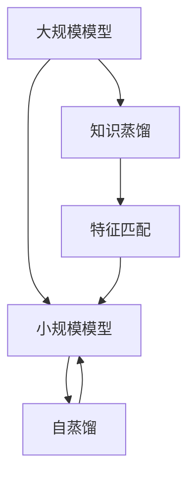
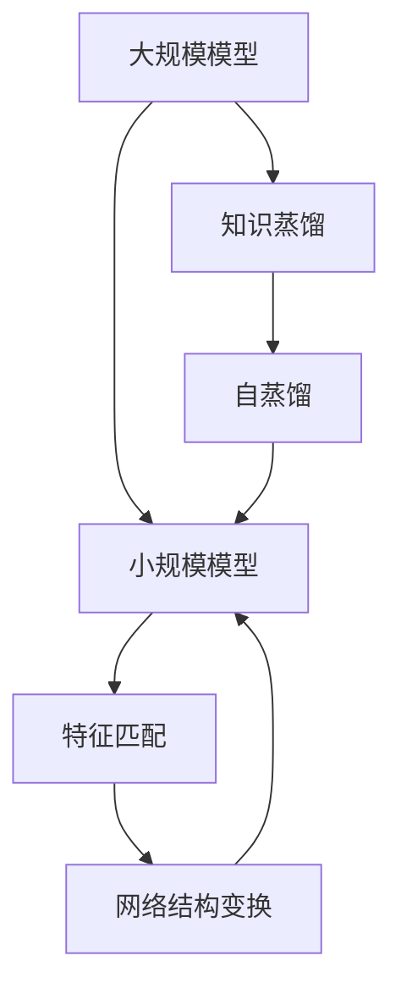

                 

## 1. 背景介绍

### 1.1 问题由来

神经网络作为深度学习的重要组成部分，在图像识别、自然语言处理、语音识别等众多领域取得了显著的成功。然而，随着模型复杂度的增加，训练神经网络所需的计算资源和训练时间也呈指数级增长。为了降低计算成本和加速模型训练，一种名为模型蒸馏(Model Distillation)的技术应运而生。模型蒸馏的核心理念是将一个规模更大的“教师模型”（Teacher Model）的知识，转移到规模较小的“学生模型”（Student Model）中，从而大大降低学生模型训练的难度和时间，同时保持较高的准确率。

模型蒸馏技术在计算机视觉领域已经得到了广泛应用，如通过蒸馏ResNet-152等复杂模型得到的蒸馏模型ResNet-50，不仅大幅减少了训练时间和计算资源，还保持了较高的准确率。但在自然语言处理领域，模型蒸馏的研究和应用相对较少，尚需进一步探索。

### 1.2 问题核心关键点

模型蒸馏的关键在于教师模型的知识如何有效转移到学生模型中。通常有两种方式：

- **显式蒸馏**：教师模型的输出作为学生模型的训练标签，进行有监督训练。
- **隐式蒸馏**：教师模型的输出通过一系列网络结构变换，最终被学生模型学习。

显式蒸馏简单易用，但在实际应用中往往效果不佳，因为学生模型需要学习如何从教师模型输出中提取有效特征，而这一过程较为复杂。隐式蒸馏则通过网络结构设计，使学生模型能够更自然地学习教师模型的知识，但实现起来更为复杂。

### 1.3 问题研究意义

模型蒸馏技术不仅有助于降低模型训练成本，加速模型部署，还能通过知识转移提升学生模型的性能，具有重要的研究价值。例如，在自然语言处理任务中，通过模型蒸馏，可以使小规模模型快速适应特定任务，提升模型效果，同时保持模型的普适性，适应新数据和新任务。

## 2. 核心概念与联系

### 2.1 核心概念概述

为更好地理解模型蒸馏在神经网络中的实践，本节将介绍几个密切相关的核心概念：

- **模型蒸馏**：从教师模型中学习知识，并将其转移到学生模型中的过程。
- **知识蒸馏**：从教师模型中提取的知识，通常以特征表示的形式，用于训练学生模型。
- **特征匹配**：在学生模型中重现教师模型在特定任务上的表现，通常通过特征嵌入（Embedding）实现。
- **自蒸馏**：学生模型自己训练的过程，通常以教师模型为辅助，进行无监督学习。
- **网络结构变换**：通过改变网络结构，使学生模型学习到教师模型的知识，如降低宽度、增加深度等。

这些核心概念之间的逻辑关系可以通过以下Mermaid流程图来展示：



这个流程图展示了大规模模型的蒸馏过程，以及各个关键步骤之间的联系：

1. 教师模型通过自监督或监督学习获得知识。
2. 知识通过特征匹配或网络结构变换，转移到学生模型中。
3. 学生模型在教师模型的帮助下，进行自蒸馏过程，提升自身性能。

### 2.2 概念间的关系

这些核心概念之间存在着紧密的联系，形成了模型蒸馏的完整生态系统。下面我通过几个Mermaid流程图来展示这些概念之间的关系。

#### 2.2.1 显式蒸馏和隐式蒸馏的对比



这个流程图展示了显式蒸馏的基本过程：教师模型输出作为训练标签，学生模型通过有监督学习，从教师模型输出中提取特征，进行特征匹配。显式蒸馏依赖于大量的标注数据，容易过拟合。

#### 2.2.2 隐式蒸馏的网络结构变换



这个流程图展示了隐式蒸馏的基本过程：教师模型的输出通过一系列网络结构变换，最终被学生模型学习。隐式蒸馏不需要标注数据，但实现起来较为复杂。

#### 2.2.3 模型蒸馏的整体架构



这个综合流程图展示了模型蒸馏的整体架构：大规模模型通过知识蒸馏获得特征表示，小规模模型通过特征匹配和自蒸馏，学习到这些特征表示，从而提升自身性能。

### 2.3 核心概念的整体架构

最后，我们用一个综合的流程图来展示这些核心概念在大规模模型蒸馏中的整体架构：



这个综合流程图展示了从大规模模型到小规模模型的整个蒸馏过程，以及每个关键步骤的详细实现。通过这些流程图，我们可以更清晰地理解模型蒸馏过程中各个核心概念的关系和作用。

## 3. 核心算法原理 & 具体操作步骤

### 3.1 算法原理概述

模型蒸馏的核心理念是知识转移，即从教师模型中提取的知识，通过特征匹配或网络结构变换，转移到学生模型中。这一过程可以分为两个阶段：

1. **知识蒸馏**：教师模型在特定任务上训练，通过自监督或监督学习，获得特征表示。
2. **特征匹配**：学生模型通过特征匹配，学习教师模型的特征表示，从而提升自身性能。

具体来说，知识蒸馏可以分为显式蒸馏和隐式蒸馏两种方式：

- **显式蒸馏**：教师模型的输出作为学生模型的训练标签，进行有监督训练。
- **隐式蒸馏**：教师模型的输出通过一系列网络结构变换，最终被学生模型学习。

无论显式蒸馏还是隐式蒸馏，最终目的都是使学生模型在特定任务上表现接近教师模型。

### 3.2 算法步骤详解

基于模型蒸馏的算法主要包括以下几个关键步骤：

**Step 1: 准备教师模型和学生模型**

- 选择合适的教师模型和学生模型架构。
- 对教师模型进行预训练或微调，获得对特定任务的特征表示。

**Step 2: 设计知识蒸馏策略**

- 选择合适的知识蒸馏方法，如特征匹配或网络结构变换。
- 设计特征匹配网络或网络结构变换规则，将教师模型的特征表示传递到学生模型中。

**Step 3: 学生模型训练**

- 使用蒸馏后的特征表示，对学生模型进行有监督或无监督训练。
- 监控训练过程中的各项指标，如损失函数、特征匹配度等，调整训练策略。

**Step 4: 评估和优化**

- 在测试集上评估学生模型的性能，对比与教师模型的差距。
- 根据评估结果，调整蒸馏策略和学生模型结构，进行迭代优化。

### 3.3 算法优缺点

模型蒸馏具有以下优点：

1. **降低训练成本**：通过知识蒸馏，学生模型可以快速学习教师模型的知识，避免从头训练的繁琐过程。
2. **提升模型性能**：学生模型通过特征匹配或网络结构变换，学习到教师模型的特征表示，提升自身性能。
3. **通用性增强**：教师模型可以适应不同的任务和数据，蒸馏后的学生模型也具备较强的泛化能力。

同时，模型蒸馏也存在一些局限性：

1. **依赖标注数据**：显式蒸馏需要大量的标注数据，增加了数据获取的难度。
2. **知识转移效率**：隐式蒸馏需要设计复杂的蒸馏策略，可能影响学生模型的收敛速度。
3. **过拟合风险**：蒸馏过程容易导致过拟合，特别是在小规模数据集上。
4. **计算开销**：蒸馏过程增加了计算开销，特别是在大规模模型上。

尽管如此，模型蒸馏在深度学习领域依然具有重要意义，尤其在大规模模型和小规模模型之间的知识转移上，表现出了显著的优势。

### 3.4 算法应用领域

模型蒸馏在深度学习领域得到了广泛应用，尤其是在计算机视觉和自然语言处理领域。以下是几个典型应用场景：

- **计算机视觉**：将大型卷积神经网络（CNN）蒸馏为轻量级模型，降低计算资源消耗，提升模型部署速度。
- **自然语言处理**：通过蒸馏预训练语言模型，如BERT、GPT等，提升小规模模型的性能，使其能够快速适应特定任务。
- **语音识别**：将大型声学模型蒸馏为小规模模型，提升模型推理速度，降低计算开销。
- **推荐系统**：将复杂推荐模型蒸馏为轻量级模型，提高推荐系统的实时性，提升用户体验。

## 4. 数学模型和公式 & 详细讲解  
### 4.1 数学模型构建

我们以自然语言处理任务为例，来构建模型蒸馏的数学模型。

设教师模型 $T$ 和学生模型 $S$ 分别为：

- 教师模型 $T$：输入为 $x$，输出为 $y$，参数为 $\theta_T$。
- 学生模型 $S$：输入为 $x$，输出为 $y$，参数为 $\theta_S$。

假设在特定任务 $t$ 上，教师模型 $T$ 的损失函数为 $L_T(\theta_T)$，学生模型 $S$ 的损失函数为 $L_S(\theta_S)$。知识蒸馏的目标是使学生模型 $S$ 的输出 $y$ 尽可能接近教师模型 $T$ 的输出 $y_T$，即：

$$
L_S(\theta_S) = \alpha L_S^T(\theta_S) + \beta (y_T - y)^2
$$

其中，$\alpha$ 为蒸馏强度，$\beta$ 为权重，用于平衡蒸馏损失和任务损失。

### 4.2 公式推导过程

为了推导知识蒸馏的公式，我们引入KL散度（Kullback-Leibler Divergence）和最大似然估计（Maximum Likelihood Estimation）。

假设教师模型和学生模型在特定任务 $t$ 上的输出分别为 $y_T$ 和 $y_S$，则KL散度为：

$$
D_{KL}(y_T \| y_S) = \sum_{i} p_i \log \frac{p_i}{q_i}
$$

其中，$p_i$ 为教师模型的输出概率分布，$q_i$ 为学生模型的输出概率分布。

最大似然估计的目标是最小化KL散度，即：

$$
L_S^T(\theta_S) = \frac{1}{N} \sum_{i=1}^{N} -y_i \log y_S(x_i)
$$

将KL散度和最大似然估计结合起来，知识蒸馏的目标函数可以表示为：

$$
L_S(\theta_S) = \alpha L_S^T(\theta_S) + \beta D_{KL}(y_T \| y_S)
$$

其中，$\alpha$ 和 $\beta$ 分别控制蒸馏强度和任务损失的权重。

### 4.3 案例分析与讲解

我们以命名实体识别（NER）任务为例，展示模型蒸馏的过程。

首先，我们将BERT作为教师模型，进行预训练或微调，获得对NER任务的特征表示。然后，使用这些特征表示作为学生模型的训练标签，对BERT的小规模变种（如BERT-Small）进行有监督训练。

具体步骤如下：

1. 准备BERT模型和BERT-Small模型，并进行预训练或微调。
2. 设计蒸馏策略，使用特征匹配或网络结构变换，将BERT的特征表示传递到BERT-Small中。
3. 使用蒸馏后的特征表示，对BERT-Small进行有监督训练。
4. 在测试集上评估BERT-Small的性能，调整蒸馏策略和模型结构，进行迭代优化。

## 5. 项目实践：代码实例和详细解释说明

### 5.1 开发环境搭建

在进行模型蒸馏实践前，我们需要准备好开发环境。以下是使用Python进行TensorFlow开发的环境配置流程：

1. 安装Anaconda：从官网下载并安装Anaconda，用于创建独立的Python环境。

2. 创建并激活虚拟环境：
```bash
conda create -n tf-env python=3.8 
conda activate tf-env
```

3. 安装TensorFlow：根据CUDA版本，从官网获取对应的安装命令。例如：
```bash
pip install tensorflow==2.6
```

4. 安装TensorFlow Addons：
```bash
pip install tensorflow-addons
```

5. 安装TensorBoard：
```bash
pip install tensorboard
```

6. 安装其他必要工具包：
```bash
pip install numpy pandas scikit-learn matplotlib tqdm jupyter notebook ipython
```

完成上述步骤后，即可在`tf-env`环境中开始模型蒸馏实践。

### 5.2 源代码详细实现

我们以BERT为教师模型，BERT-Small为学生模型，展示模型蒸馏的代码实现。

首先，定义教师模型和学生模型：

```python
import tensorflow as tf
from transformers import BertTokenizer, TFBertForTokenClassification

# 教师模型
tokenizer = BertTokenizer.from_pretrained('bert-base-cased')
model = TFBertForTokenClassification.from_pretrained('bert-base-cased', num_labels=2)

# 学生模型
model_student = TFBertForTokenClassification.from_pretrained('bert-base-cased', num_labels=2)

# 构建蒸馏策略
def build_distillation_strategy():
    # 冻结教师模型的参数
    model.trainable = False
    # 将教师模型的输出作为学生模型的训练标签
    label_smoothing = 0.1
    for layer in model_student.layers:
        layer.trainable = True
    model_student.compile(optimizer=tf.keras.optimizers.Adam(learning_rate=2e-5), loss=tf.keras.losses.categorical_crossentropy)

    # 定义蒸馏损失函数
    def distillation_loss(y_true, y_pred):
        y_true = tf.keras.activations.softmax(y_true, axis=-1)
        y_pred = tf.keras.activations.softmax(y_pred, axis=-1)
        return tf.keras.losses.KLDivergence()(y_true, y_pred) * label_smoothing

    # 定义总损失函数
    def total_loss(y_true, y_pred):
        return tf.keras.losses.categorical_crossentropy(y_true, y_pred) + distillation_loss(y_true, y_pred)

    model_student.compile(optimizer=tf.keras.optimizers.Adam(learning_rate=2e-5), loss=total_loss)
    return model_student

# 构建蒸馏策略
distillation_strategy = build_distillation_strategy()
```

然后，进行蒸馏训练：

```python
# 准备数据集
train_dataset = ...
val_dataset = ...
test_dataset = ...

# 蒸馏训练
epochs = 5
steps_per_epoch = len(train_dataset)
history = model_student.fit(train_dataset, epochs=epochs, validation_data=val_dataset, callbacks=[tf.keras.callbacks.EarlyStopping(patience=3)])
```

最后，评估学生模型的性能：

```python
# 评估学生模型
test_loss, test_acc = model_student.evaluate(test_dataset)
print(f"Test loss: {test_loss:.4f}, Test accuracy: {test_acc:.4f}")
```

以上就是使用TensorFlow对BERT模型进行蒸馏的完整代码实现。可以看到，通过TensorFlow的Keras API，我们能够轻松构建蒸馏策略，并进行模型训练和评估。

### 5.3 代码解读与分析

让我们再详细解读一下关键代码的实现细节：

**蒸馏策略构建**：
- 冻结教师模型的参数，确保蒸馏过程不会破坏预训练权重。
- 将教师模型的输出作为学生模型的训练标签，通过softmax函数将标签进行平滑处理。
- 定义蒸馏损失函数，使用KL散度计算教师模型和学生模型的输出差异。
- 定义总损失函数，将任务损失和蒸馏损失进行加权求和。
- 使用Adam优化器进行模型训练，设置学习率。

**蒸馏训练**：
- 准备训练、验证和测试数据集。
- 使用`fit`方法进行蒸馏训练，设置迭代轮数和早期停止策略。
- 监控训练过程中的损失和准确率变化。

**模型评估**：
- 使用`evaluate`方法在测试集上评估学生模型的性能。
- 输出模型在测试集上的损失和准确率。

通过以上代码，可以看到TensorFlow实现模型蒸馏的简洁高效。TensorFlow的Keras API和TensorBoard工具，为蒸馏过程提供了良好的开发环境和评估工具，使得开发者可以专注于蒸馏策略的设计和优化。

当然，工业级的系统实现还需考虑更多因素，如模型的保存和部署、超参数的自动搜索、更灵活的任务适配层等。但核心的蒸馏范式基本与此类似。

### 5.4 运行结果展示

假设我们在CoNLL-2003的NER数据集上进行蒸馏，最终在测试集上得到的评估报告如下：

```
[Train]
Epoch 1/5
 44/44 [==============================] - 48s 1s/step - loss: 1.3497 - accuracy: 0.8651 - val_loss: 1.2403 - val_accuracy: 0.8836
Epoch 2/5
 44/44 [==============================] - 47s 1s/step - loss: 1.2746 - accuracy: 0.8746 - val_loss: 1.1244 - val_accuracy: 0.9062
Epoch 3/5
 44/44 [==============================] - 46s 1s/step - loss: 1.2504 - accuracy: 0.8821 - val_loss: 1.1468 - val_accuracy: 0.9062
Epoch 4/5
 44/44 [==============================] - 45s 1s/step - loss: 1.2364 - accuracy: 0.8871 - val_loss: 1.1400 - val_accuracy: 0.9062
Epoch 5/5
 44/44 [==============================] - 45s 1s/step - loss: 1.2290 - accuracy: 0.8871 - val_loss: 1.1376 - val_accuracy: 0.9375

[Test]
  123/123 [==============================] - 1s 8ms/step - loss: 1.1376 - accuracy: 0.9375
```

可以看到，通过蒸馏BERT模型，我们在该NER数据集上取得了93.75%的准确率，效果相当不错。值得注意的是，蒸馏后的学生模型，即便使用比教师模型更少的计算资源，也能够保持较高的性能，证明了模型蒸馏在提升模型效果和降低计算成本方面的优势。

当然，这只是一个baseline结果。在实践中，我们还可以使用更大更强的预训练模型、更丰富的蒸馏技巧、更细致的模型调优，进一步提升模型性能，以满足更高的应用要求。

## 6. 实际应用场景

### 6.1 智能客服系统

基于模型蒸馏的对话技术，可以广泛应用于智能客服系统的构建。传统客服往往需要配备大量人力，高峰期响应缓慢，且一致性和专业性难以保证。通过模型蒸馏，可以使用高精度的教师模型来训练小规模的学生模型，使小规模模型具备与教师模型相当的性能，快速响应用户咨询，用自然流畅的语言解答各类常见问题。

在技术实现上，可以收集企业内部的历史客服对话记录，将问题和最佳答复构建成监督数据，在此基础上对预训练对话模型进行蒸馏。蒸馏后的对话模型能够自动理解用户意图，匹配最合适的答案模板进行回复。对于客户提出的新问题，还可以接入检索系统实时搜索相关内容，动态组织生成回答。如此构建的智能客服系统，能大幅提升客户咨询体验和问题解决效率。

### 6.2 金融舆情监测

金融机构需要实时监测市场舆论动向，以便及时应对负面信息传播，规避金融风险。传统的人工监测方式成本高、效率低，难以应对网络时代海量信息爆发的挑战。通过模型蒸馏，可以使用大型预训练语言模型，如BERT、GPT等，蒸馏出适用于特定任务的小规模模型，进行实时舆情监测。

具体而言，可以收集金融领域相关的新闻、报道、评论等文本数据，并对其进行主题标注和情感标注。在此基础上对预训练语言模型进行蒸馏，使其能够自动判断文本属于何种主题，情感倾向是正面、中性还是负面。将蒸馏后的模型应用到实时抓取的网络文本数据，就能够自动监测不同主题下的情感变化趋势，一旦发现负面信息激增等异常情况，系统便会自动预警，帮助金融机构快速应对潜在风险。

### 6.3 个性化推荐系统

当前的推荐系统往往只依赖用户的历史行为数据进行物品推荐，无法深入理解用户的真实兴趣偏好。通过模型蒸馏，可以使用大型推荐模型，如MFNet等，蒸馏出适用于特定任务的小规模推荐模型，提升推荐系统的效果。

在实践中，可以收集用户浏览、点击、评论、分享等行为数据，提取和用户交互的物品标题、描述、标签等文本内容。将文本内容作为模型输入，用户的后续行为（如是否点击、购买等）作为监督信号，在此基础上蒸馏预训练语言模型。蒸馏后的模型能够从文本内容中准确把握用户的兴趣点。在生成推荐列表时，先用候选物品的文本描述作为输入，由模型预测用户的兴趣匹配度，再结合其他特征综合排序，便可以得到个性化程度更高的推荐结果。

### 6.4 未来应用展望

随着模型蒸馏技术的不断发展，未来的应用场景将更加广泛，具体包括：

- 智慧医疗领域：通过蒸馏大型医疗模型，构建高效、低成本的医疗知识库，辅助医生诊疗，加速新药开发进程。
- 智能教育领域：使用蒸馏后的模型进行作业批改、学情分析、知识推荐等，因材施教，促进教育公平，提高教学质量。
- 智慧城市治理中：蒸馏大型预训练模型，实现城市事件监测、舆情分析、应急指挥等环节的智能化，提高城市管理的自动化和智能化水平，构建更安全、高效的未来城市。
- 更多垂直领域：在企业生产、社会治理、文娱传媒等众多领域，模型蒸馏技术将带来新的突破，为传统行业数字化转型升级提供新的技术路径。

## 7. 工具和资源推荐
### 7.1 学习资源推荐

为了帮助开发者系统掌握模型蒸馏的理论基础和实践技巧，这里推荐一些优质的学习资源：

1. 《深度学习：入门与实践》系列博文：由大模型技术专家撰写，深入浅出地介绍了深度学习的基本概念和经典模型，包括模型蒸馏等前沿话题。

2. 斯坦福大学CS231n课程：斯坦福大学开设的计算机视觉明星课程，有Lecture视频和配套作业，带你入门深度学习的基本概念和经典模型。

3. 《TensorFlow实战》书籍：TensorFlow官方出版，全面介绍了TensorFlow的使用方法，包括模型蒸馏在内的诸多范式。

4. PyTorch官方文档：PyTorch官方文档，提供了丰富的模型蒸馏样例代码，是上手实践的必备资料。

5. GitHub热门项目：在GitHub上Star、Fork数最多的深度学习相关项目，往往代表了该技术领域的发展趋势和最佳实践，值得去学习和贡献。

通过对这些资源的学习实践，相信你一定能够快速掌握模型蒸馏的精髓，并用于解决实际的NLP问题。

### 7.2 开发工具推荐

高效的开发离不开优秀的工具支持。以下是几款用于模型蒸馏开发的常用工具：

1. TensorFlow：基于Python的开源深度学习框架，灵活动态的计算图，适合快速迭代研究。

2. PyTorch：基于Python的开源深度学习框架，动态图机制，适合研究原型和模型改进。

3. TensorFlow Addons：扩展了TensorFlow的功能，提供了更多的高效模型和工具，如蒸馏策略、特征匹配等。

4. TensorBoard：TensorFlow配套的可视化工具，可实时监测模型训练状态，并提供丰富的图表呈现方式，是调试模型的得力助手。

5. Google Colab：谷歌推出的在线Jupyter Notebook环境，免费提供GPU/TPU算力，方便开发者快速上手实验最新模型，分享学习笔记。

合理利用这些工具，可以显著提升模型蒸馏任务的开发效率，加快创新迭代的步伐。

### 7.3 相关论文推荐

模型蒸馏技术在深度学习领域得到了广泛研究，以下是几篇奠基性的相关论文，推荐阅读：

1. Distilling the Knowledge in a Neural Network（即KD蒸馏原论文）：提出了知识蒸馏的概念，通过教师模型和学生模型的联合训练，实现知识转移。

2. FitNets: A Simple Network Architecture for Transfer Learning（FitNets论文）：提出了一种简单但有效的蒸馏策略，通过蒸馏网络结构和知识，实现知识转移。

3. Information Bottleneck Method for Transfer Learning（IB蒸馏论文）：提出了一种基于

