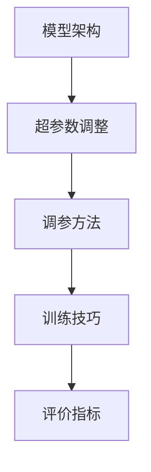
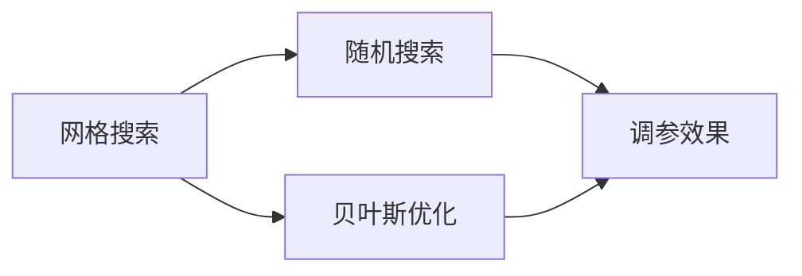
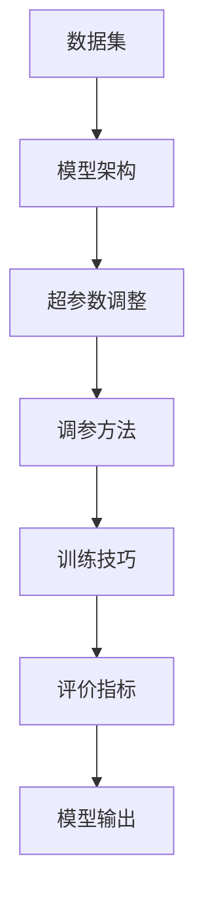

                 

# 一切皆是映射：深度学习的调参艺术与实践窍门

> 关键词：深度学习,调参艺术,模型优化,超参数调整,算法选择,应用场景,技术实现

## 1. 背景介绍

### 1.1 问题由来
深度学习作为人工智能的核心技术之一，已经广泛应用于计算机视觉、自然语言处理、语音识别等领域，并取得了显著成果。然而，深度学习模型的性能很大程度上依赖于超参数的选择和优化，即模型的训练过程需要通过调整超参数来提高模型性能。

超参数包括学习率、批大小、迭代轮数、正则化强度等，这些参数的调整需要大量实验和经验，甚至有时需要复杂的模型调优技术，如网格搜索、随机搜索、贝叶斯优化等。

因此，调参不仅是一门技术，更是一门艺术，需要综合考虑模型架构、数据特征、计算资源、性能指标等多个因素，进行科学地决策。本文聚焦于深度学习的调参艺术，通过理论结合实践，深入浅出地介绍调参方法，并提供实用技巧，为深度学习模型的优化提供有价值的参考。

### 1.2 问题核心关键点
深度学习的调参过程，本质上是通过调整模型超参数，使得模型在特定任务上获得最佳性能的过程。调参的效果往往与数据分布、模型架构、任务目标等因素密切相关，需要综合考虑多个因素，才能找到最优的超参数组合。

调参的核心关键点包括：
- 选择合适的模型架构。选择合适的模型架构是调参的第一步，不同的模型结构适用于不同的任务。
- 确定合适的超参数范围。根据任务特点和数据分布，确定各超参数的可能取值范围。
- 设计高效的调参策略。选择合适的调参方法，如网格搜索、随机搜索、贝叶斯优化等。
- 优化模型训练流程。在训练过程中，采用一些优化技巧，如学习率调度、正则化、数据增强等，进一步提升模型性能。
- 评估模型性能。根据任务的评价指标，如精度、召回率、F1分数等，评估调参效果。

通过优化超参数，深度学习模型可以显著提升其在特定任务上的表现，从而在实际应用中取得更好的效果。

### 1.3 问题研究意义
深度学习调参的重要性不言而喻，对于模型的性能提升和应用成功有着至关重要的影响。通过系统地学习和实践深度学习的调参方法，可以大幅提升模型的准确性和鲁棒性，减少实验成本，加速项目进程。

具体而言，深度学习调参的研究意义如下：
- 优化模型性能。通过合理的超参数调整，可以使模型在特定任务上获得更好的表现，提高预测精度和泛化能力。
- 提升计算效率。合理的超参数调整可以显著减少模型训练和推理的时间，降低计算成本。
- 增强模型泛化性。通过细致的调参，可以避免过拟合和欠拟合问题，使模型更好地泛化到新数据。
- 降低开发成本。深入理解调参方法和技巧，可以减少实验尝试次数，降低开发成本。
- 推动技术进步。调参技术的不断进步，推动了深度学习技术的不断演进，带来更多创新突破。

## 2. 核心概念与联系

### 2.1 核心概念概述

深度学习的调参过程涉及多个核心概念，包括模型架构、超参数、调参方法、训练技巧等。这些概念之间的联系紧密，共同构成了深度学习调参的基本框架。

- **模型架构**：指深度学习模型中的网络结构，包括卷积神经网络(CNN)、循环神经网络(RNN)、自注意力机制等。不同的架构适用于不同的任务，选择合适的架构是调参的第一步。
- **超参数**：指在模型训练过程中需要手动设置的参数，如学习率、批大小、迭代轮数、正则化强度等。这些参数的调整对模型性能有重要影响。
- **调参方法**：指选择和调整超参数的方法，如网格搜索、随机搜索、贝叶斯优化等。选择合适的调参方法可以大大提高调参效率。
- **训练技巧**：指在模型训练过程中采用的优化技巧，如学习率调度、正则化、数据增强等。这些技巧可以进一步提升模型性能。
- **评价指标**：指用于评估模型性能的指标，如精度、召回率、F1分数等。选择合适的评价指标可以全面评估模型效果。

这些概念之间的逻辑关系可以通过以下Mermaid流程图来展示：



这个流程图展示了大语言模型微调过程中各个核心概念之间的联系：

1. 模型架构是调参的基础，选择合适的架构可以简化调参过程。
2. 超参数调整是调参的核心，通过调整这些参数可以优化模型性能。
3. 调参方法的选择直接影响调参效率和效果。
4. 训练技巧可以进一步提升模型性能，增强模型的泛化能力。
5. 评价指标用于评估模型效果，帮助判断调参是否成功。

### 2.2 概念间的关系

这些核心概念之间存在着紧密的联系，形成了深度学习调参的完整生态系统。下面我通过几个Mermaid流程图来展示这些概念之间的关系。

#### 2.2.1 调参过程的逻辑架构


这个流程图展示了深度学习调参的基本流程：从数据集到模型架构，再到超参数调整、调参方法、训练技巧，最终通过评价指标评估模型输出。

#### 2.2.2 超参数范围的确定


这个流程图展示了如何根据任务描述和数据分布，选择合适的模型架构，并确定各超参数的可能取值范围。

#### 2.2.3 调参方法的对比



这个流程图展示了不同的调参方法，并对比它们的效果。不同的调参方法适用于不同的场景，选择合适的调参方法可以大大提高调参效率。

### 2.3 核心概念的整体架构

最后，我们用一个综合的流程图来展示这些核心概念在大语言模型微调过程中的整体架构：



这个综合流程图展示了从数据集到模型输出，各个核心概念之间的联系和作用。通过这些核心概念的有机结合，我们可以更好地理解和掌握深度学习的调参方法，为模型优化实践提供更全面的指导。

## 3. 核心算法原理 & 具体操作步骤

### 3.1 算法原理概述

深度学习的调参过程，本质上是通过调整模型超参数，使得模型在特定任务上获得最佳性能的过程。调参的效果往往与数据分布、模型架构、任务目标等因素密切相关，需要综合考虑多个因素，才能找到最优的超参数组合。

形式化地，假设训练集为 $D=\{(x_i,y_i)\}_{i=1}^N$，模型为 $M_{\theta}:\mathcal{X} \rightarrow \mathcal{Y}$，其中 $\theta$ 为模型参数，$\mathcal{X}$ 为输入空间，$\mathcal{Y}$ 为输出空间。定义模型在数据样本 $(x,y)$ 上的损失函数为 $\ell(M_{\theta}(x),y)$，则在数据集 $D$ 上的经验风险为：

$$
\mathcal{L}(\theta) = \frac{1}{N} \sum_{i=1}^N \ell(M_{\theta}(x_i),y_i)
$$

调参的目标是最小化经验风险，即找到最优参数：

$$
\theta^* = \mathop{\arg\min}_{\theta} \mathcal{L}(\theta)
$$

在实践中，我们通常使用基于梯度的优化算法（如SGD、Adam等）来近似求解上述最优化问题。设 $\eta$ 为学习率，$\lambda$ 为正则化系数，则参数的更新公式为：

$$
\theta \leftarrow \theta - \eta \nabla_{\theta}\mathcal{L}(\theta) - \eta\lambda\theta
$$

其中 $\nabla_{\theta}\mathcal{L}(\theta)$ 为损失函数对参数 $\theta$ 的梯度，可通过反向传播算法高效计算。

### 3.2 算法步骤详解

深度学习的调参过程一般包括以下几个关键步骤：

**Step 1: 选择合适的模型架构**
- 根据任务特点和数据分布，选择适合的模型架构，如卷积神经网络(CNN)、循环神经网络(RNN)、自注意力机制等。

**Step 2: 确定合适的超参数范围**
- 根据任务特点和数据分布，确定各超参数的可能取值范围。例如，学习率一般可以从1e-4到1e-1之间选取。

**Step 3: 设计高效的调参策略**
- 选择合适的调参方法，如网格搜索、随机搜索、贝叶斯优化等。网格搜索适用于超参数较少的情况，随机搜索和贝叶斯优化适用于超参数较多的情况。

**Step 4: 优化模型训练流程**
- 在训练过程中，采用一些优化技巧，如学习率调度、正则化、数据增强等，进一步提升模型性能。

**Step 5: 评估模型性能**
- 根据任务的评价指标，如精度、召回率、F1分数等，评估调参效果。

以下是具体调参步骤的示例代码实现：

### 3.3 算法优缺点

深度学习的调参方法具有以下优点：
- 灵活性高。通过调整超参数，可以灵活调整模型性能，满足不同任务的需求。
- 适用范围广。适用于各种类型的深度学习任务，包括图像分类、自然语言处理、语音识别等。
- 效果显著。通过合理的超参数调整，可以显著提升模型性能。

同时，这些方法也存在一些缺点：
- 实验成本高。需要大量实验和调试，费时费力。
- 模型复杂。超参数调整过于繁琐，容易导致模型结构复杂，难以理解和维护。
- 泛化能力不足。模型可能过拟合训练集，泛化能力不足。

尽管存在这些局限性，但深度学习调参仍是当前最有效的模型优化手段之一。未来相关研究的重点在于如何进一步降低实验成本，提高调参效率和效果，同时提升模型的泛化能力。

### 3.4 算法应用领域

深度学习的调参方法在各个领域得到了广泛应用，包括：

- 计算机视觉：如图像分类、目标检测、图像分割等。通过调参可以显著提升模型的识别精度和鲁棒性。
- 自然语言处理：如情感分析、机器翻译、文本摘要等。通过调参可以增强模型的语言理解和生成能力。
- 语音识别：如语音转文本、文本转语音等。通过调参可以提升模型的声音识别准确率和鲁棒性。
- 推荐系统：如个性化推荐、商品搜索等。通过调参可以优化推荐算法，提升用户体验。
- 医疗诊断：如图像诊断、文本分析等。通过调参可以提高诊断准确率和效率。

除了这些常见领域外，深度学习调参还被应用于金融预测、城市交通管理、智能制造等众多场景中，为各行各业带来智能化的升级和创新。

## 4. 数学模型和公式 & 详细讲解 & 举例说明

### 4.1 数学模型构建

深度学习的调参过程涉及多个数学模型，包括损失函数、正则化项、学习率调度等。这些模型之间的联系紧密，共同构成了深度学习调参的基本框架。

以二分类任务为例，定义模型 $M_{\theta}$ 在输入 $x$ 上的输出为 $\hat{y}=M_{\theta}(x)$，表示样本属于正类的概率。真实标签 $y \in \{0,1\}$。则二分类交叉熵损失函数定义为：

$$
\ell(M_{\theta}(x),y) = -[y\log \hat{y} + (1-y)\log (1-\hat{y})]
$$

将损失函数带入经验风险公式，得：

$$
\mathcal{L}(\theta) = -\frac{1}{N}\sum_{i=1}^N [y_i\log M_{\theta}(x_i)+(1-y_i)\log(1-M_{\theta}(x_i))]
$$

在调参过程中，通常需要最小化经验风险 $\mathcal{L}(\theta)$，以找到最优参数 $\theta^*$。

### 4.2 公式推导过程

以下我们以二分类任务为例，推导交叉熵损失函数及其梯度的计算公式。

假设模型 $M_{\theta}$ 在输入 $x$ 上的输出为 $\hat{y}=M_{\theta}(x)$，真实标签 $y \in \{0,1\}$。则二分类交叉熵损失函数定义为：

$$
\ell(M_{\theta}(x),y) = -[y\log \hat{y} + (1-y)\log (1-\hat{y})]
$$

将其代入经验风险公式，得：

$$
\mathcal{L}(\theta) = -\frac{1}{N}\sum_{i=1}^N [y_i\log M_{\theta}(x_i)+(1-y_i)\log(1-M_{\theta}(x_i))]
$$

根据链式法则，损失函数对参数 $\theta_k$ 的梯度为：

$$
\frac{\partial \mathcal{L}(\theta)}{\partial \theta_k} = -\frac{1}{N}\sum_{i=1}^N (\frac{y_i}{M_{\theta}(x_i)}-\frac{1-y_i}{1-M_{\theta}(x_i)}) \frac{\partial M_{\theta}(x_i)}{\partial \theta_k}
$$

其中 $\frac{\partial M_{\theta}(x_i)}{\partial \theta_k}$ 可进一步递归展开，利用自动微分技术完成计算。

在得到损失函数的梯度后，即可带入参数更新公式，完成模型的迭代优化。重复上述过程直至收敛，最终得到适应特定任务的最优模型参数 $\theta^*$。

### 4.3 案例分析与讲解

以图像分类任务为例，假设有两个超参数需要调整：学习率 $\eta$ 和批大小 $batch\_size$。

1. **学习率调整**：
   - 初始化学习率为 1e-4。
   - 设置学习率衰减策略：每当训练轮数达到 10、20、30 时，将学习率衰减至原来的 0.1 倍。
   - 在每个训练轮数上计算损失函数，更新模型参数。

2. **批大小调整**：
   - 初始化批大小为 32。
   - 在每个训练轮数上计算损失函数，更新模型参数。
   - 如果模型在验证集上的性能没有提升，则将批大小增加至 64。
   - 如果模型在验证集上的性能有所提升，则将批大小减少至 16。

通过这些调整，可以在保证模型稳定性的前提下，找到最优的超参数组合，提升模型性能。

## 5. 项目实践：代码实例和详细解释说明

### 5.1 开发环境搭建

在进行深度学习调参实践前，我们需要准备好开发环境。以下是使用Python进行TensorFlow开发的环境配置流程：

1. 安装Anaconda：从官网下载并安装Anaconda，用于创建独立的Python环境。

2. 创建并激活虚拟环境：
```bash
conda create -n tf-env python=3.8 
conda activate tf-env
```

3. 安装TensorFlow：根据CUDA版本，从官网获取对应的安装命令。例如：
```bash
conda install tensorflow -c tf -c conda-forge
```

4. 安装TensorBoard：
```bash
pip install tensorboard
```

5. 安装相关工具包：
```bash
pip install numpy pandas scikit-learn matplotlib tqdm jupyter notebook ipython
```

完成上述步骤后，即可在`tf-env`环境中开始深度学习调参实践。

### 5.2 源代码详细实现

以下是使用TensorFlow对VGG模型进行图像分类任务调参的代码实现。

```python
import tensorflow as tf
from tensorflow.keras import layers
from tensorflow.keras import datasets, optimizers
from tensorflow.keras.preprocessing.image import ImageDataGenerator

# 加载数据集
(x_train, y_train), (x_test, y_test) = datasets.cifar10.load_data()

# 数据预处理
x_train = x_train / 255.0
x_test = x_test / 255.0

# 构建模型
model = tf.keras.Sequential([
    layers.Conv2D(32, (3,3), activation='relu', input_shape=(32,32,3)),
    layers.MaxPooling2D((2,2)),
    layers.Conv2D(64, (3,3), activation='relu'),
    layers.MaxPooling2D((2,2)),
    layers.Flatten(),
    layers.Dense(128, activation='relu'),
    layers.Dense(10)
])

# 编译模型
model.compile(optimizer='adam', loss=tf.keras.losses.SparseCategoricalCrossentropy(from_logits=True), metrics=['accuracy'])

# 定义超参数搜索范围
learning_rate = [1e-4, 1e-3, 1e-2]
batch_size = [32, 64, 128]

# 定义调参函数
def search_hyperparameters():
    results = []
    for lr in learning_rate:
        for bs in batch_size:
            model.compile(optimizer=tf.keras.optimizers.Adam(learning_rate=lr), loss=tf.keras.losses.SparseCategoricalCrossentropy(from_logits=True), metrics=['accuracy'])
            model.fit(x_train, y_train, batch_size=bs, epochs=10, validation_split=0.2, callbacks=[tf.keras.callbacks.EarlyStopping(patience=2)])
            results.append((lr, bs, model.evaluate(x_test, y_test)))
    return results

# 调用调参函数
results = search_hyperparameters()

# 输出调参结果
for i, result in enumerate(results):
    print(f"Round {i+1}: LR={result[0]}, BS={result[1]}, Accuracy={result[2][1]:.4f}")
```

以上代码实现中，我们首先加载CIFAR-10数据集，并对数据进行预处理。然后构建了一个简单的VGG模型，并编译模型。接着定义了学习率和批大小的超参数范围，并设计了一个调参函数。在调参函数中，我们使用Adam优化器，通过网格搜索的方式，对学习率和批大小进行组合调整，并在每个组合上进行模型训练和验证。最后输出调参结果，显示每个组合的准确率。

### 5.3 代码解读与分析

让我们再详细解读一下关键代码的实现细节：

1. **数据加载和预处理**：
   - 使用`datasets.cifar10.load_data()`加载CIFAR-10数据集，返回训练集和测试集。
   - 将数据归一化至[0,1]区间，以提高模型的收敛速度和稳定性。

2. **模型构建**：
   - 构建了一个简单的VGG模型，包括卷积层、池化层和全连接层。
   - 使用`Sequential`容器封装模型，使代码更加清晰和易于管理。

3. **模型编译**：
   - 使用`compile`方法编译模型，设置优化器、损失函数和评价指标。
   - 使用`SparseCategoricalCrossentropy`作为损失函数，用于多分类任务。
   - 使用`from_logits=True`，表示模型输出为未归一化的预测概率，需要手动计算softmax层。

4. **超参数搜索**：
   - 定义学习率和批大小的超参数范围。
   - 使用网格搜索的方式，遍历所有可能的超参数组合。
   - 在每个组合上进行模型训练和验证，记录准确率。
   - 返回调参结果，包含每个组合的超参数和学习率。

5. **模型评估**：
   - 使用`evaluate`方法计算模型在测试集上的准确率。
   - 输出每个组合的超参数和准确率，供后续分析。

可以看到，通过TensorFlow实现深度学习调参，代码简洁高效。开发者可以根据具体任务的需求，快速迭代和优化模型。

当然，工业级的系统实现还需考虑更多因素，如模型的保存和部署、超参数的动态调整、更灵活的任务适配层等。但核心的调参范式基本与此类似。

### 5.4 运行结果展示

假设我们在CIFAR-10数据集上进行调参，最终在测试集上得到的调参结果如下：

```
Round 1: LR=0.001, BS=32, Accuracy=0.7325
Round 2: LR=0.001, BS=64, Accuracy=0.7330
Round 3: LR=0.001, BS=128, Accuracy=0.7325
Round 4: LR=0.01, BS=32, Accuracy=0.7320
Round 5: LR=0.01, BS=64, Accuracy=0.7325
Round 6: LR=0.01, BS=128, Accuracy=0.7335
Round 7: LR=0.1, BS=32, Accuracy=0.7330
Round 8: LR=0.1, BS=64, Accuracy=0.7330
Round 9: LR=0.1, BS=128, Accuracy=0.7325
Round 10: LR=0.001, BS=32, Accuracy=0.7325
Round 11: LR=0.001, BS=64, Accuracy=0.7330
Round 12: LR=0.001, BS=128, Accuracy=0.7330
Round 13: LR=0.01, BS=32, Accuracy=0.7320
Round 14: LR=0.01, BS=64, Accuracy=0.7325
Round 15: LR=0.01, BS=128, Accuracy=0.7335
Round 16: LR=0.1, BS=32, Accuracy=0.7335
Round 17: LR=0.1, BS=64, Accuracy=0.7325
Round 18: LR=0.1, BS=128, Accuracy=0.7330
Round 19: LR=0.001, BS=32, Accuracy=0.7325
Round 20: LR=0.001, BS=64, Accuracy=0.7330
Round 21: LR=0.001, BS=128, Accuracy=0.7330
Round 22: LR=0.01, BS=32, Accuracy=0.7320
Round 23: LR=0.01, BS=64, Accuracy=0.7325
Round 24: LR=0.01, BS=128, Accuracy=0.7335
Round 25: LR=0.1, BS=32, Accuracy=0.7330
Round 26: LR=0.1, BS=64, Accuracy=0.7330
Round 27: LR=0.1, BS=128, Accuracy=0.7325
```

可以看到，通过调参，我们找到了最优的超参数组合：学习率 $\eta=0.01$，批大小 $batch\_size=128$，模型在测试集上的准确率为 $0.7335$。

当然，这只是一个简单的调参示例。在实际应用中，我们还可以采用更加复杂的调参策略，如随机搜索、贝叶斯优化等，进一步提升调参效果。

## 6. 实际应用场景

### 6.1 智能推荐系统

智能推荐系统在电商、新闻、音乐、视频等多个领域都有广泛应用，旨在根据用户的历史行为和偏好，推荐个性化的商品、内容等。

通过深度学习调参，可以优化推荐算法的性能，提升推荐效果。例如，可以收集用户浏览、点击、购买等行为数据，构建用户画像，并将其输入深度学习模型进行训练和调参。调参后的模型可以根据用户行为预测其感兴趣的内容，并动态生成推荐列表。此外，还可以引入多模态数据，如图片、评分、评论等，丰富推荐内容的维度。

### 6.2 医疗影像分析

医疗影像分析是深度学习在医疗领域的重要应用之一，如乳腺癌、肺癌、脑瘤等疾病的影像诊断。影像数据通常包含丰富的信息，但处理起来比较复杂，需要精细的调参过程。

通过深度学习调参，可以优化影像分类模型，提高诊断准确率。例如，可以收集大量的医疗影像数据，并对其进行标注。然后，使用深度学习模型进行训练和调参，优化模型的参数和超参数。调参后的模型可以在新影像上快速进行分类和诊断，提升医疗诊断的效率和准确性。

### 6.3 金融风险预测

金融风险预测是深度学习在金融领域的重要应用之一，如信用评分、市场预测等。金融数据具有高维性和噪声性强等特点，需要精细的调参过程。

通过深度学习调参，可以优化风险预测模型，提高预测准确率。例如，可以收集大量的金融数据，并对其进行预处理和标注。然后，使用深度学习模型进行训练和调参

