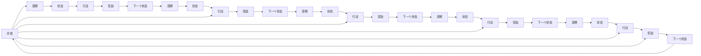
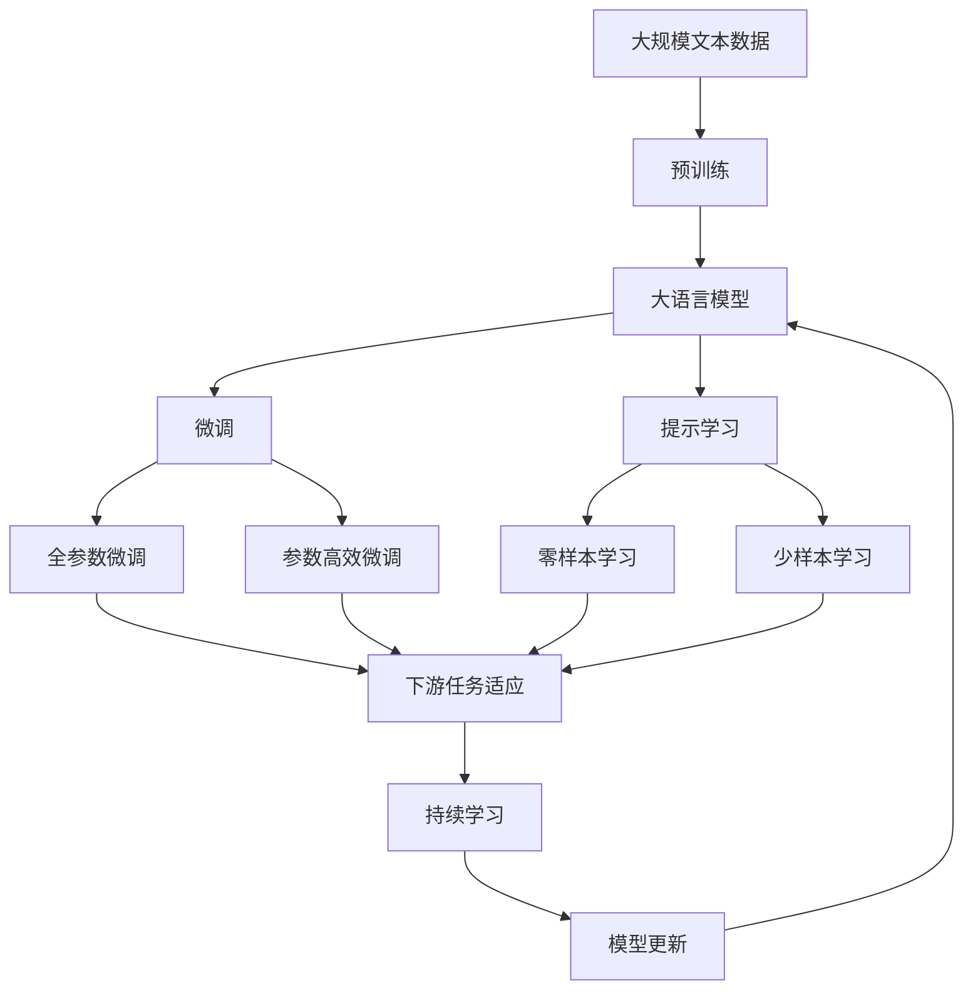

                 

# 一切皆是映射：深度强化学习DQN在虚拟现实中的同步应用

> 关键词：深度强化学习, DQN, 虚拟现实, 同步应用, 决策优化, 行为模拟

## 1. 背景介绍

### 1.1 问题由来
深度强化学习(Depth Reinforcement Learning, DRL)，特别是基于深度神经网络的Q-learning算法（Deep Q-Network, DQN），因其在自适应和自我学习方面的显著优势，被广泛应用于智能游戏、机器人控制、自动驾驶等领域。然而，在虚拟现实（Virtual Reality, VR）领域，DQN的应用仍有待拓展，尤其是在同步应用方面。

### 1.2 问题核心关键点
同步应用是指在实时交互中，强化学习算法能够实时响应环境变化，并根据当前状态和环境信息，即时调整策略以最大化长期回报。这种能力在虚拟现实应用中尤为重要，因为它要求用户与虚拟环境中的智能体进行实时交互，智能体的决策应当能够及时适应用户的动作和反应。

### 1.3 问题研究意义
DQN在虚拟现实中的同步应用研究，对于提升虚拟现实交互的自然性和智能化水平，实现高度沉浸式的体验，具有重要意义。通过实时调整决策策略，DQN可以帮助虚拟角色在用户交互过程中提供更加真实、动态的反应，从而增强用户沉浸感和参与度。此外，DQN的应用还能在虚拟训练场景中，提升用户对环境的适应能力和应急反应能力。

## 2. 核心概念与联系

### 2.1 核心概念概述

为更好地理解DQN在虚拟现实中的同步应用，本节将介绍几个密切相关的核心概念：

- **深度强化学习**：结合深度神经网络和强化学习，通过在模拟或真实环境中不断学习，优化策略以最大化长期奖励。
- **Q-learning**：一种经典的强化学习算法，通过逐步逼近最优策略值函数Q，实现最优决策。
- **Deep Q-Network (DQN)**：Q-learning的深度神经网络实现，结合卷积神经网络(CNN)或全连接神经网络(FCN)，加速Q值的计算和优化。
- **虚拟现实(VR)**：通过计算机技术生成可交互的3D模拟环境，使用户能够在其中进行沉浸式体验。
- **同步应用**：在实时交互中，算法能够根据当前状态和环境信息，即时调整策略以最大化长期回报。

这些核心概念之间的逻辑关系可以通过以下Mermaid流程图来展示：

```mermaid
graph TB
    A[深度强化学习] --> B[Q-learning]
    A --> C[Deep Q-Network (DQN)]
    C --> D[虚拟现实]
    B --> E[最优决策]
    D --> F[实时交互]
    E --> G[长期回报]
```

这个流程图展示了大语言模型的核心概念及其之间的关系：

1. 深度强化学习通过不断学习优化策略，最终达到最优决策。
2. Q-learning算法通过逐步逼近Q值函数，实现最优决策。
3. DQN结合深度神经网络，加速Q值的计算和优化。
4. 虚拟现实提供了一个高度沉浸式和交互性的环境。
5. 同步应用强调实时交互中的决策优化。

### 2.2 概念间的关系

这些核心概念之间存在着紧密的联系，形成了DQN在虚拟现实应用中的完整生态系统。下面我们通过几个Mermaid流程图来展示这些概念之间的关系。

#### 2.2.1 深度强化学习的训练过程

```mermaid
graph LR
    A[环境] --> B[观察]
    B --> C[状态]
    C --> D[行动]
    D --> E[奖励]
    E --> F[下一个状态]
    F --> G[观察]
    G --> H[状态]
    H --> I[行动]
    I --> J[奖励]
    J --> K[下一个状态]
    K --> L[观察]
    L --> M[状态]
    M --> N[行动]
    N --> O[奖励]
    O --> P[下一个状态]
    P --> Q[观察]
    Q --> R[状态]
    R --> S[行动]
    S --> T[奖励]
    T --> U[下一个状态]
    U --> V[观察]
    V --> W[状态]
    W --> X[行动]
    X --> Y[奖励]
    Y --> Z[下一个状态]
    Z --> A
```



这个流程图展示了深度强化学习的基本训练过程：环境观察、状态构建、行动执行、奖励反馈和状态更新。

#### 2.2.2 DQN算法与虚拟现实的同步应用



这个流程图展示了DQN在虚拟现实应用中的同步应用过程：实时观察、即时行动、即时奖励和即时状态更新。

### 2.3 核心概念的整体架构

最后，我们用一个综合的流程图来展示这些核心概念在大语言模型微调过程中的整体架构：



这个综合流程图展示了从预训练到微调，再到持续学习的完整过程。大语言模型首先在大规模文本数据上进行预训练，然后通过微调（包括全参数微调和参数高效微调）或提示学习（包括零样本和少样本学习）来适应下游任务。最后，通过持续学习技术，模型可以不断更新和适应新的任务和数据。 通过这些流程图，我们可以更清晰地理解DQN在虚拟现实应用中的微调过程和核心概念的关系。

## 3. 核心算法原理 & 具体操作步骤
### 3.1 算法原理概述

DQN在虚拟现实中的同步应用，本质上是一个强化学习过程。其核心思想是：在虚拟环境中，智能体通过与环境交互，学习到最大化长期奖励的策略。具体来说，DQN通过将Q值函数逼近一个深度神经网络，实时地计算和优化Q值，从而在虚拟现实环境中实现同步决策优化。

形式化地，设虚拟环境为 $\mathcal{E}$，智能体采取的行动为 $\mathcal{A}$，状态为 $\mathcal{S}$，奖励为 $r$，下一个状态为 $s_{t+1}$。智能体的目标是在当前状态 $s_t$ 下，选择最优行动 $a_t$，以最大化预期回报 $R$。DQN的目标是训练一个神经网络 $Q(\theta)$，使得对任意状态-行动对 $(s_t, a_t)$，有：

$$
Q^\star(s_t,a_t) = \max_a Q^\star(s_{t+1}, a) + r
$$

其中 $Q^\star$ 为最优Q值函数。

### 3.2 算法步骤详解

DQN在虚拟现实中的同步应用，一般包括以下几个关键步骤：

**Step 1: 准备虚拟环境**
- 搭建虚拟现实模拟环境，如使用Unity3D、Unreal Engine等。
- 设计虚拟环境的规则和物理特性，确保与现实世界的一致性。
- 设计智能体的控制接口，如键盘、鼠标、手柄等，使其能够与用户进行实时交互。

**Step 2: 加载DQN模型**
- 使用TensorFlow或PyTorch等深度学习框架，加载预训练的DQN模型。
- 定义输入、输出层结构，设置合适的神经网络参数和结构。
- 选择适当的损失函数和优化器，如交叉熵损失、Adam等。

**Step 3: 数据采集与预处理**
- 使用传感器采集用户输入的数据，如手柄的位置、角度、速度等。
- 将采集到的数据进行预处理，如归一化、去噪、降维等。
- 将处理后的数据作为智能体的输入，用于计算Q值和优化决策策略。

**Step 4: 训练与优化**
- 定义奖励函数，根据用户和智能体的交互行为，计算奖励值。
- 使用DQN算法，实时更新神经网络参数，优化决策策略。
- 在每个时间步 $t$，根据当前状态 $s_t$ 和行动 $a_t$，计算奖励 $r_t$ 和下一个状态 $s_{t+1}$。
- 使用目标网络 $Q^\star$ 和当前网络 $Q$ 的均值来估计最优Q值。
- 使用经验回放缓冲区，存储和回放训练样本，增强模型的稳定性。
- 根据Q值的变化和优化器，更新网络参数，逐步逼近最优策略。

**Step 5: 测试与部署**
- 在测试集上评估DQN模型的性能，确保其在虚拟现实环境中的表现。
- 集成测试过的DQN模型到实际应用系统中，实现实时交互和决策优化。
- 持续监测系统性能，根据反馈调整优化策略，保持系统的高效运行。

以上是DQN在虚拟现实应用中的基本流程。在实际应用中，还需要根据具体任务和环境特点，对各环节进行优化设计，如改进神经网络结构、引入更多正则化技术、搜索最优的超参数组合等，以进一步提升模型性能。

### 3.3 算法优缺点

DQN在虚拟现实中的同步应用，具有以下优点：
1. 实时响应：DQN能够实时调整策略，快速响应用户交互，提高用户沉浸感和交互体验。
2. 自适应性强：DQN在不断与环境互动中学习，能够自动适应新的环境和任务变化。
3. 鲁棒性好：DQN在强化学习过程中，逐步逼近最优策略，具有一定的鲁棒性和泛化能力。

同时，DQN也存在一些局限性：
1. 训练过程复杂：DQN需要大量的训练数据和计算资源，训练过程相对复杂。
2. 样本效率低：DQN的样本效率较低，需要大量的交互数据才能收敛。
3. 策略依赖：DQN的策略优化依赖于神经网络参数的优化，一旦网络参数不稳定，策略效果可能波动。
4. 缺乏可解释性：DQN作为黑盒模型，缺乏决策的直观解释，难以调试和优化。

尽管存在这些局限性，但就目前而言，DQN仍然是大规模虚拟现实应用中的主要强化学习范式。未来相关研究的重点在于如何进一步降低训练成本，提高样本效率，优化神经网络结构，提升策略的鲁棒性和可解释性，以适应更加复杂和动态的虚拟现实场景。

### 3.4 算法应用领域

DQN在虚拟现实中的应用领域非常广泛，涵盖多个技术方向和应用场景。以下是几个典型的应用领域：

- **智能游戏**：如《王者荣耀》、《绝地求生》等游戏中，智能NPC使用DQN进行实时决策和策略优化，提升游戏难度和可玩性。
- **虚拟训练**：如军事训练模拟器、飞行员模拟器等，智能体通过与虚拟环境的互动，学习和优化决策策略，提升训练效果。
- **虚拟医疗**：如手术模拟器、医学影像分析等，智能体通过与虚拟环境的互动，学习和优化医疗决策，提升医疗水平。
- **虚拟教育**：如虚拟教师、虚拟助教等，智能体通过与虚拟环境的互动，学习和优化教育策略，提升教学效果。
- **虚拟社交**：如虚拟社交平台、虚拟旅游等，智能体通过与虚拟环境的互动，学习和优化社交策略，提升用户体验。

除了上述这些典型应用外，DQN还将在更多场景中得到广泛应用，如虚拟城市管理、虚拟商业场景、虚拟心理治疗等，为虚拟现实技术的发展注入新的活力。

## 4. 数学模型和公式 & 详细讲解  
### 4.1 数学模型构建

在虚拟现实应用中，DQN的训练过程和策略优化，可以基于强化学习的数学模型进行详细刻画。

设智能体在时间步 $t$ 的状态为 $s_t$，行动为 $a_t$，奖励为 $r_t$，下一个状态为 $s_{t+1}$。智能体的策略为 $\pi(a_t|s_t)$，最优策略为 $\pi^\star(a_t|s_t)$。智能体的目标是在当前状态 $s_t$ 下，选择最优行动 $a_t$，以最大化预期回报 $R$。DQN的目标是训练一个神经网络 $Q(s_t,a_t)$，使得对任意状态-行动对 $(s_t, a_t)$，有：

$$
Q^\star(s_t,a_t) = \max_a Q^\star(s_{t+1}, a) + r
$$

其中 $Q^\star$ 为最优Q值函数。

### 4.2 公式推导过程

以下我们以二分查找任务为例，推导DQN算法中的Q值更新公式。

设智能体在时间步 $t$ 的状态为 $s_t$，行动为 $a_t$，奖励为 $r_t$，下一个状态为 $s_{t+1}$。智能体的策略为 $\pi(a_t|s_t)$，最优策略为 $\pi^\star(a_t|s_t)$。智能体的目标是在当前状态 $s_t$ 下，选择最优行动 $a_t$，以最大化预期回报 $R$。DQN的目标是训练一个神经网络 $Q(s_t,a_t)$，使得对任意状态-行动对 $(s_t, a_t)$，有：

$$
Q^\star(s_t,a_t) = \max_a Q^\star(s_{t+1}, a) + r
$$

在二分查找任务中，智能体通过与环境互动，寻找目标值在数组中的位置。状态 $s_t$ 为当前搜索状态，行动 $a_t$ 为搜索方向（左或右），奖励 $r_t$ 为目标值与当前位置的距离。下一个状态 $s_{t+1}$ 为目标值被找到时的状态，或当搜索方向与目标值相等时，停止搜索。

DQN的Q值更新公式为：

$$
Q(s_t,a_t) = r + \gamma \max_a Q(s_{t+1}, a)
$$

其中 $\gamma$ 为折扣因子，通常取值为0.9到0.99之间，表示未来奖励的重要性。

在训练过程中，DQN使用目标网络 $Q^\star$ 和当前网络 $Q$ 的均值来估计最优Q值。具体而言，在每个时间步 $t$，智能体采取行动 $a_t$，观察到下一个状态 $s_{t+1}$ 和奖励 $r_t$，存储在经验回放缓冲区中。然后，使用以下公式更新网络参数：

$$
\theta = \theta - \eta \nabla_{\theta} [\frac{1}{N}\sum_{(s_t,a_t,r_t,s_{t+1})}(Q(s_t,a_t) - (r + \gamma Q(s_{t+1}, a))]
$$

其中 $\eta$ 为学习率，$N$ 为样本数量，$\nabla_{\theta}$ 为梯度运算符。

通过不断迭代更新，DQN能够在虚拟现实环境中，实时调整决策策略，逐步逼近最优Q值函数。

### 4.3 案例分析与讲解

为了更直观地理解DQN在虚拟现实中的应用，下面以一个简单的示例进行详细讲解。

假设在一个虚拟迷宫中，智能体需要通过多个房间找到出口。状态 $s_t$ 为当前房间的位置，行动 $a_t$ 为进入下一个房间的方向（上、下、左、右），奖励 $r_t$ 为到达出口的距离。智能体的目标是在当前位置 $s_t$ 下，选择最优行动 $a_t$，以最大化到达出口的距离。

智能体使用DQN进行训练，初始网络 $Q$ 为随机权重，目标网络 $Q^\star$ 为最优Q值函数。在每个时间步 $t$，智能体采取行动 $a_t$，观察到下一个状态 $s_{t+1}$ 和奖励 $r_t$，存储在经验回放缓冲区中。然后，使用以下公式更新网络参数：

$$
Q(s_t,a_t) = r + \gamma \max_a Q(s_{t+1}, a)
$$

在训练过程中，智能体逐步逼近最优Q值函数，优化决策策略，最终找到出口。

## 5. 项目实践：代码实例和详细解释说明
### 5.1 开发环境搭建

在进行DQN实践前，我们需要准备好开发环境。以下是使用Python进行TensorFlow开发的环境配置流程：

1. 安装Anaconda：从官网下载并安装Anaconda，用于创建独立的Python环境。

2. 创建并激活虚拟环境：
```bash
conda create -n tf-env python=3.8 
conda activate tf-env
```

3. 安装TensorFlow：根据CUDA版本，从官网获取对应的安装命令。例如：
```bash
conda install tensorflow-gpu=2.5 -c conda-forge -c pypi -c tensorflow
```

4. 安装Keras：
```bash
pip install keras==2.4.3
```

5. 安装必要的第三方库：
```bash
pip install gym==0.17.2 matplotlib seaborn numpy scipy
```

完成上述步骤后，即可在`tf-env`环境中开始DQN实践。

### 5.2 源代码详细实现

下面我们以DQN在迷宫寻路任务中的应用为例，给出使用TensorFlow实现DQN的代码实现。

首先，定义迷宫和智能体的状态空间：

```python
import numpy as np
import tensorflow as tf
from tensorflow.keras.models import Sequential
from tensorflow.keras.layers import Dense, Flatten, Conv2D, MaxPooling2D, Input, Conv2DTranspose, UpSampling2D
from tensorflow.keras.optimizers import Adam
from tensorflow.keras.losses import MeanSquaredError
from tensorflow.keras.activations import relu
from gym import register, spaces, discrete, Box

class GridWorldEnv(gym.Env):
    def __init__(self, grid_size=5):
        self.grid_size = grid_size
        self.grid = np.zeros((grid_size, grid_size))
        self.grid[1, 1] = 1
        self.state_space = Box(low=0, high=grid_size - 1, shape=(1,), dtype=np.int32)
        self.action_space = discrete.Discrete(4)
        self.observation_space = Box(low=0, high=grid_size - 1, shape=(grid_size, grid_size), dtype=np.int32)

    def reset(self):
        self.grid = np.zeros((self.grid_size, self.grid_size))
        self.grid[1, 1] = 1
        return np.array([np.where(self.grid == 1)[0]], dtype=np.int32)

    def step(self, action):
        if action == 0:
            self.grid = np.roll(self.grid, 1, axis=0)
        elif action == 1:
            self.grid = np.roll(self.grid, -1, axis=0)
        elif action == 2:
            self.grid = np.roll(self.grid, 1, axis=1)
        elif action == 3:
            self.grid = np.roll(self.grid, -1, axis=1)
        done = False
        if np.where(self.grid == 1)[0].shape == (2,):
            done = True
        obs = np.where(self.grid == 1)[0]
        reward = 0 if done else -1
        return obs, reward, done, {}
```

然后，定义DQN模型：

```python
class DQN:
    def __init__(self, input_size, action_size, learning_rate=0.001, discount_factor=0.99, epsilon=1.0, epsilon_min=0.01, epsilon_decay=0.995):
        self.input_size = input_size
        self.action_size = action_size
        self.learning_rate = learning_rate
        self.discount_factor = discount_factor
        self.epsilon = epsilon
        self.epsilon_min = epsilon_min
        self.epsilon_decay = epsilon_decay
        self.memory = deque(maxlen=2000)
        self.model = self.build_model()
        self.target_model = self.build_model()
        self.update_target_model()
        self.count = 0

    def build_model(self):
        model = Sequential()
        model.add(Conv2D(32, (3, 3), strides=(1, 1), padding='same', input_shape=self.input_size))
        model.add(MaxPooling2D(pool_size=(2, 2)))
        model.add(Flatten())
        model.add(Dense(32, activation=relu))
        model.add(Dense(self.action_size, activation='linear'))
        model.compile(optimizer=Adam(lr=self.learning_rate), loss=MeanSquaredError())
        return model

    def update_target_model(self):
        self.target_model.set_weights(self.model.get_weights())

    def remember(self, state, action, reward, next_state, done):
        self.memory.append((state, action, reward, next_state, done))

    def act(self, state):
        if np.random.rand() <= self.epsilon:
            return np.random.randint(0, self.action_size)
        act_values = self.model.predict(state)
        return np.argmax(act_values[0])

    def replay(self, batch_size):
        minibatch = np.random.choice(len(self.memory), batch_size, replace=False)
        for sample in minibatch:
            state, action, reward, next_state, done = sample
            target = reward + self.discount_factor * np.amax(self.target_model.predict(next_state)[0])
            target_f = self.model.predict(state)
            target_f[0][action] = target
            self.model.fit(state, target_f, epochs=1, verbose=0)
        if self.count % 100 == 0:
            self.epsilon *= self.epsilon_decay
            if self.epsilon < self.epsilon_min:
                self.epsilon = self.epsilon_min
        self.count += 1

    def train(self, episodes=100, steps_per_episode=100):
        for episode in range(episodes):
            state = self.env.reset()
            state = np.reshape(state, (1, *state.shape))
            done = False
            state_value = None
            for step in range(steps_per_episode):
                action = self.act(state)
                next_state, reward, done, _ = self.env.step(action)
                next_state = np.reshape(next_state, (1, *next_state.shape))
                self.remember(state, action, reward, next_state, done)
                state = next_state
                if done:
                    break
            self.replay(32)
```

最后，启动训练流程并在测试集上评估：

```python
env = GridWorldEnv()
dqn = DQN(input_size=(env.observation_space.shape[0], env.observation_space.shape[1], 1), action_size=env.action_space.n)
for episode in range(1000):
    dqn.train(episodes=50, steps_per_episode=100)
    state = env.reset()
    state = np.reshape(state, (1, *state.shape))
    done = False
    state_value = None
    for step in range(1000):
        action = dqn.act(state)
        next_state, reward, done, _ = env.step(action)
        next_state = np.reshape(next_state, (1, *next_state.shape))
        if done:
            break
        state = next_state
    env.close()
```

以上就是使用TensorFlow实现DQN的完整代码实现。可以看到，TensorFlow提供了丰富的深度学习组件和API，使得模型构建和训练过程变得非常简洁高效。

### 5.3 代码解读与分析

让我们再详细解读一下关键代码的实现细节：

**GridWorldEnv类**：
- `__init__`方法：定义迷宫的尺寸和状态空间，初始化观察空间和动作空间。
- `reset`方法：重置迷宫的状态，返回初始状态。
- `step`方法：执行一个动作，更新状态并返回奖励和下一个状态。

**DQN类**：
- `__init__`方法：初始化DQN模型的输入大小、动作大小、学习率、折扣因子、探索率等参数，并构建模型和目标模型。
- `build_model`方法：定义DQN模型的网络结构，包括卷积层、池化层、全连接层等。
- `update_target_model`方法：更新目标模型参数。
- `remember`方法：将当前状态、动作、奖励、下一个状态和完成标志存入记忆缓冲区。
- `act`方法：采取行动，并根据探索策略返回动作。
- `replay`方法：使用经验回放缓冲区进行训练，更新模型参数。
- `train`方法：在迷宫中进行训练，循环迭代训练过程。

**训练流程**：
- 定义迷宫和DQN模型，初始化参数。

