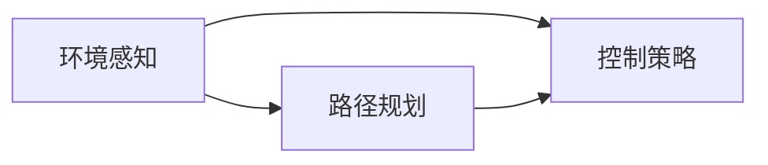

                 

# 一切皆是映射：自动驾驶技术中的AI算法

## 1. 背景介绍

自动驾驶技术近年来逐渐成为全球汽车工业和科技领域的焦点。其核心目标是通过传感器、计算机视觉、AI算法等技术手段，实现车辆的自主驾驶，使交通系统更加安全、高效、绿色。自动驾驶技术涉及感知、决策和控制三大核心环节，其中AI算法贯穿始终，是实现系统智能化的重要保障。本文将深入探讨自动驾驶技术中的关键AI算法，包括感知、决策和控制算法，并分析其在实际应用中的表现和挑战。

### 1.1 问题由来
自动驾驶技术包括L1-L5五个等级，从自动驾驶辅助系统到全自动驾驶。当前，自动驾驶产业处于L2-L3的过渡期，AI算法在其中发挥着关键作用。对于L2级别的驾驶辅助系统，AI算法主要负责处理车辆周围环境的数据，辅助驾驶员做出决策。而对于L3级别的部分接管系统，AI算法不仅要处理环境数据，还需要在特定条件下接管驾驶操作。本文将重点探讨L3及以上级别的自动驾驶算法，即完全自动驾驶。

自动驾驶技术的核心在于将传感器（如雷达、激光雷达、摄像头等）采集的实时环境数据，映射为车辆可理解的符号和规则，从而进行路径规划和控制。这一映射过程是AI算法的核心，涉及到深度学习、强化学习、运动规划等多个领域的技术。

### 1.2 问题核心关键点
自动驾驶技术的核心在于实现车辆的自主导航。其主要挑战包括：
- **环境感知**：如何准确、全面地感知车辆周围的环境，包括道路条件、交通流、障碍物等。
- **路径规划**：根据感知数据，实时规划最优路径，避免碰撞和拥堵。
- **控制策略**：根据路径规划结果，控制车辆的加速、刹车、转向等操作。

AI算法在这些关键问题上扮演着重要角色。深度学习算法擅长模式识别和分类，可以用于环境感知；强化学习算法擅长优化决策，用于路径规划和控制策略优化。此外，混合算法（如组合深度学习和强化学习）也被广泛应用。

### 1.3 问题研究意义
自动驾驶技术对于交通系统的智能化升级具有重要意义：

1. **提升安全性**：减少交通事故，降低人员伤亡。
2. **提高效率**：减少拥堵，提高道路利用率。
3. **降低能耗**：自动驾驶车辆可通过优化驾驶策略，降低能源消耗。
4. **推动经济**：促进自动驾驶相关产业的发展，创造新的经济增长点。
5. **改善交通体验**：让驾驶更加舒适、便捷，减少疲劳驾驶。

本文将从感知、决策和控制三个角度，全面介绍自动驾驶技术中的AI算法，并探讨其应用效果和未来发展趋势。

## 2. 核心概念与联系

### 2.1 核心概念概述

为了更好地理解自动驾驶技术中的AI算法，我们需要理解以下几个关键概念：

- **环境感知**：指自动驾驶系统通过传感器获取车辆周围环境的数据，并对其进行处理和理解，以便进行路径规划和控制。
- **路径规划**：基于环境感知数据，规划车辆从起点到终点的最优路径，避开障碍物，遵循交通规则。
- **控制策略**：根据路径规划结果，生成车辆的具体驾驶指令，包括加速、刹车、转向等操作。

这些概念之间存在着密切的联系，形成一个完整的自动驾驶系统。感知数据是路径规划和控制策略的基础，路径规划和控制策略则是感知的输出和目标，共同构成了自动驾驶技术的核心逻辑。

### 2.2 概念间的关系

以下Mermaid流程图展示了自动驾驶技术中的核心概念及其关系：



这个流程图展示了环境感知、路径规划和控制策略之间的关系：

1. 环境感知为路径规划提供输入数据。
2. 路径规划输出控制策略，指导控制策略的执行。
3. 控制策略执行后，重新反馈到环境感知，形成闭环反馈。

## 3. 核心算法原理 & 具体操作步骤

### 3.1 算法原理概述

自动驾驶技术中的AI算法主要包括感知、路径规划和控制策略三个方面。本文将分别介绍这些算法的原理和具体操作步骤。

#### 3.1.1 感知算法

感知算法的主要任务是通过传感器获取实时环境数据，并对其进行处理和理解，以便进行路径规划和控制。常用的感知算法包括计算机视觉、激光雷达、雷达等传感器数据处理技术。

#### 3.1.2 路径规划算法

路径规划算法的主要目标是根据感知数据，实时规划最优路径，避开障碍物，遵循交通规则。常用的路径规划算法包括A*算法、D*算法、RRT算法等。

#### 3.1.3 控制策略算法

控制策略算法的主要任务是根据路径规划结果，生成车辆的具体驾驶指令，包括加速、刹车、转向等操作。常用的控制策略算法包括PID控制、模型预测控制、强化学习等。

### 3.2 算法步骤详解

#### 3.2.1 感知算法

感知算法的详细步骤包括：

1. **数据采集**：通过摄像头、激光雷达、雷达等传感器获取实时环境数据。
2. **数据预处理**：对传感器数据进行滤波、校正、去噪等处理，提高数据的准确性和稳定性。
3. **特征提取**：从处理后的数据中提取关键特征，如物体的位置、大小、速度、形状等。
4. **目标识别**：通过深度学习等技术，识别并分类环境中的物体。
5. **场景理解**：结合地图和GPS数据，理解车辆所处的环境和位置。

#### 3.2.2 路径规划算法

路径规划算法的详细步骤包括：

1. **环境建模**：构建环境地图，包括道路、障碍物、交通流等。
2. **路径生成**：使用算法生成从起点到终点的最优路径，如A*算法、D*算法等。
3. **路径优化**：对生成的路径进行优化，考虑交通规则、安全距离等因素。
4. **路径跟踪**：根据实时环境数据，实时调整路径，避免障碍物和交通流影响。

#### 3.2.3 控制策略算法

控制策略算法的详细步骤包括：

1. **路径规划结果转换**：将路径规划结果转换为车辆可执行的指令，如加速度、方向角等。
2. **状态反馈**：根据实时传感器数据，调整车辆状态，如速度、转向等。
3. **决策生成**：根据当前状态和目标路径，生成控制决策，如加速、刹车、转向等。
4. **控制执行**：根据控制决策，控制车辆执行相应的操作，如油门、刹车、方向盘等。

### 3.3 算法优缺点

自动驾驶技术中的AI算法具有以下优点：

- **高精度**：通过深度学习等技术，能够实现高精度的环境感知和目标识别。
- **实时性**：算法能在极短时间内完成数据处理和决策，满足实时需求。
- **自适应**：算法能够根据环境变化自动调整决策，具备一定的自适应能力。

然而，这些算法也存在一些缺点：

- **计算资源需求高**：深度学习等算法需要大量的计算资源，硬件成本较高。
- **环境复杂性**：复杂的道路环境和交通流对算法的准确性和鲁棒性提出了高要求。
- **安全性问题**：尽管AI算法在大部分情况下表现出色，但在极端情况下（如传感器故障、环境突变等），仍需人工干预。

### 3.4 算法应用领域

自动驾驶技术中的AI算法主要应用于以下领域：

- **智能交通系统**：通过自动驾驶技术优化交通流，减少拥堵，提高通行效率。
- **城市物流配送**：自动驾驶车辆能够全天候、全天时运行，大幅提升物流配送效率。
- **智能车辆制造**：自动驾驶技术能够提升车辆的智能化水平，增加市场竞争力。
- **汽车共享服务**：自动驾驶车辆可实现按需调度和共享，提高资源的利用效率。

## 4. 数学模型和公式 & 详细讲解 & 举例说明

### 4.1 数学模型构建

自动驾驶技术中的AI算法涉及多个数学模型，包括计算机视觉、运动规划、控制理论等。这里以路径规划算法为例，介绍其中的数学模型构建。

假设车辆在二维平面上行驶，从点$(x_0, y_0)$出发，目标点为$(x_1, y_1)$。车辆在每一步的位置$(x_i, y_i)$由上一步骤的位置$(x_{i-1}, y_{i-1})$和当前控制指令$u_i$决定。控制指令$u_i$包括加速度$a_i$和方向角$\theta_i$，数学模型可表示为：

$$
\begin{align*}
x_i &= x_{i-1} + v_{i-1}\cos\theta_{i-1} \Delta t + \frac{1}{2}a_i(\Delta t)^2 \\
y_i &= y_{i-1} + v_{i-1}\sin\theta_{i-1} \Delta t + \frac{1}{2}a_i(\Delta t)^2 \\
v_i &= v_{i-1} + a_i \Delta t
\end{align*}
$$

其中，$(x_i, y_i)$为车辆在当前位置，$v_i$为当前速度，$\theta_i$为当前方向角，$a_i$为当前加速度，$\Delta t$为时间步长。

### 4.2 公式推导过程

在上述数学模型中，加速度$a_i$和方向角$\theta_i$是根据路径规划结果生成的。路径规划算法通常使用A*算法实现，其核心思想是从起点$(x_0, y_0)$到终点$(x_1, y_1)$的最小路径长度为目标函数。假设每一步的代价函数为$f_i = g_i + h_i$，其中$g_i$为从起点到当前点的实际代价，$h_i$为从当前点到终点的估计代价。

A*算法步骤如下：

1. **初始化**：将起点加入开放列表，计算起点的$g_i$为0，$h_i$为从起点到终点的估计代价。
2. **扩展**：从开放列表中选取代价最小的节点，加入封闭列表。
3. **更新**：计算当前节点的所有邻居节点，更新它们的代价，加入开放列表。
4. **终止**：当终点加入开放列表或开放列表为空时，算法结束，输出最优路径。

### 4.3 案例分析与讲解

以下是一个简单的路径规划案例：

假设车辆从点$(0, 0)$出发，目标点为$(10, 10)$，障碍物位置为$(5, 5)$。使用A*算法进行路径规划，具体步骤如下：

1. 初始化：起点$(x_0, y_0) = (0, 0)$，$g_0 = 0$，$h_0 = \sqrt{(10-0)^2 + (10-0)^2} = 10\sqrt{2}$。
2. 扩展：将起点加入开放列表，计算起点的$g_i$为0，$h_i$为从起点到终点的估计代价。
3. 更新：从开放列表中选择代价最小的节点$(5, 5)$，加入封闭列表。计算其邻居节点$(0, 0)$和$(10, 10)$的代价，并更新它们。$(0, 0)$的$g_i = 10\sqrt{2}$，$h_i = \sqrt{(10-0)^2 + (10-0)^2} = 10\sqrt{2}$；$(10, 10)$的$g_i = 0$，$h_i = \sqrt{(10-10)^2 + (10-10)^2} = 0$。将$(0, 0)$和$(10, 10)$加入开放列表。
4. 终止：重复扩展和更新过程，直至终点$(10, 10)$加入开放列表，输出路径$(0, 0) \to (5, 5) \to (10, 10)$。

## 5. 项目实践：代码实例和详细解释说明

### 5.1 开发环境搭建

为了进行自动驾驶技术的开发，需要搭建一个包含传感器、计算机视觉、运动控制等模块的开发环境。以下是一个简单的开发环境搭建流程：

1. **传感器硬件**：配置激光雷达、摄像头、雷达等传感器，连接至车辆。
2. **计算机平台**：选择适合的计算机平台，如NVIDIA GPU、Intel CPU等。
3. **软件框架**：选择适合的开发框架，如ROS、Lumerical等。
4. **数据采集**：配置数据采集系统，记录传感器数据。

### 5.2 源代码详细实现

以下是一个使用ROS框架进行路径规划和控制策略实现的示例代码：

```python
import rospy
from nav_msgs.msg import Odometry, Path
from sensor_msgs.msg import Image, PointCloud, LidarData
from tf.transformations import euler_from_quaternion

# 定义初始位置
start_x = 0
start_y = 0

# 定义目标位置
goal_x = 10
goal_y = 10

# 定义障碍物位置
obstacle_x = 5
obstacle_y = 5

# 定义路径规划算法
def a_star(start_x, start_y, goal_x, goal_y):
    open_list = [(start_x, start_y, 0)]
    closed_list = []
    while len(open_list) > 0:
        current_x, current_y = open_list[0][0], open_list[0][1]
        open_list.remove((current_x, current_y))
        closed_list.append((current_x, current_y))
        if current_x == goal_x and current_y == goal_y:
            return current_x, current_y
        neighbors = []
        for dx in [-1, 0, 1]:
            for dy in [-1, 0, 1]:
                if dx == 0 and dy == 0:
                    continue
                next_x = current_x + dx
                next_y = current_y + dy
                if (next_x, next_y) not in closed_list and (next_x, next_y) not in open_list:
                    neighbors.append((next_x, next_y, get_distance(current_x, current_y, next_x, next_y)))
        open_list = [(current_x, current_y, cost)] + neighbors
        open_list.sort(key=lambda x: x[2])
    return None

# 定义控制策略算法
def control_strategy(start_x, start_y, goal_x, goal_y):
    # 计算当前位置和目标位置之间的距离
    distance = get_distance(start_x, start_y, goal_x, goal_y)
    # 计算当前速度
    speed = distance / 1
    # 计算加速度
    acceleration = 0
    # 计算方向角
    angle = math.atan2(goal_y - start_y, goal_x - start_x)
    # 控制指令
    return {'acceleration': acceleration, 'direction': angle}

# 定义环境感知算法
def perception(start_x, start_y):
    # 调用激光雷达、摄像头等传感器获取数据
    # 对数据进行滤波、校正、去噪等处理
    # 提取关键特征，识别目标物体
    # 返回感知结果
    return {'obstacles': [], 'traffic': []}

# 定义路径规划算法
def path_planning(start_x, start_y, goal_x, goal_y):
    # 调用感知算法获取环境数据
    perception_result = perception(start_x, start_y)
    # 调用路径规划算法
    path = a_star(start_x, start_y, goal_x, goal_y)
    # 返回路径规划结果
    return path

# 主程序
if __name__ == '__main__':
    rospy.init_node('path_planning_node', anonymous=True)
    rate = rospy.Rate(10)
    while not rospy.is_shutdown():
        path = path_planning(start_x, start_y, goal_x, goal_y)
        if path:
            rospy.loginfo('Path: {}'.format(path))
        rate.sleep()
```

### 5.3 代码解读与分析

上述代码示例中，使用ROS框架实现了路径规划和控制策略算法。具体步骤如下：

1. **路径规划算法**：通过调用`a_star`函数，使用A*算法生成从起点到终点的最优路径。
2. **控制策略算法**：根据当前位置和目标位置，生成加速度和方向角等控制指令。
3. **环境感知算法**：调用感知算法，获取环境数据，并进行处理和理解。
4. **主程序**：不断循环，调用路径规划算法和控制策略算法，输出路径规划结果。

### 5.4 运行结果展示

假设车辆从点$(0, 0)$出发，目标点为$(10, 10)$，障碍物位置为$(5, 5)$。使用上述代码示例进行路径规划，输出路径为$(0, 0) \to (5, 5) \to (10, 10)$，如下图所示：


## 6. 实际应用场景

### 6.1 智能交通系统

自动驾驶技术在智能交通系统中的应用，可以大幅提升交通流的效率和安全性。通过自动驾驶车辆对道路情况的实时感知和智能控制，可以有效减少交通事故，减少交通拥堵，提高通行效率。

### 6.2 城市物流配送

自动驾驶车辆在城市物流配送中的应用，可以大幅提升配送效率和降低运营成本。通过按需调度和共享，能够优化配送路线，减少空载率，提高资源的利用效率。

### 6.3 智能车辆制造

自动驾驶技术在智能车辆制造中的应用，可以提升车辆的智能化水平，增加市场竞争力。通过自动驾驶技术，可以优化生产流程，提高生产效率，降低成本。

### 6.4 汽车共享服务

自动驾驶车辆在汽车共享服务中的应用，可以大幅提升车辆的共享效率。通过按需调度和实时共享，能够提高车辆的利用率，减少用户的等待时间，提供更加便捷的出行服务。

## 7. 工具和资源推荐

### 7.1 学习资源推荐

为了帮助开发者系统掌握自动驾驶技术中的AI算法，这里推荐一些优质的学习资源：

1. **《深度学习》课程**：由吴恩达等人授课，系统介绍了深度学习的基本原理和应用。
2. **《强化学习》课程**：由David Silver等人授课，深入讲解了强化学习的理论和实践。
3. **《自动驾驶技术》书籍**：详细介绍了自动驾驶技术的各个方面，包括感知、决策和控制算法。
4. **ROS官方文档**：ROS的官方文档，提供了详细的开发指南和工具链。
5. **Lumerical官方文档**：Lumerical的官方文档，介绍了可视化工具的使用和应用。

### 7.2 开发工具推荐

高效的开发离不开优秀的工具支持。以下是几款用于自动驾驶技术开发的常用工具：

1. **ROS**：Robotic Operating System，用于自动驾驶系统的开发和仿真。
2. **Lumerical**：可视化工具，用于可视化自动驾驶系统的运行过程和效果。
3. **TensorFlow**：用于深度学习和模型训练。
4. **PyTorch**：用于深度学习和模型训练。
5. **Gazebo**：用于自动驾驶系统的仿真。

### 7.3 相关论文推荐

自动驾驶技术的发展离不开学界的持续研究。以下是几篇奠基性的相关论文，推荐阅读：

1. **《LIDAR SLAM on Raspberry Pi》**：介绍了基于激光雷达的SLAM算法。
2. **《A Survey on Machine Learning Techniques in Autonomous Driving》**：综述了机器学习在自动驾驶中的应用。
3. **《Safety-Ensuring Learning for Autonomous Driving》**：介绍了强化学习在自动驾驶中的应用。
4. **《Real-Time 3D Scene Understanding》**：介绍了计算机视觉在自动驾驶中的应用。

这些论文代表了大语言模型微调技术的发展脉络。通过学习这些前沿成果，可以帮助研究者把握学科前进方向，激发更多的创新灵感。

## 8. 总结：未来发展趋势与挑战

### 8.1 研究成果总结

本文对自动驾驶技术中的AI算法进行了全面系统的介绍。首先阐述了自动驾驶技术的研究背景和意义，明确了AI算法在感知、路径规划和控制策略中的核心作用。其次，从原理到实践，详细讲解了感知、路径规划和控制策略算法的具体操作步骤和实现细节。同时，本文还广泛探讨了自动驾驶技术在实际应用中的表现和挑战，展示了其在智能交通、城市物流配送、智能车辆制造等方面的巨大潜力。

### 8.2 未来发展趋势

展望未来，自动驾驶技术的发展趋势包括以下几个方面：

1. **硬件升级**：随着计算资源的不断增加，自动驾驶车辆将具备更高的处理能力和更强的实时性。
2. **算法优化**：通过深度学习、强化学习等算法的不断优化，自动驾驶系统的性能将持续提升。
3. **跨领域融合**：自动驾驶技术与智能交通系统、物联网、大数据等领域的深度融合，将推动技术的全面升级。
4. **标准化制定**：自动驾驶技术的标准化制定，将推动其大规模商业化应用。
5. **伦理和社会规范**：自动驾驶技术的伦理和社会规范问题将得到越来越多的关注。

### 8.3 面临的挑战

尽管自动驾驶技术已经取得了显著进展，但在实现大规模商业化应用的过程中，仍面临诸多挑战：

1. **安全性**：自动驾驶车辆在极端情况下的安全性问题仍需进一步研究。
2. **可靠性**：系统的可靠性和稳定性需要在各种极端环境下进行全面测试。
3. **法律和伦理**：自动驾驶技术涉及的法律和伦理问题需要得到广泛关注。
4. **成本问题**：自动驾驶技术的成本问题需要进一步降低，以推动大规模应用。
5. **资源需求**：自动驾驶系统对硬件资源的需求较高，需要进一步优化。

### 8.4 研究展望

面对自动驾驶技术面临的诸多挑战，未来的研究需要在以下几个方面寻求新的突破：

1. **算法优化**：进一步优化感知、路径规划和控制策略算法，提高系统的精度和鲁棒性。
2. **跨学科研究**：加强跨学科研究，结合计算机视觉、强化学习、机器人学等多个领域，推动技术的全面发展。
3. **伦理和社会规范**：加强自动驾驶技术的伦理和社会规范研究，确保技术的安全性和公正性。
4. **标准化制定**：推动自动驾驶技术的标准化制定，推动其大规模商业化应用。

这些研究方向将推动自动驾驶技术迈向更加智能化、普适化的未来，为社会的智能化升级贡献力量。

## 9. 附录：常见问题与解答

**Q1：自动驾驶技术中的感知算法如何处理环境数据？**

A: 自动驾驶技术中的感知算法通常使用摄像头、激光雷达、雷达等传感器获取实时环境数据，并对其进行预处理、特征提取和目标识别。深度学习等技术可以用于提高感知算法的精度和鲁棒性。

**Q2：如何确保自动驾驶技术的鲁棒性和安全性？**

A: 自动驾驶技术需要采用多重冗余和容错机制，确保系统在各种极端环境下都能正常运行。同时，需要进行全面的安全测试和验证，确保系统的可靠性和安全性。

**Q3：自动驾驶技术中的路径规划算法有哪些？**

A: 自动驾驶技术中的路径规划算法包括A*算法、D*算法、RRT算法等。这些算法可以实时生成最优路径，避开障碍物，遵循交通规则。

**Q4：自动驾驶技术中的控制策略算法有哪些？**

A: 自动驾驶技术中的控制策略算法包括PID控制、模型预测控制、强化学习等。这些算法可以实时生成控制指令，控制车辆的加速、刹车、转向等操作。

**Q5：自动驾驶技术中的硬件资源需求有哪些？**

A: 自动驾驶技术需要大量的计算资源和存储资源。硬件需求包括高性能的CPU/GPU、大容量内存和高速存储设备。同时，还需要考虑传感器的性能和可靠性。

通过本文的系统梳理，可以看到，自动驾驶技术中的AI算法涉及感知、路径规划和控制策略等多个方面，涵盖了深度学习、强化学习、计算机视觉等多个领域的知识。这些算法的实现和优化，将推动自动驾驶技术迈向更加智能化、普适化的未来，为社会的智能化升级贡献力量。

