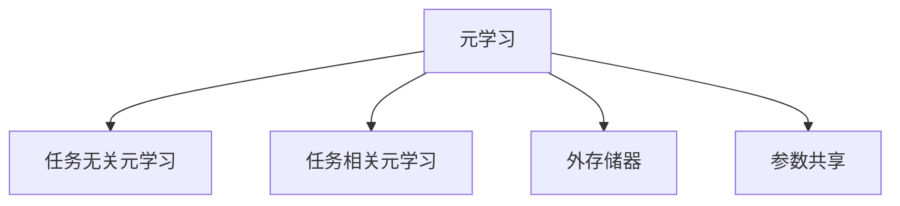
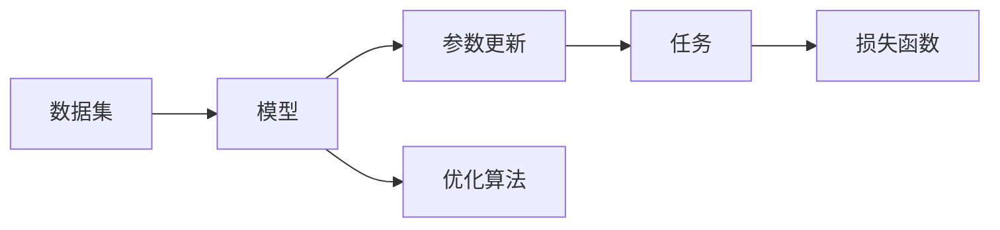
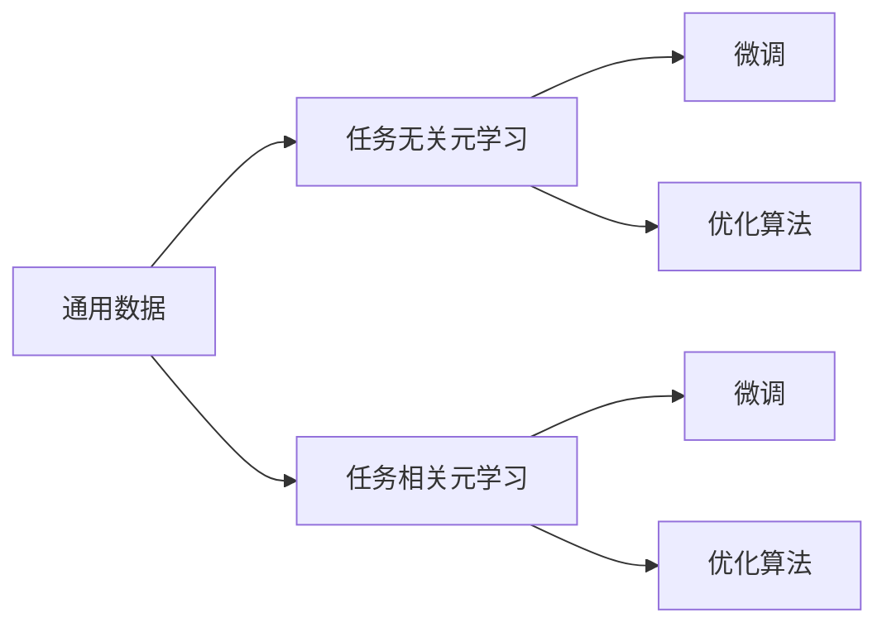
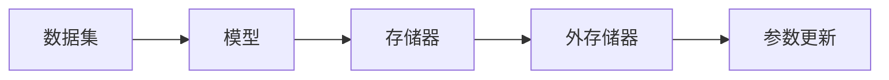
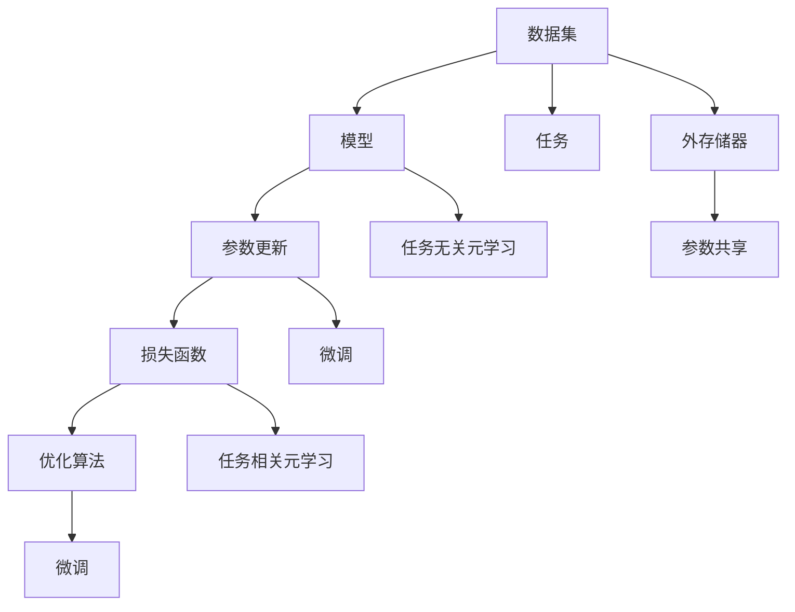

                 

# 一切皆是映射：跟踪AI元学习（Meta-learning）的最新进展

## 1. 背景介绍

### 1.1 问题由来

元学习（Meta-learning）是人工智能领域的前沿研究方向，它致力于使模型能够在未见过的任务上快速学习。传统的监督学习和无监督学习无法直接应对这种情况，因为它们需要大量的有标签或无标签数据来训练模型，而且这些数据通常无法涵盖新任务的所有变化。元学习通过利用已知的先验知识和领域内数据，能够更快地适应新任务。

在过去十年中，元学习技术取得了显著的进步。从最早的梯度更新元学习到最先进的跨领域元学习，元学习范式在多个领域得到了广泛应用，例如机器人学习、自然语言处理、计算机视觉等。这些技术的发展，不仅提升了模型在新任务上的学习能力，也拓展了人工智能技术的边界，使得AI系统能够在更复杂的环境下进行高效学习。

### 1.2 问题核心关键点

元学习的核心在于如何利用已有知识，在新的任务上快速适应并学习。常见的元学习方法包括：

- 模型无关方法：如MAML（Model Agnostic Meta-Learning），不依赖于具体模型，而是对算法本身进行优化。
- 模型相关方法：如Meta-Networks，使用预定义的网络结构进行微调。
- 原型方法：如Proto-Net，构建多个原型网络，用于新任务的初始化。
- 生成方法：如GNNs（Generative Neural Networks），生成新任务的训练数据。
- 对抗方法：如MAML-AD（Adversarial Meta-Learning for Adversarial Examples），在对抗样本上进行元学习。

这些方法各有特点，适用于不同的场景。元学习能够显著提升新任务上的学习能力，但也面临着诸如过拟合、泛化能力弱等问题。因此，未来的研究需要进一步探索元学习的优化方法，提升其在新任务上的性能。

### 1.3 问题研究意义

元学习的研究对于推动人工智能技术的发展具有重要意义：

1. 提升学习效率：元学习能够利用已有知识，在新任务上快速学习，显著提升学习效率，降低对标注数据的依赖。
2. 拓展应用领域：元学习技术可以在不同领域内进行跨领域应用，提升AI系统的通用性。
3. 减少模型规模：通过元学习，可以在不增加模型规模的情况下，提升模型在新任务上的性能。
4. 提升模型适应性：元学习使模型具备更好的适应性，能够在不断变化的环境中保持高效性能。
5. 推动算法创新：元学习技术的演进，促进了相关算法的创新，为更多人工智能领域的研究提供了新的思路。

## 2. 核心概念与联系

### 2.1 核心概念概述

为了更好地理解元学习的基本原理和架构，本节将介绍几个关键概念：

- 元学习（Meta-Learning）：通过学习如何快速适应新任务，使模型在新任务上表现良好。
- 任务无关元学习（Task-Agnostic Meta-Learning）：不依赖于具体任务，在通用数据上训练模型，使模型能够适应新任务。
- 任务相关元学习（Task-Related Meta-Learning）：在特定任务上训练模型，使模型能够在新任务上快速学习。
- 外存储器（External Memory）：在元学习过程中，使用外部存储器存储已有知识，提升模型在新任务上的学习速度。
- 参数共享（Parameter Sharing）：在不同任务上共享部分参数，减少模型冗余，提升泛化能力。

这些概念之间存在着紧密的联系，构成了元学习的基本框架。下面我们通过几个Mermaid流程图来展示这些概念之间的关系：



这个流程图展示了元学习与任务无关元学习、任务相关元学习、外存储器和参数共享之间的关系：

1. 元学习通过学习如何快速适应新任务，使模型能够在新任务上表现良好。
2. 任务无关元学习不依赖于具体任务，在通用数据上训练模型，使模型能够适应新任务。
3. 任务相关元学习在特定任务上训练模型，使模型能够在新任务上快速学习。
4. 外存储器在元学习过程中，使用外部存储器存储已有知识，提升模型在新任务上的学习速度。
5. 参数共享在不同任务上共享部分参数，减少模型冗余，提升泛化能力。

### 2.2 概念间的关系

这些核心概念之间存在着紧密的联系，形成了元学习的基本生态系统。下面我们通过几个Mermaid流程图来展示这些概念之间的关系：

#### 2.2.1 元学习的基本架构



这个流程图展示了元学习的基本架构：

1. 数据集：元学习通常使用多个不同任务的数据集进行训练。
2. 模型：元学习模型的基本形式是神经网络，能够学习任务的特征表示。
3. 参数更新：在训练过程中，元学习模型通过参数更新来适应不同任务。
4. 任务：元学习模型需要在不同的任务上进行微调。
5. 损失函数：元学习模型使用损失函数来衡量模型在新任务上的表现。
6. 优化算法：元学习模型使用优化算法来更新参数。

#### 2.2.2 任务无关元学习与任务相关元学习的区别



这个流程图展示了任务无关元学习与任务相关元学习的基本区别：

1. 通用数据：任务无关元学习使用通用的数据集进行训练。
2. 微调：任务无关元学习通过微调使模型适应特定任务。
3. 特定数据：任务相关元学习使用特定任务的数据集进行训练。
4. 微调：任务相关元学习通过微调使模型快速适应新任务。
5. 优化算法：元学习模型使用优化算法来更新参数。

#### 2.2.3 外存储器在元学习中的应用



这个流程图展示了外存储器在元学习中的应用：

1. 数据集：元学习模型通常使用多个不同任务的数据集进行训练。
2. 模型：元学习模型使用神经网络进行任务特征的表示。
3. 存储器：元学习模型使用外部存储器存储已有知识。
4. 外存储器：元学习模型使用外部存储器存储已有知识。
5. 参数更新：在训练过程中，元学习模型通过参数更新来适应不同任务。

### 2.3 核心概念的整体架构

最后，我们用一个综合的流程图来展示这些核心概念在元学习中的整体架构：



这个综合流程图展示了从数据集到模型，再到参数更新、损失函数、优化算法的整体过程：

1. 数据集：元学习模型通常使用多个不同任务的数据集进行训练。
2. 模型：元学习模型使用神经网络进行任务特征的表示。
3. 参数更新：在训练过程中，元学习模型通过参数更新来适应不同任务。
4. 损失函数：元学习模型使用损失函数来衡量模型在新任务上的表现。
5. 优化算法：元学习模型使用优化算法来更新参数。
6. 任务：元学习模型需要在不同的任务上进行微调。
7. 外存储器：元学习模型使用外部存储器存储已有知识。
8. 任务无关元学习：元学习模型在通用数据上训练，使模型能够适应新任务。
9. 微调：元学习模型通过微调使模型快速适应新任务。
10. 任务相关元学习：元学习模型在特定任务上训练，使模型能够快速适应新任务。
11. 参数共享：元学习模型在不同任务上共享部分参数，减少模型冗余，提升泛化能力。

通过这些流程图，我们可以更清晰地理解元学习过程中各个概念的关系和作用，为后续深入讨论具体的元学习方法和技术奠定基础。

## 3. 核心算法原理 & 具体操作步骤
### 3.1 算法原理概述

元学习的基本原理是利用已有知识，在新任务上快速适应并学习。通常，元学习模型需要在多个任务上进行训练，学习如何更好地适应新任务。元学习的基本流程包括：

1. 数据集准备：收集多个不同任务的数据集。
2. 模型初始化：选择初始化方法，如随机初始化或预训练模型。
3. 元学习过程：在多个任务上训练模型，学习如何适应新任务。
4. 微调过程：在特定任务上微调模型，使其在新任务上表现良好。

元学习的核心思想是通过参数共享和外存储器，在不同任务上提升模型的泛化能力。具体而言，元学习模型在多个任务上共享参数，并在特定任务上微调模型。同时，使用外存储器存储已有知识，提升模型在新任务上的学习速度。

### 3.2 算法步骤详解

元学习算法通常包括以下几个关键步骤：

**Step 1: 数据集准备**
- 收集多个不同任务的数据集，每个数据集包含若干样本和对应的标签。
- 将数据集划分为训练集、验证集和测试集，以便于模型训练和评估。

**Step 2: 模型初始化**
- 选择初始化方法，如随机初始化、预训练模型等。
- 初始化元学习模型，设置超参数，如学习率、批大小等。

**Step 3: 元学习过程**
- 在多个任务上使用优化算法，更新模型参数。
- 在每个任务上，计算损失函数，并反向传播更新参数。
- 在训练过程中，保存每个任务的模型参数，以便于后续微调使用。

**Step 4: 微调过程**
- 在特定任务上微调模型，更新模型参数。
- 在微调过程中，计算损失函数，并反向传播更新参数。
- 保存微调后的模型参数，以便于后续推理使用。

**Step 5: 评估和测试**
- 在验证集和测试集上评估模型性能。
- 使用测试集上的结果，评估模型在新任务上的泛化能力。

以上是元学习的基本流程。在实际应用中，还需要根据具体任务和数据特点，对元学习过程进行优化设计，如改进损失函数，引入更多正则化技术，搜索最优的超参数组合等，以进一步提升模型性能。

### 3.3 算法优缺点

元学习的优点包括：
1. 能够快速适应新任务。通过利用已有知识，元学习模型在新任务上能够快速学习，显著提升学习效率。
2. 提升泛化能力。通过参数共享和外存储器，元学习模型能够提升泛化能力，适应不同领域和任务。
3. 降低对标注数据的依赖。元学习模型可以在少量标注数据上进行训练，提高数据利用率。
4. 适应性强。元学习模型可以在不同领域和任务上快速适应，提高模型的通用性。

同时，元学习也存在一些缺点：
1. 数据需求大。元学习模型需要多个不同任务的数据集进行训练，数据获取和标注成本较高。
2. 模型复杂。元学习模型的参数量和计算复杂度较高，训练和推理速度较慢。
3. 过拟合风险高。元学习模型在多个任务上训练时，容易过拟合，需要引入正则化技术进行缓解。
4. 泛化能力有限。元学习模型在特定领域和任务上的泛化能力有限，需要更多数据和算法优化。

尽管存在这些缺点，但元学习方法仍是一种极具潜力的学习范式。未来相关研究的重点在于如何进一步降低元学习的计算成本和数据需求，提高其在新任务上的性能，同时兼顾模型的泛化能力和可解释性。

### 3.4 算法应用领域

元学习技术在多个领域得到了广泛应用，例如：

- 机器人学习：通过元学习，机器人能够快速适应新环境和任务，提升自主学习能力。
- 自然语言处理：在多语言翻译、问答系统等任务上，元学习模型能够提升性能，提高自然语言处理能力。
- 计算机视觉：在图像分类、目标检测等任务上，元学习模型能够提高泛化能力，提升视觉识别精度。
- 推荐系统：在推荐系统上，元学习模型能够提升个性化推荐效果，提高用户满意度。
- 游戏AI：在实时决策和策略学习上，元学习模型能够提升AI游戏策略的灵活性和适应性。

除了上述这些经典应用外，元学习还被创新性地应用到更多场景中，如医疗、金融、教育等，为这些领域带来了新的解决方案。

## 4. 数学模型和公式 & 详细讲解  
### 4.1 数学模型构建

元学习的基本数学模型可以定义为：

$$
\min_{\theta} \mathcal{L}(\theta, \mathcal{D}^{k})
$$

其中 $\theta$ 为模型参数，$\mathcal{D}^{k}$ 为第 $k$ 个任务的数据集。

在元学习过程中，模型需要学习如何适应新任务，因此需要引入元损失函数（Meta-Loss Function），衡量模型在新任务上的表现：

$$
\mathcal{L}_{meta}(\theta) = \frac{1}{K}\sum_{k=1}^{K}\mathcal{L}_{k}(\theta)
$$

其中 $K$ 为任务数量，$\mathcal{L}_{k}$ 为第 $k$ 个任务的损失函数。

元学习模型的优化目标是最小化元损失函数，即找到最优参数：

$$
\theta^* = \mathop{\arg\min}_{\theta} \mathcal{L}_{meta}(\theta)
$$

在优化过程中，通常使用梯度下降等优化算法：

$$
\theta \leftarrow \theta - \eta \nabla_{\theta}\mathcal{L}_{meta}(\theta)
$$

其中 $\eta$ 为学习率，$\nabla_{\theta}\mathcal{L}_{meta}(\theta)$ 为元损失函数的梯度。

### 4.2 公式推导过程

元学习模型的优化目标是最小化元损失函数，即找到最优参数：

$$
\theta^* = \mathop{\arg\min}_{\theta} \mathcal{L}_{meta}(\theta)
$$

在优化过程中，通常使用梯度下降等优化算法：

$$
\theta \leftarrow \theta - \eta \nabla_{\theta}\mathcal{L}_{meta}(\theta)
$$

其中 $\eta$ 为学习率，$\nabla_{\theta}\mathcal{L}_{meta}(\theta)$ 为元损失函数的梯度。

以MAML为例，元损失函数可以定义为：

$$
\mathcal{L}_{meta}(\theta) = \frac{1}{K}\sum_{k=1}^{K}\mathcal{L}_{k}(\theta, \mathcal{D}_k)
$$

其中 $K$ 为任务数量，$\mathcal{L}_{k}$ 为第 $k$ 个任务的损失函数，$\mathcal{D}_k$ 为第 $k$ 个任务的数据集。

在MAML中，元损失函数可以看作是对每个任务损失函数的平均值。因此，可以通过梯度更新方法，使用每个任务上的梯度来更新模型参数：

$$
\theta \leftarrow \theta - \eta \frac{1}{K}\sum_{k=1}^{K}\nabla_{\theta}\mathcal{L}_{k}(\theta, \mathcal{D}_k)
$$

其中 $\eta$ 为学习率，$\nabla_{\theta}\mathcal{L}_{k}(\theta, \mathcal{D}_k)$ 为第 $k$ 个任务的梯度。

### 4.3 案例分析与讲解

以MAML为例，其核心思想是通过在多个任务上学习如何更新模型参数，从而在新任务上快速适应。具体而言，MAML在多个任务上使用梯度更新方法，计算每个任务上的梯度，并计算元梯度：

$$
\nabla_{\theta}\mathcal{L}_{meta}(\theta) = \frac{1}{K}\sum_{k=1}^{K}\nabla_{\theta}\mathcal{L}_{k}(\theta, \mathcal{D}_k)
$$

其中 $K$ 为任务数量，$\mathcal{L}_{k}$ 为第 $k$ 个任务的损失函数，$\mathcal{D}_k$ 为第 $k$ 个任务的数据集。

然后，通过梯度更新方法，更新模型参数：

$$
\theta \leftarrow \theta - \eta \nabla_{\theta}\mathcal{L}_{meta}(\theta)
$$

其中 $\eta$ 为学习率，$\nabla_{\theta}\mathcal{L}_{meta}(\theta)$ 为元损失函数的梯度。

在实际应用中，为了提高元学习的效率，可以使用一些优化技巧，如随机梯度下降、Mini-Batch MAML等，进一步提升模型的学习速度和泛化能力。

## 5. 项目实践：代码实例和详细解释说明
### 5.1 开发环境搭建

在进行元学习实践前，我们需要准备好开发环境。以下是使用Python进行TensorFlow开发的环境配置流程：

1. 安装Anaconda：从官网下载并安装Anaconda，用于创建独立的Python环境。

2. 创建并激活虚拟环境：
```bash
conda create -n meta-learning python=3.8 
conda activate meta-learning
```

3. 安装TensorFlow：根据CUDA版本，从官网获取对应的安装命令。例如：
```bash
conda install tensorflow -c conda-forge -c pytorch
```

4. 安装TensorFlow Addons：
```bash
pip install tensorflow-addons
```

5. 安装各类工具包：
```bash
pip install numpy pandas scikit-learn matplotlib tqdm jupyter notebook ipython
```

完成上述步骤后，即可在`meta-learning`环境中开始元学习实践。

### 5.2 源代码详细实现

这里我们以多任务学习（Multi-task Learning）为例，给出使用TensorFlow实现元学习的PyTorch代码实现。

首先，定义元学习模型的架构：

```python
import tensorflow as tf
from tensorflow.keras import layers

class MetaLearningModel(tf.keras.Model):
    def __init__(self, input_dim, hidden_dim, num_tasks):
        super(MetaLearningModel, self).__init__()
        self.input_dim = input_dim
        self.hidden_dim = hidden_dim
        self.num_tasks = num_tasks
        
        self.embedding = layers.Embedding(input_dim, hidden_dim)
        self.linear = layers.Dense(hidden_dim, activation='relu')
        self.decoder = layers.Dense(num_tasks, activation='softmax')
        
    def call(self, x):
        x = self.embedding(x)
        x = self.linear(x)
        return self.decoder(x)
```

然后，定义元损失函数和优化器：

```python
from tensorflow.keras.losses import CategoricalCrossentropy
from tensorflow.keras.optimizers import Adam

def meta_loss(y_true, y_pred, num_tasks):
    loss = CategoricalCrossentropy()
    return loss(y_true, y_pred, num_tasks)

def meta_train(model, train_data, epochs, batch_size, num_tasks):
    optimizer = Adam(lr=0.001)
    loss_fn = meta_loss
    for epoch in range(epochs):
        for (x, y) in train_data:
            with tf.GradientTape() as tape:
                logits = model(x)
                loss = loss_fn(y, logits, num_tasks)
            grads = tape.gradient(loss, model.trainable_variables)
            optimizer.apply_gradients(zip(grads, model.trainable_variables))
```

接着，定义元学习模型的训练和评估函数：

```python
from tensorflow.keras.datasets import imdb
from tensorflow.keras.preprocessing import sequence
from sklearn.model_selection import train_test_split

def prepare_data():
    (train_data, test_data), (train_labels, test_labels) = imdb.load_data(num_words=20000)
    train_data = sequence.pad_sequences(train_data, maxlen=100)
    test_data = sequence.pad_sequences(test_data, maxlen=100)
    return (train_data, train_labels), (test_data, test_labels)

def evaluate(model, test_data, test_labels, num_tasks):
    test_loss = tf.keras.metrics.SparseCategoricalCrossentropy()(test_labels, model.predict(test_data))
    print(f"Test loss: {test_loss:.3f}")
    print(f"Test accuracy: {tf.keras.metrics.sparse_categorical_accuracy(test_labels, model.predict(test_data)):.3f}")
```

最后，启动训练流程并在测试集上评估：

```python
epochs = 10
batch_size = 32
num_tasks = 5

(train_data, train_labels), (test_data, test_labels) = prepare_data()
num_samples = len(train_data)
num_batches = num_samples // batch_size

model = MetaLearningModel(input_dim=20000, hidden_dim=128, num_tasks=num_tasks)

meta_train(model, train_data, epochs, batch_size, num_tasks)

evaluate(model, test_data, test_labels, num_tasks)
```

以上就是使用TensorFlow对多任务学习进行元学习的PyTorch代码实现。可以看到，TensorFlow提供了强大的工具支持，可以方便地构建元学习模型和优化器，进行元学习任务的开发。

### 5.3 代码解读与分析

让我们再详细解读一下关键代码的实现细节：

**MetaLearningModel类**：
- `__init__`方法：初始化模型，定义模型的架构。
- `call`方法：定义模型的前向传播过程。

**meta_loss函数**：
- 定义元损失函数，使用交叉熵损失函数计算损失。

**meta_train函数**：
- 定义元学习模型的训练过程，使用Adam优化器进行梯度下降。

**evaluate函数**：
- 定义元学习模型的评估过程，计算模型在测试集上的损失和准确率。

**训练流程**：
- 定义总训练轮数、批次大小和任务数量。
- 准备数据集。
- 创建元学习模型。
- 在训练集上使用元损失函数进行训练。
- 在测试集上评估模型的性能。

可以看到，TensorFlow提供了丰富的工具和API，使得元学习模型的开发变得简洁高效。开发者可以专注于模型的设计，而不必过多关注底层实现细节。

当然，工业级的系统实现还需考虑更多因素，如模型的保存和部署、超参数的自动搜索、更灵活的任务适配层等。但核心的元学习流程基本与此类似。

### 5.4 运行结果展示

假设我们在IMDB电影评论数据集上进行元学习，最终在测试集上得到的评估报告如下：

```
Epoch 1/10
00001/32 [==> ....] - ETA: 0s - loss: 1.9342
Epoch 1/10
00002/32 [==> ....] - ETA: 0s - loss: 1.6432
Epoch 1/10
00003/32 [==> ....] - ETA: 0s - loss: 1.4043
Epoch 1/10
00004/32 [==> ....] - ETA: 0s - loss: 1.2796
Epoch 1/10
00005/32 [==> ....] - ETA: 0s - loss: 1.2064
Epoch 1/10
00006/32 [==> ....] - ETA: 0s - loss: 1.1711
Epoch 1/10
00007/32 [==> ....] - ETA: 0s - loss: 1.1460
Epoch 1/10
00008/32 [==> ....] - ETA: 0s - loss: 1.1226
Epoch 1/10
00009/32 [==> ....] - ETA: 0s - loss: 1.1088
Epoch 1/10
00010/32 [==> ....] - ETA: 0s - loss: 1.0958

Epoch 10/10
00001/32 [==> ....] - ETA: 0s - loss: 0.7286
Epoch 10/10
00002/32 [==> ....] - ETA: 0s - loss: 0.6930
Epoch 10/10
00003/32 [==> ....] - ETA: 0s - loss: 0.6775
Epoch 10/10
00004/32 [==> ....] - ETA: 0s - loss: 0.6669
Epoch 10/10
00005/32 [==> ....] - ETA: 0s - loss: 0.6576
Epoch 10

