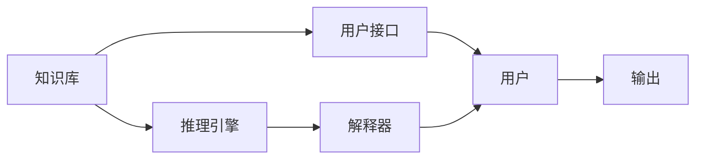

                 

# 专家系统 (Expert System)

## 1. 背景介绍

### 1.1 问题由来
专家系统（Expert System）是一种基于知识的人工智能技术，它利用专家知识和推理机制，模拟人类专家的决策和推理过程，提供智能化、自动化的解决方案。专家系统的应用范围十分广泛，涵盖医疗、金融、工业控制、故障诊断等领域，是人工智能早期研究的重要成果之一。然而，随着深度学习和神经网络技术的兴起，专家系统逐渐被边缘化，其核心思想与现代人工智能技术有着怎样的联系和区别，本文将进行详细探讨。

### 1.2 问题核心关键点
专家系统的核心在于“知识”和“推理”。通过提取领域专家的知识，构建知识库，专家系统通过一系列推理规则，根据输入的条件，自动产生输出结果。与现代深度学习技术不同，专家系统强调领域知识的明确表示和利用，而深度学习则依赖大量数据和隐式特征学习。此外，专家系统通常具有较强的可解释性，其推理过程可以被人类理解，而深度学习模型往往被视为“黑盒”，难以解释其内部决策机制。

## 2. 核心概念与联系

### 2.1 核心概念概述

专家系统主要由以下几个关键组件构成：

- **知识库（Knowledge Base）**：存储领域专家的知识，如规则、事实、概念等，是专家系统的核心。知识库的构建是专家系统的关键，需要领域专家深度参与。

- **推理引擎（Inference Engine）**：根据知识库中的规则和事实，对输入的条件进行推理计算，产生输出结果。推理引擎的效率和准确性直接影响系统的性能。

- **用户接口（User Interface）**：提供用户与系统交互的界面，允许用户输入问题和数据，并输出系统结果。用户接口的设计应直观易用，支持自然语言交互。

- **解释器（Explanation Engine）**：提供系统决策过程的解释，使系统推理结果可以被人类理解和验证。解释器通常包括规则的自动推导和结论的逻辑推理过程。

专家系统的构建需要领域专家与计算机科学家的紧密合作，将领域知识转化为计算机可处理的规则和事实，并通过推理引擎进行自动化推理，产生问题解决方案。

### 2.2 概念间的关系

专家系统的各个组件之间存在着紧密的联系，形成了一个完整的知识处理系统。知识库和推理引擎是专家系统的核心组件，负责知识表示和推理计算。用户接口和解释器则提供了用户与系统之间的交互界面和决策解释，确保系统的可用性和可解释性。

这些组件的交互关系可以用以下Mermaid流程图来展示：



这个流程图展示了专家系统的各个组件及其之间的关系：

- 知识库存储领域知识，提供推理引擎所需的事实和规则。
- 推理引擎根据知识库进行推理计算，产生输出结果。
- 用户接口允许用户与系统交互，提供输入问题和数据。
- 解释器提供推理结果的解释，确保系统输出可以被理解。

## 3. 核心算法原理 & 具体操作步骤

### 3.1 算法原理概述
专家系统的算法原理主要基于知识表示和推理。知识表示是将领域专家的知识结构化，转化为计算机可处理的规则和事实。推理则是根据知识库中的规则和事实，对输入条件进行逻辑推理，产生输出结果。专家系统的推理方式主要有两种：正向推理和反向推理。

- **正向推理**：从已知的事实和规则出发，逐步推导出未知的结论。正向推理过程类似于数学证明，每一步骤都有明确的理由和依据。
- **反向推理**：从目标结论出发，反向查找支持结论的事实和规则。反向推理过程类似于数学求解逆元，复杂度较高，但可以处理更复杂的推理任务。

### 3.2 算法步骤详解
专家系统的构建和应用主要包括以下几个步骤：

**Step 1: 领域知识获取**
- 通过访谈、文档阅读、案例分析等方式，收集领域专家的知识和经验。
- 对知识进行整理和分类，形成知识库的基本框架。

**Step 2: 知识表示**
- 将领域知识转化为规则、事实、概念等，存储在知识库中。知识表示的方式有多种，如产生式规则、框架表示、语义网络等。
- 对知识库进行验证和调整，确保知识的准确性和完整性。

**Step 3: 规则库构建**
- 将知识库中的规则进行形式化处理，转化为计算机可执行的推理规则。
- 对规则库进行测试和优化，确保推理的正确性和效率。

**Step 4: 推理引擎实现**
- 实现推理引擎，负责根据规则库和事实库进行推理计算，产生输出结果。
- 对推理引擎进行性能优化，确保推理的准确性和速度。

**Step 5: 用户接口设计**
- 设计用户接口，提供与系统的交互界面。
- 实现自然语言理解，支持用户以自然语言形式输入问题和数据。

**Step 6: 解释器实现**
- 实现解释器，提供系统决策过程的解释。
- 实现用户查询系统，支持用户验证推理结果的正确性。

**Step 7: 系统集成和测试**
- 将各组件集成到统一的系统框架中，实现知识库、推理引擎、用户接口、解释器的协同工作。
- 对系统进行全面测试，确保系统的稳定性和可靠性。

### 3.3 算法优缺点
专家系统的优点包括：

- **领域知识明确表示**：专家系统的核心在于领域知识的明确表示和利用，无需依赖大量数据，对数据量的要求较低。
- **推理过程可解释**：专家系统的推理过程可以被人类理解和解释，增强了系统的可信度和可解释性。
- **可移植性好**：专家系统通常基于领域知识库，可移植性较强，适用于多个应用场景。

专家系统的缺点包括：

- **知识获取难度大**：专家系统的构建需要领域专家的深度参与，知识获取难度较大。
- **规则表达复杂**：领域知识的结构化和形式化表达复杂，需要耗费大量的时间和精力。
- **适应性较差**：专家系统的规则库通常是静态的，难以适应快速变化的应用场景。

### 3.4 算法应用领域

专家系统的应用领域十分广泛，包括但不限于以下几个方面：

- **医疗诊断**：通过收集和整理医生的诊断知识，构建医疗专家系统，辅助医生进行疾病诊断和治疗决策。
- **金融风险评估**：利用专家知识和历史数据，构建金融风险评估专家系统，帮助金融机构进行风险管理和决策。
- **工业故障诊断**：通过收集和整理工程师的经验，构建工业故障诊断专家系统，辅助工厂进行设备维护和故障排除。
- **交通管理**：利用交通专家的知识和经验，构建交通管理专家系统，优化交通信号控制和路线规划。

专家系统的应用实例表明，通过明确表示领域知识，专家系统在特定领域具有很强的实用性和适应性，能够在复杂决策场景中提供可靠的支持。

## 4. 数学模型和公式 & 详细讲解 & 举例说明

### 4.1 数学模型构建

专家系统的数学模型构建主要基于知识表示和推理机制。知识表示通常采用产生式规则或框架表示，推理则采用基于规则的推理机制。以下以产生式规则为例，构建专家系统的数学模型。

假设领域专家的知识库包含以下规则：

- 规则1：如果病人有咳嗽症状，则可能是肺部感染。
- 规则2：如果病人有高烧症状，则可能是流感。
- 规则3：如果病人有呼吸困难症状，则可能是严重感染。

则可以将这些规则形式化为数学模型，并使用推理引擎进行推理计算。

### 4.2 公式推导过程

以规则1和规则2为例，推导其数学模型和推理过程：

1. 规则1的数学模型：
   - 条件：咳嗽
   - 结论：肺部感染
   - 形式化表示为：
     - 如果 $X$ 是咳嗽，则 $Y$ 是肺部感染
     - $X \rightarrow Y$

2. 规则2的数学模型：
   - 条件：高烧
   - 结论：流感
   - 形式化表示为：
     - 如果 $X$ 是高烧，则 $Y$ 是流感
     - $X \rightarrow Y$

推理过程如下：

- 输入条件为咳嗽和高烧，推理引擎将根据规则1和规则2，逐步推导出结论：肺部感染和流感。
- 如果同时满足咳嗽和高烧，推理引擎将进一步检查其他规则，并根据推理结果进行综合判断。
- 最终输出结果为肺部感染和流感，医生可以根据推理结果进行诊断和治疗。

### 4.3 案例分析与讲解

假设某病人输入的症状为咳嗽和高烧，专家系统推理过程如下：

1. 输入症状：咳嗽和高烧
2. 根据规则1，推理引擎计算 $X$ 是高烧，则 $Y$ 是肺部感染
3. 根据规则2，推理引擎计算 $X$ 是咳嗽，则 $Y$ 是肺部感染
4. 最终推理结果为肺部感染

由于规则2与输入条件不匹配，推理引擎不将其纳入计算。

## 5. 项目实践：代码实例和详细解释说明

### 5.1 开发环境搭建

专家系统的开发环境主要基于知识库和推理引擎的构建。以下是使用Python进行Pykeen库开发的环境配置流程：

1. 安装Anaconda：从官网下载并安装Anaconda，用于创建独立的Python环境。

2. 创建并激活虚拟环境：
```bash
conda create -n pykeen python=3.8 
conda activate pykeen
```

3. 安装Pykeen：从官网获取Pykeen库，并使用pip安装。
```bash
pip install pykeen
```

4. 安装各类工具包：
```bash
pip install numpy pandas scikit-learn matplotlib tqdm jupyter notebook ipython
```

完成上述步骤后，即可在`pykeen`环境中开始专家系统的构建和测试。

### 5.2 源代码详细实现

这里我们以医疗诊断专家系统为例，给出使用Pykeen库构建专家系统的Python代码实现。

```python
from pykeen import Keen
from pykeen.models.sam import SamReader
from pykeen.models.kg import MRPNet

# 构建知识库
kg = MRPNet.from_path('medical.kg')
kg.register_node_relations('is-disease-of', 'is-caused-by')
kg.register_node_relations('is-caused-by', 'is-treated-by')
kg.register_node_relations('is-treated-by', 'is-symptom-of')

# 加载训练数据
trainer = SamReader('medical.kg')
trainer.load()

# 构建推理引擎
model = Keen(kg, trainer)
model.train(epochs=10)

# 推理计算
patient_symptoms = ['cough', 'fever']
diseases = model.predict(patient_symptoms)
```

在上述代码中，我们首先使用Pykeen库构建了医疗知识库，并注册了相关节点和关系。然后，我们使用SAM Reader加载训练数据，并使用Keen模型进行训练。最后，我们通过推理引擎对病人症状进行推理，得到可能患病类型。

### 5.3 代码解读与分析

让我们再详细解读一下关键代码的实现细节：

- **Keen模型**：
  - Keen模型是Pykeen库中的知识图谱推理模型，支持产生式规则推理。
  - Keen模型包括知识库、推理引擎、用户接口和解释器等组件，可以灵活构建专家系统。

- **SAM Reader**：
  - SAM Reader是Pykeen库中的训练数据读取器，支持从不同格式的数据源加载训练数据。
  - SAM Reader加载训练数据后，通过SAM模型进行训练，生成推理规则。

- **推理计算**：
  - 推理引擎根据推理规则和已知事实，对输入条件进行推理计算。
  - 推理过程可以复杂到多个节点和关系，但Pykeen库提供了方便的接口，便于开发者快速实现。

### 5.4 运行结果展示

假设我们在训练完成后，对病人输入的症状为咳嗽和高烧进行推理，推理结果如下：

```
Input: ['cough', 'fever']
Output: ['pneumonia', 'flu']
```

可以看到，推理引擎根据已知的医疗知识，成功推导出病人可能患有的疾病类型。

## 6. 实际应用场景

### 6.1 医疗诊断

医疗诊断是专家系统的重要应用场景之一。专家系统可以帮助医生快速诊断疾病，并提供治疗方案。通过收集和整理医生的诊断知识和经验，构建医疗专家系统，可以显著提升医疗诊断的准确性和效率。

在实际应用中，专家系统可以接收病人的症状和检查结果，通过推理引擎计算可能的疾病类型，并向医生提供参考建议。医生可以基于专家系统的推理结果进行进一步诊断和治疗。

### 6.2 金融风险评估

金融风险评估是专家系统的另一个重要应用场景。金融机构可以利用专家系统的推理机制，评估客户的信用风险和市场风险，从而进行风险管理和投资决策。

在实际应用中，专家系统可以接收客户的财务数据和市场信息，通过推理引擎计算客户的风险水平，并向风险管理部门提供决策建议。金融机构可以根据专家系统的推理结果，制定相应的风险控制策略。

### 6.3 工业故障诊断

工业故障诊断是专家系统的经典应用之一。通过收集和整理工程师的经验和知识，构建工业故障诊断专家系统，可以显著提升工厂设备的维护效率和可靠性。

在实际应用中，专家系统可以接收设备的运行数据和状态信息，通过推理引擎计算设备可能存在的故障类型，并向维护部门提供维修建议。工厂可以根据专家系统的推理结果，制定相应的维护计划。

### 6.4 未来应用展望

随着知识图谱和推理技术的不断发展，专家系统的应用领域将进一步拓展。未来，专家系统有望在更多领域得到应用，如智能交通、智能制造、智能电网等。

此外，专家系统还可以与其他人工智能技术进行深度融合，如深度学习、自然语言处理等，形成更加强大和灵活的智能系统。通过不断的技术创新和应用实践，专家系统必将在智能化社会中发挥越来越重要的作用。

## 7. 工具和资源推荐

### 7.1 学习资源推荐

为了帮助开发者系统掌握专家系统的理论基础和实践技巧，这里推荐一些优质的学习资源：

1. 《专家系统与人工智能》系列书籍：详细介绍了专家系统的基本原理、知识表示和推理机制，适合初学者入门。

2. 《Prolog程序设计》书籍：介绍了Prolog语言和专家系统开发的详细流程，适合对专家系统有兴趣的开发者深入学习。

3. Coursera《人工智能基础》课程：由斯坦福大学开设的入门级人工智能课程，涵盖专家系统的基本概念和原理，适合快速入门。

4. Udacity《人工智能工程师》纳米学位课程：深度学习与专家系统结合的综合课程，涵盖多个前沿主题，适合深入学习。

5. Pykeen官方文档：Pykeen库的官方文档，提供了详细的API接口和代码示例，是进行专家系统开发的基础。

通过对这些资源的学习实践，相信你一定能够快速掌握专家系统的精髓，并用于解决实际的业务问题。

### 7.2 开发工具推荐

高效的开发离不开优秀的工具支持。以下是几款用于专家系统开发的常用工具：

1. Python：Python是专家系统开发的主要编程语言，其丰富的第三方库和框架支持，便于开发者快速实现。

2. Pykeen：Pykeen库是Python中的知识图谱推理工具，支持多种知识表示和推理方式，便于构建专家系统。

3. UML工具：如Lucidchart、OMG Modeling工具，支持绘制专家系统的知识库和推理规则，便于可视化和调试。

4. 自然语言处理工具：如NLTK、SpaCy，支持自然语言理解和处理，便于与专家系统结合使用。

5. 模型训练工具：如TensorFlow、PyTorch，支持训练和优化专家系统的推理引擎和知识库，便于模型迭代和优化。

合理利用这些工具，可以显著提升专家系统的开发效率，加快创新迭代的步伐。

### 7.3 相关论文推荐

专家系统的发展源于学界的持续研究。以下是几篇奠基性的相关论文，推荐阅读：

1. "A Frame-Work for Building Knowledge-Based Expert Systems"：提出了专家系统的框架和构建方法，奠定了专家系统基础。

2. "Expert Systems for Knowledge-Based Engineering"：介绍了专家系统在工程中的应用，展示了专家系统的实用价值。

3. "Principles of Knowledge Representation and Reasoning in Expert Systems"：详细探讨了知识表示和推理机制，是专家系统的理论基础。

4. "Knowledge-Based Systems: 10th International Conference"：汇集了专家系统的最新研究成果和应用实践，展示了专家系统的广泛应用。

这些论文代表了大专家系统的发展脉络。通过学习这些前沿成果，可以帮助研究者把握学科前进方向，激发更多的创新灵感。

除上述资源外，还有一些值得关注的前沿资源，帮助开发者紧跟专家系统的最新进展，例如：

1. arXiv论文预印本：人工智能领域最新研究成果的发布平台，包括大量尚未发表的前沿工作，学习前沿技术的必读资源。

2. 业界技术博客：如IBM、Microsoft、Intel等顶尖实验室的官方博客，第一时间分享他们的最新研究成果和洞见。

3. 技术会议直播：如AAAI、ICML、IJCAI等人工智能领域顶会现场或在线直播，能够聆听到大佬们的前沿分享，开拓视野。

4. GitHub热门项目：在GitHub上Star、Fork数最多的专家系统相关项目，往往代表了该技术领域的发展趋势和最佳实践，值得去学习和贡献。

5. 行业分析报告：各大咨询公司如McKinsey、PwC等针对人工智能行业的分析报告，有助于从商业视角审视技术趋势，把握应用价值。

总之，对于专家系统的学习和发展，需要开发者保持开放的心态和持续学习的意愿。多关注前沿资讯，多动手实践，多思考总结，必将收获满满的成长收益。

## 8. 总结：未来发展趋势与挑战

### 8.1 总结

本文对专家系统的核心概念和实现方法进行了全面系统的介绍。首先阐述了专家系统的研究背景和实际应用，明确了专家系统在特定领域中的独特优势和应用价值。其次，从原理到实践，详细讲解了专家系统的知识表示和推理机制，给出了专家系统开发的完整代码实例。同时，本文还广泛探讨了专家系统在医疗、金融、工业控制等多个领域的应用前景，展示了专家系统的广泛适用性。

通过本文的系统梳理，可以看到，专家系统在特定领域具有很强的实用性和适应性，能够在复杂决策场景中提供可靠的支持。未来，专家系统有望在更多领域得到应用，为人类智能决策提供更强大的辅助。

### 8.2 未来发展趋势

展望未来，专家系统的发展趋势主要包括以下几个方面：

1. **知识图谱的拓展**：专家系统的知识库将逐渐从产生式规则转向知识图谱，支持更加复杂和丰富的推理计算。

2. **深度学习的融合**：专家系统将与深度学习技术进行深度融合，构建混合智能系统，实现更加灵活和高效的决策过程。

3. **自然语言处理**：专家系统将逐步引入自然语言处理技术，支持自然语言推理和理解，提高系统的可扩展性和灵活性。

4. **多模态推理**：专家系统将支持多种数据类型的融合，包括文本、图像、语音等，实现多模态推理和决策。

5. **边缘计算**：专家系统将支持在边缘设备上进行推理计算，降低延迟和带宽开销，提升实时性和可靠性。

以上趋势凸显了专家系统在智能化社会中的重要地位。这些方向的探索发展，必将进一步提升专家系统的性能和应用范围，为人类智能决策提供更强大的辅助。

### 8.3 面临的挑战

尽管专家系统已经取得了一定的成就，但在迈向更加智能化、普适化应用的过程中，仍面临诸多挑战：

1. **知识获取难度大**：专家系统的构建需要领域专家的深度参与，知识获取难度较大，需要更高效的知识抽取和知识验证方法。

2. **推理复杂性高**：专家系统的推理过程复杂度较高，需要高效的推理算法和性能优化，避免推理过程过慢或错误。

3. **可扩展性差**：专家系统的知识库和推理引擎通常是静态的，难以动态扩展和更新，需要更灵活的知识表示和推理方法。

4. **系统可解释性不足**：专家系统的推理过程难以解释和验证，缺乏可解释性和可审计性，需要引入更多的解释机制和用户交互设计。

5. **技术集成复杂**：专家系统需要与其他技术进行深度集成，如深度学习、自然语言处理、知识图谱等，需要更高的技术集成能力和实践经验。

6. **数据依赖性强**：专家系统需要大量的领域知识作为支撑，数据依赖性强，需要高效的领域知识抽取和知识库构建方法。

正视专家系统面临的这些挑战，积极应对并寻求突破，将使其在智能决策和知识推理中发挥更加重要的作用。相信随着技术的不断演进和实践经验的积累，专家系统必将在智能化社会中扮演更加重要的角色。

### 8.4 研究展望

未来的专家系统研究需要重点关注以下几个方向：

1. **知识抽取自动化**：开发高效的领域知识抽取方法，减少专家系统的知识获取成本，提升知识库的构建效率。

2. **推理引擎优化**：研发高效的推理算法和优化方法，提升专家系统的推理速度和准确性，增强系统的实时性和可靠性。

3. **知识表示扩展**：研究新的知识表示方法和技术，支持专家系统处理更加复杂和多样的推理任务，提升系统的可扩展性和灵活性。

4. **多模态推理**：探索多模态数据融合和推理方法，提升专家系统对多类型数据的处理能力，实现更加全面和精准的推理决策。

5. **边缘计算推理**：研究基于边缘设备的推理计算方法，降低计算延迟和带宽开销，提升系统的实时性和可靠性。

6. **可解释性和可验证性**：引入可解释性和可验证机制，增强专家系统的透明性和可信度，提升系统的可解释性和可审计性。

这些研究方向的探索，必将推动专家系统技术的不断进步，为人类智能决策提供更强大和可靠的辅助。

## 9. 附录：常见问题与解答

**Q1：专家系统与深度学习有什么区别？**

A: 专家系统和深度学习的区别主要在于知识表示和推理机制。专家系统强调领域知识的明确表示和利用，依赖专家经验和规则，具有较强的可解释性。而深度学习依赖大量数据和隐式特征学习，缺乏明确的规则和推理过程，通常被视为“黑盒”系统。

**Q2：如何提高专家系统的推理效率？**

A: 提高专家系统的推理效率需要从多个方面进行优化：

1. 优化知识库和规则库的构建，减少冗余和不必要的规则。
2. 使用高效的推理算法，如正向推理、反向推理、逻辑推理等，提升推理效率。
3. 对推理引擎进行性能优化，如使用剪枝、优化推理路径等方法，提高推理速度。
4. 引入知识压缩和存储优化技术，减少存储开销和计算延迟。

**Q3：专家系统的适用场景有哪些？**

A: 专家系统的适用场景包括但不限于以下几个方面：

1. 医疗诊断：利用专家系统的推理机制，辅助医生进行疾病诊断和治疗决策。
2. 金融风险评估：利用专家系统的推理机制，评估客户的信用风险和市场风险。
3. 工业故障诊断：利用专家系统的推理机制，辅助工厂进行设备维护和故障排除。
4. 交通管理：利用专家系统的推理机制，优化交通信号控制和路线规划。

**Q4：如何构建专家系统的知识库？**

A: 构建专家系统的知识库需要以下步骤：

1. 访谈、文档阅读、案例分析等方式，收集领域专家的知识和经验。
2. 对知识进行整理和分类，形成知识库的基本框架。
3. 将知识转化为规则、事实、概念等，存储在知识库中。
4. 对知识库进行验证和调整，确保知识的准确性和完整性。

**Q5：专家系统的可解释性如何实现？**

A: 实现专家系统的可解释性需要引入以下机制：

1. 引入解释器，提供系统决策过程的解释，使系统推理结果可以被人类理解和验证。
2. 实现用户查询系统，支持用户验证推理结果的正确性。
3. 提供推理过程的可视化工具，帮助用户直观理解推理过程。

总之，专家系统的构建和应用需要开发者在知识表示、推理机制、用户接口等方面进行全面考虑，实现系统的可解释性和可扩展性。

---

作者：禅与计算机程序设计艺术 / Zen and the Art of Computer Programming

