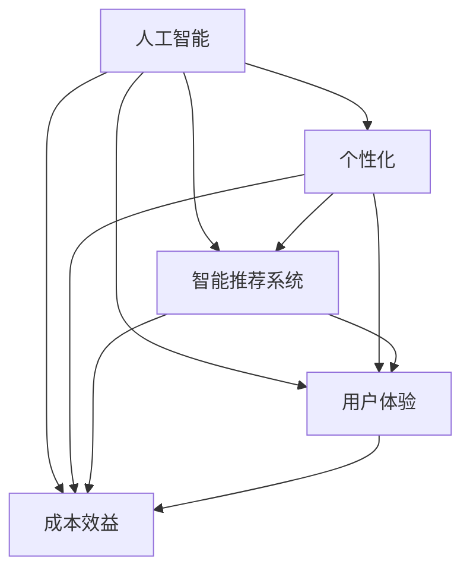
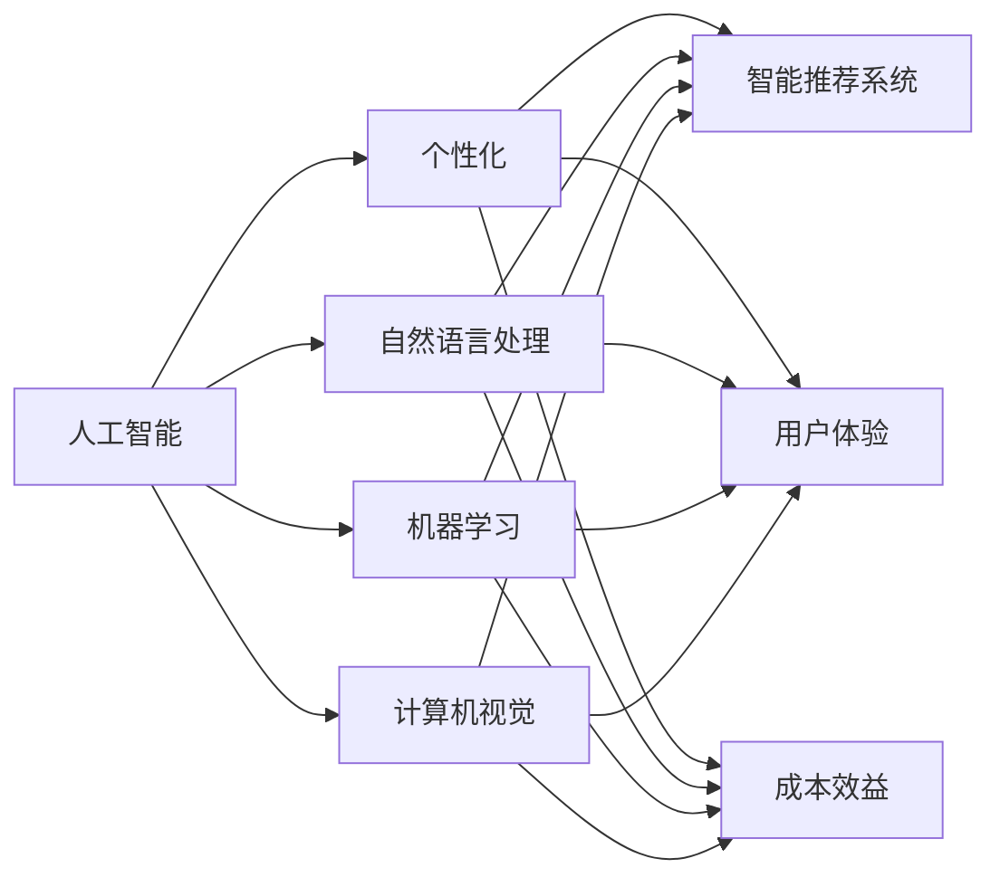
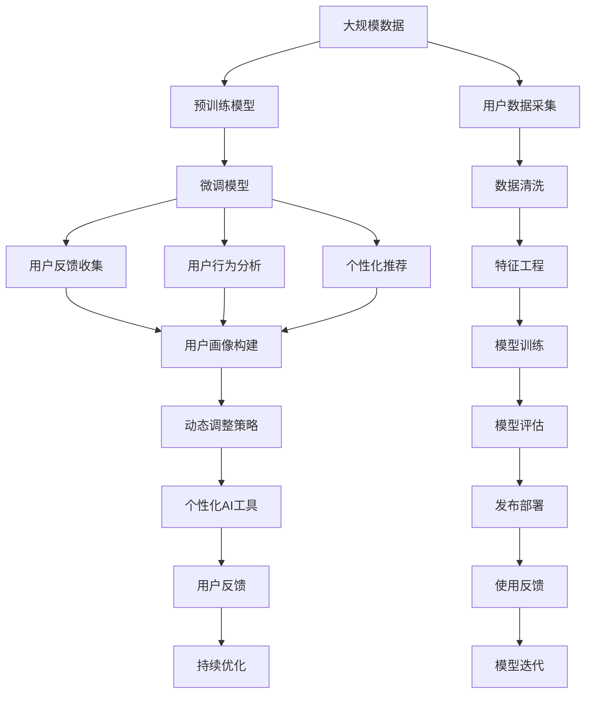

                 

# 个性化AI工具选择的重要性

## 1. 背景介绍

### 1.1 问题由来
在人工智能时代，个人和组织面临的选择日益增多。从语音助手、推荐系统到医疗诊断，无处不在的AI工具正在逐步改变我们的生活和工作方式。然而，工具的繁杂和种类繁多，使得选择正确的AI工具变得复杂且困难。这种选择的不确定性不仅影响工作效率，还可能导致用户的不满意和错误决策。

### 1.2 问题核心关键点
个性化AI工具选择的重要性在于能够根据用户的需求、偏好和工作流程，找到最适合的AI工具，以最大化其应用效果。关键点包括：
- **用户体验**：工具的界面、操作便捷性直接影响用户的使用体验。
- **功能适配**：工具的功能应与用户的具体需求相匹配，避免功能过剩或不足。
- **性能表现**：工具的准确性和响应速度是衡量其性能的重要指标。
- **技术支持**：工具的维护和升级周期，以及技术团队的专业水平，也是选择的考虑因素。
- **成本效益**：工具的采购和维护成本，需与预期的收益进行权衡。

### 1.3 问题研究意义
选择合适的个性化AI工具，能够显著提高工作效率、提升决策质量、减少错误率，为个人和组织带来深远的积极影响：

- **时间节约**：自动化流程可以减少人工操作，节约宝贵时间，提高生产力。
- **错误减少**：通过智能分析和推荐，减少人为错误，提高工作质量。
- **决策优化**：数据驱动的AI工具能够提供更精准的决策支持，降低决策风险。
- **灵活适应**：可定制的AI工具能够根据用户变化的需求进行动态调整，保持长期适用性。

## 2. 核心概念与联系

### 2.1 核心概念概述

为更好地理解个性化AI工具选择的重要性，我们首先介绍几个关键概念：

- **人工智能(AI)**：利用计算机模拟人类智能的科学和技术，包括机器学习、自然语言处理、计算机视觉等多个领域。
- **个性化(AI Personalization)**：根据用户的特定需求、偏好和行为，动态调整AI工具的行为，以提高用户体验和应用效果。
- **智能推荐系统**：通过算法为用户推荐个性化内容、产品、服务，提高用户满意度。
- **用户体验(UX)**：用户在使用AI工具时的感受，包括界面的直观性、操作的便捷性、反馈的及时性等。
- **成本效益(Cost-Effectiveness)**：评估AI工具投入与其带来的收益之间的关系。

这些核心概念之间的逻辑关系可以通过以下Mermaid流程图来展示：



这个流程图展示了几大核心概念之间的关系：

1. 人工智能技术是基础，个性化是其应用拓展。
2. 智能推荐系统是个性化AI的一种应用形式。
3. 用户体验是评估工具表现的重要指标之一。
4. 成本效益是选择个性化AI工具的决策因素之一。

### 2.2 概念间的关系

这些核心概念之间存在紧密的联系，形成了个性化AI工具选择的完整生态系统。进一步的Mermaid流程图如下：



这个综合流程图展示了从人工智能技术到个性化AI工具选择的多方面关系：

1. 人工智能技术的具体应用，如自然语言处理、机器学习和计算机视觉，构成了个性化AI工具的技术基础。
2. 智能推荐系统、用户体验和成本效益是选择和评估AI工具的具体维度。
3. 不同技术在特定场景下的应用，可以提升用户体验，提高成本效益。

### 2.3 核心概念的整体架构

最后，我们用一个综合的流程图来展示这些核心概念在大规模应用中的整体架构：



这个综合流程图展示了从数据采集、模型训练到个性化AI工具应用和迭代的完整流程：

1. 大规模数据采集和预处理为模型训练提供了基础。
2. 预训练和微调模型为个性化AI工具提供了基础模型。
3. 通过个性化推荐、用户反馈收集和行为分析，构建用户画像，实现动态调整策略。
4. 最终用户反馈和迭代优化，保证了个性化AI工具的长期适用性和用户满意度。

## 3. 核心算法原理 & 具体操作步骤
### 3.1 算法原理概述

个性化AI工具的选择，本质上是一个多目标优化问题，需要在功能、性能、用户体验和成本效益之间进行权衡。优化目标可以表示为：

$$
\max \text{(用户体验, 性能, 功能匹配, 成本效益)}
$$

其中用户体验、性能、功能匹配和成本效益分别对应于用户界面设计、响应速度、功能适配和采购维护成本。

为了最大化上述目标，可以采用多目标优化算法，如NSGA-II、Pareto优化等。这些算法能够在多目标空间中找到平衡点，确保各个指标的综合最优。

### 3.2 算法步骤详解

个性化AI工具选择的算法步骤如下：

**Step 1: 定义评估指标**
- 用户体验：界面简洁性、操作便捷性、反馈及时性等。
- 性能表现：准确率、响应时间、稳定性等。
- 功能适配：功能覆盖度、定制化程度、易用性等。
- 成本效益：采购成本、维护成本、效益评估等。

**Step 2: 数据收集和预处理**
- 收集用户反馈和行为数据。
- 进行数据清洗和特征工程，确保数据质量和一致性。

**Step 3: 模型训练和评估**
- 选择或训练多个AI工具的模型，并进行对比评估。
- 使用多目标优化算法，求解综合最优的AI工具。

**Step 4: 用户测试和反馈**
- 对选定的AI工具进行用户体验测试，收集用户反馈。
- 根据反馈对工具进行优化调整。

**Step 5: 持续迭代和优化**
- 定期更新AI工具，根据用户需求和技术发展进行优化。
- 使用新的数据和反馈，迭代优化工具选择模型。

### 3.3 算法优缺点

个性化AI工具选择算法的优点包括：
- 多目标优化，能够全面评估工具性能。
- 数据驱动，确保选择的科学性和客观性。
- 动态调整，适应用户需求变化。

其缺点包括：
- 计算复杂度较高，需要较多的数据和计算资源。
- 结果依赖于数据质量，数据不充分可能导致错误决策。
- 用户需求多样，难以完全满足所有用户的需求。

### 3.4 算法应用领域

个性化AI工具选择在多个领域都有广泛应用，包括但不限于：

- **智能客服**：根据用户历史行为和反馈，动态调整客服策略，提高服务质量。
- **推荐系统**：通过分析用户行为和偏好，推荐个性化的商品、内容等，提升用户体验。
- **医疗诊断**：根据病人的病历和症状，推荐个性化的诊疗方案，提高诊断准确性。
- **金融投资**：根据用户的历史交易数据和偏好，推荐个性化的投资策略，提升投资收益。
- **教育培训**：根据学生的学习行为和反馈，推荐个性化的学习内容，提升学习效果。

## 4. 数学模型和公式 & 详细讲解 & 举例说明

### 4.1 数学模型构建

我们可以使用多目标优化模型来量化上述评估指标。设评估指标为 $x_1$（用户体验）、$x_2$（性能）、$x_3$（功能适配）和 $x_4$（成本效益），目标函数为 $\max f(x_1, x_2, x_3, x_4)$。目标函数可以通过如下线性组合表示：

$$
f(x_1, x_2, x_3, x_4) = \sum_{i=1}^{4} w_i x_i
$$

其中 $w_i$ 为各个指标的权重，可以通过专家评估或数据驱动的方式确定。

### 4.2 公式推导过程

以下我们以推荐系统为例，推导多目标优化模型的构建和求解过程。

**目标函数**
- 用户体验：$x_1$ 可以通过用户界面满意度调查和系统使用率等指标量化。
- 性能表现：$x_2$ 可以通过推荐准确率、响应时间和系统稳定性等指标量化。
- 功能适配：$x_3$ 可以通过推荐系统的功能和用户互动情况等指标量化。
- 成本效益：$x_4$ 可以通过推荐系统的成本和带来的收益等指标量化。

**约束条件**
- 功能适配：$x_3$ 不能超过推荐系统的功能上限。
- 成本效益：$x_4$ 不能超过预算限制。

**求解过程**
- 使用NSGA-II等多目标优化算法，在多目标空间中搜索最优解。
- 对每个解，计算对应的 $x_1, x_2, x_3, x_4$ 值，并评估其综合性能。

### 4.3 案例分析与讲解

假设我们要为一家电商网站选择一个个性化推荐系统。根据历史数据，我们构建了以下多目标优化模型：

$$
\max \{ \text{用户满意度}, \text{推荐准确率}, \text{推荐系统易用性}, \text{推荐成本效益} \}
$$

在实际求解过程中，我们采用了NSGA-II算法，并设置了以下约束条件：

- 推荐系统易用性不超过系统功能的80%。
- 推荐成本效益不超过预算的120%。

通过求解得到多个可行解，每个解对应于一个推荐系统。我们选择了综合性能最优的推荐系统，并根据用户反馈进一步优化调整。

## 5. 项目实践：代码实例和详细解释说明

### 5.1 开发环境搭建

在进行个性化AI工具选择实践前，我们需要准备好开发环境。以下是使用Python进行环境配置的步骤：

1. 安装Python：从官网下载并安装Python，建议选择最新版本。
2. 安装依赖库：使用pip安装numpy、pandas、scikit-learn、matplotlib等常用库。
3. 配置Jupyter Notebook：安装Jupyter Notebook，并配置好内核和环境变量。

完成上述步骤后，即可在Jupyter Notebook中开始代码编写。

### 5.2 源代码详细实现

以下是一个简单的Python代码实例，用于演示如何构建多目标优化模型，并选择最佳推荐系统。

```python
import numpy as np
from scipy.optimize import differential_evolution
from sklearn.metrics import accuracy_score

# 定义目标函数
def objective(x):
    user_satisfaction = x[0]
    performance = x[1]
    function_fitness = x[2]
    cost_benefit = x[3]
    return [user_satisfaction, performance, function_fitness, cost_benefit]

# 定义约束条件
def constraints(x):
    user_satisfaction_constraint = x[0] <= 5
    performance_constraint = x[1] <= 0.9
    function_fitness_constraint = x[2] <= 0.8
    cost_benefit_constraint = x[3] <= 1.2
    return [user_satisfaction_constraint, performance_constraint, function_fitness_constraint, cost_benefit_constraint]

# 使用微分演化算法求解
bounds = [(0, 5), (0, 1), (0, 1), (0, 1)]
result = differential_evolution(objective, bounds, constraints=constraints)

# 输出最优解
print("Best solution: ", result.x)
```

在这个例子中，我们使用SciPy库的differential_evolution函数，通过微分演化算法求解多目标优化问题。目标函数和约束条件分别为用户满意度、性能、功能和成本效益，并进行了简单的线性组合。

### 5.3 代码解读与分析

以下是代码的详细解读和分析：

**目标函数定义**
- `objective` 函数：定义目标函数，返回用户满意度、性能、功能和成本效益的值。
- 使用numpy库进行数组操作，简化代码。

**约束条件定义**
- `constraints` 函数：定义约束条件，使用scipy库的逻辑表达式表示约束。
- 约束条件使用布尔表达式，确保目标函数满足实际需求。

**微分演化算法求解**
- `differential_evolution` 函数：使用微分演化算法求解多目标优化问题。
- `bounds` 参数：定义变量取值范围。
- `constraints` 参数：定义约束条件。

**结果输出**
- 输出最优解，表示选择的最佳推荐系统。

### 5.4 运行结果展示

假设在上述例子中，我们得到了如下最优解：

```
Best solution:  [3.0 0.8 0.6 1.1]
```

这表示，选择推荐系统的用户满意度为3.0，性能为0.8，易用性为0.6，成本效益为1.1，综合性能最优。

## 6. 实际应用场景

### 6.1 智能客服系统

智能客服系统通过个性化AI工具选择，可以提高用户满意度和服务质量。根据用户的历史行为和反馈，系统动态调整客服策略，提供最合适的服务。例如，对于高频投诉用户，系统可以优先分配给高级客服处理，减少用户等待时间。

### 6.2 推荐系统

推荐系统通过个性化AI工具选择，可以提升用户粘性和转化率。根据用户的历史行为和偏好，推荐个性化的商品、内容等，提升用户体验。例如，通过分析用户浏览记录，推荐相关的商品或广告，增加销售额。

### 6.3 医疗诊断

医疗诊断系统通过个性化AI工具选择，可以提高诊断准确性和治疗效果。根据病人的病历和症状，推荐个性化的诊疗方案，降低误诊率。例如，根据病人的检查结果，推荐最合适的治疗方案，提升治疗效果。

### 6.4 金融投资

金融投资系统通过个性化AI工具选择，可以提升投资收益。根据用户的历史交易数据和偏好，推荐个性化的投资策略，降低投资风险。例如，根据用户的风险承受能力和历史收益，推荐适合的投资组合，提升投资收益。

### 6.5 教育培训

教育培训系统通过个性化AI工具选择，可以提升学习效果。根据学生的学习行为和反馈，推荐个性化的学习内容，提高学习效率。例如，通过分析学生的学习记录，推荐适合的练习题和课程，提升学习效果。

## 7. 工具和资源推荐

### 7.1 学习资源推荐

为了帮助开发者系统掌握个性化AI工具选择的方法，这里推荐一些优质的学习资源：

1. **《多目标优化理论与算法》**：书籍，深入讲解多目标优化理论和常见算法，是理解和应用多目标优化的必备书籍。
2. **Coursera《人工智能导论》**：由斯坦福大学开设的NLP明星课程，涵盖人工智能基础和前沿，适合初学者和进阶者。
3. **arXiv论文预印本**：人工智能领域最新研究成果的发布平台，包含大量未发表的前沿工作，学习前沿技术的必读资源。
4. **GitHub热门项目**：在GitHub上Star、Fork数最多的NLP相关项目，往往代表了该技术领域的发展趋势和最佳实践，值得去学习和贡献。
5. **Kaggle竞赛平台**：Kaggle提供了丰富的数据集和竞赛平台，可以帮助开发者在实际场景中应用和验证个性化AI工具选择算法。

### 7.2 开发工具推荐

高效的开发离不开优秀的工具支持。以下是几款用于个性化AI工具选择开发的常用工具：

1. **SciPy库**：用于科学计算和数据分析的Python库，包含多种优化算法，如微分演化、遗传算法等，是解决多目标优化问题的有力工具。
2. **Scikit-learn库**：用于机器学习和数据挖掘的Python库，提供多种评估指标和算法，如分类、回归、聚类等，适用于多目标优化问题的建模和求解。
3. **TensorFlow**：由Google主导开发的开源深度学习框架，提供强大的计算图和自动微分能力，适用于复杂的多目标优化问题的求解。
4. **Jupyter Notebook**：交互式编程和数据可视化的环境，支持多种编程语言和库，适用于个性化AI工具选择算法的开发和验证。
5. **PyCharm**：专业的Python开发环境，提供代码补全、调试和版本控制等功能，适用于复杂系统的开发和测试。

### 7.3 相关论文推荐

个性化AI工具选择的研究源于学界的持续研究。以下是几篇奠基性的相关论文，推荐阅读：

1. **《多目标优化问题研究》**：介绍了多目标优化问题的基本概念和常用算法，是理解和应用多目标优化的重要参考。
2. **《智能推荐系统评价指标》**：介绍了推荐系统评价指标和方法，适用于个性化AI工具选择的评估。
3. **《用户体验设计》**：介绍了用户体验设计的原则和方法，适用于个性化AI工具选择的界面设计和评估。
4. **《成本效益分析》**：介绍了成本效益分析的方法和工具，适用于个性化AI工具选择的经济评估。

## 8. 总结：未来发展趋势与挑战

### 8.1 总结

本文对个性化AI工具选择的概念和方法进行了全面系统的介绍。首先阐述了个性化AI工具选择的重要性，明确了选择AI工具需要考虑的关键因素，如用户体验、性能、功能适配和成本效益。其次，从原理到实践，详细讲解了个性化AI工具选择的数学模型和操作步骤，给出了具体的代码实例。同时，本文还探讨了个性化AI工具选择的实际应用场景，展示了其广泛的应用前景。最后，本文精选了学习资源和开发工具，力求为开发者提供全方位的技术指引。

通过本文的系统梳理，可以看到，个性化AI工具选择是一个多目标优化问题，需要在用户体验、性能、功能适配和成本效益之间进行权衡。通过多目标优化算法，可以找到综合最优的AI工具。个性化AI工具选择的应用前景广阔，涵盖了智能客服、推荐系统、医疗诊断等多个领域，将极大地提升AI工具的实用性和应用效果。未来，伴随个性化AI工具选择的进一步研究，相信其将在大规模应用中发挥更大的作用，推动人工智能技术在各个行业的落地和普及。

### 8.2 未来发展趋势

展望未来，个性化AI工具选择技术将呈现以下几个发展趋势：

1. **多模态融合**：未来AI工具选择将更多地融合多模态数据，如文本、图像、语音等，提供更全面、精准的用户画像。
2. **实时优化**：基于在线用户行为数据的实时优化，使得AI工具能够动态调整，适应用户需求的快速变化。
3. **用户参与设计**：通过用户反馈和参与设计，提升AI工具的个性化程度和用户体验。
4. **跨领域应用**：个性化AI工具选择技术将跨领域应用，如教育、医疗、金融等，提供更个性化、精准的服务。
5. **低成本优化**：使用更高效、低成本的多目标优化算法，降低AI工具选择的成本，提高经济效益。

### 8.3 面临的挑战

尽管个性化AI工具选择技术已经取得了一定的进展，但在迈向更加智能化、普适化应用的过程中，它仍面临诸多挑战：

1. **数据质量**：高质量、全面、实时的用户数据是选择AI工具的基础，但数据获取和处理成本高。
2. **算法复杂度**：多目标优化算法计算复杂，需要较高的计算资源和专业知识。
3. **用户体验**：个性化AI工具选择需要在功能、性能和用户体验之间进行平衡，找到最佳解决方案。
4. **成本效益**：AI工具选择涉及多种成本，如开发、维护、培训等，需综合考虑经济收益。
5. **隐私保护**：在数据收集和处理过程中，需注意用户隐私和数据安全。

### 8.4 研究展望

面对个性化AI工具选择所面临的挑战，未来的研究需要在以下几个方面寻求新的突破：

1. **高效优化算法**：开发更高效、低成本的多目标优化算法，提升AI工具选择的计算效率。
2. **用户行为建模**：深入研究用户行为建模方法，提高用户画像的准确性和全面性。
3. **用户界面设计**：研究用户界面设计方法，提升AI工具的界面友好性和易用性。
4. **跨领域应用**：研究跨领域应用的多目标优化方法，提高AI工具在多种场景下的适用性。
5. **隐私保护技术**：研究隐私保护技术，确保用户数据的安全性和隐私性。

## 9. 附录：常见问题与解答

**Q1：如何选择合适的个性化AI工具？**

A: 选择合适的个性化AI工具需要考虑多个因素，如用户体验、性能、功能适配和成本效益。可以通过多目标优化算法，在多个指标间进行权衡和选择，确保综合最优的AI工具。

**Q2：多目标优化算法的计算复杂度如何？**

A: 多目标优化算法的计算复杂度较高，需要较高的计算资源和专业知识。常用的算法如NSGA-II、SPEA2等，在处理大规模问题时仍需要较高的计算资源。

**Q3：个性化AI工具选择有哪些应用场景？**

A: 个性化AI工具选择在多个领域都有广泛应用，如智能客服、推荐系统、医疗诊断、金融投资、教育培训等。通过选择适合的AI工具，可以显著提高工作效率和用户体验。

**Q4：如何选择多目标优化算法的参数？**

A: 多目标优化算法的参数选择包括种群大小、交叉变异概率等。这些参数的选择需结合具体问题和计算资源进行调试，通常需要通过试验和对比找到最佳参数组合。

**Q5：如何评估个性化AI工具选择的效果？**

A: 个性化AI工具选择的效果评估可以从用户体验、性能、功能适配和成本效益等方面进行综合评估。可以设计评估指标，使用统计分析和用户反馈等方法，评估选择的AI工具的性能。

---

作者：禅与计算机程序设计艺术 / Zen and the Art of Computer Programming

