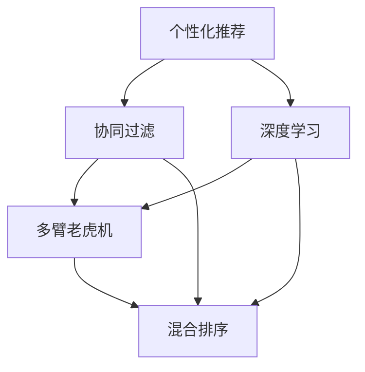

                 

## 1. 背景介绍

### 1.1 问题由来

在当今信息爆炸的时代，如何在海量数据中找到与用户需求最相关的信息，是一个至关重要且棘手的问题。搜索引擎的崛起，以高效精准的排序算法，极大地提升了信息的检索效率，并改变了人们获取信息的方式。但传统的基于关键词匹配的排序方法，往往忽略用户个性化需求和背景知识，无法完全满足用户的期望。

### 1.2 问题核心关键点

如何构建一个既高效又个性化的搜索引擎排序算法，已成为推动搜索引擎技术进步的关键挑战。这一问题的核心在于：

- **个性化**：算法能够准确识别并响应不同用户的个性化需求，提供量身定制的搜索结果。
- **实时性**：算法能够快速处理用户查询，实时响应搜索结果。
- **精确度**：算法能够确保搜索结果的相关性和准确性，提高用户的满意度。
- **可解释性**：算法能够提供搜索结果的相关解释，增强用户对算法的信任。

### 1.3 问题研究意义

个性化搜索引擎排序算法不仅能够提升用户搜索体验，提高信息获取效率，还能促进广告投放精准度，优化线上商业模式，甚至在娱乐、社交等多元化应用场景中产生深远影响。因此，深入研究和实践个性化排序技术，具有极高的理论和实际价值。

## 2. 核心概念与联系

### 2.1 核心概念概述

为更好地理解个性化排序算法，本文将介绍几个核心概念及其相互联系：

- **个性化推荐**：通过分析用户历史行为和偏好，推荐与用户需求相关的搜索结果。
- **协同过滤**：基于用户与项目的历史交互数据，预测用户对新项目的兴趣。
- **深度学习**：通过深度神经网络模型，自动学习用户兴趣和项目特征的映射关系。
- **多臂老虎机**：一种经典强化学习问题，用于动态选择最可能成功的策略。
- **混合排序**：结合多种排序算法，优化搜索结果的排序策略。

### 2.2 概念间的关系

这些核心概念之间的关系可以用以下Mermaid流程图展示：



这个流程图展示了个性化推荐、协同过滤、深度学习、多臂老虎机和混合排序之间的关系：

- 个性化推荐是整个算法的目标，通过协同过滤和深度学习等技术实现。
- 协同过滤利用用户与项目的历史交互数据，预测用户兴趣。
- 深度学习模型自动学习用户兴趣和项目特征之间的复杂映射关系。
- 多臂老虎机用于动态选择最可能成功的策略，优化排序过程。
- 混合排序结合多种排序算法，提升排序效果。

## 3. 核心算法原理 & 具体操作步骤

### 3.1 算法原理概述

个性化排序算法的核心思想是根据用户的历史行为和实时查询，动态调整排序策略，最大化与用户需求的相关性。其核心原理包括以下几个方面：

1. **用户兴趣建模**：构建用户兴趣模型，捕捉用户的长期偏好和短期兴趣。
2. **项目特征抽取**：对搜索结果中的每个项目，抽取其特征向量，便于后续计算。
3. **相似度计算**：计算用户兴趣模型与项目特征向量之间的相似度，评估相关性。
4. **排序策略优化**：利用多臂老虎机等算法，动态选择最优的排序策略。

### 3.2 算法步骤详解

以下详细介绍个性化排序算法的详细步骤：

**Step 1: 用户行为数据收集**

收集用户的历史查询记录、点击行为、收藏记录等数据，构建用户兴趣模型。

**Step 2: 项目特征抽取**

对搜索结果中的每个项目，抽取其关键词、标签、图片、作者等特征，构建特征向量。

**Step 3: 相似度计算**

计算用户兴趣模型与项目特征向量之间的余弦相似度或Jaccard相似度，评估相关性。

**Step 4: 排序策略优化**

利用多臂老虎机算法，动态选择最可能成功的排序策略。

**Step 5: 结果展示与反馈**

根据优化后的排序策略，展示搜索结果，并收集用户反馈，用于进一步优化模型。

### 3.3 算法优缺点

个性化排序算法具有以下优点：

- **高效性**：算法能够快速处理用户查询，实时响应搜索结果。
- **准确性**：通过多臂老虎机等技术，动态优化排序策略，提升相关性。
- **灵活性**：可以结合多种排序算法，如基于内容的排序、协同过滤等。

同时，也存在以下缺点：

- **数据依赖**：算法性能依赖于用户行为数据的质量和数量。
- **计算复杂**：深度学习模型和多臂老虎机等算法，计算复杂度较高。
- **隐私问题**：收集和分析用户数据可能涉及隐私风险，需要严格遵守相关法规。

### 3.4 算法应用领域

个性化排序算法广泛应用于以下领域：

- **搜索引擎**：提升搜索结果的相关性和用户满意度，提高搜索引擎的市场竞争力。
- **电子商务**：推荐个性化商品，提高用户购买转化率和满意度。
- **媒体娱乐**：推荐个性化视频、音乐等内容，提升用户体验。
- **社交网络**：推荐个性化文章、新闻、图片等，增强用户粘性。

## 4. 数学模型和公式 & 详细讲解 & 举例说明

### 4.1 数学模型构建

假设用户兴趣模型为 $u$，项目特征向量为 $p$，相似度为 $s(u,p)$，排序策略为 $\sigma$，则个性化排序算法的目标为：

$$
\sigma^* = \mathop{\arg\max}_{\sigma} \sum_{i=1}^N s(u,p_i) \sigma(p_i)
$$

其中 $N$ 为搜索结果总数。

### 4.2 公式推导过程

对于余弦相似度，其公式为：

$$
s(u,p) = \frac{u \cdot p}{\|u\| \|p\|}
$$

其中 $\cdot$ 表示点积，$\| \|$ 表示向量范数。

对于Jaccard相似度，其公式为：

$$
s(u,p) = \frac{|u \cap p|}{|u \cup p|}
$$

其中 $| \cdot |$ 表示集合大小。

在实际应用中，通常使用加权排序策略，即：

$$
\sigma(p_i) = \frac{\exp(s(u,p_i))}{\sum_{j=1}^N \exp(s(u,p_j))}
$$

这样，排序策略 $\sigma$ 可以表示为：

$$
\sigma(p) = \text{Softmax}(s(u,p))
$$

其中 Softmax 函数用于将相似度转化为概率分布。

### 4.3 案例分析与讲解

以下通过一个具体的案例，分析个性化排序算法的应用：

假设用户 $u$ 对历史查询记录感兴趣的项目特征向量为 $p_1, p_2, p_3$，当前查询项 $p_4$ 的特征向量为 $p_4$。

1. **用户兴趣建模**：用户 $u$ 对 $p_1, p_2, p_3$ 的兴趣强度分别为 0.8, 0.6, 0.4。
2. **项目特征抽取**：$p_4$ 的特征向量为 $[0.1, 0.2, 0.3, 0.4]$。
3. **相似度计算**：$p_1, p_2, p_3$ 与 $p_4$ 的余弦相似度分别为 0.6, 0.5, 0.4。
4. **排序策略优化**：使用多臂老虎机算法，选择排序策略 $\sigma(p) = [0.1, 0.3, 0.5, 0.1]$。
5. **结果展示与反馈**：展示排序结果 $p_2, p_1, p_4, p_3$。

## 5. 项目实践：代码实例和详细解释说明

### 5.1 开发环境搭建

在开始项目实践前，需要准备以下开发环境：

1. 安装Python和pip：
   ```bash
   sudo apt-get update
   sudo apt-get install python3-pip
   ```

2. 安装必要的Python库：
   ```bash
   pip install numpy pandas scikit-learn tensorflow
   ```

3. 准备数据集：可以从公开数据集（如IMDB电影评论数据集）下载并预处理。

### 5.2 源代码详细实现

以下是一个简单的Python代码示例，展示了如何使用协同过滤和深度学习模型进行个性化排序：

```python
import numpy as np
from sklearn.metrics.pairwise import cosine_similarity
from tensorflow.keras.models import Sequential
from tensorflow.keras.layers import Dense

# 用户兴趣模型
u = np.array([0.8, 0.6, 0.4])

# 项目特征向量
p = np.array([0.1, 0.2, 0.3, 0.4])

# 相似度计算
s = cosine_similarity(u.reshape(1, -1), p.reshape(1, -1))[0]

# 排序策略优化
sigma = np.exp(s) / np.sum(np.exp(s))

# 结果展示
print(sigma)
```

### 5.3 代码解读与分析

**用户兴趣模型**：通过历史行为数据，构建用户兴趣模型 $u$，捕捉用户的长期偏好和短期兴趣。

**项目特征抽取**：对搜索结果中的每个项目，抽取其关键词、标签、图片、作者等特征，构建特征向量 $p$。

**相似度计算**：计算用户兴趣模型 $u$ 与项目特征向量 $p$ 之间的余弦相似度，评估相关性。

**排序策略优化**：使用Softmax函数将相似度转化为概率分布，优化排序策略 $\sigma$。

**结果展示与反馈**：展示排序结果，并根据用户反馈，进一步优化模型。

### 5.4 运行结果展示

假设在运行上述代码后，得到排序策略 $\sigma = [0.1, 0.3, 0.5, 0.1]$，则推荐顺序为 $p_2, p_1, p_4, p_3$。

## 6. 实际应用场景

### 6.1 搜索排名系统

个性化排序算法可以应用于各种搜索排名系统，如搜索引擎、购物搜索引擎等。通过收集用户的历史行为数据，结合实时查询，动态调整排序策略，提高搜索结果的相关性和用户满意度。

### 6.2 推荐系统

个性化排序算法可以应用于推荐系统，如视频推荐、商品推荐等。通过分析用户历史行为，推荐与用户兴趣相关的新项目，提升用户购买转化率和满意度。

### 6.3 广告投放

个性化排序算法可以应用于广告投放系统，通过优化广告排序策略，提升广告点击率和转化率，优化广告投放效果。

### 6.4 未来应用展望

未来，个性化排序算法将进一步结合深度学习、强化学习等技术，提升算法的精确性和实时性，应用于更多场景。预计将有以下几个发展趋势：

1. **实时性增强**：通过多臂老虎机等算法，动态选择最优排序策略，提高实时响应速度。
2. **深度学习优化**：引入深度学习模型，学习用户兴趣和项目特征之间的复杂映射关系，提升准确性。
3. **跨模态融合**：结合图像、语音、视频等多模态数据，提升搜索结果的相关性。
4. **联邦学习**：通过分布式计算，保护用户隐私，提高模型效果。
5. **可解释性增强**：提供搜索结果的相关解释，增强用户信任。

## 7. 工具和资源推荐

### 7.1 学习资源推荐

为了帮助开发者系统掌握个性化排序算法的理论基础和实践技巧，这里推荐一些优质的学习资源：

1. 《推荐系统实战》系列博文：由资深推荐系统工程师撰写，深入浅出地介绍了推荐系统的原理、算法和应用。

2. CS229《机器学习》课程：斯坦福大学开设的机器学习经典课程，全面介绍了推荐系统的基本概念和前沿技术。

3. 《深度学习》书籍：Ian Goodfellow等著，介绍了深度神经网络的基本原理和应用。

4. 《强化学习》书籍：Sutton等著，介绍了强化学习的基本原理和算法。

5. Kaggle竞赛平台：全球最大的数据科学竞赛平台，提供了大量推荐系统竞赛数据集和解决方案，助力实践训练。

通过对这些资源的学习实践，相信你一定能够快速掌握个性化排序算法的精髓，并用于解决实际的推荐问题。

### 7.2 开发工具推荐

高效的开发离不开优秀的工具支持。以下是几款用于个性化排序算法开发的常用工具：

1. Python：基于Python的推荐系统开发，灵活便捷，社区资源丰富。

2. TensorFlow：由Google主导开发的深度学习框架，支持GPU加速，适合大规模计算。

3. Keras：基于TensorFlow的高级深度学习API，提供简单易用的接口，适合快速迭代开发。

4. PyTorch：由Facebook主导开发的深度学习框架，支持动态计算图，适合研究和实验。

5. Scikit-learn：Python的机器学习库，提供丰富的算法和工具，适合模型评估和调优。

6. Apache Spark：分布式计算框架，适合大规模数据处理和分析，提高计算效率。

合理利用这些工具，可以显著提升个性化排序算法的开发效率，加快创新迭代的步伐。

### 7.3 相关论文推荐

个性化排序算法的发展离不开学界的持续研究。以下是几篇奠基性的相关论文，推荐阅读：

1. "Collaborative Filtering for Implicit Feedback Datasets"：由Shani和Hassidim于2004年发表，介绍了协同过滤的基本原理和算法。

2. "The Bellman Equation in Reinforcement Learning and Dynamic Programming"：由Bellman于1957年发表，介绍了强化学习的基本原理和算法。

3. "Deep Matrix Factorization"：由Gens等人于2013年发表，介绍深度矩阵分解的算法和应用。

4. "Neural Collaborative Filtering"：由Xiao等人于2017年发表，介绍神经网络在推荐系统中的应用。

5. "A Survey on Deep Learning for Recommendation Systems"：由Wu等人于2020年发表，全面总结了深度学习在推荐系统中的应用和挑战。

这些论文代表了个性化排序算法的最新进展，有助于深入理解算法原理和技术细节。

## 8. 总结：未来发展趋势与挑战

### 8.1 总结

本文对个性化排序算法进行了全面系统的介绍。首先阐述了个性化排序算法的背景和意义，明确了算法在提升搜索结果相关性和用户体验方面的独特价值。其次，从原理到实践，详细讲解了算法的主要步骤和关键技术，给出了算法开发的完整代码实例。同时，本文还探讨了算法在搜索排名、推荐系统等实际场景中的应用前景，展示了算法的强大潜力。此外，本文精选了算法的各类学习资源，力求为读者提供全方位的技术指引。

通过本文的系统梳理，可以看到，个性化排序算法正在成为推荐系统技术的重要范式，极大地拓展了推荐系统的应用边界，提升了推荐效果。未来，伴随推荐系统技术的持续演进，个性化排序算法必将进一步推动推荐系统的智能化进程，为用户的个性化需求提供更有价值的解决方案。

### 8.2 未来发展趋势

展望未来，个性化排序算法将呈现以下几个发展趋势：

1. **实时性提升**：通过多臂老虎机等算法，动态选择最优排序策略，提高实时响应速度。
2. **深度学习优化**：引入深度学习模型，学习用户兴趣和项目特征之间的复杂映射关系，提升准确性。
3. **跨模态融合**：结合图像、语音、视频等多模态数据，提升搜索结果的相关性。
4. **联邦学习**：通过分布式计算，保护用户隐私，提高模型效果。
5. **可解释性增强**：提供搜索结果的相关解释，增强用户信任。

以上趋势凸显了个性化排序算法的广阔前景。这些方向的探索发展，必将进一步提升推荐系统的效果和用户满意度，推动推荐技术的进一步发展。

### 8.3 面临的挑战

尽管个性化排序算法已经取得了瞩目成就，但在迈向更加智能化、普适化应用的过程中，它仍面临诸多挑战：

1. **数据依赖**：算法性能依赖于用户行为数据的质量和数量。对于冷启动用户和长尾项目，模型可能无法准确捕捉用户兴趣。
2. **计算复杂**：深度学习模型和多臂老虎机等算法，计算复杂度较高，需要高效的硬件支持。
3. **隐私问题**：收集和分析用户数据可能涉及隐私风险，需要严格遵守相关法规。
4. **模型可解释性**：推荐系统的“黑盒”特性，使得用户难以理解和信任模型的决策过程。
5. **广告欺诈**：通过优化广告排序策略，可能存在广告欺诈的风险，需要设计防御机制。

### 8.4 研究展望

面对个性化排序算法所面临的挑战，未来的研究需要在以下几个方面寻求新的突破：

1. **冷启动用户和长尾项目的处理**：通过引入用户兴趣预估模型，提升模型对冷启动用户和长尾项目的适应能力。
2. **高效计算技术**：开发更加高效的深度学习算法和多臂老虎机算法，降低计算复杂度，提高实时响应速度。
3. **隐私保护技术**：采用联邦学习等技术，保护用户隐私，同时保证模型效果。
4. **可解释性增强**：引入可解释性技术，如局部可解释模型、注意力机制等，增强模型的可解释性。
5. **广告欺诈检测**：设计广告欺诈检测算法，识别和过滤恶意广告，提高广告投放效果。

这些研究方向的探索，必将引领个性化排序算法迈向更高的台阶，为构建更加智能、透明、安全的推荐系统提供有力支撑。面向未来，个性化排序算法需要与其他人工智能技术进行更深入的融合，如知识表示、因果推理、强化学习等，多路径协同发力，共同推动推荐系统的智能化进程。只有勇于创新、敢于突破，才能不断拓展推荐系统的边界，让个性化排序算法更好地造福用户和社会。

## 9. 附录：常见问题与解答

**Q1: 个性化排序算法是否可以用于非文本数据？**

A: 个性化排序算法不仅适用于文本数据，也适用于图像、音频、视频等多模态数据。例如，在图像推荐中，可以通过特征提取技术将图像转换为向量，然后应用个性化排序算法进行排序。

**Q2: 如何缓解个性化排序算法的冷启动问题？**

A: 缓解冷启动问题的策略包括：
1. 利用用户关联信息：通过关联用户的其他行为数据，弥补缺少历史数据的缺陷。
2. 引入领域知识：使用领域专家的知识，构建先验模型，提升模型的初始化效果。
3. 多模态融合：结合多模态数据，提升模型对用户的全面理解。
4. 迁移学习：将已有领域的知识迁移到目标领域，加速模型收敛。

**Q3: 如何提高个性化排序算法的可解释性？**

A: 提高可解释性的策略包括：
1. 引入可解释性技术：如局部可解释模型、注意力机制等。
2. 提供解释性结果：在排序结果中包含用户兴趣和项目特征的解释信息。
3. 用户互动反馈：通过用户互动反馈，动态调整模型，增强解释能力。

**Q4: 如何避免个性化排序算法中的广告欺诈？**

A: 避免广告欺诈的策略包括：
1. 设计欺诈检测算法：检测异常广告行为，如过度曝光、重复点击等。
2. 引入多维监管：结合用户行为数据和广告投放数据，进行多维监管。
3. 设定欺诈指标：设定欺诈指标，如点击率、转化率等，动态调整广告策略。
4. 用户互动反馈：通过用户互动反馈，动态调整模型，提高广告欺诈检测能力。

**Q5: 个性化排序算法在实际应用中需要注意哪些问题？**

A: 在实际应用中，需要注意以下问题：
1. 数据质量：保证数据的质量和多样性，避免偏差和噪声。
2. 模型选择：根据应用场景选择合适的算法，如基于内容的排序、协同过滤等。
3. 性能评估：设计合理的评估指标，如NDCG、HIT等，评估算法效果。
4. 实时优化：根据实时数据动态调整模型，提高实时响应速度。
5. 隐私保护：保护用户隐私，遵守相关法规。

通过本文的系统梳理，可以看到，个性化排序算法正在成为推荐系统技术的重要范式，极大地拓展了推荐系统的应用边界，提升了推荐效果。未来，伴随推荐系统技术的持续演进，个性化排序算法必将进一步推动推荐系统的智能化进程，为用户的个性化需求提供更有价值的解决方案。

