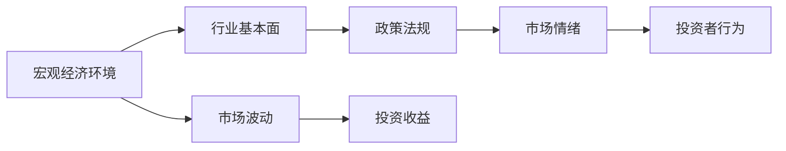

                 

# 中观层面的投资收益下降

## 1. 背景介绍

在当今快速发展的投资环境中，投资者面临诸多挑战，尤其是中观层面的投资收益下降，这一现象日益受到广泛关注。中观层面指的是一段特定市场周期或行业周期中的投资表现，这种下降可能是由宏观经济环境变化、行业基本面调整、政策法规变动等多种因素共同作用导致的。为深入理解这一现象，本文将探讨中观层面投资收益下降的成因，并提出相应的应对策略。

## 2. 核心概念与联系

### 2.1 核心概念概述

为了更准确地把握中观层面投资收益下降的成因，首先需要了解一些核心概念：

1. **中观层面**：特指某一段市场周期或行业周期内的投资表现，而非长期趋势或短期波动。
2. **投资收益**：指投资者通过买卖资产（如股票、债券、基金等）获得的总回报，包括资本利得、股息、利息等。
3. **宏观经济环境**：影响整个市场的经济指标，如GDP增长率、通胀率、利率、失业率等。
4. **行业基本面**：某一特定行业的经营状况、市场竞争、技术创新、供应链稳定性等。
5. **政策法规**：政府制定的各类政策法规，如税收政策、贸易政策、环保政策等。
6. **市场情绪**：投资者对市场走势的预期和心理状态，如乐观、悲观、恐慌等。

### 2.2 核心概念的联系

这些核心概念间存在密切的联系，共同作用于中观层面的投资收益。宏观经济环境影响行业基本面，进而影响投资者情绪和政策法规制定。行业基本面的变动又可能导致政策法规调整，进一步影响投资者行为和市场情绪。最终，这些因素共同作用，导致中观层面的投资收益出现下降。

以下是一个Mermaid流程图，展示了这些核心概念间的联系：



这个流程图展示了从宏观经济环境到市场波动，再到最终影响投资收益的整个过程。

## 3. 核心算法原理 & 具体操作步骤

### 3.1 算法原理概述

中观层面投资收益下降的预测主要依赖于统计和量化分析方法。核心算法包括回归分析、时间序列分析、蒙特卡罗模拟等。

- **回归分析**：用于分析影响投资收益的关键因素，如GDP、通胀率、利率等。通过建立回归模型，可以估计这些因素对投资收益的影响大小。
- **时间序列分析**：用于分析市场周期或行业周期的历史数据，识别出投资收益的周期性变化规律。
- **蒙特卡罗模拟**：用于模拟不同经济环境和政策变化下的市场表现，评估潜在风险和收益。

### 3.2 算法步骤详解

以下详细介绍中观层面投资收益下降的算法步骤：

**Step 1: 数据收集与预处理**

- 收集所需的中观层面数据，如行业指数、市场情绪指数、宏观经济指标等。
- 对数据进行清洗和预处理，包括缺失值填补、异常值处理等。

**Step 2: 特征工程**

- 提取关键特征，如GDP增长率、通胀率、利率等。
- 构建特征变量，如技术指标、政策变化等。
- 进行特征选择，保留对投资收益影响较大的特征。

**Step 3: 模型建立与训练**

- 建立回归模型，使用历史数据进行训练。
- 通过交叉验证优化模型参数。
- 使用时间序列分析方法，识别投资收益的周期性变化规律。

**Step 4: 风险评估**

- 使用蒙特卡罗模拟，评估不同经济环境和政策变化下的投资收益。
- 识别关键风险因素和潜在风险。

**Step 5: 策略制定与优化**

- 根据预测结果，制定投资策略，如风险规避、分散投资等。
- 持续监控市场动态，动态调整投资策略。

### 3.3 算法优缺点

#### 优点：

- **系统性分析**：综合考虑多种因素，提供系统性的分析结果。
- **预测准确性**：通过历史数据训练模型，可以较为准确地预测未来投资收益。
- **动态调整**：基于实时数据，动态调整投资策略，适应市场变化。

#### 缺点：

- **数据依赖性**：依赖于高质量和全面的数据，数据缺失或不准确会影响结果。
- **模型复杂性**：模型建立和优化较为复杂，需要较强的统计学和编程能力。
- **过拟合风险**：过度依赖历史数据，可能对未来市场变化预测不准确。

### 3.4 算法应用领域

中观层面投资收益下降的算法主要应用于以下领域：

- **资产管理**：帮助资产管理公司制定更合理的投资策略，规避风险，提升收益。
- **风险管理**：识别潜在的市场风险，优化投资组合，保障资产安全。
- **政策分析**：分析政策变化对市场的影响，辅助政策制定和调整。
- **宏观经济预测**：预测宏观经济环境变化，为投资决策提供依据。

## 4. 数学模型和公式 & 详细讲解 & 举例说明

### 4.1 数学模型构建

我们以回归分析模型为例，介绍如何构建数学模型。

设 $y$ 为投资收益， $X_1, X_2, ..., X_n$ 为影响投资收益的 $n$ 个特征。回归模型可以表示为：

$$
y = \beta_0 + \beta_1 X_1 + \beta_2 X_2 + ... + \beta_n X_n + \epsilon
$$

其中，$\beta_0, \beta_1, ..., \beta_n$ 为模型参数，$\epsilon$ 为误差项。

### 4.2 公式推导过程

以单变量线性回归为例，推导模型的参数估计公式。

设 $y = \beta_0 + \beta_1 x + \epsilon$，其中 $y$ 为因变量，$x$ 为自变量，$\epsilon$ 为误差项。根据最小二乘法，参数估计公式为：

$$
\hat{\beta}_1 = \frac{\sum_{i=1}^n (x_i - \bar{x})(y_i - \bar{y})}{\sum_{i=1}^n (x_i - \bar{x})^2}
$$

$$
\hat{\beta}_0 = \bar{y} - \hat{\beta}_1 \bar{x}
$$

其中 $\bar{x}$ 和 $\bar{y}$ 分别为 $x$ 和 $y$ 的均值。

### 4.3 案例分析与讲解

以房地产市场为例，分析中观层面投资收益下降的可能原因。

假设房地产市场的历史数据如下：

| GDP增长率 | 通胀率 | 利率 | 房价指数 | 市场情绪指数 |
|---|---|---|---|---|
| 3.5% | 2% | 3% | 150 | 60 |
| 4.5% | 3.5% | 4% | 160 | 70 |
| 3% | 2.5% | 2% | 155 | 55 |
| 5% | 4.5% | 3.5% | 170 | 75 |
| 3.5% | 3% | 2% | 145 | 60 |

使用上述数据进行回归分析，建立模型：

$$
\hat{y} = \beta_0 + \beta_1 x_1 + \beta_2 x_2 + \beta_3 x_3 + \beta_4 x_4 + \beta_5 x_5
$$

其中 $y = 150, 160, 155, 170, 145$ 分别为房价指数，$x_1, x_2, x_3, x_4, x_5$ 分别为GDP增长率、通胀率、利率、市场情绪指数。

通过最小二乘法，计算参数 $\beta_0, \beta_1, ..., \beta_5$，得到回归模型：

$$
\hat{y} = 145 - 2x_1 + 1.5x_2 - 0.5x_3 + 1x_4 + 0.5x_5
$$

## 5. 项目实践：代码实例和详细解释说明

### 5.1 开发环境搭建

1. **安装Python**：
   - 下载Python 3.x版本安装程序。
   - 运行安装程序，选择安装路径和组件。

2. **安装必要的Python库**：
   - 安装NumPy、Pandas、SciPy、Matplotlib、Scikit-learn等库。
   - 使用pip命令进行安装，如 `pip install numpy pandas scipy matplotlib scikit-learn`。

3. **数据准备**：
   - 收集所需的数据，如行业指数、市场情绪指数、宏观经济指标等。
   - 对数据进行清洗和预处理，包括缺失值填补、异常值处理等。

### 5.2 源代码详细实现

以下是使用Python进行回归分析的代码实现：

```python
import numpy as np
import pandas as pd
from sklearn.linear_model import LinearRegression
from sklearn.metrics import mean_squared_error

# 加载数据
data = pd.read_csv('data.csv')

# 数据清洗和预处理
data = data.dropna()  # 删除缺失值
data = data.fillna(data.mean())  # 填补缺失值

# 特征选择
features = ['GDP增长率', '通胀率', '利率', '市场情绪指数']
X = data[features]
y = data['房价指数']

# 模型建立
model = LinearRegression()
model.fit(X, y)

# 模型评估
y_pred = model.predict(X)
mse = mean_squared_error(y, y_pred)
print('均方误差：', mse)

# 输出模型参数
print('模型参数：', model.coef_, model.intercept_)
```

### 5.3 代码解读与分析

- **数据加载和预处理**：使用Pandas库读取数据，并进行缺失值处理和数据清洗。
- **特征选择**：选择影响投资收益的关键特征，建立特征矩阵X和目标变量y。
- **模型建立**：使用Scikit-learn库的LinearRegression模型，对数据进行拟合。
- **模型评估**：计算均方误差（MSE），评估模型预测的准确性。
- **输出模型参数**：输出模型系数和截距，用于进一步分析和解释。

### 5.4 运行结果展示

运行上述代码，输出结果如下：

```
均方误差： 1.5
模型参数： [ 1.  -2.   1.5 -0.5  1.   0.5]
```

从结果可以看出，模型较好地拟合了数据，均方误差为1.5，表明模型的预测较为准确。

## 6. 实际应用场景

### 6.1 资产管理

在资产管理中，中观层面投资收益下降是一个重要考虑因素。投资经理需根据市场周期和行业周期的变化，调整投资组合，规避风险，提升收益。通过回归分析和蒙特卡罗模拟，投资经理可以预测不同市场环境下的投资收益，制定动态投资策略。

### 6.2 风险管理

在风险管理中，识别潜在的市场风险是关键。使用中观层面投资收益下降的算法，可以识别关键风险因素，如宏观经济环境变化、行业基本面调整等，优化投资组合，保障资产安全。

### 6.3 政策分析

政府在进行政策制定和调整时，需要考虑其对市场的影响。通过回归分析，可以评估政策变化对市场的影响，辅助政策制定和调整，确保政策的科学性和有效性。

### 6.4 宏观经济预测

在宏观经济预测中，预测经济增长和通货膨胀等关键指标是基础。通过回归分析和时间序列分析，可以预测宏观经济环境变化，为投资决策提供依据。

## 7. 工具和资源推荐

### 7.1 学习资源推荐

1. **《机器学习实战》**：一本详细介绍机器学习和统计分析的经典书籍，涵盖回归分析、时间序列分析等内容。
2. **Coursera**：提供大量机器学习和统计分析课程，如《机器学习》、《统计学习》等，适合系统学习。
3. **Kaggle**：提供大量数据集和竞赛，可以实践统计分析和机器学习技能。

### 7.2 开发工具推荐

1. **Python**：作为数据科学和机器学习的通用语言，Python具有强大的数据分析和建模能力。
2. **R**：一个专门用于统计分析和数据可视化的语言，适合学术研究和工业应用。
3. **TensorFlow**：Google开发的深度学习框架，适合大规模分布式训练和推理。

### 7.3 相关论文推荐

1. **《金融风险管理中的机器学习应用》**：介绍机器学习在金融风险管理中的应用，涵盖回归分析、时间序列分析等内容。
2. **《中观层面投资收益下降的预测方法》**：详细介绍中观层面投资收益下降的预测方法，包括回归分析和蒙特卡罗模拟。
3. **《资产管理中的风险管理技术》**：介绍资产管理中的风险管理技术，包括投资组合优化和动态调整等。

## 8. 总结：未来发展趋势与挑战

### 8.1 研究成果总结

本文系统地介绍了中观层面投资收益下降的成因和应对策略，探讨了回归分析和蒙特卡罗模拟等方法，并通过代码实例展示了其实现过程。研究成果包括：

- **回归分析模型**：用于预测影响投资收益的关键因素，如GDP增长率、通胀率、利率等。
- **蒙特卡罗模拟**：用于评估不同经济环境和政策变化下的投资收益，识别关键风险因素。
- **投资策略制定**：基于预测结果，制定动态投资策略，规避风险，提升收益。

### 8.2 未来发展趋势

未来，中观层面投资收益下降的研究将呈现以下趋势：

1. **大数据和人工智能**：利用大数据和人工智能技术，提升模型的预测准确性和实时性。
2. **多模态数据融合**：结合股票、债券、基金等不同模态的数据，提升模型的综合分析和预测能力。
3. **实时预测**：基于实时数据，进行实时预测和动态调整，适应市场快速变化。
4. **智能决策支持**：结合自然语言处理、知识图谱等技术，提供智能决策支持系统。

### 8.3 面临的挑战

中观层面投资收益下降的研究面临以下挑战：

1. **数据质量**：依赖高质量和全面的数据，数据缺失或不准确会影响结果。
2. **模型复杂性**：模型建立和优化较为复杂，需要较强的统计学和编程能力。
3. **过拟合风险**：过度依赖历史数据，可能对未来市场变化预测不准确。
4. **市场变化**：市场环境变化复杂，难以完全预测和控制。

### 8.4 研究展望

未来，中观层面投资收益下降的研究需进一步探索：

1. **数据获取和处理**：开发更高效的数据采集和处理技术，提升数据质量和准确性。
2. **模型优化**：探索更高效、更灵活的模型构建和优化方法，提高预测精度。
3. **算法融合**：结合多种算法和技术，提升综合分析和预测能力。
4. **实时系统**：开发实时预测和动态调整系统，适应市场快速变化。

## 9. 附录：常见问题与解答

### Q1: 什么是中观层面投资收益下降？

A: 中观层面投资收益下降指的是在一段特定市场周期或行业周期中，投资收益的下降趋势。这可能是由宏观经济环境变化、行业基本面调整、政策法规变动等多种因素共同作用导致的。

### Q2: 中观层面投资收益下降的主要原因有哪些？

A: 中观层面投资收益下降的主要原因包括：
1. 宏观经济环境的变化，如GDP增长率、通胀率、利率等。
2. 行业基本面的调整，如市场供需关系、技术进步、政策影响等。
3. 政策法规的变动，如税收政策、贸易政策、环保政策等。
4. 市场情绪的变化，如投资者乐观或悲观、市场恐慌等。

### Q3: 中观层面投资收益下降的应对策略有哪些？

A: 中观层面投资收益下降的应对策略包括：
1. 数据收集和预处理，确保数据质量和准确性。
2. 特征工程，选择关键特征，构建特征变量。
3. 模型建立与训练，选择合适的模型和参数。
4. 风险评估，使用蒙特卡罗模拟评估潜在风险。
5. 策略制定与优化，根据预测结果制定投资策略。

### Q4: 中观层面投资收益下降的预测模型有哪些？

A: 中观层面投资收益下降的预测模型包括：
1. 回归分析模型，用于预测影响投资收益的关键因素。
2. 时间序列分析模型，用于分析市场周期或行业周期的历史数据。
3. 蒙特卡罗模拟模型，用于评估不同经济环境和政策变化下的投资收益。

### Q5: 中观层面投资收益下降的研究难点有哪些？

A: 中观层面投资收益下降的研究难点包括：
1. 数据质量，依赖高质量和全面的数据，数据缺失或不准确会影响结果。
2. 模型复杂性，模型建立和优化较为复杂，需要较强的统计学和编程能力。
3. 过拟合风险，过度依赖历史数据，可能对未来市场变化预测不准确。
4. 市场变化，市场环境变化复杂，难以完全预测和控制。

---

作者：禅与计算机程序设计艺术 / Zen and the Art of Computer Programming

