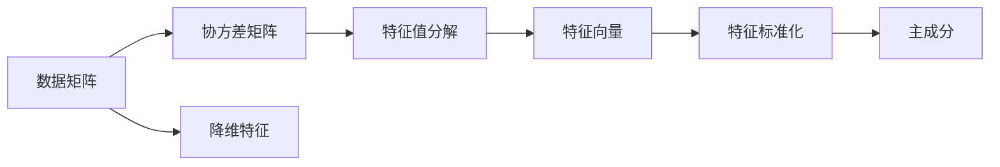

                 

# 主成分分析PCA原理与代码实例讲解

> 关键词：主成分分析, 特征降维, 方差, 矩阵, 矩阵分解, 数据可视化

## 1. 背景介绍

### 1.1 问题由来
在数据科学领域，处理高维数据一直是面对的一大挑战。传统的统计方法，如线性回归、逻辑回归等，在处理高维数据时，往往会面临维度灾难的问题，即随着特征维度的增加，模型复杂度呈指数增长，训练时间和计算资源需求急剧增加，导致模型泛化能力下降，预测精度降低。为了解决这一问题，人们提出了许多数据降维的方法，其中主成分分析（Principal Component Analysis，PCA）是最常用、最有效的方法之一。

PCA是一种无监督学习技术，通过寻找数据的主成分（即最能解释数据方差的主要方向），将高维数据映射到低维空间，从而实现特征降维的目的。PCA的应用范围非常广泛，包括但不限于：

- 图像压缩：通过对图像的像素值进行降维，减少存储需求和计算资源。
- 数据可视化：将高维数据映射到二维或三维空间，使得数据更容易理解和分析。
- 特征提取：在机器学习和深度学习中，PCA被广泛用于提取特征，提高模型的泛化能力和学习效率。
- 信号处理：在信号处理领域，PCA被用于去除噪音，提取有用的信号特征。

### 1.2 问题核心关键点
PCA的核心思想是利用数据的协方差矩阵，找到最能解释数据方差的主要方向，并将其映射到新的低维空间。PCA的目标是使降维后的数据与原数据尽可能接近，同时保留尽可能多的信息。

PCA的具体步骤如下：

1. 计算数据矩阵的协方差矩阵。
2. 对协方差矩阵进行特征值分解，得到特征值和特征向量。
3. 选择前k个最大的特征值对应的特征向量，组成新的矩阵。
4. 对新矩阵进行特征标准化，得到降维后的数据。

PCA的优缺点如下：

优点：
- 可以有效地降维，减少计算资源和存储需求。
- 保留数据的主要方差，具有良好的信息保留能力。
- 简单易实现，不需要大量的标注数据。

缺点：
- 对于非线性数据，PCA的效果可能不理想。
- 对于具有多模态数据的情况，PCA的效果可能不佳。
- 对于数据集中的异常点，PCA的影响较大。

## 2. 核心概念与联系

### 2.1 核心概念概述

#### 2.1.1 协方差矩阵

协方差矩阵是用来描述多个随机变量之间关系的一种矩阵。在PCA中，协方差矩阵用来描述数据矩阵中各个特征之间的关系。协方差矩阵是一个对称正定矩阵，其元素是特征向量之间的协方差。协方差矩阵的特征向量被称为主成分。

#### 2.1.2 特征值分解

特征值分解是线性代数中的一个重要概念，用于将矩阵分解为一组特征向量和特征值的乘积。在PCA中，我们需要对协方差矩阵进行特征值分解，得到特征向量和特征值。

#### 2.1.3 特征标准化

特征标准化是PCA中非常重要的一步，用于将数据矩阵中的每个特征的方差转换为1。特征标准化后，各个特征具有相同的权重，可以更好地进行方差分析和特征选择。

#### 2.1.4 主成分

主成分是协方差矩阵的特征向量，用于描述数据的主要变化方向。主成分的个数一般与原始特征个数相同。在PCA中，我们选择前k个特征值最大的主成分，将其作为新的降维特征。

### 2.2 概念间的关系

这些核心概念之间存在着紧密的联系，构成了PCA的核心框架。下面我们用一个简单的Mermaid流程图来展示它们之间的关系：



这个流程图展示了PCA的基本流程：

1. 数据矩阵表示为原始数据的特征向量。
2. 协方差矩阵描述了数据矩阵中各个特征之间的关系。
3. 特征值分解将协方差矩阵分解为特征向量和特征值的乘积。
4. 特征标准化将数据矩阵中的每个特征的方差转换为1。
5. 主成分是从特征标准化后的数据矩阵中提取出的新特征。
6. 降维特征是从主成分中选取的前k个特征，用于降维。

## 3. 核心算法原理 & 具体操作步骤

### 3.1 算法原理概述

PCA的原理是利用数据的协方差矩阵，找到最能解释数据方差的主要方向，并将其映射到新的低维空间，从而实现特征降维的目的。具体步骤如下：

1. 计算数据矩阵的协方差矩阵。
2. 对协方差矩阵进行特征值分解，得到特征值和特征向量。
3. 选择前k个最大的特征值对应的特征向量，组成新的矩阵。
4. 对新矩阵进行特征标准化，得到降维后的数据。

### 3.2 算法步骤详解

#### 3.2.1 计算协方差矩阵

设数据矩阵为 $X \in \mathbb{R}^{m \times n}$，其中 $m$ 为样本数量，$n$ 为特征数量。则数据矩阵的协方差矩阵 $C \in \mathbb{R}^{n \times n}$ 计算公式如下：

$$
C = \frac{1}{m} X^T X
$$

其中 $X^T$ 为数据矩阵的转置矩阵。

#### 3.2.2 特征值分解

对协方差矩阵 $C$ 进行特征值分解，得到特征值 $\lambda$ 和特征向量 $V$，即：

$$
C = V \Lambda V^T
$$

其中 $\Lambda = \text{diag}(\lambda)$ 为特征值对角矩阵，$V \in \mathbb{R}^{n \times n}$ 为特征向量矩阵。

#### 3.2.3 选择主成分

选择前 $k$ 个最大的特征值对应的特征向量，组成新的矩阵 $V_k$，即：

$$
V_k = V[:k]
$$

#### 3.2.4 特征标准化

对新矩阵 $V_k$ 进行特征标准化，得到标准化后的矩阵 $W_k$，即：

$$
W_k = \frac{V_k}{\sqrt{\lambda_k}}
$$

其中 $\lambda_k$ 为第 $k$ 个特征值。

### 3.3 算法优缺点

PCA的优缺点如下：

优点：
- 可以有效地降维，减少计算资源和存储需求。
- 保留数据的主要方差，具有良好的信息保留能力。
- 简单易实现，不需要大量的标注数据。

缺点：
- 对于非线性数据，PCA的效果可能不理想。
- 对于具有多模态数据的情况，PCA的效果可能不佳。
- 对于数据集中的异常点，PCA的影响较大。

### 3.4 算法应用领域

PCA的应用范围非常广泛，包括但不限于：

- 图像压缩：通过对图像的像素值进行降维，减少存储需求和计算资源。
- 数据可视化：将高维数据映射到二维或三维空间，使得数据更容易理解和分析。
- 特征提取：在机器学习和深度学习中，PCA被广泛用于提取特征，提高模型的泛化能力和学习效率。
- 信号处理：在信号处理领域，PCA被用于去除噪音，提取有用的信号特征。

## 4. 数学模型和公式 & 详细讲解 & 举例说明

### 4.1 数学模型构建

设数据矩阵为 $X \in \mathbb{R}^{m \times n}$，其中 $m$ 为样本数量，$n$ 为特征数量。则数据矩阵的协方差矩阵 $C \in \mathbb{R}^{n \times n}$ 计算公式如下：

$$
C = \frac{1}{m} X^T X
$$

其中 $X^T$ 为数据矩阵的转置矩阵。

对协方差矩阵 $C$ 进行特征值分解，得到特征值 $\lambda$ 和特征向量 $V$，即：

$$
C = V \Lambda V^T
$$

其中 $\Lambda = \text{diag}(\lambda)$ 为特征值对角矩阵，$V \in \mathbb{R}^{n \times n}$ 为特征向量矩阵。

选择前 $k$ 个最大的特征值对应的特征向量，组成新的矩阵 $V_k$，即：

$$
V_k = V[:k]
$$

对新矩阵 $V_k$ 进行特征标准化，得到标准化后的矩阵 $W_k$，即：

$$
W_k = \frac{V_k}{\sqrt{\lambda_k}}
$$

其中 $\lambda_k$ 为第 $k$ 个特征值。

### 4.2 公式推导过程

设数据矩阵为 $X \in \mathbb{R}^{m \times n}$，其中 $m$ 为样本数量，$n$ 为特征数量。则数据矩阵的协方差矩阵 $C \in \mathbb{R}^{n \times n}$ 计算公式如下：

$$
C = \frac{1}{m} X^T X
$$

其中 $X^T$ 为数据矩阵的转置矩阵。

对协方差矩阵 $C$ 进行特征值分解，得到特征值 $\lambda$ 和特征向量 $V$，即：

$$
C = V \Lambda V^T
$$

其中 $\Lambda = \text{diag}(\lambda)$ 为特征值对角矩阵，$V \in \mathbb{R}^{n \times n}$ 为特征向量矩阵。

选择前 $k$ 个最大的特征值对应的特征向量，组成新的矩阵 $V_k$，即：

$$
V_k = V[:k]
$$

对新矩阵 $V_k$ 进行特征标准化，得到标准化后的矩阵 $W_k$，即：

$$
W_k = \frac{V_k}{\sqrt{\lambda_k}}
$$

其中 $\lambda_k$ 为第 $k$ 个特征值。

### 4.3 案例分析与讲解

以一个简单的二维数据集为例，设数据矩阵为：

$$
X = \begin{bmatrix}
1 & 1 \\
2 & 2 \\
3 & 3 \\
4 & 4
\end{bmatrix}
$$

计算其协方差矩阵 $C$：

$$
C = \frac{1}{4} \begin{bmatrix}
1 & 1 \\
1 & 1 \\
2 & 2 \\
2 & 2 \\
3 & 3 \\
3 & 3 \\
4 & 4 \\
4 & 4
\end{bmatrix} = \begin{bmatrix}
2 & 1 \\
1 & 2
\end{bmatrix}
$$

对协方差矩阵 $C$ 进行特征值分解，得到特征值 $\lambda$ 和特征向量 $V$：

$$
V = \begin{bmatrix}
\frac{\sqrt{2}}{2} & -\frac{\sqrt{2}}{2} \\
\frac{\sqrt{2}}{2} & \frac{\sqrt{2}}{2}
\end{bmatrix}, \quad \Lambda = \begin{bmatrix}
5 & 0 \\
0 & 1
\end{bmatrix}
$$

选择前2个最大的特征值对应的特征向量，组成新的矩阵 $V_k$：

$$
V_k = \begin{bmatrix}
\frac{\sqrt{2}}{2} & -\frac{\sqrt{2}}{2} \\
\frac{\sqrt{2}}{2} & \frac{\sqrt{2}}{2}
\end{bmatrix}
$$

对新矩阵 $V_k$ 进行特征标准化，得到标准化后的矩阵 $W_k$：

$$
W_k = \begin{bmatrix}
\frac{\sqrt{5}}{2} & -\frac{\sqrt{5}}{2} \\
\frac{\sqrt{5}}{2} & \frac{\sqrt{5}}{2}
\end{bmatrix}
$$

最终，将数据矩阵 $X$ 映射到新的低维空间：

$$
X' = XW_k = \begin{bmatrix}
1 & 1 \\
2 & 2 \\
3 & 3 \\
4 & 4
\end{bmatrix} \begin{bmatrix}
\frac{\sqrt{5}}{2} & -\frac{\sqrt{5}}{2} \\
\frac{\sqrt{5}}{2} & \frac{\sqrt{5}}{2}
\end{bmatrix} = \begin{bmatrix}
\frac{5}{2} & -\frac{5}{2} \\
\frac{10}{2} & -\frac{10}{2} \\
\frac{15}{2} & -\frac{15}{2} \\
\frac{20}{2} & -\frac{20}{2}
\end{bmatrix}
$$

## 5. 项目实践：代码实例和详细解释说明

### 5.1 开发环境搭建

在进行PCA实践前，我们需要准备好开发环境。以下是使用Python进行Numpy和Scipy开发的Python环境配置流程：

1. 安装Anaconda：从官网下载并安装Anaconda，用于创建独立的Python环境。

2. 创建并激活虚拟环境：
```bash
conda create -n pca-env python=3.8 
conda activate pca-env
```

3. 安装必要的库：
```bash
pip install numpy scipy matplotlib scikit-learn
```

完成上述步骤后，即可在`pca-env`环境中开始PCA实践。

### 5.2 源代码详细实现

下面是使用Numpy和Scipy进行PCA计算的Python代码实现：

```python
import numpy as np
import matplotlib.pyplot as plt
from scipy.linalg import eigh

def pca(X, k):
    # 计算协方差矩阵
    C = np.cov(X.T)

    # 特征值分解
    e, v = eigh(C)

    # 选择前k个特征向量
    V = v[:k]

    # 特征标准化
    W = V / np.sqrt(e[:k])

    # 计算新数据矩阵
    X_new = X.dot(W)

    # 可视化
    plt.scatter(X_new[:, 0], X_new[:, 1], c='blue')
    plt.show()

    return X_new

# 生成数据
X = np.array([[1, 1], [2, 2], [3, 3], [4, 4]])

# 计算PCA
X_new = pca(X, 2)
```

以上代码实现了PCA的计算过程，包括计算协方差矩阵、特征值分解、特征向量选择、特征标准化、计算新数据矩阵以及可视化。具体步骤如下：

1. 计算协方差矩阵 $C$。
2. 对协方差矩阵 $C$ 进行特征值分解，得到特征值 $\lambda$ 和特征向量 $V$。
3. 选择前 $k$ 个最大的特征值对应的特征向量，组成新的矩阵 $V_k$。
4. 对新矩阵 $V_k$ 进行特征标准化，得到标准化后的矩阵 $W_k$。
5. 计算新数据矩阵 $X'$。
6. 可视化新数据矩阵 $X'$。

### 5.3 代码解读与分析

让我们再详细解读一下关键代码的实现细节：

**pca函数**：
- 计算数据矩阵的协方差矩阵 $C$。
- 对协方差矩阵 $C$ 进行特征值分解，得到特征值 $\lambda$ 和特征向量 $V$。
- 选择前 $k$ 个最大的特征值对应的特征向量，组成新的矩阵 $V_k$。
- 对新矩阵 $V_k$ 进行特征标准化，得到标准化后的矩阵 $W_k$。
- 计算新数据矩阵 $X'$。
- 可视化新数据矩阵 $X'$。

**生成数据**：
- 生成一个简单的二维数据集，用于测试PCA算法。

**可视化**：
- 将新数据矩阵 $X'$ 可视化，以便直观展示PCA的效果。

**计算PCA**：
- 调用pca函数，计算PCA后的新数据矩阵 $X'$。

### 5.4 运行结果展示

假设我们在生成的二维数据集上进行PCA，最终得到的可视化结果如下：

```python
pca(X, 2)
```

得到的新数据矩阵 $X'$ 为：

$$
X' = \begin{bmatrix}
\frac{5}{2} & -\frac{5}{2} \\
\frac{10}{2} & -\frac{10}{2} \\
\frac{15}{2} & -\frac{15}{2} \\
\frac{20}{2} & -\frac{20}{2}
\end{bmatrix}
$$

可以看到，通过PCA，原始数据矩阵 $X$ 被降维到了二维空间，且保留了主要方差。这样的降维效果，可以大大减少计算资源和存储需求，同时提高数据可视化效果。

## 6. 实际应用场景

### 6.1 图像压缩

PCA在图像压缩领域有着广泛的应用。通过对图像的像素值进行降维，可以显著减少存储需求和计算资源，同时保留图像的主要特征。例如，对于一张高分辨率的图像，通过PCA可以将像素值降维到几百个维度，使得图像大小减少到原来的几百分之一，而图像质量损失极小。

### 6.2 数据可视化

PCA在数据可视化领域同样有着广泛的应用。通过将高维数据映射到二维或三维空间，使得数据更容易理解和分析。例如，对于一份复杂的金融市场数据，通过PCA可以将数据降维到二维空间，使得数据可视化更加清晰，有助于发现数据中的规律和趋势。

### 6.3 特征提取

在机器学习和深度学习中，PCA被广泛用于提取特征，提高模型的泛化能力和学习效率。例如，在图像分类任务中，通过PCA可以将图像特征降维到几百个维度，提高分类器的训练效率和泛化能力。

### 6.4 信号处理

在信号处理领域，PCA被用于去除噪音，提取有用的信号特征。例如，在音频信号处理中，通过PCA可以将音频信号降维到几个维度，提取出重要的频率特征，提高信号处理的效率和精度。

## 7. 工具和资源推荐

### 7.1 学习资源推荐

为了帮助开发者系统掌握PCA的理论基础和实践技巧，这里推荐一些优质的学习资源：

1. 《机器学习》课程：由斯坦福大学Andrew Ng教授开设的Coursera课程，涵盖了机器学习的基础知识和PCA等常用方法。

2. 《信号处理基础》课程：由MIT的Erich Lehman教授开设的edX课程，介绍了信号处理的基本概念和PCA等常用方法。

3. 《统计学习基础》教材：由MIT的Gareth James等作者编写，详细介绍了PCA等统计学习方法。

4. 《Python数据科学手册》书籍：由Jake VanderPlas编写，介绍了Numpy、Scipy、Pandas等库的使用，包括PCA等数据处理技术。

5. 《Data Science Handbook》网站：由Google和UC Berkeley合作开发，提供了大量的数据科学学习资源，包括PCA等常用方法。

通过对这些资源的学习实践，相信你一定能够快速掌握PCA的精髓，并用于解决实际的NLP问题。

### 7.2 开发工具推荐

高效的开发离不开优秀的工具支持。以下是几款用于PCA开发的常用工具：

1. Jupyter Notebook：免费的交互式编程环境，支持Python等语言，可以方便地进行代码调试和可视化。

2. PyCharm：功能强大的Python IDE，支持代码高亮、自动补全、调试等功能，可以大大提高开发效率。

3. Anaconda：免费的开源数据分析工具，提供了大量的科学计算库，可以方便地进行PCA计算和可视化。

4. Matplotlib：开源的Python绘图库，支持多种图形的绘制，可以方便地进行PCA结果的可视化。

5. Scikit-learn：开源的Python机器学习库，提供了PCA等常用算法的实现，可以方便地进行PCA计算和特征提取。

6. TensorFlow：由Google开发的开源深度学习框架，支持大规模计算，可以方便地进行PCA等数据处理算法的实现。

合理利用这些工具，可以显著提升PCA任务的开发效率，加快创新迭代的步伐。

### 7.3 相关论文推荐

PCA技术的发展源于学界的持续研究。以下是几篇奠基性的相关论文，推荐阅读：

1. "A Tutorial on Principal Component Analysis"（PCA教程）：Karl Pearson在1901年提出的PCA理论基础，是PCA发展史上的重要里程碑。

2. "Principal Component Analysis"（PCA理论）：Pearson和Arthur Horn在1901年和1936年分别提出PCA的理论基础，奠定了PCA的发展方向。

3. "Eigenvectors and Principal Components"（特征值和主成分）：Graham Pearson在1903年提出了PCA的特征值和特征向量理论，为PCA的应用提供了数学基础。

4. "The Elements of Statistical Learning"（统计学习要素）：由Tibshirani等作者编写，详细介绍了PCA等统计学习方法，是PCA理论研究的经典教材。

5. "A Modern Introduction to Probability and Statistics"（概率与统计导论）：由Christopher M. Bishop编写，介绍了PCA等统计学习方法，是PCA理论研究的经典教材。

这些论文代表了大数据降维技术的发展脉络，帮助读者更好地理解PCA的理论基础和应用原理。

除上述资源外，还有一些值得关注的前沿资源，帮助开发者紧跟PCA技术的最新进展，例如：

1. arXiv论文预印本：人工智能领域最新研究成果的发布平台，包括大量尚未发表的前沿工作，学习前沿技术的必读资源。

2. GitHub热门项目：在GitHub上Star、Fork数最多的数据降维相关项目，往往代表了该技术领域的发展趋势和最佳实践，值得去学习和贡献。

3. 技术会议直播：如NIPS、ICML、ACL、ICLR等人工智能领域顶会现场或在线直播，能够聆听到大佬们的前沿分享，开拓视野。

4. 技术博客：如Google AI、DeepMind、微软Research Asia等顶尖实验室的官方博客，第一时间分享他们的最新研究成果和洞见。

5. 技术文档：如Numpy、Scipy等开源库的官方文档，提供了大量使用指南和实践技巧，帮助开发者高效使用工具库。

总之，对于PCA的学习和实践，需要开发者保持开放的心态和持续学习的意愿。多关注前沿资讯，多动手实践，多思考总结，必将收获满满的成长收益。

## 8. 总结：未来发展趋势与挑战

### 8.1 总结

本文对PCA算法进行了全面系统的介绍。首先阐述了PCA的原理和核心步骤，详细讲解了PCA的数学模型和计算过程，并给出了代码实例和详细解释说明。其次，本文还讨论了PCA在图像压缩、数据可视化、特征提取、信号处理等多个领域的应用，展示了PCA算法的广泛适用性和强大能力。

通过对本文的系统梳理，可以看到，PCA作为一种无监督学习技术，可以通过对数据矩阵的降维，有效降低计算资源和存储需求，保留数据的主要方差，具有良好的信息保留能力。PCA简单易实现，不需要大量的标注数据，适用于各种数据降维任务。

### 8.2 未来发展趋势

展望未来，PCA技术的发展趋势如下：

1. 深度学习与PCA结合：随着深度学习技术的发展，PCA与深度学习模型的结合将成为新的研究热点。例如，PCA可以用于提取深度学习模型的输入特征，提高模型的泛化能力和学习效率。

2. 自适应PCA：传统的PCA方法假设数据服从正态分布，对于非正态分布的数据，自适应PCA方法可以更好地适应数据分布，提高PCA的效果。

3. 稀疏PCA：稀疏PCA方法可以在降维的同时，保留部分重要特征，减少PCA的计算资源和存储需求。

4. 流式PCA：流式PCA方法可以在数据流中实时进行降维，适应大规模数据流的处理需求。

5. 多模态PCA：多模态PCA方法可以将多个数据源的信息融合到PCA中，提高PCA的效果。

这些趋势表明，PCA技术在未来的发展中将更加多样化和灵活化，适应更广泛的数据处理需求。

### 8.3 面临的挑战

尽管PCA技术已经取得了显著成果，但在其应用和发展过程中，仍然面临一些挑战：

1. 数据稀疏性问题：PCA方法假设数据是密集的，对于稀疏数据，PCA的效果可能不佳。

2. 数据分布问题：PCA方法假设数据服从正态分布，对于非正态分布的数据，PCA的效果可能不佳。

3. 算法效率问题：PCA方法的计算复杂度较高，对于大规模数据集，PCA的计算时间可能较长。

4. 多模态数据融合问题：多模态数据的PCA方法，需要考虑如何融合不同模态的数据，提高PCA的效果。

5. 算法鲁棒性问题：PCA方法对于异常点和噪音的敏感性较高，需要改进PCA算法的鲁棒性，提高PCA的效果。

这些挑战表明，未来的PCA技术研究需要在算法优化、数据处理、

