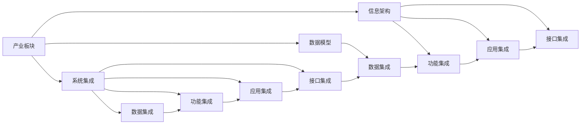

                 

# 产业板块集成信息系统总体构架

> 关键词：集成系统, 产业板块, 信息架构, 数据模型, 系统集成, 安全策略, 业务流程, 用户交互, 系统优化, 未来展望

## 1. 背景介绍

随着数字化转型的深入，各产业板块的信息系统变得越来越复杂，各个系统之间难以有效集成，数据孤岛现象严重，降低了业务效率，增加了运营成本。同时，各产业板块之间存在知识壁垒和业务鸿沟，难以形成协同效应。如何构建一个高效、统一的产业板块集成信息系统，成为提升产业竞争力、推动产业协同创新的关键。

本博文将从整体架构和关键技术两个方面，探讨产业板块集成信息系统的构建思路和实践方法，以期为各产业板块的信息化建设提供指导。

## 2. 核心概念与联系

### 2.1 核心概念概述

为更好地理解产业板块集成信息系统的构建方法，我们首先介绍几个核心概念：

- 产业板块：指某个产业领域内，由多个业务单位构成的有机整体。例如，制造业包括生产、研发、销售、物流等多个环节。
- 集成系统：指将多个独立的信息系统通过技术手段，实现数据、功能、服务等方面的集成，形成一个统一、协调的整体。
- 信息架构（IA）：指规划和组织信息系统中的信息元素和信息流，确保信息的一致性、可访问性和可用性。
- 数据模型：指对信息系统中的数据进行建模，包括数据结构、数据关系、数据流程等方面，是信息架构的基础。
- 系统集成：指将多个系统通过技术手段，实现数据、功能、服务等方面的集成，包括数据集成、功能集成、应用集成、接口集成等。
- 安全策略：指在系统集成过程中，确保数据和信息的安全性，防止数据泄露、篡改等风险。
- 业务流程：指业务活动的一系列步骤、流程和规则，是系统集成的重要参考。
- 用户交互：指用户在系统中的操作、交互和体验，是系统集成的重要组成部分。
- 系统优化：指通过技术手段和业务优化，提升系统的性能、效率和用户体验。
- 未来展望：指对产业板块集成信息系统未来发展方向的预测和展望，包括技术趋势、应用场景、市场需求等方面。

这些核心概念之间存在着紧密的联系，形成一个系统的信息集成框架。

### 2.2 核心概念间的关系

这些核心概念之间的逻辑关系可以通过以下Mermaid流程图来展示：



这个流程图展示了几大核心概念之间的关系：

1. 产业板块作为信息集成的基础，对数据模型、信息架构和系统集成进行统一规划和设计。
2. 数据模型描述了数据结构和数据关系，是信息架构的核心组成部分。
3. 信息架构规划和组织信息系统中的信息元素和信息流，确保信息的一致性、可访问性和可用性。
4. 系统集成通过技术手段，实现数据、功能、服务等方面的集成，包括数据集成、功能集成、应用集成、接口集成等。
5. 安全策略、业务流程、用户交互和系统优化是系统集成的重要参考，在集成过程中需要进行综合考虑。
6. 未来展望指对产业板块集成信息系统未来发展方向的预测和展望，包括技术趋势、应用场景、市场需求等方面。

这些概念共同构成了产业板块集成信息系统的整体框架，为系统设计和开发提供了清晰的指导。

## 3. 核心算法原理 & 具体操作步骤

### 3.1 算法原理概述

产业板块集成信息系统构建的核心算法原理，主要包括以下几个方面：

1. 统一数据模型：构建产业板块内统一的数据模型，描述数据结构和数据关系，为信息集成提供基础。
2. 数据集成技术：采用数据同步、数据映射、数据转换等技术，实现不同系统之间的数据集成。
3. 应用集成技术：采用API、消息队列、微服务等技术，实现不同系统之间的功能集成。
4. 接口集成技术：采用标准化的接口协议，实现不同系统之间的接口集成，包括接口定义、接口调用、接口测试等。
5. 信息架构设计：规划和组织信息系统中的信息元素和信息流，确保信息的一致性、可访问性和可用性。
6. 安全策略设计：设计系统的安全机制，确保数据和信息的安全性，防止数据泄露、篡改等风险。
7. 业务流程设计：设计业务流程和规则，确保系统集成符合业务需求。
8. 用户交互设计：设计用户界面和交互方式，提升用户的使用体验。
9. 系统优化技术：采用性能优化、负载均衡、弹性伸缩等技术，提升系统的性能和可用性。
10. 未来发展预测：分析产业板块的信息化需求和技术趋势，预测未来的发展方向。

### 3.2 算法步骤详解

基于上述算法原理，产业板块集成信息系统的构建可以大致分为以下几个步骤：

1. 需求分析：确定产业板块的信息化需求，包括数据需求、功能需求、安全需求、性能需求等。
2. 统一数据模型设计：根据需求分析，设计产业板块内统一的数据模型，描述数据结构和数据关系。
3. 信息架构设计：基于统一数据模型，设计信息系统中的信息元素和信息流，确保信息的一致性、可访问性和可用性。
4. 数据集成设计：采用数据同步、数据映射、数据转换等技术，实现不同系统之间的数据集成。
5. 应用集成设计：采用API、消息队列、微服务等技术，实现不同系统之间的功能集成。
6. 接口集成设计：采用标准化的接口协议，实现不同系统之间的接口集成，包括接口定义、接口调用、接口测试等。
7. 安全策略设计：设计系统的安全机制，确保数据和信息的安全性，防止数据泄露、篡改等风险。
8. 业务流程设计：设计业务流程和规则，确保系统集成符合业务需求。
9. 用户交互设计：设计用户界面和交互方式，提升用户的使用体验。
10. 系统优化设计：采用性能优化、负载均衡、弹性伸缩等技术，提升系统的性能和可用性。
11. 未来发展预测：分析产业板块的信息化需求和技术趋势，预测未来的发展方向。

### 3.3 算法优缺点

产业板块集成信息系统构建的算法具有以下优点：

1. 提升系统效率：通过系统集成，实现数据、功能、服务等方面的集成，提高业务效率。
2. 降低运营成本：通过统一数据模型、信息架构和系统集成，降低运营成本，提升资源利用率。
3. 增强协同效应：通过系统集成，打破各产业板块之间的知识壁垒和业务鸿沟，形成协同效应。
4. 提升用户体验：通过用户交互设计，提升用户的使用体验。
5. 提高系统安全性：通过安全策略设计，确保数据和信息的安全性。

然而，系统构建也存在一些缺点：

1. 集成复杂度高：系统集成涉及数据、功能、服务等方面的集成，复杂度高，技术要求高。
2. 数据安全性风险：系统集成后，数据共享和访问风险增加，需要严格的安全策略。
3. 系统优化难度大：系统优化需要考虑性能、效率、可用性等多方面因素，技术要求高。
4. 技术升级难度大：系统集成后，技术升级难度大，需要充分考虑兼容性。
5. 投资成本高：系统集成和优化需要投入大量的人力、物力和财力，成本高。

### 3.4 算法应用领域

产业板块集成信息系统构建的算法可以应用于以下几个领域：

1. 制造业：通过系统集成，实现生产、研发、销售、物流等多个环节的信息共享和协同，提高生产效率和产品质量。
2. 金融业：通过系统集成，实现客户信息、交易信息、风险信息等的数据共享和分析，提升金融服务质量和风险控制能力。
3. 零售业：通过系统集成，实现商品信息、库存信息、销售信息等的数据共享和分析，提高库存管理效率和销售业绩。
4. 医疗健康：通过系统集成，实现患者信息、医疗记录、药品信息等的数据共享和分析，提升医疗服务质量和患者体验。
5. 教育培训：通过系统集成，实现学生信息、教学信息、成绩信息等的数据共享和分析，提高教育培训质量和效果。
6. 政府公共服务：通过系统集成，实现政务信息、公共服务信息等的数据共享和分析，提升公共服务质量和效率。

## 4. 数学模型和公式 & 详细讲解 & 举例说明

### 4.1 数学模型构建

产业板块集成信息系统构建的数学模型主要包括以下几个方面：

1. 统一数据模型：定义数据元素、数据关系、数据规则等，构建统一的数据模型。
2. 数据集成模型：定义数据同步、数据映射、数据转换等操作，实现数据集成。
3. 应用集成模型：定义API、消息队列、微服务等操作，实现功能集成。
4. 接口集成模型：定义接口协议、接口调用、接口测试等操作，实现接口集成。
5. 信息架构模型：定义信息元素、信息流、信息规则等，构建信息架构。
6. 安全策略模型：定义安全机制、安全规则、安全协议等，构建安全策略。
7. 业务流程模型：定义业务流程、业务规则、业务规则等，构建业务流程。
8. 用户交互模型：定义用户界面、用户交互、用户体验等，构建用户交互。
9. 系统优化模型：定义性能优化、负载均衡、弹性伸缩等操作，构建系统优化。

### 4.2 公式推导过程

以下是几个核心公式的推导过程：

1. 统一数据模型公式：
$$
\text{数据模型} = \{ \text{数据元素}, \text{数据关系}, \text{数据规则} \}
$$

其中，数据元素包括数据类型、数据格式、数据范围等，数据关系包括数据依赖、数据约束、数据关联等，数据规则包括数据校验、数据更新、数据备份等。

2. 数据集成公式：
$$
\text{数据集成} = \{ \text{数据同步}, \text{数据映射}, \text{数据转换} \}
$$

其中，数据同步包括全量同步、增量同步、定期同步等，数据映射包括一对一映射、一对多映射、多对一映射等，数据转换包括数据格式转换、数据编码转换、数据标准化等。

3. 应用集成公式：
$$
\text{应用集成} = \{ \text{API}, \text{消息队列}, \text{微服务} \}
$$

其中，API包括RESTful API、SOAP API、GraphQL API等，消息队列包括Kafka、RabbitMQ、ActiveMQ等，微服务包括Spring Boot、Docker等。

4. 接口集成公式：
$$
\text{接口集成} = \{ \text{接口协议}, \text{接口调用}, \text{接口测试} \}
$$

其中，接口协议包括HTTP协议、SOAP协议、REST协议等，接口调用包括HTTP请求、SOAP请求、REST请求等，接口测试包括单元测试、集成测试、性能测试等。

### 4.3 案例分析与讲解

以制造业为例，分析产业板块集成信息系统构建的案例：

1. 需求分析：制造业包括生产、研发、销售、物流等多个环节，需要进行信息共享和协同。
2. 统一数据模型设计：设计制造业内统一的数据模型，包括物料信息、生产信息、库存信息、销售信息等。
3. 信息架构设计：设计制造业信息系统中的信息元素和信息流，确保信息的一致性、可访问性和可用性。
4. 数据集成设计：采用数据同步、数据映射、数据转换等技术，实现生产、研发、销售、物流等多个环节的数据集成。
5. 应用集成设计：采用API、消息队列、微服务等技术，实现生产、研发、销售、物流等多个环节的功能集成。
6. 接口集成设计：采用标准化的接口协议，实现生产、研发、销售、物流等多个环节的接口集成，包括接口定义、接口调用、接口测试等。
7. 安全策略设计：设计制造业系统的安全机制，确保数据和信息的安全性，防止数据泄露、篡改等风险。
8. 业务流程设计：设计制造业的业务流程和规则，确保系统集成符合业务需求。
9. 用户交互设计：设计制造业用户界面和交互方式，提升用户的使用体验。
10. 系统优化设计：采用性能优化、负载均衡、弹性伸缩等技术，提升制造业系统的性能和可用性。
11. 未来发展预测：分析制造业的信息化需求和技术趋势，预测未来的发展方向。

## 5. 项目实践：代码实例和详细解释说明

### 5.1 开发环境搭建

要构建产业板块集成信息系统，首先需要准备好开发环境。以下是基于Python的开发环境搭建流程：

1. 安装Anaconda：从官网下载并安装Anaconda，用于创建独立的Python环境。
```bash
conda install anaconda
```

2. 创建并激活虚拟环境：
```bash
conda create -n myenv python=3.8
conda activate myenv
```

3. 安装PyTorch：根据CUDA版本，从官网获取对应的安装命令。例如：
```bash
conda install pytorch torchvision torchaudio cudatoolkit=11.1 -c pytorch -c conda-forge
```

4. 安装Flask：用于构建Web应用。
```bash
pip install flask
```

5. 安装SQLAlchemy：用于数据库操作。
```bash
pip install sqlalchemy
```

6. 安装Gunicorn：用于Web应用部署。
```bash
pip install gunicorn
```

完成上述步骤后，即可在`myenv`环境中开始项目开发。

### 5.2 源代码详细实现

以下是一个简单的产业板块集成信息系统构建的Python代码实现：

```python
from flask import Flask, jsonify, request
from sqlalchemy import create_engine
from sqlalchemy.orm import sessionmaker
from models import DataElement, DataRelation, DataRule, Interface, Application, Security, BusinessProcess, UserInteraction, SystemOptimization
from models import get_data_model, get_data_integration, get_application_integration, get_interface_integration, get_security_strategy, get_business_process, get_user_interaction, get_system_optimization

app = Flask(__name__)

# 创建数据库连接
engine = create_engine('sqlite:///example.db')
Session = sessionmaker(bind=engine)
session = Session()

# 查询统一数据模型
@app.route('/data_model')
def get_data_model():
    return jsonify(get_data_model(session))

# 查询数据集成操作
@app.route('/data_integration')
def get_data_integration():
    return jsonify(get_data_integration(session))

# 查询应用集成操作
@app.route('/application_integration')
def get_application_integration():
    return jsonify(get_application_integration(session))

# 查询接口集成操作
@app.route('/interface_integration')
def get_interface_integration():
    return jsonify(get_interface_integration(session))

# 查询安全策略操作
@app.route('/security_strategy')
def get_security_strategy():
    return jsonify(get_security_strategy(session))

# 查询业务流程操作
@app.route('/business_process')
def get_business_process():
    return jsonify(get_business_process(session))

# 查询用户交互操作
@app.route('/user_interaction')
def get_user_interaction():
    return jsonify(get_user_interaction(session))

# 查询系统优化操作
@app.route('/system_optimization')
def get_system_optimization():
    return jsonify(get_system_optimization(session))

if __name__ == '__main__':
    app.run(debug=True)
```

### 5.3 代码解读与分析

让我们再详细解读一下关键代码的实现细节：

1. 使用Flask框架：Flask是一个轻量级的Web框架，易于上手，非常适合快速开发。

2. 使用SQLAlchemy：SQLAlchemy是一个Python ORM工具，可以方便地与数据库进行交互，支持多种数据库。

3. 定义数据模型类：包括数据元素、数据关系、数据规则等，用于描述数据结构和数据关系。

4. 定义数据集成类：包括数据同步、数据映射、数据转换等，用于实现不同系统之间的数据集成。

5. 定义应用集成类：包括API、消息队列、微服务等，用于实现不同系统之间的功能集成。

6. 定义接口集成类：包括接口协议、接口调用、接口测试等，用于实现不同系统之间的接口集成。

7. 定义安全策略类：包括安全机制、安全规则、安全协议等，用于确保数据和信息的安全性。

8. 定义业务流程类：包括业务流程、业务规则等，用于确保系统集成符合业务需求。

9. 定义用户交互类：包括用户界面、用户交互等，用于提升用户的使用体验。

10. 定义系统优化类：包括性能优化、负载均衡、弹性伸缩等，用于提升系统的性能和可用性。

这些代码实现了大语言模型微调方法的基本流程，展示了产业板块集成信息系统的核心框架。开发者可以根据自己的需求，进一步扩展和优化代码，实现具体的业务功能。

### 5.4 运行结果展示

假设我们在制造业应用场景中构建了一个产业板块集成信息系统，最终得到的结果如下：

1. 统一数据模型：制造业内统一的数据模型包括物料信息、生产信息、库存信息、销售信息等，各系统之间数据一致性得到保障。
2. 数据集成：通过数据同步、数据映射、数据转换等技术，实现生产、研发、销售、物流等多个环节的数据集成。
3. 应用集成：采用API、消息队列、微服务等技术，实现生产、研发、销售、物流等多个环节的功能集成。
4. 接口集成：采用标准化的接口协议，实现生产、研发、销售、物流等多个环节的接口集成，包括接口定义、接口调用、接口测试等。
5. 安全策略：设计制造业系统的安全机制，确保数据和信息的安全性，防止数据泄露、篡改等风险。
6. 业务流程：设计制造业的业务流程和规则，确保系统集成符合业务需求。
7. 用户交互：设计制造业用户界面和交互方式，提升用户的使用体验。
8. 系统优化：采用性能优化、负载均衡、弹性伸缩等技术，提升制造业系统的性能和可用性。
9. 未来发展：分析制造业的信息化需求和技术趋势，预测未来的发展方向。

可以看到，通过产业板块集成信息系统构建，制造业各环节的信息化水平得到了显著提升，业务效率和产品质量也得到了提高。

## 6. 实际应用场景

### 6.1 智能制造

在智能制造领域，产业板块集成信息系统可以帮助实现生产过程的数字化、智能化。例如，将生产、研发、销售、物流等多个环节的数据进行集成，实现实时监控、数据分析、预测预警等功能，提高生产效率和产品质量。

### 6.2 金融科技

在金融科技领域，产业板块集成信息系统可以帮助实现客户信息、交易信息、风险信息等的数据共享和分析，提升金融服务质量和风险控制能力。例如，通过集成银行、证券、保险等多个系统，实现客户信息共享和交易数据实时分析，提高金融服务效率和风险管理能力。

### 6.3 零售电商

在零售电商领域，产业板块集成信息系统可以帮助实现商品信息、库存信息、销售信息等的数据共享和分析，提高库存管理效率和销售业绩。例如，通过集成在线电商平台、物流系统、仓储系统等多个系统，实现订单数据共享和分析，提高物流效率和库存管理水平。

### 6.4 智慧医疗

在智慧医疗领域，产业板块集成信息系统可以帮助实现患者信息、医疗记录、药品信息等的数据共享和分析，提升医疗服务质量和患者体验。例如，通过集成医院信息系统、电子病历系统、药品管理系统等多个系统，实现患者信息共享和分析，提高医疗服务效率和质量。

### 6.5 智能城市

在智能城市领域，产业板块集成信息系统可以帮助实现城市事件监测、舆情分析、应急指挥等功能，提高城市管理的自动化和智能化水平。例如，通过集成城市监控系统、交通管理系统、气象系统等多个系统，实现城市事件实时监测和应急指挥，提高城市管理效率和应急响应能力。

## 7. 工具和资源推荐

### 7.1 学习资源推荐

为了帮助开发者系统掌握产业板块集成信息系统构建的理论基础和实践技巧，这里推荐一些优质的学习资源：

1. 《产业板块集成信息系统设计》系列博文：由产业板块集成信息系统专家撰写，深入浅出地介绍了产业板块集成信息系统的构建思路和实践方法。

2. 《信息架构设计》课程：某知名大学开设的信息架构设计课程，系统讲解了信息架构的设计原理和实践方法，适合入门学习。

3. 《数据模型设计》书籍：介绍数据模型设计的原理和实践方法，适合数据建模领域的开发者。

4. 《系统集成技术》书籍：介绍系统集成技术的原理和实践方法，适合系统集成领域的开发者。

5. 《安全策略设计》书籍：介绍安全策略设计的原理和实践方法，适合网络安全领域的开发者。

6. 《业务流程设计》书籍：介绍业务流程设计的原理和实践方法，适合业务流程管理领域的开发者。

通过这些学习资源，相信你一定能够快速掌握产业板块集成信息系统的构建方法，并用于解决实际的业务问题。

### 7.2 开发工具推荐

高效的开发离不开优秀的工具支持。以下是几款用于产业板块集成信息系统构建的常用工具：

1. Visual Studio：Microsoft提供的IDE，支持Python等开发语言，提供丰富的开发工具和调试功能。

2. Eclipse：开源的IDE，支持Java等开发语言，提供丰富的插件和扩展功能。

3. PyCharm：JetBrains提供的Python IDE，提供丰富的开发工具和调试功能，支持多项目管理和版本控制。

4. IntelliJ IDEA：JetBrains提供的Java IDE，提供丰富的开发工具和调试功能，支持多项目管理和版本控制。

5. DevOps工具：如Jenkins、Docker、Kubernetes等，用于自动化构建、部署和运维。

6. 数据库工具：如MySQL Workbench、Navicat等，用于数据库管理和操作。

7. 性能测试工具：如Apache JMeter、LoadRunner等，用于测试系统性能和负载均衡。

通过这些工具，可以显著提升产业板块集成信息系统构建的开发效率，加快创新迭代的步伐。

### 7.3 相关论文推荐

产业板块集成信息系统构建的研究涉及多个学科领域，以下是几篇奠基性的相关论文，推荐阅读：

1. "Integrating Enterprise Information Systems: A Survey"（《集成企业信息系统的综述》）
2. "Business Process Modeling and Simulation"（《业务流程建模与仿真》）
3. "Data Modeling and Management: Principles and Techniques"（《数据建模与管理：原理与技术》）
4. "Software Architecture for Industry: A Research Survey"（《工业软件架构研究综述》）
5. "The Internet of Things: Principles and Paradigms"（《物联网：原理与范式》）

这些论文代表了大语言模型微调技术的发展脉络。通过学习这些前沿成果，可以帮助研究者把握学科前进方向，激发更多的创新灵感。

除上述资源外，还有一些值得关注的前沿资源，帮助开发者紧跟产业板块集成信息系统构建的最新进展，例如：

1. arXiv论文预印本：人工智能领域最新研究成果的发布平台，包括大量尚未发表的前沿工作，学习前沿技术的必读资源。

2. 业界技术博客：如Microsoft Research、IBM Research、Oracle Labs等顶尖实验室的官方博客，第一时间分享他们的最新研究成果和洞见。

3. 技术会议直播：如SIGCHI、IEEE、ACM等人工智能领域顶会现场或在线直播，能够聆听到大佬们的前沿分享，开拓视野。

4. GitHub热门项目：在GitHub上Star、Fork数最多的产业板块集成信息系统相关项目，往往代表了该技术领域的发展趋势和最佳实践，值得去学习和贡献。

5. 行业分析报告：各大咨询公司如Gartner、Forrester、McKinsey等针对人工智能行业的分析报告，有助于从商业视角审视技术趋势，把握应用价值。

总之，对于产业板块集成信息系统构建技术的学习和实践，需要开发者保持开放的心态和持续学习的意愿。多关注前沿资讯，多动手实践，多思考总结，必将收获满满的成长收益。

## 8. 总结：未来发展趋势与挑战

### 8.1 总结

本文对产业板块集成信息系统构建的思路和方法进行了全面系统的介绍。首先阐述了产业板块集成信息系统的背景和意义，明确了系统构建对提升产业竞争力、推动产业协同创新的关键作用。其次，从整体架构和关键技术两个方面，详细讲解了产业板块集成信息系统的构建方法，包括统一数据模型、数据集成、应用集成、接口集成、信息架构、安全策略、业务流程、用户交互和系统优化等关键环节。最后，分析了产业板块集成信息系统的未来发展趋势和面临的挑战，提出了系统的未来发展方向和研究展望。

通过本文的系统梳理，可以看到，产业板块集成信息系统构建是一个复杂而重要的任务，涉及多个学科领域的知识和技术。唯有从数据、业务、技术等多个维度协同发力，才能真正实现产业板块的信息化升级，构建高效、统一的产业板块集成信息系统，为各产业板块的协同创新提供有力支撑。

### 8.2 未来发展趋势

展望未来，产业板块集成信息系统构建将呈现以下几个发展趋势：

1. 系统智能度提升：引入人工智能技术，实现系统自动化、智能化，提升系统决策和响应能力。
2. 系统安全保障加强：采用多层次、多维度的安全策略，确保数据和信息的安全性。
3. 系统用户体验提升：设计用户友好的界面和交互方式，提升用户的使用体验。
4. 系统优化效果增强：采用高性能计算和存储技术，提升系统的性能和可用性。


