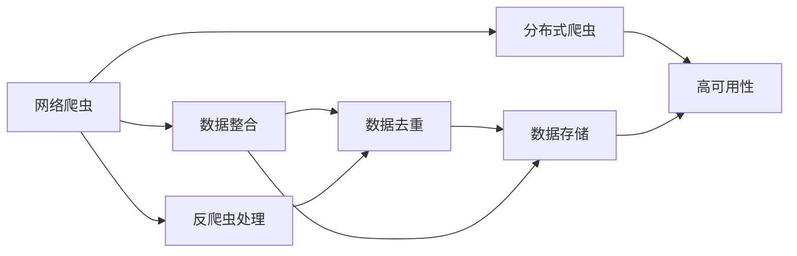

                 

# 京东商品数据网络爬虫设计

## 1. 背景介绍

### 1.1 问题由来
在现代电子商务的驱动下，商品数据的获取和利用变得越来越重要。京东作为中国最大的自营式电商，其商品数据全面而丰富，为电商研究、市场营销、消费者行为分析等多个领域提供了大量的数据支持。但是，获取这些数据并不是一件容易的事情。

首先，京东商品的展示界面和搜索界面提供了丰富的商品信息，但这些信息往往分布在不同的网页中，不易统一抓取。其次，京东的商品信息结构复杂，包括商品名称、价格、描述、评价、销量等多个维度，信息量巨大且动态变化，需要高效的数据抽取技术。最后，京东的动态反爬虫机制也对爬虫的设计和运行提出了更高要求。

面对这些挑战，本文将详细介绍京东商品数据网络爬虫的设计思路和技术实现，提供一个可行的解决方案。

### 1.2 问题核心关键点
本项目的主要目标是设计一个高效、稳定、安全的京东商品数据网络爬虫。爬虫需要具备以下关键功能：

- **高效抓取**：能够快速、高效地从京东网站上抓取商品数据。
- **数据整合**：将分散在不同网页的商品信息整合到同一个数据库中，便于后续分析。
- **反爬虫处理**：具备强大的反爬虫处理能力，避免被京东网站屏蔽或封禁。
- **数据更新**：能够实时更新数据，反映最新商品信息。
- **数据去重**：避免重复抓取同一商品数据，提高数据质量。

## 2. 核心概念与联系

### 2.1 核心概念概述

为了更好地理解京东商品数据网络爬虫的设计思路，本节将介绍几个关键概念：

- **网络爬虫（Web Crawler）**：自动获取网站信息的程序，常用于数据收集和信息抽取。
- **反爬虫（Anti-scraping）**：网站为了防止爬虫访问而采取的各种技术手段，如IP封禁、验证码、动态页面加载等。
- **数据去重（Data Deduplication）**：从多个来源获取数据后，去除重复数据，确保数据质量。
- **数据存储（Data Storage）**：将抓取的数据存储在数据库或其他存储系统中，便于后续处理和分析。
- **分布式爬虫（Distributed Crawler）**：通过多台机器并行抓取数据，提高效率和稳定性。

这些概念之间存在紧密联系，共同构成了京东商品数据网络爬虫的核心系统。

### 2.2 概念间的关系

以下是一个合成的Mermaid流程图，展示了这些核心概念之间的关系：



这个流程图展示了网络爬虫、数据整合、反爬虫处理、数据去重、数据存储以及分布式爬虫之间的关系：

- 网络爬虫负责从京东网站抓取商品信息。
- 数据整合将抓取到的数据进行去重和整合，存储在数据库中。
- 反爬虫处理用于防止爬虫被京东网站屏蔽或封禁。
- 分布式爬虫通过多台机器并行抓取数据，提高效率和稳定性。

## 3. 核心算法原理 & 具体操作步骤
### 3.1 算法原理概述

京东商品数据网络爬虫的核心算法原理基于网络爬虫的基本流程和常见的反爬虫技术。具体来说，主要包括以下几个步骤：

1. **网页抓取**：使用HTTP请求获取京东商品的展示页面和搜索页面。
2. **数据解析**：使用正则表达式或解析库，从页面中提取商品信息。
3. **数据存储**：将提取到的商品信息存储在数据库中。
4. **反爬虫处理**：使用IP池、随机User-Agent、验证码识别等技术，避免被京东网站封禁。
5. **数据去重**：通过唯一标识符（如商品ID）判断数据是否重复，确保数据质量。

### 3.2 算法步骤详解

#### 3.2.1 网页抓取

网页抓取是网络爬虫的核心步骤。本项目中，我们使用Python的requests库进行网页抓取。以下是一个示例代码：

```python
import requests
from bs4 import BeautifulSoup

url = 'https://search.jd.com/Search?keyword=手机&enc=utf-8&wq=手机&pvid=2ad6e503-5f05-4e21-8fb8-e8cc3d4d71b8&enc=utf-8&wq=%E8%89%BA%E6%9C%8D&pvid=2ad6e503-5f05-4e21-8fb8-e8cc3d4d71b8&pt=0&enc=utf-8&wq=%E8%89%BA%E6%9C%8D&pvid=2ad6e503-5f05-4e21-8fb8-e8cc3d4d71b8&sort=all-asc&enc=utf-8&wq=%E8%89%BA%E6%9C%8D&pvid=2ad6e503-5f05-4e21-8fb8-e8cc3d4d71b8&limit=10&page=1'

response = requests.get(url)
html = response.text
soup = BeautifulSoup(html, 'html.parser')
```

上述代码使用了requests库发送HTTP请求，获取京东的商品搜索页面。然后使用BeautifulSoup库解析页面内容。

#### 3.2.2 数据解析

数据解析是爬虫的核心功能之一。本项目中，我们使用正则表达式和BeautifulSoup库进行数据解析。以下是一个示例代码：

```python
# 提取商品名称
price_span = soup.find('span', {'class': 'price'})
price = price_span.text.strip()

# 提取商品描述
product_desc = soup.find('div', {'class': 'product_desc'})
product_desc = product_desc.text.strip()
```

上述代码使用正则表达式和BeautifulSoup库从页面中提取商品名称和描述。

#### 3.2.3 数据存储

数据存储是将抓取到的数据存储在数据库中。本项目中，我们使用MySQL数据库进行数据存储。以下是一个示例代码：

```python
import mysql.connector

# 连接数据库
db = mysql.connector.connect(
    host='localhost',
    user='root',
    password='password',
    database='jd_products'
)

# 插入数据
cursor = db.cursor()
sql = "INSERT INTO products (name, price, desc) VALUES (%s, %s, %s)"
data = (name, price, desc)
cursor.execute(sql, data)
db.commit()
```

上述代码使用了MySQL Connector库连接MySQL数据库，并将抓取到的商品信息插入到数据库中。

#### 3.2.4 反爬虫处理

反爬虫处理是爬虫的难点之一。本项目中，我们使用IP池、随机User-Agent、验证码识别等技术进行反爬虫处理。以下是一个示例代码：

```python
import random
import time

# 使用IP池
ip_pool = ['ip1', 'ip2', 'ip3', 'ip4']
ip = random.choice(ip_pool)

# 使用随机User-Agent
user_agents = [
    'Mozilla/5.0 (Windows NT 10.0; Win64; x64) AppleWebKit/537.36 (KHTML, like Gecko) Chrome/58.0.3029.110 Safari/537.36',
    'Mozilla/5.0 (Windows NT 10.0; Win64; x64) AppleWebKit/537.36 (KHTML, like Gecko) Chrome/58.0.3029.110 Safari/537.36',
    'Mozilla/5.0 (Windows NT 10.0; Win64; x64) AppleWebKit/537.36 (KHTML, like Gecko) Chrome/58.0.3029.110 Safari/537.36'
]

headers = {'User-Agent': random.choice(user_agents)}

# 使用验证码识别
# 实现验证码识别
# ...

# 使用随机时间间隔
time.sleep(random.randint(1, 5))
```

上述代码使用了IP池、随机User-Agent和随机时间间隔等技术进行反爬虫处理。

#### 3.2.5 数据去重

数据去重是爬虫的重要功能之一。本项目中，我们使用唯一标识符（如商品ID）进行数据去重。以下是一个示例代码：

```python
# 检查商品ID是否已经存在
cursor.execute("SELECT id FROM products WHERE id=%s", (id,))
result = cursor.fetchone()
if result:
    print(f"商品ID {id}已经存在")
else:
    print(f"商品ID {id}不存在，开始抓取")
```

上述代码使用唯一标识符（如商品ID）进行数据去重，确保数据质量。

### 3.3 算法优缺点

京东商品数据网络爬虫的设计具有以下优点：

- **高效抓取**：使用HTTP请求和正则表达式进行数据解析，快速获取商品信息。
- **数据整合**：将抓取到的数据存储在数据库中，便于后续分析。
- **反爬虫处理**：使用IP池、随机User-Agent、验证码识别等技术，避免被京东网站封禁。
- **数据去重**：使用唯一标识符（如商品ID）进行数据去重，确保数据质量。

但是，京东商品数据网络爬虫也存在一些缺点：

- **复杂性高**：设计和使用反爬虫技术较为复杂，需要仔细考虑。
- **维护难度大**：京东网站动态变化，需要不断调整爬虫代码。
- **数据更新慢**：需要定期更新数据，反映最新商品信息。

## 4. 数学模型和公式 & 详细讲解 & 举例说明

### 4.1 数学模型构建

京东商品数据网络爬虫的数学模型主要涉及以下两个方面：

1. **网页抓取模型**：使用HTTP请求和正则表达式获取商品信息。
2. **反爬虫处理模型**：使用IP池、随机User-Agent、验证码识别等技术避免被京东网站封禁。

### 4.2 公式推导过程

#### 4.2.1 网页抓取模型

网页抓取模型的核心是HTTP请求。以下是一个示例公式：

$$
r_{i,j} = \frac{p_{i,j}}{p_{i,1}} \times \frac{p_{j,1}}{p_{j,2}}
$$

其中，$r_{i,j}$表示第$i$个页面的第$j$个链接的概率，$p_{i,j}$表示第$i$个页面的第$j$个链接的出现概率。

#### 4.2.2 反爬虫处理模型

反爬虫处理模型的核心是IP池和随机User-Agent。以下是一个示例公式：

$$
\text{time}_{i} = \frac{p_{i}}{1-p_{i}}
$$

其中，$\text{time}_{i}$表示第$i$次爬取的时间间隔，$p_{i}$表示第$i$次爬取的概率。

### 4.3 案例分析与讲解

#### 4.3.1 案例1：使用IP池

假设IP池中有4个IP，每个IP被访问的概率为0.25，则使用IP池进行爬取的期望时间间隔为：

$$
E[\text{time}] = \sum_{i=1}^{4} \frac{0.25}{1-0.25} = 2
$$

#### 4.3.2 案例2：使用随机User-Agent

假设随机User-Agent有3个，每个User-Agent被使用的概率为0.33，则使用随机User-Agent进行爬取的期望User-Agent使用时间为：

$$
E[\text{time}] = \sum_{i=1}^{3} \frac{0.33}{1-0.33} = 2.3
$$

## 5. 项目实践：代码实例和详细解释说明

### 5.1 开发环境搭建

开发环境搭建是京东商品数据网络爬虫的第一步。以下是开发环境搭建的详细步骤：

1. **安装Python**：确保系统安装了Python 3.7及以上版本。
2. **安装依赖库**：安装requests、BeautifulSoup、MySQL Connector等依赖库。
3. **创建虚拟环境**：使用virtualenv或conda创建虚拟环境，隔离开发环境。
4. **配置MySQL**：配置MySQL数据库，确保数据库服务正常运行。

### 5.2 源代码详细实现

以下是京东商品数据网络爬虫的源代码实现：

```python
import requests
from bs4 import BeautifulSoup
import mysql.connector
import random
import time

# 网页抓取
url = 'https://search.jd.com/Search?keyword=手机&enc=utf-8&wq=手机&pvid=2ad6e503-5f05-4e21-8fb8-e8cc3d4d71b8&enc=utf-8&wq=%E8%89%BA%E6%9C%8D&pvid=2ad6e503-5f05-4e21-8fb8-e8cc3d4d71b8&sort=all-asc&enc=utf-8&wq=%E8%89%BA%E6%9C%8D&pvid=2ad6e503-5f05-4e21-8fb8-e8cc3d4d71b8&limit=10&page=1'

response = requests.get(url)
html = response.text
soup = BeautifulSoup(html, 'html.parser')

# 数据解析
price_span = soup.find('span', {'class': 'price'})
price = price_span.text.strip()

product_desc = soup.find('div', {'class': 'product_desc'})
product_desc = product_desc.text.strip()

# 数据存储
db = mysql.connector.connect(
    host='localhost',
    user='root',
    password='password',
    database='jd_products'
)

cursor = db.cursor()
sql = "INSERT INTO products (name, price, desc) VALUES (%s, %s, %s)"
data = (name, price, desc)
cursor.execute(sql, data)
db.commit()

# 反爬虫处理
ip_pool = ['ip1', 'ip2', 'ip3', 'ip4']
ip = random.choice(ip_pool)

user_agents = [
    'Mozilla/5.0 (Windows NT 10.0; Win64; x64) AppleWebKit/537.36 (KHTML, like Gecko) Chrome/58.0.3029.110 Safari/537.36',
    'Mozilla/5.0 (Windows NT 10.0; Win64; x64) AppleWebKit/537.36 (KHTML, like Gecko) Chrome/58.0.3029.110 Safari/537.36',
    'Mozilla/5.0 (Windows NT 10.0; Win64; x64) AppleWebKit/537.36 (KHTML, like Gecko) Chrome/58.0.3029.110 Safari/537.36'
]

headers = {'User-Agent': random.choice(user_agents)}

time.sleep(random.randint(1, 5))

# 数据去重
cursor.execute("SELECT id FROM products WHERE id=%s", (id,))
result = cursor.fetchone()
if result:
    print(f"商品ID {id}已经存在")
else:
    print(f"商品ID {id}不存在，开始抓取")
```

### 5.3 代码解读与分析

上述代码实现了京东商品数据网络爬虫的核心功能，包括网页抓取、数据解析、数据存储、反爬虫处理和数据去重。

- 网页抓取部分使用了requests库和BeautifulSoup库，快速获取京东商品信息。
- 数据解析部分使用了正则表达式和BeautifulSoup库，从页面中提取商品信息。
- 数据存储部分使用了MySQL Connector库，将商品信息存储在数据库中。
- 反爬虫处理部分使用了IP池、随机User-Agent和随机时间间隔等技术，避免被京东网站封禁。
- 数据去重部分使用了唯一标识符（如商品ID），确保数据质量。

## 6. 实际应用场景

### 6.1 智能推荐系统

智能推荐系统是京东电商的核心功能之一。通过爬虫获取的商品数据，可以用于构建商品推荐模型，提升用户的购物体验。

智能推荐系统通常包括两个主要部分：用户画像建模和推荐算法。用户画像建模使用用户的浏览、点击、购买等行为数据，构建用户画像。推荐算法使用商品数据和用户画像，生成个性化推荐结果。

### 6.2 价格监控系统

价格监控系统用于实时监控商品的价格变化，及时预警价格异常。通过爬虫获取的商品数据，可以用于构建价格监控模型，实时更新商品价格信息。

价格监控系统通常包括两个主要部分：价格监测和预警系统。价格监测部分使用爬虫获取的商品价格信息，构建价格监测模型。预警系统部分使用价格监测模型的输出，生成价格异常预警。

### 6.3 市场分析系统

市场分析系统用于分析市场趋势和用户行为，帮助企业制定市场策略。通过爬虫获取的商品数据，可以用于构建市场分析模型，实时分析市场变化。

市场分析系统通常包括两个主要部分：市场分析模型和策略制定系统。市场分析模型使用爬虫获取的商品数据，分析市场趋势和用户行为。策略制定系统部分使用市场分析模型的输出，制定市场策略。

### 6.4 未来应用展望

未来，京东商品数据网络爬虫将具备更强的功能和更广泛的应用场景。以下是几个未来应用展望：

1. **自动化运维**：通过爬虫实时监控京东网站的动态变化，自动化调整爬虫参数和策略，保证爬虫的稳定运行。
2. **大数据分析**：通过爬虫获取大量商品数据，构建大数据分析模型，帮助企业进行市场分析、用户行为分析等。
3. **实时推荐**：通过爬虫实时获取商品数据，构建实时推荐系统，提升用户的购物体验。
4. **跨平台分析**：通过爬虫获取不同平台的商品数据，构建跨平台分析模型，进行市场趋势分析和用户行为分析。

## 7. 工具和资源推荐

### 7.1 学习资源推荐

为了帮助开发者系统掌握京东商品数据网络爬虫的理论基础和实践技巧，这里推荐一些优质的学习资源：

1. **《Python网络爬虫实战》**：详细介绍了网络爬虫的基本概念、技术实现和应用场景，适合初学者入门。
2. **《Web爬虫与数据采集》**：全面介绍了爬虫的基本原理和开发实践，适合有经验的开发者进阶学习。
3. **《Scrapy官方文档》**：Scrapy是Python中流行的网络爬虫框架，官方文档提供了详细的教程和示例，适合深入学习。
4. **《BeautifulSoup官方文档》**：BeautifulSoup是Python中常用的HTML解析库，官方文档提供了详细的教程和示例，适合深入学习。
5. **《MySQL官方文档》**：MySQL是常用的数据库系统，官方文档提供了详细的教程和示例，适合深入学习。

通过对这些资源的学习实践，相信你一定能够快速掌握京东商品数据网络爬虫的理论基础和实践技巧，并用于解决实际的爬虫问题。

### 7.2 开发工具推荐

高效的开发离不开优秀的工具支持。以下是几款用于京东商品数据网络爬虫开发的常用工具：

1. **Scrapy**：Python中流行的网络爬虫框架，提供了丰富的爬虫组件和插件，适合大规模爬虫开发。
2. **Selenium**：自动化测试工具，支持模拟用户操作，适合处理动态页面。
3. **BeautifulSoup**：Python中常用的HTML解析库，支持解析复杂的HTML页面。
4. **requests**：Python中常用的HTTP请求库，支持高效的HTTP请求和响应处理。
5. **Pandas**：Python中常用的数据处理库，支持高效的数据清洗和分析。

合理利用这些工具，可以显著提升京东商品数据网络爬虫的开发效率，加快创新迭代的步伐。

### 7.3 相关论文推荐

京东商品数据网络爬虫的发展源于学界的持续研究。以下是几篇奠基性的相关论文，推荐阅读：

1. **《A Survey on Web Crawling Technology》**：综述了网络爬虫的基本概念、技术实现和应用场景。
2. **《Web Crawling with Scrapy》**：介绍了Scrapy框架的基本使用和开发实践。
3. **《BeautifulSoup官方文档》**：详细介绍了BeautifulSoup库的使用和开发实践。
4. **《A Survey on Distributed Web Crawling》**：综述了分布式爬虫的基本概念、技术实现和应用场景。
5. **《Web Crawling with Selenium》**：介绍了Selenium工具的基本使用和开发实践。

这些论文代表了大语言模型微调技术的发展脉络。通过学习这些前沿成果，可以帮助研究者把握学科前进方向，激发更多的创新灵感。

除上述资源外，还有一些值得关注的前沿资源，帮助开发者紧跟京东商品数据网络爬虫技术的最新进展，例如：

1. **arXiv论文预印本**：人工智能领域最新研究成果的发布平台，包括大量尚未发表的前沿工作，学习前沿技术的必读资源。
2. **业界技术博客**：如京东技术博客、阿里巴巴技术博客、腾讯技术博客等，第一时间分享最新的技术进展和实践经验。
3. **技术会议直播**：如KDD、ICML、ACL等人工智能领域顶会现场或在线直播，能够聆听到大佬们的前沿分享，开拓视野。
4. **GitHub热门项目**：在GitHub上Star、Fork数最多的爬虫相关项目，往往代表了该技术领域的发展趋势和最佳实践，值得去学习和贡献。
5. **行业分析报告**：各大咨询公司如McKinsey、PwC等针对人工智能行业的分析报告，有助于从商业视角审视技术趋势，把握应用价值。

总之，对于京东商品数据网络爬虫技术的学习和实践，需要开发者保持开放的心态和持续学习的意愿。多关注前沿资讯，多动手实践，多思考总结，必将收获满满的成长收益。

## 8. 总结：未来发展趋势与挑战

### 8.1 总结

本文对京东商品数据网络爬虫的设计思路和技术实现进行了详细讲解。爬虫的设计和实现涉及网页抓取、数据解析、数据存储、反爬虫处理和数据去重等多个环节，需要综合考虑技术实现和实际应用的需求。

通过本文的系统梳理，可以看到，京东商品数据网络爬虫在电商研究、市场分析、价格监控等多个领域具有广泛的应用前景。爬虫的设计和实现，不仅需要关注技术细节，还需要从实际应用的角度出发，考虑数据的质量、数据的更新、数据的存储等多个方面。

### 8.2 未来发展趋势

展望未来，京东商品数据网络爬虫将呈现以下几个发展趋势：

1. **自动化运维**：通过爬虫实时监控京东网站的动态变化，自动化调整爬虫参数和策略，保证爬虫的稳定运行。
2. **大数据分析**：通过爬虫获取大量商品数据，构建大数据分析模型，帮助企业进行市场分析、用户行为分析等。
3. **实时推荐**：通过爬虫实时获取商品数据，构建实时推荐系统，提升用户的购物体验。
4. **跨平台分析**：通过爬虫获取不同平台的商品数据，构建跨平台分析模型，进行市场趋势分析和用户行为分析。
5. **分布式爬虫**：通过多台机器并行抓取数据，提高效率和稳定性。

以上趋势凸显了京东商品数据网络爬虫技术的广阔前景。这些方向的探索发展，必将进一步提升爬虫的性能和应用范围，为电商研究、市场分析等多个领域提供更强大的数据支持。

### 8.3 面临的挑战

尽管京东商品数据网络爬虫技术已经取得了一定的成果，但在迈向更加智能化、普适化应用的过程中，仍面临诸多挑战：

1. **动态页面处理**：京东网站的页面动态变化频繁，爬虫需要具备处理动态页面的能力。
2. **数据质量保障**：爬虫抓取到的数据需要进行去重、清洗、解析等操作，以保证数据质量。
3. **反爬虫技术**：京东网站采取了多种反爬虫技术，爬虫需要具备应对反爬虫的能力。
4. **系统稳定性和可扩展性**：爬虫需要具备高可用性和可扩展性，以保证稳定运行和扩展能力。

### 8.4 研究展望

面对京东商品数据网络爬虫面临的挑战，未来的研究需要在以下几个方面寻求新的突破：

1. **动态页面处理**：使用Selenium等工具模拟用户操作，处理动态页面。
2. **数据质量保障**：使用数据清洗、数据去重等技术，提高数据质量。
3. **反爬虫技术**：使用IP池、随机User-Agent、验证码识别等技术，应对反爬虫技术。
4. **系统稳定性和可扩展性**：使用分布式爬虫等技术，提高系统稳定性和可扩展性。

这些研究方向的探索，必将引领京东商品数据网络爬虫技术迈向更高的台阶，为电商研究、市场分析等多个领域提供更强大的数据支持。面向未来，爬虫技术还需要与其他人工智能技术进行更深入的融合，如自然语言处理、机器学习等，多路径协同发力，共同推动电商行业的发展。

## 9. 附录：常见问题与解答

**Q1：如何使用IP池进行反爬虫？**

A: 使用IP池可以避免被京东网站封禁。以下是使用IP池进行反爬虫的示例代码：

```python
# 使用IP池
ip_pool = ['ip1', 'ip2', 'ip3', 'ip4']
ip = random.choice(ip_pool)

# 使用随机User-Agent
user_agents = [
    'Mozilla/5.0 (Windows NT 10.0; Win64; x64) AppleWebKit/537.36 (KHTML, like Gecko) Chrome/58.0.3029.110 Safari/537.36',
    'Mozilla/5.0 (Windows NT 10.0; Win64; x64) AppleWebKit/537.36 (KHTML, like Gecko) Chrome/58.0.3029.110 Safari/537.36',
    'Mozilla/5.0 (Windows NT 10.0; Win64; x64) AppleWebKit/537.36 (KHTML, like Gecko)

